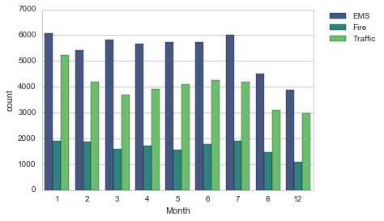

# 911 Calls Capstone Project

For this capstone project we will be analyzing some 911 call data from [Kaggle](https://www.kaggle.com/mchirico/montcoalert). The data contains the following fields:

* lat : String variable, Latitude
* lng: String variable, Longitude
* desc: String variable, Description of the Emergency Call
* zip: String variable, Zipcode
* title: String variable, Title
* timeStamp: String variable, YYYY-MM-DD HH:MM:SS
* twp: String variable, Township
* addr: String variable, Address
* e: String variable, Dummy variable (always 1)

Just go along with this notebook and try to complete the instructions or answer the questions in bold using your Python and Data Science skills!

## Data and Setup

____
** Import numpy and pandas **


```python
import numpy as np
```


```python

```

** Import visualization libraries and set %matplotlib inline. **


```python
import pandas as pd
import matplotlib.pyplot as plt
import seaborn as sns
%matplotlib inline
```


```python
from datetime import datetime
```


```python

```

** Read in the csv file as a dataframe called df **


```python
df = pd.read_csv('911.csv')
```


```python
df.head()
```


<div>
<style scoped>
    .dataframe tbody tr th:only-of-type {
        vertical-align: middle;
    }

    .dataframe tbody tr th {
        vertical-align: top;
    }

    .dataframe thead th {
        text-align: right;
    }
</style>
<table border="1" class="dataframe">
  <thead>
    <tr style="text-align: right;">
      <th></th>
      <th>lat</th>
      <th>lng</th>
      <th>desc</th>
      <th>zip</th>
      <th>title</th>
      <th>timeStamp</th>
      <th>twp</th>
      <th>addr</th>
      <th>e</th>
    </tr>
  </thead>
  <tbody>
    <tr>
      <th>0</th>
      <td>40.297876</td>
      <td>-75.581294</td>
      <td>REINDEER CT &amp; DEAD END;  NEW HANOVER; Station ...</td>
      <td>19525.0</td>
      <td>EMS: BACK PAINS/INJURY</td>
      <td>2015-12-10 17:40:00</td>
      <td>NEW HANOVER</td>
      <td>REINDEER CT &amp; DEAD END</td>
      <td>1</td>
    </tr>
    <tr>
      <th>1</th>
      <td>40.258061</td>
      <td>-75.264680</td>
      <td>BRIAR PATH &amp; WHITEMARSH LN;  HATFIELD TOWNSHIP...</td>
      <td>19446.0</td>
      <td>EMS: DIABETIC EMERGENCY</td>
      <td>2015-12-10 17:40:00</td>
      <td>HATFIELD TOWNSHIP</td>
      <td>BRIAR PATH &amp; WHITEMARSH LN</td>
      <td>1</td>
    </tr>
    <tr>
      <th>2</th>
      <td>40.121182</td>
      <td>-75.351975</td>
      <td>HAWS AVE; NORRISTOWN; 2015-12-10 @ 14:39:21-St...</td>
      <td>19401.0</td>
      <td>Fire: GAS-ODOR/LEAK</td>
      <td>2015-12-10 17:40:00</td>
      <td>NORRISTOWN</td>
      <td>HAWS AVE</td>
      <td>1</td>
    </tr>
    <tr>
      <th>3</th>
      <td>40.116153</td>
      <td>-75.343513</td>
      <td>AIRY ST &amp; SWEDE ST;  NORRISTOWN; Station 308A;...</td>
      <td>19401.0</td>
      <td>EMS: CARDIAC EMERGENCY</td>
      <td>2015-12-10 17:40:01</td>
      <td>NORRISTOWN</td>
      <td>AIRY ST &amp; SWEDE ST</td>
      <td>1</td>
    </tr>
    <tr>
      <th>4</th>
      <td>40.251492</td>
      <td>-75.603350</td>
      <td>CHERRYWOOD CT &amp; DEAD END;  LOWER POTTSGROVE; S...</td>
      <td>NaN</td>
      <td>EMS: DIZZINESS</td>
      <td>2015-12-10 17:40:01</td>
      <td>LOWER POTTSGROVE</td>
      <td>CHERRYWOOD CT &amp; DEAD END</td>
      <td>1</td>
    </tr>
  </tbody>
</table>
</div>


```python

```

** Check the info() of the df **


```python
df.info()
```

    <class 'pandas.core.frame.DataFrame'>
    RangeIndex: 99492 entries, 0 to 99491
    Data columns (total 9 columns):
     #   Column     Non-Null Count  Dtype  
    ---  ------     --------------  -----  
     0   lat        99492 non-null  float64
     1   lng        99492 non-null  float64
     2   desc       99492 non-null  object 
     3   zip        86637 non-null  float64
     4   title      99492 non-null  object 
     5   timeStamp  99492 non-null  object 
     6   twp        99449 non-null  object 
     7   addr       98973 non-null  object 
     8   e          99492 non-null  int64  
    dtypes: float64(3), int64(1), object(5)
    memory usage: 6.8+ MB
    


```python

```

    <class 'pandas.core.frame.DataFrame'>
    RangeIndex: 99492 entries, 0 to 99491
    Data columns (total 9 columns):
    lat          99492 non-null float64
    lng          99492 non-null float64
    desc         99492 non-null object
    zip          86637 non-null float64
    title        99492 non-null object
    timeStamp    99492 non-null object
    twp          99449 non-null object
    addr         98973 non-null object
    e            99492 non-null int64
    dtypes: float64(3), int64(1), object(5)
    memory usage: 6.8+ MB
    

** Check the head of df **


```python
df.head()
```


<div>
<style scoped>
    .dataframe tbody tr th:only-of-type {
        vertical-align: middle;
    }

    .dataframe tbody tr th {
        vertical-align: top;
    }

    .dataframe thead th {
        text-align: right;
    }
</style>
<table border="1" class="dataframe">
  <thead>
    <tr style="text-align: right;">
      <th></th>
      <th>lat</th>
      <th>lng</th>
      <th>desc</th>
      <th>zip</th>
      <th>title</th>
      <th>timeStamp</th>
      <th>twp</th>
      <th>addr</th>
      <th>e</th>
    </tr>
  </thead>
  <tbody>
    <tr>
      <th>0</th>
      <td>40.297876</td>
      <td>-75.581294</td>
      <td>REINDEER CT &amp; DEAD END;  NEW HANOVER; Station ...</td>
      <td>19525.0</td>
      <td>EMS: BACK PAINS/INJURY</td>
      <td>2015-12-10 17:40:00</td>
      <td>NEW HANOVER</td>
      <td>REINDEER CT &amp; DEAD END</td>
      <td>1</td>
    </tr>
    <tr>
      <th>1</th>
      <td>40.258061</td>
      <td>-75.264680</td>
      <td>BRIAR PATH &amp; WHITEMARSH LN;  HATFIELD TOWNSHIP...</td>
      <td>19446.0</td>
      <td>EMS: DIABETIC EMERGENCY</td>
      <td>2015-12-10 17:40:00</td>
      <td>HATFIELD TOWNSHIP</td>
      <td>BRIAR PATH &amp; WHITEMARSH LN</td>
      <td>1</td>
    </tr>
    <tr>
      <th>2</th>
      <td>40.121182</td>
      <td>-75.351975</td>
      <td>HAWS AVE; NORRISTOWN; 2015-12-10 @ 14:39:21-St...</td>
      <td>19401.0</td>
      <td>Fire: GAS-ODOR/LEAK</td>
      <td>2015-12-10 17:40:00</td>
      <td>NORRISTOWN</td>
      <td>HAWS AVE</td>
      <td>1</td>
    </tr>
    <tr>
      <th>3</th>
      <td>40.116153</td>
      <td>-75.343513</td>
      <td>AIRY ST &amp; SWEDE ST;  NORRISTOWN; Station 308A;...</td>
      <td>19401.0</td>
      <td>EMS: CARDIAC EMERGENCY</td>
      <td>2015-12-10 17:40:01</td>
      <td>NORRISTOWN</td>
      <td>AIRY ST &amp; SWEDE ST</td>
      <td>1</td>
    </tr>
    <tr>
      <th>4</th>
      <td>40.251492</td>
      <td>-75.603350</td>
      <td>CHERRYWOOD CT &amp; DEAD END;  LOWER POTTSGROVE; S...</td>
      <td>NaN</td>
      <td>EMS: DIZZINESS</td>
      <td>2015-12-10 17:40:01</td>
      <td>LOWER POTTSGROVE</td>
      <td>CHERRYWOOD CT &amp; DEAD END</td>
      <td>1</td>
    </tr>
  </tbody>
</table>
</div>


```python

```


<div>
<table border="1" class="dataframe">
  <thead>
    <tr style="text-align: right;">
      <th></th>
      <th>lat</th>
      <th>lng</th>
      <th>desc</th>
      <th>zip</th>
      <th>title</th>
      <th>timeStamp</th>
      <th>twp</th>
      <th>addr</th>
      <th>e</th>
      <th>Reason</th>
      <th>Hour</th>
      <th>Month</th>
      <th>Day of Week</th>
    </tr>
  </thead>
  <tbody>
    <tr>
      <th>0</th>
      <td>40.297876</td>
      <td>-75.581294</td>
      <td>REINDEER CT &amp; DEAD END;  NEW HANOVER; Station ...</td>
      <td>19525.0</td>
      <td>EMS: BACK PAINS/INJURY</td>
      <td>2015-12-10 17:40:00</td>
      <td>NEW HANOVER</td>
      <td>REINDEER CT &amp; DEAD END</td>
      <td>1</td>
      <td>EMS</td>
      <td>17</td>
      <td>12</td>
      <td>Thu</td>
    </tr>
    <tr>
      <th>1</th>
      <td>40.258061</td>
      <td>-75.264680</td>
      <td>BRIAR PATH &amp; WHITEMARSH LN;  HATFIELD TOWNSHIP...</td>
      <td>19446.0</td>
      <td>EMS: DIABETIC EMERGENCY</td>
      <td>2015-12-10 17:40:00</td>
      <td>HATFIELD TOWNSHIP</td>
      <td>BRIAR PATH &amp; WHITEMARSH LN</td>
      <td>1</td>
      <td>EMS</td>
      <td>17</td>
      <td>12</td>
      <td>Thu</td>
    </tr>
    <tr>
      <th>2</th>
      <td>40.121182</td>
      <td>-75.351975</td>
      <td>HAWS AVE; NORRISTOWN; 2015-12-10 @ 14:39:21-St...</td>
      <td>19401.0</td>
      <td>Fire: GAS-ODOR/LEAK</td>
      <td>2015-12-10 17:40:00</td>
      <td>NORRISTOWN</td>
      <td>HAWS AVE</td>
      <td>1</td>
      <td>Fire</td>
      <td>17</td>
      <td>12</td>
      <td>Thu</td>
    </tr>
  </tbody>
</table>
</div>


## Basic Questions

** What are the top 5 zipcodes for 911 calls? **


```python
df['zip'].value_counts().head(5)
```


    19401.0    6979
    19464.0    6643
    19403.0    4854
    19446.0    4748
    19406.0    3174
    Name: zip, dtype: int64


```python

```


```python

```


    19401.0    6979
    19464.0    6643
    19403.0    4854
    19446.0    4748
    19406.0    3174
    Name: zip, dtype: int64


** What are the top 5 townships (twp) for 911 calls? **


```python
df.value_counts('twp').head(5)
```


    twp
    LOWER MERION    8443
    ABINGTON        5977
    NORRISTOWN      5890
    UPPER MERION    5227
    CHELTENHAM      4575
    dtype: int64


```python

```


```python

```


    LOWER MERION    8443
    ABINGTON        5977
    NORRISTOWN      5890
    UPPER MERION    5227
    CHELTENHAM      4575
    Name: twp, dtype: int64


** Take a look at the 'title' column, how many unique title codes are there? **


```python
len(df['title'].unique())
```


    110


```python
df['title'].nunique()
```


    110


```python
df['title'].drop_duplicates().count()
```


    110


```python

```


```python

```


    110


## Creating new features

** In the titles column there are "Reasons/Departments" specified before the title code. These are EMS, Fire, and Traffic. Use .apply() with a custom lambda expression to create a new column called "Reason" that contains this string value.** 

**For example, if the title column value is EMS: BACK PAINS/INJURY , the Reason column value would be EMS. **


```python
df['title']
```


    0             EMS: BACK PAINS/INJURY
    1            EMS: DIABETIC EMERGENCY
    2                Fire: GAS-ODOR/LEAK
    3             EMS: CARDIAC EMERGENCY
    4                     EMS: DIZZINESS
                        ...             
    99487    Traffic: VEHICLE ACCIDENT -
    99488    Traffic: VEHICLE ACCIDENT -
    99489               EMS: FALL VICTIM
    99490           EMS: NAUSEA/VOMITING
    99491    Traffic: VEHICLE ACCIDENT -
    Name: title, Length: 99492, dtype: object


```python
x = df['title'].iloc[0]
```


```python
x
```


    'EMS: BACK PAINS/INJURY'


```python
x.split(':')[0]
```


    'EMS'


```python
df['Reason'] = df['title'].apply(lambda title: title.split(':')[0])
```


```python
df['Reason']
```


    0            EMS
    1            EMS
    2           Fire
    3            EMS
    4            EMS
              ...   
    99487    Traffic
    99488    Traffic
    99489        EMS
    99490        EMS
    99491    Traffic
    Name: Reason, Length: 99492, dtype: object


```python

```


```python
reason = df['title'].apply(lambda x: 'EMS' if 'ems' in x.lower() else ('Traffic' if 'traffic' in x.lower() else ( 'Fire' if 'fire' in x.lower() else '-'))).reset_index(name='reason')
```


```python
reason1 = reason['reason']
reason1
```


    0            EMS
    1            EMS
    2           Fire
    3            EMS
    4            EMS
              ...   
    99487    Traffic
    99488    Traffic
    99489        EMS
    99490        EMS
    99491    Traffic
    Name: reason, Length: 99492, dtype: object


```python
df
```


<div>
<style scoped>
    .dataframe tbody tr th:only-of-type {
        vertical-align: middle;
    }

    .dataframe tbody tr th {
        vertical-align: top;
    }

    .dataframe thead th {
        text-align: right;
    }
</style>
<table border="1" class="dataframe">
  <thead>
    <tr style="text-align: right;">
      <th></th>
      <th>lat</th>
      <th>lng</th>
      <th>desc</th>
      <th>zip</th>
      <th>title</th>
      <th>timeStamp</th>
      <th>twp</th>
      <th>addr</th>
      <th>e</th>
    </tr>
  </thead>
  <tbody>
    <tr>
      <th>0</th>
      <td>40.297876</td>
      <td>-75.581294</td>
      <td>REINDEER CT &amp; DEAD END;  NEW HANOVER; Station ...</td>
      <td>19525.0</td>
      <td>EMS: BACK PAINS/INJURY</td>
      <td>2015-12-10 17:40:00</td>
      <td>NEW HANOVER</td>
      <td>REINDEER CT &amp; DEAD END</td>
      <td>1</td>
    </tr>
    <tr>
      <th>1</th>
      <td>40.258061</td>
      <td>-75.264680</td>
      <td>BRIAR PATH &amp; WHITEMARSH LN;  HATFIELD TOWNSHIP...</td>
      <td>19446.0</td>
      <td>EMS: DIABETIC EMERGENCY</td>
      <td>2015-12-10 17:40:00</td>
      <td>HATFIELD TOWNSHIP</td>
      <td>BRIAR PATH &amp; WHITEMARSH LN</td>
      <td>1</td>
    </tr>
    <tr>
      <th>2</th>
      <td>40.121182</td>
      <td>-75.351975</td>
      <td>HAWS AVE; NORRISTOWN; 2015-12-10 @ 14:39:21-St...</td>
      <td>19401.0</td>
      <td>Fire: GAS-ODOR/LEAK</td>
      <td>2015-12-10 17:40:00</td>
      <td>NORRISTOWN</td>
      <td>HAWS AVE</td>
      <td>1</td>
    </tr>
    <tr>
      <th>3</th>
      <td>40.116153</td>
      <td>-75.343513</td>
      <td>AIRY ST &amp; SWEDE ST;  NORRISTOWN; Station 308A;...</td>
      <td>19401.0</td>
      <td>EMS: CARDIAC EMERGENCY</td>
      <td>2015-12-10 17:40:01</td>
      <td>NORRISTOWN</td>
      <td>AIRY ST &amp; SWEDE ST</td>
      <td>1</td>
    </tr>
    <tr>
      <th>4</th>
      <td>40.251492</td>
      <td>-75.603350</td>
      <td>CHERRYWOOD CT &amp; DEAD END;  LOWER POTTSGROVE; S...</td>
      <td>NaN</td>
      <td>EMS: DIZZINESS</td>
      <td>2015-12-10 17:40:01</td>
      <td>LOWER POTTSGROVE</td>
      <td>CHERRYWOOD CT &amp; DEAD END</td>
      <td>1</td>
    </tr>
    <tr>
      <th>...</th>
      <td>...</td>
      <td>...</td>
      <td>...</td>
      <td>...</td>
      <td>...</td>
      <td>...</td>
      <td>...</td>
      <td>...</td>
      <td>...</td>
    </tr>
    <tr>
      <th>99487</th>
      <td>40.132869</td>
      <td>-75.333515</td>
      <td>MARKLEY ST &amp; W LOGAN ST; NORRISTOWN; 2016-08-2...</td>
      <td>19401.0</td>
      <td>Traffic: VEHICLE ACCIDENT -</td>
      <td>2016-08-24 11:06:00</td>
      <td>NORRISTOWN</td>
      <td>MARKLEY ST &amp; W LOGAN ST</td>
      <td>1</td>
    </tr>
    <tr>
      <th>99488</th>
      <td>40.006974</td>
      <td>-75.289080</td>
      <td>LANCASTER AVE &amp; RITTENHOUSE PL; LOWER MERION; ...</td>
      <td>19003.0</td>
      <td>Traffic: VEHICLE ACCIDENT -</td>
      <td>2016-08-24 11:07:02</td>
      <td>LOWER MERION</td>
      <td>LANCASTER AVE &amp; RITTENHOUSE PL</td>
      <td>1</td>
    </tr>
    <tr>
      <th>99489</th>
      <td>40.115429</td>
      <td>-75.334679</td>
      <td>CHESTNUT ST &amp; WALNUT ST;  NORRISTOWN; Station ...</td>
      <td>19401.0</td>
      <td>EMS: FALL VICTIM</td>
      <td>2016-08-24 11:12:00</td>
      <td>NORRISTOWN</td>
      <td>CHESTNUT ST &amp; WALNUT ST</td>
      <td>1</td>
    </tr>
    <tr>
      <th>99490</th>
      <td>40.186431</td>
      <td>-75.192555</td>
      <td>WELSH RD &amp; WEBSTER LN;  HORSHAM; Station 352; ...</td>
      <td>19002.0</td>
      <td>EMS: NAUSEA/VOMITING</td>
      <td>2016-08-24 11:17:01</td>
      <td>HORSHAM</td>
      <td>WELSH RD &amp; WEBSTER LN</td>
      <td>1</td>
    </tr>
    <tr>
      <th>99491</th>
      <td>40.207055</td>
      <td>-75.317952</td>
      <td>MORRIS RD &amp; S BROAD ST; UPPER GWYNEDD; 2016-08...</td>
      <td>19446.0</td>
      <td>Traffic: VEHICLE ACCIDENT -</td>
      <td>2016-08-24 11:17:02</td>
      <td>UPPER GWYNEDD</td>
      <td>MORRIS RD &amp; S BROAD ST</td>
      <td>1</td>
    </tr>
  </tbody>
</table>
<p>99492 rows × 9 columns</p>
</div>


```python

df.insert(len(df.columns), 'reason', reason['reason'])
```


```python

```

** What is the most common Reason for a 911 call based off of this new column? **


```python
df['Reason'].value_counts()
```


    EMS        48877
    Traffic    35695
    Fire       14920
    Name: Reason, dtype: int64


```python
perCounts = reason['reason'].value_counts()
perCounts
```


    EMS        48879
    Traffic    35695
    Fire       14918
    Name: reason, dtype: int64


```python

```


    EMS        48877
    Traffic    35695
    Fire       14920
    Name: Reason, dtype: int64


** Now use seaborn to create a countplot of 911 calls by Reason. **


```python
sns.countplot(x='Reason',data=df, palette='viridis')
```


    <AxesSubplot:xlabel='Reason', ylabel='count'>


    

    


```python
sns.histplot(df['reason'])
```


    <AxesSubplot:xlabel='reason', ylabel='Count'>


    

    


```python

```


```python

```


    <matplotlib.axes._subplots.AxesSubplot at 0x12d3830b8>


    

    


___
** Now let us begin to focus on time information. What is the data type of the objects in the timeStamp column? **


```python
type(df['timeStamp'].iloc[0])
```


    str


```python
df.timeStamp.dtype # 모르겠다 체크
```


    dtype('O')


```python
df.head(5)
```


<div>
<style scoped>
    .dataframe tbody tr th:only-of-type {
        vertical-align: middle;
    }

    .dataframe tbody tr th {
        vertical-align: top;
    }

    .dataframe thead th {
        text-align: right;
    }
</style>
<table border="1" class="dataframe">
  <thead>
    <tr style="text-align: right;">
      <th></th>
      <th>lat</th>
      <th>lng</th>
      <th>desc</th>
      <th>zip</th>
      <th>title</th>
      <th>timeStamp</th>
      <th>twp</th>
      <th>addr</th>
      <th>e</th>
      <th>reason</th>
    </tr>
  </thead>
  <tbody>
    <tr>
      <th>0</th>
      <td>40.297876</td>
      <td>-75.581294</td>
      <td>REINDEER CT &amp; DEAD END;  NEW HANOVER; Station ...</td>
      <td>19525.0</td>
      <td>EMS: BACK PAINS/INJURY</td>
      <td>2015-12-10 17:40:00</td>
      <td>NEW HANOVER</td>
      <td>REINDEER CT &amp; DEAD END</td>
      <td>1</td>
      <td>EMS</td>
    </tr>
    <tr>
      <th>1</th>
      <td>40.258061</td>
      <td>-75.264680</td>
      <td>BRIAR PATH &amp; WHITEMARSH LN;  HATFIELD TOWNSHIP...</td>
      <td>19446.0</td>
      <td>EMS: DIABETIC EMERGENCY</td>
      <td>2015-12-10 17:40:00</td>
      <td>HATFIELD TOWNSHIP</td>
      <td>BRIAR PATH &amp; WHITEMARSH LN</td>
      <td>1</td>
      <td>EMS</td>
    </tr>
    <tr>
      <th>2</th>
      <td>40.121182</td>
      <td>-75.351975</td>
      <td>HAWS AVE; NORRISTOWN; 2015-12-10 @ 14:39:21-St...</td>
      <td>19401.0</td>
      <td>Fire: GAS-ODOR/LEAK</td>
      <td>2015-12-10 17:40:00</td>
      <td>NORRISTOWN</td>
      <td>HAWS AVE</td>
      <td>1</td>
      <td>Fire</td>
    </tr>
    <tr>
      <th>3</th>
      <td>40.116153</td>
      <td>-75.343513</td>
      <td>AIRY ST &amp; SWEDE ST;  NORRISTOWN; Station 308A;...</td>
      <td>19401.0</td>
      <td>EMS: CARDIAC EMERGENCY</td>
      <td>2015-12-10 17:40:01</td>
      <td>NORRISTOWN</td>
      <td>AIRY ST &amp; SWEDE ST</td>
      <td>1</td>
      <td>EMS</td>
    </tr>
    <tr>
      <th>4</th>
      <td>40.251492</td>
      <td>-75.603350</td>
      <td>CHERRYWOOD CT &amp; DEAD END;  LOWER POTTSGROVE; S...</td>
      <td>NaN</td>
      <td>EMS: DIZZINESS</td>
      <td>2015-12-10 17:40:01</td>
      <td>LOWER POTTSGROVE</td>
      <td>CHERRYWOOD CT &amp; DEAD END</td>
      <td>1</td>
      <td>EMS</td>
    </tr>
  </tbody>
</table>
</div>


```python

```


    str


** You should have seen that these timestamps are still strings. Use [pd.to_datetime](http://pandas.pydata.org/pandas-docs/stable/generated/pandas.to_datetime.html) to convert the column from strings to DateTime objects. **


```python
df['timeStamp'] = pd.to_datetime(df['timeStamp'])
```


```python
type(df['timeStamp'].iloc[0])
```


    pandas._libs.tslibs.timestamps.Timestamp


```python
df.insert(len(df.columns), 'timeStampDatetimeObject', df['timeStamp'].apply(lambda t: pd.to_datetime(t)))
```


```python
df.head()
```


<div>
<style scoped>
    .dataframe tbody tr th:only-of-type {
        vertical-align: middle;
    }

    .dataframe tbody tr th {
        vertical-align: top;
    }

    .dataframe thead th {
        text-align: right;
    }
</style>
<table border="1" class="dataframe">
  <thead>
    <tr style="text-align: right;">
      <th></th>
      <th>lat</th>
      <th>lng</th>
      <th>desc</th>
      <th>zip</th>
      <th>title</th>
      <th>timeStamp</th>
      <th>twp</th>
      <th>addr</th>
      <th>e</th>
      <th>reason</th>
      <th>timeStampStr</th>
      <th>timeStampDatetimeObject</th>
    </tr>
  </thead>
  <tbody>
    <tr>
      <th>0</th>
      <td>40.297876</td>
      <td>-75.581294</td>
      <td>REINDEER CT &amp; DEAD END;  NEW HANOVER; Station ...</td>
      <td>19525.0</td>
      <td>EMS: BACK PAINS/INJURY</td>
      <td>2015-12-10 17:40:00</td>
      <td>NEW HANOVER</td>
      <td>REINDEER CT &amp; DEAD END</td>
      <td>1</td>
      <td>EMS</td>
      <td>2015-12-10 17:40:00</td>
      <td>2015-12-10 17:40:00</td>
    </tr>
    <tr>
      <th>1</th>
      <td>40.258061</td>
      <td>-75.264680</td>
      <td>BRIAR PATH &amp; WHITEMARSH LN;  HATFIELD TOWNSHIP...</td>
      <td>19446.0</td>
      <td>EMS: DIABETIC EMERGENCY</td>
      <td>2015-12-10 17:40:00</td>
      <td>HATFIELD TOWNSHIP</td>
      <td>BRIAR PATH &amp; WHITEMARSH LN</td>
      <td>1</td>
      <td>EMS</td>
      <td>2015-12-10 17:40:00</td>
      <td>2015-12-10 17:40:00</td>
    </tr>
    <tr>
      <th>2</th>
      <td>40.121182</td>
      <td>-75.351975</td>
      <td>HAWS AVE; NORRISTOWN; 2015-12-10 @ 14:39:21-St...</td>
      <td>19401.0</td>
      <td>Fire: GAS-ODOR/LEAK</td>
      <td>2015-12-10 17:40:00</td>
      <td>NORRISTOWN</td>
      <td>HAWS AVE</td>
      <td>1</td>
      <td>Fire</td>
      <td>2015-12-10 17:40:00</td>
      <td>2015-12-10 17:40:00</td>
    </tr>
    <tr>
      <th>3</th>
      <td>40.116153</td>
      <td>-75.343513</td>
      <td>AIRY ST &amp; SWEDE ST;  NORRISTOWN; Station 308A;...</td>
      <td>19401.0</td>
      <td>EMS: CARDIAC EMERGENCY</td>
      <td>2015-12-10 17:40:01</td>
      <td>NORRISTOWN</td>
      <td>AIRY ST &amp; SWEDE ST</td>
      <td>1</td>
      <td>EMS</td>
      <td>2015-12-10 17:40:01</td>
      <td>2015-12-10 17:40:01</td>
    </tr>
    <tr>
      <th>4</th>
      <td>40.251492</td>
      <td>-75.603350</td>
      <td>CHERRYWOOD CT &amp; DEAD END;  LOWER POTTSGROVE; S...</td>
      <td>NaN</td>
      <td>EMS: DIZZINESS</td>
      <td>2015-12-10 17:40:01</td>
      <td>LOWER POTTSGROVE</td>
      <td>CHERRYWOOD CT &amp; DEAD END</td>
      <td>1</td>
      <td>EMS</td>
      <td>2015-12-10 17:40:01</td>
      <td>2015-12-10 17:40:01</td>
    </tr>
  </tbody>
</table>
</div>


```python
df.info()
```

    <class 'pandas.core.frame.DataFrame'>
    RangeIndex: 99492 entries, 0 to 99491
    Data columns (total 12 columns):
     #   Column                   Non-Null Count  Dtype         
    ---  ------                   --------------  -----         
     0   lat                      99492 non-null  float64       
     1   lng                      99492 non-null  float64       
     2   desc                     99492 non-null  object        
     3   zip                      86637 non-null  float64       
     4   title                    99492 non-null  object        
     5   timeStamp                99492 non-null  object        
     6   twp                      99449 non-null  object        
     7   addr                     98973 non-null  object        
     8   e                        99492 non-null  int64         
     9   reason                   99492 non-null  object        
     10  timeStampStr             99492 non-null  object        
     11  timeStampDatetimeObject  99492 non-null  datetime64[ns]
    dtypes: datetime64[ns](1), float64(3), int64(1), object(7)
    memory usage: 9.1+ MB
    


```python

```


    lat             float64
    lng             float64
    desc             object
    zip             float64
    title            object
    timeStamp        object
    twp              object
    addr             object
    e                 int64
    reason           object
    timeStampStr     object
    dtype: object


```python
df['timeStampDatetimeObject'].iloc[0].dayofweek
```


    3


```python

```

** You can now grab specific attributes from a Datetime object by calling them. For example:**

    time = df['timeStamp'].iloc[0]
    time.hour

**You can use Jupyter's tab method to explore the various attributes you can call. Now that the timestamp column are actually DateTime objects, use .apply() to create 3 new columns called Hour, Month, and Day of Week. You will create these columns based off of the timeStamp column, reference the solutions if you get stuck on this step.**


```python
time = df['timeStamp'].iloc[0]
time.hour
```


    17


```python
time
```


    Timestamp('2015-12-10 17:40:00')


```python
time.year
```


    2015


```python
df['Hour1'] = df['timeStamp'].apply(lambda time: time.hour)
df['Hour1']
```


    0        17
    1        17
    2        17
    3        17
    4        17
             ..
    99487    11
    99488    11
    99489    11
    99490    11
    99491    11
    Name: Hour1, Length: 99492, dtype: int64


```python
df['Month1'] = df['timeStamp'].apply(lambda time: time.month)
df['Day of Weeka'] = df['timeStamp'].apply(lambda time: time.dayofweek)
```


```python
df.head()
```


<div>
<style scoped>
    .dataframe tbody tr th:only-of-type {
        vertical-align: middle;
    }

    .dataframe tbody tr th {
        vertical-align: top;
    }

    .dataframe thead th {
        text-align: right;
    }
</style>
<table border="1" class="dataframe">
  <thead>
    <tr style="text-align: right;">
      <th></th>
      <th>lat</th>
      <th>lng</th>
      <th>desc</th>
      <th>zip</th>
      <th>title</th>
      <th>timeStamp</th>
      <th>twp</th>
      <th>addr</th>
      <th>e</th>
      <th>Reason</th>
      <th>Hour1</th>
      <th>Month1</th>
      <th>Day of Weeka</th>
    </tr>
  </thead>
  <tbody>
    <tr>
      <th>0</th>
      <td>40.297876</td>
      <td>-75.581294</td>
      <td>REINDEER CT &amp; DEAD END;  NEW HANOVER; Station ...</td>
      <td>19525.0</td>
      <td>EMS: BACK PAINS/INJURY</td>
      <td>2015-12-10 17:40:00</td>
      <td>NEW HANOVER</td>
      <td>REINDEER CT &amp; DEAD END</td>
      <td>1</td>
      <td>EMS</td>
      <td>17</td>
      <td>12</td>
      <td>3</td>
    </tr>
    <tr>
      <th>1</th>
      <td>40.258061</td>
      <td>-75.264680</td>
      <td>BRIAR PATH &amp; WHITEMARSH LN;  HATFIELD TOWNSHIP...</td>
      <td>19446.0</td>
      <td>EMS: DIABETIC EMERGENCY</td>
      <td>2015-12-10 17:40:00</td>
      <td>HATFIELD TOWNSHIP</td>
      <td>BRIAR PATH &amp; WHITEMARSH LN</td>
      <td>1</td>
      <td>EMS</td>
      <td>17</td>
      <td>12</td>
      <td>3</td>
    </tr>
    <tr>
      <th>2</th>
      <td>40.121182</td>
      <td>-75.351975</td>
      <td>HAWS AVE; NORRISTOWN; 2015-12-10 @ 14:39:21-St...</td>
      <td>19401.0</td>
      <td>Fire: GAS-ODOR/LEAK</td>
      <td>2015-12-10 17:40:00</td>
      <td>NORRISTOWN</td>
      <td>HAWS AVE</td>
      <td>1</td>
      <td>Fire</td>
      <td>17</td>
      <td>12</td>
      <td>3</td>
    </tr>
    <tr>
      <th>3</th>
      <td>40.116153</td>
      <td>-75.343513</td>
      <td>AIRY ST &amp; SWEDE ST;  NORRISTOWN; Station 308A;...</td>
      <td>19401.0</td>
      <td>EMS: CARDIAC EMERGENCY</td>
      <td>2015-12-10 17:40:01</td>
      <td>NORRISTOWN</td>
      <td>AIRY ST &amp; SWEDE ST</td>
      <td>1</td>
      <td>EMS</td>
      <td>17</td>
      <td>12</td>
      <td>3</td>
    </tr>
    <tr>
      <th>4</th>
      <td>40.251492</td>
      <td>-75.603350</td>
      <td>CHERRYWOOD CT &amp; DEAD END;  LOWER POTTSGROVE; S...</td>
      <td>NaN</td>
      <td>EMS: DIZZINESS</td>
      <td>2015-12-10 17:40:01</td>
      <td>LOWER POTTSGROVE</td>
      <td>CHERRYWOOD CT &amp; DEAD END</td>
      <td>1</td>
      <td>EMS</td>
      <td>17</td>
      <td>12</td>
      <td>3</td>
    </tr>
  </tbody>
</table>
</div>


```python

```


```python
df.insert(len(df.columns), 'hour', df['timeStampDatetimeObject'].apply(lambda t: t.hour))
```


```python

df.insert(len(df.columns), 'Month', df['timeStampDatetimeObject'].apply(lambda t: t.month))
df.insert(len(df.columns), 'dayofweek', df['timeStampDatetimeObject'].apply(lambda t: t.dayofweek))
```


```python
df.head()
```


<div>
<style scoped>
    .dataframe tbody tr th:only-of-type {
        vertical-align: middle;
    }

    .dataframe tbody tr th {
        vertical-align: top;
    }

    .dataframe thead th {
        text-align: right;
    }
</style>
<table border="1" class="dataframe">
  <thead>
    <tr style="text-align: right;">
      <th></th>
      <th>lat</th>
      <th>lng</th>
      <th>desc</th>
      <th>zip</th>
      <th>title</th>
      <th>timeStamp</th>
      <th>twp</th>
      <th>addr</th>
      <th>e</th>
      <th>reason</th>
      <th>timeStampStr</th>
      <th>timeStampDatetimeObject</th>
      <th>hour</th>
      <th>Month</th>
      <th>dayofweek</th>
    </tr>
  </thead>
  <tbody>
    <tr>
      <th>0</th>
      <td>40.297876</td>
      <td>-75.581294</td>
      <td>REINDEER CT &amp; DEAD END;  NEW HANOVER; Station ...</td>
      <td>19525.0</td>
      <td>EMS: BACK PAINS/INJURY</td>
      <td>2015-12-10 17:40:00</td>
      <td>NEW HANOVER</td>
      <td>REINDEER CT &amp; DEAD END</td>
      <td>1</td>
      <td>EMS</td>
      <td>2015-12-10 17:40:00</td>
      <td>2015-12-10 17:40:00</td>
      <td>17</td>
      <td>12</td>
      <td>3</td>
    </tr>
    <tr>
      <th>1</th>
      <td>40.258061</td>
      <td>-75.264680</td>
      <td>BRIAR PATH &amp; WHITEMARSH LN;  HATFIELD TOWNSHIP...</td>
      <td>19446.0</td>
      <td>EMS: DIABETIC EMERGENCY</td>
      <td>2015-12-10 17:40:00</td>
      <td>HATFIELD TOWNSHIP</td>
      <td>BRIAR PATH &amp; WHITEMARSH LN</td>
      <td>1</td>
      <td>EMS</td>
      <td>2015-12-10 17:40:00</td>
      <td>2015-12-10 17:40:00</td>
      <td>17</td>
      <td>12</td>
      <td>3</td>
    </tr>
    <tr>
      <th>2</th>
      <td>40.121182</td>
      <td>-75.351975</td>
      <td>HAWS AVE; NORRISTOWN; 2015-12-10 @ 14:39:21-St...</td>
      <td>19401.0</td>
      <td>Fire: GAS-ODOR/LEAK</td>
      <td>2015-12-10 17:40:00</td>
      <td>NORRISTOWN</td>
      <td>HAWS AVE</td>
      <td>1</td>
      <td>Fire</td>
      <td>2015-12-10 17:40:00</td>
      <td>2015-12-10 17:40:00</td>
      <td>17</td>
      <td>12</td>
      <td>3</td>
    </tr>
    <tr>
      <th>3</th>
      <td>40.116153</td>
      <td>-75.343513</td>
      <td>AIRY ST &amp; SWEDE ST;  NORRISTOWN; Station 308A;...</td>
      <td>19401.0</td>
      <td>EMS: CARDIAC EMERGENCY</td>
      <td>2015-12-10 17:40:01</td>
      <td>NORRISTOWN</td>
      <td>AIRY ST &amp; SWEDE ST</td>
      <td>1</td>
      <td>EMS</td>
      <td>2015-12-10 17:40:01</td>
      <td>2015-12-10 17:40:01</td>
      <td>17</td>
      <td>12</td>
      <td>3</td>
    </tr>
    <tr>
      <th>4</th>
      <td>40.251492</td>
      <td>-75.603350</td>
      <td>CHERRYWOOD CT &amp; DEAD END;  LOWER POTTSGROVE; S...</td>
      <td>NaN</td>
      <td>EMS: DIZZINESS</td>
      <td>2015-12-10 17:40:01</td>
      <td>LOWER POTTSGROVE</td>
      <td>CHERRYWOOD CT &amp; DEAD END</td>
      <td>1</td>
      <td>EMS</td>
      <td>2015-12-10 17:40:01</td>
      <td>2015-12-10 17:40:01</td>
      <td>17</td>
      <td>12</td>
      <td>3</td>
    </tr>
  </tbody>
</table>
</div>


```python

```

** Notice how the Day of Week is an integer 0-6. Use the .map() with this dictionary to map the actual string names to the day of the week: **

    dmap = {0:'Mon',1:'Tue',2:'Wed',3:'Thu',4:'Fri',5:'Sat',6:'Sun'}


```python

```


```python
dmap = {0:'Mon',1:'Tue',2:'Wed',3:'Thu',4:'Fri',5:'Sat',6:'Sun'}
```


```python
df['Day of Weeka']
```


    0        3
    1        3
    2        3
    3        3
    4        3
            ..
    99487    2
    99488    2
    99489    2
    99490    2
    99491    2
    Name: Day of Weeka, Length: 99492, dtype: int64


```python
dmap
```


    {0: 'Mon', 1: 'Tue', 2: 'Wed', 3: 'Thu', 4: 'Fri', 5: 'Sat', 6: 'Sun'}


```python
df['Day of Weeka'] = df['Day of Weeka'].map(dmap)
```


```python
df.head()
```


<div>
<style scoped>
    .dataframe tbody tr th:only-of-type {
        vertical-align: middle;
    }

    .dataframe tbody tr th {
        vertical-align: top;
    }

    .dataframe thead th {
        text-align: right;
    }
</style>
<table border="1" class="dataframe">
  <thead>
    <tr style="text-align: right;">
      <th></th>
      <th>lat</th>
      <th>lng</th>
      <th>desc</th>
      <th>zip</th>
      <th>title</th>
      <th>timeStamp</th>
      <th>twp</th>
      <th>addr</th>
      <th>e</th>
      <th>Reason</th>
      <th>Hour1</th>
      <th>Month1</th>
      <th>Day of Weeka</th>
    </tr>
  </thead>
  <tbody>
    <tr>
      <th>0</th>
      <td>40.297876</td>
      <td>-75.581294</td>
      <td>REINDEER CT &amp; DEAD END;  NEW HANOVER; Station ...</td>
      <td>19525.0</td>
      <td>EMS: BACK PAINS/INJURY</td>
      <td>2015-12-10 17:40:00</td>
      <td>NEW HANOVER</td>
      <td>REINDEER CT &amp; DEAD END</td>
      <td>1</td>
      <td>EMS</td>
      <td>17</td>
      <td>12</td>
      <td>Thu</td>
    </tr>
    <tr>
      <th>1</th>
      <td>40.258061</td>
      <td>-75.264680</td>
      <td>BRIAR PATH &amp; WHITEMARSH LN;  HATFIELD TOWNSHIP...</td>
      <td>19446.0</td>
      <td>EMS: DIABETIC EMERGENCY</td>
      <td>2015-12-10 17:40:00</td>
      <td>HATFIELD TOWNSHIP</td>
      <td>BRIAR PATH &amp; WHITEMARSH LN</td>
      <td>1</td>
      <td>EMS</td>
      <td>17</td>
      <td>12</td>
      <td>Thu</td>
    </tr>
    <tr>
      <th>2</th>
      <td>40.121182</td>
      <td>-75.351975</td>
      <td>HAWS AVE; NORRISTOWN; 2015-12-10 @ 14:39:21-St...</td>
      <td>19401.0</td>
      <td>Fire: GAS-ODOR/LEAK</td>
      <td>2015-12-10 17:40:00</td>
      <td>NORRISTOWN</td>
      <td>HAWS AVE</td>
      <td>1</td>
      <td>Fire</td>
      <td>17</td>
      <td>12</td>
      <td>Thu</td>
    </tr>
    <tr>
      <th>3</th>
      <td>40.116153</td>
      <td>-75.343513</td>
      <td>AIRY ST &amp; SWEDE ST;  NORRISTOWN; Station 308A;...</td>
      <td>19401.0</td>
      <td>EMS: CARDIAC EMERGENCY</td>
      <td>2015-12-10 17:40:01</td>
      <td>NORRISTOWN</td>
      <td>AIRY ST &amp; SWEDE ST</td>
      <td>1</td>
      <td>EMS</td>
      <td>17</td>
      <td>12</td>
      <td>Thu</td>
    </tr>
    <tr>
      <th>4</th>
      <td>40.251492</td>
      <td>-75.603350</td>
      <td>CHERRYWOOD CT &amp; DEAD END;  LOWER POTTSGROVE; S...</td>
      <td>NaN</td>
      <td>EMS: DIZZINESS</td>
      <td>2015-12-10 17:40:01</td>
      <td>LOWER POTTSGROVE</td>
      <td>CHERRYWOOD CT &amp; DEAD END</td>
      <td>1</td>
      <td>EMS</td>
      <td>17</td>
      <td>12</td>
      <td>Thu</td>
    </tr>
  </tbody>
</table>
</div>


```python

```


```python
dmap[df['dayofweek'][0]]
df.insert(len(df.columns), 'DayOfWeek', df['dayofweek'].apply(lambda d: dmap[d]))
```


```python
df
```


<div>
<style scoped>
    .dataframe tbody tr th:only-of-type {
        vertical-align: middle;
    }

    .dataframe tbody tr th {
        vertical-align: top;
    }

    .dataframe thead th {
        text-align: right;
    }
</style>
<table border="1" class="dataframe">
  <thead>
    <tr style="text-align: right;">
      <th></th>
      <th>lat</th>
      <th>lng</th>
      <th>desc</th>
      <th>zip</th>
      <th>title</th>
      <th>timeStamp</th>
      <th>twp</th>
      <th>addr</th>
      <th>e</th>
      <th>reason</th>
      <th>timeStampStr</th>
      <th>timeStampDatetimeObject</th>
      <th>hour</th>
      <th>Month</th>
      <th>dayofweek</th>
      <th>DayOfWeek</th>
    </tr>
  </thead>
  <tbody>
    <tr>
      <th>0</th>
      <td>40.297876</td>
      <td>-75.581294</td>
      <td>REINDEER CT &amp; DEAD END;  NEW HANOVER; Station ...</td>
      <td>19525.0</td>
      <td>EMS: BACK PAINS/INJURY</td>
      <td>2015-12-10 17:40:00</td>
      <td>NEW HANOVER</td>
      <td>REINDEER CT &amp; DEAD END</td>
      <td>1</td>
      <td>EMS</td>
      <td>2015-12-10 17:40:00</td>
      <td>2015-12-10 17:40:00</td>
      <td>17</td>
      <td>12</td>
      <td>3</td>
      <td>Thu</td>
    </tr>
    <tr>
      <th>1</th>
      <td>40.258061</td>
      <td>-75.264680</td>
      <td>BRIAR PATH &amp; WHITEMARSH LN;  HATFIELD TOWNSHIP...</td>
      <td>19446.0</td>
      <td>EMS: DIABETIC EMERGENCY</td>
      <td>2015-12-10 17:40:00</td>
      <td>HATFIELD TOWNSHIP</td>
      <td>BRIAR PATH &amp; WHITEMARSH LN</td>
      <td>1</td>
      <td>EMS</td>
      <td>2015-12-10 17:40:00</td>
      <td>2015-12-10 17:40:00</td>
      <td>17</td>
      <td>12</td>
      <td>3</td>
      <td>Thu</td>
    </tr>
    <tr>
      <th>2</th>
      <td>40.121182</td>
      <td>-75.351975</td>
      <td>HAWS AVE; NORRISTOWN; 2015-12-10 @ 14:39:21-St...</td>
      <td>19401.0</td>
      <td>Fire: GAS-ODOR/LEAK</td>
      <td>2015-12-10 17:40:00</td>
      <td>NORRISTOWN</td>
      <td>HAWS AVE</td>
      <td>1</td>
      <td>Fire</td>
      <td>2015-12-10 17:40:00</td>
      <td>2015-12-10 17:40:00</td>
      <td>17</td>
      <td>12</td>
      <td>3</td>
      <td>Thu</td>
    </tr>
    <tr>
      <th>3</th>
      <td>40.116153</td>
      <td>-75.343513</td>
      <td>AIRY ST &amp; SWEDE ST;  NORRISTOWN; Station 308A;...</td>
      <td>19401.0</td>
      <td>EMS: CARDIAC EMERGENCY</td>
      <td>2015-12-10 17:40:01</td>
      <td>NORRISTOWN</td>
      <td>AIRY ST &amp; SWEDE ST</td>
      <td>1</td>
      <td>EMS</td>
      <td>2015-12-10 17:40:01</td>
      <td>2015-12-10 17:40:01</td>
      <td>17</td>
      <td>12</td>
      <td>3</td>
      <td>Thu</td>
    </tr>
    <tr>
      <th>4</th>
      <td>40.251492</td>
      <td>-75.603350</td>
      <td>CHERRYWOOD CT &amp; DEAD END;  LOWER POTTSGROVE; S...</td>
      <td>NaN</td>
      <td>EMS: DIZZINESS</td>
      <td>2015-12-10 17:40:01</td>
      <td>LOWER POTTSGROVE</td>
      <td>CHERRYWOOD CT &amp; DEAD END</td>
      <td>1</td>
      <td>EMS</td>
      <td>2015-12-10 17:40:01</td>
      <td>2015-12-10 17:40:01</td>
      <td>17</td>
      <td>12</td>
      <td>3</td>
      <td>Thu</td>
    </tr>
    <tr>
      <th>...</th>
      <td>...</td>
      <td>...</td>
      <td>...</td>
      <td>...</td>
      <td>...</td>
      <td>...</td>
      <td>...</td>
      <td>...</td>
      <td>...</td>
      <td>...</td>
      <td>...</td>
      <td>...</td>
      <td>...</td>
      <td>...</td>
      <td>...</td>
      <td>...</td>
    </tr>
    <tr>
      <th>99487</th>
      <td>40.132869</td>
      <td>-75.333515</td>
      <td>MARKLEY ST &amp; W LOGAN ST; NORRISTOWN; 2016-08-2...</td>
      <td>19401.0</td>
      <td>Traffic: VEHICLE ACCIDENT -</td>
      <td>2016-08-24 11:06:00</td>
      <td>NORRISTOWN</td>
      <td>MARKLEY ST &amp; W LOGAN ST</td>
      <td>1</td>
      <td>Traffic</td>
      <td>2016-08-24 11:06:00</td>
      <td>2016-08-24 11:06:00</td>
      <td>11</td>
      <td>8</td>
      <td>2</td>
      <td>Wed</td>
    </tr>
    <tr>
      <th>99488</th>
      <td>40.006974</td>
      <td>-75.289080</td>
      <td>LANCASTER AVE &amp; RITTENHOUSE PL; LOWER MERION; ...</td>
      <td>19003.0</td>
      <td>Traffic: VEHICLE ACCIDENT -</td>
      <td>2016-08-24 11:07:02</td>
      <td>LOWER MERION</td>
      <td>LANCASTER AVE &amp; RITTENHOUSE PL</td>
      <td>1</td>
      <td>Traffic</td>
      <td>2016-08-24 11:07:02</td>
      <td>2016-08-24 11:07:02</td>
      <td>11</td>
      <td>8</td>
      <td>2</td>
      <td>Wed</td>
    </tr>
    <tr>
      <th>99489</th>
      <td>40.115429</td>
      <td>-75.334679</td>
      <td>CHESTNUT ST &amp; WALNUT ST;  NORRISTOWN; Station ...</td>
      <td>19401.0</td>
      <td>EMS: FALL VICTIM</td>
      <td>2016-08-24 11:12:00</td>
      <td>NORRISTOWN</td>
      <td>CHESTNUT ST &amp; WALNUT ST</td>
      <td>1</td>
      <td>EMS</td>
      <td>2016-08-24 11:12:00</td>
      <td>2016-08-24 11:12:00</td>
      <td>11</td>
      <td>8</td>
      <td>2</td>
      <td>Wed</td>
    </tr>
    <tr>
      <th>99490</th>
      <td>40.186431</td>
      <td>-75.192555</td>
      <td>WELSH RD &amp; WEBSTER LN;  HORSHAM; Station 352; ...</td>
      <td>19002.0</td>
      <td>EMS: NAUSEA/VOMITING</td>
      <td>2016-08-24 11:17:01</td>
      <td>HORSHAM</td>
      <td>WELSH RD &amp; WEBSTER LN</td>
      <td>1</td>
      <td>EMS</td>
      <td>2016-08-24 11:17:01</td>
      <td>2016-08-24 11:17:01</td>
      <td>11</td>
      <td>8</td>
      <td>2</td>
      <td>Wed</td>
    </tr>
    <tr>
      <th>99491</th>
      <td>40.207055</td>
      <td>-75.317952</td>
      <td>MORRIS RD &amp; S BROAD ST; UPPER GWYNEDD; 2016-08...</td>
      <td>19446.0</td>
      <td>Traffic: VEHICLE ACCIDENT -</td>
      <td>2016-08-24 11:17:02</td>
      <td>UPPER GWYNEDD</td>
      <td>MORRIS RD &amp; S BROAD ST</td>
      <td>1</td>
      <td>Traffic</td>
      <td>2016-08-24 11:17:02</td>
      <td>2016-08-24 11:17:02</td>
      <td>11</td>
      <td>8</td>
      <td>2</td>
      <td>Wed</td>
    </tr>
  </tbody>
</table>
<p>99492 rows × 16 columns</p>
</div>


```python

```

** Now use seaborn to create a countplot of the Day of Week column with the hue based off of the Reason column. **


```python
sns.countplot(x='Day of Weeka', data=df, hue='Reason', palette='viridis')
plt.legend(loc=2, borderaxespad=0., bbox_to_anchor=(1.05, 1))
```


    <matplotlib.legend.Legend at 0x219d9bdf730>


    

    


```python
sns.countplot(x='Month1', data=df, hue='Reason', palette='viridis')
plt.legend(loc=2, borderaxespad=0., bbox_to_anchor=(1.05, 1))
```


    <matplotlib.legend.Legend at 0x24b99592280>


    

    


```python
sns.countplot(x='DayOfWeek', hue='reason', data=df)
plt.legend(loc='upper right', title='reason', bbox_to_anchor=(1.25, 1))
```


    <matplotlib.legend.Legend at 0x1f4ecd31760>


    

    


```python

```


    <matplotlib.legend.Legend at 0x12f614048>


    

    


**Now do the same for Month:**


```python
sns.countplot(x='Month', hue='reason', data=df)
plt.legend(loc='upper right', title='reason', bbox_to_anchor=(1.25, 1))
```


    ---------------------------------------------------------------------------

    ValueError                                Traceback (most recent call last)

    C:\Users\PILHON~1\AppData\Local\Temp/ipykernel_26248/4172266932.py in <module>
    ----> 1 sns.countplot(x='Month', hue='reason', data=df)
          2 plt.legend(loc='upper right', title='reason', bbox_to_anchor=(1.25, 1))
    

    C:\ProgramData\Anaconda3\lib\site-packages\seaborn\_decorators.py in inner_f(*args, **kwargs)
         44             )
         45         kwargs.update({k: arg for k, arg in zip(sig.parameters, args)})
    ---> 46         return f(**kwargs)
         47     return inner_f
         48 
    

    C:\ProgramData\Anaconda3\lib\site-packages\seaborn\categorical.py in countplot(x, y, hue, data, order, hue_order, orient, color, palette, saturation, dodge, ax, **kwargs)
       3596         raise ValueError("Cannot pass values for both `x` and `y`")
       3597 
    -> 3598     plotter = _CountPlotter(
       3599         x, y, hue, data, order, hue_order,
       3600         estimator, ci, n_boot, units, seed,
    

    C:\ProgramData\Anaconda3\lib\site-packages\seaborn\categorical.py in __init__(self, x, y, hue, data, order, hue_order, estimator, ci, n_boot, units, seed, orient, color, palette, saturation, errcolor, errwidth, capsize, dodge)
       1582                  errwidth, capsize, dodge):
       1583         """Initialize the plotter."""
    -> 1584         self.establish_variables(x, y, hue, data, orient,
       1585                                  order, hue_order, units)
       1586         self.establish_colors(color, palette, saturation)
    

    C:\ProgramData\Anaconda3\lib\site-packages\seaborn\categorical.py in establish_variables(self, x, y, hue, data, orient, order, hue_order, units)
        151                 if isinstance(var, str):
        152                     err = "Could not interpret input '{}'".format(var)
    --> 153                     raise ValueError(err)
        154 
        155             # Figure out the plotting orientation
    

    ValueError: Could not interpret input 'Month'


```python

```


    <matplotlib.legend.Legend at 0x10330ada0>


    

    


**Did you notice something strange about the Plot?**

_____

** You should have noticed it was missing some Months, let's see if we can maybe fill in this information by plotting the information in another way, possibly a simple line plot that fills in the missing months, in order to do this, we'll need to do some work with pandas... **

** Now create a gropuby object called byMonth, where you group the DataFrame by the month column and use the count() method for aggregation. Use the head() method on this returned DataFrame. **


```python
byMonth = df.groupby('Month1').count()
```


```python

```


<div>
<table border="1" class="dataframe">
  <thead>
    <tr style="text-align: right;">
      <th></th>
      <th>lat</th>
      <th>lng</th>
      <th>desc</th>
      <th>zip</th>
      <th>title</th>
      <th>timeStamp</th>
      <th>twp</th>
      <th>addr</th>
      <th>e</th>
      <th>Reason</th>
      <th>Hour</th>
      <th>Day of Week</th>
    </tr>
    <tr>
      <th>Month</th>
      <th></th>
      <th></th>
      <th></th>
      <th></th>
      <th></th>
      <th></th>
      <th></th>
      <th></th>
      <th></th>
      <th></th>
      <th></th>
      <th></th>
    </tr>
  </thead>
  <tbody>
    <tr>
      <th>1</th>
      <td>13205</td>
      <td>13205</td>
      <td>13205</td>
      <td>11527</td>
      <td>13205</td>
      <td>13205</td>
      <td>13203</td>
      <td>13096</td>
      <td>13205</td>
      <td>13205</td>
      <td>13205</td>
      <td>13205</td>
    </tr>
    <tr>
      <th>2</th>
      <td>11467</td>
      <td>11467</td>
      <td>11467</td>
      <td>9930</td>
      <td>11467</td>
      <td>11467</td>
      <td>11465</td>
      <td>11396</td>
      <td>11467</td>
      <td>11467</td>
      <td>11467</td>
      <td>11467</td>
    </tr>
    <tr>
      <th>3</th>
      <td>11101</td>
      <td>11101</td>
      <td>11101</td>
      <td>9755</td>
      <td>11101</td>
      <td>11101</td>
      <td>11092</td>
      <td>11059</td>
      <td>11101</td>
      <td>11101</td>
      <td>11101</td>
      <td>11101</td>
    </tr>
    <tr>
      <th>4</th>
      <td>11326</td>
      <td>11326</td>
      <td>11326</td>
      <td>9895</td>
      <td>11326</td>
      <td>11326</td>
      <td>11323</td>
      <td>11283</td>
      <td>11326</td>
      <td>11326</td>
      <td>11326</td>
      <td>11326</td>
    </tr>
    <tr>
      <th>5</th>
      <td>11423</td>
      <td>11423</td>
      <td>11423</td>
      <td>9946</td>
      <td>11423</td>
      <td>11423</td>
      <td>11420</td>
      <td>11378</td>
      <td>11423</td>
      <td>11423</td>
      <td>11423</td>
      <td>11423</td>
    </tr>
  </tbody>
</table>
</div>


** Now create a simple plot off of the dataframe indicating the count of calls per month. **


```python
month = df.groupby('Month').count()
```


```python
plt.grid()
sns.lineplot(data=month, x="Month", y="title")
```


    ---------------------------------------------------------------------------

    NameError                                 Traceback (most recent call last)

    C:\Users\PILHON~1\AppData\Local\Temp/ipykernel_26248/2412300937.py in <module>
          1 plt.grid()
    ----> 2 sns.lineplot(data=month, x="Month", y="title")
    

    NameError: name 'month' is not defined


    

    


```python
byMonth['lat'].plot()
```


    <AxesSubplot:xlabel='Month1'>


    

    


```python

```


```python

```


    <matplotlib.axes._subplots.AxesSubplot at 0x133a3c080>


    

    


** Now see if you can use seaborn's lmplot() to create a linear fit on the number of calls per month. Keep in mind you may need to reset the index to a column. **


```python
sns.countplot(x='Month1', data=df, palette='viridis')
plt.legend(loc=2, borderaxespad=0., bbox_to_anchor=(1.05, 1))
```

    No handles with labels found to put in legend.
    


    <matplotlib.legend.Legend at 0x219e1a606d0>


    

    


```python
month2 = month.reset_index()
month2.head()
```


<div>
<style scoped>
    .dataframe tbody tr th:only-of-type {
        vertical-align: middle;
    }

    .dataframe tbody tr th {
        vertical-align: top;
    }

    .dataframe thead th {
        text-align: right;
    }
</style>
<table border="1" class="dataframe">
  <thead>
    <tr style="text-align: right;">
      <th></th>
      <th>Month</th>
      <th>lat</th>
      <th>lng</th>
      <th>desc</th>
      <th>zip</th>
      <th>title</th>
      <th>timeStamp</th>
      <th>twp</th>
      <th>addr</th>
      <th>e</th>
      <th>reason</th>
      <th>timeStampStr</th>
      <th>timeStampDatetimeObject</th>
      <th>hour</th>
      <th>dayofweek</th>
      <th>DayOfWeek</th>
    </tr>
  </thead>
  <tbody>
    <tr>
      <th>0</th>
      <td>1</td>
      <td>13205</td>
      <td>13205</td>
      <td>13205</td>
      <td>11527</td>
      <td>13205</td>
      <td>13205</td>
      <td>13203</td>
      <td>13096</td>
      <td>13205</td>
      <td>13205</td>
      <td>13205</td>
      <td>13205</td>
      <td>13205</td>
      <td>13205</td>
      <td>13205</td>
    </tr>
    <tr>
      <th>1</th>
      <td>2</td>
      <td>11467</td>
      <td>11467</td>
      <td>11467</td>
      <td>9930</td>
      <td>11467</td>
      <td>11467</td>
      <td>11465</td>
      <td>11396</td>
      <td>11467</td>
      <td>11467</td>
      <td>11467</td>
      <td>11467</td>
      <td>11467</td>
      <td>11467</td>
      <td>11467</td>
    </tr>
    <tr>
      <th>2</th>
      <td>3</td>
      <td>11101</td>
      <td>11101</td>
      <td>11101</td>
      <td>9755</td>
      <td>11101</td>
      <td>11101</td>
      <td>11092</td>
      <td>11059</td>
      <td>11101</td>
      <td>11101</td>
      <td>11101</td>
      <td>11101</td>
      <td>11101</td>
      <td>11101</td>
      <td>11101</td>
    </tr>
    <tr>
      <th>3</th>
      <td>4</td>
      <td>11326</td>
      <td>11326</td>
      <td>11326</td>
      <td>9895</td>
      <td>11326</td>
      <td>11326</td>
      <td>11323</td>
      <td>11283</td>
      <td>11326</td>
      <td>11326</td>
      <td>11326</td>
      <td>11326</td>
      <td>11326</td>
      <td>11326</td>
      <td>11326</td>
    </tr>
    <tr>
      <th>4</th>
      <td>5</td>
      <td>11423</td>
      <td>11423</td>
      <td>11423</td>
      <td>9946</td>
      <td>11423</td>
      <td>11423</td>
      <td>11420</td>
      <td>11378</td>
      <td>11423</td>
      <td>11423</td>
      <td>11423</td>
      <td>11423</td>
      <td>11423</td>
      <td>11423</td>
      <td>11423</td>
    </tr>
  </tbody>
</table>
</div>


```python
sns.lmplot(data=month2, x="Month", y="title")
```


    <seaborn.axisgrid.FacetGrid at 0x1f4ed65aac0>


    

    


```python
sns.lmplot(x='Month1', y='twp', data=byMonth.reset_index())
```


    <seaborn.axisgrid.FacetGrid at 0x219e17db670>


    

    


```python

```


```python

```


    <seaborn.axisgrid.FacetGrid at 0x1342acd30>


    

    


**Create a new column called 'Date' that contains the date from the timeStamp column. You'll need to use apply along with the .date() method. ** 


```python
df.head()
```


<div>
<style scoped>
    .dataframe tbody tr th:only-of-type {
        vertical-align: middle;
    }

    .dataframe tbody tr th {
        vertical-align: top;
    }

    .dataframe thead th {
        text-align: right;
    }
</style>
<table border="1" class="dataframe">
  <thead>
    <tr style="text-align: right;">
      <th></th>
      <th>lat</th>
      <th>lng</th>
      <th>desc</th>
      <th>zip</th>
      <th>title</th>
      <th>timeStamp</th>
      <th>twp</th>
      <th>addr</th>
      <th>e</th>
      <th>Reason</th>
      <th>Hour1</th>
      <th>Month1</th>
      <th>Day of Weeka</th>
    </tr>
  </thead>
  <tbody>
    <tr>
      <th>0</th>
      <td>40.297876</td>
      <td>-75.581294</td>
      <td>REINDEER CT &amp; DEAD END;  NEW HANOVER; Station ...</td>
      <td>19525.0</td>
      <td>EMS: BACK PAINS/INJURY</td>
      <td>2015-12-10 17:40:00</td>
      <td>NEW HANOVER</td>
      <td>REINDEER CT &amp; DEAD END</td>
      <td>1</td>
      <td>EMS</td>
      <td>17</td>
      <td>12</td>
      <td>Thu</td>
    </tr>
    <tr>
      <th>1</th>
      <td>40.258061</td>
      <td>-75.264680</td>
      <td>BRIAR PATH &amp; WHITEMARSH LN;  HATFIELD TOWNSHIP...</td>
      <td>19446.0</td>
      <td>EMS: DIABETIC EMERGENCY</td>
      <td>2015-12-10 17:40:00</td>
      <td>HATFIELD TOWNSHIP</td>
      <td>BRIAR PATH &amp; WHITEMARSH LN</td>
      <td>1</td>
      <td>EMS</td>
      <td>17</td>
      <td>12</td>
      <td>Thu</td>
    </tr>
    <tr>
      <th>2</th>
      <td>40.121182</td>
      <td>-75.351975</td>
      <td>HAWS AVE; NORRISTOWN; 2015-12-10 @ 14:39:21-St...</td>
      <td>19401.0</td>
      <td>Fire: GAS-ODOR/LEAK</td>
      <td>2015-12-10 17:40:00</td>
      <td>NORRISTOWN</td>
      <td>HAWS AVE</td>
      <td>1</td>
      <td>Fire</td>
      <td>17</td>
      <td>12</td>
      <td>Thu</td>
    </tr>
    <tr>
      <th>3</th>
      <td>40.116153</td>
      <td>-75.343513</td>
      <td>AIRY ST &amp; SWEDE ST;  NORRISTOWN; Station 308A;...</td>
      <td>19401.0</td>
      <td>EMS: CARDIAC EMERGENCY</td>
      <td>2015-12-10 17:40:01</td>
      <td>NORRISTOWN</td>
      <td>AIRY ST &amp; SWEDE ST</td>
      <td>1</td>
      <td>EMS</td>
      <td>17</td>
      <td>12</td>
      <td>Thu</td>
    </tr>
    <tr>
      <th>4</th>
      <td>40.251492</td>
      <td>-75.603350</td>
      <td>CHERRYWOOD CT &amp; DEAD END;  LOWER POTTSGROVE; S...</td>
      <td>NaN</td>
      <td>EMS: DIZZINESS</td>
      <td>2015-12-10 17:40:01</td>
      <td>LOWER POTTSGROVE</td>
      <td>CHERRYWOOD CT &amp; DEAD END</td>
      <td>1</td>
      <td>EMS</td>
      <td>17</td>
      <td>12</td>
      <td>Thu</td>
    </tr>
  </tbody>
</table>
</div>


```python
t = df['timeStamp'].iloc[0]
```


```python

```


```python
t
```


    Timestamp('2015-12-10 17:40:00')


```python
t.date()
```


    datetime.date(2015, 12, 10)


```python
df['Date'] = df['timeStamp'].apply(lambda t: t.date())
```


```python
df.head()
```


<div>
<style scoped>
    .dataframe tbody tr th:only-of-type {
        vertical-align: middle;
    }

    .dataframe tbody tr th {
        vertical-align: top;
    }

    .dataframe thead th {
        text-align: right;
    }
</style>
<table border="1" class="dataframe">
  <thead>
    <tr style="text-align: right;">
      <th></th>
      <th>lat</th>
      <th>lng</th>
      <th>desc</th>
      <th>zip</th>
      <th>title</th>
      <th>timeStamp</th>
      <th>twp</th>
      <th>addr</th>
      <th>e</th>
      <th>Reason</th>
      <th>Hour1</th>
      <th>Month1</th>
      <th>Day of Weeka</th>
      <th>Date</th>
    </tr>
  </thead>
  <tbody>
    <tr>
      <th>0</th>
      <td>40.297876</td>
      <td>-75.581294</td>
      <td>REINDEER CT &amp; DEAD END;  NEW HANOVER; Station ...</td>
      <td>19525.0</td>
      <td>EMS: BACK PAINS/INJURY</td>
      <td>2015-12-10 17:40:00</td>
      <td>NEW HANOVER</td>
      <td>REINDEER CT &amp; DEAD END</td>
      <td>1</td>
      <td>EMS</td>
      <td>17</td>
      <td>12</td>
      <td>Thu</td>
      <td>2015-12-10</td>
    </tr>
    <tr>
      <th>1</th>
      <td>40.258061</td>
      <td>-75.264680</td>
      <td>BRIAR PATH &amp; WHITEMARSH LN;  HATFIELD TOWNSHIP...</td>
      <td>19446.0</td>
      <td>EMS: DIABETIC EMERGENCY</td>
      <td>2015-12-10 17:40:00</td>
      <td>HATFIELD TOWNSHIP</td>
      <td>BRIAR PATH &amp; WHITEMARSH LN</td>
      <td>1</td>
      <td>EMS</td>
      <td>17</td>
      <td>12</td>
      <td>Thu</td>
      <td>2015-12-10</td>
    </tr>
    <tr>
      <th>2</th>
      <td>40.121182</td>
      <td>-75.351975</td>
      <td>HAWS AVE; NORRISTOWN; 2015-12-10 @ 14:39:21-St...</td>
      <td>19401.0</td>
      <td>Fire: GAS-ODOR/LEAK</td>
      <td>2015-12-10 17:40:00</td>
      <td>NORRISTOWN</td>
      <td>HAWS AVE</td>
      <td>1</td>
      <td>Fire</td>
      <td>17</td>
      <td>12</td>
      <td>Thu</td>
      <td>2015-12-10</td>
    </tr>
    <tr>
      <th>3</th>
      <td>40.116153</td>
      <td>-75.343513</td>
      <td>AIRY ST &amp; SWEDE ST;  NORRISTOWN; Station 308A;...</td>
      <td>19401.0</td>
      <td>EMS: CARDIAC EMERGENCY</td>
      <td>2015-12-10 17:40:01</td>
      <td>NORRISTOWN</td>
      <td>AIRY ST &amp; SWEDE ST</td>
      <td>1</td>
      <td>EMS</td>
      <td>17</td>
      <td>12</td>
      <td>Thu</td>
      <td>2015-12-10</td>
    </tr>
    <tr>
      <th>4</th>
      <td>40.251492</td>
      <td>-75.603350</td>
      <td>CHERRYWOOD CT &amp; DEAD END;  LOWER POTTSGROVE; S...</td>
      <td>NaN</td>
      <td>EMS: DIZZINESS</td>
      <td>2015-12-10 17:40:01</td>
      <td>LOWER POTTSGROVE</td>
      <td>CHERRYWOOD CT &amp; DEAD END</td>
      <td>1</td>
      <td>EMS</td>
      <td>17</td>
      <td>12</td>
      <td>Thu</td>
      <td>2015-12-10</td>
    </tr>
  </tbody>
</table>
</div>


```python
df.groupby('Date').count()['lat'].plot()
plt.tight_layout()
```


    

    


```python

```


```python
df.insert(len(df.columns), 'Date', df['timeStampDatetimeObject'].apply(lambda d: d.date()))
```


```python
df.head()
```


<div>
<style scoped>
    .dataframe tbody tr th:only-of-type {
        vertical-align: middle;
    }

    .dataframe tbody tr th {
        vertical-align: top;
    }

    .dataframe thead th {
        text-align: right;
    }
</style>
<table border="1" class="dataframe">
  <thead>
    <tr style="text-align: right;">
      <th></th>
      <th>lat</th>
      <th>lng</th>
      <th>desc</th>
      <th>zip</th>
      <th>title</th>
      <th>timeStamp</th>
      <th>twp</th>
      <th>addr</th>
      <th>e</th>
      <th>reason</th>
      <th>timeStampStr</th>
      <th>timeStampDatetimeObject</th>
      <th>hour</th>
      <th>Month</th>
      <th>dayofweek</th>
      <th>DayOfWeek</th>
      <th>Date</th>
    </tr>
  </thead>
  <tbody>
    <tr>
      <th>0</th>
      <td>40.297876</td>
      <td>-75.581294</td>
      <td>REINDEER CT &amp; DEAD END;  NEW HANOVER; Station ...</td>
      <td>19525.0</td>
      <td>EMS: BACK PAINS/INJURY</td>
      <td>2015-12-10 17:40:00</td>
      <td>NEW HANOVER</td>
      <td>REINDEER CT &amp; DEAD END</td>
      <td>1</td>
      <td>EMS</td>
      <td>2015-12-10 17:40:00</td>
      <td>2015-12-10 17:40:00</td>
      <td>17</td>
      <td>12</td>
      <td>3</td>
      <td>Thu</td>
      <td>2015-12-10</td>
    </tr>
    <tr>
      <th>1</th>
      <td>40.258061</td>
      <td>-75.264680</td>
      <td>BRIAR PATH &amp; WHITEMARSH LN;  HATFIELD TOWNSHIP...</td>
      <td>19446.0</td>
      <td>EMS: DIABETIC EMERGENCY</td>
      <td>2015-12-10 17:40:00</td>
      <td>HATFIELD TOWNSHIP</td>
      <td>BRIAR PATH &amp; WHITEMARSH LN</td>
      <td>1</td>
      <td>EMS</td>
      <td>2015-12-10 17:40:00</td>
      <td>2015-12-10 17:40:00</td>
      <td>17</td>
      <td>12</td>
      <td>3</td>
      <td>Thu</td>
      <td>2015-12-10</td>
    </tr>
    <tr>
      <th>2</th>
      <td>40.121182</td>
      <td>-75.351975</td>
      <td>HAWS AVE; NORRISTOWN; 2015-12-10 @ 14:39:21-St...</td>
      <td>19401.0</td>
      <td>Fire: GAS-ODOR/LEAK</td>
      <td>2015-12-10 17:40:00</td>
      <td>NORRISTOWN</td>
      <td>HAWS AVE</td>
      <td>1</td>
      <td>Fire</td>
      <td>2015-12-10 17:40:00</td>
      <td>2015-12-10 17:40:00</td>
      <td>17</td>
      <td>12</td>
      <td>3</td>
      <td>Thu</td>
      <td>2015-12-10</td>
    </tr>
    <tr>
      <th>3</th>
      <td>40.116153</td>
      <td>-75.343513</td>
      <td>AIRY ST &amp; SWEDE ST;  NORRISTOWN; Station 308A;...</td>
      <td>19401.0</td>
      <td>EMS: CARDIAC EMERGENCY</td>
      <td>2015-12-10 17:40:01</td>
      <td>NORRISTOWN</td>
      <td>AIRY ST &amp; SWEDE ST</td>
      <td>1</td>
      <td>EMS</td>
      <td>2015-12-10 17:40:01</td>
      <td>2015-12-10 17:40:01</td>
      <td>17</td>
      <td>12</td>
      <td>3</td>
      <td>Thu</td>
      <td>2015-12-10</td>
    </tr>
    <tr>
      <th>4</th>
      <td>40.251492</td>
      <td>-75.603350</td>
      <td>CHERRYWOOD CT &amp; DEAD END;  LOWER POTTSGROVE; S...</td>
      <td>NaN</td>
      <td>EMS: DIZZINESS</td>
      <td>2015-12-10 17:40:01</td>
      <td>LOWER POTTSGROVE</td>
      <td>CHERRYWOOD CT &amp; DEAD END</td>
      <td>1</td>
      <td>EMS</td>
      <td>2015-12-10 17:40:01</td>
      <td>2015-12-10 17:40:01</td>
      <td>17</td>
      <td>12</td>
      <td>3</td>
      <td>Thu</td>
      <td>2015-12-10</td>
    </tr>
  </tbody>
</table>
</div>


```python

```

** Now groupby this Date column with the count() aggregate and create a plot of counts of 911 calls.**


```python
dateper = df.groupby('Date').count()
```


```python
dateper.head()
```


<div>
<style scoped>
    .dataframe tbody tr th:only-of-type {
        vertical-align: middle;
    }

    .dataframe tbody tr th {
        vertical-align: top;
    }

    .dataframe thead th {
        text-align: right;
    }
</style>
<table border="1" class="dataframe">
  <thead>
    <tr style="text-align: right;">
      <th></th>
      <th>lat</th>
      <th>lng</th>
      <th>desc</th>
      <th>zip</th>
      <th>title</th>
      <th>timeStamp</th>
      <th>twp</th>
      <th>addr</th>
      <th>e</th>
      <th>reason</th>
      <th>timeStampStr</th>
      <th>timeStampDatetimeObject</th>
      <th>hour</th>
      <th>Month</th>
      <th>dayofweek</th>
      <th>DayOfWeek</th>
    </tr>
    <tr>
      <th>Date</th>
      <th></th>
      <th></th>
      <th></th>
      <th></th>
      <th></th>
      <th></th>
      <th></th>
      <th></th>
      <th></th>
      <th></th>
      <th></th>
      <th></th>
      <th></th>
      <th></th>
      <th></th>
      <th></th>
    </tr>
  </thead>
  <tbody>
    <tr>
      <th>2015-12-10</th>
      <td>115</td>
      <td>115</td>
      <td>115</td>
      <td>100</td>
      <td>115</td>
      <td>115</td>
      <td>115</td>
      <td>113</td>
      <td>115</td>
      <td>115</td>
      <td>115</td>
      <td>115</td>
      <td>115</td>
      <td>115</td>
      <td>115</td>
      <td>115</td>
    </tr>
    <tr>
      <th>2015-12-11</th>
      <td>396</td>
      <td>396</td>
      <td>396</td>
      <td>333</td>
      <td>396</td>
      <td>396</td>
      <td>395</td>
      <td>391</td>
      <td>396</td>
      <td>396</td>
      <td>396</td>
      <td>396</td>
      <td>396</td>
      <td>396</td>
      <td>396</td>
      <td>396</td>
    </tr>
    <tr>
      <th>2015-12-12</th>
      <td>403</td>
      <td>403</td>
      <td>403</td>
      <td>333</td>
      <td>403</td>
      <td>403</td>
      <td>403</td>
      <td>401</td>
      <td>403</td>
      <td>403</td>
      <td>403</td>
      <td>403</td>
      <td>403</td>
      <td>403</td>
      <td>403</td>
      <td>403</td>
    </tr>
    <tr>
      <th>2015-12-13</th>
      <td>319</td>
      <td>319</td>
      <td>319</td>
      <td>280</td>
      <td>319</td>
      <td>319</td>
      <td>319</td>
      <td>317</td>
      <td>319</td>
      <td>319</td>
      <td>319</td>
      <td>319</td>
      <td>319</td>
      <td>319</td>
      <td>319</td>
      <td>319</td>
    </tr>
    <tr>
      <th>2015-12-14</th>
      <td>447</td>
      <td>447</td>
      <td>447</td>
      <td>387</td>
      <td>447</td>
      <td>447</td>
      <td>446</td>
      <td>445</td>
      <td>447</td>
      <td>447</td>
      <td>447</td>
      <td>447</td>
      <td>447</td>
      <td>447</td>
      <td>447</td>
      <td>447</td>
    </tr>
  </tbody>
</table>
</div>


```python
plt.grid()
sns.lineplot(data=dateper, x="Date", y="title")
```


    <AxesSubplot:xlabel='Date', ylabel='title'>


    

    


```python

```


    

    


** Now recreate this plot but create 3 separate plots with each plot representing a Reason for the 911 call**


```python
df[df['Reason']=='Traffic'].groupby('Date').count()['lat'].plot()
plt.title('Traffic')
plt.tight_layout()
```


    

    


```python
df[df['Reason']=='Fire'].groupby('Date').count()['lat'].plot()
plt.title('Fire')
plt.tight_layout()
```


    

    


```python
df[df['Reason']=='EMS'].groupby('Date').count()['lat'].plot()
plt.title('EMS')
plt.tight_layout()
```


    

    


```python

```


```python
reasons = df.groupby(['reason', 'Date']).count()
reasons.head()
```


<div>
<style scoped>
    .dataframe tbody tr th:only-of-type {
        vertical-align: middle;
    }

    .dataframe tbody tr th {
        vertical-align: top;
    }

    .dataframe thead th {
        text-align: right;
    }
</style>
<table border="1" class="dataframe">
  <thead>
    <tr style="text-align: right;">
      <th></th>
      <th></th>
      <th>lat</th>
      <th>lng</th>
      <th>desc</th>
      <th>zip</th>
      <th>title</th>
      <th>timeStamp</th>
      <th>twp</th>
      <th>addr</th>
      <th>e</th>
      <th>timeStampStr</th>
      <th>timeStampDatetimeObject</th>
      <th>hour</th>
      <th>Month</th>
      <th>dayofweek</th>
      <th>DayOfWeek</th>
    </tr>
    <tr>
      <th>reason</th>
      <th>Date</th>
      <th></th>
      <th></th>
      <th></th>
      <th></th>
      <th></th>
      <th></th>
      <th></th>
      <th></th>
      <th></th>
      <th></th>
      <th></th>
      <th></th>
      <th></th>
      <th></th>
      <th></th>
    </tr>
  </thead>
  <tbody>
    <tr>
      <th rowspan="5" valign="top">EMS</th>
      <th>2015-12-10</th>
      <td>57</td>
      <td>57</td>
      <td>57</td>
      <td>52</td>
      <td>57</td>
      <td>57</td>
      <td>57</td>
      <td>57</td>
      <td>57</td>
      <td>57</td>
      <td>57</td>
      <td>57</td>
      <td>57</td>
      <td>57</td>
      <td>57</td>
    </tr>
    <tr>
      <th>2015-12-11</th>
      <td>186</td>
      <td>186</td>
      <td>186</td>
      <td>166</td>
      <td>186</td>
      <td>186</td>
      <td>186</td>
      <td>186</td>
      <td>186</td>
      <td>186</td>
      <td>186</td>
      <td>186</td>
      <td>186</td>
      <td>186</td>
      <td>186</td>
    </tr>
    <tr>
      <th>2015-12-12</th>
      <td>189</td>
      <td>189</td>
      <td>189</td>
      <td>171</td>
      <td>189</td>
      <td>189</td>
      <td>189</td>
      <td>189</td>
      <td>189</td>
      <td>189</td>
      <td>189</td>
      <td>189</td>
      <td>189</td>
      <td>189</td>
      <td>189</td>
    </tr>
    <tr>
      <th>2015-12-13</th>
      <td>190</td>
      <td>190</td>
      <td>190</td>
      <td>178</td>
      <td>190</td>
      <td>190</td>
      <td>190</td>
      <td>190</td>
      <td>190</td>
      <td>190</td>
      <td>190</td>
      <td>190</td>
      <td>190</td>
      <td>190</td>
      <td>190</td>
    </tr>
    <tr>
      <th>2015-12-14</th>
      <td>222</td>
      <td>222</td>
      <td>222</td>
      <td>201</td>
      <td>222</td>
      <td>222</td>
      <td>222</td>
      <td>222</td>
      <td>222</td>
      <td>222</td>
      <td>222</td>
      <td>222</td>
      <td>222</td>
      <td>222</td>
      <td>222</td>
    </tr>
  </tbody>
</table>
</div>


```python
reasons.loc[['EMS']]
```


<div>
<style scoped>
    .dataframe tbody tr th:only-of-type {
        vertical-align: middle;
    }

    .dataframe tbody tr th {
        vertical-align: top;
    }

    .dataframe thead th {
        text-align: right;
    }
</style>
<table border="1" class="dataframe">
  <thead>
    <tr style="text-align: right;">
      <th></th>
      <th></th>
      <th>lat</th>
      <th>lng</th>
      <th>desc</th>
      <th>zip</th>
      <th>title</th>
      <th>timeStamp</th>
      <th>twp</th>
      <th>addr</th>
      <th>e</th>
      <th>timeStampStr</th>
      <th>timeStampDatetimeObject</th>
      <th>hour</th>
      <th>Month</th>
      <th>dayofweek</th>
      <th>DayOfWeek</th>
    </tr>
    <tr>
      <th>reason</th>
      <th>Date</th>
      <th></th>
      <th></th>
      <th></th>
      <th></th>
      <th></th>
      <th></th>
      <th></th>
      <th></th>
      <th></th>
      <th></th>
      <th></th>
      <th></th>
      <th></th>
      <th></th>
      <th></th>
    </tr>
  </thead>
  <tbody>
    <tr>
      <th rowspan="11" valign="top">EMS</th>
      <th>2015-12-10</th>
      <td>57</td>
      <td>57</td>
      <td>57</td>
      <td>52</td>
      <td>57</td>
      <td>57</td>
      <td>57</td>
      <td>57</td>
      <td>57</td>
      <td>57</td>
      <td>57</td>
      <td>57</td>
      <td>57</td>
      <td>57</td>
      <td>57</td>
    </tr>
    <tr>
      <th>2015-12-11</th>
      <td>186</td>
      <td>186</td>
      <td>186</td>
      <td>166</td>
      <td>186</td>
      <td>186</td>
      <td>186</td>
      <td>186</td>
      <td>186</td>
      <td>186</td>
      <td>186</td>
      <td>186</td>
      <td>186</td>
      <td>186</td>
      <td>186</td>
    </tr>
    <tr>
      <th>2015-12-12</th>
      <td>189</td>
      <td>189</td>
      <td>189</td>
      <td>171</td>
      <td>189</td>
      <td>189</td>
      <td>189</td>
      <td>189</td>
      <td>189</td>
      <td>189</td>
      <td>189</td>
      <td>189</td>
      <td>189</td>
      <td>189</td>
      <td>189</td>
    </tr>
    <tr>
      <th>2015-12-13</th>
      <td>190</td>
      <td>190</td>
      <td>190</td>
      <td>178</td>
      <td>190</td>
      <td>190</td>
      <td>190</td>
      <td>190</td>
      <td>190</td>
      <td>190</td>
      <td>190</td>
      <td>190</td>
      <td>190</td>
      <td>190</td>
      <td>190</td>
    </tr>
    <tr>
      <th>2015-12-14</th>
      <td>222</td>
      <td>222</td>
      <td>222</td>
      <td>201</td>
      <td>222</td>
      <td>222</td>
      <td>222</td>
      <td>222</td>
      <td>222</td>
      <td>222</td>
      <td>222</td>
      <td>222</td>
      <td>222</td>
      <td>222</td>
      <td>222</td>
    </tr>
    <tr>
      <th>...</th>
      <td>...</td>
      <td>...</td>
      <td>...</td>
      <td>...</td>
      <td>...</td>
      <td>...</td>
      <td>...</td>
      <td>...</td>
      <td>...</td>
      <td>...</td>
      <td>...</td>
      <td>...</td>
      <td>...</td>
      <td>...</td>
      <td>...</td>
    </tr>
    <tr>
      <th>2016-08-20</th>
      <td>159</td>
      <td>159</td>
      <td>159</td>
      <td>139</td>
      <td>159</td>
      <td>159</td>
      <td>159</td>
      <td>159</td>
      <td>159</td>
      <td>159</td>
      <td>159</td>
      <td>159</td>
      <td>159</td>
      <td>159</td>
      <td>159</td>
    </tr>
    <tr>
      <th>2016-08-21</th>
      <td>165</td>
      <td>165</td>
      <td>165</td>
      <td>144</td>
      <td>165</td>
      <td>165</td>
      <td>165</td>
      <td>165</td>
      <td>165</td>
      <td>165</td>
      <td>165</td>
      <td>165</td>
      <td>165</td>
      <td>165</td>
      <td>165</td>
    </tr>
    <tr>
      <th>2016-08-22</th>
      <td>182</td>
      <td>182</td>
      <td>182</td>
      <td>163</td>
      <td>182</td>
      <td>182</td>
      <td>182</td>
      <td>182</td>
      <td>182</td>
      <td>182</td>
      <td>182</td>
      <td>182</td>
      <td>182</td>
      <td>182</td>
      <td>182</td>
    </tr>
    <tr>
      <th>2016-08-23</th>
      <td>218</td>
      <td>218</td>
      <td>218</td>
      <td>200</td>
      <td>218</td>
      <td>218</td>
      <td>218</td>
      <td>218</td>
      <td>218</td>
      <td>218</td>
      <td>218</td>
      <td>218</td>
      <td>218</td>
      <td>218</td>
      <td>218</td>
    </tr>
    <tr>
      <th>2016-08-24</th>
      <td>71</td>
      <td>71</td>
      <td>71</td>
      <td>59</td>
      <td>71</td>
      <td>71</td>
      <td>71</td>
      <td>71</td>
      <td>71</td>
      <td>71</td>
      <td>71</td>
      <td>71</td>
      <td>71</td>
      <td>71</td>
      <td>71</td>
    </tr>
  </tbody>
</table>
<p>259 rows × 15 columns</p>
</div>


```python
sns.lineplot(data=reasons.loc[['Traffic']], x="Date", y="title")
```


    <AxesSubplot:xlabel='Date', ylabel='title'>


    

    


```python
sns.lineplot(data=reasons.loc[['Fire']], x="Date", y="title")
```


    <AxesSubplot:xlabel='Date', ylabel='title'>


    

    


```python

```


```python
plt.grid()
sns.lineplot(data=reasons.loc[['EMS']], x="Date", y="title")
```


    <AxesSubplot:xlabel='Date', ylabel='title'>


    

    


```python

```


    

    


```python

```


    

    


____
** Now let's move on to creating  heatmaps with seaborn and our data. We'll first need to restructure the dataframe so that the columns become the Hours and the Index becomes the Day of the Week. There are lots of ways to do this, but I would recommend trying to combine groupby with an [unstack](http://pandas.pydata.org/pandas-docs/stable/generated/pandas.DataFrame.unstack.html) method. Reference the solutions if you get stuck on this!**


```python
dayHour = df.groupby(by=['Day of Week', 'Hour']).count()['Reason'].unstack()
```


    ---------------------------------------------------------------------------

    KeyError                                  Traceback (most recent call last)

    C:\Users\PILHON~1\AppData\Local\Temp/ipykernel_26248/2743777100.py in <module>
    ----> 1 dayHour = df.groupby(by=['Day of Week', 'Hour']).count()['Reason'].unstack()
    

    C:\ProgramData\Anaconda3\lib\site-packages\pandas\core\frame.py in groupby(self, by, axis, level, as_index, sort, group_keys, squeeze, observed, dropna)
       7629         # error: Argument "squeeze" to "DataFrameGroupBy" has incompatible type
       7630         # "Union[bool, NoDefault]"; expected "bool"
    -> 7631         return DataFrameGroupBy(
       7632             obj=self,
       7633             keys=by,
    

    C:\ProgramData\Anaconda3\lib\site-packages\pandas\core\groupby\groupby.py in __init__(self, obj, keys, axis, level, grouper, exclusions, selection, as_index, sort, group_keys, squeeze, observed, mutated, dropna)
        887             from pandas.core.groupby.grouper import get_grouper
        888 
    --> 889             grouper, exclusions, obj = get_grouper(
        890                 obj,
        891                 keys,
    

    C:\ProgramData\Anaconda3\lib\site-packages\pandas\core\groupby\grouper.py in get_grouper(obj, key, axis, level, sort, observed, mutated, validate, dropna)
        860                 in_axis, level, gpr = False, gpr, None
        861             else:
    --> 862                 raise KeyError(gpr)
        863         elif isinstance(gpr, Grouper) and gpr.key is not None:
        864             # Add key to exclusions
    

    KeyError: 'Day of Week'


```python
dayHour = df.groupby(by=['dayofweek', 'hour']).count()['reason'].unstack()
```


```python
dayHour.head()
```


<div>
<style scoped>
    .dataframe tbody tr th:only-of-type {
        vertical-align: middle;
    }

    .dataframe tbody tr th {
        vertical-align: top;
    }

    .dataframe thead th {
        text-align: right;
    }
</style>
<table border="1" class="dataframe">
  <thead>
    <tr style="text-align: right;">
      <th>hour</th>
      <th>0</th>
      <th>1</th>
      <th>2</th>
      <th>3</th>
      <th>4</th>
      <th>5</th>
      <th>6</th>
      <th>7</th>
      <th>8</th>
      <th>9</th>
      <th>...</th>
      <th>14</th>
      <th>15</th>
      <th>16</th>
      <th>17</th>
      <th>18</th>
      <th>19</th>
      <th>20</th>
      <th>21</th>
      <th>22</th>
      <th>23</th>
    </tr>
    <tr>
      <th>dayofweek</th>
      <th></th>
      <th></th>
      <th></th>
      <th></th>
      <th></th>
      <th></th>
      <th></th>
      <th></th>
      <th></th>
      <th></th>
      <th></th>
      <th></th>
      <th></th>
      <th></th>
      <th></th>
      <th></th>
      <th></th>
      <th></th>
      <th></th>
      <th></th>
      <th></th>
    </tr>
  </thead>
  <tbody>
    <tr>
      <th>0</th>
      <td>282</td>
      <td>221</td>
      <td>201</td>
      <td>194</td>
      <td>204</td>
      <td>267</td>
      <td>397</td>
      <td>653</td>
      <td>819</td>
      <td>786</td>
      <td>...</td>
      <td>869</td>
      <td>913</td>
      <td>989</td>
      <td>997</td>
      <td>885</td>
      <td>746</td>
      <td>613</td>
      <td>497</td>
      <td>472</td>
      <td>325</td>
    </tr>
    <tr>
      <th>1</th>
      <td>269</td>
      <td>240</td>
      <td>186</td>
      <td>170</td>
      <td>209</td>
      <td>239</td>
      <td>415</td>
      <td>655</td>
      <td>889</td>
      <td>880</td>
      <td>...</td>
      <td>943</td>
      <td>938</td>
      <td>1026</td>
      <td>1019</td>
      <td>905</td>
      <td>731</td>
      <td>647</td>
      <td>571</td>
      <td>462</td>
      <td>274</td>
    </tr>
    <tr>
      <th>2</th>
      <td>250</td>
      <td>216</td>
      <td>189</td>
      <td>209</td>
      <td>156</td>
      <td>255</td>
      <td>410</td>
      <td>701</td>
      <td>875</td>
      <td>808</td>
      <td>...</td>
      <td>904</td>
      <td>867</td>
      <td>990</td>
      <td>1037</td>
      <td>894</td>
      <td>686</td>
      <td>668</td>
      <td>575</td>
      <td>490</td>
      <td>335</td>
    </tr>
    <tr>
      <th>3</th>
      <td>278</td>
      <td>202</td>
      <td>233</td>
      <td>159</td>
      <td>182</td>
      <td>203</td>
      <td>362</td>
      <td>570</td>
      <td>777</td>
      <td>828</td>
      <td>...</td>
      <td>876</td>
      <td>969</td>
      <td>935</td>
      <td>1013</td>
      <td>810</td>
      <td>698</td>
      <td>617</td>
      <td>553</td>
      <td>424</td>
      <td>354</td>
    </tr>
    <tr>
      <th>4</th>
      <td>275</td>
      <td>235</td>
      <td>191</td>
      <td>175</td>
      <td>201</td>
      <td>194</td>
      <td>372</td>
      <td>598</td>
      <td>742</td>
      <td>752</td>
      <td>...</td>
      <td>932</td>
      <td>980</td>
      <td>1039</td>
      <td>980</td>
      <td>820</td>
      <td>696</td>
      <td>667</td>
      <td>559</td>
      <td>514</td>
      <td>474</td>
    </tr>
  </tbody>
</table>
<p>5 rows × 24 columns</p>
</div>


```python

```


<div>
<table border="1" class="dataframe">
  <thead>
    <tr style="text-align: right;">
      <th>Hour</th>
      <th>0</th>
      <th>1</th>
      <th>2</th>
      <th>3</th>
      <th>4</th>
      <th>5</th>
      <th>6</th>
      <th>7</th>
      <th>8</th>
      <th>9</th>
      <th>...</th>
      <th>14</th>
      <th>15</th>
      <th>16</th>
      <th>17</th>
      <th>18</th>
      <th>19</th>
      <th>20</th>
      <th>21</th>
      <th>22</th>
      <th>23</th>
    </tr>
    <tr>
      <th>Day of Week</th>
      <th></th>
      <th></th>
      <th></th>
      <th></th>
      <th></th>
      <th></th>
      <th></th>
      <th></th>
      <th></th>
      <th></th>
      <th></th>
      <th></th>
      <th></th>
      <th></th>
      <th></th>
      <th></th>
      <th></th>
      <th></th>
      <th></th>
      <th></th>
      <th></th>
    </tr>
  </thead>
  <tbody>
    <tr>
      <th>Fri</th>
      <td>275</td>
      <td>235</td>
      <td>191</td>
      <td>175</td>
      <td>201</td>
      <td>194</td>
      <td>372</td>
      <td>598</td>
      <td>742</td>
      <td>752</td>
      <td>...</td>
      <td>932</td>
      <td>980</td>
      <td>1039</td>
      <td>980</td>
      <td>820</td>
      <td>696</td>
      <td>667</td>
      <td>559</td>
      <td>514</td>
      <td>474</td>
    </tr>
    <tr>
      <th>Mon</th>
      <td>282</td>
      <td>221</td>
      <td>201</td>
      <td>194</td>
      <td>204</td>
      <td>267</td>
      <td>397</td>
      <td>653</td>
      <td>819</td>
      <td>786</td>
      <td>...</td>
      <td>869</td>
      <td>913</td>
      <td>989</td>
      <td>997</td>
      <td>885</td>
      <td>746</td>
      <td>613</td>
      <td>497</td>
      <td>472</td>
      <td>325</td>
    </tr>
    <tr>
      <th>Sat</th>
      <td>375</td>
      <td>301</td>
      <td>263</td>
      <td>260</td>
      <td>224</td>
      <td>231</td>
      <td>257</td>
      <td>391</td>
      <td>459</td>
      <td>640</td>
      <td>...</td>
      <td>789</td>
      <td>796</td>
      <td>848</td>
      <td>757</td>
      <td>778</td>
      <td>696</td>
      <td>628</td>
      <td>572</td>
      <td>506</td>
      <td>467</td>
    </tr>
    <tr>
      <th>Sun</th>
      <td>383</td>
      <td>306</td>
      <td>286</td>
      <td>268</td>
      <td>242</td>
      <td>240</td>
      <td>300</td>
      <td>402</td>
      <td>483</td>
      <td>620</td>
      <td>...</td>
      <td>684</td>
      <td>691</td>
      <td>663</td>
      <td>714</td>
      <td>670</td>
      <td>655</td>
      <td>537</td>
      <td>461</td>
      <td>415</td>
      <td>330</td>
    </tr>
    <tr>
      <th>Thu</th>
      <td>278</td>
      <td>202</td>
      <td>233</td>
      <td>159</td>
      <td>182</td>
      <td>203</td>
      <td>362</td>
      <td>570</td>
      <td>777</td>
      <td>828</td>
      <td>...</td>
      <td>876</td>
      <td>969</td>
      <td>935</td>
      <td>1013</td>
      <td>810</td>
      <td>698</td>
      <td>617</td>
      <td>553</td>
      <td>424</td>
      <td>354</td>
    </tr>
  </tbody>
</table>
<p>5 rows × 24 columns</p>
</div>


** Now create a HeatMap using this new DataFrame. **


```python
sns.heatmap(dayHour, cmap='coolwarm')
```


    <AxesSubplot:xlabel='hour', ylabel='dayofweek'>


    

    


```python

```


    <matplotlib.axes._subplots.AxesSubplot at 0x1253fa198>


    

    


** Now create a clustermap using this DataFrame. **


```python
sns.clustermap(dayHour)
```


    <seaborn.matrix.ClusterGrid at 0x24b93ba7970>


    

    


```python

```


    <seaborn.matrix.ClusterGrid at 0x1304fb668>


    

    


** Now repeat these same plots and operations, for a DataFrame that shows the Month as the column. **


```python
dayMonth = df.groupby(by=['dayofweek', 'Month']).count()['reason'].unstack()
```


```python
dayMonth.head()
```


<div>
<style scoped>
    .dataframe tbody tr th:only-of-type {
        vertical-align: middle;
    }

    .dataframe tbody tr th {
        vertical-align: top;
    }

    .dataframe thead th {
        text-align: right;
    }
</style>
<table border="1" class="dataframe">
  <thead>
    <tr style="text-align: right;">
      <th>Month</th>
      <th>1</th>
      <th>2</th>
      <th>3</th>
      <th>4</th>
      <th>5</th>
      <th>6</th>
      <th>7</th>
      <th>8</th>
      <th>12</th>
    </tr>
    <tr>
      <th>dayofweek</th>
      <th></th>
      <th></th>
      <th></th>
      <th></th>
      <th></th>
      <th></th>
      <th></th>
      <th></th>
      <th></th>
    </tr>
  </thead>
  <tbody>
    <tr>
      <th>0</th>
      <td>1727</td>
      <td>1964</td>
      <td>1535</td>
      <td>1598</td>
      <td>1779</td>
      <td>1617</td>
      <td>1692</td>
      <td>1511</td>
      <td>1257</td>
    </tr>
    <tr>
      <th>1</th>
      <td>1973</td>
      <td>1753</td>
      <td>1884</td>
      <td>1430</td>
      <td>1918</td>
      <td>1676</td>
      <td>1670</td>
      <td>1612</td>
      <td>1234</td>
    </tr>
    <tr>
      <th>2</th>
      <td>1700</td>
      <td>1903</td>
      <td>1889</td>
      <td>1517</td>
      <td>1538</td>
      <td>2058</td>
      <td>1717</td>
      <td>1295</td>
      <td>1262</td>
    </tr>
    <tr>
      <th>3</th>
      <td>1584</td>
      <td>1596</td>
      <td>1900</td>
      <td>1601</td>
      <td>1590</td>
      <td>2065</td>
      <td>1646</td>
      <td>1230</td>
      <td>1266</td>
    </tr>
    <tr>
      <th>4</th>
      <td>1970</td>
      <td>1581</td>
      <td>1525</td>
      <td>1958</td>
      <td>1730</td>
      <td>1649</td>
      <td>2045</td>
      <td>1310</td>
      <td>1065</td>
    </tr>
  </tbody>
</table>
</div>


```python
sns.heatmap(dayMonth)
```


    <AxesSubplot:xlabel='Month', ylabel='dayofweek'>


    

    


```python
sns.clustermap(dayMonth)
```


    <seaborn.matrix.ClusterGrid at 0x24b946e2a00>


    

    


```python

```


<div>
<table border="1" class="dataframe">
  <thead>
    <tr style="text-align: right;">
      <th>Month</th>
      <th>1</th>
      <th>2</th>
      <th>3</th>
      <th>4</th>
      <th>5</th>
      <th>6</th>
      <th>7</th>
      <th>8</th>
      <th>12</th>
    </tr>
    <tr>
      <th>Day of Week</th>
      <th></th>
      <th></th>
      <th></th>
      <th></th>
      <th></th>
      <th></th>
      <th></th>
      <th></th>
      <th></th>
    </tr>
  </thead>
  <tbody>
    <tr>
      <th>Fri</th>
      <td>1970</td>
      <td>1581</td>
      <td>1525</td>
      <td>1958</td>
      <td>1730</td>
      <td>1649</td>
      <td>2045</td>
      <td>1310</td>
      <td>1065</td>
    </tr>
    <tr>
      <th>Mon</th>
      <td>1727</td>
      <td>1964</td>
      <td>1535</td>
      <td>1598</td>
      <td>1779</td>
      <td>1617</td>
      <td>1692</td>
      <td>1511</td>
      <td>1257</td>
    </tr>
    <tr>
      <th>Sat</th>
      <td>2291</td>
      <td>1441</td>
      <td>1266</td>
      <td>1734</td>
      <td>1444</td>
      <td>1388</td>
      <td>1695</td>
      <td>1099</td>
      <td>978</td>
    </tr>
    <tr>
      <th>Sun</th>
      <td>1960</td>
      <td>1229</td>
      <td>1102</td>
      <td>1488</td>
      <td>1424</td>
      <td>1333</td>
      <td>1672</td>
      <td>1021</td>
      <td>907</td>
    </tr>
    <tr>
      <th>Thu</th>
      <td>1584</td>
      <td>1596</td>
      <td>1900</td>
      <td>1601</td>
      <td>1590</td>
      <td>2065</td>
      <td>1646</td>
      <td>1230</td>
      <td>1266</td>
    </tr>
  </tbody>
</table>
</div>


```python

```


    <matplotlib.axes._subplots.AxesSubplot at 0x1304fbd30>


    

    


```python

```


    <seaborn.matrix.ClusterGrid at 0x12a1a61d0>


    

    


**Continue exploring the Data however you see fit!**
# Great Job!
