```python
import seaborn as sns
```


```python
%matplotlib inline
```


```python
tips = sns.load_dataset('tips')
```


```python
tips.head()
```


<div>
<style scoped>
    .dataframe tbody tr th:only-of-type {
        vertical-align: middle;
    }

    .dataframe tbody tr th {
        vertical-align: top;
    }

    .dataframe thead th {
        text-align: right;
    }
</style>
<table border="1" class="dataframe">
  <thead>
    <tr style="text-align: right;">
      <th></th>
      <th>total_bill</th>
      <th>tip</th>
      <th>sex</th>
      <th>smoker</th>
      <th>day</th>
      <th>time</th>
      <th>size</th>
    </tr>
  </thead>
  <tbody>
    <tr>
      <th>0</th>
      <td>16.99</td>
      <td>1.01</td>
      <td>Female</td>
      <td>No</td>
      <td>Sun</td>
      <td>Dinner</td>
      <td>2</td>
    </tr>
    <tr>
      <th>1</th>
      <td>10.34</td>
      <td>1.66</td>
      <td>Male</td>
      <td>No</td>
      <td>Sun</td>
      <td>Dinner</td>
      <td>3</td>
    </tr>
    <tr>
      <th>2</th>
      <td>21.01</td>
      <td>3.50</td>
      <td>Male</td>
      <td>No</td>
      <td>Sun</td>
      <td>Dinner</td>
      <td>3</td>
    </tr>
    <tr>
      <th>3</th>
      <td>23.68</td>
      <td>3.31</td>
      <td>Male</td>
      <td>No</td>
      <td>Sun</td>
      <td>Dinner</td>
      <td>2</td>
    </tr>
    <tr>
      <th>4</th>
      <td>24.59</td>
      <td>3.61</td>
      <td>Female</td>
      <td>No</td>
      <td>Sun</td>
      <td>Dinner</td>
      <td>4</td>
    </tr>
  </tbody>
</table>
</div>


```python
sns.distplot(tips['total_bill'], kde=False, bins=40)
```


    <AxesSubplot:xlabel='total_bill'>


    
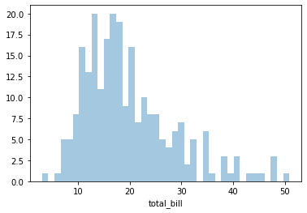
    


```python
sns.jointplot(x='total_bill',y='tip',data=tips)
```


    <seaborn.axisgrid.JointGrid at 0x1ec2f9cc610>


    
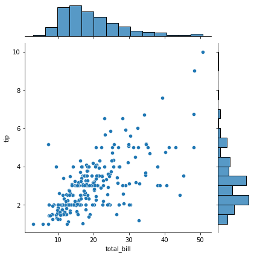
    


```python
sns.jointplot(x='total_bill',y='tip',data=tips, kind='hex') # hexsagon
```


    <seaborn.axisgrid.JointGrid at 0x1ec2e761160>


    
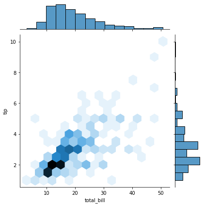
    


```python
sns.jointplot(x='total_bill',y='tip',data=tips, kind='reg') # regression
```


    <seaborn.axisgrid.JointGrid at 0x1ec2fbe3a30>


    
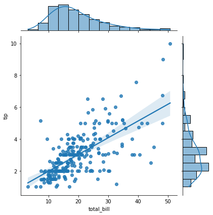
    


```python
sns.jointplot(x='total_bill',y='tip',data=tips, kind='kde') # density
```


    <seaborn.axisgrid.JointGrid at 0x1ec2fb20c40>


    
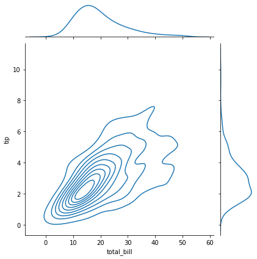
    


```python
sns.pairplot(tips) # shows every possible combinations
```


    <seaborn.axisgrid.PairGrid at 0x1ec2fe4e1c0>


    
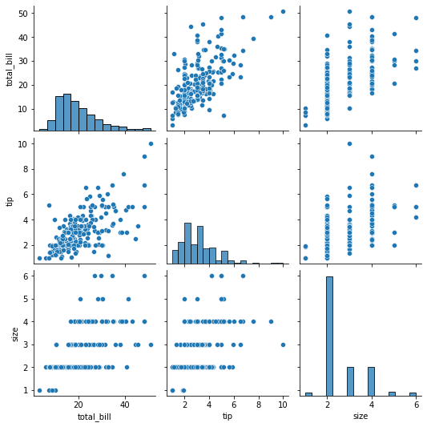
    


```python
sns.pairplot(tips, hue='sex')
```


    <seaborn.axisgrid.PairGrid at 0x1ec30409df0>


    
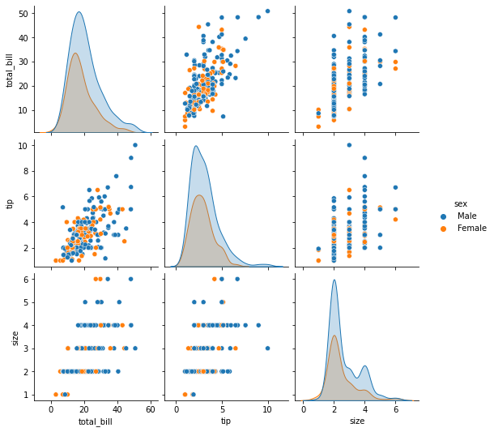
    


```python
sns.pairplot(tips, hue='sex', palette='coolwarm')
```


    <seaborn.axisgrid.PairGrid at 0x1ec31a0c6a0>


    
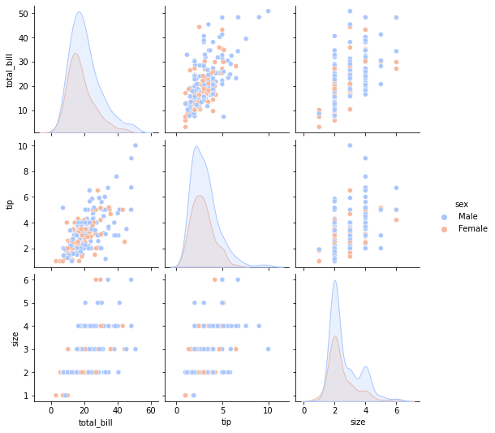
    


```python
sns.rugplot(tips['total_bill']) # draw dash mark for every single point along the distribution line
```


    <AxesSubplot:xlabel='total_bill'>


    
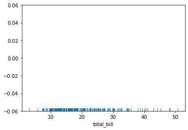
    


```python
sns.displot(tips['total_bill'])
```


    <seaborn.axisgrid.FacetGrid at 0x1ec32103e50>


    
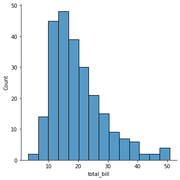
    


```python
sns.displot(tips['total_bill'], kde='True') # Kernel density estimation(KDE): 정규화한 뒤 합한것
```


    <seaborn.axisgrid.FacetGrid at 0x1ec321974c0>


    
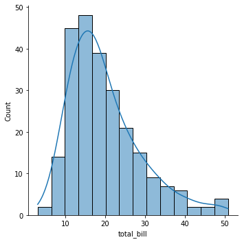
    


```python

```
