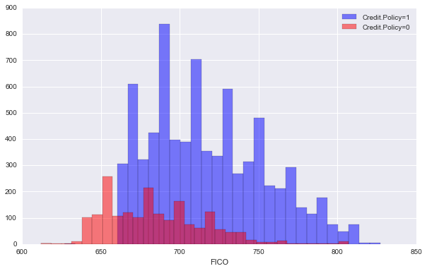
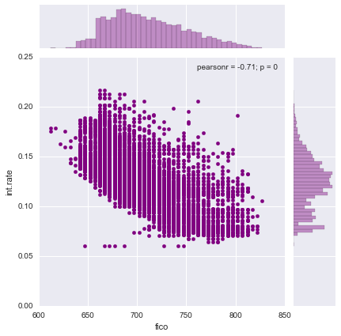

___

<a href='http://www.pieriandata.com'> </a>
___
# Random Forest Project 

For this project we will be exploring publicly available data from [LendingClub.com](www.lendingclub.com). Lending Club connects people who need money (borrowers) with people who have money (investors). Hopefully, as an investor you would want to invest in people who showed a profile of having a high probability of paying you back. We will try to create a model that will help predict this.

Lending club had a [very interesting year in 2016](https://en.wikipedia.org/wiki/Lending_Club#2016), so let's check out some of their data and keep the context in mind. This data is from before they even went public.

We will use lending data from 2007-2010 and be trying to classify and predict whether or not the borrower paid back their loan in full. You can download the data from [here](https://www.lendingclub.com/info/download-data.action) or just use the csv already provided. It's recommended you use the csv provided as it has been cleaned of NA values.

Here are what the columns represent:
* credit.policy: 1 if the customer meets the credit underwriting criteria of LendingClub.com, and 0 otherwise.
* purpose: The purpose of the loan (takes values "credit_card", "debt_consolidation", "educational", "major_purchase", "small_business", and "all_other").
* int.rate: The interest rate of the loan, as a proportion (a rate of 11% would be stored as 0.11). Borrowers judged by LendingClub.com to be more risky are assigned higher interest rates.
* installment: The monthly installments owed by the borrower if the loan is funded.
* log.annual.inc: The natural log of the self-reported annual income of the borrower.
* dti: The debt-to-income ratio of the borrower (amount of debt divided by annual income).
* fico: The FICO credit score of the borrower.
* days.with.cr.line: The number of days the borrower has had a credit line.
* revol.bal: The borrower's revolving balance (amount unpaid at the end of the credit card billing cycle).
* revol.util: The borrower's revolving line utilization rate (the amount of the credit line used relative to total credit available).
* inq.last.6mths: The borrower's number of inquiries by creditors in the last 6 months.
* delinq.2yrs: The number of times the borrower had been 30+ days past due on a payment in the past 2 years.
* pub.rec: The borrower's number of derogatory public records (bankruptcy filings, tax liens, or judgments).

# Import Libraries

**Import the usual libraries for pandas and plotting. You can import sklearn later on.**


```python
import numpy as np
import pandas as pd
```


```python
import matplotlib.pyplot as plt
import seaborn as sns
%matplotlib inline
```

## Get the Data

** Use pandas to read loan_data.csv as a dataframe called loans.**


```python
loans = pd.read_csv('loan_data.csv')
```

** Check out the info(), head(), and describe() methods on loans.**


```python
loans.info()
```

    <class 'pandas.core.frame.DataFrame'>
    RangeIndex: 9578 entries, 0 to 9577
    Data columns (total 14 columns):
     #   Column             Non-Null Count  Dtype  
    ---  ------             --------------  -----  
     0   credit.policy      9578 non-null   int64  
     1   purpose            9578 non-null   object 
     2   int.rate           9578 non-null   float64
     3   installment        9578 non-null   float64
     4   log.annual.inc     9578 non-null   float64
     5   dti                9578 non-null   float64
     6   fico               9578 non-null   int64  
     7   days.with.cr.line  9578 non-null   float64
     8   revol.bal          9578 non-null   int64  
     9   revol.util         9578 non-null   float64
     10  inq.last.6mths     9578 non-null   int64  
     11  delinq.2yrs        9578 non-null   int64  
     12  pub.rec            9578 non-null   int64  
     13  not.fully.paid     9578 non-null   int64  
    dtypes: float64(6), int64(7), object(1)
    memory usage: 1.0+ MB
    


```python
loans.describe()
```


<div>
<style scoped>
    .dataframe tbody tr th:only-of-type {
        vertical-align: middle;
    }

    .dataframe tbody tr th {
        vertical-align: top;
    }

    .dataframe thead th {
        text-align: right;
    }
</style>
<table border="1" class="dataframe">
  <thead>
    <tr style="text-align: right;">
      <th></th>
      <th>credit.policy</th>
      <th>int.rate</th>
      <th>installment</th>
      <th>log.annual.inc</th>
      <th>dti</th>
      <th>fico</th>
      <th>days.with.cr.line</th>
      <th>revol.bal</th>
      <th>revol.util</th>
      <th>inq.last.6mths</th>
      <th>delinq.2yrs</th>
      <th>pub.rec</th>
      <th>not.fully.paid</th>
    </tr>
  </thead>
  <tbody>
    <tr>
      <th>count</th>
      <td>9578.000000</td>
      <td>9578.000000</td>
      <td>9578.000000</td>
      <td>9578.000000</td>
      <td>9578.000000</td>
      <td>9578.000000</td>
      <td>9578.000000</td>
      <td>9.578000e+03</td>
      <td>9578.000000</td>
      <td>9578.000000</td>
      <td>9578.000000</td>
      <td>9578.000000</td>
      <td>9578.000000</td>
    </tr>
    <tr>
      <th>mean</th>
      <td>0.804970</td>
      <td>0.122640</td>
      <td>319.089413</td>
      <td>10.932117</td>
      <td>12.606679</td>
      <td>710.846314</td>
      <td>4560.767197</td>
      <td>1.691396e+04</td>
      <td>46.799236</td>
      <td>1.577469</td>
      <td>0.163708</td>
      <td>0.062122</td>
      <td>0.160054</td>
    </tr>
    <tr>
      <th>std</th>
      <td>0.396245</td>
      <td>0.026847</td>
      <td>207.071301</td>
      <td>0.614813</td>
      <td>6.883970</td>
      <td>37.970537</td>
      <td>2496.930377</td>
      <td>3.375619e+04</td>
      <td>29.014417</td>
      <td>2.200245</td>
      <td>0.546215</td>
      <td>0.262126</td>
      <td>0.366676</td>
    </tr>
    <tr>
      <th>min</th>
      <td>0.000000</td>
      <td>0.060000</td>
      <td>15.670000</td>
      <td>7.547502</td>
      <td>0.000000</td>
      <td>612.000000</td>
      <td>178.958333</td>
      <td>0.000000e+00</td>
      <td>0.000000</td>
      <td>0.000000</td>
      <td>0.000000</td>
      <td>0.000000</td>
      <td>0.000000</td>
    </tr>
    <tr>
      <th>25%</th>
      <td>1.000000</td>
      <td>0.103900</td>
      <td>163.770000</td>
      <td>10.558414</td>
      <td>7.212500</td>
      <td>682.000000</td>
      <td>2820.000000</td>
      <td>3.187000e+03</td>
      <td>22.600000</td>
      <td>0.000000</td>
      <td>0.000000</td>
      <td>0.000000</td>
      <td>0.000000</td>
    </tr>
    <tr>
      <th>50%</th>
      <td>1.000000</td>
      <td>0.122100</td>
      <td>268.950000</td>
      <td>10.928884</td>
      <td>12.665000</td>
      <td>707.000000</td>
      <td>4139.958333</td>
      <td>8.596000e+03</td>
      <td>46.300000</td>
      <td>1.000000</td>
      <td>0.000000</td>
      <td>0.000000</td>
      <td>0.000000</td>
    </tr>
    <tr>
      <th>75%</th>
      <td>1.000000</td>
      <td>0.140700</td>
      <td>432.762500</td>
      <td>11.291293</td>
      <td>17.950000</td>
      <td>737.000000</td>
      <td>5730.000000</td>
      <td>1.824950e+04</td>
      <td>70.900000</td>
      <td>2.000000</td>
      <td>0.000000</td>
      <td>0.000000</td>
      <td>0.000000</td>
    </tr>
    <tr>
      <th>max</th>
      <td>1.000000</td>
      <td>0.216400</td>
      <td>940.140000</td>
      <td>14.528354</td>
      <td>29.960000</td>
      <td>827.000000</td>
      <td>17639.958330</td>
      <td>1.207359e+06</td>
      <td>119.000000</td>
      <td>33.000000</td>
      <td>13.000000</td>
      <td>5.000000</td>
      <td>1.000000</td>
    </tr>
  </tbody>
</table>
</div>


```python
loans.head()
```


<div>
<style scoped>
    .dataframe tbody tr th:only-of-type {
        vertical-align: middle;
    }

    .dataframe tbody tr th {
        vertical-align: top;
    }

    .dataframe thead th {
        text-align: right;
    }
</style>
<table border="1" class="dataframe">
  <thead>
    <tr style="text-align: right;">
      <th></th>
      <th>credit.policy</th>
      <th>purpose</th>
      <th>int.rate</th>
      <th>installment</th>
      <th>log.annual.inc</th>
      <th>dti</th>
      <th>fico</th>
      <th>days.with.cr.line</th>
      <th>revol.bal</th>
      <th>revol.util</th>
      <th>inq.last.6mths</th>
      <th>delinq.2yrs</th>
      <th>pub.rec</th>
      <th>not.fully.paid</th>
    </tr>
  </thead>
  <tbody>
    <tr>
      <th>0</th>
      <td>1</td>
      <td>debt_consolidation</td>
      <td>0.1189</td>
      <td>829.10</td>
      <td>11.350407</td>
      <td>19.48</td>
      <td>737</td>
      <td>5639.958333</td>
      <td>28854</td>
      <td>52.1</td>
      <td>0</td>
      <td>0</td>
      <td>0</td>
      <td>0</td>
    </tr>
    <tr>
      <th>1</th>
      <td>1</td>
      <td>credit_card</td>
      <td>0.1071</td>
      <td>228.22</td>
      <td>11.082143</td>
      <td>14.29</td>
      <td>707</td>
      <td>2760.000000</td>
      <td>33623</td>
      <td>76.7</td>
      <td>0</td>
      <td>0</td>
      <td>0</td>
      <td>0</td>
    </tr>
    <tr>
      <th>2</th>
      <td>1</td>
      <td>debt_consolidation</td>
      <td>0.1357</td>
      <td>366.86</td>
      <td>10.373491</td>
      <td>11.63</td>
      <td>682</td>
      <td>4710.000000</td>
      <td>3511</td>
      <td>25.6</td>
      <td>1</td>
      <td>0</td>
      <td>0</td>
      <td>0</td>
    </tr>
    <tr>
      <th>3</th>
      <td>1</td>
      <td>debt_consolidation</td>
      <td>0.1008</td>
      <td>162.34</td>
      <td>11.350407</td>
      <td>8.10</td>
      <td>712</td>
      <td>2699.958333</td>
      <td>33667</td>
      <td>73.2</td>
      <td>1</td>
      <td>0</td>
      <td>0</td>
      <td>0</td>
    </tr>
    <tr>
      <th>4</th>
      <td>1</td>
      <td>credit_card</td>
      <td>0.1426</td>
      <td>102.92</td>
      <td>11.299732</td>
      <td>14.97</td>
      <td>667</td>
      <td>4066.000000</td>
      <td>4740</td>
      <td>39.5</td>
      <td>0</td>
      <td>1</td>
      <td>0</td>
      <td>0</td>
    </tr>
  </tbody>
</table>
</div>


```python

```

    <class 'pandas.core.frame.DataFrame'>
    RangeIndex: 9578 entries, 0 to 9577
    Data columns (total 14 columns):
    credit.policy        9578 non-null int64
    purpose              9578 non-null object
    int.rate             9578 non-null float64
    installment          9578 non-null float64
    log.annual.inc       9578 non-null float64
    dti                  9578 non-null float64
    fico                 9578 non-null int64
    days.with.cr.line    9578 non-null float64
    revol.bal            9578 non-null int64
    revol.util           9578 non-null float64
    inq.last.6mths       9578 non-null int64
    delinq.2yrs          9578 non-null int64
    pub.rec              9578 non-null int64
    not.fully.paid       9578 non-null int64
    dtypes: float64(6), int64(7), object(1)
    memory usage: 1.0+ MB
    


```python

```


<div>
<table border="1" class="dataframe">
  <thead>
    <tr style="text-align: right;">
      <th></th>
      <th>credit.policy</th>
      <th>int.rate</th>
      <th>installment</th>
      <th>log.annual.inc</th>
      <th>dti</th>
      <th>fico</th>
      <th>days.with.cr.line</th>
      <th>revol.bal</th>
      <th>revol.util</th>
      <th>inq.last.6mths</th>
      <th>delinq.2yrs</th>
      <th>pub.rec</th>
      <th>not.fully.paid</th>
    </tr>
  </thead>
  <tbody>
    <tr>
      <th>count</th>
      <td>9578.000000</td>
      <td>9578.000000</td>
      <td>9578.000000</td>
      <td>9578.000000</td>
      <td>9578.000000</td>
      <td>9578.000000</td>
      <td>9578.000000</td>
      <td>9.578000e+03</td>
      <td>9578.000000</td>
      <td>9578.000000</td>
      <td>9578.000000</td>
      <td>9578.000000</td>
      <td>9578.000000</td>
    </tr>
    <tr>
      <th>mean</th>
      <td>0.804970</td>
      <td>0.122640</td>
      <td>319.089413</td>
      <td>10.932117</td>
      <td>12.606679</td>
      <td>710.846314</td>
      <td>4560.767197</td>
      <td>1.691396e+04</td>
      <td>46.799236</td>
      <td>1.577469</td>
      <td>0.163708</td>
      <td>0.062122</td>
      <td>0.160054</td>
    </tr>
    <tr>
      <th>std</th>
      <td>0.396245</td>
      <td>0.026847</td>
      <td>207.071301</td>
      <td>0.614813</td>
      <td>6.883970</td>
      <td>37.970537</td>
      <td>2496.930377</td>
      <td>3.375619e+04</td>
      <td>29.014417</td>
      <td>2.200245</td>
      <td>0.546215</td>
      <td>0.262126</td>
      <td>0.366676</td>
    </tr>
    <tr>
      <th>min</th>
      <td>0.000000</td>
      <td>0.060000</td>
      <td>15.670000</td>
      <td>7.547502</td>
      <td>0.000000</td>
      <td>612.000000</td>
      <td>178.958333</td>
      <td>0.000000e+00</td>
      <td>0.000000</td>
      <td>0.000000</td>
      <td>0.000000</td>
      <td>0.000000</td>
      <td>0.000000</td>
    </tr>
    <tr>
      <th>25%</th>
      <td>1.000000</td>
      <td>0.103900</td>
      <td>163.770000</td>
      <td>10.558414</td>
      <td>7.212500</td>
      <td>682.000000</td>
      <td>2820.000000</td>
      <td>3.187000e+03</td>
      <td>22.600000</td>
      <td>0.000000</td>
      <td>0.000000</td>
      <td>0.000000</td>
      <td>0.000000</td>
    </tr>
    <tr>
      <th>50%</th>
      <td>1.000000</td>
      <td>0.122100</td>
      <td>268.950000</td>
      <td>10.928884</td>
      <td>12.665000</td>
      <td>707.000000</td>
      <td>4139.958333</td>
      <td>8.596000e+03</td>
      <td>46.300000</td>
      <td>1.000000</td>
      <td>0.000000</td>
      <td>0.000000</td>
      <td>0.000000</td>
    </tr>
    <tr>
      <th>75%</th>
      <td>1.000000</td>
      <td>0.140700</td>
      <td>432.762500</td>
      <td>11.291293</td>
      <td>17.950000</td>
      <td>737.000000</td>
      <td>5730.000000</td>
      <td>1.824950e+04</td>
      <td>70.900000</td>
      <td>2.000000</td>
      <td>0.000000</td>
      <td>0.000000</td>
      <td>0.000000</td>
    </tr>
    <tr>
      <th>max</th>
      <td>1.000000</td>
      <td>0.216400</td>
      <td>940.140000</td>
      <td>14.528354</td>
      <td>29.960000</td>
      <td>827.000000</td>
      <td>17639.958330</td>
      <td>1.207359e+06</td>
      <td>119.000000</td>
      <td>33.000000</td>
      <td>13.000000</td>
      <td>5.000000</td>
      <td>1.000000</td>
    </tr>
  </tbody>
</table>
</div>


```python

```


<div>
<table border="1" class="dataframe">
  <thead>
    <tr style="text-align: right;">
      <th></th>
      <th>credit.policy</th>
      <th>purpose</th>
      <th>int.rate</th>
      <th>installment</th>
      <th>log.annual.inc</th>
      <th>dti</th>
      <th>fico</th>
      <th>days.with.cr.line</th>
      <th>revol.bal</th>
      <th>revol.util</th>
      <th>inq.last.6mths</th>
      <th>delinq.2yrs</th>
      <th>pub.rec</th>
      <th>not.fully.paid</th>
    </tr>
  </thead>
  <tbody>
    <tr>
      <th>0</th>
      <td>1</td>
      <td>debt_consolidation</td>
      <td>0.1189</td>
      <td>829.10</td>
      <td>11.350407</td>
      <td>19.48</td>
      <td>737</td>
      <td>5639.958333</td>
      <td>28854</td>
      <td>52.1</td>
      <td>0</td>
      <td>0</td>
      <td>0</td>
      <td>0</td>
    </tr>
    <tr>
      <th>1</th>
      <td>1</td>
      <td>credit_card</td>
      <td>0.1071</td>
      <td>228.22</td>
      <td>11.082143</td>
      <td>14.29</td>
      <td>707</td>
      <td>2760.000000</td>
      <td>33623</td>
      <td>76.7</td>
      <td>0</td>
      <td>0</td>
      <td>0</td>
      <td>0</td>
    </tr>
    <tr>
      <th>2</th>
      <td>1</td>
      <td>debt_consolidation</td>
      <td>0.1357</td>
      <td>366.86</td>
      <td>10.373491</td>
      <td>11.63</td>
      <td>682</td>
      <td>4710.000000</td>
      <td>3511</td>
      <td>25.6</td>
      <td>1</td>
      <td>0</td>
      <td>0</td>
      <td>0</td>
    </tr>
    <tr>
      <th>3</th>
      <td>1</td>
      <td>debt_consolidation</td>
      <td>0.1008</td>
      <td>162.34</td>
      <td>11.350407</td>
      <td>8.10</td>
      <td>712</td>
      <td>2699.958333</td>
      <td>33667</td>
      <td>73.2</td>
      <td>1</td>
      <td>0</td>
      <td>0</td>
      <td>0</td>
    </tr>
    <tr>
      <th>4</th>
      <td>1</td>
      <td>credit_card</td>
      <td>0.1426</td>
      <td>102.92</td>
      <td>11.299732</td>
      <td>14.97</td>
      <td>667</td>
      <td>4066.000000</td>
      <td>4740</td>
      <td>39.5</td>
      <td>0</td>
      <td>1</td>
      <td>0</td>
      <td>0</td>
    </tr>
  </tbody>
</table>
</div>


# Exploratory Data Analysis

Let's do some data visualization! We'll use seaborn and pandas built-in plotting capabilities, but feel free to use whatever library you want. Don't worry about the colors matching, just worry about getting the main idea of the plot.

** Create a histogram of two FICO distributions on top of each other, one for each credit.policy outcome.**

*Note: This is pretty tricky, feel free to reference the solutions. You'll probably need one line of code for each histogram, I also recommend just using pandas built in .hist()*


```python
loans.columns
```


    Index(['credit.policy', 'purpose', 'int.rate', 'installment', 'log.annual.inc',
           'dti', 'fico', 'days.with.cr.line', 'revol.bal', 'revol.util',
           'inq.last.6mths', 'delinq.2yrs', 'pub.rec', 'not.fully.paid'],
          dtype='object')


```python
plt.figure(figsize=(10,6))
sns.histplot(x='fico', data=loans, hue='credit.policy', bins=30, alpha=0.6)
```


    <AxesSubplot:xlabel='fico', ylabel='Count'>


    

    


```python

```


    <matplotlib.text.Text at 0x119b1f518>


    

    


** Create a similar figure, except this time select by the not.fully.paid column.**


```python
sns.histplot(x='fico', data=loans, hue='not.fully.paid', bins=30)
```


    <AxesSubplot:xlabel='fico', ylabel='Count'>


    

    


```python

```


    <matplotlib.text.Text at 0x11a2cdd30>


    

    


** Create a countplot using seaborn showing the counts of loans by purpose, with the color hue defined by not.fully.paid. **


```python
sns.countplot(x='purpose', data=loans, hue='not.fully.paid')
```


    <AxesSubplot:xlabel='purpose', ylabel='count'>


    

    


```python

```


    <matplotlib.axes._subplots.AxesSubplot at 0x11a508cf8>


    

    


** Let's see the trend between FICO score and interest rate. Recreate the following jointplot.**


```python
sns.jointplot(x='fico', y='int.rate', data=loans, color='purple')
```


    <seaborn.axisgrid.JointGrid at 0x2495b134f40>


    

    


```python

```


    <seaborn.axisgrid.JointGrid at 0x11a87d7f0>


    

    


** Create the following lmplots to see if the trend differed between not.fully.paid and credit.policy. Check the documentation for lmplot() if you can't figure out how to separate it into columns.**


```python
plt.figure(figsize=(11, 7))
sns.lmplot(x='fico', y='int.rate', data=loans, hue='credit.policy', col='not.fully.paid', palette='Set1')
```


    <seaborn.axisgrid.FacetGrid at 0x2495e683370>


    <Figure size 792x504 with 0 Axes>


    

    


```python

```


    <seaborn.axisgrid.FacetGrid at 0x11ac4cb70>


    <matplotlib.figure.Figure at 0x11ad7e048>


    

    


# Setting up the Data

Let's get ready to set up our data for our Random Forest Classification Model!

**Check loans.info() again.**


```python
loans.info()
```

    <class 'pandas.core.frame.DataFrame'>
    RangeIndex: 9578 entries, 0 to 9577
    Data columns (total 14 columns):
     #   Column             Non-Null Count  Dtype  
    ---  ------             --------------  -----  
     0   credit.policy      9578 non-null   int64  
     1   purpose            9578 non-null   object 
     2   int.rate           9578 non-null   float64
     3   installment        9578 non-null   float64
     4   log.annual.inc     9578 non-null   float64
     5   dti                9578 non-null   float64
     6   fico               9578 non-null   int64  
     7   days.with.cr.line  9578 non-null   float64
     8   revol.bal          9578 non-null   int64  
     9   revol.util         9578 non-null   float64
     10  inq.last.6mths     9578 non-null   int64  
     11  delinq.2yrs        9578 non-null   int64  
     12  pub.rec            9578 non-null   int64  
     13  not.fully.paid     9578 non-null   int64  
    dtypes: float64(6), int64(7), object(1)
    memory usage: 1.0+ MB
    


```python
loans.count()
```


    credit.policy        9578
    purpose              9578
    int.rate             9578
    installment          9578
    log.annual.inc       9578
    dti                  9578
    fico                 9578
    days.with.cr.line    9578
    revol.bal            9578
    revol.util           9578
    inq.last.6mths       9578
    delinq.2yrs          9578
    pub.rec              9578
    not.fully.paid       9578
    dtype: int64


```python
loans['purpose'].unique()
```


    array(['debt_consolidation', 'credit_card', 'all_other',
           'home_improvement', 'small_business', 'major_purchase',
           'educational'], dtype=object)


```python

```

    <class 'pandas.core.frame.DataFrame'>
    RangeIndex: 9578 entries, 0 to 9577
    Data columns (total 14 columns):
    credit.policy        9578 non-null int64
    purpose              9578 non-null object
    int.rate             9578 non-null float64
    installment          9578 non-null float64
    log.annual.inc       9578 non-null float64
    dti                  9578 non-null float64
    fico                 9578 non-null int64
    days.with.cr.line    9578 non-null float64
    revol.bal            9578 non-null int64
    revol.util           9578 non-null float64
    inq.last.6mths       9578 non-null int64
    delinq.2yrs          9578 non-null int64
    pub.rec              9578 non-null int64
    not.fully.paid       9578 non-null int64
    dtypes: float64(6), int64(7), object(1)
    memory usage: 1.0+ MB
    

## Categorical Features

Notice that the **purpose** column as categorical

That means we need to transform them using dummy variables so sklearn will be able to understand them. Let's do this in one clean step using pd.get_dummies.

Let's show you a way of dealing with these columns that can be expanded to multiple categorical features if necessary.

**Create a list of 1 element containing the string 'purpose'. Call this list cat_feats.**


```python
#cat_feats = loans['purpose'].unique()
```


```python
# cat_feats
```


    array(['debt_consolidation', 'credit_card', 'all_other',
           'home_improvement', 'small_business', 'major_purchase',
           'educational'], dtype=object)


```python
cat_feats2 = ['purpose']
```


```python
cat_feats2
```


    ['purpose']


**Now use pd.get_dummies(loans,columns=cat_feats,drop_first=True) to create a fixed larger dataframe that has new feature columns with dummy variables. Set this dataframe as final_data.**


```python
pd.get_dummies(loans['purpose'], columns=cat_feats2, drop_first=True)
```


<div>
<style scoped>
    .dataframe tbody tr th:only-of-type {
        vertical-align: middle;
    }

    .dataframe tbody tr th {
        vertical-align: top;
    }

    .dataframe thead th {
        text-align: right;
    }
</style>
<table border="1" class="dataframe">
  <thead>
    <tr style="text-align: right;">
      <th></th>
      <th>credit_card</th>
      <th>debt_consolidation</th>
      <th>educational</th>
      <th>home_improvement</th>
      <th>major_purchase</th>
      <th>small_business</th>
    </tr>
  </thead>
  <tbody>
    <tr>
      <th>0</th>
      <td>0</td>
      <td>1</td>
      <td>0</td>
      <td>0</td>
      <td>0</td>
      <td>0</td>
    </tr>
    <tr>
      <th>1</th>
      <td>1</td>
      <td>0</td>
      <td>0</td>
      <td>0</td>
      <td>0</td>
      <td>0</td>
    </tr>
    <tr>
      <th>2</th>
      <td>0</td>
      <td>1</td>
      <td>0</td>
      <td>0</td>
      <td>0</td>
      <td>0</td>
    </tr>
    <tr>
      <th>3</th>
      <td>0</td>
      <td>1</td>
      <td>0</td>
      <td>0</td>
      <td>0</td>
      <td>0</td>
    </tr>
    <tr>
      <th>4</th>
      <td>1</td>
      <td>0</td>
      <td>0</td>
      <td>0</td>
      <td>0</td>
      <td>0</td>
    </tr>
    <tr>
      <th>...</th>
      <td>...</td>
      <td>...</td>
      <td>...</td>
      <td>...</td>
      <td>...</td>
      <td>...</td>
    </tr>
    <tr>
      <th>9573</th>
      <td>0</td>
      <td>0</td>
      <td>0</td>
      <td>0</td>
      <td>0</td>
      <td>0</td>
    </tr>
    <tr>
      <th>9574</th>
      <td>0</td>
      <td>0</td>
      <td>0</td>
      <td>0</td>
      <td>0</td>
      <td>0</td>
    </tr>
    <tr>
      <th>9575</th>
      <td>0</td>
      <td>1</td>
      <td>0</td>
      <td>0</td>
      <td>0</td>
      <td>0</td>
    </tr>
    <tr>
      <th>9576</th>
      <td>0</td>
      <td>0</td>
      <td>0</td>
      <td>1</td>
      <td>0</td>
      <td>0</td>
    </tr>
    <tr>
      <th>9577</th>
      <td>0</td>
      <td>1</td>
      <td>0</td>
      <td>0</td>
      <td>0</td>
      <td>0</td>
    </tr>
  </tbody>
</table>
<p>9578 rows × 6 columns</p>
</div>


```python
final_data = pd.concat([loans, pd.get_dummies(loans['purpose'], columns=cat_feats2, drop_first=True)], axis=1)
```


```python
final_data.head()
```


<div>
<style scoped>
    .dataframe tbody tr th:only-of-type {
        vertical-align: middle;
    }

    .dataframe tbody tr th {
        vertical-align: top;
    }

    .dataframe thead th {
        text-align: right;
    }
</style>
<table border="1" class="dataframe">
  <thead>
    <tr style="text-align: right;">
      <th></th>
      <th>credit.policy</th>
      <th>purpose</th>
      <th>int.rate</th>
      <th>installment</th>
      <th>log.annual.inc</th>
      <th>dti</th>
      <th>fico</th>
      <th>days.with.cr.line</th>
      <th>revol.bal</th>
      <th>revol.util</th>
      <th>inq.last.6mths</th>
      <th>delinq.2yrs</th>
      <th>pub.rec</th>
      <th>not.fully.paid</th>
      <th>credit_card</th>
      <th>debt_consolidation</th>
      <th>educational</th>
      <th>home_improvement</th>
      <th>major_purchase</th>
      <th>small_business</th>
    </tr>
  </thead>
  <tbody>
    <tr>
      <th>0</th>
      <td>1</td>
      <td>debt_consolidation</td>
      <td>0.1189</td>
      <td>829.10</td>
      <td>11.350407</td>
      <td>19.48</td>
      <td>737</td>
      <td>5639.958333</td>
      <td>28854</td>
      <td>52.1</td>
      <td>0</td>
      <td>0</td>
      <td>0</td>
      <td>0</td>
      <td>0</td>
      <td>1</td>
      <td>0</td>
      <td>0</td>
      <td>0</td>
      <td>0</td>
    </tr>
    <tr>
      <th>1</th>
      <td>1</td>
      <td>credit_card</td>
      <td>0.1071</td>
      <td>228.22</td>
      <td>11.082143</td>
      <td>14.29</td>
      <td>707</td>
      <td>2760.000000</td>
      <td>33623</td>
      <td>76.7</td>
      <td>0</td>
      <td>0</td>
      <td>0</td>
      <td>0</td>
      <td>1</td>
      <td>0</td>
      <td>0</td>
      <td>0</td>
      <td>0</td>
      <td>0</td>
    </tr>
    <tr>
      <th>2</th>
      <td>1</td>
      <td>debt_consolidation</td>
      <td>0.1357</td>
      <td>366.86</td>
      <td>10.373491</td>
      <td>11.63</td>
      <td>682</td>
      <td>4710.000000</td>
      <td>3511</td>
      <td>25.6</td>
      <td>1</td>
      <td>0</td>
      <td>0</td>
      <td>0</td>
      <td>0</td>
      <td>1</td>
      <td>0</td>
      <td>0</td>
      <td>0</td>
      <td>0</td>
    </tr>
    <tr>
      <th>3</th>
      <td>1</td>
      <td>debt_consolidation</td>
      <td>0.1008</td>
      <td>162.34</td>
      <td>11.350407</td>
      <td>8.10</td>
      <td>712</td>
      <td>2699.958333</td>
      <td>33667</td>
      <td>73.2</td>
      <td>1</td>
      <td>0</td>
      <td>0</td>
      <td>0</td>
      <td>0</td>
      <td>1</td>
      <td>0</td>
      <td>0</td>
      <td>0</td>
      <td>0</td>
    </tr>
    <tr>
      <th>4</th>
      <td>1</td>
      <td>credit_card</td>
      <td>0.1426</td>
      <td>102.92</td>
      <td>11.299732</td>
      <td>14.97</td>
      <td>667</td>
      <td>4066.000000</td>
      <td>4740</td>
      <td>39.5</td>
      <td>0</td>
      <td>1</td>
      <td>0</td>
      <td>0</td>
      <td>1</td>
      <td>0</td>
      <td>0</td>
      <td>0</td>
      <td>0</td>
      <td>0</td>
    </tr>
  </tbody>
</table>
</div>


```python
final_data = final_data.drop('purpose', axis=1)
```

## Train Test Split

Now its time to split our data into a training set and a testing set!

** Use sklearn to split your data into a training set and a testing set as we've done in the past.**


```python
from sklearn.model_selection import train_test_split
```


```python
final_data.head()
```


<div>
<style scoped>
    .dataframe tbody tr th:only-of-type {
        vertical-align: middle;
    }

    .dataframe tbody tr th {
        vertical-align: top;
    }

    .dataframe thead th {
        text-align: right;
    }
</style>
<table border="1" class="dataframe">
  <thead>
    <tr style="text-align: right;">
      <th></th>
      <th>credit.policy</th>
      <th>purpose</th>
      <th>int.rate</th>
      <th>installment</th>
      <th>log.annual.inc</th>
      <th>dti</th>
      <th>fico</th>
      <th>days.with.cr.line</th>
      <th>revol.bal</th>
      <th>revol.util</th>
      <th>inq.last.6mths</th>
      <th>delinq.2yrs</th>
      <th>pub.rec</th>
      <th>not.fully.paid</th>
      <th>credit_card</th>
      <th>debt_consolidation</th>
      <th>educational</th>
      <th>home_improvement</th>
      <th>major_purchase</th>
      <th>small_business</th>
    </tr>
  </thead>
  <tbody>
    <tr>
      <th>0</th>
      <td>1</td>
      <td>debt_consolidation</td>
      <td>0.1189</td>
      <td>829.10</td>
      <td>11.350407</td>
      <td>19.48</td>
      <td>737</td>
      <td>5639.958333</td>
      <td>28854</td>
      <td>52.1</td>
      <td>0</td>
      <td>0</td>
      <td>0</td>
      <td>0</td>
      <td>0</td>
      <td>1</td>
      <td>0</td>
      <td>0</td>
      <td>0</td>
      <td>0</td>
    </tr>
    <tr>
      <th>1</th>
      <td>1</td>
      <td>credit_card</td>
      <td>0.1071</td>
      <td>228.22</td>
      <td>11.082143</td>
      <td>14.29</td>
      <td>707</td>
      <td>2760.000000</td>
      <td>33623</td>
      <td>76.7</td>
      <td>0</td>
      <td>0</td>
      <td>0</td>
      <td>0</td>
      <td>1</td>
      <td>0</td>
      <td>0</td>
      <td>0</td>
      <td>0</td>
      <td>0</td>
    </tr>
    <tr>
      <th>2</th>
      <td>1</td>
      <td>debt_consolidation</td>
      <td>0.1357</td>
      <td>366.86</td>
      <td>10.373491</td>
      <td>11.63</td>
      <td>682</td>
      <td>4710.000000</td>
      <td>3511</td>
      <td>25.6</td>
      <td>1</td>
      <td>0</td>
      <td>0</td>
      <td>0</td>
      <td>0</td>
      <td>1</td>
      <td>0</td>
      <td>0</td>
      <td>0</td>
      <td>0</td>
    </tr>
    <tr>
      <th>3</th>
      <td>1</td>
      <td>debt_consolidation</td>
      <td>0.1008</td>
      <td>162.34</td>
      <td>11.350407</td>
      <td>8.10</td>
      <td>712</td>
      <td>2699.958333</td>
      <td>33667</td>
      <td>73.2</td>
      <td>1</td>
      <td>0</td>
      <td>0</td>
      <td>0</td>
      <td>0</td>
      <td>1</td>
      <td>0</td>
      <td>0</td>
      <td>0</td>
      <td>0</td>
    </tr>
    <tr>
      <th>4</th>
      <td>1</td>
      <td>credit_card</td>
      <td>0.1426</td>
      <td>102.92</td>
      <td>11.299732</td>
      <td>14.97</td>
      <td>667</td>
      <td>4066.000000</td>
      <td>4740</td>
      <td>39.5</td>
      <td>0</td>
      <td>1</td>
      <td>0</td>
      <td>0</td>
      <td>1</td>
      <td>0</td>
      <td>0</td>
      <td>0</td>
      <td>0</td>
      <td>0</td>
    </tr>
  </tbody>
</table>
</div>


```python
X = final_data.drop('not.fully.paid', axis=1)
y = final_data['not.fully.paid']
```


```python
X_train, X_test, y_train, y_test = train_test_split(X, y, test_size=0.3)
```

## Training a Decision Tree Model

Let's start by training a single decision tree first!

** Import DecisionTreeClassifier**


```python
from sklearn.tree import DecisionTreeClassifier
```

**Create an instance of DecisionTreeClassifier() called dtree and fit it to the training data.**


```python
dtree = DecisionTreeClassifier()
```


```python
dtree.fit(X_train, y_train)
```


    DecisionTreeClassifier()


```python

```


    DecisionTreeClassifier(class_weight=None, criterion='gini', max_depth=None,
                max_features=None, max_leaf_nodes=None, min_samples_leaf=1,
                min_samples_split=2, min_weight_fraction_leaf=0.0,
                presort=False, random_state=None, splitter='best')


## Predictions and Evaluation of Decision Tree
**Create predictions from the test set and create a classification report and a confusion matrix.**


```python
predictions = dtree.predict(X_test)
```


```python
from sklearn.metrics import classification_report, confusion_matrix
```


```python
print(confusion_matrix(y_test, predictions))
print(classification_report(y_test, predictions))
```

    [[2008  406]
     [ 357  103]]
                  precision    recall  f1-score   support
    
               0       0.85      0.83      0.84      2414
               1       0.20      0.22      0.21       460
    
        accuracy                           0.73      2874
       macro avg       0.53      0.53      0.53      2874
    weighted avg       0.75      0.73      0.74      2874
    
    


```python

```

                 precision    recall  f1-score   support
    
              0       0.85      0.81      0.83      2431
              1       0.16      0.20      0.18       443
    
    avg / total       0.74      0.72      0.73      2874
    
    


```python

```

    [[1980  451]
     [ 355   88]]
    

## Training the Random Forest model

Now its time to train our model!

**Create an instance of the RandomForestClassifier class and fit it to our training data from the previous step.**


```python
from sklearn.ensemble import RandomForestClassifier
```


```python
rfc = RandomForestClassifier(n_estimators=200)
```


```python
rfc.fit(X_train, y_train)
```


    RandomForestClassifier(n_estimators=200)


```python

```


```python

```


    RandomForestClassifier(bootstrap=True, class_weight=None, criterion='gini',
                max_depth=None, max_features='auto', max_leaf_nodes=None,
                min_samples_leaf=1, min_samples_split=2,
                min_weight_fraction_leaf=0.0, n_estimators=600, n_jobs=1,
                oob_score=False, random_state=None, verbose=0,
                warm_start=False)


## Predictions and Evaluation

Let's predict off the y_test values and evaluate our model.

** Predict the class of not.fully.paid for the X_test data.**


```python
rfc_pred = rfc.predict(X_test)
```


```python

```

**Now create a classification report from the results. Do you get anything strange or some sort of warning?**


```python
print(confusion_matrix(y_test, rfc_pred))
print(classification_report(y_test, rfc_pred))
```

    [[2391   23]
     [ 449   11]]
                  precision    recall  f1-score   support
    
               0       0.84      0.99      0.91      2414
               1       0.32      0.02      0.04       460
    
        accuracy                           0.84      2874
       macro avg       0.58      0.51      0.48      2874
    weighted avg       0.76      0.84      0.77      2874
    
    


```python

```

                 precision    recall  f1-score   support
    
              0       0.85      1.00      0.92      2431
              1       0.56      0.01      0.02       443
    
    avg / total       0.80      0.85      0.78      2874
    
    

**Show the Confusion Matrix for the predictions.**


```python

```

    [[2427    4]
     [ 438    5]]
    

**What performed better the random forest or the decision tree?**


```python
random forests model is better than decision tree
```

# Great Job!
