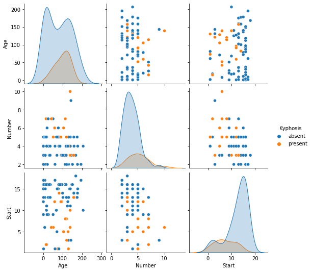

```python
import pandas as pd
import numpy as np
```


```python
import matplotlib.pyplot as plt
import seaborn as sns
```


```python
%matplotlib inline
```


```python
df = pd.read_csv('kyphosis.csv')
```


```python
df.head()
```


<div>
<style scoped>
    .dataframe tbody tr th:only-of-type {
        vertical-align: middle;
    }

    .dataframe tbody tr th {
        vertical-align: top;
    }

    .dataframe thead th {
        text-align: right;
    }
</style>
<table border="1" class="dataframe">
  <thead>
    <tr style="text-align: right;">
      <th></th>
      <th>Kyphosis</th>
      <th>Age</th>
      <th>Number</th>
      <th>Start</th>
    </tr>
  </thead>
  <tbody>
    <tr>
      <th>0</th>
      <td>absent</td>
      <td>71</td>
      <td>3</td>
      <td>5</td>
    </tr>
    <tr>
      <th>1</th>
      <td>absent</td>
      <td>158</td>
      <td>3</td>
      <td>14</td>
    </tr>
    <tr>
      <th>2</th>
      <td>present</td>
      <td>128</td>
      <td>4</td>
      <td>5</td>
    </tr>
    <tr>
      <th>3</th>
      <td>absent</td>
      <td>2</td>
      <td>5</td>
      <td>1</td>
    </tr>
    <tr>
      <th>4</th>
      <td>absent</td>
      <td>1</td>
      <td>4</td>
      <td>15</td>
    </tr>
  </tbody>
</table>
</div>


```python
df.info()
```

    <class 'pandas.core.frame.DataFrame'>
    RangeIndex: 81 entries, 0 to 80
    Data columns (total 4 columns):
     #   Column    Non-Null Count  Dtype 
    ---  ------    --------------  ----- 
     0   Kyphosis  81 non-null     object
     1   Age       81 non-null     int64 
     2   Number    81 non-null     int64 
     3   Start     81 non-null     int64 
    dtypes: int64(3), object(1)
    memory usage: 2.7+ KB
    


```python
sns.pairplot(df, hue='Kyphosis')
```


    <seaborn.axisgrid.PairGrid at 0x2ebda65cdf0>


    

    


```python
from sklearn.model_selection import train_test_split
```


```python
X = df.drop('Kyphosis', axis=1)
```


```python
y = df['Kyphosis']
```


```python
X_train, X_test, y_train, y_test = train_test_split(X, y, test_size=0.3)
```


```python
from sklearn.tree import DecisionTreeClassifier
```


```python
dtree = DecisionTreeClassifier()
```


```python
dtree.fit(X_train, y_train)
```


    DecisionTreeClassifier()


```python
predictions = dtree.predict(X_test)
```


```python
from sklearn.metrics import classification_report, confusion_matrix
```


```python
print(confusion_matrix(y_test, predictions))
print(classification_report(y_test, predictions))
```

    [[17  2]
     [ 5  1]]
                  precision    recall  f1-score   support
    
          absent       0.77      0.89      0.83        19
         present       0.33      0.17      0.22         6
    
        accuracy                           0.72        25
       macro avg       0.55      0.53      0.53        25
    weighted avg       0.67      0.72      0.68        25
    
    


```python
from sklearn.ensemble import RandomForestClassifier
```


```python
rfc = RandomForestClassifier(n_estimators=200)
```


```python
rfc.fit(X_train, y_train)
```


    RandomForestClassifier(n_estimators=200)


```python
rfc_pred = rfc.predict(X_test)
```


```python
print(confusion_matrix(y_test, rfc_pred))
print(classification_report(y_test, rfc_pred))
```

    [[18  1]
     [ 5  1]]
                  precision    recall  f1-score   support
    
          absent       0.78      0.95      0.86        19
         present       0.50      0.17      0.25         6
    
        accuracy                           0.76        25
       macro avg       0.64      0.56      0.55        25
    weighted avg       0.71      0.76      0.71        25
    
    


```python
df['Kyphosis'].value_counts()
```


    absent     64
    present    17
    Name: Kyphosis, dtype: int64


```python

```
