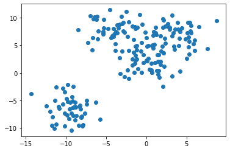
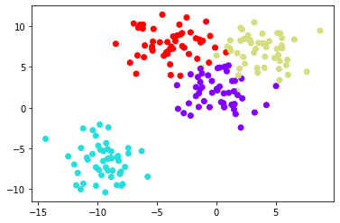
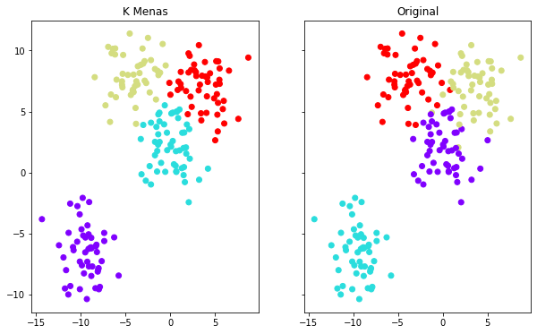

```python
import numpy as np
import pandas as pd
```


```python
import matplotlib.pyplot as plt
import seaborn as sns
%matplotlib inline
```


```python
from sklearn.datasets import make_blobs
```


```python
make_blobs
```


    <function sklearn.datasets._samples_generator.make_blobs(n_samples=100, n_features=2, *, centers=None, cluster_std=1.0, center_box=(-10.0, 10.0), shuffle=True, random_state=None, return_centers=False)>


```python
data = make_blobs(n_samples=200, n_features=2, centers=4, cluster_std=1.8, random_state=101)
```


```python
data
```


    (array([[-6.42884095e+00,  1.01411174e+01],
            [ 5.86867888e+00,  5.20110356e+00],
            [-3.76109375e-01,  3.26427943e+00],
            [ 2.16679181e+00,  9.56300522e+00],
            [ 5.09508570e+00,  7.20752718e+00],
            [-1.08788882e+01, -6.11318040e+00],
            [ 2.03405554e+00,  9.76664755e+00],
            [-1.71798771e+00,  1.41401140e+00],
            [ 1.16911341e+00,  8.24556988e+00],
            [-1.35185444e+00,  3.13245345e+00],
            [-6.18548214e+00,  9.67406555e+00],
            [-1.19856602e+00,  2.50408937e+00],
            [ 2.90296863e+00,  7.91251003e+00],
            [ 2.39250023e+00,  5.38173971e+00],
            [-5.27545147e+00,  9.63836659e+00],
            [-5.66814687e-01,  5.60262755e-02],
            [ 5.97336628e+00,  5.87172022e+00],
            [-2.31355268e+00,  5.23980092e-01],
            [-1.01344756e+01, -3.43130837e+00],
            [-4.54082629e+00,  1.13920174e+01],
            [-1.04155833e+01, -5.67545836e+00],
            [ 6.64796693e-01,  9.42304718e-02],
            [ 2.11460477e+00,  3.55938488e+00],
            [-1.11790221e+01, -9.30976605e+00],
            [-6.63698251e+00,  6.39426436e+00],
            [-7.67422005e+00, -7.26839654e+00],
            [-7.98668260e+00, -9.57113308e+00],
            [ 1.27983684e+00,  3.53150777e-01],
            [ 3.54480244e+00,  7.93535678e+00],
            [ 4.03940181e+00,  4.88870433e+00],
            [-2.88118898e+00,  9.12919391e+00],
            [-9.11009911e+00, -7.69781660e+00],
            [ 5.26001172e+00,  4.74007434e+00],
            [ 2.05859724e+00, -2.44083039e+00],
            [-1.71289834e+00,  2.51221197e+00],
            [-5.40562319e+00,  7.47228315e+00],
            [-1.11995123e+01, -2.55276744e+00],
            [-1.13753641e+01, -4.94525091e+00],
            [-1.17821836e+01, -9.50883007e+00],
            [ 1.74815503e+00,  2.05595679e+00],
            [-9.00392334e+00, -6.20816203e+00],
            [-2.86564584e+00,  7.52934153e+00],
            [-1.42742293e+00,  8.33519078e+00],
            [-3.10933432e+00,  1.01641464e+01],
            [ 2.71130095e-01,  2.58303824e+00],
            [ 8.21556561e-01,  6.76966806e+00],
            [-4.11495481e+00,  8.02621345e+00],
            [ 1.55414928e+00,  3.27657687e+00],
            [-1.16546211e+01, -8.00673720e+00],
            [-1.22009637e+00,  4.90466211e+00],
            [ 3.22017630e+00, -5.94926204e-01],
            [-5.40452892e+00,  7.19997027e+00],
            [ 6.02795351e+00,  4.01696240e+00],
            [ 4.02600451e-01,  6.73452012e-01],
            [-7.38985009e+00, -5.61883075e+00],
            [-1.60537707e+00,  5.98523639e+00],
            [ 8.72770362e-01,  4.46205300e+00],
            [ 1.03445241e+00,  1.81203497e+00],
            [-3.88943018e+00,  5.29262653e+00],
            [ 3.16835529e+00,  6.73039191e+00],
            [-8.07309689e+00, -7.95924003e+00],
            [ 9.16131646e-01,  7.46139251e+00],
            [-7.39648298e+00, -4.95353352e+00],
            [-1.71632701e+00,  8.48540300e+00],
            [ 2.71396283e+00,  8.37361821e+00],
            [-2.16570885e+00, -9.80036369e-01],
            [-1.19474369e+01, -6.96432616e+00],
            [ 4.89539219e+00,  6.07867981e+00],
            [ 2.86177832e+00,  8.22611192e+00],
            [-9.15392597e+00, -6.26781804e+00],
            [ 2.03477094e+00,  8.20236427e+00],
            [ 7.56601080e-01,  5.00732585e+00],
            [-8.84039494e+00, -5.35549354e+00],
            [-3.02650610e+00,  3.90066592e+00],
            [-8.88037875e+00, -6.13184717e+00],
            [ 5.20737777e+00,  6.42515996e+00],
            [ 3.19207745e+00,  1.04409077e+01],
            [ 3.54100315e-02,  2.28780746e+00],
            [-6.94760830e+00,  1.03023440e+01],
            [-3.30473029e+00,  2.74557144e+00],
            [-6.95473895e-01,  3.94656058e+00],
            [-8.33457235e+00, -6.05391550e+00],
            [ 5.51284070e+00,  8.53538580e+00],
            [-6.27688951e+00, -5.31758277e+00],
            [ 6.67624111e-01,  4.73820362e-02],
            [-1.03161306e+00,  7.89798431e-01],
            [-1.48136390e+00,  7.81302690e-02],
            [-5.35676677e+00,  6.98316723e+00],
            [ 1.85230075e+00,  3.93319729e+00],
            [-1.03889624e+01, -2.75765759e+00],
            [-8.37419034e+00, -9.48799296e+00],
            [-8.21095227e+00, -6.52257701e+00],
            [-9.80094161e+00, -2.08038454e+00],
            [-6.22493829e-01,  5.50912500e+00],
            [ 2.71883687e-01,  4.90522990e+00],
            [-8.72228610e+00, -7.70447881e+00],
            [ 5.36248494e+00,  9.10638480e+00],
            [-3.95284076e+00,  7.08183115e+00],
            [-8.26204953e+00, -5.92347393e+00],
            [ 7.60329764e+00,  4.39690494e+00],
            [-1.55623061e+00,  3.74032798e+00],
            [-1.08189070e+01, -6.37070754e+00],
            [ 1.33375749e+00,  3.25801024e+00],
            [-3.22271663e+00, -1.47041326e-01],
            [ 1.09263748e-02,  6.37797424e+00],
            [-1.21138032e+00,  4.18893447e+00],
            [-9.49249242e+00, -5.33043171e+00],
            [ 8.71855704e+00,  9.42068808e+00],
            [-9.28377343e+00, -7.31691088e+00],
            [-9.51273313e+00, -6.54720909e+00],
            [ 5.01871366e+00,  2.64366773e+00],
            [-2.69943732e+00,  7.33651484e+00],
            [-4.21294044e+00,  6.69844656e+00],
            [ 2.32686550e+00,  8.41007576e+00],
            [-9.33392485e+00, -1.03767705e+01],
            [ 4.09116118e+00,  6.24501935e+00],
            [-3.44377911e+00,  8.15200300e+00],
            [-6.56254983e+00,  9.77730406e+00],
            [ 1.20080532e+00,  6.94341290e+00],
            [-1.14313099e+00,  8.18669136e+00],
            [ 1.02282712e+00,  5.16458509e+00],
            [-4.41592469e+00,  6.35654190e+00],
            [-1.45990175e+00,  1.76759085e+00],
            [-6.01113440e+00,  7.61084526e+00],
            [-3.49761061e-01,  1.82795716e+00],
            [ 5.33062618e+00,  5.70970077e+00],
            [-6.16705213e+00,  1.01703782e+01],
            [-2.74298212e+00, -6.73063211e-01],
            [-9.88392998e+00, -7.61018334e+00],
            [-2.30611367e+00,  6.56412841e+00],
            [-4.18810225e+00,  6.78643776e+00],
            [-3.63372128e+00,  8.71114106e+00],
            [ 6.28400899e-01,  1.74545508e+00],
            [-8.83495735e+00, -8.48305488e+00],
            [-1.43571057e+01, -3.82895508e+00],
            [-4.10513812e+00,  6.59306099e+00],
            [ 3.46810859e+00,  4.27477213e+00],
            [-3.83634067e+00,  3.99058382e+00],
            [ 3.86879737e+00,  9.05702488e+00],
            [ 1.52734733e+00,  4.44529411e-01],
            [-1.01203801e+01, -7.30634015e+00],
            [ 5.30579523e+00,  3.36726770e+00],
            [-9.74381724e+00, -5.16531539e+00],
            [-5.21734714e-01,  8.77631220e+00],
            [-1.32773569e+00,  7.98200905e+00],
            [ 2.26042193e+00,  6.22167436e+00],
            [-1.33860111e+00,  4.76650719e+00],
            [-8.11827275e+00, -8.12313116e+00],
            [-3.80021292e+00,  7.47588731e+00],
            [-5.33110685e+00,  8.09237748e+00],
            [-2.50033965e+00,  1.10368807e+01],
            [-2.16845912e+00,  9.21545979e+00],
            [ 8.52592570e-02,  2.11630185e+00],
            [ 3.42604328e+00,  4.85412683e+00],
            [ 1.62539023e+00, -7.88195931e-01],
            [-8.45546407e+00,  7.81479304e+00],
            [ 1.94991080e+00,  4.77920618e+00],
            [ 2.66085026e+00,  8.85418636e+00],
            [ 3.30975285e+00,  7.20496849e+00],
            [ 1.48322247e+00, -2.15828086e-01],
            [ 4.18471184e+00,  7.42058154e+00],
            [ 1.78184320e+00,  1.54467915e+00],
            [-2.16128362e+00,  4.08184363e+00],
            [-6.73918279e+00,  4.14835615e+00],
            [-1.24514261e+01, -5.96841529e+00],
            [-6.08197913e+00,  6.17032027e+00],
            [-1.37015897e+00,  2.28590470e+00],
            [ 5.51872307e+00,  7.27154783e+00],
            [-3.03385808e+00,  8.92618442e+00],
            [ 4.20669615e+00,  3.14885797e-01],
            [ 4.11969631e+00,  7.79152164e+00],
            [ 1.47778918e+00,  2.00671508e+00],
            [-4.75152705e+00,  8.00144754e+00],
            [-1.07466987e-01,  7.34698260e+00],
            [ 1.17780584e-01,  4.83651037e+00],
            [-7.25153130e+00,  5.50680568e+00],
            [ 3.92000057e+00,  7.87622351e+00],
            [ 1.14783058e+00,  7.25692451e+00],
            [-5.77733594e+00, -8.45301197e+00],
            [ 1.75952674e+00,  6.67729832e+00],
            [-3.30799302e+00,  8.82613007e+00],
            [-7.87501869e+00, -9.37924348e+00],
            [-8.02054658e+00, -7.84568360e+00],
            [-8.56456002e-01,  1.05365275e+01],
            [-9.13930933e+00, -5.07011409e+00],
            [-1.01147018e+01, -9.56847340e+00],
            [-9.07497230e+00, -2.42418980e+00],
            [-9.65620091e+00, -8.27162550e+00],
            [-1.14063629e+01, -1.00039828e+01],
            [ 5.92620742e-01,  5.50345267e-01],
            [-9.93363386e+00, -4.65668813e+00],
            [ 5.48533076e+00,  7.60283616e+00],
            [ 4.43919524e+00,  8.13205419e+00],
            [-3.65443003e+00,  7.20898410e+00],
            [-8.81214493e+00, -6.21627131e+00],
            [ 6.71402334e-01,  4.97511492e+00],
            [ 6.56000194e+00,  8.35132137e+00],
            [ 5.13497095e+00,  9.12541881e+00],
            [-9.26198510e+00, -4.33610417e+00],
            [ 2.17474403e+00,  1.13147551e+00]]),
     array([3, 2, 0, 2, 2, 1, 2, 0, 2, 0, 3, 0, 2, 2, 3, 0, 2, 0, 1, 3, 1, 0,
            0, 1, 3, 1, 1, 0, 2, 2, 3, 1, 2, 0, 0, 3, 1, 1, 1, 2, 1, 3, 3, 3,
            0, 3, 3, 0, 1, 2, 0, 3, 2, 0, 1, 3, 0, 0, 3, 2, 1, 2, 1, 3, 2, 0,
            1, 2, 2, 1, 2, 0, 1, 3, 1, 2, 2, 0, 3, 0, 0, 1, 2, 1, 0, 0, 0, 3,
            2, 1, 1, 1, 1, 3, 0, 1, 2, 3, 1, 2, 0, 1, 0, 0, 2, 0, 1, 2, 1, 1,
            0, 3, 3, 2, 1, 2, 3, 3, 2, 3, 0, 3, 0, 3, 0, 2, 3, 0, 1, 3, 3, 3,
            0, 1, 1, 3, 2, 3, 2, 0, 1, 2, 1, 3, 3, 2, 0, 1, 3, 3, 3, 3, 0, 2,
            0, 3, 2, 2, 2, 0, 2, 0, 0, 3, 1, 3, 0, 2, 3, 0, 2, 0, 3, 3, 0, 3,
            2, 2, 1, 2, 3, 1, 1, 3, 1, 1, 1, 1, 1, 0, 1, 2, 2, 3, 1, 0, 2, 2,
            1, 0]))


```python
data[0]
```


    array([[-6.42884095e+00,  1.01411174e+01],
           [ 5.86867888e+00,  5.20110356e+00],
           [-3.76109375e-01,  3.26427943e+00],
           [ 2.16679181e+00,  9.56300522e+00],
           [ 5.09508570e+00,  7.20752718e+00],
           [-1.08788882e+01, -6.11318040e+00],
           [ 2.03405554e+00,  9.76664755e+00],
           [-1.71798771e+00,  1.41401140e+00],
           [ 1.16911341e+00,  8.24556988e+00],
           [-1.35185444e+00,  3.13245345e+00],
           [-6.18548214e+00,  9.67406555e+00],
           [-1.19856602e+00,  2.50408937e+00],
           [ 2.90296863e+00,  7.91251003e+00],
           [ 2.39250023e+00,  5.38173971e+00],
           [-5.27545147e+00,  9.63836659e+00],
           [-5.66814687e-01,  5.60262755e-02],
           [ 5.97336628e+00,  5.87172022e+00],
           [-2.31355268e+00,  5.23980092e-01],
           [-1.01344756e+01, -3.43130837e+00],
           [-4.54082629e+00,  1.13920174e+01],
           [-1.04155833e+01, -5.67545836e+00],
           [ 6.64796693e-01,  9.42304718e-02],
           [ 2.11460477e+00,  3.55938488e+00],
           [-1.11790221e+01, -9.30976605e+00],
           [-6.63698251e+00,  6.39426436e+00],
           [-7.67422005e+00, -7.26839654e+00],
           [-7.98668260e+00, -9.57113308e+00],
           [ 1.27983684e+00,  3.53150777e-01],
           [ 3.54480244e+00,  7.93535678e+00],
           [ 4.03940181e+00,  4.88870433e+00],
           [-2.88118898e+00,  9.12919391e+00],
           [-9.11009911e+00, -7.69781660e+00],
           [ 5.26001172e+00,  4.74007434e+00],
           [ 2.05859724e+00, -2.44083039e+00],
           [-1.71289834e+00,  2.51221197e+00],
           [-5.40562319e+00,  7.47228315e+00],
           [-1.11995123e+01, -2.55276744e+00],
           [-1.13753641e+01, -4.94525091e+00],
           [-1.17821836e+01, -9.50883007e+00],
           [ 1.74815503e+00,  2.05595679e+00],
           [-9.00392334e+00, -6.20816203e+00],
           [-2.86564584e+00,  7.52934153e+00],
           [-1.42742293e+00,  8.33519078e+00],
           [-3.10933432e+00,  1.01641464e+01],
           [ 2.71130095e-01,  2.58303824e+00],
           [ 8.21556561e-01,  6.76966806e+00],
           [-4.11495481e+00,  8.02621345e+00],
           [ 1.55414928e+00,  3.27657687e+00],
           [-1.16546211e+01, -8.00673720e+00],
           [-1.22009637e+00,  4.90466211e+00],
           [ 3.22017630e+00, -5.94926204e-01],
           [-5.40452892e+00,  7.19997027e+00],
           [ 6.02795351e+00,  4.01696240e+00],
           [ 4.02600451e-01,  6.73452012e-01],
           [-7.38985009e+00, -5.61883075e+00],
           [-1.60537707e+00,  5.98523639e+00],
           [ 8.72770362e-01,  4.46205300e+00],
           [ 1.03445241e+00,  1.81203497e+00],
           [-3.88943018e+00,  5.29262653e+00],
           [ 3.16835529e+00,  6.73039191e+00],
           [-8.07309689e+00, -7.95924003e+00],
           [ 9.16131646e-01,  7.46139251e+00],
           [-7.39648298e+00, -4.95353352e+00],
           [-1.71632701e+00,  8.48540300e+00],
           [ 2.71396283e+00,  8.37361821e+00],
           [-2.16570885e+00, -9.80036369e-01],
           [-1.19474369e+01, -6.96432616e+00],
           [ 4.89539219e+00,  6.07867981e+00],
           [ 2.86177832e+00,  8.22611192e+00],
           [-9.15392597e+00, -6.26781804e+00],
           [ 2.03477094e+00,  8.20236427e+00],
           [ 7.56601080e-01,  5.00732585e+00],
           [-8.84039494e+00, -5.35549354e+00],
           [-3.02650610e+00,  3.90066592e+00],
           [-8.88037875e+00, -6.13184717e+00],
           [ 5.20737777e+00,  6.42515996e+00],
           [ 3.19207745e+00,  1.04409077e+01],
           [ 3.54100315e-02,  2.28780746e+00],
           [-6.94760830e+00,  1.03023440e+01],
           [-3.30473029e+00,  2.74557144e+00],
           [-6.95473895e-01,  3.94656058e+00],
           [-8.33457235e+00, -6.05391550e+00],
           [ 5.51284070e+00,  8.53538580e+00],
           [-6.27688951e+00, -5.31758277e+00],
           [ 6.67624111e-01,  4.73820362e-02],
           [-1.03161306e+00,  7.89798431e-01],
           [-1.48136390e+00,  7.81302690e-02],
           [-5.35676677e+00,  6.98316723e+00],
           [ 1.85230075e+00,  3.93319729e+00],
           [-1.03889624e+01, -2.75765759e+00],
           [-8.37419034e+00, -9.48799296e+00],
           [-8.21095227e+00, -6.52257701e+00],
           [-9.80094161e+00, -2.08038454e+00],
           [-6.22493829e-01,  5.50912500e+00],
           [ 2.71883687e-01,  4.90522990e+00],
           [-8.72228610e+00, -7.70447881e+00],
           [ 5.36248494e+00,  9.10638480e+00],
           [-3.95284076e+00,  7.08183115e+00],
           [-8.26204953e+00, -5.92347393e+00],
           [ 7.60329764e+00,  4.39690494e+00],
           [-1.55623061e+00,  3.74032798e+00],
           [-1.08189070e+01, -6.37070754e+00],
           [ 1.33375749e+00,  3.25801024e+00],
           [-3.22271663e+00, -1.47041326e-01],
           [ 1.09263748e-02,  6.37797424e+00],
           [-1.21138032e+00,  4.18893447e+00],
           [-9.49249242e+00, -5.33043171e+00],
           [ 8.71855704e+00,  9.42068808e+00],
           [-9.28377343e+00, -7.31691088e+00],
           [-9.51273313e+00, -6.54720909e+00],
           [ 5.01871366e+00,  2.64366773e+00],
           [-2.69943732e+00,  7.33651484e+00],
           [-4.21294044e+00,  6.69844656e+00],
           [ 2.32686550e+00,  8.41007576e+00],
           [-9.33392485e+00, -1.03767705e+01],
           [ 4.09116118e+00,  6.24501935e+00],
           [-3.44377911e+00,  8.15200300e+00],
           [-6.56254983e+00,  9.77730406e+00],
           [ 1.20080532e+00,  6.94341290e+00],
           [-1.14313099e+00,  8.18669136e+00],
           [ 1.02282712e+00,  5.16458509e+00],
           [-4.41592469e+00,  6.35654190e+00],
           [-1.45990175e+00,  1.76759085e+00],
           [-6.01113440e+00,  7.61084526e+00],
           [-3.49761061e-01,  1.82795716e+00],
           [ 5.33062618e+00,  5.70970077e+00],
           [-6.16705213e+00,  1.01703782e+01],
           [-2.74298212e+00, -6.73063211e-01],
           [-9.88392998e+00, -7.61018334e+00],
           [-2.30611367e+00,  6.56412841e+00],
           [-4.18810225e+00,  6.78643776e+00],
           [-3.63372128e+00,  8.71114106e+00],
           [ 6.28400899e-01,  1.74545508e+00],
           [-8.83495735e+00, -8.48305488e+00],
           [-1.43571057e+01, -3.82895508e+00],
           [-4.10513812e+00,  6.59306099e+00],
           [ 3.46810859e+00,  4.27477213e+00],
           [-3.83634067e+00,  3.99058382e+00],
           [ 3.86879737e+00,  9.05702488e+00],
           [ 1.52734733e+00,  4.44529411e-01],
           [-1.01203801e+01, -7.30634015e+00],
           [ 5.30579523e+00,  3.36726770e+00],
           [-9.74381724e+00, -5.16531539e+00],
           [-5.21734714e-01,  8.77631220e+00],
           [-1.32773569e+00,  7.98200905e+00],
           [ 2.26042193e+00,  6.22167436e+00],
           [-1.33860111e+00,  4.76650719e+00],
           [-8.11827275e+00, -8.12313116e+00],
           [-3.80021292e+00,  7.47588731e+00],
           [-5.33110685e+00,  8.09237748e+00],
           [-2.50033965e+00,  1.10368807e+01],
           [-2.16845912e+00,  9.21545979e+00],
           [ 8.52592570e-02,  2.11630185e+00],
           [ 3.42604328e+00,  4.85412683e+00],
           [ 1.62539023e+00, -7.88195931e-01],
           [-8.45546407e+00,  7.81479304e+00],
           [ 1.94991080e+00,  4.77920618e+00],
           [ 2.66085026e+00,  8.85418636e+00],
           [ 3.30975285e+00,  7.20496849e+00],
           [ 1.48322247e+00, -2.15828086e-01],
           [ 4.18471184e+00,  7.42058154e+00],
           [ 1.78184320e+00,  1.54467915e+00],
           [-2.16128362e+00,  4.08184363e+00],
           [-6.73918279e+00,  4.14835615e+00],
           [-1.24514261e+01, -5.96841529e+00],
           [-6.08197913e+00,  6.17032027e+00],
           [-1.37015897e+00,  2.28590470e+00],
           [ 5.51872307e+00,  7.27154783e+00],
           [-3.03385808e+00,  8.92618442e+00],
           [ 4.20669615e+00,  3.14885797e-01],
           [ 4.11969631e+00,  7.79152164e+00],
           [ 1.47778918e+00,  2.00671508e+00],
           [-4.75152705e+00,  8.00144754e+00],
           [-1.07466987e-01,  7.34698260e+00],
           [ 1.17780584e-01,  4.83651037e+00],
           [-7.25153130e+00,  5.50680568e+00],
           [ 3.92000057e+00,  7.87622351e+00],
           [ 1.14783058e+00,  7.25692451e+00],
           [-5.77733594e+00, -8.45301197e+00],
           [ 1.75952674e+00,  6.67729832e+00],
           [-3.30799302e+00,  8.82613007e+00],
           [-7.87501869e+00, -9.37924348e+00],
           [-8.02054658e+00, -7.84568360e+00],
           [-8.56456002e-01,  1.05365275e+01],
           [-9.13930933e+00, -5.07011409e+00],
           [-1.01147018e+01, -9.56847340e+00],
           [-9.07497230e+00, -2.42418980e+00],
           [-9.65620091e+00, -8.27162550e+00],
           [-1.14063629e+01, -1.00039828e+01],
           [ 5.92620742e-01,  5.50345267e-01],
           [-9.93363386e+00, -4.65668813e+00],
           [ 5.48533076e+00,  7.60283616e+00],
           [ 4.43919524e+00,  8.13205419e+00],
           [-3.65443003e+00,  7.20898410e+00],
           [-8.81214493e+00, -6.21627131e+00],
           [ 6.71402334e-01,  4.97511492e+00],
           [ 6.56000194e+00,  8.35132137e+00],
           [ 5.13497095e+00,  9.12541881e+00],
           [-9.26198510e+00, -4.33610417e+00],
           [ 2.17474403e+00,  1.13147551e+00]])


```python
data[1]
```


    array([3, 2, 0, 2, 2, 1, 2, 0, 2, 0, 3, 0, 2, 2, 3, 0, 2, 0, 1, 3, 1, 0,
           0, 1, 3, 1, 1, 0, 2, 2, 3, 1, 2, 0, 0, 3, 1, 1, 1, 2, 1, 3, 3, 3,
           0, 3, 3, 0, 1, 2, 0, 3, 2, 0, 1, 3, 0, 0, 3, 2, 1, 2, 1, 3, 2, 0,
           1, 2, 2, 1, 2, 0, 1, 3, 1, 2, 2, 0, 3, 0, 0, 1, 2, 1, 0, 0, 0, 3,
           2, 1, 1, 1, 1, 3, 0, 1, 2, 3, 1, 2, 0, 1, 0, 0, 2, 0, 1, 2, 1, 1,
           0, 3, 3, 2, 1, 2, 3, 3, 2, 3, 0, 3, 0, 3, 0, 2, 3, 0, 1, 3, 3, 3,
           0, 1, 1, 3, 2, 3, 2, 0, 1, 2, 1, 3, 3, 2, 0, 1, 3, 3, 3, 3, 0, 2,
           0, 3, 2, 2, 2, 0, 2, 0, 0, 3, 1, 3, 0, 2, 3, 0, 2, 0, 3, 3, 0, 3,
           2, 2, 1, 2, 3, 1, 1, 3, 1, 1, 1, 1, 1, 0, 1, 2, 2, 3, 1, 0, 2, 2,
           1, 0])


```python
data[0].shape
```


    (200, 2)


```python
data[0][:,0]
```


    array([-6.42884095e+00,  5.86867888e+00, -3.76109375e-01,  2.16679181e+00,
            5.09508570e+00, -1.08788882e+01,  2.03405554e+00, -1.71798771e+00,
            1.16911341e+00, -1.35185444e+00, -6.18548214e+00, -1.19856602e+00,
            2.90296863e+00,  2.39250023e+00, -5.27545147e+00, -5.66814687e-01,
            5.97336628e+00, -2.31355268e+00, -1.01344756e+01, -4.54082629e+00,
           -1.04155833e+01,  6.64796693e-01,  2.11460477e+00, -1.11790221e+01,
           -6.63698251e+00, -7.67422005e+00, -7.98668260e+00,  1.27983684e+00,
            3.54480244e+00,  4.03940181e+00, -2.88118898e+00, -9.11009911e+00,
            5.26001172e+00,  2.05859724e+00, -1.71289834e+00, -5.40562319e+00,
           -1.11995123e+01, -1.13753641e+01, -1.17821836e+01,  1.74815503e+00,
           -9.00392334e+00, -2.86564584e+00, -1.42742293e+00, -3.10933432e+00,
            2.71130095e-01,  8.21556561e-01, -4.11495481e+00,  1.55414928e+00,
           -1.16546211e+01, -1.22009637e+00,  3.22017630e+00, -5.40452892e+00,
            6.02795351e+00,  4.02600451e-01, -7.38985009e+00, -1.60537707e+00,
            8.72770362e-01,  1.03445241e+00, -3.88943018e+00,  3.16835529e+00,
           -8.07309689e+00,  9.16131646e-01, -7.39648298e+00, -1.71632701e+00,
            2.71396283e+00, -2.16570885e+00, -1.19474369e+01,  4.89539219e+00,
            2.86177832e+00, -9.15392597e+00,  2.03477094e+00,  7.56601080e-01,
           -8.84039494e+00, -3.02650610e+00, -8.88037875e+00,  5.20737777e+00,
            3.19207745e+00,  3.54100315e-02, -6.94760830e+00, -3.30473029e+00,
           -6.95473895e-01, -8.33457235e+00,  5.51284070e+00, -6.27688951e+00,
            6.67624111e-01, -1.03161306e+00, -1.48136390e+00, -5.35676677e+00,
            1.85230075e+00, -1.03889624e+01, -8.37419034e+00, -8.21095227e+00,
           -9.80094161e+00, -6.22493829e-01,  2.71883687e-01, -8.72228610e+00,
            5.36248494e+00, -3.95284076e+00, -8.26204953e+00,  7.60329764e+00,
           -1.55623061e+00, -1.08189070e+01,  1.33375749e+00, -3.22271663e+00,
            1.09263748e-02, -1.21138032e+00, -9.49249242e+00,  8.71855704e+00,
           -9.28377343e+00, -9.51273313e+00,  5.01871366e+00, -2.69943732e+00,
           -4.21294044e+00,  2.32686550e+00, -9.33392485e+00,  4.09116118e+00,
           -3.44377911e+00, -6.56254983e+00,  1.20080532e+00, -1.14313099e+00,
            1.02282712e+00, -4.41592469e+00, -1.45990175e+00, -6.01113440e+00,
           -3.49761061e-01,  5.33062618e+00, -6.16705213e+00, -2.74298212e+00,
           -9.88392998e+00, -2.30611367e+00, -4.18810225e+00, -3.63372128e+00,
            6.28400899e-01, -8.83495735e+00, -1.43571057e+01, -4.10513812e+00,
            3.46810859e+00, -3.83634067e+00,  3.86879737e+00,  1.52734733e+00,
           -1.01203801e+01,  5.30579523e+00, -9.74381724e+00, -5.21734714e-01,
           -1.32773569e+00,  2.26042193e+00, -1.33860111e+00, -8.11827275e+00,
           -3.80021292e+00, -5.33110685e+00, -2.50033965e+00, -2.16845912e+00,
            8.52592570e-02,  3.42604328e+00,  1.62539023e+00, -8.45546407e+00,
            1.94991080e+00,  2.66085026e+00,  3.30975285e+00,  1.48322247e+00,
            4.18471184e+00,  1.78184320e+00, -2.16128362e+00, -6.73918279e+00,
           -1.24514261e+01, -6.08197913e+00, -1.37015897e+00,  5.51872307e+00,
           -3.03385808e+00,  4.20669615e+00,  4.11969631e+00,  1.47778918e+00,
           -4.75152705e+00, -1.07466987e-01,  1.17780584e-01, -7.25153130e+00,
            3.92000057e+00,  1.14783058e+00, -5.77733594e+00,  1.75952674e+00,
           -3.30799302e+00, -7.87501869e+00, -8.02054658e+00, -8.56456002e-01,
           -9.13930933e+00, -1.01147018e+01, -9.07497230e+00, -9.65620091e+00,
           -1.14063629e+01,  5.92620742e-01, -9.93363386e+00,  5.48533076e+00,
            4.43919524e+00, -3.65443003e+00, -8.81214493e+00,  6.71402334e-01,
            6.56000194e+00,  5.13497095e+00, -9.26198510e+00,  2.17474403e+00])


```python
data[0][:,1]
```


    array([ 10.14111739,   5.20110356,   3.26427943,   9.56300522,
             7.20752718,  -6.1131804 ,   9.76664755,   1.4140114 ,
             8.24556988,   3.13245345,   9.67406555,   2.50408937,
             7.91251003,   5.38173971,   9.63836659,   0.05602628,
             5.87172022,   0.52398009,  -3.43130837,  11.39201739,
            -5.67545836,   0.09423047,   3.55938488,  -9.30976605,
             6.39426436,  -7.26839654,  -9.57113308,   0.35315078,
             7.93535678,   4.88870433,   9.12919391,  -7.6978166 ,
             4.74007434,  -2.44083039,   2.51221197,   7.47228315,
            -2.55276744,  -4.94525091,  -9.50883007,   2.05595679,
            -6.20816203,   7.52934153,   8.33519078,  10.16414643,
             2.58303824,   6.76966806,   8.02621345,   3.27657687,
            -8.0067372 ,   4.90466211,  -0.5949262 ,   7.19997027,
             4.0169624 ,   0.67345201,  -5.61883075,   5.98523639,
             4.462053  ,   1.81203497,   5.29262653,   6.73039191,
            -7.95924003,   7.46139251,  -4.95353352,   8.485403  ,
             8.37361821,  -0.98003637,  -6.96432616,   6.07867981,
             8.22611192,  -6.26781804,   8.20236427,   5.00732585,
            -5.35549354,   3.90066592,  -6.13184717,   6.42515996,
            10.44090772,   2.28780746,  10.30234402,   2.74557144,
             3.94656058,  -6.0539155 ,   8.5353858 ,  -5.31758277,
             0.04738204,   0.78979843,   0.07813027,   6.98316723,
             3.93319729,  -2.75765759,  -9.48799296,  -6.52257701,
            -2.08038454,   5.509125  ,   4.9052299 ,  -7.70447881,
             9.1063848 ,   7.08183115,  -5.92347393,   4.39690494,
             3.74032798,  -6.37070754,   3.25801024,  -0.14704133,
             6.37797424,   4.18893447,  -5.33043171,   9.42068808,
            -7.31691088,  -6.54720909,   2.64366773,   7.33651484,
             6.69844656,   8.41007576, -10.37677045,   6.24501935,
             8.152003  ,   9.77730406,   6.9434129 ,   8.18669136,
             5.16458509,   6.3565419 ,   1.76759085,   7.61084526,
             1.82795716,   5.70970077,  10.1703782 ,  -0.67306321,
            -7.61018334,   6.56412841,   6.78643776,   8.71114106,
             1.74545508,  -8.48305488,  -3.82895508,   6.59306099,
             4.27477213,   3.99058382,   9.05702488,   0.44452941,
            -7.30634015,   3.3672677 ,  -5.16531539,   8.7763122 ,
             7.98200905,   6.22167436,   4.76650719,  -8.12313116,
             7.47588731,   8.09237748,  11.03688073,   9.21545979,
             2.11630185,   4.85412683,  -0.78819593,   7.81479304,
             4.77920618,   8.85418636,   7.20496849,  -0.21582809,
             7.42058154,   1.54467915,   4.08184363,   4.14835615,
            -5.96841529,   6.17032027,   2.2859047 ,   7.27154783,
             8.92618442,   0.3148858 ,   7.79152164,   2.00671508,
             8.00144754,   7.3469826 ,   4.83651037,   5.50680568,
             7.87622351,   7.25692451,  -8.45301197,   6.67729832,
             8.82613007,  -9.37924348,  -7.8456836 ,  10.53652746,
            -5.07011409,  -9.5684734 ,  -2.4241898 ,  -8.2716255 ,
           -10.00398275,   0.55034527,  -4.65668813,   7.60283616,
             8.13205419,   7.2089841 ,  -6.21627131,   4.97511492,
             8.35132137,   9.12541881,  -4.33610417,   1.13147551])


```python
plt.scatter(data[0][:,0], data[0][:,1]) # x: data[0][:,0], y: data[0][:,1]
```


    <matplotlib.collections.PathCollection at 0x16e4e376820>


    

    


```python
data[1]
```


    array([3, 2, 0, 2, 2, 1, 2, 0, 2, 0, 3, 0, 2, 2, 3, 0, 2, 0, 1, 3, 1, 0,
           0, 1, 3, 1, 1, 0, 2, 2, 3, 1, 2, 0, 0, 3, 1, 1, 1, 2, 1, 3, 3, 3,
           0, 3, 3, 0, 1, 2, 0, 3, 2, 0, 1, 3, 0, 0, 3, 2, 1, 2, 1, 3, 2, 0,
           1, 2, 2, 1, 2, 0, 1, 3, 1, 2, 2, 0, 3, 0, 0, 1, 2, 1, 0, 0, 0, 3,
           2, 1, 1, 1, 1, 3, 0, 1, 2, 3, 1, 2, 0, 1, 0, 0, 2, 0, 1, 2, 1, 1,
           0, 3, 3, 2, 1, 2, 3, 3, 2, 3, 0, 3, 0, 3, 0, 2, 3, 0, 1, 3, 3, 3,
           0, 1, 1, 3, 2, 3, 2, 0, 1, 2, 1, 3, 3, 2, 0, 1, 3, 3, 3, 3, 0, 2,
           0, 3, 2, 2, 2, 0, 2, 0, 0, 3, 1, 3, 0, 2, 3, 0, 2, 0, 3, 3, 0, 3,
           2, 2, 1, 2, 3, 1, 1, 3, 1, 1, 1, 1, 1, 0, 1, 2, 2, 3, 1, 0, 2, 2,
           1, 0])


```python
plt.scatter(data[0][:,0], data[0][:,1], c=data[1]) # c: color
```


    <matplotlib.collections.PathCollection at 0x16e4dea4730>


    

    


```python
plt.scatter(data[0][:,0], data[0][:,1], c=data[1], cmap='rainbow')
```


    <matplotlib.collections.PathCollection at 0x16e4e7e3820>


    

    


```python
from sklearn.cluster import KMeans
```


```python
kmeans = KMeans(n_clusters=4)
```


```python
kmeans.fit(data[0])
```


    KMeans(n_clusters=4)


```python
kmeans.cluster_centers_
```


    array([[-9.46941837, -6.56081545],
           [-0.0123077 ,  2.13407664],
           [-4.13591321,  7.95389851],
           [ 3.71749226,  7.01388735]])


```python
kmeans.labels_
```


    array([2, 3, 1, 3, 3, 0, 3, 1, 3, 1, 2, 1, 3, 3, 2, 1, 3, 1, 0, 2, 0, 1,
           1, 0, 2, 0, 0, 1, 3, 3, 2, 0, 3, 1, 1, 2, 0, 0, 0, 1, 0, 2, 2, 2,
           1, 3, 2, 1, 0, 1, 1, 2, 3, 1, 0, 2, 1, 1, 2, 3, 0, 3, 0, 2, 3, 1,
           0, 3, 3, 0, 3, 1, 0, 1, 0, 3, 3, 1, 2, 1, 1, 0, 3, 0, 1, 1, 1, 2,
           1, 0, 0, 0, 0, 1, 1, 0, 3, 2, 0, 3, 1, 0, 1, 1, 3, 1, 0, 3, 0, 0,
           3, 2, 2, 3, 0, 3, 2, 2, 3, 2, 1, 2, 1, 2, 1, 3, 2, 1, 0, 2, 2, 2,
           1, 0, 0, 2, 3, 2, 3, 1, 0, 3, 0, 2, 2, 3, 1, 0, 2, 2, 2, 2, 1, 3,
           1, 2, 3, 3, 3, 1, 3, 1, 1, 2, 0, 2, 1, 3, 2, 1, 3, 1, 2, 3, 1, 2,
           3, 3, 0, 3, 2, 0, 0, 2, 0, 0, 0, 0, 0, 1, 0, 3, 3, 2, 0, 1, 3, 3,
           0, 1])


```python
fig, (ax1,ax2) = plt.subplots(1,2, sharey=True, figsize=(10,6))

ax1.set_title('K Menas')
ax1.scatter(data[0][:,0], data[0][:,1], c=kmeans.labels_, cmap='rainbow')

ax2.set_title('Original')
ax2.scatter(data[0][:,0], data[0][:,1], c=data[1], cmap='rainbow')
```


    <matplotlib.collections.PathCollection at 0x16e51be42e0>


    

    


```python

```
