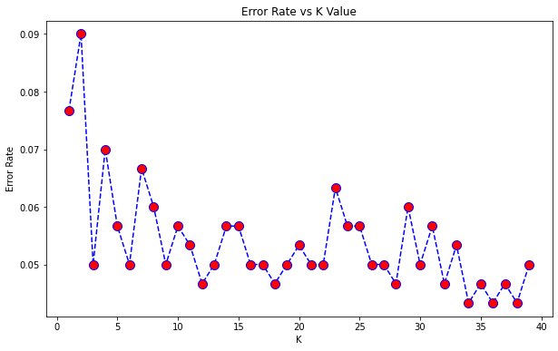

```python
import pandas as pd
import numpy as np
```


```python
import matplotlib.pyplot as plt
import seaborn as sns
%matplotlib inline
```


```python
df = pd.read_csv('Classified Data', index_col=0)
```


```python
df.head()
```


<div>
<style scoped>
    .dataframe tbody tr th:only-of-type {
        vertical-align: middle;
    }

    .dataframe tbody tr th {
        vertical-align: top;
    }

    .dataframe thead th {
        text-align: right;
    }
</style>
<table border="1" class="dataframe">
  <thead>
    <tr style="text-align: right;">
      <th></th>
      <th>WTT</th>
      <th>PTI</th>
      <th>EQW</th>
      <th>SBI</th>
      <th>LQE</th>
      <th>QWG</th>
      <th>FDJ</th>
      <th>PJF</th>
      <th>HQE</th>
      <th>NXJ</th>
      <th>TARGET CLASS</th>
    </tr>
  </thead>
  <tbody>
    <tr>
      <th>0</th>
      <td>0.913917</td>
      <td>1.162073</td>
      <td>0.567946</td>
      <td>0.755464</td>
      <td>0.780862</td>
      <td>0.352608</td>
      <td>0.759697</td>
      <td>0.643798</td>
      <td>0.879422</td>
      <td>1.231409</td>
      <td>1</td>
    </tr>
    <tr>
      <th>1</th>
      <td>0.635632</td>
      <td>1.003722</td>
      <td>0.535342</td>
      <td>0.825645</td>
      <td>0.924109</td>
      <td>0.648450</td>
      <td>0.675334</td>
      <td>1.013546</td>
      <td>0.621552</td>
      <td>1.492702</td>
      <td>0</td>
    </tr>
    <tr>
      <th>2</th>
      <td>0.721360</td>
      <td>1.201493</td>
      <td>0.921990</td>
      <td>0.855595</td>
      <td>1.526629</td>
      <td>0.720781</td>
      <td>1.626351</td>
      <td>1.154483</td>
      <td>0.957877</td>
      <td>1.285597</td>
      <td>0</td>
    </tr>
    <tr>
      <th>3</th>
      <td>1.234204</td>
      <td>1.386726</td>
      <td>0.653046</td>
      <td>0.825624</td>
      <td>1.142504</td>
      <td>0.875128</td>
      <td>1.409708</td>
      <td>1.380003</td>
      <td>1.522692</td>
      <td>1.153093</td>
      <td>1</td>
    </tr>
    <tr>
      <th>4</th>
      <td>1.279491</td>
      <td>0.949750</td>
      <td>0.627280</td>
      <td>0.668976</td>
      <td>1.232537</td>
      <td>0.703727</td>
      <td>1.115596</td>
      <td>0.646691</td>
      <td>1.463812</td>
      <td>1.419167</td>
      <td>1</td>
    </tr>
  </tbody>
</table>
</div>


```python
df['TARGET CLASS'].unique()
```


    array([1, 0], dtype=int64)


```python
from sklearn.preprocessing import StandardScaler
```


```python
scaler = StandardScaler()
```


```python
scaler.fit(df.drop('TARGET CLASS', axis=1))
```


    StandardScaler()


```python
df.head()
```


<div>
<style scoped>
    .dataframe tbody tr th:only-of-type {
        vertical-align: middle;
    }

    .dataframe tbody tr th {
        vertical-align: top;
    }

    .dataframe thead th {
        text-align: right;
    }
</style>
<table border="1" class="dataframe">
  <thead>
    <tr style="text-align: right;">
      <th></th>
      <th>WTT</th>
      <th>PTI</th>
      <th>EQW</th>
      <th>SBI</th>
      <th>LQE</th>
      <th>QWG</th>
      <th>FDJ</th>
      <th>PJF</th>
      <th>HQE</th>
      <th>NXJ</th>
      <th>TARGET CLASS</th>
    </tr>
  </thead>
  <tbody>
    <tr>
      <th>0</th>
      <td>0.913917</td>
      <td>1.162073</td>
      <td>0.567946</td>
      <td>0.755464</td>
      <td>0.780862</td>
      <td>0.352608</td>
      <td>0.759697</td>
      <td>0.643798</td>
      <td>0.879422</td>
      <td>1.231409</td>
      <td>1</td>
    </tr>
    <tr>
      <th>1</th>
      <td>0.635632</td>
      <td>1.003722</td>
      <td>0.535342</td>
      <td>0.825645</td>
      <td>0.924109</td>
      <td>0.648450</td>
      <td>0.675334</td>
      <td>1.013546</td>
      <td>0.621552</td>
      <td>1.492702</td>
      <td>0</td>
    </tr>
    <tr>
      <th>2</th>
      <td>0.721360</td>
      <td>1.201493</td>
      <td>0.921990</td>
      <td>0.855595</td>
      <td>1.526629</td>
      <td>0.720781</td>
      <td>1.626351</td>
      <td>1.154483</td>
      <td>0.957877</td>
      <td>1.285597</td>
      <td>0</td>
    </tr>
    <tr>
      <th>3</th>
      <td>1.234204</td>
      <td>1.386726</td>
      <td>0.653046</td>
      <td>0.825624</td>
      <td>1.142504</td>
      <td>0.875128</td>
      <td>1.409708</td>
      <td>1.380003</td>
      <td>1.522692</td>
      <td>1.153093</td>
      <td>1</td>
    </tr>
    <tr>
      <th>4</th>
      <td>1.279491</td>
      <td>0.949750</td>
      <td>0.627280</td>
      <td>0.668976</td>
      <td>1.232537</td>
      <td>0.703727</td>
      <td>1.115596</td>
      <td>0.646691</td>
      <td>1.463812</td>
      <td>1.419167</td>
      <td>1</td>
    </tr>
  </tbody>
</table>
</div>


```python
scaled_features = scaler.transform(df.drop('TARGET CLASS', axis=1))
```


```python
scaled_features
```


    array([[-0.12354188,  0.18590747, -0.91343069, ..., -1.48236813,
            -0.9497194 , -0.64331425],
           [-1.08483602, -0.43034845, -1.02531333, ..., -0.20224031,
            -1.82805088,  0.63675862],
           [-0.78870217,  0.33931821,  0.30151137, ...,  0.28570652,
            -0.68249379, -0.37784986],
           ...,
           [ 0.64177714, -0.51308341, -0.17920486, ..., -2.36249443,
            -0.81426092,  0.11159651],
           [ 0.46707241, -0.98278576, -1.46519359, ..., -0.03677699,
             0.40602453, -0.85567   ],
           [-0.38765353, -0.59589427, -1.4313981 , ..., -0.56778932,
             0.3369971 ,  0.01034996]])


```python
df_feat = pd.DataFrame(scaled_features, columns=df.columns[:-1])
```


```python
df_feat.head()
```


<div>
<style scoped>
    .dataframe tbody tr th:only-of-type {
        vertical-align: middle;
    }

    .dataframe tbody tr th {
        vertical-align: top;
    }

    .dataframe thead th {
        text-align: right;
    }
</style>
<table border="1" class="dataframe">
  <thead>
    <tr style="text-align: right;">
      <th></th>
      <th>WTT</th>
      <th>PTI</th>
      <th>EQW</th>
      <th>SBI</th>
      <th>LQE</th>
      <th>QWG</th>
      <th>FDJ</th>
      <th>PJF</th>
      <th>HQE</th>
      <th>NXJ</th>
    </tr>
  </thead>
  <tbody>
    <tr>
      <th>0</th>
      <td>-0.123542</td>
      <td>0.185907</td>
      <td>-0.913431</td>
      <td>0.319629</td>
      <td>-1.033637</td>
      <td>-2.308375</td>
      <td>-0.798951</td>
      <td>-1.482368</td>
      <td>-0.949719</td>
      <td>-0.643314</td>
    </tr>
    <tr>
      <th>1</th>
      <td>-1.084836</td>
      <td>-0.430348</td>
      <td>-1.025313</td>
      <td>0.625388</td>
      <td>-0.444847</td>
      <td>-1.152706</td>
      <td>-1.129797</td>
      <td>-0.202240</td>
      <td>-1.828051</td>
      <td>0.636759</td>
    </tr>
    <tr>
      <th>2</th>
      <td>-0.788702</td>
      <td>0.339318</td>
      <td>0.301511</td>
      <td>0.755873</td>
      <td>2.031693</td>
      <td>-0.870156</td>
      <td>2.599818</td>
      <td>0.285707</td>
      <td>-0.682494</td>
      <td>-0.377850</td>
    </tr>
    <tr>
      <th>3</th>
      <td>0.982841</td>
      <td>1.060193</td>
      <td>-0.621399</td>
      <td>0.625299</td>
      <td>0.452820</td>
      <td>-0.267220</td>
      <td>1.750208</td>
      <td>1.066491</td>
      <td>1.241325</td>
      <td>-1.026987</td>
    </tr>
    <tr>
      <th>4</th>
      <td>1.139275</td>
      <td>-0.640392</td>
      <td>-0.709819</td>
      <td>-0.057175</td>
      <td>0.822886</td>
      <td>-0.936773</td>
      <td>0.596782</td>
      <td>-1.472352</td>
      <td>1.040772</td>
      <td>0.276510</td>
    </tr>
  </tbody>
</table>
</div>


```python
from sklearn.model_selection import train_test_split
```


```python
X = df_feat
y = df['TARGET CLASS']

X_train, X_test, y_train, y_test = train_test_split(X, y, test_size=0.3, random_state=101)
```


```python
from sklearn.neighbors import KNeighborsClassifier
```


```python
knn = KNeighborsClassifier(n_neighbors=1)
```


```python
knn.fit(X_train, y_train)
```


    KNeighborsClassifier(n_neighbors=1)


```python
pred = knn.predict(X_test)
```


```python
pred
```


    array([0, 0, 0, 0, 0, 0, 1, 1, 1, 0, 1, 0, 0, 1, 0, 1, 1, 1, 1, 0, 0, 1,
           0, 1, 1, 0, 0, 0, 1, 0, 0, 1, 1, 0, 1, 0, 0, 0, 1, 0, 1, 1, 0, 1,
           1, 0, 1, 1, 0, 1, 0, 1, 1, 1, 0, 0, 0, 0, 0, 0, 0, 1, 1, 1, 0, 1,
           0, 0, 0, 0, 0, 0, 1, 0, 0, 0, 0, 0, 1, 0, 1, 0, 0, 0, 1, 0, 0, 0,
           1, 0, 0, 1, 0, 1, 0, 0, 1, 1, 0, 0, 0, 1, 1, 1, 0, 0, 0, 1, 1, 0,
           0, 0, 0, 0, 1, 0, 1, 1, 0, 1, 1, 1, 0, 1, 1, 1, 0, 1, 0, 0, 0, 1,
           1, 0, 1, 0, 1, 1, 1, 0, 0, 1, 1, 0, 1, 0, 0, 0, 1, 1, 1, 0, 1, 0,
           1, 0, 0, 1, 0, 0, 0, 1, 0, 0, 1, 0, 1, 0, 0, 0, 0, 1, 1, 1, 0, 0,
           1, 1, 0, 0, 1, 0, 1, 0, 1, 0, 1, 1, 0, 1, 1, 1, 0, 1, 1, 1, 0, 1,
           0, 1, 0, 0, 1, 1, 0, 1, 0, 0, 0, 0, 1, 1, 1, 1, 0, 0, 0, 1, 0, 0,
           0, 1, 0, 0, 1, 1, 0, 1, 0, 0, 1, 1, 0, 1, 0, 1, 0, 0, 1, 0, 0, 1,
           0, 0, 1, 0, 0, 0, 0, 1, 0, 0, 0, 0, 1, 1, 0, 1, 1, 0, 1, 0, 1, 1,
           1, 0, 0, 1, 1, 0, 0, 0, 0, 0, 0, 0, 1, 0, 1, 1, 1, 0, 1, 0, 0, 0,
           0, 1, 1, 0, 0, 0, 1, 1, 1, 0, 1, 1, 1, 0], dtype=int64)


```python
from sklearn.metrics import classification_report, confusion_matrix
```


```python
print(confusion_matrix(y_test, pred))
print(classification_report(y_test, pred))
```

    [[151   8]
     [ 15 126]]
                  precision    recall  f1-score   support
    
               0       0.91      0.95      0.93       159
               1       0.94      0.89      0.92       141
    
        accuracy                           0.92       300
       macro avg       0.92      0.92      0.92       300
    weighted avg       0.92      0.92      0.92       300
    
    


```python
error_rate = []

for i in range(1, 40):
    knn = KNeighborsClassifier(n_neighbors=i)
    knn.fit(X_train, y_train)
    
    pred_i = knn.predict(X_test)
    error_rate.append(np.mean(pred_i != y_test))
```


```python
plt.figure(figsize=(10, 6))
plt.plot(range(1, 40), error_rate, color='blue', linestyle='dashed', marker='o', markerfacecolor='red', markersize=10)
plt.title('Error Rate vs K Value')
plt.xlabel('K')
plt.ylabel('Error Rate')
```


    Text(0, 0.5, 'Error Rate')


    

    


```python
knn = KNeighborsClassifier(n_neighbors=17)
knn.fit(X_train, y_train)
pred = knn.predict(X_test)
print(confusion_matrix(y_test, pred))
print('\n')
print(classification_report(y_test, pred))
```

    [[153   6]
     [  9 132]]
    
    
                  precision    recall  f1-score   support
    
               0       0.94      0.96      0.95       159
               1       0.96      0.94      0.95       141
    
        accuracy                           0.95       300
       macro avg       0.95      0.95      0.95       300
    weighted avg       0.95      0.95      0.95       300
    
    


```python

```
