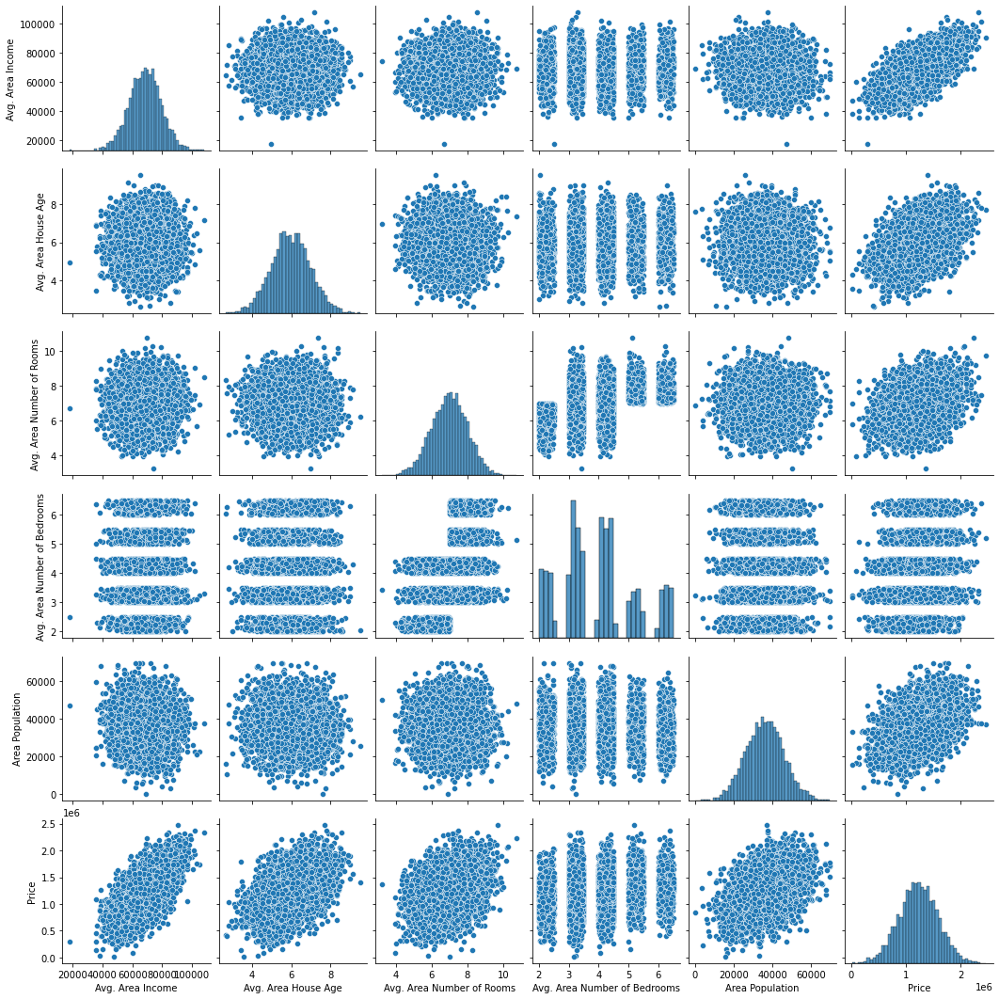
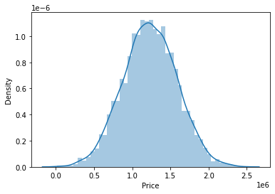
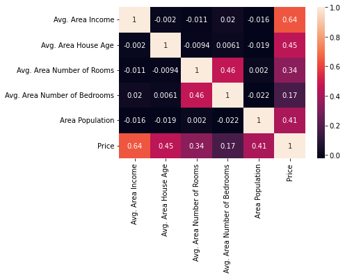
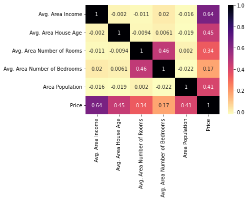
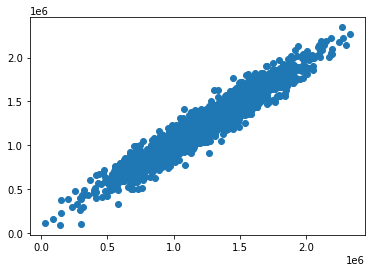
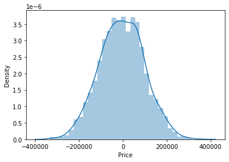

```python
'''
from sklearn.cross_validation import train_test_split

has been changed to :

from sklearn.model_selection import train_test_split
'''
```


    '\nfrom sklearn.cross_validation import train_test_split\n\nhas been changed to :\n\nfrom sklearn.model_selection import train_test_split\n'


```python
import pandas as pd
import numpy as np
```


```python
import matplotlib.pyplot as plt
import seaborn as sns
```


```python
%matplotlib inline
```


```python
df = pd.read_csv('USA_Housing.csv')
```


```python
df.head()
```


<div>
<style scoped>
    .dataframe tbody tr th:only-of-type {
        vertical-align: middle;
    }

    .dataframe tbody tr th {
        vertical-align: top;
    }

    .dataframe thead th {
        text-align: right;
    }
</style>
<table border="1" class="dataframe">
  <thead>
    <tr style="text-align: right;">
      <th></th>
      <th>Avg. Area Income</th>
      <th>Avg. Area House Age</th>
      <th>Avg. Area Number of Rooms</th>
      <th>Avg. Area Number of Bedrooms</th>
      <th>Area Population</th>
      <th>Price</th>
      <th>Address</th>
    </tr>
  </thead>
  <tbody>
    <tr>
      <th>0</th>
      <td>79545.458574</td>
      <td>5.682861</td>
      <td>7.009188</td>
      <td>4.09</td>
      <td>23086.800503</td>
      <td>1.059034e+06</td>
      <td>208 Michael Ferry Apt. 674\nLaurabury, NE 3701...</td>
    </tr>
    <tr>
      <th>1</th>
      <td>79248.642455</td>
      <td>6.002900</td>
      <td>6.730821</td>
      <td>3.09</td>
      <td>40173.072174</td>
      <td>1.505891e+06</td>
      <td>188 Johnson Views Suite 079\nLake Kathleen, CA...</td>
    </tr>
    <tr>
      <th>2</th>
      <td>61287.067179</td>
      <td>5.865890</td>
      <td>8.512727</td>
      <td>5.13</td>
      <td>36882.159400</td>
      <td>1.058988e+06</td>
      <td>9127 Elizabeth Stravenue\nDanieltown, WI 06482...</td>
    </tr>
    <tr>
      <th>3</th>
      <td>63345.240046</td>
      <td>7.188236</td>
      <td>5.586729</td>
      <td>3.26</td>
      <td>34310.242831</td>
      <td>1.260617e+06</td>
      <td>USS Barnett\nFPO AP 44820</td>
    </tr>
    <tr>
      <th>4</th>
      <td>59982.197226</td>
      <td>5.040555</td>
      <td>7.839388</td>
      <td>4.23</td>
      <td>26354.109472</td>
      <td>6.309435e+05</td>
      <td>USNS Raymond\nFPO AE 09386</td>
    </tr>
  </tbody>
</table>
</div>


```python
df.info()
```

    <class 'pandas.core.frame.DataFrame'>
    RangeIndex: 5000 entries, 0 to 4999
    Data columns (total 7 columns):
     #   Column                        Non-Null Count  Dtype  
    ---  ------                        --------------  -----  
     0   Avg. Area Income              5000 non-null   float64
     1   Avg. Area House Age           5000 non-null   float64
     2   Avg. Area Number of Rooms     5000 non-null   float64
     3   Avg. Area Number of Bedrooms  5000 non-null   float64
     4   Area Population               5000 non-null   float64
     5   Price                         5000 non-null   float64
     6   Address                       5000 non-null   object 
    dtypes: float64(6), object(1)
    memory usage: 273.6+ KB
    


```python
df.describe()
```


<div>
<style scoped>
    .dataframe tbody tr th:only-of-type {
        vertical-align: middle;
    }

    .dataframe tbody tr th {
        vertical-align: top;
    }

    .dataframe thead th {
        text-align: right;
    }
</style>
<table border="1" class="dataframe">
  <thead>
    <tr style="text-align: right;">
      <th></th>
      <th>Avg. Area Income</th>
      <th>Avg. Area House Age</th>
      <th>Avg. Area Number of Rooms</th>
      <th>Avg. Area Number of Bedrooms</th>
      <th>Area Population</th>
      <th>Price</th>
    </tr>
  </thead>
  <tbody>
    <tr>
      <th>count</th>
      <td>5000.000000</td>
      <td>5000.000000</td>
      <td>5000.000000</td>
      <td>5000.000000</td>
      <td>5000.000000</td>
      <td>5.000000e+03</td>
    </tr>
    <tr>
      <th>mean</th>
      <td>68583.108984</td>
      <td>5.977222</td>
      <td>6.987792</td>
      <td>3.981330</td>
      <td>36163.516039</td>
      <td>1.232073e+06</td>
    </tr>
    <tr>
      <th>std</th>
      <td>10657.991214</td>
      <td>0.991456</td>
      <td>1.005833</td>
      <td>1.234137</td>
      <td>9925.650114</td>
      <td>3.531176e+05</td>
    </tr>
    <tr>
      <th>min</th>
      <td>17796.631190</td>
      <td>2.644304</td>
      <td>3.236194</td>
      <td>2.000000</td>
      <td>172.610686</td>
      <td>1.593866e+04</td>
    </tr>
    <tr>
      <th>25%</th>
      <td>61480.562388</td>
      <td>5.322283</td>
      <td>6.299250</td>
      <td>3.140000</td>
      <td>29403.928702</td>
      <td>9.975771e+05</td>
    </tr>
    <tr>
      <th>50%</th>
      <td>68804.286404</td>
      <td>5.970429</td>
      <td>7.002902</td>
      <td>4.050000</td>
      <td>36199.406689</td>
      <td>1.232669e+06</td>
    </tr>
    <tr>
      <th>75%</th>
      <td>75783.338666</td>
      <td>6.650808</td>
      <td>7.665871</td>
      <td>4.490000</td>
      <td>42861.290769</td>
      <td>1.471210e+06</td>
    </tr>
    <tr>
      <th>max</th>
      <td>107701.748378</td>
      <td>9.519088</td>
      <td>10.759588</td>
      <td>6.500000</td>
      <td>69621.713378</td>
      <td>2.469066e+06</td>
    </tr>
  </tbody>
</table>
</div>


```python
df.columns
```


    Index(['Avg. Area Income', 'Avg. Area House Age', 'Avg. Area Number of Rooms',
           'Avg. Area Number of Bedrooms', 'Area Population', 'Price', 'Address'],
          dtype='object')


```python
sns.pairplot(df)
```


    <seaborn.axisgrid.PairGrid at 0x2729ae31970>


    

    


```python
sns.distplot(df['Price'])
```

    C:\Work\Utils\Anaconda3\lib\site-packages\seaborn\distributions.py:2619: FutureWarning: `distplot` is a deprecated function and will be removed in a future version. Please adapt your code to use either `displot` (a figure-level function with similar flexibility) or `histplot` (an axes-level function for histograms).
      warnings.warn(msg, FutureWarning)
    


    <AxesSubplot:xlabel='Price', ylabel='Density'>


    

    


```python
df.corr()
```


<div>
<style scoped>
    .dataframe tbody tr th:only-of-type {
        vertical-align: middle;
    }

    .dataframe tbody tr th {
        vertical-align: top;
    }

    .dataframe thead th {
        text-align: right;
    }
</style>
<table border="1" class="dataframe">
  <thead>
    <tr style="text-align: right;">
      <th></th>
      <th>Avg. Area Income</th>
      <th>Avg. Area House Age</th>
      <th>Avg. Area Number of Rooms</th>
      <th>Avg. Area Number of Bedrooms</th>
      <th>Area Population</th>
      <th>Price</th>
    </tr>
  </thead>
  <tbody>
    <tr>
      <th>Avg. Area Income</th>
      <td>1.000000</td>
      <td>-0.002007</td>
      <td>-0.011032</td>
      <td>0.019788</td>
      <td>-0.016234</td>
      <td>0.639734</td>
    </tr>
    <tr>
      <th>Avg. Area House Age</th>
      <td>-0.002007</td>
      <td>1.000000</td>
      <td>-0.009428</td>
      <td>0.006149</td>
      <td>-0.018743</td>
      <td>0.452543</td>
    </tr>
    <tr>
      <th>Avg. Area Number of Rooms</th>
      <td>-0.011032</td>
      <td>-0.009428</td>
      <td>1.000000</td>
      <td>0.462695</td>
      <td>0.002040</td>
      <td>0.335664</td>
    </tr>
    <tr>
      <th>Avg. Area Number of Bedrooms</th>
      <td>0.019788</td>
      <td>0.006149</td>
      <td>0.462695</td>
      <td>1.000000</td>
      <td>-0.022168</td>
      <td>0.171071</td>
    </tr>
    <tr>
      <th>Area Population</th>
      <td>-0.016234</td>
      <td>-0.018743</td>
      <td>0.002040</td>
      <td>-0.022168</td>
      <td>1.000000</td>
      <td>0.408556</td>
    </tr>
    <tr>
      <th>Price</th>
      <td>0.639734</td>
      <td>0.452543</td>
      <td>0.335664</td>
      <td>0.171071</td>
      <td>0.408556</td>
      <td>1.000000</td>
    </tr>
  </tbody>
</table>
</div>


```python
 sns.heatmap(df.corr())
```


    <AxesSubplot:>


    

    


```python
sns.heatmap(df.corr(), annot=True)
```


    <AxesSubplot:>


    

    


```python
sns.heatmap(df.corr(), annot=True, cmap='magma_r')
```


    <AxesSubplot:>


    

    


```python
df.columns
```


    Index(['Avg. Area Income', 'Avg. Area House Age', 'Avg. Area Number of Rooms',
           'Avg. Area Number of Bedrooms', 'Area Population', 'Price', 'Address'],
          dtype='object')


```python
X = df[['Avg. Area Income', 'Avg. Area House Age', 'Avg. Area Number of Rooms',
       'Avg. Area Number of Bedrooms', 'Area Population']]
```


```python
y = df['Price']
```


```python
from sklearn.model_selection import train_test_split
```


```python
X_train, X_test, y_train, y_test = train_test_split(X, y, test_size=0.4, random_state=101)
```


```python
from sklearn.linear_model import LinearRegression
```


```python
lm = LinearRegression()
```


```python
lm.fit(X_train, y_train)
```


    LinearRegression()


```python
print(lm.intercept_)
```

    -2640159.7968519107
    


```python
lm.coef_
```


    array([2.15282755e+01, 1.64883282e+05, 1.22368678e+05, 2.23380186e+03,
           1.51504200e+01])


```python
X_train.columns
```


    Index(['Avg. Area Income', 'Avg. Area House Age', 'Avg. Area Number of Rooms',
           'Avg. Area Number of Bedrooms', 'Area Population'],
          dtype='object')


```python
cdf = pd.DataFrame(lm.coef_, X.columns, columns=['Coeff'])
```


```python
cdf
```


<div>
<style scoped>
    .dataframe tbody tr th:only-of-type {
        vertical-align: middle;
    }

    .dataframe tbody tr th {
        vertical-align: top;
    }

    .dataframe thead th {
        text-align: right;
    }
</style>
<table border="1" class="dataframe">
  <thead>
    <tr style="text-align: right;">
      <th></th>
      <th>Coeff</th>
    </tr>
  </thead>
  <tbody>
    <tr>
      <th>Avg. Area Income</th>
      <td>21.528276</td>
    </tr>
    <tr>
      <th>Avg. Area House Age</th>
      <td>164883.282027</td>
    </tr>
    <tr>
      <th>Avg. Area Number of Rooms</th>
      <td>122368.678027</td>
    </tr>
    <tr>
      <th>Avg. Area Number of Bedrooms</th>
      <td>2233.801864</td>
    </tr>
    <tr>
      <th>Area Population</th>
      <td>15.150420</td>
    </tr>
  </tbody>
</table>
</div>


```python
from sklearn.datasets import load_boston
```


```python
boston = load_boston()
```


```python
boston.keys()
```


    dict_keys(['data', 'target', 'feature_names', 'DESCR', 'filename'])


```python
print(boston['DESCR'])
```

    .. _boston_dataset:
    
    Boston house prices dataset
    ---------------------------
    
    **Data Set Characteristics:**  
    
        :Number of Instances: 506 
    
        :Number of Attributes: 13 numeric/categorical predictive. Median Value (attribute 14) is usually the target.
    
        :Attribute Information (in order):
            - CRIM     per capita crime rate by town
            - ZN       proportion of residential land zoned for lots over 25,000 sq.ft.
            - INDUS    proportion of non-retail business acres per town
            - CHAS     Charles River dummy variable (= 1 if tract bounds river; 0 otherwise)
            - NOX      nitric oxides concentration (parts per 10 million)
            - RM       average number of rooms per dwelling
            - AGE      proportion of owner-occupied units built prior to 1940
            - DIS      weighted distances to five Boston employment centres
            - RAD      index of accessibility to radial highways
            - TAX      full-value property-tax rate per $10,000
            - PTRATIO  pupil-teacher ratio by town
            - B        1000(Bk - 0.63)^2 where Bk is the proportion of black people by town
            - LSTAT    % lower status of the population
            - MEDV     Median value of owner-occupied homes in $1000's
    
        :Missing Attribute Values: None
    
        :Creator: Harrison, D. and Rubinfeld, D.L.
    
    This is a copy of UCI ML housing dataset.
    https://archive.ics.uci.edu/ml/machine-learning-databases/housing/
    
    
    This dataset was taken from the StatLib library which is maintained at Carnegie Mellon University.
    
    The Boston house-price data of Harrison, D. and Rubinfeld, D.L. 'Hedonic
    prices and the demand for clean air', J. Environ. Economics & Management,
    vol.5, 81-102, 1978.   Used in Belsley, Kuh & Welsch, 'Regression diagnostics
    ...', Wiley, 1980.   N.B. Various transformations are used in the table on
    pages 244-261 of the latter.
    
    The Boston house-price data has been used in many machine learning papers that address regression
    problems.   
         
    .. topic:: References
    
       - Belsley, Kuh & Welsch, 'Regression diagnostics: Identifying Influential Data and Sources of Collinearity', Wiley, 1980. 244-261.
       - Quinlan,R. (1993). Combining Instance-Based and Model-Based Learning. In Proceedings on the Tenth International Conference of Machine Learning, 236-243, University of Massachusetts, Amherst. Morgan Kaufmann.
    
    


```python
print(boston['data'])
```

    [[6.3200e-03 1.8000e+01 2.3100e+00 ... 1.5300e+01 3.9690e+02 4.9800e+00]
     [2.7310e-02 0.0000e+00 7.0700e+00 ... 1.7800e+01 3.9690e+02 9.1400e+00]
     [2.7290e-02 0.0000e+00 7.0700e+00 ... 1.7800e+01 3.9283e+02 4.0300e+00]
     ...
     [6.0760e-02 0.0000e+00 1.1930e+01 ... 2.1000e+01 3.9690e+02 5.6400e+00]
     [1.0959e-01 0.0000e+00 1.1930e+01 ... 2.1000e+01 3.9345e+02 6.4800e+00]
     [4.7410e-02 0.0000e+00 1.1930e+01 ... 2.1000e+01 3.9690e+02 7.8800e+00]]
    


```python
print(boston['feature_names'])
```

    ['CRIM' 'ZN' 'INDUS' 'CHAS' 'NOX' 'RM' 'AGE' 'DIS' 'RAD' 'TAX' 'PTRATIO'
     'B' 'LSTAT']
    


```python
print(boston['target'])
```

    [24.  21.6 34.7 33.4 36.2 28.7 22.9 27.1 16.5 18.9 15.  18.9 21.7 20.4
     18.2 19.9 23.1 17.5 20.2 18.2 13.6 19.6 15.2 14.5 15.6 13.9 16.6 14.8
     18.4 21.  12.7 14.5 13.2 13.1 13.5 18.9 20.  21.  24.7 30.8 34.9 26.6
     25.3 24.7 21.2 19.3 20.  16.6 14.4 19.4 19.7 20.5 25.  23.4 18.9 35.4
     24.7 31.6 23.3 19.6 18.7 16.  22.2 25.  33.  23.5 19.4 22.  17.4 20.9
     24.2 21.7 22.8 23.4 24.1 21.4 20.  20.8 21.2 20.3 28.  23.9 24.8 22.9
     23.9 26.6 22.5 22.2 23.6 28.7 22.6 22.  22.9 25.  20.6 28.4 21.4 38.7
     43.8 33.2 27.5 26.5 18.6 19.3 20.1 19.5 19.5 20.4 19.8 19.4 21.7 22.8
     18.8 18.7 18.5 18.3 21.2 19.2 20.4 19.3 22.  20.3 20.5 17.3 18.8 21.4
     15.7 16.2 18.  14.3 19.2 19.6 23.  18.4 15.6 18.1 17.4 17.1 13.3 17.8
     14.  14.4 13.4 15.6 11.8 13.8 15.6 14.6 17.8 15.4 21.5 19.6 15.3 19.4
     17.  15.6 13.1 41.3 24.3 23.3 27.  50.  50.  50.  22.7 25.  50.  23.8
     23.8 22.3 17.4 19.1 23.1 23.6 22.6 29.4 23.2 24.6 29.9 37.2 39.8 36.2
     37.9 32.5 26.4 29.6 50.  32.  29.8 34.9 37.  30.5 36.4 31.1 29.1 50.
     33.3 30.3 34.6 34.9 32.9 24.1 42.3 48.5 50.  22.6 24.4 22.5 24.4 20.
     21.7 19.3 22.4 28.1 23.7 25.  23.3 28.7 21.5 23.  26.7 21.7 27.5 30.1
     44.8 50.  37.6 31.6 46.7 31.5 24.3 31.7 41.7 48.3 29.  24.  25.1 31.5
     23.7 23.3 22.  20.1 22.2 23.7 17.6 18.5 24.3 20.5 24.5 26.2 24.4 24.8
     29.6 42.8 21.9 20.9 44.  50.  36.  30.1 33.8 43.1 48.8 31.  36.5 22.8
     30.7 50.  43.5 20.7 21.1 25.2 24.4 35.2 32.4 32.  33.2 33.1 29.1 35.1
     45.4 35.4 46.  50.  32.2 22.  20.1 23.2 22.3 24.8 28.5 37.3 27.9 23.9
     21.7 28.6 27.1 20.3 22.5 29.  24.8 22.  26.4 33.1 36.1 28.4 33.4 28.2
     22.8 20.3 16.1 22.1 19.4 21.6 23.8 16.2 17.8 19.8 23.1 21.  23.8 23.1
     20.4 18.5 25.  24.6 23.  22.2 19.3 22.6 19.8 17.1 19.4 22.2 20.7 21.1
     19.5 18.5 20.6 19.  18.7 32.7 16.5 23.9 31.2 17.5 17.2 23.1 24.5 26.6
     22.9 24.1 18.6 30.1 18.2 20.6 17.8 21.7 22.7 22.6 25.  19.9 20.8 16.8
     21.9 27.5 21.9 23.1 50.  50.  50.  50.  50.  13.8 13.8 15.  13.9 13.3
     13.1 10.2 10.4 10.9 11.3 12.3  8.8  7.2 10.5  7.4 10.2 11.5 15.1 23.2
      9.7 13.8 12.7 13.1 12.5  8.5  5.   6.3  5.6  7.2 12.1  8.3  8.5  5.
     11.9 27.9 17.2 27.5 15.  17.2 17.9 16.3  7.   7.2  7.5 10.4  8.8  8.4
     16.7 14.2 20.8 13.4 11.7  8.3 10.2 10.9 11.   9.5 14.5 14.1 16.1 14.3
     11.7 13.4  9.6  8.7  8.4 12.8 10.5 17.1 18.4 15.4 10.8 11.8 14.9 12.6
     14.1 13.  13.4 15.2 16.1 17.8 14.9 14.1 12.7 13.5 14.9 20.  16.4 17.7
     19.5 20.2 21.4 19.9 19.  19.1 19.1 20.1 19.9 19.6 23.2 29.8 13.8 13.3
     16.7 12.  14.6 21.4 23.  23.7 25.  21.8 20.6 21.2 19.1 20.6 15.2  7.
      8.1 13.6 20.1 21.8 24.5 23.1 19.7 18.3 21.2 17.5 16.8 22.4 20.6 23.9
     22.  11.9]
    


```python
predictions = lm.predict(X_test)
```


```python
predictions
```


    array([1260960.70567626,  827588.75560352, 1742421.24254328, ...,
            372191.40626952, 1365217.15140895, 1914519.54178824])


```python
y_test
```


    1718    1.251689e+06
    2511    8.730483e+05
    345     1.696978e+06
    2521    1.063964e+06
    54      9.487883e+05
                ...     
    1776    1.489520e+06
    4269    7.777336e+05
    1661    1.515271e+05
    2410    1.343824e+06
    2302    1.906025e+06
    Name: Price, Length: 2000, dtype: float64


```python
plt.scatter(y_test, predictions)
```


    <matplotlib.collections.PathCollection at 0x1c1f59b4fd0>


    

    


```python
sns.distplot((y_test-predictions))
```

    C:\Work\Utils\Anaconda3\lib\site-packages\seaborn\distributions.py:2619: FutureWarning: `distplot` is a deprecated function and will be removed in a future version. Please adapt your code to use either `displot` (a figure-level function with similar flexibility) or `histplot` (an axes-level function for histograms).
      warnings.warn(msg, FutureWarning)
    


    <AxesSubplot:xlabel='Price', ylabel='Density'>


    

    


```python
from sklearn import metrics
```


```python
metrics.mean_absolute_error(y_test, predictions)
```


    82288.22251914954


```python
metrics.mean_squared_error(y_test, predictions)
```


    10460958907.209497


```python
np.sqrt(metrics.mean_squared_error(y_test, predictions))
```


    102278.8292229115


```python

```
