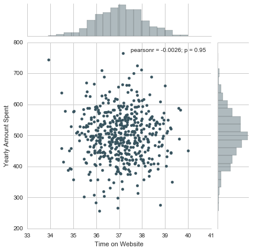
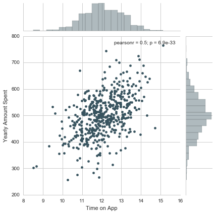

___

<a href='http://www.pieriandata.com'> </a>
___
# Linear Regression Project

Congratulations! You just got some contract work with an Ecommerce company based in New York City that sells clothing online but they also have in-store style and clothing advice sessions. Customers come in to the store, have sessions/meetings with a personal stylist, then they can go home and order either on a mobile app or website for the clothes they want.

The company is trying to decide whether to focus their efforts on their mobile app experience or their website. They've hired you on contract to help them figure it out! Let's get started!

Just follow the steps below to analyze the customer data (it's fake, don't worry I didn't give you real credit card numbers or emails).

## Imports
** Import pandas, numpy, matplotlib,and seaborn. Then set %matplotlib inline 
(You'll import sklearn as you need it.)**


```python
import pandas as pd
import numpy as np
import matplotlib.pyplot as plt
import seaborn as sns
%matplotlib inline
```

## Get the Data

We'll work with the Ecommerce Customers csv file from the company. It has Customer info, suchas Email, Address, and their color Avatar. Then it also has numerical value columns:

* Avg. Session Length: Average session of in-store style advice sessions.
* Time on App: Average time spent on App in minutes
* Time on Website: Average time spent on Website in minutes
* Length of Membership: How many years the customer has been a member. 

** Read in the Ecommerce Customers csv file as a DataFrame called customers.**


```python
df = pd.read_csv('Ecommerce Customers')
```


```python
df.head()
```


<div>
<style scoped>
    .dataframe tbody tr th:only-of-type {
        vertical-align: middle;
    }

    .dataframe tbody tr th {
        vertical-align: top;
    }

    .dataframe thead th {
        text-align: right;
    }
</style>
<table border="1" class="dataframe">
  <thead>
    <tr style="text-align: right;">
      <th></th>
      <th>Email</th>
      <th>Address</th>
      <th>Avatar</th>
      <th>Avg. Session Length</th>
      <th>Time on App</th>
      <th>Time on Website</th>
      <th>Length of Membership</th>
      <th>Yearly Amount Spent</th>
    </tr>
  </thead>
  <tbody>
    <tr>
      <th>0</th>
      <td>mstephenson@fernandez.com</td>
      <td>835 Frank Tunnel\nWrightmouth, MI 82180-9605</td>
      <td>Violet</td>
      <td>34.497268</td>
      <td>12.655651</td>
      <td>39.577668</td>
      <td>4.082621</td>
      <td>587.951054</td>
    </tr>
    <tr>
      <th>1</th>
      <td>hduke@hotmail.com</td>
      <td>4547 Archer Common\nDiazchester, CA 06566-8576</td>
      <td>DarkGreen</td>
      <td>31.926272</td>
      <td>11.109461</td>
      <td>37.268959</td>
      <td>2.664034</td>
      <td>392.204933</td>
    </tr>
    <tr>
      <th>2</th>
      <td>pallen@yahoo.com</td>
      <td>24645 Valerie Unions Suite 582\nCobbborough, D...</td>
      <td>Bisque</td>
      <td>33.000915</td>
      <td>11.330278</td>
      <td>37.110597</td>
      <td>4.104543</td>
      <td>487.547505</td>
    </tr>
    <tr>
      <th>3</th>
      <td>riverarebecca@gmail.com</td>
      <td>1414 David Throughway\nPort Jason, OH 22070-1220</td>
      <td>SaddleBrown</td>
      <td>34.305557</td>
      <td>13.717514</td>
      <td>36.721283</td>
      <td>3.120179</td>
      <td>581.852344</td>
    </tr>
    <tr>
      <th>4</th>
      <td>mstephens@davidson-herman.com</td>
      <td>14023 Rodriguez Passage\nPort Jacobville, PR 3...</td>
      <td>MediumAquaMarine</td>
      <td>33.330673</td>
      <td>12.795189</td>
      <td>37.536653</td>
      <td>4.446308</td>
      <td>599.406092</td>
    </tr>
  </tbody>
</table>
</div>


```python
df.info()
```

    <class 'pandas.core.frame.DataFrame'>
    RangeIndex: 500 entries, 0 to 499
    Data columns (total 8 columns):
     #   Column                Non-Null Count  Dtype  
    ---  ------                --------------  -----  
     0   Email                 500 non-null    object 
     1   Address               500 non-null    object 
     2   Avatar                500 non-null    object 
     3   Avg. Session Length   500 non-null    float64
     4   Time on App           500 non-null    float64
     5   Time on Website       500 non-null    float64
     6   Length of Membership  500 non-null    float64
     7   Yearly Amount Spent   500 non-null    float64
    dtypes: float64(5), object(3)
    memory usage: 31.4+ KB
    


```python
df.describe()
```


<div>
<style scoped>
    .dataframe tbody tr th:only-of-type {
        vertical-align: middle;
    }

    .dataframe tbody tr th {
        vertical-align: top;
    }

    .dataframe thead th {
        text-align: right;
    }
</style>
<table border="1" class="dataframe">
  <thead>
    <tr style="text-align: right;">
      <th></th>
      <th>Avg. Session Length</th>
      <th>Time on App</th>
      <th>Time on Website</th>
      <th>Length of Membership</th>
      <th>Yearly Amount Spent</th>
    </tr>
  </thead>
  <tbody>
    <tr>
      <th>count</th>
      <td>500.000000</td>
      <td>500.000000</td>
      <td>500.000000</td>
      <td>500.000000</td>
      <td>500.000000</td>
    </tr>
    <tr>
      <th>mean</th>
      <td>33.053194</td>
      <td>12.052488</td>
      <td>37.060445</td>
      <td>3.533462</td>
      <td>499.314038</td>
    </tr>
    <tr>
      <th>std</th>
      <td>0.992563</td>
      <td>0.994216</td>
      <td>1.010489</td>
      <td>0.999278</td>
      <td>79.314782</td>
    </tr>
    <tr>
      <th>min</th>
      <td>29.532429</td>
      <td>8.508152</td>
      <td>33.913847</td>
      <td>0.269901</td>
      <td>256.670582</td>
    </tr>
    <tr>
      <th>25%</th>
      <td>32.341822</td>
      <td>11.388153</td>
      <td>36.349257</td>
      <td>2.930450</td>
      <td>445.038277</td>
    </tr>
    <tr>
      <th>50%</th>
      <td>33.082008</td>
      <td>11.983231</td>
      <td>37.069367</td>
      <td>3.533975</td>
      <td>498.887875</td>
    </tr>
    <tr>
      <th>75%</th>
      <td>33.711985</td>
      <td>12.753850</td>
      <td>37.716432</td>
      <td>4.126502</td>
      <td>549.313828</td>
    </tr>
    <tr>
      <th>max</th>
      <td>36.139662</td>
      <td>15.126994</td>
      <td>40.005182</td>
      <td>6.922689</td>
      <td>765.518462</td>
    </tr>
  </tbody>
</table>
</div>


```python
df.columns
```


    Index(['Email', 'Address', 'Avatar', 'Avg. Session Length', 'Time on App',
           'Time on Website', 'Length of Membership', 'Yearly Amount Spent'],
          dtype='object')


```python
sns.pairplot(df)
```


    <seaborn.axisgrid.PairGrid at 0x15624024ca0>


    

    


```python

```


```python

```

**Check the head of customers, and check out its info() and describe() methods.**


```python
df.head()
```


<div>
<style scoped>
    .dataframe tbody tr th:only-of-type {
        vertical-align: middle;
    }

    .dataframe tbody tr th {
        vertical-align: top;
    }

    .dataframe thead th {
        text-align: right;
    }
</style>
<table border="1" class="dataframe">
  <thead>
    <tr style="text-align: right;">
      <th></th>
      <th>Email</th>
      <th>Address</th>
      <th>Avatar</th>
      <th>Avg. Session Length</th>
      <th>Time on App</th>
      <th>Time on Website</th>
      <th>Length of Membership</th>
      <th>Yearly Amount Spent</th>
    </tr>
  </thead>
  <tbody>
    <tr>
      <th>0</th>
      <td>mstephenson@fernandez.com</td>
      <td>835 Frank Tunnel\nWrightmouth, MI 82180-9605</td>
      <td>Violet</td>
      <td>34.497268</td>
      <td>12.655651</td>
      <td>39.577668</td>
      <td>4.082621</td>
      <td>587.951054</td>
    </tr>
    <tr>
      <th>1</th>
      <td>hduke@hotmail.com</td>
      <td>4547 Archer Common\nDiazchester, CA 06566-8576</td>
      <td>DarkGreen</td>
      <td>31.926272</td>
      <td>11.109461</td>
      <td>37.268959</td>
      <td>2.664034</td>
      <td>392.204933</td>
    </tr>
    <tr>
      <th>2</th>
      <td>pallen@yahoo.com</td>
      <td>24645 Valerie Unions Suite 582\nCobbborough, D...</td>
      <td>Bisque</td>
      <td>33.000915</td>
      <td>11.330278</td>
      <td>37.110597</td>
      <td>4.104543</td>
      <td>487.547505</td>
    </tr>
    <tr>
      <th>3</th>
      <td>riverarebecca@gmail.com</td>
      <td>1414 David Throughway\nPort Jason, OH 22070-1220</td>
      <td>SaddleBrown</td>
      <td>34.305557</td>
      <td>13.717514</td>
      <td>36.721283</td>
      <td>3.120179</td>
      <td>581.852344</td>
    </tr>
    <tr>
      <th>4</th>
      <td>mstephens@davidson-herman.com</td>
      <td>14023 Rodriguez Passage\nPort Jacobville, PR 3...</td>
      <td>MediumAquaMarine</td>
      <td>33.330673</td>
      <td>12.795189</td>
      <td>37.536653</td>
      <td>4.446308</td>
      <td>599.406092</td>
    </tr>
  </tbody>
</table>
</div>


```python
df.describe()
```


<div>
<style scoped>
    .dataframe tbody tr th:only-of-type {
        vertical-align: middle;
    }

    .dataframe tbody tr th {
        vertical-align: top;
    }

    .dataframe thead th {
        text-align: right;
    }
</style>
<table border="1" class="dataframe">
  <thead>
    <tr style="text-align: right;">
      <th></th>
      <th>Avg. Session Length</th>
      <th>Time on App</th>
      <th>Time on Website</th>
      <th>Length of Membership</th>
      <th>Yearly Amount Spent</th>
    </tr>
  </thead>
  <tbody>
    <tr>
      <th>count</th>
      <td>500.000000</td>
      <td>500.000000</td>
      <td>500.000000</td>
      <td>500.000000</td>
      <td>500.000000</td>
    </tr>
    <tr>
      <th>mean</th>
      <td>33.053194</td>
      <td>12.052488</td>
      <td>37.060445</td>
      <td>3.533462</td>
      <td>499.314038</td>
    </tr>
    <tr>
      <th>std</th>
      <td>0.992563</td>
      <td>0.994216</td>
      <td>1.010489</td>
      <td>0.999278</td>
      <td>79.314782</td>
    </tr>
    <tr>
      <th>min</th>
      <td>29.532429</td>
      <td>8.508152</td>
      <td>33.913847</td>
      <td>0.269901</td>
      <td>256.670582</td>
    </tr>
    <tr>
      <th>25%</th>
      <td>32.341822</td>
      <td>11.388153</td>
      <td>36.349257</td>
      <td>2.930450</td>
      <td>445.038277</td>
    </tr>
    <tr>
      <th>50%</th>
      <td>33.082008</td>
      <td>11.983231</td>
      <td>37.069367</td>
      <td>3.533975</td>
      <td>498.887875</td>
    </tr>
    <tr>
      <th>75%</th>
      <td>33.711985</td>
      <td>12.753850</td>
      <td>37.716432</td>
      <td>4.126502</td>
      <td>549.313828</td>
    </tr>
    <tr>
      <th>max</th>
      <td>36.139662</td>
      <td>15.126994</td>
      <td>40.005182</td>
      <td>6.922689</td>
      <td>765.518462</td>
    </tr>
  </tbody>
</table>
</div>


```python
df.info()
```

    <class 'pandas.core.frame.DataFrame'>
    RangeIndex: 500 entries, 0 to 499
    Data columns (total 8 columns):
     #   Column                Non-Null Count  Dtype  
    ---  ------                --------------  -----  
     0   Email                 500 non-null    object 
     1   Address               500 non-null    object 
     2   Avatar                500 non-null    object 
     3   Avg. Session Length   500 non-null    float64
     4   Time on App           500 non-null    float64
     5   Time on Website       500 non-null    float64
     6   Length of Membership  500 non-null    float64
     7   Yearly Amount Spent   500 non-null    float64
    dtypes: float64(5), object(3)
    memory usage: 31.4+ KB
    


```python

```


```python

```


<div>
<table border="1" class="dataframe">
  <thead>
    <tr style="text-align: right;">
      <th></th>
      <th>Email</th>
      <th>Address</th>
      <th>Avatar</th>
      <th>Avg. Session Length</th>
      <th>Time on App</th>
      <th>Time on Website</th>
      <th>Length of Membership</th>
      <th>Yearly Amount Spent</th>
    </tr>
  </thead>
  <tbody>
    <tr>
      <th>0</th>
      <td>mstephenson@fernandez.com</td>
      <td>835 Frank Tunnel\nWrightmouth, MI 82180-9605</td>
      <td>Violet</td>
      <td>34.497268</td>
      <td>12.655651</td>
      <td>39.577668</td>
      <td>4.082621</td>
      <td>587.951054</td>
    </tr>
    <tr>
      <th>1</th>
      <td>hduke@hotmail.com</td>
      <td>4547 Archer Common\nDiazchester, CA 06566-8576</td>
      <td>DarkGreen</td>
      <td>31.926272</td>
      <td>11.109461</td>
      <td>37.268959</td>
      <td>2.664034</td>
      <td>392.204933</td>
    </tr>
    <tr>
      <th>2</th>
      <td>pallen@yahoo.com</td>
      <td>24645 Valerie Unions Suite 582\nCobbborough, D...</td>
      <td>Bisque</td>
      <td>33.000915</td>
      <td>11.330278</td>
      <td>37.110597</td>
      <td>4.104543</td>
      <td>487.547505</td>
    </tr>
    <tr>
      <th>3</th>
      <td>riverarebecca@gmail.com</td>
      <td>1414 David Throughway\nPort Jason, OH 22070-1220</td>
      <td>SaddleBrown</td>
      <td>34.305557</td>
      <td>13.717514</td>
      <td>36.721283</td>
      <td>3.120179</td>
      <td>581.852344</td>
    </tr>
    <tr>
      <th>4</th>
      <td>mstephens@davidson-herman.com</td>
      <td>14023 Rodriguez Passage\nPort Jacobville, PR 3...</td>
      <td>MediumAquaMarine</td>
      <td>33.330673</td>
      <td>12.795189</td>
      <td>37.536653</td>
      <td>4.446308</td>
      <td>599.406092</td>
    </tr>
  </tbody>
</table>
</div>


```python

```


<div>
<table border="1" class="dataframe">
  <thead>
    <tr style="text-align: right;">
      <th></th>
      <th>Avg. Session Length</th>
      <th>Time on App</th>
      <th>Time on Website</th>
      <th>Length of Membership</th>
      <th>Yearly Amount Spent</th>
    </tr>
  </thead>
  <tbody>
    <tr>
      <th>count</th>
      <td>500.000000</td>
      <td>500.000000</td>
      <td>500.000000</td>
      <td>500.000000</td>
      <td>500.000000</td>
    </tr>
    <tr>
      <th>mean</th>
      <td>33.053194</td>
      <td>12.052488</td>
      <td>37.060445</td>
      <td>3.533462</td>
      <td>499.314038</td>
    </tr>
    <tr>
      <th>std</th>
      <td>0.992563</td>
      <td>0.994216</td>
      <td>1.010489</td>
      <td>0.999278</td>
      <td>79.314782</td>
    </tr>
    <tr>
      <th>min</th>
      <td>29.532429</td>
      <td>8.508152</td>
      <td>33.913847</td>
      <td>0.269901</td>
      <td>256.670582</td>
    </tr>
    <tr>
      <th>25%</th>
      <td>32.341822</td>
      <td>11.388153</td>
      <td>36.349257</td>
      <td>2.930450</td>
      <td>445.038277</td>
    </tr>
    <tr>
      <th>50%</th>
      <td>33.082008</td>
      <td>11.983231</td>
      <td>37.069367</td>
      <td>3.533975</td>
      <td>498.887875</td>
    </tr>
    <tr>
      <th>75%</th>
      <td>33.711985</td>
      <td>12.753850</td>
      <td>37.716432</td>
      <td>4.126502</td>
      <td>549.313828</td>
    </tr>
    <tr>
      <th>max</th>
      <td>36.139662</td>
      <td>15.126994</td>
      <td>40.005182</td>
      <td>6.922689</td>
      <td>765.518462</td>
    </tr>
  </tbody>
</table>
</div>


```python

```

    <class 'pandas.core.frame.DataFrame'>
    RangeIndex: 500 entries, 0 to 499
    Data columns (total 8 columns):
    Email                   500 non-null object
    Address                 500 non-null object
    Avatar                  500 non-null object
    Avg. Session Length     500 non-null float64
    Time on App             500 non-null float64
    Time on Website         500 non-null float64
    Length of Membership    500 non-null float64
    Yearly Amount Spent     500 non-null float64
    dtypes: float64(5), object(3)
    memory usage: 31.3+ KB
    

## Exploratory Data Analysis

**Let's explore the data!**

For the rest of the exercise we'll only be using the numerical data of the csv file.
___
**Use seaborn to create a jointplot to compare the Time on Website and Yearly Amount Spent columns. Does the correlation make sense?**


```python
df.columns
```


    Index(['Email', 'Address', 'Avatar', 'Avg. Session Length', 'Time on App',
           'Time on Website', 'Length of Membership', 'Yearly Amount Spent'],
          dtype='object')


```python
sns.jointplot(x='Time on Website', y='Yearly Amount Spent', data=df)
```


    <seaborn.axisgrid.JointGrid at 0x15625a7adc0>


    

    


```python

```


```python

```


    <seaborn.axisgrid.JointGrid at 0x120bfcc88>


    

    


** Do the same but with the Time on App column instead. **


```python
sns.jointplot(x='Time on App', y='Yearly Amount Spent', data=df)
```


    <seaborn.axisgrid.JointGrid at 0x15625d38af0>


    

    


```python

```


    <seaborn.axisgrid.JointGrid at 0x132db5908>


    

    


** Use jointplot to create a 2D hex bin plot comparing Time on App and Length of Membership.**


```python
sns.jointplot(x='Time on App', y='Length of Membership', data=df, kind='hex')
```


    <seaborn.axisgrid.JointGrid at 0x15626f87f40>


    

    


```python

```


    <seaborn.axisgrid.JointGrid at 0x130edac88>


    

    


**Let's explore these types of relationships across the entire data set. Use [pairplot](https://stanford.edu/~mwaskom/software/seaborn/tutorial/axis_grids.html#plotting-pairwise-relationships-with-pairgrid-and-pairplot) to recreate the plot below.(Don't worry about the the colors)**


```python
sns.pairplot(df)
```


    <seaborn.axisgrid.PairGrid at 0x156270a8ee0>


    

    


```python

```


    <seaborn.axisgrid.PairGrid at 0x132fb3da0>


    

    


**Based off this plot what looks to be the most correlated feature with Yearly Amount Spent?**


```python
Length of Membership
```


```python

```

**Create a linear model plot (using seaborn's lmplot) of  Yearly Amount Spent vs. Length of Membership. **


```python
df.corr()
```


<div>
<style scoped>
    .dataframe tbody tr th:only-of-type {
        vertical-align: middle;
    }

    .dataframe tbody tr th {
        vertical-align: top;
    }

    .dataframe thead th {
        text-align: right;
    }
</style>
<table border="1" class="dataframe">
  <thead>
    <tr style="text-align: right;">
      <th></th>
      <th>Avg. Session Length</th>
      <th>Time on App</th>
      <th>Time on Website</th>
      <th>Length of Membership</th>
      <th>Yearly Amount Spent</th>
    </tr>
  </thead>
  <tbody>
    <tr>
      <th>Avg. Session Length</th>
      <td>1.000000</td>
      <td>-0.027826</td>
      <td>-0.034987</td>
      <td>0.060247</td>
      <td>0.355088</td>
    </tr>
    <tr>
      <th>Time on App</th>
      <td>-0.027826</td>
      <td>1.000000</td>
      <td>0.082388</td>
      <td>0.029143</td>
      <td>0.499328</td>
    </tr>
    <tr>
      <th>Time on Website</th>
      <td>-0.034987</td>
      <td>0.082388</td>
      <td>1.000000</td>
      <td>-0.047582</td>
      <td>-0.002641</td>
    </tr>
    <tr>
      <th>Length of Membership</th>
      <td>0.060247</td>
      <td>0.029143</td>
      <td>-0.047582</td>
      <td>1.000000</td>
      <td>0.809084</td>
    </tr>
    <tr>
      <th>Yearly Amount Spent</th>
      <td>0.355088</td>
      <td>0.499328</td>
      <td>-0.002641</td>
      <td>0.809084</td>
      <td>1.000000</td>
    </tr>
  </tbody>
</table>
</div>


```python
sns.lmplot(x='Length of Membership', y='Yearly Amount Spent', data=df)
```


    <seaborn.axisgrid.FacetGrid at 0x156282342e0>


    

    


```python

```


    <seaborn.axisgrid.FacetGrid at 0x13538d0b8>


    

    


## Training and Testing Data

Now that we've explored the data a bit, let's go ahead and split the data into training and testing sets.
** Set a variable X equal to the numerical features of the customers and a variable y equal to the "Yearly Amount Spent" column. **


```python
df.columns
```


    Index(['Email', 'Address', 'Avatar', 'Avg. Session Length', 'Time on App',
           'Time on Website', 'Length of Membership', 'Yearly Amount Spent'],
          dtype='object')


```python
df.info()
```

    <class 'pandas.core.frame.DataFrame'>
    RangeIndex: 500 entries, 0 to 499
    Data columns (total 8 columns):
     #   Column                Non-Null Count  Dtype  
    ---  ------                --------------  -----  
     0   Email                 500 non-null    object 
     1   Address               500 non-null    object 
     2   Avatar                500 non-null    object 
     3   Avg. Session Length   500 non-null    float64
     4   Time on App           500 non-null    float64
     5   Time on Website       500 non-null    float64
     6   Length of Membership  500 non-null    float64
     7   Yearly Amount Spent   500 non-null    float64
    dtypes: float64(5), object(3)
    memory usage: 31.4+ KB
    


```python
X = df[['Avg. Session Length', 'Time on App',
       'Time on Website', 'Length of Membership']]
```


```python
y = df['Yearly Amount Spent']
```


```python

```


```python

```


```python

```

** Use model_selection.train_test_split from sklearn to split the data into training and testing sets. Set test_size=0.3 and random_state=101**


```python
from sklearn.model_selection import train_test_split
```


```python
X_train, X_test, y_train, y_test = train_test_split(X, y, test_size=0.3, random_state=101)
```


```python

```


```python

```

## Training the Model

Now its time to train our model on our training data!

** Import LinearRegression from sklearn.linear_model **


```python
from sklearn.linear_model import LinearRegression
```


```python

```


```python

```


    LinearRegression()


```python

```

**Create an instance of a LinearRegression() model named lm.**


```python
lm = LinearRegression()
```


```python

```

** Train/fit lm on the training data.**


```python
lm.fit(X_train, y_train)
```


    LinearRegression()


```python

```


    LinearRegression(copy_X=True, fit_intercept=True, n_jobs=1, normalize=False)


**Print out the coefficients of the model**


```python
print(lm.intercept_)
```

    -1047.932782250239
    


```python
print(lm.coef_)
```

    [25.98154972 38.59015875  0.19040528 61.27909654]
    


```python
cdf = pd.DataFrame(lm.coef_, X.columns, columns=['Coeff'])
```


```python
cdf
```


<div>
<style scoped>
    .dataframe tbody tr th:only-of-type {
        vertical-align: middle;
    }

    .dataframe tbody tr th {
        vertical-align: top;
    }

    .dataframe thead th {
        text-align: right;
    }
</style>
<table border="1" class="dataframe">
  <thead>
    <tr style="text-align: right;">
      <th></th>
      <th>Coeff</th>
    </tr>
  </thead>
  <tbody>
    <tr>
      <th>Avg. Session Length</th>
      <td>25.981550</td>
    </tr>
    <tr>
      <th>Time on App</th>
      <td>38.590159</td>
    </tr>
    <tr>
      <th>Time on Website</th>
      <td>0.190405</td>
    </tr>
    <tr>
      <th>Length of Membership</th>
      <td>61.279097</td>
    </tr>
  </tbody>
</table>
</div>


```python

```

    Coefficients: 
     [ 25.98154972  38.59015875   0.19040528  61.27909654]
    

## Predicting Test Data
Now that we have fit our model, let's evaluate its performance by predicting off the test values!

** Use lm.predict() to predict off the X_test set of the data.**


```python
predictions = lm.predict(X_test)
```


```python
predictions
```


    array([456.44186104, 402.72005312, 409.2531539 , 591.4310343 ,
           590.01437275, 548.82396607, 577.59737969, 715.44428115,
           473.7893446 , 545.9211364 , 337.8580314 , 500.38506697,
           552.93478041, 409.6038964 , 765.52590754, 545.83973731,
           693.25969124, 507.32416226, 573.10533175, 573.2076631 ,
           397.44989709, 555.0985107 , 458.19868141, 482.66899911,
           559.2655959 , 413.00946082, 532.25727408, 377.65464817,
           535.0209653 , 447.80070905, 595.54339577, 667.14347072,
           511.96042791, 573.30433971, 505.02260887, 565.30254655,
           460.38785393, 449.74727868, 422.87193429, 456.55615271,
           598.10493696, 449.64517443, 615.34948995, 511.88078685,
           504.37568058, 515.95249276, 568.64597718, 551.61444684,
           356.5552241 , 464.9759817 , 481.66007708, 534.2220025 ,
           256.28674001, 505.30810714, 520.01844434, 315.0298707 ,
           501.98080155, 387.03842642, 472.97419543, 432.8704675 ,
           539.79082198, 590.03070739, 752.86997652, 558.27858232,
           523.71988382, 431.77690078, 425.38411902, 518.75571466,
           641.9667215 , 481.84855126, 549.69830187, 380.93738919,
           555.18178277, 403.43054276, 472.52458887, 501.82927633,
           473.5561656 , 456.76720365, 554.74980563, 702.96835044,
           534.68884588, 619.18843136, 500.11974127, 559.43899225,
           574.8730604 , 505.09183544, 529.9537559 , 479.20749452,
           424.78407899, 452.20986599, 525.74178343, 556.60674724,
           425.7142882 , 588.8473985 , 490.77053065, 562.56866231,
           495.75782933, 445.17937217, 456.64011682, 537.98437395,
           367.06451757, 421.12767301, 551.59651363, 528.26019754,
           493.47639211, 495.28105313, 519.81827269, 461.15666582,
           528.8711677 , 442.89818166, 543.20201646, 350.07871481,
           401.49148567, 606.87291134, 577.04816561, 524.50431281,
           554.11225704, 507.93347015, 505.35674292, 371.65146821,
           342.37232987, 634.43998975, 523.46931378, 532.7831345 ,
           574.59948331, 435.57455636, 599.92586678, 487.24017405,
           457.66383406, 425.25959495, 331.81731213, 443.70458331,
           563.47279005, 466.14764208, 463.51837671, 381.29445432,
           411.88795623, 473.48087683, 573.31745784, 417.55430913,
           543.50149858, 547.81091537, 547.62977348, 450.99057409,
           561.50896321, 478.30076589, 484.41029555, 457.59099941,
           411.52657592, 375.47900638])


```python
y_test
```


    18     452.315675
    361    401.033135
    104    410.069611
    4      599.406092
    156    586.155870
              ...    
    147    479.731938
    346    488.387526
    423    461.112248
    17     407.704548
    259    375.398455
    Name: Yearly Amount Spent, Length: 150, dtype: float64


** Create a scatterplot of the real test values versus the predicted values. **


```python
plt.scatter(y_test, predictions)
```


    <matplotlib.collections.PathCollection at 0x15627d48580>


    

    


```python

```


    <matplotlib.text.Text at 0x135546320>


    

    


## Evaluating the Model

Let's evaluate our model performance by calculating the residual sum of squares and the explained variance score (R^2).

** Calculate the Mean Absolute Error, Mean Squared Error, and the Root Mean Squared Error. Refer to the lecture or to Wikipedia for the formulas**


```python
from sklearn import metrics
```


```python
print(metrics.mean_absolute_error(y_test, predictions))
print(metrics.mean_squared_error(y_test, predictions))
print(np.sqrt(metrics.mean_squared_error(y_test, predictions)))
```

    7.228148653430841
    79.81305165097457
    8.93381506697864
    


```python

```

    MAE: 7.22814865343
    MSE: 79.813051651
    RMSE: 8.93381506698
    

## Residuals

You should have gotten a very good model with a good fit. Let's quickly explore the residuals to make sure everything was okay with our data. 

**Plot a histogram of the residuals and make sure it looks normally distributed. Use either seaborn distplot, or just plt.hist().**


```python
plt.hist((y_test - predictions), bins=50)
```


    (array([1., 0., 0., 0., 0., 0., 1., 1., 2., 1., 1., 4., 2., 2., 6., 7., 6.,
            7., 7., 7., 9., 8., 6., 6., 7., 9., 2., 7., 6., 3., 7., 5., 4., 5.,
            4., 1., 0., 2., 1., 1., 1., 0., 0., 0., 0., 0., 0., 0., 0., 1.]),
     array([-26.95573072, -25.81664466, -24.67755861, -23.53847256,
            -22.3993865 , -21.26030045, -20.1212144 , -18.98212835,
            -17.84304229, -16.70395624, -15.56487019, -14.42578414,
            -13.28669808, -12.14761203, -11.00852598,  -9.86943992,
             -8.73035387,  -7.59126782,  -6.45218177,  -5.31309571,
             -4.17400966,  -3.03492361,  -1.89583755,  -0.7567515 ,
              0.38233455,   1.5214206 ,   2.66050666,   3.79959271,
              4.93867876,   6.07776481,   7.21685087,   8.35593692,
              9.49502297,  10.63410903,  11.77319508,  12.91228113,
             14.05136718,  15.19045324,  16.32953929,  17.46862534,
             18.6077114 ,  19.74679745,  20.8858835 ,  22.02496955,
             23.16405561,  24.30314166,  25.44222771,  26.58131376,
             27.72039982,  28.85948587,  29.99857192]),
     <BarContainer object of 50 artists>)


    

    


```python

```


    

    


## Conclusion
We still want to figure out the answer to the original question, do we focus our efforst on mobile app or website development? Or maybe that doesn't even really matter, and Membership Time is what is really important.  Let's see if we can interpret the coefficients at all to get an idea.

** Recreate the dataframe below. **


```python
cdf = pd.DataFrame(lm.coef_, X.columns, columns=['Coeffecient'])
cdf
'''
** How can you interpret these coefficients? **
Length of Mebership is most coefficient to Yearly pay

Do you think the company should focus more on their mobile app or on their website?

No. They should focus on Membership most
'''
```


    '\n** How can you interpret these coefficients? **\nLength of Mebership is most coefficient to Yearly pay\n\nDo you think the company should focus more on their mobile app or on their website?\n\nNo. They should focus on Membership most\n'


```python

```


```python

```


<div>
<table border="1" class="dataframe">
  <thead>
    <tr style="text-align: right;">
      <th></th>
      <th>Coeffecient</th>
    </tr>
  </thead>
  <tbody>
    <tr>
      <th>Avg. Session Length</th>
      <td>25.981550</td>
    </tr>
    <tr>
      <th>Time on App</th>
      <td>38.590159</td>
    </tr>
    <tr>
      <th>Time on Website</th>
      <td>0.190405</td>
    </tr>
    <tr>
      <th>Length of Membership</th>
      <td>61.279097</td>
    </tr>
  </tbody>
</table>
</div>


** How can you interpret these coefficients? **

*Answer here*

**Do you think the company should focus more on their mobile app or on their website?**

*Answer here*

## Great Job!

Congrats on your contract work! The company loved the insights! Let's move on.
