```python
import pandas as pd
import numpy as np
```


```python
import matplotlib.pyplot as plt
import seaborn as sns
%matplotlib inline
```


```python
train = pd.read_csv('titanic_train.csv')
```


```python
train.head()
```


<div>
<style scoped>
    .dataframe tbody tr th:only-of-type {
        vertical-align: middle;
    }

    .dataframe tbody tr th {
        vertical-align: top;
    }

    .dataframe thead th {
        text-align: right;
    }
</style>
<table border="1" class="dataframe">
  <thead>
    <tr style="text-align: right;">
      <th></th>
      <th>PassengerId</th>
      <th>Survived</th>
      <th>Pclass</th>
      <th>Name</th>
      <th>Sex</th>
      <th>Age</th>
      <th>SibSp</th>
      <th>Parch</th>
      <th>Ticket</th>
      <th>Fare</th>
      <th>Cabin</th>
      <th>Embarked</th>
    </tr>
  </thead>
  <tbody>
    <tr>
      <th>0</th>
      <td>1</td>
      <td>0</td>
      <td>3</td>
      <td>Braund, Mr. Owen Harris</td>
      <td>male</td>
      <td>22.0</td>
      <td>1</td>
      <td>0</td>
      <td>A/5 21171</td>
      <td>7.2500</td>
      <td>NaN</td>
      <td>S</td>
    </tr>
    <tr>
      <th>1</th>
      <td>2</td>
      <td>1</td>
      <td>1</td>
      <td>Cumings, Mrs. John Bradley (Florence Briggs Th...</td>
      <td>female</td>
      <td>38.0</td>
      <td>1</td>
      <td>0</td>
      <td>PC 17599</td>
      <td>71.2833</td>
      <td>C85</td>
      <td>C</td>
    </tr>
    <tr>
      <th>2</th>
      <td>3</td>
      <td>1</td>
      <td>3</td>
      <td>Heikkinen, Miss. Laina</td>
      <td>female</td>
      <td>26.0</td>
      <td>0</td>
      <td>0</td>
      <td>STON/O2. 3101282</td>
      <td>7.9250</td>
      <td>NaN</td>
      <td>S</td>
    </tr>
    <tr>
      <th>3</th>
      <td>4</td>
      <td>1</td>
      <td>1</td>
      <td>Futrelle, Mrs. Jacques Heath (Lily May Peel)</td>
      <td>female</td>
      <td>35.0</td>
      <td>1</td>
      <td>0</td>
      <td>113803</td>
      <td>53.1000</td>
      <td>C123</td>
      <td>S</td>
    </tr>
    <tr>
      <th>4</th>
      <td>5</td>
      <td>0</td>
      <td>3</td>
      <td>Allen, Mr. William Henry</td>
      <td>male</td>
      <td>35.0</td>
      <td>0</td>
      <td>0</td>
      <td>373450</td>
      <td>8.0500</td>
      <td>NaN</td>
      <td>S</td>
    </tr>
  </tbody>
</table>
</div>


```python
train.isnull()
```


<div>
<style scoped>
    .dataframe tbody tr th:only-of-type {
        vertical-align: middle;
    }

    .dataframe tbody tr th {
        vertical-align: top;
    }

    .dataframe thead th {
        text-align: right;
    }
</style>
<table border="1" class="dataframe">
  <thead>
    <tr style="text-align: right;">
      <th></th>
      <th>PassengerId</th>
      <th>Survived</th>
      <th>Pclass</th>
      <th>Name</th>
      <th>Sex</th>
      <th>Age</th>
      <th>SibSp</th>
      <th>Parch</th>
      <th>Ticket</th>
      <th>Fare</th>
      <th>Cabin</th>
      <th>Embarked</th>
    </tr>
  </thead>
  <tbody>
    <tr>
      <th>0</th>
      <td>False</td>
      <td>False</td>
      <td>False</td>
      <td>False</td>
      <td>False</td>
      <td>False</td>
      <td>False</td>
      <td>False</td>
      <td>False</td>
      <td>False</td>
      <td>True</td>
      <td>False</td>
    </tr>
    <tr>
      <th>1</th>
      <td>False</td>
      <td>False</td>
      <td>False</td>
      <td>False</td>
      <td>False</td>
      <td>False</td>
      <td>False</td>
      <td>False</td>
      <td>False</td>
      <td>False</td>
      <td>False</td>
      <td>False</td>
    </tr>
    <tr>
      <th>2</th>
      <td>False</td>
      <td>False</td>
      <td>False</td>
      <td>False</td>
      <td>False</td>
      <td>False</td>
      <td>False</td>
      <td>False</td>
      <td>False</td>
      <td>False</td>
      <td>True</td>
      <td>False</td>
    </tr>
    <tr>
      <th>3</th>
      <td>False</td>
      <td>False</td>
      <td>False</td>
      <td>False</td>
      <td>False</td>
      <td>False</td>
      <td>False</td>
      <td>False</td>
      <td>False</td>
      <td>False</td>
      <td>False</td>
      <td>False</td>
    </tr>
    <tr>
      <th>4</th>
      <td>False</td>
      <td>False</td>
      <td>False</td>
      <td>False</td>
      <td>False</td>
      <td>False</td>
      <td>False</td>
      <td>False</td>
      <td>False</td>
      <td>False</td>
      <td>True</td>
      <td>False</td>
    </tr>
    <tr>
      <th>...</th>
      <td>...</td>
      <td>...</td>
      <td>...</td>
      <td>...</td>
      <td>...</td>
      <td>...</td>
      <td>...</td>
      <td>...</td>
      <td>...</td>
      <td>...</td>
      <td>...</td>
      <td>...</td>
    </tr>
    <tr>
      <th>886</th>
      <td>False</td>
      <td>False</td>
      <td>False</td>
      <td>False</td>
      <td>False</td>
      <td>False</td>
      <td>False</td>
      <td>False</td>
      <td>False</td>
      <td>False</td>
      <td>True</td>
      <td>False</td>
    </tr>
    <tr>
      <th>887</th>
      <td>False</td>
      <td>False</td>
      <td>False</td>
      <td>False</td>
      <td>False</td>
      <td>False</td>
      <td>False</td>
      <td>False</td>
      <td>False</td>
      <td>False</td>
      <td>False</td>
      <td>False</td>
    </tr>
    <tr>
      <th>888</th>
      <td>False</td>
      <td>False</td>
      <td>False</td>
      <td>False</td>
      <td>False</td>
      <td>True</td>
      <td>False</td>
      <td>False</td>
      <td>False</td>
      <td>False</td>
      <td>True</td>
      <td>False</td>
    </tr>
    <tr>
      <th>889</th>
      <td>False</td>
      <td>False</td>
      <td>False</td>
      <td>False</td>
      <td>False</td>
      <td>False</td>
      <td>False</td>
      <td>False</td>
      <td>False</td>
      <td>False</td>
      <td>False</td>
      <td>False</td>
    </tr>
    <tr>
      <th>890</th>
      <td>False</td>
      <td>False</td>
      <td>False</td>
      <td>False</td>
      <td>False</td>
      <td>False</td>
      <td>False</td>
      <td>False</td>
      <td>False</td>
      <td>False</td>
      <td>True</td>
      <td>False</td>
    </tr>
  </tbody>
</table>
<p>891 rows × 12 columns</p>
</div>


```python
sns.heatmap(train.isnull(), yticklabels=False, cbar=False, cmap='viridis')

# yellow means null
```


    <AxesSubplot:>


    
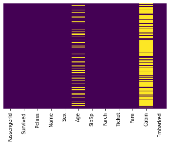
    


```python
sns.set_style('whitegrid')
```


```python
sns.countplot(x='Survived', data=train)
```


    <AxesSubplot:xlabel='Survived', ylabel='count'>


    
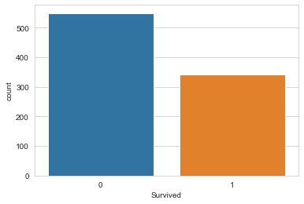
    


```python
sns.countplot(x='Survived', hue='Sex', data=train)
```


    <AxesSubplot:xlabel='Survived', ylabel='count'>


    
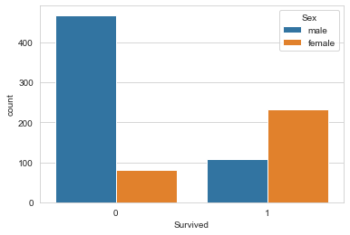
    


```python
sns.countplot(x='Survived', hue='Sex', data=train, palette='RdBu_r')
```


    <AxesSubplot:xlabel='Survived', ylabel='count'>


    
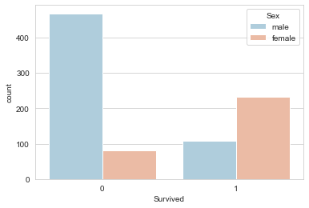
    


```python
sns.countplot(x='Survived', hue='Pclass', data=train, palette='RdBu_r')
```


    <AxesSubplot:xlabel='Survived', ylabel='count'>


    
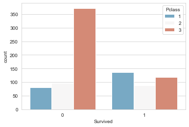
    


```python
sns.histplot(train['Age'].dropna(), kde=True, bins=30)
```


    <AxesSubplot:xlabel='Age', ylabel='Count'>


    
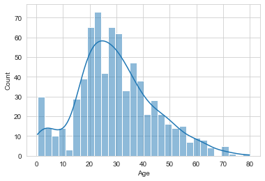
    


```python
train['Age'].plot.hist()
```


    <AxesSubplot:ylabel='Frequency'>


    
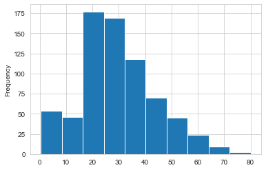
    


```python
train['Age'].plot.hist(bins=35)
```


    <AxesSubplot:ylabel='Frequency'>


    
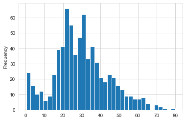
    


```python
train.info()
```

    <class 'pandas.core.frame.DataFrame'>
    RangeIndex: 891 entries, 0 to 890
    Data columns (total 12 columns):
     #   Column       Non-Null Count  Dtype  
    ---  ------       --------------  -----  
     0   PassengerId  891 non-null    int64  
     1   Survived     891 non-null    int64  
     2   Pclass       891 non-null    int64  
     3   Name         891 non-null    object 
     4   Sex          891 non-null    object 
     5   Age          714 non-null    float64
     6   SibSp        891 non-null    int64  
     7   Parch        891 non-null    int64  
     8   Ticket       891 non-null    object 
     9   Fare         891 non-null    float64
     10  Cabin        204 non-null    object 
     11  Embarked     889 non-null    object 
    dtypes: float64(2), int64(5), object(5)
    memory usage: 83.7+ KB
    


```python
sns.countplot(x='SibSp', data=train)
```


    <AxesSubplot:xlabel='SibSp', ylabel='count'>


    

    


```python
train['Fare']
```


    0       7.2500
    1      71.2833
    2       7.9250
    3      53.1000
    4       8.0500
            ...   
    886    13.0000
    887    30.0000
    888    23.4500
    889    30.0000
    890     7.7500
    Name: Fare, Length: 891, dtype: float64


```python
train['Fare'].hist()
```


    <AxesSubplot:>


    
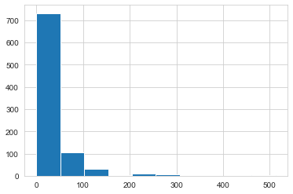
    


```python
train['Fare'].hist(bins=40)
```


    <AxesSubplot:>


    
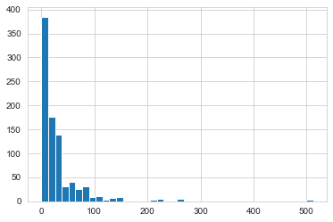
    


```python
train['Fare'].hist(bins=40, figsize=(10,4))
```


    <AxesSubplot:>


    
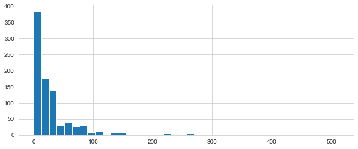
    


```python
import cufflinks as cf
```


```python
cf.go_offline()
```


<script type="text/javascript">
window.PlotlyConfig = {MathJaxConfig: 'local'};
if (window.MathJax) {MathJax.Hub.Config({SVG: {font: "STIX-Web"}});}
if (typeof require !== 'undefined') {
require.undef("plotly");
requirejs.config({
    paths: {
        'plotly': ['https://cdn.plot.ly/plotly-2.9.0.min']
    }
});
require(['plotly'], function(Plotly) {
    window._Plotly = Plotly;
});
}
</script>


```python
train['Fare'].iplot(kind='hist', bins=30)
```


<div>                            <div id="8d58e375-59c3-4618-841d-f6bfc60dff8c" class="plotly-graph-div" style="height:525px; width:100%;"></div>            <script type="text/javascript">                require(["plotly"], function(Plotly) {                    window.PLOTLYENV=window.PLOTLYENV || {};
                    window.PLOTLYENV.BASE_URL='https://plot.ly';                                    if (document.getElementById("8d58e375-59c3-4618-841d-f6bfc60dff8c")) {                    Plotly.newPlot(                        "8d58e375-59c3-4618-841d-f6bfc60dff8c",                        [{"histfunc":"count","histnorm":"","marker":{"color":"rgba(255, 153, 51, 1.0)","line":{"color":"#4D5663","width":1.3}},"name":"Fare","nbinsx":30,"opacity":0.8,"orientation":"v","x":[7.25,71.2833,7.925,53.1,8.05,8.4583,51.8625,21.075,11.1333,30.0708,16.7,26.55,8.05,31.275,7.8542,16.0,29.125,13.0,18.0,7.225,26.0,13.0,8.0292,35.5,21.075,31.3875,7.225,263.0,7.8792,7.8958,27.7208,146.5208,7.75,10.5,82.1708,52.0,7.2292,8.05,18.0,11.2417,9.475,21.0,7.8958,41.5792,7.8792,8.05,15.5,7.75,21.6792,17.8,39.6875,7.8,76.7292,26.0,61.9792,35.5,10.5,7.2292,27.75,46.9,7.2292,80.0,83.475,27.9,27.7208,15.2458,10.5,8.1583,7.925,8.6625,10.5,46.9,73.5,14.4542,56.4958,7.65,7.8958,8.05,29.0,12.475,9.0,9.5,7.7875,47.1,10.5,15.85,34.375,8.05,263.0,8.05,8.05,7.8542,61.175,20.575,7.25,8.05,34.6542,63.3583,23.0,26.0,7.8958,7.8958,77.2875,8.6542,7.925,7.8958,7.65,7.775,7.8958,24.15,52.0,14.4542,8.05,9.825,14.4583,7.925,7.75,21.0,247.5208,31.275,73.5,8.05,30.0708,13.0,77.2875,11.2417,7.75,7.1417,22.3583,6.975,7.8958,7.05,14.5,26.0,13.0,15.0458,26.2833,53.1,9.2167,79.2,15.2458,7.75,15.85,6.75,11.5,36.75,7.7958,34.375,26.0,13.0,12.525,66.6,8.05,14.5,7.3125,61.3792,7.7333,8.05,8.6625,69.55,16.1,15.75,7.775,8.6625,39.6875,20.525,55.0,27.9,25.925,56.4958,33.5,29.125,11.1333,7.925,30.6958,7.8542,25.4667,28.7125,13.0,0.0,69.55,15.05,31.3875,39.0,22.025,50.0,15.5,26.55,15.5,7.8958,13.0,13.0,7.8542,26.0,27.7208,146.5208,7.75,8.4042,7.75,13.0,9.5,69.55,6.4958,7.225,8.05,10.4625,15.85,18.7875,7.75,31.0,7.05,21.0,7.25,13.0,7.75,113.275,7.925,27.0,76.2917,10.5,8.05,13.0,8.05,7.8958,90.0,9.35,10.5,7.25,13.0,25.4667,83.475,7.775,13.5,31.3875,10.5,7.55,26.0,26.25,10.5,12.275,14.4542,15.5,10.5,7.125,7.225,90.0,7.775,14.5,52.5542,26.0,7.25,10.4625,26.55,16.1,20.2125,15.2458,79.2,86.5,512.3292,26.0,7.75,31.3875,79.65,0.0,7.75,10.5,39.6875,7.775,153.4625,135.6333,31.0,0.0,19.5,29.7,7.75,77.9583,7.75,0.0,29.125,20.25,7.75,7.8542,9.5,8.05,26.0,8.6625,9.5,7.8958,13.0,7.75,78.85,91.0792,12.875,8.85,7.8958,27.7208,7.2292,151.55,30.5,247.5208,7.75,23.25,0.0,12.35,8.05,151.55,110.8833,108.9,24.0,56.9292,83.1583,262.375,26.0,7.8958,26.25,7.8542,26.0,14.0,164.8667,134.5,7.25,7.8958,12.35,29.0,69.55,135.6333,6.2375,13.0,20.525,57.9792,23.25,28.5,153.4625,18.0,133.65,7.8958,66.6,134.5,8.05,35.5,26.0,263.0,13.0,13.0,13.0,13.0,13.0,16.1,15.9,8.6625,9.225,35.0,7.2292,17.8,7.225,9.5,55.0,13.0,7.8792,7.8792,27.9,27.7208,14.4542,7.05,15.5,7.25,75.25,7.2292,7.75,69.3,55.4417,6.4958,8.05,135.6333,21.075,82.1708,7.25,211.5,4.0125,7.775,227.525,15.7417,7.925,52.0,7.8958,73.5,46.9,13.0,7.7292,12.0,120.0,7.7958,7.925,113.275,16.7,7.7958,7.8542,26.0,10.5,12.65,7.925,8.05,9.825,15.85,8.6625,21.0,7.75,18.75,7.775,25.4667,7.8958,6.8583,90.0,0.0,7.925,8.05,32.5,13.0,13.0,24.15,7.8958,7.7333,7.875,14.4,20.2125,7.25,26.0,26.0,7.75,8.05,26.55,16.1,26.0,7.125,55.9,120.0,34.375,18.75,263.0,10.5,26.25,9.5,7.775,13.0,8.1125,81.8583,19.5,26.55,19.2583,30.5,27.75,19.9667,27.75,89.1042,8.05,7.8958,26.55,51.8625,10.5,7.75,26.55,8.05,38.5,13.0,8.05,7.05,0.0,26.55,7.725,19.2583,7.25,8.6625,27.75,13.7917,9.8375,52.0,21.0,7.0458,7.5208,12.2875,46.9,0.0,8.05,9.5875,91.0792,25.4667,90.0,29.7,8.05,15.9,19.9667,7.25,30.5,49.5042,8.05,14.4583,78.2667,15.1,151.55,7.7958,8.6625,7.75,7.6292,9.5875,86.5,108.9,26.0,26.55,22.525,56.4958,7.75,8.05,26.2875,59.4,7.4958,34.0208,10.5,24.15,26.0,7.8958,93.5,7.8958,7.225,57.9792,7.2292,7.75,10.5,221.7792,7.925,11.5,26.0,7.2292,7.2292,22.3583,8.6625,26.25,26.55,106.425,14.5,49.5,71.0,31.275,31.275,26.0,106.425,26.0,26.0,13.8625,20.525,36.75,110.8833,26.0,7.8292,7.225,7.775,26.55,39.6,227.525,79.65,17.4,7.75,7.8958,13.5,8.05,8.05,24.15,7.8958,21.075,7.2292,7.8542,10.5,51.4792,26.3875,7.75,8.05,14.5,13.0,55.9,14.4583,7.925,30.0,110.8833,26.0,40.125,8.7125,79.65,15.0,79.2,8.05,8.05,7.125,78.2667,7.25,7.75,26.0,24.15,33.0,0.0,7.225,56.9292,27.0,7.8958,42.4,8.05,26.55,15.55,7.8958,30.5,41.5792,153.4625,31.275,7.05,15.5,7.75,8.05,65.0,14.4,16.1,39.0,10.5,14.4542,52.5542,15.7417,7.8542,16.1,32.3208,12.35,77.9583,7.8958,7.7333,30.0,7.0542,30.5,0.0,27.9,13.0,7.925,26.25,39.6875,16.1,7.8542,69.3,27.9,56.4958,19.2583,76.7292,7.8958,35.5,7.55,7.55,7.8958,23.0,8.4333,7.8292,6.75,73.5,7.8958,15.5,13.0,113.275,133.65,7.225,25.5875,7.4958,7.925,73.5,13.0,7.775,8.05,52.0,39.0,52.0,10.5,13.0,0.0,7.775,8.05,9.8417,46.9,512.3292,8.1375,76.7292,9.225,46.9,39.0,41.5792,39.6875,10.1708,7.7958,211.3375,57.0,13.4167,56.4958,7.225,26.55,13.5,8.05,7.7333,110.8833,7.65,227.525,26.2875,14.4542,7.7417,7.8542,26.0,13.5,26.2875,151.55,15.2458,49.5042,26.55,52.0,9.4833,13.0,7.65,227.525,10.5,15.5,7.775,33.0,7.0542,13.0,13.0,53.1,8.6625,21.0,7.7375,26.0,7.925,211.3375,18.7875,0.0,13.0,13.0,16.1,34.375,512.3292,7.8958,7.8958,30.0,78.85,262.375,16.1,7.925,71.0,20.25,13.0,53.1,7.75,23.0,12.475,9.5,7.8958,65.0,14.5,7.7958,11.5,8.05,86.5,14.5,7.125,7.2292,120.0,7.775,77.9583,39.6,7.75,24.15,8.3625,9.5,7.8542,10.5,7.225,23.0,7.75,7.75,12.475,7.7375,211.3375,7.2292,57.0,30.0,23.45,7.05,7.25,7.4958,29.125,20.575,79.2,7.75,26.0,69.55,30.6958,7.8958,13.0,25.9292,8.6833,7.2292,24.15,13.0,26.25,120.0,8.5167,6.975,7.775,0.0,7.775,13.0,53.1,7.8875,24.15,10.5,31.275,8.05,0.0,7.925,37.0042,6.45,27.9,93.5,8.6625,0.0,12.475,39.6875,6.95,56.4958,37.0042,7.75,80.0,14.4542,18.75,7.2292,7.8542,8.3,83.1583,8.6625,8.05,56.4958,29.7,7.925,10.5,31.0,6.4375,8.6625,7.55,69.55,7.8958,33.0,89.1042,31.275,7.775,15.2458,39.4,26.0,9.35,164.8667,26.55,19.2583,7.2292,14.1083,11.5,25.9292,69.55,13.0,13.0,13.8583,50.4958,9.5,11.1333,7.8958,52.5542,5.0,9.0,24.0,7.225,9.8458,7.8958,7.8958,83.1583,26.0,7.8958,10.5167,10.5,7.05,29.125,13.0,30.0,23.45,30.0,7.75],"type":"histogram"}],                        {"barmode":"overlay","legend":{"bgcolor":"#F5F6F9","font":{"color":"#4D5663"}},"paper_bgcolor":"#F5F6F9","plot_bgcolor":"#F5F6F9","template":{"data":{"barpolar":[{"marker":{"line":{"color":"#E5ECF6","width":0.5},"pattern":{"fillmode":"overlay","size":10,"solidity":0.2}},"type":"barpolar"}],"bar":[{"error_x":{"color":"#2a3f5f"},"error_y":{"color":"#2a3f5f"},"marker":{"line":{"color":"#E5ECF6","width":0.5},"pattern":{"fillmode":"overlay","size":10,"solidity":0.2}},"type":"bar"}],"carpet":[{"aaxis":{"endlinecolor":"#2a3f5f","gridcolor":"white","linecolor":"white","minorgridcolor":"white","startlinecolor":"#2a3f5f"},"baxis":{"endlinecolor":"#2a3f5f","gridcolor":"white","linecolor":"white","minorgridcolor":"white","startlinecolor":"#2a3f5f"},"type":"carpet"}],"choropleth":[{"colorbar":{"outlinewidth":0,"ticks":""},"type":"choropleth"}],"contourcarpet":[{"colorbar":{"outlinewidth":0,"ticks":""},"type":"contourcarpet"}],"contour":[{"colorbar":{"outlinewidth":0,"ticks":""},"colorscale":[[0.0,"#0d0887"],[0.1111111111111111,"#46039f"],[0.2222222222222222,"#7201a8"],[0.3333333333333333,"#9c179e"],[0.4444444444444444,"#bd3786"],[0.5555555555555556,"#d8576b"],[0.6666666666666666,"#ed7953"],[0.7777777777777778,"#fb9f3a"],[0.8888888888888888,"#fdca26"],[1.0,"#f0f921"]],"type":"contour"}],"heatmapgl":[{"colorbar":{"outlinewidth":0,"ticks":""},"colorscale":[[0.0,"#0d0887"],[0.1111111111111111,"#46039f"],[0.2222222222222222,"#7201a8"],[0.3333333333333333,"#9c179e"],[0.4444444444444444,"#bd3786"],[0.5555555555555556,"#d8576b"],[0.6666666666666666,"#ed7953"],[0.7777777777777778,"#fb9f3a"],[0.8888888888888888,"#fdca26"],[1.0,"#f0f921"]],"type":"heatmapgl"}],"heatmap":[{"colorbar":{"outlinewidth":0,"ticks":""},"colorscale":[[0.0,"#0d0887"],[0.1111111111111111,"#46039f"],[0.2222222222222222,"#7201a8"],[0.3333333333333333,"#9c179e"],[0.4444444444444444,"#bd3786"],[0.5555555555555556,"#d8576b"],[0.6666666666666666,"#ed7953"],[0.7777777777777778,"#fb9f3a"],[0.8888888888888888,"#fdca26"],[1.0,"#f0f921"]],"type":"heatmap"}],"histogram2dcontour":[{"colorbar":{"outlinewidth":0,"ticks":""},"colorscale":[[0.0,"#0d0887"],[0.1111111111111111,"#46039f"],[0.2222222222222222,"#7201a8"],[0.3333333333333333,"#9c179e"],[0.4444444444444444,"#bd3786"],[0.5555555555555556,"#d8576b"],[0.6666666666666666,"#ed7953"],[0.7777777777777778,"#fb9f3a"],[0.8888888888888888,"#fdca26"],[1.0,"#f0f921"]],"type":"histogram2dcontour"}],"histogram2d":[{"colorbar":{"outlinewidth":0,"ticks":""},"colorscale":[[0.0,"#0d0887"],[0.1111111111111111,"#46039f"],[0.2222222222222222,"#7201a8"],[0.3333333333333333,"#9c179e"],[0.4444444444444444,"#bd3786"],[0.5555555555555556,"#d8576b"],[0.6666666666666666,"#ed7953"],[0.7777777777777778,"#fb9f3a"],[0.8888888888888888,"#fdca26"],[1.0,"#f0f921"]],"type":"histogram2d"}],"histogram":[{"marker":{"pattern":{"fillmode":"overlay","size":10,"solidity":0.2}},"type":"histogram"}],"mesh3d":[{"colorbar":{"outlinewidth":0,"ticks":""},"type":"mesh3d"}],"parcoords":[{"line":{"colorbar":{"outlinewidth":0,"ticks":""}},"type":"parcoords"}],"pie":[{"automargin":true,"type":"pie"}],"scatter3d":[{"line":{"colorbar":{"outlinewidth":0,"ticks":""}},"marker":{"colorbar":{"outlinewidth":0,"ticks":""}},"type":"scatter3d"}],"scattercarpet":[{"marker":{"colorbar":{"outlinewidth":0,"ticks":""}},"type":"scattercarpet"}],"scattergeo":[{"marker":{"colorbar":{"outlinewidth":0,"ticks":""}},"type":"scattergeo"}],"scattergl":[{"marker":{"colorbar":{"outlinewidth":0,"ticks":""}},"type":"scattergl"}],"scattermapbox":[{"marker":{"colorbar":{"outlinewidth":0,"ticks":""}},"type":"scattermapbox"}],"scatterpolargl":[{"marker":{"colorbar":{"outlinewidth":0,"ticks":""}},"type":"scatterpolargl"}],"scatterpolar":[{"marker":{"colorbar":{"outlinewidth":0,"ticks":""}},"type":"scatterpolar"}],"scatter":[{"marker":{"colorbar":{"outlinewidth":0,"ticks":""}},"type":"scatter"}],"scatterternary":[{"marker":{"colorbar":{"outlinewidth":0,"ticks":""}},"type":"scatterternary"}],"surface":[{"colorbar":{"outlinewidth":0,"ticks":""},"colorscale":[[0.0,"#0d0887"],[0.1111111111111111,"#46039f"],[0.2222222222222222,"#7201a8"],[0.3333333333333333,"#9c179e"],[0.4444444444444444,"#bd3786"],[0.5555555555555556,"#d8576b"],[0.6666666666666666,"#ed7953"],[0.7777777777777778,"#fb9f3a"],[0.8888888888888888,"#fdca26"],[1.0,"#f0f921"]],"type":"surface"}],"table":[{"cells":{"fill":{"color":"#EBF0F8"},"line":{"color":"white"}},"header":{"fill":{"color":"#C8D4E3"},"line":{"color":"white"}},"type":"table"}]},"layout":{"annotationdefaults":{"arrowcolor":"#2a3f5f","arrowhead":0,"arrowwidth":1},"autotypenumbers":"strict","coloraxis":{"colorbar":{"outlinewidth":0,"ticks":""}},"colorscale":{"diverging":[[0,"#8e0152"],[0.1,"#c51b7d"],[0.2,"#de77ae"],[0.3,"#f1b6da"],[0.4,"#fde0ef"],[0.5,"#f7f7f7"],[0.6,"#e6f5d0"],[0.7,"#b8e186"],[0.8,"#7fbc41"],[0.9,"#4d9221"],[1,"#276419"]],"sequential":[[0.0,"#0d0887"],[0.1111111111111111,"#46039f"],[0.2222222222222222,"#7201a8"],[0.3333333333333333,"#9c179e"],[0.4444444444444444,"#bd3786"],[0.5555555555555556,"#d8576b"],[0.6666666666666666,"#ed7953"],[0.7777777777777778,"#fb9f3a"],[0.8888888888888888,"#fdca26"],[1.0,"#f0f921"]],"sequentialminus":[[0.0,"#0d0887"],[0.1111111111111111,"#46039f"],[0.2222222222222222,"#7201a8"],[0.3333333333333333,"#9c179e"],[0.4444444444444444,"#bd3786"],[0.5555555555555556,"#d8576b"],[0.6666666666666666,"#ed7953"],[0.7777777777777778,"#fb9f3a"],[0.8888888888888888,"#fdca26"],[1.0,"#f0f921"]]},"colorway":["#636efa","#EF553B","#00cc96","#ab63fa","#FFA15A","#19d3f3","#FF6692","#B6E880","#FF97FF","#FECB52"],"font":{"color":"#2a3f5f"},"geo":{"bgcolor":"white","lakecolor":"white","landcolor":"#E5ECF6","showlakes":true,"showland":true,"subunitcolor":"white"},"hoverlabel":{"align":"left"},"hovermode":"closest","mapbox":{"style":"light"},"paper_bgcolor":"white","plot_bgcolor":"#E5ECF6","polar":{"angularaxis":{"gridcolor":"white","linecolor":"white","ticks":""},"bgcolor":"#E5ECF6","radialaxis":{"gridcolor":"white","linecolor":"white","ticks":""}},"scene":{"xaxis":{"backgroundcolor":"#E5ECF6","gridcolor":"white","gridwidth":2,"linecolor":"white","showbackground":true,"ticks":"","zerolinecolor":"white"},"yaxis":{"backgroundcolor":"#E5ECF6","gridcolor":"white","gridwidth":2,"linecolor":"white","showbackground":true,"ticks":"","zerolinecolor":"white"},"zaxis":{"backgroundcolor":"#E5ECF6","gridcolor":"white","gridwidth":2,"linecolor":"white","showbackground":true,"ticks":"","zerolinecolor":"white"}},"shapedefaults":{"line":{"color":"#2a3f5f"}},"ternary":{"aaxis":{"gridcolor":"white","linecolor":"white","ticks":""},"baxis":{"gridcolor":"white","linecolor":"white","ticks":""},"bgcolor":"#E5ECF6","caxis":{"gridcolor":"white","linecolor":"white","ticks":""}},"title":{"x":0.05},"xaxis":{"automargin":true,"gridcolor":"white","linecolor":"white","ticks":"","title":{"standoff":15},"zerolinecolor":"white","zerolinewidth":2},"yaxis":{"automargin":true,"gridcolor":"white","linecolor":"white","ticks":"","title":{"standoff":15},"zerolinecolor":"white","zerolinewidth":2}}},"title":{"font":{"color":"#4D5663"}},"xaxis":{"gridcolor":"#E1E5ED","showgrid":true,"tickfont":{"color":"#4D5663"},"title":{"font":{"color":"#4D5663"},"text":""},"zerolinecolor":"#E1E5ED"},"yaxis":{"gridcolor":"#E1E5ED","showgrid":true,"tickfont":{"color":"#4D5663"},"title":{"font":{"color":"#4D5663"},"text":""},"zerolinecolor":"#E1E5ED"}},                        {"showLink": true, "linkText": "Export to plot.ly", "plotlyServerURL": "https://plot.ly", "responsive": true}                    ).then(function(){

var gd = document.getElementById('8d58e375-59c3-4618-841d-f6bfc60dff8c');
var x = new MutationObserver(function (mutations, observer) {{
        var display = window.getComputedStyle(gd).display;
        if (!display || display === 'none') {{
            console.log([gd, 'removed!']);
            Plotly.purge(gd);
            observer.disconnect();
        }}
}});

// Listen for the removal of the full notebook cells
var notebookContainer = gd.closest('#notebook-container');
if (notebookContainer) {{
    x.observe(notebookContainer, {childList: true});
}}

// Listen for the clearing of the current output cell
var outputEl = gd.closest('.output');
if (outputEl) {{
    x.observe(outputEl, {childList: true});
}}

                        })                };                });            </script>        </div>


```python
train.head()
```


<div>
<style scoped>
    .dataframe tbody tr th:only-of-type {
        vertical-align: middle;
    }

    .dataframe tbody tr th {
        vertical-align: top;
    }

    .dataframe thead th {
        text-align: right;
    }
</style>
<table border="1" class="dataframe">
  <thead>
    <tr style="text-align: right;">
      <th></th>
      <th>PassengerId</th>
      <th>Survived</th>
      <th>Pclass</th>
      <th>Name</th>
      <th>Sex</th>
      <th>Age</th>
      <th>SibSp</th>
      <th>Parch</th>
      <th>Ticket</th>
      <th>Fare</th>
      <th>Cabin</th>
      <th>Embarked</th>
    </tr>
  </thead>
  <tbody>
    <tr>
      <th>0</th>
      <td>1</td>
      <td>0</td>
      <td>3</td>
      <td>Braund, Mr. Owen Harris</td>
      <td>male</td>
      <td>22.0</td>
      <td>1</td>
      <td>0</td>
      <td>A/5 21171</td>
      <td>7.2500</td>
      <td>NaN</td>
      <td>S</td>
    </tr>
    <tr>
      <th>1</th>
      <td>2</td>
      <td>1</td>
      <td>1</td>
      <td>Cumings, Mrs. John Bradley (Florence Briggs Th...</td>
      <td>female</td>
      <td>38.0</td>
      <td>1</td>
      <td>0</td>
      <td>PC 17599</td>
      <td>71.2833</td>
      <td>C85</td>
      <td>C</td>
    </tr>
    <tr>
      <th>2</th>
      <td>3</td>
      <td>1</td>
      <td>3</td>
      <td>Heikkinen, Miss. Laina</td>
      <td>female</td>
      <td>26.0</td>
      <td>0</td>
      <td>0</td>
      <td>STON/O2. 3101282</td>
      <td>7.9250</td>
      <td>NaN</td>
      <td>S</td>
    </tr>
    <tr>
      <th>3</th>
      <td>4</td>
      <td>1</td>
      <td>1</td>
      <td>Futrelle, Mrs. Jacques Heath (Lily May Peel)</td>
      <td>female</td>
      <td>35.0</td>
      <td>1</td>
      <td>0</td>
      <td>113803</td>
      <td>53.1000</td>
      <td>C123</td>
      <td>S</td>
    </tr>
    <tr>
      <th>4</th>
      <td>5</td>
      <td>0</td>
      <td>3</td>
      <td>Allen, Mr. William Henry</td>
      <td>male</td>
      <td>35.0</td>
      <td>0</td>
      <td>0</td>
      <td>373450</td>
      <td>8.0500</td>
      <td>NaN</td>
      <td>S</td>
    </tr>
  </tbody>
</table>
</div>


```python
plt.figure(figsize=(10,7))
sns.boxplot(x='Pclass', y='Age', data=train)
```


    <AxesSubplot:xlabel='Pclass', ylabel='Age'>


    
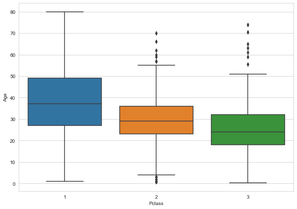
    


```python
def impute_age(cols):
    Age = cols[0]
    Pclass = cols[1]
    
    if pd.isnull(Age):
        if Pclass == 1:
            return 37
        elif Pclass == 2:
            return 29
        else:
            return 24
    else:
        return Age
```


```python
train['Age'] = train[['Age', 'Pclass']].apply(impute_age, axis=1)
```


```python
sns.heatmap(train.isnull(), yticklabels=False, cbar=False)
```


    <AxesSubplot:>


    
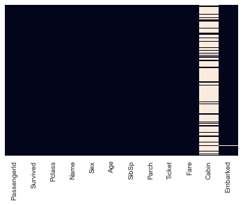
    


```python
train.head()
```


<div>
<style scoped>
    .dataframe tbody tr th:only-of-type {
        vertical-align: middle;
    }

    .dataframe tbody tr th {
        vertical-align: top;
    }

    .dataframe thead th {
        text-align: right;
    }
</style>
<table border="1" class="dataframe">
  <thead>
    <tr style="text-align: right;">
      <th></th>
      <th>PassengerId</th>
      <th>Survived</th>
      <th>Pclass</th>
      <th>Name</th>
      <th>Sex</th>
      <th>Age</th>
      <th>SibSp</th>
      <th>Parch</th>
      <th>Ticket</th>
      <th>Fare</th>
      <th>Cabin</th>
      <th>Embarked</th>
    </tr>
  </thead>
  <tbody>
    <tr>
      <th>0</th>
      <td>1</td>
      <td>0</td>
      <td>3</td>
      <td>Braund, Mr. Owen Harris</td>
      <td>male</td>
      <td>22.0</td>
      <td>1</td>
      <td>0</td>
      <td>A/5 21171</td>
      <td>7.2500</td>
      <td>NaN</td>
      <td>S</td>
    </tr>
    <tr>
      <th>1</th>
      <td>2</td>
      <td>1</td>
      <td>1</td>
      <td>Cumings, Mrs. John Bradley (Florence Briggs Th...</td>
      <td>female</td>
      <td>38.0</td>
      <td>1</td>
      <td>0</td>
      <td>PC 17599</td>
      <td>71.2833</td>
      <td>C85</td>
      <td>C</td>
    </tr>
    <tr>
      <th>2</th>
      <td>3</td>
      <td>1</td>
      <td>3</td>
      <td>Heikkinen, Miss. Laina</td>
      <td>female</td>
      <td>26.0</td>
      <td>0</td>
      <td>0</td>
      <td>STON/O2. 3101282</td>
      <td>7.9250</td>
      <td>NaN</td>
      <td>S</td>
    </tr>
    <tr>
      <th>3</th>
      <td>4</td>
      <td>1</td>
      <td>1</td>
      <td>Futrelle, Mrs. Jacques Heath (Lily May Peel)</td>
      <td>female</td>
      <td>35.0</td>
      <td>1</td>
      <td>0</td>
      <td>113803</td>
      <td>53.1000</td>
      <td>C123</td>
      <td>S</td>
    </tr>
    <tr>
      <th>4</th>
      <td>5</td>
      <td>0</td>
      <td>3</td>
      <td>Allen, Mr. William Henry</td>
      <td>male</td>
      <td>35.0</td>
      <td>0</td>
      <td>0</td>
      <td>373450</td>
      <td>8.0500</td>
      <td>NaN</td>
      <td>S</td>
    </tr>
  </tbody>
</table>
</div>


```python
train.drop('Cabin', axis=1, inplace=True)
```


```python
train.head()
```


<div>
<style scoped>
    .dataframe tbody tr th:only-of-type {
        vertical-align: middle;
    }

    .dataframe tbody tr th {
        vertical-align: top;
    }

    .dataframe thead th {
        text-align: right;
    }
</style>
<table border="1" class="dataframe">
  <thead>
    <tr style="text-align: right;">
      <th></th>
      <th>PassengerId</th>
      <th>Survived</th>
      <th>Pclass</th>
      <th>Name</th>
      <th>Sex</th>
      <th>Age</th>
      <th>SibSp</th>
      <th>Parch</th>
      <th>Ticket</th>
      <th>Fare</th>
      <th>Embarked</th>
    </tr>
  </thead>
  <tbody>
    <tr>
      <th>0</th>
      <td>1</td>
      <td>0</td>
      <td>3</td>
      <td>Braund, Mr. Owen Harris</td>
      <td>male</td>
      <td>22.0</td>
      <td>1</td>
      <td>0</td>
      <td>A/5 21171</td>
      <td>7.2500</td>
      <td>S</td>
    </tr>
    <tr>
      <th>1</th>
      <td>2</td>
      <td>1</td>
      <td>1</td>
      <td>Cumings, Mrs. John Bradley (Florence Briggs Th...</td>
      <td>female</td>
      <td>38.0</td>
      <td>1</td>
      <td>0</td>
      <td>PC 17599</td>
      <td>71.2833</td>
      <td>C</td>
    </tr>
    <tr>
      <th>2</th>
      <td>3</td>
      <td>1</td>
      <td>3</td>
      <td>Heikkinen, Miss. Laina</td>
      <td>female</td>
      <td>26.0</td>
      <td>0</td>
      <td>0</td>
      <td>STON/O2. 3101282</td>
      <td>7.9250</td>
      <td>S</td>
    </tr>
    <tr>
      <th>3</th>
      <td>4</td>
      <td>1</td>
      <td>1</td>
      <td>Futrelle, Mrs. Jacques Heath (Lily May Peel)</td>
      <td>female</td>
      <td>35.0</td>
      <td>1</td>
      <td>0</td>
      <td>113803</td>
      <td>53.1000</td>
      <td>S</td>
    </tr>
    <tr>
      <th>4</th>
      <td>5</td>
      <td>0</td>
      <td>3</td>
      <td>Allen, Mr. William Henry</td>
      <td>male</td>
      <td>35.0</td>
      <td>0</td>
      <td>0</td>
      <td>373450</td>
      <td>8.0500</td>
      <td>S</td>
    </tr>
  </tbody>
</table>
</div>


```python
sns.heatmap(train.isnull(), yticklabels=False, cbar=False)
```


    <AxesSubplot:>


    
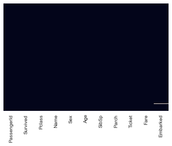
    


```python
train.dropna(inplace=True) # drop the rows that more than one data is missing
```


```python
pd.get_dummies(train['Sex'])
```


<div>
<style scoped>
    .dataframe tbody tr th:only-of-type {
        vertical-align: middle;
    }

    .dataframe tbody tr th {
        vertical-align: top;
    }

    .dataframe thead th {
        text-align: right;
    }
</style>
<table border="1" class="dataframe">
  <thead>
    <tr style="text-align: right;">
      <th></th>
      <th>female</th>
      <th>male</th>
    </tr>
  </thead>
  <tbody>
    <tr>
      <th>0</th>
      <td>0</td>
      <td>1</td>
    </tr>
    <tr>
      <th>1</th>
      <td>1</td>
      <td>0</td>
    </tr>
    <tr>
      <th>2</th>
      <td>1</td>
      <td>0</td>
    </tr>
    <tr>
      <th>3</th>
      <td>1</td>
      <td>0</td>
    </tr>
    <tr>
      <th>4</th>
      <td>0</td>
      <td>1</td>
    </tr>
    <tr>
      <th>...</th>
      <td>...</td>
      <td>...</td>
    </tr>
    <tr>
      <th>886</th>
      <td>0</td>
      <td>1</td>
    </tr>
    <tr>
      <th>887</th>
      <td>1</td>
      <td>0</td>
    </tr>
    <tr>
      <th>888</th>
      <td>1</td>
      <td>0</td>
    </tr>
    <tr>
      <th>889</th>
      <td>0</td>
      <td>1</td>
    </tr>
    <tr>
      <th>890</th>
      <td>0</td>
      <td>1</td>
    </tr>
  </tbody>
</table>
<p>889 rows × 2 columns</p>
</div>


```python
sex = pd.get_dummies(train['Sex'], drop_first=True)
```


```python
embark = pd.get_dummies(train['Embarked'], drop_first=True)
```


```python
embark.head()
```


<div>
<style scoped>
    .dataframe tbody tr th:only-of-type {
        vertical-align: middle;
    }

    .dataframe tbody tr th {
        vertical-align: top;
    }

    .dataframe thead th {
        text-align: right;
    }
</style>
<table border="1" class="dataframe">
  <thead>
    <tr style="text-align: right;">
      <th></th>
      <th>Q</th>
      <th>S</th>
    </tr>
  </thead>
  <tbody>
    <tr>
      <th>0</th>
      <td>0</td>
      <td>1</td>
    </tr>
    <tr>
      <th>1</th>
      <td>0</td>
      <td>0</td>
    </tr>
    <tr>
      <th>2</th>
      <td>0</td>
      <td>1</td>
    </tr>
    <tr>
      <th>3</th>
      <td>0</td>
      <td>1</td>
    </tr>
    <tr>
      <th>4</th>
      <td>0</td>
      <td>1</td>
    </tr>
  </tbody>
</table>
</div>


```python
train = pd.concat([train, sex, embark,], axis=1)
```


```python
train.head()
```


<div>
<style scoped>
    .dataframe tbody tr th:only-of-type {
        vertical-align: middle;
    }

    .dataframe tbody tr th {
        vertical-align: top;
    }

    .dataframe thead th {
        text-align: right;
    }
</style>
<table border="1" class="dataframe">
  <thead>
    <tr style="text-align: right;">
      <th></th>
      <th>PassengerId</th>
      <th>Survived</th>
      <th>Pclass</th>
      <th>Name</th>
      <th>Sex</th>
      <th>Age</th>
      <th>SibSp</th>
      <th>Parch</th>
      <th>Ticket</th>
      <th>Fare</th>
      <th>Embarked</th>
      <th>male</th>
      <th>Q</th>
      <th>S</th>
    </tr>
  </thead>
  <tbody>
    <tr>
      <th>0</th>
      <td>1</td>
      <td>0</td>
      <td>3</td>
      <td>Braund, Mr. Owen Harris</td>
      <td>male</td>
      <td>22.0</td>
      <td>1</td>
      <td>0</td>
      <td>A/5 21171</td>
      <td>7.2500</td>
      <td>S</td>
      <td>1</td>
      <td>0</td>
      <td>1</td>
    </tr>
    <tr>
      <th>1</th>
      <td>2</td>
      <td>1</td>
      <td>1</td>
      <td>Cumings, Mrs. John Bradley (Florence Briggs Th...</td>
      <td>female</td>
      <td>38.0</td>
      <td>1</td>
      <td>0</td>
      <td>PC 17599</td>
      <td>71.2833</td>
      <td>C</td>
      <td>0</td>
      <td>0</td>
      <td>0</td>
    </tr>
    <tr>
      <th>2</th>
      <td>3</td>
      <td>1</td>
      <td>3</td>
      <td>Heikkinen, Miss. Laina</td>
      <td>female</td>
      <td>26.0</td>
      <td>0</td>
      <td>0</td>
      <td>STON/O2. 3101282</td>
      <td>7.9250</td>
      <td>S</td>
      <td>0</td>
      <td>0</td>
      <td>1</td>
    </tr>
    <tr>
      <th>3</th>
      <td>4</td>
      <td>1</td>
      <td>1</td>
      <td>Futrelle, Mrs. Jacques Heath (Lily May Peel)</td>
      <td>female</td>
      <td>35.0</td>
      <td>1</td>
      <td>0</td>
      <td>113803</td>
      <td>53.1000</td>
      <td>S</td>
      <td>0</td>
      <td>0</td>
      <td>1</td>
    </tr>
    <tr>
      <th>4</th>
      <td>5</td>
      <td>0</td>
      <td>3</td>
      <td>Allen, Mr. William Henry</td>
      <td>male</td>
      <td>35.0</td>
      <td>0</td>
      <td>0</td>
      <td>373450</td>
      <td>8.0500</td>
      <td>S</td>
      <td>1</td>
      <td>0</td>
      <td>1</td>
    </tr>
  </tbody>
</table>
</div>


```python
# train.drop(['Q', 'S', 'male'], axis=1, inplace=True)
```


```python
train.drop(['Sex', 'Embarked', 'Name', 'Ticket'], axis=1, inplace=True)
```


```python
train.head()
```


<div>
<style scoped>
    .dataframe tbody tr th:only-of-type {
        vertical-align: middle;
    }

    .dataframe tbody tr th {
        vertical-align: top;
    }

    .dataframe thead th {
        text-align: right;
    }
</style>
<table border="1" class="dataframe">
  <thead>
    <tr style="text-align: right;">
      <th></th>
      <th>PassengerId</th>
      <th>Survived</th>
      <th>Pclass</th>
      <th>Age</th>
      <th>SibSp</th>
      <th>Parch</th>
      <th>Fare</th>
      <th>male</th>
      <th>Q</th>
      <th>S</th>
    </tr>
  </thead>
  <tbody>
    <tr>
      <th>0</th>
      <td>1</td>
      <td>0</td>
      <td>3</td>
      <td>22.0</td>
      <td>1</td>
      <td>0</td>
      <td>7.2500</td>
      <td>1</td>
      <td>0</td>
      <td>1</td>
    </tr>
    <tr>
      <th>1</th>
      <td>2</td>
      <td>1</td>
      <td>1</td>
      <td>38.0</td>
      <td>1</td>
      <td>0</td>
      <td>71.2833</td>
      <td>0</td>
      <td>0</td>
      <td>0</td>
    </tr>
    <tr>
      <th>2</th>
      <td>3</td>
      <td>1</td>
      <td>3</td>
      <td>26.0</td>
      <td>0</td>
      <td>0</td>
      <td>7.9250</td>
      <td>0</td>
      <td>0</td>
      <td>1</td>
    </tr>
    <tr>
      <th>3</th>
      <td>4</td>
      <td>1</td>
      <td>1</td>
      <td>35.0</td>
      <td>1</td>
      <td>0</td>
      <td>53.1000</td>
      <td>0</td>
      <td>0</td>
      <td>1</td>
    </tr>
    <tr>
      <th>4</th>
      <td>5</td>
      <td>0</td>
      <td>3</td>
      <td>35.0</td>
      <td>0</td>
      <td>0</td>
      <td>8.0500</td>
      <td>1</td>
      <td>0</td>
      <td>1</td>
    </tr>
  </tbody>
</table>
</div>


```python
train.tail()
```


<div>
<style scoped>
    .dataframe tbody tr th:only-of-type {
        vertical-align: middle;
    }

    .dataframe tbody tr th {
        vertical-align: top;
    }

    .dataframe thead th {
        text-align: right;
    }
</style>
<table border="1" class="dataframe">
  <thead>
    <tr style="text-align: right;">
      <th></th>
      <th>Survived</th>
      <th>Pclass</th>
      <th>Age</th>
      <th>SibSp</th>
      <th>Parch</th>
      <th>Fare</th>
      <th>male</th>
      <th>Q</th>
      <th>S</th>
    </tr>
  </thead>
  <tbody>
    <tr>
      <th>886</th>
      <td>0</td>
      <td>2</td>
      <td>27.0</td>
      <td>0</td>
      <td>0</td>
      <td>13.00</td>
      <td>1</td>
      <td>0</td>
      <td>1</td>
    </tr>
    <tr>
      <th>887</th>
      <td>1</td>
      <td>1</td>
      <td>19.0</td>
      <td>0</td>
      <td>0</td>
      <td>30.00</td>
      <td>0</td>
      <td>0</td>
      <td>1</td>
    </tr>
    <tr>
      <th>888</th>
      <td>0</td>
      <td>3</td>
      <td>24.0</td>
      <td>1</td>
      <td>2</td>
      <td>23.45</td>
      <td>0</td>
      <td>0</td>
      <td>1</td>
    </tr>
    <tr>
      <th>889</th>
      <td>1</td>
      <td>1</td>
      <td>26.0</td>
      <td>0</td>
      <td>0</td>
      <td>30.00</td>
      <td>1</td>
      <td>0</td>
      <td>0</td>
    </tr>
    <tr>
      <th>890</th>
      <td>0</td>
      <td>3</td>
      <td>32.0</td>
      <td>0</td>
      <td>0</td>
      <td>7.75</td>
      <td>1</td>
      <td>1</td>
      <td>0</td>
    </tr>
  </tbody>
</table>
</div>


```python
train.drop('PassengerId', axis=1, inplace=True)
```


```python
train.head()
```


<div>
<style scoped>
    .dataframe tbody tr th:only-of-type {
        vertical-align: middle;
    }

    .dataframe tbody tr th {
        vertical-align: top;
    }

    .dataframe thead th {
        text-align: right;
    }
</style>
<table border="1" class="dataframe">
  <thead>
    <tr style="text-align: right;">
      <th></th>
      <th>Survived</th>
      <th>Pclass</th>
      <th>Age</th>
      <th>SibSp</th>
      <th>Parch</th>
      <th>Fare</th>
      <th>male</th>
      <th>Q</th>
      <th>S</th>
    </tr>
  </thead>
  <tbody>
    <tr>
      <th>0</th>
      <td>0</td>
      <td>3</td>
      <td>22.0</td>
      <td>1</td>
      <td>0</td>
      <td>7.2500</td>
      <td>1</td>
      <td>0</td>
      <td>1</td>
    </tr>
    <tr>
      <th>1</th>
      <td>1</td>
      <td>1</td>
      <td>38.0</td>
      <td>1</td>
      <td>0</td>
      <td>71.2833</td>
      <td>0</td>
      <td>0</td>
      <td>0</td>
    </tr>
    <tr>
      <th>2</th>
      <td>1</td>
      <td>3</td>
      <td>26.0</td>
      <td>0</td>
      <td>0</td>
      <td>7.9250</td>
      <td>0</td>
      <td>0</td>
      <td>1</td>
    </tr>
    <tr>
      <th>3</th>
      <td>1</td>
      <td>1</td>
      <td>35.0</td>
      <td>1</td>
      <td>0</td>
      <td>53.1000</td>
      <td>0</td>
      <td>0</td>
      <td>1</td>
    </tr>
    <tr>
      <th>4</th>
      <td>0</td>
      <td>3</td>
      <td>35.0</td>
      <td>0</td>
      <td>0</td>
      <td>8.0500</td>
      <td>1</td>
      <td>0</td>
      <td>1</td>
    </tr>
  </tbody>
</table>
</div>


```python
X = train.drop('Survived', axis=1)
y = train['Survived']
```


```python
from sklearn.model_selection import train_test_split
```


```python
X_train, X_test, y_train, y_test = train_test_split(X, y, test_size=0.3, random_state=101)
```


```python
from sklearn.linear_model import LogisticRegression
```


```python
logmodel = LogisticRegression(max_iter=1000)
```


```python
logmodel.fit(X_train, y_train)
```


    LogisticRegression(max_iter=1000)


```python
predictions = logmodel.predict(X_test)
```


```python
from sklearn.metrics import classification_report
```


```python
print(classification_report(y_test, predictions))
```

                  precision    recall  f1-score   support
    
               0       0.82      0.92      0.87       163
               1       0.85      0.69      0.76       104
    
        accuracy                           0.83       267
       macro avg       0.84      0.81      0.82       267
    weighted avg       0.83      0.83      0.83       267
    
    


```python
from sklearn.metrics import confusion_matrix
```


```python
confusion_matrix(y_test, predictions)
```


    array([[150,  13],
           [ 32,  72]], dtype=int64)


```python

```
