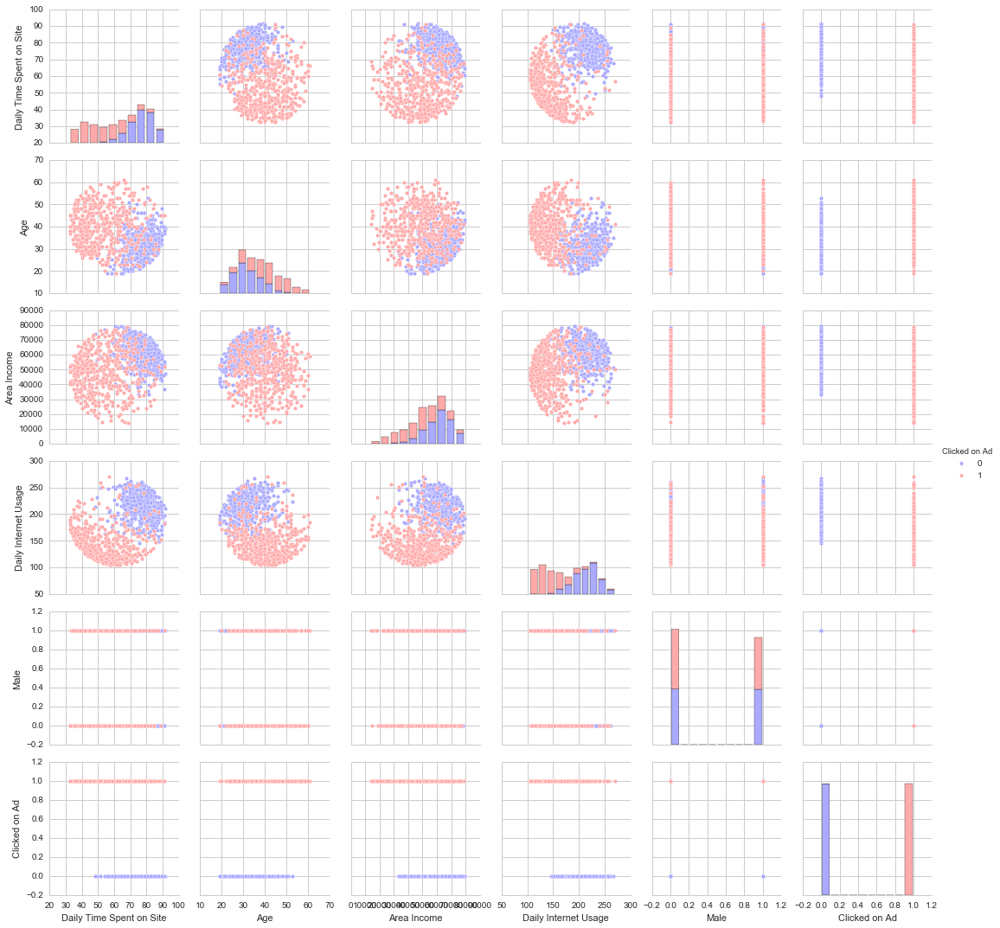

___

<a href='http://www.pieriandata.com'> </a>
___
# Logistic Regression Project 

In this project we will be working with a fake advertising data set, indicating whether or not a particular internet user clicked on an Advertisement. We will try to create a model that will predict whether or not they will click on an ad based off the features of that user.

This data set contains the following features:

* 'Daily Time Spent on Site': consumer time on site in minutes
* 'Age': cutomer age in years
* 'Area Income': Avg. Income of geographical area of consumer
* 'Daily Internet Usage': Avg. minutes a day consumer is on the internet
* 'Ad Topic Line': Headline of the advertisement
* 'City': City of consumer
* 'Male': Whether or not consumer was male
* 'Country': Country of consumer
* 'Timestamp': Time at which consumer clicked on Ad or closed window
* 'Clicked on Ad': 0 or 1 indicated clicking on Ad

## Import Libraries

**Import a few libraries you think you'll need (Or just import them as you go along!)**


```python
import numpy as np
import pandas as pd
```


```python
import matplotlib.pyplot as plt
import seaborn as sns
%matplotlib inline
```

## Get the Data
**Read in the advertising.csv file and set it to a data frame called ad_data.**


```python
ad_data = pd.read_csv('advertising.csv')
```


```python
ad_data.head()
```


<div>
<style scoped>
    .dataframe tbody tr th:only-of-type {
        vertical-align: middle;
    }

    .dataframe tbody tr th {
        vertical-align: top;
    }

    .dataframe thead th {
        text-align: right;
    }
</style>
<table border="1" class="dataframe">
  <thead>
    <tr style="text-align: right;">
      <th></th>
      <th>Daily Time Spent on Site</th>
      <th>Age</th>
      <th>Area Income</th>
      <th>Daily Internet Usage</th>
      <th>Ad Topic Line</th>
      <th>City</th>
      <th>Male</th>
      <th>Country</th>
      <th>Timestamp</th>
      <th>Clicked on Ad</th>
    </tr>
  </thead>
  <tbody>
    <tr>
      <th>0</th>
      <td>68.95</td>
      <td>35</td>
      <td>61833.90</td>
      <td>256.09</td>
      <td>Cloned 5thgeneration orchestration</td>
      <td>Wrightburgh</td>
      <td>0</td>
      <td>Tunisia</td>
      <td>2016-03-27 00:53:11</td>
      <td>0</td>
    </tr>
    <tr>
      <th>1</th>
      <td>80.23</td>
      <td>31</td>
      <td>68441.85</td>
      <td>193.77</td>
      <td>Monitored national standardization</td>
      <td>West Jodi</td>
      <td>1</td>
      <td>Nauru</td>
      <td>2016-04-04 01:39:02</td>
      <td>0</td>
    </tr>
    <tr>
      <th>2</th>
      <td>69.47</td>
      <td>26</td>
      <td>59785.94</td>
      <td>236.50</td>
      <td>Organic bottom-line service-desk</td>
      <td>Davidton</td>
      <td>0</td>
      <td>San Marino</td>
      <td>2016-03-13 20:35:42</td>
      <td>0</td>
    </tr>
    <tr>
      <th>3</th>
      <td>74.15</td>
      <td>29</td>
      <td>54806.18</td>
      <td>245.89</td>
      <td>Triple-buffered reciprocal time-frame</td>
      <td>West Terrifurt</td>
      <td>1</td>
      <td>Italy</td>
      <td>2016-01-10 02:31:19</td>
      <td>0</td>
    </tr>
    <tr>
      <th>4</th>
      <td>68.37</td>
      <td>35</td>
      <td>73889.99</td>
      <td>225.58</td>
      <td>Robust logistical utilization</td>
      <td>South Manuel</td>
      <td>0</td>
      <td>Iceland</td>
      <td>2016-06-03 03:36:18</td>
      <td>0</td>
    </tr>
  </tbody>
</table>
</div>


**Check the head of ad_data**


```python
ad_data.head()
```


<div>
<style scoped>
    .dataframe tbody tr th:only-of-type {
        vertical-align: middle;
    }

    .dataframe tbody tr th {
        vertical-align: top;
    }

    .dataframe thead th {
        text-align: right;
    }
</style>
<table border="1" class="dataframe">
  <thead>
    <tr style="text-align: right;">
      <th></th>
      <th>Daily Time Spent on Site</th>
      <th>Age</th>
      <th>Area Income</th>
      <th>Daily Internet Usage</th>
      <th>Ad Topic Line</th>
      <th>City</th>
      <th>Male</th>
      <th>Country</th>
      <th>Timestamp</th>
      <th>Clicked on Ad</th>
    </tr>
  </thead>
  <tbody>
    <tr>
      <th>0</th>
      <td>68.95</td>
      <td>35</td>
      <td>61833.90</td>
      <td>256.09</td>
      <td>Cloned 5thgeneration orchestration</td>
      <td>Wrightburgh</td>
      <td>0</td>
      <td>Tunisia</td>
      <td>2016-03-27 00:53:11</td>
      <td>0</td>
    </tr>
    <tr>
      <th>1</th>
      <td>80.23</td>
      <td>31</td>
      <td>68441.85</td>
      <td>193.77</td>
      <td>Monitored national standardization</td>
      <td>West Jodi</td>
      <td>1</td>
      <td>Nauru</td>
      <td>2016-04-04 01:39:02</td>
      <td>0</td>
    </tr>
    <tr>
      <th>2</th>
      <td>69.47</td>
      <td>26</td>
      <td>59785.94</td>
      <td>236.50</td>
      <td>Organic bottom-line service-desk</td>
      <td>Davidton</td>
      <td>0</td>
      <td>San Marino</td>
      <td>2016-03-13 20:35:42</td>
      <td>0</td>
    </tr>
    <tr>
      <th>3</th>
      <td>74.15</td>
      <td>29</td>
      <td>54806.18</td>
      <td>245.89</td>
      <td>Triple-buffered reciprocal time-frame</td>
      <td>West Terrifurt</td>
      <td>1</td>
      <td>Italy</td>
      <td>2016-01-10 02:31:19</td>
      <td>0</td>
    </tr>
    <tr>
      <th>4</th>
      <td>68.37</td>
      <td>35</td>
      <td>73889.99</td>
      <td>225.58</td>
      <td>Robust logistical utilization</td>
      <td>South Manuel</td>
      <td>0</td>
      <td>Iceland</td>
      <td>2016-06-03 03:36:18</td>
      <td>0</td>
    </tr>
  </tbody>
</table>
</div>


```python
ad_data['City'].unique()
```


    array(['Wrightburgh', 'West Jodi', 'Davidton', 'West Terrifurt',
           'South Manuel', 'Jamieberg', 'Brandonstad', 'Port Jefferybury',
           'West Colin', 'Ramirezton', 'West Brandonton', 'East Theresashire',
           'West Katiefurt', 'North Tara', 'West William', 'New Travistown',
           'West Dylanberg', 'Pruittmouth', 'Jessicastad', 'Millertown',
           'Port Jacqueline', 'Lake Nicole', 'South John', 'Pamelamouth',
           'Harperborough', 'Port Danielleberg', 'West Jeremyside',
           'South Cathyfurt', 'Palmerside', 'West Guybury', 'Phelpschester',
           'Lake Melindamouth', 'North Richardburgh', 'Port Cassie',
           'New Thomas', 'Johnstad', 'West Aprilport', 'Kellytown',
           'Charlesport', 'Millerchester', 'Mackenziemouth', 'Zacharystad',
           'North Joshua', 'Bowenview', 'Jamesberg', 'Lake Cassandraport',
           'New Sharon', 'Johnport', 'Hamiltonfort', 'West Christopher',
           'Hollandberg', 'Odomville', 'East Samanthashire', 'South Lauraton',
           'Amandahaven', 'Thomasview', 'Garciaside', 'Port Sarahshire',
           'Port Gregory', 'Brendachester', 'Lake Amy', 'Lake Annashire',
           'Smithburgh', 'North Leonmouth', 'Robertfurt', 'Jasminefort',
           'Jensenborough', 'Bradleyburgh', 'New Sheila', 'North Regina',
           'Davidmouth', 'New Michaeltown', 'East Tammie', 'Wilcoxport',
           'East Michaelmouth', 'East Tiffanyport', 'Ramirezhaven',
           'Cranemouth', 'Lake Edward', 'Lake Conniefurt',
           'East Shawnchester', 'West Joseph', 'Lake Christopherfurt',
           'East Tylershire', 'Sharpberg', 'Lake Dustin', 'North Kristine',
           'Grahamberg', 'New Tina', 'Nelsonfurt', 'Christopherport',
           'Port Sarahhaven', 'Bradleyborough', 'Whiteport', 'New Theresa',
           'Wongland', 'Williammouth', 'Williamsborough', 'North Michael',
           'Benjaminchester', 'Hernandezville', 'Youngburgh',
           'Wallacechester', 'Sanchezmouth', 'Bradshawborough', 'Amyhaven',
           'Marcushaven', 'Erinton', 'Hughesport', 'New Lucasburgh',
           'Michelleside', 'Andersonton', 'New Rachel', 'Port Susan',
           'West Angelabury', 'Port Christopherborough', 'Phillipsbury',
           'Millerside', 'Lake Jessica', 'Lopezmouth', 'Johnsport',
           'South Ronald', 'South Daniel', 'Suzannetown', 'Lisaberg',
           'Brianfurt', 'Stewartbury', 'North Wesleychester',
           'East Michelleberg', 'Port Eric', 'Timothyfurt', 'Port Jeffrey',
           'Guzmanland', 'East Michele', 'East John', 'Lesliebury',
           'Patriciahaven', 'Ashleychester', 'Lake Josetown', 'Debraburgh',
           'New Debbiestad', 'West Shaun', 'Kimberlyhaven', 'Port Lawrence',
           'West Ricardo', 'Lake Jose', 'Heatherberg', 'South George',
           'Tinachester', 'Port Jodi', 'Jonathantown', 'Sylviaview',
           'East Timothyport', 'West Roytown', 'Codyburgh', 'Port Erikhaven',
           'Port Chasemouth', 'Ramirezside', 'East Michaeltown',
           'West Courtney', 'West Michaelhaven', 'Walshhaven',
           'East Rachelview', 'Curtisport', 'Frankbury', 'Timothytown',
           'Samanthaland', 'South Jennifer', 'Kyleborough', 'North Randy',
           'South Daniellefort', 'Dianashire', 'East Eric', 'Hammondport',
           'Jacobstad', 'Hernandezfort', 'Joneston', 'New Jeffreychester',
           'East Stephen', 'Turnerchester', 'Youngfort', 'Ingramberg',
           'South Denisefurt', 'Port Melissaberg', 'Bernardton',
           'Port Mathew', 'Aliciatown', 'Josephstad', 'West Ericfurt',
           'New Brendafurt', 'Port Julie', 'South Tiffanyton',
           'North Elizabeth', 'Kentmouth', 'West Casey', 'East Henry',
           'Hollyfurt', 'North Anna', 'Port Destiny', 'Ianmouth',
           'North Johntown', 'Hannahside', 'Wilsonburgh',
           'North Russellborough', 'Murphymouth', 'Carterburgh', 'Penatown',
           'Joechester', 'East Paul', 'Hartmanchester', 'Mcdonaldfort',
           'North Mercedes', 'Taylorberg', 'Hansenmouth', 'Bradyfurt',
           'West Jessicahaven', 'Davilachester', 'North Ricardotown',
           'Melissafurt', 'East Brianberg', 'Millerbury', 'Garciaview',
           'Townsendfurt', 'Williamstad', 'West Connor', 'West Justin',
           'Robertbury', 'New Tinamouth', 'Turnerview', 'Reneechester',
           'West Tinashire', 'Jamesfurt', 'New Nancy', 'Lisamouth',
           'Harveyport', 'Ramosstad', 'North Kevinside', 'Haleview',
           'Christinetown', 'New Michael', 'Jonesland', 'North Shannon',
           'New Sonialand', 'Port Jason', 'East Barbara', 'Port Erinberg',
           'Petersonfurt', 'New Lindaberg', 'West Russell', 'South Adam',
           'North Tracyport', 'Brownport', 'Port Crystal', 'Masonhaven',
           'Derrickhaven', 'Olsonstad', 'New Brandy', 'South Jasminebury',
           'East Timothy', 'Charlottefort', 'Lake Beckyburgh',
           'West Lindseybury', 'West Alyssa', 'Lake Craigview', 'Lake David',
           'Bruceburgh', 'South Lauratown', 'Port Robin', 'Jacksonburgh',
           'Erinmouth', 'Port Aliciabury', 'Port Whitneyhaven',
           'Jeffreyshire', 'Tinaton', 'North Loriburgh', 'Wendyton',
           'Lake Jacqueline', 'North Christopher', 'Alexanderfurt',
           'West Pamela', 'West Amanda', 'South Tomside', 'Bethburgh',
           'Jamiefort', 'Garciamouth', 'West Brenda', 'South Kyle',
           'Combsstad', 'Lake Allenville', 'Greenechester', 'Jordantown',
           'Gravesport', 'South Troy', 'Lake Patrick', 'Millerland',
           'Port Jessicamouth', 'Paulport', 'Clineshire', 'Cynthiaside',
           'Port Juan', 'Michellefort', 'Port Angelamouth', 'Jessicahaven',
           'North Daniel', 'New Juan', 'Amyfurt', 'Harrishaven', 'Roberttown',
           'Jeremyshire', 'Birdshire', 'New Amanda', 'Curtisview',
           'Jacksonmouth', 'North April', 'Hayesmouth', 'South Corey',
           'Juliaport', 'Port Paultown', 'East Vincentstad', 'Kimberlytown',
           'New Steve', 'New Johnberg', 'Shawstad', 'New Rebecca',
           'Jeffreyburgh', 'Faithview', 'Richardsontown', 'Port Brookeland',
           'East Christopherbury', 'Port Christinemouth', 'South Meghan',
           'Hessstad', 'Rhondaborough', 'Lewismouth', 'New Paul',
           'Lake Angela', 'East Graceland', 'Hartport', 'East Yvonnechester',
           'Burgessside', 'Hurleyborough', 'Garychester', 'East Kevinbury',
           'Contrerasshire', 'Erikville', 'Robertsonburgh', 'Karenton',
           'Port Kathleenfort', 'Lake Adrian', 'Mollyport', 'Sandraland',
           'Charlenetown', 'Luischester', 'South Johnnymouth', 'Hannaport',
           'East Anthony', 'West Daleborough', 'Morrismouth',
           'North Andrewstad', 'West Tanya', 'Novaktown', 'Timothymouth',
           'Robertmouth', 'Stephenborough', 'Lake Kurtmouth', 'Lauraburgh',
           'Rogerburgh', 'Davidside', 'West Thomas', 'Andersonchester',
           'North Ronaldshire', 'Greghaven', 'Jordanmouth', 'Meyersstad',
           'South Robert', 'New Tyler', 'Jordanshire', 'Reyesland',
           'New Traceystad', 'Port Brian', 'Lake Courtney', 'Samuelborough',
           'Christinehaven', 'Thomasstad', 'Kristintown', 'New Wanda',
           'Mariebury', 'Christopherville', 'New Jasmine', 'Lopezberg',
           'Jenniferstad', 'West Eduardotown', 'Davisfurt', 'Bakerhaven',
           'Paulshire', 'West Jane', 'Lake Brian', 'Alvaradoport',
           'Lake Kevin', 'Richardsonland', 'East Sheriville',
           'Port Michealburgh', 'Monicaview', 'Katieport',
           'East Brittanyville', 'West Travismouth', 'Leonchester',
           'Ramirezland', 'Brownton', 'New Jessicaport', 'New Denisebury',
           'Keithtown', 'Port Melissastad', 'Janiceview', 'Mataberg',
           'West Melaniefurt', 'Millerfort', 'Alexanderview', 'South Jade',
           'Lake Susan', 'South Vincentchester', 'Williamsmouth',
           'Taylorport', 'Williamsport', 'Emilyfurt', 'East Deborahhaven',
           'Port Katelynview', 'Paulhaven', 'Elizabethmouth', 'Lake Jesus',
           'North Tylerland', 'Munozberg', 'North Maryland', 'West Barbara',
           'Andrewborough', 'New Gabriel', 'Port Patrickton', 'West Julia',
           'New Keithburgh', 'Richardsland', 'North Aaronchester',
           'Lake Matthewland', 'Kevinberg', 'Morganfort', 'Lovemouth',
           'Taylorhaven', 'Jamesville', 'East Toddfort', 'East Dana',
           'West Lucas', 'Butlerfort', 'Lindaside', 'West Chloeborough',
           'Jayville', 'East Lindsey', 'Masseyshire', 'Sarahton', 'Ryanhaven',
           'Lake Deborahburgh', 'New Williammouth', 'Port Blake',
           'West Richard', 'Brandymouth', 'Sandraville', 'Port Jessica',
           'Lake Jasonchester', 'Pearsonfort', 'Sellerstown', 'Yuton',
           'Smithtown', 'Joanntown', 'South Peter', 'Port Mitchell',
           'Pottermouth', 'Lake Jonathanview', 'Alanview', 'Carterport',
           'New Daniellefort', 'Welchshire', 'Russellville', 'West Lisa',
           'Greentown', 'Timothyport', 'Teresahaven', 'Lake Stephenborough',
           'Silvaton', 'West Michaelstad', 'Florestown', 'New Jay',
           'North Lisachester', 'Port Stacy', 'Jensenton', 'North Alexandra',
           'Rivasland', 'Helenborough', 'Garnerberg', 'North Anaport',
           'Pattymouth', 'South Alexisborough', 'East Jennifer', 'Hallfort',
           'New Charleschester', 'East Breannafurt', 'East Susanland',
           'Estesfurt', 'Shirleyfort', 'Douglasview', 'South Lisa',
           'Kingshire', 'Rebeccamouth', 'Brownbury', 'South Aaron',
           'North Andrew', 'South Walter', 'Catherinefort', 'East Donna',
           'North Kimberly', 'South Stephanieport', 'North Isabellaville',
           'North Aaronburgh', 'Port James', 'Danielview', 'Port Stacey',
           'West Kevinfurt', 'Lake Jennifer', 'Reyesfurt', 'West Carmenfurt',
           'North Stephanieberg', 'East Valerie', 'Sherrishire',
           'Port Daniel', 'Brownview', 'Greerton', 'Hatfieldshire',
           'Brianabury', 'New Maria', 'Colebury', 'Calebberg', 'Lake Ian',
           'Gomezport', 'Shaneland', 'East Aaron', 'Dustinborough',
           'East Michaelland', 'East Connie', 'West Shannon',
           'North Lauraland', 'Port Christopher', 'South Patrickfort',
           'East Georgeside', 'Charlesbury', 'South Renee',
           'South Jackieberg', 'Loriville', 'Amandaland', 'West Robertside',
           'North Sarashire', 'Port Maria', 'East Jessefort', 'Port Anthony',
           'Edwardmouth', 'Dustinchester', 'Rochabury', 'Austinland',
           'Lake Gerald', 'Wrightview', 'Perryburgh', 'Tracyhaven',
           'South Jaimeview', 'Sandersland', 'South Meredithmouth',
           'Richardsonshire', 'Kimberlymouth', 'Meghanchester', 'Tammyshire',
           'Lake Elizabethside', 'Villanuevaton', 'Greerport',
           'North Garyhaven', 'East Sharon', 'Johnstonmouth',
           'East Heatherside', 'Richardsonmouth', 'Jenniferhaven',
           'Boyerberg', 'Port Elijah', 'Knappburgh', 'New Dawnland',
           'Chapmanmouth', 'Robertside', 'West Raymondmouth', 'Costaburgh',
           'Kristineberg', 'Sandrashire', 'Andersonfurt', 'Tranland',
           'Michaelland', 'East Rachaelfurt', 'Lake Johnbury',
           'Elizabethstad', 'West Brad', 'Johnstonshire', 'Lake Timothy',
           'Anthonyfurt', 'East Brettton', 'New Matthew',
           'Christopherchester', 'Westshire', 'Alexisland', 'Kevinchester',
           'New Patriciashire', 'Port Brenda', 'Port Brianfort',
           'Portermouth', 'Hubbardmouth', 'South Brian', 'Hendrixmouth',
           'Julietown', 'Lukeport', 'New Shane', 'Lake Jillville',
           'Johnsonfort', 'Adamsbury', 'East Maureen', 'North Angelastad',
           'Amandafort', 'Michaelmouth', 'Ronaldport', 'Port Davidland',
           'Isaacborough', 'Lake Michael', 'West Michaelshire',
           'Port Calvintown', 'Parkerhaven', 'Markhaven', 'Estradashire',
           'Brianland', 'Cassandratown', 'West Dannyberg',
           'East Debraborough', 'Frankchester', 'Lisafort', 'Colemanshire',
           'Troyville', 'Hobbsbury', 'Harrisonmouth', 'Port Eugeneport',
           'Karenmouth', 'Brendaburgh', 'New Christinatown', 'Jacksonstad',
           'South Margaret', 'Port Georgebury', 'Sanderstown', 'Perezland',
           'Luisfurt', 'New Karenberg', 'West Leahton', 'West Sharon',
           'Klineside', 'Lake Cynthia', 'South Cynthiashire', 'Lake Jacob',
           'West Samantha', 'Jeremybury', 'Blevinstown', 'Meyerchester',
           'Reginamouth', 'Donaldshire', 'Salazarbury', 'Lake Joshuafurt',
           'Wintersfort', 'Jamesmouth', 'Laurieside', 'Andrewmouth',
           'West Angela', 'East Carlos', 'Kennedyfurt', 'Blairville',
           'East Donnatown', 'Matthewtown', 'Brandonbury', 'New Jamestown',
           'Mosleyburgh', 'Leahside', 'West Wendyland', 'Lawrenceborough',
           'Kennethview', 'West Mariafort', 'Port Sherrystad',
           'West Melissashire', 'Lesliefort', 'Shawnside', 'Josephmouth',
           'Garciatown', 'Chaseshire', 'Destinyfurt', 'Mezaton', 'New Kayla',
           'Carsonshire', 'Jacquelineshire', 'South Blakestad', 'North Mark',
           'Kingchester', 'Evansfurt', 'South Adamhaven', 'Brittanyborough',
           'Barbershire', 'East Ericport', 'Crawfordfurt', 'Turnerville',
           'Kylieview', 'West Zacharyborough', 'Watsonfort', 'Dayton',
           'Nicholasport', 'Whitneyfort', 'Coffeytown', 'North Johnside',
           'Robinsonland', 'West Ericaport', 'Haleberg', 'West Michaelport',
           'Ericksonmouth', 'Yangside', 'Estradafurt', 'Frankport',
           'Williamsside', 'Johnsonview', 'East Heidi', 'New Angelview',
           'Lake Brandonview', 'Morganport', 'Browntown', 'Lake Hailey',
           'Olsonside', 'Coxhaven', 'Meaganfort', 'North Monicaville',
           'Mullenside', 'Princebury', 'Bradleyside', 'Elizabethbury',
           'West Ryan', 'New Tammy', 'Sanchezland', 'Rogerland',
           'Vanessaview', 'Jessicashire', 'Melissachester', 'Johnsontown',
           'New Joshuaport', 'Hernandezside', 'New Williamville',
           'Gilbertville', 'Newmanberg', 'West Alice', 'Cannonbury',
           'Shelbyport', 'New Henry', 'Dustinmouth', 'New Hollyberg',
           'Port Brittanyville', 'East Ronald', 'South Davidmouth',
           'Carterton', 'Rachelhaven', 'New Timothy', 'North Jessicaville',
           'Staceyfort', 'South Dianeshire', 'Micheletown',
           'North Brittanyburgh', 'Port Jasmine', 'New Sabrina',
           'Lake Charlottestad', 'West Rhondamouth', 'North Debra',
           'Villanuevastad', 'North Jeremyport', 'Lake John', 'Courtneyfort',
           'Tammymouth', 'Lake Vanessa', 'Lake Amanda', 'Mariemouth',
           'Port Douglasborough', 'Port Aprilville', 'Lake Faith',
           'Wendyville', 'Angelhaven', 'New Sean', 'Lake Lisa', 'Valerieland',
           'New Travis', 'North Samantha', 'Holderville', 'Patrickmouth',
           'Lake Deannaborough', 'Jeffreymouth', 'Davieshaven',
           'Lake Jessicaville', 'Hernandezchester', 'North Kennethside',
           'Williamport', 'Smithside', 'Vanessastad', 'Lake Rhondaburgh',
           'Cunninghamhaven', 'Robertstown', 'South Mark', 'New Taylorburgh',
           'Port Karenfurt', 'Carterland', 'East Shawn', 'West Derekmouth',
           'Brandiland', 'Cervantesshire', 'North Debrashire', 'Deannaville',
           'East Christopher', 'Rickymouth', 'Port Dennis', 'Lake Michelle',
           'East Johnport', 'Sabrinaview', 'Kristinfurt', 'Chapmanland',
           'North Jonathan', 'Port Christina', 'Juanport', 'East Mike',
           'North Angelatown', 'West Steven', 'Riggsstad', 'Davidview',
           'Port Kevinborough', 'Lawsonshire', 'Wagnerchester', 'Daisymouth',
           'Port Jacquelinestad', 'New Teresa', 'Henryfort', 'Lake Joseph',
           'Daviesborough', 'North Brandon', 'Adamside', 'Wademouth',
           'North Raymond', 'Randolphport', 'East Troyhaven', 'Clarkborough',
           'Josephberg', 'Lake Jenniferton', 'Ashleymouth', 'Henryland',
           'Lake Danielle', 'Joshuaburgh', 'South Jeanneport', 'New Nathan',
           'Jonesshire', 'Mariahview', 'New Julianberg', 'Randyshire',
           'Philipberg', 'West Dennis', 'Richardshire', 'Lake James',
           'Austinborough', 'Alexandrafort', 'Melissastad', 'Gonzalezburgh',
           'Port Jennifer', 'Chrismouth', 'Port Beth', 'West David',
           'Fraziershire', 'South Pamela', 'North Laurenview', 'Campbellstad',
           'Port Derekberg', 'West Andrew', 'West Randy', 'South Christopher',
           'Lake Michellebury', 'Zacharyton', 'West James', 'Millerview',
           'Hawkinsbury', 'Elizabethport', 'Wadestad', 'Mauriceshire',
           'West Arielstad', 'Adamsstad', 'Blairborough', 'New Marcusbury',
           'Evansville', 'Huffmanchester', 'New Cynthia', 'Joshuamouth',
           'West Benjamin', 'Williamsfort', 'North Tiffany', 'Edwardsport',
           'Lake Evantown', 'South Henry', 'Harmonhaven', 'West Gregburgh',
           'Hansenland', 'Port Michaelmouth', 'Tylerport', 'West Lacey',
           'North Jenniferburgh', 'South Davidhaven', 'North Charlesbury',
           'Jonathanland', 'North Virginia', 'West Tanner', 'Jonesmouth',
           'West Annefort', 'East Jason', 'North Cassie', 'Hintonport',
           'New James', 'North Destiny', 'Mclaughlinbury',
           'West Gabriellamouth', 'Alvarezland', 'New Julie',
           'North Frankstad', 'Claytonside', 'Melanieton', 'Lake Michaelport',
           'East Benjaminville', 'Garrettborough', 'Port Raymondfort',
           'Waltertown', 'Cameronberg', 'Kaylashire', 'Fosterside',
           'Davidstad', 'Lake Tracy', 'Taylormouth', 'Dianaville',
           'Collinsburgh', 'Port Rachel', 'South Rebecca', 'Port Joshuafort',
           'Robinsontown', 'Beckton', 'New Frankshire', 'North Derekville',
           'West Sydney', 'Lake Matthew', 'Lake Zacharyfurt', 'Lindsaymouth',
           'Sarahland', 'Michaelshire', 'Sarafurt', 'South Denise',
           'North Katie', 'Mauricefurt', 'New Patrick', 'Edwardsmouth',
           'Nicholasland', 'Duffystad', 'New Darlene', 'South Jessica',
           'Ronniemouth'], dtype=object)


```python

```


<div>
<table border="1" class="dataframe">
  <thead>
    <tr style="text-align: right;">
      <th></th>
      <th>Daily Time Spent on Site</th>
      <th>Age</th>
      <th>Area Income</th>
      <th>Daily Internet Usage</th>
      <th>Ad Topic Line</th>
      <th>City</th>
      <th>Male</th>
      <th>Country</th>
      <th>Timestamp</th>
      <th>Clicked on Ad</th>
    </tr>
  </thead>
  <tbody>
    <tr>
      <th>0</th>
      <td>68.95</td>
      <td>35</td>
      <td>61833.90</td>
      <td>256.09</td>
      <td>Cloned 5thgeneration orchestration</td>
      <td>Wrightburgh</td>
      <td>0</td>
      <td>Tunisia</td>
      <td>2016-03-27 00:53:11</td>
      <td>0</td>
    </tr>
    <tr>
      <th>1</th>
      <td>80.23</td>
      <td>31</td>
      <td>68441.85</td>
      <td>193.77</td>
      <td>Monitored national standardization</td>
      <td>West Jodi</td>
      <td>1</td>
      <td>Nauru</td>
      <td>2016-04-04 01:39:02</td>
      <td>0</td>
    </tr>
    <tr>
      <th>2</th>
      <td>69.47</td>
      <td>26</td>
      <td>59785.94</td>
      <td>236.50</td>
      <td>Organic bottom-line service-desk</td>
      <td>Davidton</td>
      <td>0</td>
      <td>San Marino</td>
      <td>2016-03-13 20:35:42</td>
      <td>0</td>
    </tr>
    <tr>
      <th>3</th>
      <td>74.15</td>
      <td>29</td>
      <td>54806.18</td>
      <td>245.89</td>
      <td>Triple-buffered reciprocal time-frame</td>
      <td>West Terrifurt</td>
      <td>1</td>
      <td>Italy</td>
      <td>2016-01-10 02:31:19</td>
      <td>0</td>
    </tr>
    <tr>
      <th>4</th>
      <td>68.37</td>
      <td>35</td>
      <td>73889.99</td>
      <td>225.58</td>
      <td>Robust logistical utilization</td>
      <td>South Manuel</td>
      <td>0</td>
      <td>Iceland</td>
      <td>2016-06-03 03:36:18</td>
      <td>0</td>
    </tr>
  </tbody>
</table>
</div>


** Use info and describe() on ad_data**


```python
ad_data.info()
```

    <class 'pandas.core.frame.DataFrame'>
    RangeIndex: 1000 entries, 0 to 999
    Data columns (total 10 columns):
     #   Column                    Non-Null Count  Dtype  
    ---  ------                    --------------  -----  
     0   Daily Time Spent on Site  1000 non-null   float64
     1   Age                       1000 non-null   int64  
     2   Area Income               1000 non-null   float64
     3   Daily Internet Usage      1000 non-null   float64
     4   Ad Topic Line             1000 non-null   object 
     5   City                      1000 non-null   object 
     6   Male                      1000 non-null   int64  
     7   Country                   1000 non-null   object 
     8   Timestamp                 1000 non-null   object 
     9   Clicked on Ad             1000 non-null   int64  
    dtypes: float64(3), int64(3), object(4)
    memory usage: 78.2+ KB
    


```python
ad_data.describe()
```


<div>
<style scoped>
    .dataframe tbody tr th:only-of-type {
        vertical-align: middle;
    }

    .dataframe tbody tr th {
        vertical-align: top;
    }

    .dataframe thead th {
        text-align: right;
    }
</style>
<table border="1" class="dataframe">
  <thead>
    <tr style="text-align: right;">
      <th></th>
      <th>Daily Time Spent on Site</th>
      <th>Age</th>
      <th>Area Income</th>
      <th>Daily Internet Usage</th>
      <th>Male</th>
      <th>Clicked on Ad</th>
    </tr>
  </thead>
  <tbody>
    <tr>
      <th>count</th>
      <td>1000.000000</td>
      <td>1000.000000</td>
      <td>1000.000000</td>
      <td>1000.000000</td>
      <td>1000.000000</td>
      <td>1000.00000</td>
    </tr>
    <tr>
      <th>mean</th>
      <td>65.000200</td>
      <td>36.009000</td>
      <td>55000.000080</td>
      <td>180.000100</td>
      <td>0.481000</td>
      <td>0.50000</td>
    </tr>
    <tr>
      <th>std</th>
      <td>15.853615</td>
      <td>8.785562</td>
      <td>13414.634022</td>
      <td>43.902339</td>
      <td>0.499889</td>
      <td>0.50025</td>
    </tr>
    <tr>
      <th>min</th>
      <td>32.600000</td>
      <td>19.000000</td>
      <td>13996.500000</td>
      <td>104.780000</td>
      <td>0.000000</td>
      <td>0.00000</td>
    </tr>
    <tr>
      <th>25%</th>
      <td>51.360000</td>
      <td>29.000000</td>
      <td>47031.802500</td>
      <td>138.830000</td>
      <td>0.000000</td>
      <td>0.00000</td>
    </tr>
    <tr>
      <th>50%</th>
      <td>68.215000</td>
      <td>35.000000</td>
      <td>57012.300000</td>
      <td>183.130000</td>
      <td>0.000000</td>
      <td>0.50000</td>
    </tr>
    <tr>
      <th>75%</th>
      <td>78.547500</td>
      <td>42.000000</td>
      <td>65470.635000</td>
      <td>218.792500</td>
      <td>1.000000</td>
      <td>1.00000</td>
    </tr>
    <tr>
      <th>max</th>
      <td>91.430000</td>
      <td>61.000000</td>
      <td>79484.800000</td>
      <td>269.960000</td>
      <td>1.000000</td>
      <td>1.00000</td>
    </tr>
  </tbody>
</table>
</div>


```python

```

    <class 'pandas.core.frame.DataFrame'>
    RangeIndex: 1000 entries, 0 to 999
    Data columns (total 10 columns):
    Daily Time Spent on Site    1000 non-null float64
    Age                         1000 non-null int64
    Area Income                 1000 non-null float64
    Daily Internet Usage        1000 non-null float64
    Ad Topic Line               1000 non-null object
    City                        1000 non-null object
    Male                        1000 non-null int64
    Country                     1000 non-null object
    Timestamp                   1000 non-null object
    Clicked on Ad               1000 non-null int64
    dtypes: float64(3), int64(3), object(4)
    memory usage: 78.2+ KB
    


```python

```


<div>
<table border="1" class="dataframe">
  <thead>
    <tr style="text-align: right;">
      <th></th>
      <th>Daily Time Spent on Site</th>
      <th>Age</th>
      <th>Area Income</th>
      <th>Daily Internet Usage</th>
      <th>Male</th>
      <th>Clicked on Ad</th>
    </tr>
  </thead>
  <tbody>
    <tr>
      <th>count</th>
      <td>1000.000000</td>
      <td>1000.000000</td>
      <td>1000.000000</td>
      <td>1000.000000</td>
      <td>1000.000000</td>
      <td>1000.00000</td>
    </tr>
    <tr>
      <th>mean</th>
      <td>65.000200</td>
      <td>36.009000</td>
      <td>55000.000080</td>
      <td>180.000100</td>
      <td>0.481000</td>
      <td>0.50000</td>
    </tr>
    <tr>
      <th>std</th>
      <td>15.853615</td>
      <td>8.785562</td>
      <td>13414.634022</td>
      <td>43.902339</td>
      <td>0.499889</td>
      <td>0.50025</td>
    </tr>
    <tr>
      <th>min</th>
      <td>32.600000</td>
      <td>19.000000</td>
      <td>13996.500000</td>
      <td>104.780000</td>
      <td>0.000000</td>
      <td>0.00000</td>
    </tr>
    <tr>
      <th>25%</th>
      <td>51.360000</td>
      <td>29.000000</td>
      <td>47031.802500</td>
      <td>138.830000</td>
      <td>0.000000</td>
      <td>0.00000</td>
    </tr>
    <tr>
      <th>50%</th>
      <td>68.215000</td>
      <td>35.000000</td>
      <td>57012.300000</td>
      <td>183.130000</td>
      <td>0.000000</td>
      <td>0.50000</td>
    </tr>
    <tr>
      <th>75%</th>
      <td>78.547500</td>
      <td>42.000000</td>
      <td>65470.635000</td>
      <td>218.792500</td>
      <td>1.000000</td>
      <td>1.00000</td>
    </tr>
    <tr>
      <th>max</th>
      <td>91.430000</td>
      <td>61.000000</td>
      <td>79484.800000</td>
      <td>269.960000</td>
      <td>1.000000</td>
      <td>1.00000</td>
    </tr>
  </tbody>
</table>
</div>


## Exploratory Data Analysis

Let's use seaborn to explore the data!

Try recreating the plots shown below!

** Create a histogram of the Age**


```python
sns.histplot(x='Age', data=ad_data, bins=30)
```


    <AxesSubplot:xlabel='Age', ylabel='Count'>


    

    


```python

```


    <matplotlib.text.Text at 0x11a05b908>


    

    


**Create a jointplot showing Area Income versus Age.**


```python
sns.jointplot(x='Age', y='Area Income', data=ad_data)
```


    <seaborn.axisgrid.JointGrid at 0x260ea8e09a0>


    

    


```python

```


    <seaborn.axisgrid.JointGrid at 0x120bbb390>


    

    


**Create a jointplot showing the kde distributions of Daily Time spent on site vs. Age.**


```python

```


```python
sns.jointplot(x='Age', y='Daily Time Spent on Site', data=ad_data, kind='kde', color='red')
```


    <seaborn.axisgrid.JointGrid at 0x260fc0aefd0>


    

    


```python

```


    

    


** Create a jointplot of 'Daily Time Spent on Site' vs. 'Daily Internet Usage'**


```python
sns.jointplot(x='Daily Time Spent on Site', y='Daily Internet Usage', data=ad_data)
```


    <seaborn.axisgrid.JointGrid at 0x260ecbe85b0>


    

    


```python

```


    <seaborn.axisgrid.JointGrid at 0x121e8cb00>


    

    


** Finally, create a pairplot with the hue defined by the 'Clicked on Ad' column feature.**


```python
sns.pairplot(ad_data, hue='Clicked on Ad')
```


    <seaborn.axisgrid.PairGrid at 0x260fc1c3340>


    

    


```python

```


    <seaborn.axisgrid.PairGrid at 0x12a97fdd8>


    

    


# Logistic Regression

Now it's time to do a train test split, and train our model!

You'll have the freedom here to choose columns that you want to train on!

** Split the data into training set and testing set using train_test_split**


```python
sns.heatmap(ad_data.isnull(), yticklabels=False, cbar=False)
```


    <AxesSubplot:>


    

    


```python
ad_data.columns
```


    Index(['Daily Time Spent on Site', 'Age', 'Area Income',
           'Daily Internet Usage', 'Ad Topic Line', 'City', 'Male', 'Country',
           'Timestamp', 'Clicked on Ad'],
          dtype='object')


```python
ad_data.drop(['Ad Topic Line', 'City', 'Country', 'Timestamp'], axis=1, inplace=True)
```


```python
ad_data.head()
```


<div>
<style scoped>
    .dataframe tbody tr th:only-of-type {
        vertical-align: middle;
    }

    .dataframe tbody tr th {
        vertical-align: top;
    }

    .dataframe thead th {
        text-align: right;
    }
</style>
<table border="1" class="dataframe">
  <thead>
    <tr style="text-align: right;">
      <th></th>
      <th>Daily Time Spent on Site</th>
      <th>Age</th>
      <th>Area Income</th>
      <th>Daily Internet Usage</th>
      <th>Male</th>
      <th>Clicked on Ad</th>
    </tr>
  </thead>
  <tbody>
    <tr>
      <th>0</th>
      <td>68.95</td>
      <td>35</td>
      <td>61833.90</td>
      <td>256.09</td>
      <td>0</td>
      <td>0</td>
    </tr>
    <tr>
      <th>1</th>
      <td>80.23</td>
      <td>31</td>
      <td>68441.85</td>
      <td>193.77</td>
      <td>1</td>
      <td>0</td>
    </tr>
    <tr>
      <th>2</th>
      <td>69.47</td>
      <td>26</td>
      <td>59785.94</td>
      <td>236.50</td>
      <td>0</td>
      <td>0</td>
    </tr>
    <tr>
      <th>3</th>
      <td>74.15</td>
      <td>29</td>
      <td>54806.18</td>
      <td>245.89</td>
      <td>1</td>
      <td>0</td>
    </tr>
    <tr>
      <th>4</th>
      <td>68.37</td>
      <td>35</td>
      <td>73889.99</td>
      <td>225.58</td>
      <td>0</td>
      <td>0</td>
    </tr>
  </tbody>
</table>
</div>


```python
from sklearn.model_selection import train_test_split
```


```python
X = ad_data.drop('Clicked on Ad', axis=1)
y = ad_data['Clicked on Ad']
```


```python
X_train, X_test, y_train, y_test = train_test_split(X, y, test_size=0.33, random_state=42)
```


```python

```

** Train and fit a logistic regression model on the training set.**


```python
from sklearn.linear_model import LogisticRegression
```


```python
ad_data.count()
```


    Daily Time Spent on Site    1000
    Age                         1000
    Area Income                 1000
    Daily Internet Usage        1000
    Male                        1000
    Clicked on Ad               1000
    dtype: int64


```python
logmodel = LogisticRegression(max_iter=1000)
```


```python
logmodel.fit(X_train, y_train)
```


    LogisticRegression(max_iter=1000)


```python
predictions = logmodel.pred
```


```python

```


```python

```


    LogisticRegression(C=1.0, class_weight=None, dual=False, fit_intercept=True,
              intercept_scaling=1, max_iter=100, multi_class='ovr', n_jobs=1,
              penalty='l2', random_state=None, solver='liblinear', tol=0.0001,
              verbose=0, warm_start=False)


## Predictions and Evaluations
** Now predict values for the testing data.**


```python
predictions = logmodel.predict(X_test)
```


```python

```

** Create a classification report for the model.**


```python
from sklearn.metrics import classification_report, confusion_matrix
```


```python
print(classification_report(y_test, predictions))
print(confusion_matrix(y_test, predictions))
```

                  precision    recall  f1-score   support
    
               0       0.86      0.96      0.91       162
               1       0.96      0.85      0.90       168
    
        accuracy                           0.91       330
       macro avg       0.91      0.91      0.91       330
    weighted avg       0.91      0.91      0.91       330
    
    [[156   6]
     [ 25 143]]
    


```python

```

                 precision    recall  f1-score   support
    
              0       0.87      0.96      0.91       162
              1       0.96      0.86      0.91       168
    
    avg / total       0.91      0.91      0.91       330
    
    

## Great Job!
