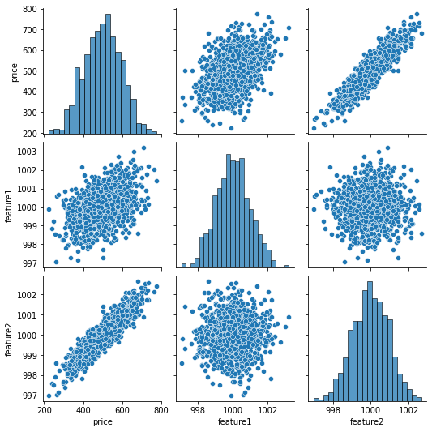
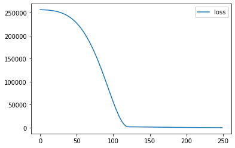
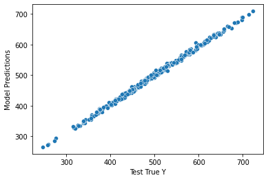

```python
import pandas as pd
import numpy as np

import matplotlib.pyplot as plt
import seaborn as sns

%matplotlib inline
```


```python
from google.colab import drive
```


```python
drive.mount('/content/drive')
```

    Mounted at /content/drive
    


```python
df = pd.read_csv('/content/drive/MyDrive/Colab Notebooks/DATA/fake_reg.csv')
```


```python
df.head()
```


  <div id="df-b5b40d87-2b25-4a98-ab3d-70c8919e9a8a">
    <div class="colab-df-container">
      <div>
<style scoped>
    .dataframe tbody tr th:only-of-type {
        vertical-align: middle;
    }

    .dataframe tbody tr th {
        vertical-align: top;
    }

    .dataframe thead th {
        text-align: right;
    }
</style>
<table border="1" class="dataframe">
  <thead>
    <tr style="text-align: right;">
      <th></th>
      <th>price</th>
      <th>feature1</th>
      <th>feature2</th>
    </tr>
  </thead>
  <tbody>
    <tr>
      <th>0</th>
      <td>461.527929</td>
      <td>999.787558</td>
      <td>999.766096</td>
    </tr>
    <tr>
      <th>1</th>
      <td>548.130011</td>
      <td>998.861615</td>
      <td>1001.042403</td>
    </tr>
    <tr>
      <th>2</th>
      <td>410.297162</td>
      <td>1000.070267</td>
      <td>998.844015</td>
    </tr>
    <tr>
      <th>3</th>
      <td>540.382220</td>
      <td>999.952251</td>
      <td>1000.440940</td>
    </tr>
    <tr>
      <th>4</th>
      <td>546.024553</td>
      <td>1000.446011</td>
      <td>1000.338531</td>
    </tr>
  </tbody>
</table>
</div>
      <button class="colab-df-convert" onclick="convertToInteractive('df-b5b40d87-2b25-4a98-ab3d-70c8919e9a8a')"
              title="Convert this dataframe to an interactive table."
              style="display:none;">

  <svg xmlns="http://www.w3.org/2000/svg" height="24px"viewBox="0 0 24 24"
       width="24px">
    <path d="M0 0h24v24H0V0z" fill="none"/>
    <path d="M18.56 5.44l.94 2.06.94-2.06 2.06-.94-2.06-.94-.94-2.06-.94 2.06-2.06.94zm-11 1L8.5 8.5l.94-2.06 2.06-.94-2.06-.94L8.5 2.5l-.94 2.06-2.06.94zm10 10l.94 2.06.94-2.06 2.06-.94-2.06-.94-.94-2.06-.94 2.06-2.06.94z"/><path d="M17.41 7.96l-1.37-1.37c-.4-.4-.92-.59-1.43-.59-.52 0-1.04.2-1.43.59L10.3 9.45l-7.72 7.72c-.78.78-.78 2.05 0 2.83L4 21.41c.39.39.9.59 1.41.59.51 0 1.02-.2 1.41-.59l7.78-7.78 2.81-2.81c.8-.78.8-2.07 0-2.86zM5.41 20L4 18.59l7.72-7.72 1.47 1.35L5.41 20z"/>
  </svg>
      </button>

  <style>
    .colab-df-container {
      display:flex;
      flex-wrap:wrap;
      gap: 12px;
    }

    .colab-df-convert {
      background-color: #E8F0FE;
      border: none;
      border-radius: 50%;
      cursor: pointer;
      display: none;
      fill: #1967D2;
      height: 32px;
      padding: 0 0 0 0;
      width: 32px;
    }

    .colab-df-convert:hover {
      background-color: #E2EBFA;
      box-shadow: 0px 1px 2px rgba(60, 64, 67, 0.3), 0px 1px 3px 1px rgba(60, 64, 67, 0.15);
      fill: #174EA6;
    }

    [theme=dark] .colab-df-convert {
      background-color: #3B4455;
      fill: #D2E3FC;
    }

    [theme=dark] .colab-df-convert:hover {
      background-color: #434B5C;
      box-shadow: 0px 1px 3px 1px rgba(0, 0, 0, 0.15);
      filter: drop-shadow(0px 1px 2px rgba(0, 0, 0, 0.3));
      fill: #FFFFFF;
    }
  </style>

      <script>
        const buttonEl =
          document.querySelector('#df-b5b40d87-2b25-4a98-ab3d-70c8919e9a8a button.colab-df-convert');
        buttonEl.style.display =
          google.colab.kernel.accessAllowed ? 'block' : 'none';

        async function convertToInteractive(key) {
          const element = document.querySelector('#df-b5b40d87-2b25-4a98-ab3d-70c8919e9a8a');
          const dataTable =
            await google.colab.kernel.invokeFunction('convertToInteractive',
                                                     [key], {});
          if (!dataTable) return;

          const docLinkHtml = 'Like what you see? Visit the ' +
            '<a target="_blank" href=https://colab.research.google.com/notebooks/data_table.ipynb>data table notebook</a>'
            + ' to learn more about interactive tables.';
          element.innerHTML = '';
          dataTable['output_type'] = 'display_data';
          await google.colab.output.renderOutput(dataTable, element);
          const docLink = document.createElement('div');
          docLink.innerHTML = docLinkHtml;
          element.appendChild(docLink);
        }
      </script>
    </div>
  </div>


```python
sns.pairplot(df)
```


    <seaborn.axisgrid.PairGrid at 0x7f9ea1e7f590>


    

    


```python
from sklearn.model_selection import train_test_split
```


```python
X = df[['feature1', 'feature2']].values
y = df['price'].values
```


```python
X
```


    array([[ 999.78755752,  999.7660962 ],
           [ 998.86161491, 1001.04240315],
           [1000.07026691,  998.84401463],
           ...,
           [1001.45164617,  998.84760554],
           [1000.77102275,  998.56285086],
           [ 999.2322436 , 1001.45140713]])


```python
X_train, X_test, y_train, y_test = train_test_split(X, y, test_size=0.3, random_state=42)
```


```python
X_train.shape
```


    (700, 2)


```python
X_test.shape
```


    (300, 2)


```python
from sklearn.preprocessing import MinMaxScaler
```


```python
help(MinMaxScaler)
```

    Help on class MinMaxScaler in module sklearn.preprocessing._data:
    
    class MinMaxScaler(sklearn.base._OneToOneFeatureMixin, sklearn.base.TransformerMixin, sklearn.base.BaseEstimator)
     |  MinMaxScaler(feature_range=(0, 1), *, copy=True, clip=False)
     |  
     |  Transform features by scaling each feature to a given range.
     |  
     |  This estimator scales and translates each feature individually such
     |  that it is in the given range on the training set, e.g. between
     |  zero and one.
     |  
     |  The transformation is given by::
     |  
     |      X_std = (X - X.min(axis=0)) / (X.max(axis=0) - X.min(axis=0))
     |      X_scaled = X_std * (max - min) + min
     |  
     |  where min, max = feature_range.
     |  
     |  This transformation is often used as an alternative to zero mean,
     |  unit variance scaling.
     |  
     |  Read more in the :ref:`User Guide <preprocessing_scaler>`.
     |  
     |  Parameters
     |  ----------
     |  feature_range : tuple (min, max), default=(0, 1)
     |      Desired range of transformed data.
     |  
     |  copy : bool, default=True
     |      Set to False to perform inplace row normalization and avoid a
     |      copy (if the input is already a numpy array).
     |  
     |  clip : bool, default=False
     |      Set to True to clip transformed values of held-out data to
     |      provided `feature range`.
     |  
     |      .. versionadded:: 0.24
     |  
     |  Attributes
     |  ----------
     |  min_ : ndarray of shape (n_features,)
     |      Per feature adjustment for minimum. Equivalent to
     |      ``min - X.min(axis=0) * self.scale_``
     |  
     |  scale_ : ndarray of shape (n_features,)
     |      Per feature relative scaling of the data. Equivalent to
     |      ``(max - min) / (X.max(axis=0) - X.min(axis=0))``
     |  
     |      .. versionadded:: 0.17
     |         *scale_* attribute.
     |  
     |  data_min_ : ndarray of shape (n_features,)
     |      Per feature minimum seen in the data
     |  
     |      .. versionadded:: 0.17
     |         *data_min_*
     |  
     |  data_max_ : ndarray of shape (n_features,)
     |      Per feature maximum seen in the data
     |  
     |      .. versionadded:: 0.17
     |         *data_max_*
     |  
     |  data_range_ : ndarray of shape (n_features,)
     |      Per feature range ``(data_max_ - data_min_)`` seen in the data
     |  
     |      .. versionadded:: 0.17
     |         *data_range_*
     |  
     |  n_features_in_ : int
     |      Number of features seen during :term:`fit`.
     |  
     |      .. versionadded:: 0.24
     |  
     |  n_samples_seen_ : int
     |      The number of samples processed by the estimator.
     |      It will be reset on new calls to fit, but increments across
     |      ``partial_fit`` calls.
     |  
     |  feature_names_in_ : ndarray of shape (`n_features_in_`,)
     |      Names of features seen during :term:`fit`. Defined only when `X`
     |      has feature names that are all strings.
     |  
     |      .. versionadded:: 1.0
     |  
     |  See Also
     |  --------
     |  minmax_scale : Equivalent function without the estimator API.
     |  
     |  Notes
     |  -----
     |  NaNs are treated as missing values: disregarded in fit, and maintained in
     |  transform.
     |  
     |  For a comparison of the different scalers, transformers, and normalizers,
     |  see :ref:`examples/preprocessing/plot_all_scaling.py
     |  <sphx_glr_auto_examples_preprocessing_plot_all_scaling.py>`.
     |  
     |  Examples
     |  --------
     |  >>> from sklearn.preprocessing import MinMaxScaler
     |  >>> data = [[-1, 2], [-0.5, 6], [0, 10], [1, 18]]
     |  >>> scaler = MinMaxScaler()
     |  >>> print(scaler.fit(data))
     |  MinMaxScaler()
     |  >>> print(scaler.data_max_)
     |  [ 1. 18.]
     |  >>> print(scaler.transform(data))
     |  [[0.   0.  ]
     |   [0.25 0.25]
     |   [0.5  0.5 ]
     |   [1.   1.  ]]
     |  >>> print(scaler.transform([[2, 2]]))
     |  [[1.5 0. ]]
     |  
     |  Method resolution order:
     |      MinMaxScaler
     |      sklearn.base._OneToOneFeatureMixin
     |      sklearn.base.TransformerMixin
     |      sklearn.base.BaseEstimator
     |      builtins.object
     |  
     |  Methods defined here:
     |  
     |  __init__(self, feature_range=(0, 1), *, copy=True, clip=False)
     |      Initialize self.  See help(type(self)) for accurate signature.
     |  
     |  fit(self, X, y=None)
     |      Compute the minimum and maximum to be used for later scaling.
     |      
     |      Parameters
     |      ----------
     |      X : array-like of shape (n_samples, n_features)
     |          The data used to compute the per-feature minimum and maximum
     |          used for later scaling along the features axis.
     |      
     |      y : None
     |          Ignored.
     |      
     |      Returns
     |      -------
     |      self : object
     |          Fitted scaler.
     |  
     |  inverse_transform(self, X)
     |      Undo the scaling of X according to feature_range.
     |      
     |      Parameters
     |      ----------
     |      X : array-like of shape (n_samples, n_features)
     |          Input data that will be transformed. It cannot be sparse.
     |      
     |      Returns
     |      -------
     |      Xt : ndarray of shape (n_samples, n_features)
     |          Transformed data.
     |  
     |  partial_fit(self, X, y=None)
     |      Online computation of min and max on X for later scaling.
     |      
     |      All of X is processed as a single batch. This is intended for cases
     |      when :meth:`fit` is not feasible due to very large number of
     |      `n_samples` or because X is read from a continuous stream.
     |      
     |      Parameters
     |      ----------
     |      X : array-like of shape (n_samples, n_features)
     |          The data used to compute the mean and standard deviation
     |          used for later scaling along the features axis.
     |      
     |      y : None
     |          Ignored.
     |      
     |      Returns
     |      -------
     |      self : object
     |          Fitted scaler.
     |  
     |  transform(self, X)
     |      Scale features of X according to feature_range.
     |      
     |      Parameters
     |      ----------
     |      X : array-like of shape (n_samples, n_features)
     |          Input data that will be transformed.
     |      
     |      Returns
     |      -------
     |      Xt : ndarray of shape (n_samples, n_features)
     |          Transformed data.
     |  
     |  ----------------------------------------------------------------------
     |  Methods inherited from sklearn.base._OneToOneFeatureMixin:
     |  
     |  get_feature_names_out(self, input_features=None)
     |      Get output feature names for transformation.
     |      
     |      Parameters
     |      ----------
     |      input_features : array-like of str or None, default=None
     |          Input features.
     |      
     |          - If `input_features` is `None`, then `feature_names_in_` is
     |            used as feature names in. If `feature_names_in_` is not defined,
     |            then names are generated: `[x0, x1, ..., x(n_features_in_)]`.
     |          - If `input_features` is an array-like, then `input_features` must
     |            match `feature_names_in_` if `feature_names_in_` is defined.
     |      
     |      Returns
     |      -------
     |      feature_names_out : ndarray of str objects
     |          Same as input features.
     |  
     |  ----------------------------------------------------------------------
     |  Data descriptors inherited from sklearn.base._OneToOneFeatureMixin:
     |  
     |  __dict__
     |      dictionary for instance variables (if defined)
     |  
     |  __weakref__
     |      list of weak references to the object (if defined)
     |  
     |  ----------------------------------------------------------------------
     |  Methods inherited from sklearn.base.TransformerMixin:
     |  
     |  fit_transform(self, X, y=None, **fit_params)
     |      Fit to data, then transform it.
     |      
     |      Fits transformer to `X` and `y` with optional parameters `fit_params`
     |      and returns a transformed version of `X`.
     |      
     |      Parameters
     |      ----------
     |      X : array-like of shape (n_samples, n_features)
     |          Input samples.
     |      
     |      y :  array-like of shape (n_samples,) or (n_samples, n_outputs),                 default=None
     |          Target values (None for unsupervised transformations).
     |      
     |      **fit_params : dict
     |          Additional fit parameters.
     |      
     |      Returns
     |      -------
     |      X_new : ndarray array of shape (n_samples, n_features_new)
     |          Transformed array.
     |  
     |  ----------------------------------------------------------------------
     |  Methods inherited from sklearn.base.BaseEstimator:
     |  
     |  __getstate__(self)
     |  
     |  __repr__(self, N_CHAR_MAX=700)
     |      Return repr(self).
     |  
     |  __setstate__(self, state)
     |  
     |  get_params(self, deep=True)
     |      Get parameters for this estimator.
     |      
     |      Parameters
     |      ----------
     |      deep : bool, default=True
     |          If True, will return the parameters for this estimator and
     |          contained subobjects that are estimators.
     |      
     |      Returns
     |      -------
     |      params : dict
     |          Parameter names mapped to their values.
     |  
     |  set_params(self, **params)
     |      Set the parameters of this estimator.
     |      
     |      The method works on simple estimators as well as on nested objects
     |      (such as :class:`~sklearn.pipeline.Pipeline`). The latter have
     |      parameters of the form ``<component>__<parameter>`` so that it's
     |      possible to update each component of a nested object.
     |      
     |      Parameters
     |      ----------
     |      **params : dict
     |          Estimator parameters.
     |      
     |      Returns
     |      -------
     |      self : estimator instance
     |          Estimator instance.
    
    


```python
scaler = MinMaxScaler()
```


```python
scaler.fit(X_train)
```


    MinMaxScaler()


```python
X_train = scaler.transform(X_train)
```


```python
X_test = scaler.transform(X_test)
```


```python
X_train.max()
```


    1.0


```python
X_train.min()
```


    0.0


```python
from tensorflow.keras.models import Sequential
from tensorflow.keras.layers import Dense
```


    ---------------------------------------------------------------------------

    ModuleNotFoundError                       Traceback (most recent call last)

    ~\AppData\Local\Temp/ipykernel_24928/4177631105.py in <module>
    ----> 1 from tensorflow.keras.models import Sequential
          2 from tensorflow.keras.layers import Dense
    

    ModuleNotFoundError: No module named 'tensorflow'


```python
help(Sequential)
```

    Help on class Sequential in module keras.engine.sequential:
    
    class Sequential(keras.engine.functional.Functional)
     |  Sequential(*args, **kwargs)
     |  
     |  `Sequential` groups a linear stack of layers into a `tf.keras.Model`.
     |  
     |  `Sequential` provides training and inference features on this model.
     |  
     |  Examples:
     |  
     |  ```python
     |  # Optionally, the first layer can receive an `input_shape` argument:
     |  model = tf.keras.Sequential()
     |  model.add(tf.keras.layers.Dense(8, input_shape=(16,)))
     |  # Afterwards, we do automatic shape inference:
     |  model.add(tf.keras.layers.Dense(4))
     |  
     |  # This is identical to the following:
     |  model = tf.keras.Sequential()
     |  model.add(tf.keras.Input(shape=(16,)))
     |  model.add(tf.keras.layers.Dense(8))
     |  
     |  # Note that you can also omit the `input_shape` argument.
     |  # In that case the model doesn't have any weights until the first call
     |  # to a training/evaluation method (since it isn't yet built):
     |  model = tf.keras.Sequential()
     |  model.add(tf.keras.layers.Dense(8))
     |  model.add(tf.keras.layers.Dense(4))
     |  # model.weights not created yet
     |  
     |  # Whereas if you specify the input shape, the model gets built
     |  # continuously as you are adding layers:
     |  model = tf.keras.Sequential()
     |  model.add(tf.keras.layers.Dense(8, input_shape=(16,)))
     |  model.add(tf.keras.layers.Dense(4))
     |  len(model.weights)
     |  # Returns "4"
     |  
     |  # When using the delayed-build pattern (no input shape specified), you can
     |  # choose to manually build your model by calling
     |  # `build(batch_input_shape)`:
     |  model = tf.keras.Sequential()
     |  model.add(tf.keras.layers.Dense(8))
     |  model.add(tf.keras.layers.Dense(4))
     |  model.build((None, 16))
     |  len(model.weights)
     |  # Returns "4"
     |  
     |  # Note that when using the delayed-build pattern (no input shape specified),
     |  # the model gets built the first time you call `fit`, `eval`, or `predict`,
     |  # or the first time you call the model on some input data.
     |  model = tf.keras.Sequential()
     |  model.add(tf.keras.layers.Dense(8))
     |  model.add(tf.keras.layers.Dense(1))
     |  model.compile(optimizer='sgd', loss='mse')
     |  # This builds the model for the first time:
     |  model.fit(x, y, batch_size=32, epochs=10)
     |  ```
     |  
     |  Method resolution order:
     |      Sequential
     |      keras.engine.functional.Functional
     |      keras.engine.training.Model
     |      keras.engine.base_layer.Layer
     |      tensorflow.python.module.module.Module
     |      tensorflow.python.training.tracking.autotrackable.AutoTrackable
     |      tensorflow.python.training.tracking.base.Trackable
     |      keras.utils.version_utils.LayerVersionSelector
     |      keras.utils.version_utils.ModelVersionSelector
     |      builtins.object
     |  
     |  Methods defined here:
     |  
     |  __init__(self, layers=None, name=None)
     |      Creates a `Sequential` model instance.
     |      
     |      Args:
     |        layers: Optional list of layers to add to the model.
     |        name: Optional name for the model.
     |  
     |  add(self, layer)
     |      Adds a layer instance on top of the layer stack.
     |      
     |      Args:
     |          layer: layer instance.
     |      
     |      Raises:
     |          TypeError: If `layer` is not a layer instance.
     |          ValueError: In case the `layer` argument does not
     |              know its input shape.
     |          ValueError: In case the `layer` argument has
     |              multiple output tensors, or is already connected
     |              somewhere else (forbidden in `Sequential` models).
     |  
     |  build(self, input_shape=None)
     |      Builds the model based on input shapes received.
     |      
     |      This is to be used for subclassed models, which do not know at instantiation
     |      time what their inputs look like.
     |      
     |      This method only exists for users who want to call `model.build()` in a
     |      standalone way (as a substitute for calling the model on real data to
     |      build it). It will never be called by the framework (and thus it will
     |      never throw unexpected errors in an unrelated workflow).
     |      
     |      Args:
     |       input_shape: Single tuple, `TensorShape` instance, or list/dict of shapes,
     |         where shapes are tuples, integers, or `TensorShape` instances.
     |      
     |      Raises:
     |        ValueError:
     |          1. In case of invalid user-provided data (not of type tuple,
     |             list, `TensorShape`, or dict).
     |          2. If the model requires call arguments that are agnostic
     |             to the input shapes (positional or keyword arg in call signature).
     |          3. If not all layers were properly built.
     |          4. If float type inputs are not supported within the layers.
     |      
     |        In each of these cases, the user should build their model by calling it
     |        on real tensor data.
     |  
     |  call(self, inputs, training=None, mask=None)
     |      Calls the model on new inputs.
     |      
     |      In this case `call` just reapplies
     |      all ops in the graph to the new inputs
     |      (e.g. build a new computational graph from the provided inputs).
     |      
     |      Args:
     |          inputs: A tensor or list of tensors.
     |          training: Boolean or boolean scalar tensor, indicating whether to run
     |            the `Network` in training mode or inference mode.
     |          mask: A mask or list of masks. A mask can be
     |              either a tensor or None (no mask).
     |      
     |      Returns:
     |          A tensor if there is a single output, or
     |          a list of tensors if there are more than one outputs.
     |  
     |  compute_mask(self, inputs, mask)
     |      Computes an output mask tensor.
     |      
     |      Args:
     |          inputs: Tensor or list of tensors.
     |          mask: Tensor or list of tensors.
     |      
     |      Returns:
     |          None or a tensor (or list of tensors,
     |              one per output tensor of the layer).
     |  
     |  compute_output_shape(self, input_shape)
     |      Computes the output shape of the layer.
     |      
     |      This method will cause the layer's state to be built, if that has not
     |      happened before. This requires that the layer will later be used with
     |      inputs that match the input shape provided here.
     |      
     |      Args:
     |          input_shape: Shape tuple (tuple of integers)
     |              or list of shape tuples (one per output tensor of the layer).
     |              Shape tuples can include None for free dimensions,
     |              instead of an integer.
     |      
     |      Returns:
     |          An input shape tuple.
     |  
     |  get_config(self)
     |      Returns the config of the layer.
     |      
     |      A layer config is a Python dictionary (serializable)
     |      containing the configuration of a layer.
     |      The same layer can be reinstantiated later
     |      (without its trained weights) from this configuration.
     |      
     |      The config of a layer does not include connectivity
     |      information, nor the layer class name. These are handled
     |      by `Network` (one layer of abstraction above).
     |      
     |      Note that `get_config()` does not guarantee to return a fresh copy of dict
     |      every time it is called. The callers should make a copy of the returned dict
     |      if they want to modify it.
     |      
     |      Returns:
     |          Python dictionary.
     |  
     |  pop(self)
     |      Removes the last layer in the model.
     |      
     |      Raises:
     |          TypeError: if there are no layers in the model.
     |  
     |  ----------------------------------------------------------------------
     |  Class methods defined here:
     |  
     |  from_config(config, custom_objects=None) from builtins.type
     |      Instantiates a Model from its config (output of `get_config()`).
     |      
     |      Args:
     |          config: Model config dictionary.
     |          custom_objects: Optional dictionary mapping names
     |              (strings) to custom classes or functions to be
     |              considered during deserialization.
     |      
     |      Returns:
     |          A model instance.
     |      
     |      Raises:
     |          ValueError: In case of improperly formatted config dict.
     |          TypeError: In case the config does match the cls constructor.
     |  
     |  ----------------------------------------------------------------------
     |  Data descriptors defined here:
     |  
     |  input_spec
     |      `InputSpec` instance(s) describing the input format for this layer.
     |      
     |      When you create a layer subclass, you can set `self.input_spec` to enable
     |      the layer to run input compatibility checks when it is called.
     |      Consider a `Conv2D` layer: it can only be called on a single input tensor
     |      of rank 4. As such, you can set, in `__init__()`:
     |      
     |      ```python
     |      self.input_spec = tf.keras.layers.InputSpec(ndim=4)
     |      ```
     |      
     |      Now, if you try to call the layer on an input that isn't rank 4
     |      (for instance, an input of shape `(2,)`, it will raise a nicely-formatted
     |      error:
     |      
     |      ```
     |      ValueError: Input 0 of layer conv2d is incompatible with the layer:
     |      expected ndim=4, found ndim=1. Full shape received: [2]
     |      ```
     |      
     |      Input checks that can be specified via `input_spec` include:
     |      - Structure (e.g. a single input, a list of 2 inputs, etc)
     |      - Shape
     |      - Rank (ndim)
     |      - Dtype
     |      
     |      For more information, see `tf.keras.layers.InputSpec`.
     |      
     |      Returns:
     |        A `tf.keras.layers.InputSpec` instance, or nested structure thereof.
     |  
     |  layers
     |  
     |  ----------------------------------------------------------------------
     |  Data descriptors inherited from keras.engine.functional.Functional:
     |  
     |  input
     |      Retrieves the input tensor(s) of a layer.
     |      
     |      Only applicable if the layer has exactly one input,
     |      i.e. if it is connected to one incoming layer.
     |      
     |      Returns:
     |          Input tensor or list of input tensors.
     |      
     |      Raises:
     |        RuntimeError: If called in Eager mode.
     |        AttributeError: If no inbound nodes are found.
     |  
     |  input_shape
     |      Retrieves the input shape(s) of a layer.
     |      
     |      Only applicable if the layer has exactly one input,
     |      i.e. if it is connected to one incoming layer, or if all inputs
     |      have the same shape.
     |      
     |      Returns:
     |          Input shape, as an integer shape tuple
     |          (or list of shape tuples, one tuple per input tensor).
     |      
     |      Raises:
     |          AttributeError: if the layer has no defined input_shape.
     |          RuntimeError: if called in Eager mode.
     |  
     |  output
     |      Retrieves the output tensor(s) of a layer.
     |      
     |      Only applicable if the layer has exactly one output,
     |      i.e. if it is connected to one incoming layer.
     |      
     |      Returns:
     |        Output tensor or list of output tensors.
     |      
     |      Raises:
     |        AttributeError: if the layer is connected to more than one incoming
     |          layers.
     |        RuntimeError: if called in Eager mode.
     |  
     |  output_shape
     |      Retrieves the output shape(s) of a layer.
     |      
     |      Only applicable if the layer has one output,
     |      or if all outputs have the same shape.
     |      
     |      Returns:
     |          Output shape, as an integer shape tuple
     |          (or list of shape tuples, one tuple per output tensor).
     |      
     |      Raises:
     |          AttributeError: if the layer has no defined output shape.
     |          RuntimeError: if called in Eager mode.
     |  
     |  ----------------------------------------------------------------------
     |  Methods inherited from keras.engine.training.Model:
     |  
     |  __copy__(self)
     |  
     |  __deepcopy__(self, memo)
     |  
     |  __reduce__(self)
     |      Helper for pickle.
     |  
     |  __setattr__(self, name, value)
     |      Support self.foo = trackable syntax.
     |  
     |  compile(self, optimizer='rmsprop', loss=None, metrics=None, loss_weights=None, weighted_metrics=None, run_eagerly=None, steps_per_execution=None, jit_compile=None, **kwargs)
     |      Configures the model for training.
     |      
     |      Example:
     |      
     |      ```python
     |      model.compile(optimizer=tf.keras.optimizers.Adam(learning_rate=1e-3),
     |                    loss=tf.keras.losses.BinaryCrossentropy(),
     |                    metrics=[tf.keras.metrics.BinaryAccuracy(),
     |                             tf.keras.metrics.FalseNegatives()])
     |      ```
     |      
     |      Args:
     |          optimizer: String (name of optimizer) or optimizer instance. See
     |            `tf.keras.optimizers`.
     |          loss: Loss function. Maybe be a string (name of loss function), or
     |            a `tf.keras.losses.Loss` instance. See `tf.keras.losses`. A loss
     |            function is any callable with the signature `loss = fn(y_true,
     |            y_pred)`, where `y_true` are the ground truth values, and
     |            `y_pred` are the model's predictions.
     |            `y_true` should have shape
     |            `(batch_size, d0, .. dN)` (except in the case of
     |            sparse loss functions such as
     |            sparse categorical crossentropy which expects integer arrays of shape
     |            `(batch_size, d0, .. dN-1)`).
     |            `y_pred` should have shape `(batch_size, d0, .. dN)`.
     |            The loss function should return a float tensor.
     |            If a custom `Loss` instance is
     |            used and reduction is set to `None`, return value has shape
     |            `(batch_size, d0, .. dN-1)` i.e. per-sample or per-timestep loss
     |            values; otherwise, it is a scalar. If the model has multiple outputs,
     |            you can use a different loss on each output by passing a dictionary
     |            or a list of losses. The loss value that will be minimized by the
     |            model will then be the sum of all individual losses, unless
     |            `loss_weights` is specified.
     |          metrics: List of metrics to be evaluated by the model during training
     |            and testing. Each of this can be a string (name of a built-in
     |            function), function or a `tf.keras.metrics.Metric` instance. See
     |            `tf.keras.metrics`. Typically you will use `metrics=['accuracy']`. A
     |            function is any callable with the signature `result = fn(y_true,
     |            y_pred)`. To specify different metrics for different outputs of a
     |            multi-output model, you could also pass a dictionary, such as
     |            `metrics={'output_a': 'accuracy', 'output_b': ['accuracy', 'mse']}`.
     |            You can also pass a list to specify a metric or a list of metrics
     |            for each output, such as `metrics=[['accuracy'], ['accuracy', 'mse']]`
     |            or `metrics=['accuracy', ['accuracy', 'mse']]`. When you pass the
     |            strings 'accuracy' or 'acc', we convert this to one of
     |            `tf.keras.metrics.BinaryAccuracy`,
     |            `tf.keras.metrics.CategoricalAccuracy`,
     |            `tf.keras.metrics.SparseCategoricalAccuracy` based on the loss
     |            function used and the model output shape. We do a similar
     |            conversion for the strings 'crossentropy' and 'ce' as well.
     |          loss_weights: Optional list or dictionary specifying scalar coefficients
     |            (Python floats) to weight the loss contributions of different model
     |            outputs. The loss value that will be minimized by the model will then
     |            be the *weighted sum* of all individual losses, weighted by the
     |            `loss_weights` coefficients.
     |              If a list, it is expected to have a 1:1 mapping to the model's
     |                outputs. If a dict, it is expected to map output names (strings)
     |                to scalar coefficients.
     |          weighted_metrics: List of metrics to be evaluated and weighted by
     |            `sample_weight` or `class_weight` during training and testing.
     |          run_eagerly: Bool. Defaults to `False`. If `True`, this `Model`'s
     |            logic will not be wrapped in a `tf.function`. Recommended to leave
     |            this as `None` unless your `Model` cannot be run inside a
     |            `tf.function`. `run_eagerly=True` is not supported when using
     |            `tf.distribute.experimental.ParameterServerStrategy`.
     |          steps_per_execution: Int. Defaults to 1. The number of batches to run
     |            during each `tf.function` call. Running multiple batches inside a
     |            single `tf.function` call can greatly improve performance on TPUs or
     |            small models with a large Python overhead. At most, one full epoch
     |            will be run each execution. If a number larger than the size of the
     |            epoch is passed, the execution will be truncated to the size of the
     |            epoch. Note that if `steps_per_execution` is set to `N`,
     |            `Callback.on_batch_begin` and `Callback.on_batch_end` methods will
     |            only be called every `N` batches (i.e. before/after each `tf.function`
     |            execution).
     |          jit_compile: If `True`, compile the model training step with XLA.
     |            [XLA](https://www.tensorflow.org/xla) is an optimizing compiler for
     |            machine learning.
     |            `jit_compile` is not enabled for by default.
     |            This option cannot be enabled with `run_eagerly=True`.
     |            Note that `jit_compile=True` is
     |            may not necessarily work for all models.
     |            For more information on supported operations please refer to the
     |            [XLA documentation](https://www.tensorflow.org/xla).
     |            Also refer to
     |            [known XLA issues](https://www.tensorflow.org/xla/known_issues) for
     |            more details.
     |          **kwargs: Arguments supported for backwards compatibility only.
     |  
     |  compute_loss(self, x=None, y=None, y_pred=None, sample_weight=None)
     |      Compute the total loss, validate it, and return it.
     |      
     |      Subclasses can optionally override this method to provide custom loss
     |      computation logic.
     |      
     |      Example:
     |      ```python
     |      class MyModel(tf.keras.Model):
     |      
     |        def __init__(self, *args, **kwargs):
     |          super(MyModel, self).__init__(*args, **kwargs)
     |          self.loss_tracker = tf.keras.metrics.Mean(name='loss')
     |      
     |        def compute_loss(self, x, y, y_pred, sample_weight):
     |          loss = tf.reduce_mean(tf.math.squared_difference(y_pred, y))
     |          loss += tf.add_n(self.losses)
     |          self.loss_tracker.update_state(loss)
     |          return loss
     |      
     |        def reset_metrics(self):
     |          self.loss_tracker.reset_states()
     |      
     |        @property
     |        def metrics(self):
     |          return [self.loss_tracker]
     |      
     |      tensors = tf.random.uniform((10, 10)), tf.random.uniform((10,))
     |      dataset = tf.data.Dataset.from_tensor_slices(tensors).repeat().batch(1)
     |      
     |      inputs = tf.keras.layers.Input(shape=(10,), name='my_input')
     |      outputs = tf.keras.layers.Dense(10)(inputs)
     |      model = MyModel(inputs, outputs)
     |      model.add_loss(tf.reduce_sum(outputs))
     |      
     |      optimizer = tf.keras.optimizers.SGD()
     |      model.compile(optimizer, loss='mse', steps_per_execution=10)
     |      model.fit(dataset, epochs=2, steps_per_epoch=10)
     |      print('My custom loss: ', model.loss_tracker.result().numpy())
     |      ```
     |      
     |      Args:
     |        x: Input data.
     |        y: Target data.
     |        y_pred: Predictions returned by the model (output of `model(x)`)
     |        sample_weight: Sample weights for weighting the loss function.
     |      
     |      Returns:
     |        The total loss as a `tf.Tensor`, or `None` if no loss results (which is
     |        the case when called by `Model.test_step`).
     |  
     |  compute_metrics(self, x, y, y_pred, sample_weight)
     |      Update metric states and collect all metrics to be returned.
     |      
     |      Subclasses can optionally override this method to provide custom metric
     |      updating and collection logic.
     |      
     |      Example:
     |      ```python
     |      class MyModel(tf.keras.Sequential):
     |      
     |        def compute_metrics(self, x, y, y_pred, sample_weight):
     |      
     |          # This super call updates `self.compiled_metrics` and returns results
     |          # for all metrics listed in `self.metrics`.
     |          metric_results = super(MyModel, self).compute_metrics(
     |              x, y, y_pred, sample_weight)
     |      
     |          # Note that `self.custom_metric` is not listed in `self.metrics`.
     |          self.custom_metric.update_state(x, y, y_pred, sample_weight)
     |          metric_results['custom_metric_name'] = self.custom_metric.result()
     |          return metric_results
     |      ```
     |      
     |      Args:
     |        x: Input data.
     |        y: Target data.
     |        y_pred: Predictions returned by the model (output of `model.call(x)`)
     |        sample_weight: Sample weights for weighting the loss function.
     |      
     |      Returns:
     |        A `dict` containing values that will be passed to
     |        `tf.keras.callbacks.CallbackList.on_train_batch_end()`. Typically, the
     |        values of the metrics listed in `self.metrics` are returned. Example:
     |        `{'loss': 0.2, 'accuracy': 0.7}`.
     |  
     |  evaluate(self, x=None, y=None, batch_size=None, verbose=1, sample_weight=None, steps=None, callbacks=None, max_queue_size=10, workers=1, use_multiprocessing=False, return_dict=False, **kwargs)
     |      Returns the loss value & metrics values for the model in test mode.
     |      
     |      Computation is done in batches (see the `batch_size` arg.)
     |      
     |      Args:
     |          x: Input data. It could be:
     |            - A Numpy array (or array-like), or a list of arrays
     |              (in case the model has multiple inputs).
     |            - A TensorFlow tensor, or a list of tensors
     |              (in case the model has multiple inputs).
     |            - A dict mapping input names to the corresponding array/tensors,
     |              if the model has named inputs.
     |            - A `tf.data` dataset. Should return a tuple
     |              of either `(inputs, targets)` or
     |              `(inputs, targets, sample_weights)`.
     |            - A generator or `keras.utils.Sequence` returning `(inputs, targets)`
     |              or `(inputs, targets, sample_weights)`.
     |            A more detailed description of unpacking behavior for iterator types
     |            (Dataset, generator, Sequence) is given in the `Unpacking behavior
     |            for iterator-like inputs` section of `Model.fit`.
     |          y: Target data. Like the input data `x`, it could be either Numpy
     |            array(s) or TensorFlow tensor(s). It should be consistent with `x`
     |            (you cannot have Numpy inputs and tensor targets, or inversely). If
     |            `x` is a dataset, generator or `keras.utils.Sequence` instance, `y`
     |            should not be specified (since targets will be obtained from the
     |            iterator/dataset).
     |          batch_size: Integer or `None`. Number of samples per batch of
     |            computation. If unspecified, `batch_size` will default to 32. Do not
     |            specify the `batch_size` if your data is in the form of a dataset,
     |            generators, or `keras.utils.Sequence` instances (since they generate
     |            batches).
     |          verbose: 0 or 1. Verbosity mode. 0 = silent, 1 = progress bar.
     |          sample_weight: Optional Numpy array of weights for the test samples,
     |            used for weighting the loss function. You can either pass a flat (1D)
     |            Numpy array with the same length as the input samples
     |              (1:1 mapping between weights and samples), or in the case of
     |                temporal data, you can pass a 2D array with shape `(samples,
     |                sequence_length)`, to apply a different weight to every timestep
     |                of every sample. This argument is not supported when `x` is a
     |                dataset, instead pass sample weights as the third element of `x`.
     |          steps: Integer or `None`. Total number of steps (batches of samples)
     |            before declaring the evaluation round finished. Ignored with the
     |            default value of `None`. If x is a `tf.data` dataset and `steps` is
     |            None, 'evaluate' will run until the dataset is exhausted. This
     |            argument is not supported with array inputs.
     |          callbacks: List of `keras.callbacks.Callback` instances. List of
     |            callbacks to apply during evaluation. See
     |            [callbacks](/api_docs/python/tf/keras/callbacks).
     |          max_queue_size: Integer. Used for generator or `keras.utils.Sequence`
     |            input only. Maximum size for the generator queue. If unspecified,
     |            `max_queue_size` will default to 10.
     |          workers: Integer. Used for generator or `keras.utils.Sequence` input
     |            only. Maximum number of processes to spin up when using process-based
     |            threading. If unspecified, `workers` will default to 1.
     |          use_multiprocessing: Boolean. Used for generator or
     |            `keras.utils.Sequence` input only. If `True`, use process-based
     |            threading. If unspecified, `use_multiprocessing` will default to
     |            `False`. Note that because this implementation relies on
     |            multiprocessing, you should not pass non-picklable arguments to the
     |            generator as they can't be passed easily to children processes.
     |          return_dict: If `True`, loss and metric results are returned as a dict,
     |            with each key being the name of the metric. If `False`, they are
     |            returned as a list.
     |          **kwargs: Unused at this time.
     |      
     |      See the discussion of `Unpacking behavior for iterator-like inputs` for
     |      `Model.fit`.
     |      
     |      Returns:
     |          Scalar test loss (if the model has a single output and no metrics)
     |          or list of scalars (if the model has multiple outputs
     |          and/or metrics). The attribute `model.metrics_names` will give you
     |          the display labels for the scalar outputs.
     |      
     |      Raises:
     |          RuntimeError: If `model.evaluate` is wrapped in a `tf.function`.
     |  
     |  evaluate_generator(self, generator, steps=None, callbacks=None, max_queue_size=10, workers=1, use_multiprocessing=False, verbose=0)
     |      Evaluates the model on a data generator.
     |      
     |      DEPRECATED:
     |        `Model.evaluate` now supports generators, so there is no longer any need
     |        to use this endpoint.
     |  
     |  fit(self, x=None, y=None, batch_size=None, epochs=1, verbose='auto', callbacks=None, validation_split=0.0, validation_data=None, shuffle=True, class_weight=None, sample_weight=None, initial_epoch=0, steps_per_epoch=None, validation_steps=None, validation_batch_size=None, validation_freq=1, max_queue_size=10, workers=1, use_multiprocessing=False)
     |      Trains the model for a fixed number of epochs (iterations on a dataset).
     |      
     |      Args:
     |          x: Input data. It could be:
     |            - A Numpy array (or array-like), or a list of arrays
     |              (in case the model has multiple inputs).
     |            - A TensorFlow tensor, or a list of tensors
     |              (in case the model has multiple inputs).
     |            - A dict mapping input names to the corresponding array/tensors,
     |              if the model has named inputs.
     |            - A `tf.data` dataset. Should return a tuple
     |              of either `(inputs, targets)` or
     |              `(inputs, targets, sample_weights)`.
     |            - A generator or `keras.utils.Sequence` returning `(inputs, targets)`
     |              or `(inputs, targets, sample_weights)`.
     |            - A `tf.keras.utils.experimental.DatasetCreator`, which wraps a
     |              callable that takes a single argument of type
     |              `tf.distribute.InputContext`, and returns a `tf.data.Dataset`.
     |              `DatasetCreator` should be used when users prefer to specify the
     |              per-replica batching and sharding logic for the `Dataset`.
     |              See `tf.keras.utils.experimental.DatasetCreator` doc for more
     |              information.
     |            A more detailed description of unpacking behavior for iterator types
     |            (Dataset, generator, Sequence) is given below. If using
     |            `tf.distribute.experimental.ParameterServerStrategy`, only
     |            `DatasetCreator` type is supported for `x`.
     |          y: Target data. Like the input data `x`,
     |            it could be either Numpy array(s) or TensorFlow tensor(s).
     |            It should be consistent with `x` (you cannot have Numpy inputs and
     |            tensor targets, or inversely). If `x` is a dataset, generator,
     |            or `keras.utils.Sequence` instance, `y` should
     |            not be specified (since targets will be obtained from `x`).
     |          batch_size: Integer or `None`.
     |              Number of samples per gradient update.
     |              If unspecified, `batch_size` will default to 32.
     |              Do not specify the `batch_size` if your data is in the
     |              form of datasets, generators, or `keras.utils.Sequence` instances
     |              (since they generate batches).
     |          epochs: Integer. Number of epochs to train the model.
     |              An epoch is an iteration over the entire `x` and `y`
     |              data provided
     |              (unless the `steps_per_epoch` flag is set to
     |              something other than None).
     |              Note that in conjunction with `initial_epoch`,
     |              `epochs` is to be understood as "final epoch".
     |              The model is not trained for a number of iterations
     |              given by `epochs`, but merely until the epoch
     |              of index `epochs` is reached.
     |          verbose: 'auto', 0, 1, or 2. Verbosity mode.
     |              0 = silent, 1 = progress bar, 2 = one line per epoch.
     |              'auto' defaults to 1 for most cases, but 2 when used with
     |              `ParameterServerStrategy`. Note that the progress bar is not
     |              particularly useful when logged to a file, so verbose=2 is
     |              recommended when not running interactively (eg, in a production
     |              environment).
     |          callbacks: List of `keras.callbacks.Callback` instances.
     |              List of callbacks to apply during training.
     |              See `tf.keras.callbacks`. Note `tf.keras.callbacks.ProgbarLogger`
     |              and `tf.keras.callbacks.History` callbacks are created automatically
     |              and need not be passed into `model.fit`.
     |              `tf.keras.callbacks.ProgbarLogger` is created or not based on
     |              `verbose` argument to `model.fit`.
     |              Callbacks with batch-level calls are currently unsupported with
     |              `tf.distribute.experimental.ParameterServerStrategy`, and users are
     |              advised to implement epoch-level calls instead with an appropriate
     |              `steps_per_epoch` value.
     |          validation_split: Float between 0 and 1.
     |              Fraction of the training data to be used as validation data.
     |              The model will set apart this fraction of the training data,
     |              will not train on it, and will evaluate
     |              the loss and any model metrics
     |              on this data at the end of each epoch.
     |              The validation data is selected from the last samples
     |              in the `x` and `y` data provided, before shuffling. This argument is
     |              not supported when `x` is a dataset, generator or
     |             `keras.utils.Sequence` instance.
     |              `validation_split` is not yet supported with
     |              `tf.distribute.experimental.ParameterServerStrategy`.
     |          validation_data: Data on which to evaluate
     |              the loss and any model metrics at the end of each epoch.
     |              The model will not be trained on this data. Thus, note the fact
     |              that the validation loss of data provided using `validation_split`
     |              or `validation_data` is not affected by regularization layers like
     |              noise and dropout.
     |              `validation_data` will override `validation_split`.
     |              `validation_data` could be:
     |                - A tuple `(x_val, y_val)` of Numpy arrays or tensors.
     |                - A tuple `(x_val, y_val, val_sample_weights)` of NumPy arrays.
     |                - A `tf.data.Dataset`.
     |                - A Python generator or `keras.utils.Sequence` returning
     |                `(inputs, targets)` or `(inputs, targets, sample_weights)`.
     |              `validation_data` is not yet supported with
     |              `tf.distribute.experimental.ParameterServerStrategy`.
     |          shuffle: Boolean (whether to shuffle the training data
     |              before each epoch) or str (for 'batch'). This argument is ignored
     |              when `x` is a generator or an object of tf.data.Dataset.
     |              'batch' is a special option for dealing
     |              with the limitations of HDF5 data; it shuffles in batch-sized
     |              chunks. Has no effect when `steps_per_epoch` is not `None`.
     |          class_weight: Optional dictionary mapping class indices (integers)
     |              to a weight (float) value, used for weighting the loss function
     |              (during training only).
     |              This can be useful to tell the model to
     |              "pay more attention" to samples from
     |              an under-represented class.
     |          sample_weight: Optional Numpy array of weights for
     |              the training samples, used for weighting the loss function
     |              (during training only). You can either pass a flat (1D)
     |              Numpy array with the same length as the input samples
     |              (1:1 mapping between weights and samples),
     |              or in the case of temporal data,
     |              you can pass a 2D array with shape
     |              `(samples, sequence_length)`,
     |              to apply a different weight to every timestep of every sample. This
     |              argument is not supported when `x` is a dataset, generator, or
     |             `keras.utils.Sequence` instance, instead provide the sample_weights
     |              as the third element of `x`.
     |          initial_epoch: Integer.
     |              Epoch at which to start training
     |              (useful for resuming a previous training run).
     |          steps_per_epoch: Integer or `None`.
     |              Total number of steps (batches of samples)
     |              before declaring one epoch finished and starting the
     |              next epoch. When training with input tensors such as
     |              TensorFlow data tensors, the default `None` is equal to
     |              the number of samples in your dataset divided by
     |              the batch size, or 1 if that cannot be determined. If x is a
     |              `tf.data` dataset, and 'steps_per_epoch'
     |              is None, the epoch will run until the input dataset is exhausted.
     |              When passing an infinitely repeating dataset, you must specify the
     |              `steps_per_epoch` argument. If `steps_per_epoch=-1` the training
     |              will run indefinitely with an infinitely repeating dataset.
     |              This argument is not supported with array inputs.
     |              When using `tf.distribute.experimental.ParameterServerStrategy`:
     |                * `steps_per_epoch=None` is not supported.
     |          validation_steps: Only relevant if `validation_data` is provided and
     |              is a `tf.data` dataset. Total number of steps (batches of
     |              samples) to draw before stopping when performing validation
     |              at the end of every epoch. If 'validation_steps' is None, validation
     |              will run until the `validation_data` dataset is exhausted. In the
     |              case of an infinitely repeated dataset, it will run into an
     |              infinite loop. If 'validation_steps' is specified and only part of
     |              the dataset will be consumed, the evaluation will start from the
     |              beginning of the dataset at each epoch. This ensures that the same
     |              validation samples are used every time.
     |          validation_batch_size: Integer or `None`.
     |              Number of samples per validation batch.
     |              If unspecified, will default to `batch_size`.
     |              Do not specify the `validation_batch_size` if your data is in the
     |              form of datasets, generators, or `keras.utils.Sequence` instances
     |              (since they generate batches).
     |          validation_freq: Only relevant if validation data is provided. Integer
     |              or `collections.abc.Container` instance (e.g. list, tuple, etc.).
     |              If an integer, specifies how many training epochs to run before a
     |              new validation run is performed, e.g. `validation_freq=2` runs
     |              validation every 2 epochs. If a Container, specifies the epochs on
     |              which to run validation, e.g. `validation_freq=[1, 2, 10]` runs
     |              validation at the end of the 1st, 2nd, and 10th epochs.
     |          max_queue_size: Integer. Used for generator or `keras.utils.Sequence`
     |              input only. Maximum size for the generator queue.
     |              If unspecified, `max_queue_size` will default to 10.
     |          workers: Integer. Used for generator or `keras.utils.Sequence` input
     |              only. Maximum number of processes to spin up
     |              when using process-based threading. If unspecified, `workers`
     |              will default to 1.
     |          use_multiprocessing: Boolean. Used for generator or
     |              `keras.utils.Sequence` input only. If `True`, use process-based
     |              threading. If unspecified, `use_multiprocessing` will default to
     |              `False`. Note that because this implementation relies on
     |              multiprocessing, you should not pass non-picklable arguments to
     |              the generator as they can't be passed easily to children processes.
     |      
     |      Unpacking behavior for iterator-like inputs:
     |          A common pattern is to pass a tf.data.Dataset, generator, or
     |        tf.keras.utils.Sequence to the `x` argument of fit, which will in fact
     |        yield not only features (x) but optionally targets (y) and sample weights.
     |        Keras requires that the output of such iterator-likes be unambiguous. The
     |        iterator should return a tuple of length 1, 2, or 3, where the optional
     |        second and third elements will be used for y and sample_weight
     |        respectively. Any other type provided will be wrapped in a length one
     |        tuple, effectively treating everything as 'x'. When yielding dicts, they
     |        should still adhere to the top-level tuple structure.
     |        e.g. `({"x0": x0, "x1": x1}, y)`. Keras will not attempt to separate
     |        features, targets, and weights from the keys of a single dict.
     |          A notable unsupported data type is the namedtuple. The reason is that
     |        it behaves like both an ordered datatype (tuple) and a mapping
     |        datatype (dict). So given a namedtuple of the form:
     |            `namedtuple("example_tuple", ["y", "x"])`
     |        it is ambiguous whether to reverse the order of the elements when
     |        interpreting the value. Even worse is a tuple of the form:
     |            `namedtuple("other_tuple", ["x", "y", "z"])`
     |        where it is unclear if the tuple was intended to be unpacked into x, y,
     |        and sample_weight or passed through as a single element to `x`. As a
     |        result the data processing code will simply raise a ValueError if it
     |        encounters a namedtuple. (Along with instructions to remedy the issue.)
     |      
     |      Returns:
     |          A `History` object. Its `History.history` attribute is
     |          a record of training loss values and metrics values
     |          at successive epochs, as well as validation loss values
     |          and validation metrics values (if applicable).
     |      
     |      Raises:
     |          RuntimeError: 1. If the model was never compiled or,
     |          2. If `model.fit` is  wrapped in `tf.function`.
     |      
     |          ValueError: In case of mismatch between the provided input data
     |              and what the model expects or when the input data is empty.
     |  
     |  fit_generator(self, generator, steps_per_epoch=None, epochs=1, verbose=1, callbacks=None, validation_data=None, validation_steps=None, validation_freq=1, class_weight=None, max_queue_size=10, workers=1, use_multiprocessing=False, shuffle=True, initial_epoch=0)
     |      Fits the model on data yielded batch-by-batch by a Python generator.
     |      
     |      DEPRECATED:
     |        `Model.fit` now supports generators, so there is no longer any need to use
     |        this endpoint.
     |  
     |  get_layer(self, name=None, index=None)
     |      Retrieves a layer based on either its name (unique) or index.
     |      
     |      If `name` and `index` are both provided, `index` will take precedence.
     |      Indices are based on order of horizontal graph traversal (bottom-up).
     |      
     |      Args:
     |          name: String, name of layer.
     |          index: Integer, index of layer.
     |      
     |      Returns:
     |          A layer instance.
     |  
     |  get_weights(self)
     |      Retrieves the weights of the model.
     |      
     |      Returns:
     |          A flat list of Numpy arrays.
     |  
     |  load_weights(self, filepath, by_name=False, skip_mismatch=False, options=None)
     |      Loads all layer weights, either from a TensorFlow or an HDF5 weight file.
     |      
     |      If `by_name` is False weights are loaded based on the network's
     |      topology. This means the architecture should be the same as when the weights
     |      were saved.  Note that layers that don't have weights are not taken into
     |      account in the topological ordering, so adding or removing layers is fine as
     |      long as they don't have weights.
     |      
     |      If `by_name` is True, weights are loaded into layers only if they share the
     |      same name. This is useful for fine-tuning or transfer-learning models where
     |      some of the layers have changed.
     |      
     |      Only topological loading (`by_name=False`) is supported when loading weights
     |      from the TensorFlow format. Note that topological loading differs slightly
     |      between TensorFlow and HDF5 formats for user-defined classes inheriting from
     |      `tf.keras.Model`: HDF5 loads based on a flattened list of weights, while the
     |      TensorFlow format loads based on the object-local names of attributes to
     |      which layers are assigned in the `Model`'s constructor.
     |      
     |      Args:
     |          filepath: String, path to the weights file to load. For weight files in
     |              TensorFlow format, this is the file prefix (the same as was passed
     |              to `save_weights`). This can also be a path to a SavedModel
     |              saved from `model.save`.
     |          by_name: Boolean, whether to load weights by name or by topological
     |              order. Only topological loading is supported for weight files in
     |              TensorFlow format.
     |          skip_mismatch: Boolean, whether to skip loading of layers where there is
     |              a mismatch in the number of weights, or a mismatch in the shape of
     |              the weight (only valid when `by_name=True`).
     |          options: Optional `tf.train.CheckpointOptions` object that specifies
     |              options for loading weights.
     |      
     |      Returns:
     |          When loading a weight file in TensorFlow format, returns the same status
     |          object as `tf.train.Checkpoint.restore`. When graph building, restore
     |          ops are run automatically as soon as the network is built (on first call
     |          for user-defined classes inheriting from `Model`, immediately if it is
     |          already built).
     |      
     |          When loading weights in HDF5 format, returns `None`.
     |      
     |      Raises:
     |          ImportError: If `h5py` is not available and the weight file is in HDF5
     |              format.
     |          ValueError: If `skip_mismatch` is set to `True` when `by_name` is
     |            `False`.
     |  
     |  make_predict_function(self, force=False)
     |      Creates a function that executes one step of inference.
     |      
     |      This method can be overridden to support custom inference logic.
     |      This method is called by `Model.predict` and `Model.predict_on_batch`.
     |      
     |      Typically, this method directly controls `tf.function` and
     |      `tf.distribute.Strategy` settings, and delegates the actual evaluation
     |      logic to `Model.predict_step`.
     |      
     |      This function is cached the first time `Model.predict` or
     |      `Model.predict_on_batch` is called. The cache is cleared whenever
     |      `Model.compile` is called. You can skip the cache and generate again the
     |      function with `force=True`.
     |      
     |      Args:
     |        force: Whether to regenerate the predict function and skip the cached
     |          function if available.
     |      
     |      Returns:
     |        Function. The function created by this method should accept a
     |        `tf.data.Iterator`, and return the outputs of the `Model`.
     |  
     |  make_test_function(self, force=False)
     |      Creates a function that executes one step of evaluation.
     |      
     |      This method can be overridden to support custom evaluation logic.
     |      This method is called by `Model.evaluate` and `Model.test_on_batch`.
     |      
     |      Typically, this method directly controls `tf.function` and
     |      `tf.distribute.Strategy` settings, and delegates the actual evaluation
     |      logic to `Model.test_step`.
     |      
     |      This function is cached the first time `Model.evaluate` or
     |      `Model.test_on_batch` is called. The cache is cleared whenever
     |      `Model.compile` is called. You can skip the cache and generate again the
     |      function with `force=True`.
     |      
     |      Args:
     |        force: Whether to regenerate the test function and skip the cached
     |          function if available.
     |      
     |      Returns:
     |        Function. The function created by this method should accept a
     |        `tf.data.Iterator`, and return a `dict` containing values that will
     |        be passed to `tf.keras.Callbacks.on_test_batch_end`.
     |  
     |  make_train_function(self, force=False)
     |      Creates a function that executes one step of training.
     |      
     |      This method can be overridden to support custom training logic.
     |      This method is called by `Model.fit` and `Model.train_on_batch`.
     |      
     |      Typically, this method directly controls `tf.function` and
     |      `tf.distribute.Strategy` settings, and delegates the actual training
     |      logic to `Model.train_step`.
     |      
     |      This function is cached the first time `Model.fit` or
     |      `Model.train_on_batch` is called. The cache is cleared whenever
     |      `Model.compile` is called. You can skip the cache and generate again the
     |      function with `force=True`.
     |      
     |      Args:
     |        force: Whether to regenerate the train function and skip the cached
     |          function if available.
     |      
     |      Returns:
     |        Function. The function created by this method should accept a
     |        `tf.data.Iterator`, and return a `dict` containing values that will
     |        be passed to `tf.keras.Callbacks.on_train_batch_end`, such as
     |        `{'loss': 0.2, 'accuracy': 0.7}`.
     |  
     |  predict(self, x, batch_size=None, verbose=0, steps=None, callbacks=None, max_queue_size=10, workers=1, use_multiprocessing=False)
     |      Generates output predictions for the input samples.
     |      
     |      Computation is done in batches. This method is designed for batch processing
     |      of large numbers of inputs. It is not intended for use inside of loops
     |      that iterate over your data and process small numbers of inputs at a time.
     |      
     |      For small numbers of inputs that fit in one batch,
     |      directly use `__call__()` for faster execution, e.g.,
     |      `model(x)`, or `model(x, training=False)` if you have layers such as
     |      `tf.keras.layers.BatchNormalization` that behave differently during
     |      inference. You may pair the individual model call with a `tf.function`
     |      for additional performance inside your inner loop.
     |      If you need access to numpy array values instead of tensors after your
     |      model call, you can use `tensor.numpy()` to get the numpy array value of
     |      an eager tensor.
     |      
     |      Also, note the fact that test loss is not affected by
     |      regularization layers like noise and dropout.
     |      
     |      Note: See [this FAQ entry](
     |      https://keras.io/getting_started/faq/#whats-the-difference-between-model-methods-predict-and-call)
     |      for more details about the difference between `Model` methods `predict()`
     |      and `__call__()`.
     |      
     |      Args:
     |          x: Input samples. It could be:
     |            - A Numpy array (or array-like), or a list of arrays
     |              (in case the model has multiple inputs).
     |            - A TensorFlow tensor, or a list of tensors
     |              (in case the model has multiple inputs).
     |            - A `tf.data` dataset.
     |            - A generator or `keras.utils.Sequence` instance.
     |            A more detailed description of unpacking behavior for iterator types
     |            (Dataset, generator, Sequence) is given in the `Unpacking behavior
     |            for iterator-like inputs` section of `Model.fit`.
     |          batch_size: Integer or `None`.
     |              Number of samples per batch.
     |              If unspecified, `batch_size` will default to 32.
     |              Do not specify the `batch_size` if your data is in the
     |              form of dataset, generators, or `keras.utils.Sequence` instances
     |              (since they generate batches).
     |          verbose: Verbosity mode, 0 or 1.
     |          steps: Total number of steps (batches of samples)
     |              before declaring the prediction round finished.
     |              Ignored with the default value of `None`. If x is a `tf.data`
     |              dataset and `steps` is None, `predict()` will
     |              run until the input dataset is exhausted.
     |          callbacks: List of `keras.callbacks.Callback` instances.
     |              List of callbacks to apply during prediction.
     |              See [callbacks](/api_docs/python/tf/keras/callbacks).
     |          max_queue_size: Integer. Used for generator or `keras.utils.Sequence`
     |              input only. Maximum size for the generator queue.
     |              If unspecified, `max_queue_size` will default to 10.
     |          workers: Integer. Used for generator or `keras.utils.Sequence` input
     |              only. Maximum number of processes to spin up when using
     |              process-based threading. If unspecified, `workers` will default
     |              to 1.
     |          use_multiprocessing: Boolean. Used for generator or
     |              `keras.utils.Sequence` input only. If `True`, use process-based
     |              threading. If unspecified, `use_multiprocessing` will default to
     |              `False`. Note that because this implementation relies on
     |              multiprocessing, you should not pass non-picklable arguments to
     |              the generator as they can't be passed easily to children processes.
     |      
     |      See the discussion of `Unpacking behavior for iterator-like inputs` for
     |      `Model.fit`. Note that Model.predict uses the same interpretation rules as
     |      `Model.fit` and `Model.evaluate`, so inputs must be unambiguous for all
     |      three methods.
     |      
     |      Returns:
     |          Numpy array(s) of predictions.
     |      
     |      Raises:
     |          RuntimeError: If `model.predict` is wrapped in a `tf.function`.
     |          ValueError: In case of mismatch between the provided
     |              input data and the model's expectations,
     |              or in case a stateful model receives a number of samples
     |              that is not a multiple of the batch size.
     |  
     |  predict_generator(self, generator, steps=None, callbacks=None, max_queue_size=10, workers=1, use_multiprocessing=False, verbose=0)
     |      Generates predictions for the input samples from a data generator.
     |      
     |      DEPRECATED:
     |        `Model.predict` now supports generators, so there is no longer any need
     |        to use this endpoint.
     |  
     |  predict_on_batch(self, x)
     |      Returns predictions for a single batch of samples.
     |      
     |      Args:
     |          x: Input data. It could be:
     |            - A Numpy array (or array-like), or a list of arrays (in case the
     |                model has multiple inputs).
     |            - A TensorFlow tensor, or a list of tensors (in case the model has
     |                multiple inputs).
     |      
     |      Returns:
     |          Numpy array(s) of predictions.
     |      
     |      Raises:
     |          RuntimeError: If `model.predict_on_batch` is wrapped in a `tf.function`.
     |  
     |  predict_step(self, data)
     |      The logic for one inference step.
     |      
     |      This method can be overridden to support custom inference logic.
     |      This method is called by `Model.make_predict_function`.
     |      
     |      This method should contain the mathematical logic for one step of inference.
     |      This typically includes the forward pass.
     |      
     |      Configuration details for *how* this logic is run (e.g. `tf.function` and
     |      `tf.distribute.Strategy` settings), should be left to
     |      `Model.make_predict_function`, which can also be overridden.
     |      
     |      Args:
     |        data: A nested structure of `Tensor`s.
     |      
     |      Returns:
     |        The result of one inference step, typically the output of calling the
     |        `Model` on data.
     |  
     |  reset_metrics(self)
     |      Resets the state of all the metrics in the model.
     |      
     |      Examples:
     |      
     |      >>> inputs = tf.keras.layers.Input(shape=(3,))
     |      >>> outputs = tf.keras.layers.Dense(2)(inputs)
     |      >>> model = tf.keras.models.Model(inputs=inputs, outputs=outputs)
     |      >>> model.compile(optimizer="Adam", loss="mse", metrics=["mae"])
     |      
     |      >>> x = np.random.random((2, 3))
     |      >>> y = np.random.randint(0, 2, (2, 2))
     |      >>> _ = model.fit(x, y, verbose=0)
     |      >>> assert all(float(m.result()) for m in model.metrics)
     |      
     |      >>> model.reset_metrics()
     |      >>> assert all(float(m.result()) == 0 for m in model.metrics)
     |  
     |  reset_states(self)
     |  
     |  save(self, filepath, overwrite=True, include_optimizer=True, save_format=None, signatures=None, options=None, save_traces=True)
     |      Saves the model to Tensorflow SavedModel or a single HDF5 file.
     |      
     |      Please see `tf.keras.models.save_model` or the
     |      [Serialization and Saving guide](https://keras.io/guides/serialization_and_saving/)
     |      for details.
     |      
     |      Args:
     |          filepath: String, PathLike, path to SavedModel or H5 file to save the
     |              model.
     |          overwrite: Whether to silently overwrite any existing file at the
     |              target location, or provide the user with a manual prompt.
     |          include_optimizer: If True, save optimizer's state together.
     |          save_format: Either `'tf'` or `'h5'`, indicating whether to save the
     |              model to Tensorflow SavedModel or HDF5. Defaults to 'tf' in TF 2.X,
     |              and 'h5' in TF 1.X.
     |          signatures: Signatures to save with the SavedModel. Applicable to the
     |              'tf' format only. Please see the `signatures` argument in
     |              `tf.saved_model.save` for details.
     |          options: (only applies to SavedModel format)
     |              `tf.saved_model.SaveOptions` object that specifies options for
     |              saving to SavedModel.
     |          save_traces: (only applies to SavedModel format) When enabled, the
     |              SavedModel will store the function traces for each layer. This
     |              can be disabled, so that only the configs of each layer are stored.
     |              Defaults to `True`. Disabling this will decrease serialization time
     |              and reduce file size, but it requires that all custom layers/models
     |              implement a `get_config()` method.
     |      
     |      Example:
     |      
     |      ```python
     |      from keras.models import load_model
     |      
     |      model.save('my_model.h5')  # creates a HDF5 file 'my_model.h5'
     |      del model  # deletes the existing model
     |      
     |      # returns a compiled model
     |      # identical to the previous one
     |      model = load_model('my_model.h5')
     |      ```
     |  
     |  save_spec(self, dynamic_batch=True)
     |      Returns the `tf.TensorSpec` of call inputs as a tuple `(args, kwargs)`.
     |      
     |      This value is automatically defined after calling the model for the first
     |      time. Afterwards, you can use it when exporting the model for serving:
     |      
     |      ```python
     |      model = tf.keras.Model(...)
     |      
     |      @tf.function
     |      def serve(*args, **kwargs):
     |        outputs = model(*args, **kwargs)
     |        # Apply postprocessing steps, or add additional outputs.
     |        ...
     |        return outputs
     |      
     |      # arg_specs is `[tf.TensorSpec(...), ...]`. kwarg_specs, in this example, is
     |      # an empty dict since functional models do not use keyword arguments.
     |      arg_specs, kwarg_specs = model.save_spec()
     |      
     |      model.save(path, signatures={
     |        'serving_default': serve.get_concrete_function(*arg_specs, **kwarg_specs)
     |      })
     |      ```
     |      
     |      Args:
     |        dynamic_batch: Whether to set the batch sizes of all the returned
     |          `tf.TensorSpec` to `None`. (Note that when defining functional or
     |          Sequential models with `tf.keras.Input([...], batch_size=X)`, the
     |          batch size will always be preserved). Defaults to `True`.
     |      Returns:
     |        If the model inputs are defined, returns a tuple `(args, kwargs)`. All
     |        elements in `args` and `kwargs` are `tf.TensorSpec`.
     |        If the model inputs are not defined, returns `None`.
     |        The model inputs are automatically set when calling the model,
     |        `model.fit`, `model.evaluate` or `model.predict`.
     |  
     |  save_weights(self, filepath, overwrite=True, save_format=None, options=None)
     |      Saves all layer weights.
     |      
     |      Either saves in HDF5 or in TensorFlow format based on the `save_format`
     |      argument.
     |      
     |      When saving in HDF5 format, the weight file has:
     |        - `layer_names` (attribute), a list of strings
     |            (ordered names of model layers).
     |        - For every layer, a `group` named `layer.name`
     |            - For every such layer group, a group attribute `weight_names`,
     |                a list of strings
     |                (ordered names of weights tensor of the layer).
     |            - For every weight in the layer, a dataset
     |                storing the weight value, named after the weight tensor.
     |      
     |      When saving in TensorFlow format, all objects referenced by the network are
     |      saved in the same format as `tf.train.Checkpoint`, including any `Layer`
     |      instances or `Optimizer` instances assigned to object attributes. For
     |      networks constructed from inputs and outputs using `tf.keras.Model(inputs,
     |      outputs)`, `Layer` instances used by the network are tracked/saved
     |      automatically. For user-defined classes which inherit from `tf.keras.Model`,
     |      `Layer` instances must be assigned to object attributes, typically in the
     |      constructor. See the documentation of `tf.train.Checkpoint` and
     |      `tf.keras.Model` for details.
     |      
     |      While the formats are the same, do not mix `save_weights` and
     |      `tf.train.Checkpoint`. Checkpoints saved by `Model.save_weights` should be
     |      loaded using `Model.load_weights`. Checkpoints saved using
     |      `tf.train.Checkpoint.save` should be restored using the corresponding
     |      `tf.train.Checkpoint.restore`. Prefer `tf.train.Checkpoint` over
     |      `save_weights` for training checkpoints.
     |      
     |      The TensorFlow format matches objects and variables by starting at a root
     |      object, `self` for `save_weights`, and greedily matching attribute
     |      names. For `Model.save` this is the `Model`, and for `Checkpoint.save` this
     |      is the `Checkpoint` even if the `Checkpoint` has a model attached. This
     |      means saving a `tf.keras.Model` using `save_weights` and loading into a
     |      `tf.train.Checkpoint` with a `Model` attached (or vice versa) will not match
     |      the `Model`'s variables. See the
     |      [guide to training checkpoints](https://www.tensorflow.org/guide/checkpoint)
     |      for details on the TensorFlow format.
     |      
     |      Args:
     |          filepath: String or PathLike, path to the file to save the weights to.
     |              When saving in TensorFlow format, this is the prefix used for
     |              checkpoint files (multiple files are generated). Note that the '.h5'
     |              suffix causes weights to be saved in HDF5 format.
     |          overwrite: Whether to silently overwrite any existing file at the
     |              target location, or provide the user with a manual prompt.
     |          save_format: Either 'tf' or 'h5'. A `filepath` ending in '.h5' or
     |              '.keras' will default to HDF5 if `save_format` is `None`. Otherwise
     |              `None` defaults to 'tf'.
     |          options: Optional `tf.train.CheckpointOptions` object that specifies
     |              options for saving weights.
     |      
     |      Raises:
     |          ImportError: If `h5py` is not available when attempting to save in HDF5
     |              format.
     |  
     |  summary(self, line_length=None, positions=None, print_fn=None, expand_nested=False, show_trainable=False)
     |      Prints a string summary of the network.
     |      
     |      Args:
     |          line_length: Total length of printed lines
     |              (e.g. set this to adapt the display to different
     |              terminal window sizes).
     |          positions: Relative or absolute positions of log elements
     |              in each line. If not provided,
     |              defaults to `[.33, .55, .67, 1.]`.
     |          print_fn: Print function to use. Defaults to `print`.
     |              It will be called on each line of the summary.
     |              You can set it to a custom function
     |              in order to capture the string summary.
     |          expand_nested: Whether to expand the nested models.
     |              If not provided, defaults to `False`.
     |          show_trainable: Whether to show if a layer is trainable.
     |              If not provided, defaults to `False`.
     |      
     |      Raises:
     |          ValueError: if `summary()` is called before the model is built.
     |  
     |  test_on_batch(self, x, y=None, sample_weight=None, reset_metrics=True, return_dict=False)
     |      Test the model on a single batch of samples.
     |      
     |      Args:
     |          x: Input data. It could be:
     |            - A Numpy array (or array-like), or a list of arrays (in case the
     |                model has multiple inputs).
     |            - A TensorFlow tensor, or a list of tensors (in case the model has
     |                multiple inputs).
     |            - A dict mapping input names to the corresponding array/tensors, if
     |                the model has named inputs.
     |          y: Target data. Like the input data `x`, it could be either Numpy
     |            array(s) or TensorFlow tensor(s). It should be consistent with `x`
     |            (you cannot have Numpy inputs and tensor targets, or inversely).
     |          sample_weight: Optional array of the same length as x, containing
     |            weights to apply to the model's loss for each sample. In the case of
     |            temporal data, you can pass a 2D array with shape (samples,
     |            sequence_length), to apply a different weight to every timestep of
     |            every sample.
     |          reset_metrics: If `True`, the metrics returned will be only for this
     |            batch. If `False`, the metrics will be statefully accumulated across
     |            batches.
     |          return_dict: If `True`, loss and metric results are returned as a dict,
     |            with each key being the name of the metric. If `False`, they are
     |            returned as a list.
     |      
     |      Returns:
     |          Scalar test loss (if the model has a single output and no metrics)
     |          or list of scalars (if the model has multiple outputs
     |          and/or metrics). The attribute `model.metrics_names` will give you
     |          the display labels for the scalar outputs.
     |      
     |      Raises:
     |          RuntimeError: If `model.test_on_batch` is wrapped in a `tf.function`.
     |  
     |  test_step(self, data)
     |      The logic for one evaluation step.
     |      
     |      This method can be overridden to support custom evaluation logic.
     |      This method is called by `Model.make_test_function`.
     |      
     |      This function should contain the mathematical logic for one step of
     |      evaluation.
     |      This typically includes the forward pass, loss calculation, and metrics
     |      updates.
     |      
     |      Configuration details for *how* this logic is run (e.g. `tf.function` and
     |      `tf.distribute.Strategy` settings), should be left to
     |      `Model.make_test_function`, which can also be overridden.
     |      
     |      Args:
     |        data: A nested structure of `Tensor`s.
     |      
     |      Returns:
     |        A `dict` containing values that will be passed to
     |        `tf.keras.callbacks.CallbackList.on_train_batch_end`. Typically, the
     |        values of the `Model`'s metrics are returned.
     |  
     |  to_json(self, **kwargs)
     |      Returns a JSON string containing the network configuration.
     |      
     |      To load a network from a JSON save file, use
     |      `keras.models.model_from_json(json_string, custom_objects={})`.
     |      
     |      Args:
     |          **kwargs: Additional keyword arguments
     |              to be passed to `json.dumps()`.
     |      
     |      Returns:
     |          A JSON string.
     |  
     |  to_yaml(self, **kwargs)
     |      Returns a yaml string containing the network configuration.
     |      
     |      Note: Since TF 2.6, this method is no longer supported and will raise a
     |      RuntimeError.
     |      
     |      To load a network from a yaml save file, use
     |      `keras.models.model_from_yaml(yaml_string, custom_objects={})`.
     |      
     |      `custom_objects` should be a dictionary mapping
     |      the names of custom losses / layers / etc to the corresponding
     |      functions / classes.
     |      
     |      Args:
     |          **kwargs: Additional keyword arguments
     |              to be passed to `yaml.dump()`.
     |      
     |      Returns:
     |          A YAML string.
     |      
     |      Raises:
     |          RuntimeError: announces that the method poses a security risk
     |  
     |  train_on_batch(self, x, y=None, sample_weight=None, class_weight=None, reset_metrics=True, return_dict=False)
     |      Runs a single gradient update on a single batch of data.
     |      
     |      Args:
     |          x: Input data. It could be:
     |            - A Numpy array (or array-like), or a list of arrays
     |                (in case the model has multiple inputs).
     |            - A TensorFlow tensor, or a list of tensors
     |                (in case the model has multiple inputs).
     |            - A dict mapping input names to the corresponding array/tensors,
     |                if the model has named inputs.
     |          y: Target data. Like the input data `x`, it could be either Numpy
     |            array(s) or TensorFlow tensor(s). It should be consistent with `x`
     |            (you cannot have Numpy inputs and tensor targets, or inversely).
     |          sample_weight: Optional array of the same length as x, containing
     |            weights to apply to the model's loss for each sample. In the case of
     |            temporal data, you can pass a 2D array with shape (samples,
     |            sequence_length), to apply a different weight to every timestep of
     |            every sample.
     |          class_weight: Optional dictionary mapping class indices (integers) to a
     |            weight (float) to apply to the model's loss for the samples from this
     |            class during training. This can be useful to tell the model to "pay
     |            more attention" to samples from an under-represented class.
     |          reset_metrics: If `True`, the metrics returned will be only for this
     |            batch. If `False`, the metrics will be statefully accumulated across
     |            batches.
     |          return_dict: If `True`, loss and metric results are returned as a dict,
     |            with each key being the name of the metric. If `False`, they are
     |            returned as a list.
     |      
     |      Returns:
     |          Scalar training loss
     |          (if the model has a single output and no metrics)
     |          or list of scalars (if the model has multiple outputs
     |          and/or metrics). The attribute `model.metrics_names` will give you
     |          the display labels for the scalar outputs.
     |      
     |      Raises:
     |        RuntimeError: If `model.train_on_batch` is wrapped in a `tf.function`.
     |  
     |  train_step(self, data)
     |      The logic for one training step.
     |      
     |      This method can be overridden to support custom training logic.
     |      For concrete examples of how to override this method see
     |      [Customizing what happends in fit](https://www.tensorflow.org/guide/keras/customizing_what_happens_in_fit).
     |      This method is called by `Model.make_train_function`.
     |      
     |      This method should contain the mathematical logic for one step of training.
     |      This typically includes the forward pass, loss calculation, backpropagation,
     |      and metric updates.
     |      
     |      Configuration details for *how* this logic is run (e.g. `tf.function` and
     |      `tf.distribute.Strategy` settings), should be left to
     |      `Model.make_train_function`, which can also be overridden.
     |      
     |      Args:
     |        data: A nested structure of `Tensor`s.
     |      
     |      Returns:
     |        A `dict` containing values that will be passed to
     |        `tf.keras.callbacks.CallbackList.on_train_batch_end`. Typically, the
     |        values of the `Model`'s metrics are returned. Example:
     |        `{'loss': 0.2, 'accuracy': 0.7}`.
     |  
     |  ----------------------------------------------------------------------
     |  Static methods inherited from keras.engine.training.Model:
     |  
     |  __new__(cls, *args, **kwargs)
     |      Create and return a new object.  See help(type) for accurate signature.
     |  
     |  ----------------------------------------------------------------------
     |  Data descriptors inherited from keras.engine.training.Model:
     |  
     |  distribute_strategy
     |      The `tf.distribute.Strategy` this model was created under.
     |  
     |  metrics
     |      Returns the model's metrics added using `compile()`, `add_metric()` APIs.
     |      
     |      Note: Metrics passed to `compile()` are available only after a `keras.Model`
     |      has been trained/evaluated on actual data.
     |      
     |      Examples:
     |      
     |      >>> inputs = tf.keras.layers.Input(shape=(3,))
     |      >>> outputs = tf.keras.layers.Dense(2)(inputs)
     |      >>> model = tf.keras.models.Model(inputs=inputs, outputs=outputs)
     |      >>> model.compile(optimizer="Adam", loss="mse", metrics=["mae"])
     |      >>> [m.name for m in model.metrics]
     |      []
     |      
     |      >>> x = np.random.random((2, 3))
     |      >>> y = np.random.randint(0, 2, (2, 2))
     |      >>> model.fit(x, y)
     |      >>> [m.name for m in model.metrics]
     |      ['loss', 'mae']
     |      
     |      >>> inputs = tf.keras.layers.Input(shape=(3,))
     |      >>> d = tf.keras.layers.Dense(2, name='out')
     |      >>> output_1 = d(inputs)
     |      >>> output_2 = d(inputs)
     |      >>> model = tf.keras.models.Model(
     |      ...    inputs=inputs, outputs=[output_1, output_2])
     |      >>> model.add_metric(
     |      ...    tf.reduce_sum(output_2), name='mean', aggregation='mean')
     |      >>> model.compile(optimizer="Adam", loss="mse", metrics=["mae", "acc"])
     |      >>> model.fit(x, (y, y))
     |      >>> [m.name for m in model.metrics]
     |      ['loss', 'out_loss', 'out_1_loss', 'out_mae', 'out_acc', 'out_1_mae',
     |      'out_1_acc', 'mean']
     |  
     |  metrics_names
     |      Returns the model's display labels for all outputs.
     |      
     |      Note: `metrics_names` are available only after a `keras.Model` has been
     |      trained/evaluated on actual data.
     |      
     |      Examples:
     |      
     |      >>> inputs = tf.keras.layers.Input(shape=(3,))
     |      >>> outputs = tf.keras.layers.Dense(2)(inputs)
     |      >>> model = tf.keras.models.Model(inputs=inputs, outputs=outputs)
     |      >>> model.compile(optimizer="Adam", loss="mse", metrics=["mae"])
     |      >>> model.metrics_names
     |      []
     |      
     |      >>> x = np.random.random((2, 3))
     |      >>> y = np.random.randint(0, 2, (2, 2))
     |      >>> model.fit(x, y)
     |      >>> model.metrics_names
     |      ['loss', 'mae']
     |      
     |      >>> inputs = tf.keras.layers.Input(shape=(3,))
     |      >>> d = tf.keras.layers.Dense(2, name='out')
     |      >>> output_1 = d(inputs)
     |      >>> output_2 = d(inputs)
     |      >>> model = tf.keras.models.Model(
     |      ...    inputs=inputs, outputs=[output_1, output_2])
     |      >>> model.compile(optimizer="Adam", loss="mse", metrics=["mae", "acc"])
     |      >>> model.fit(x, (y, y))
     |      >>> model.metrics_names
     |      ['loss', 'out_loss', 'out_1_loss', 'out_mae', 'out_acc', 'out_1_mae',
     |      'out_1_acc']
     |  
     |  non_trainable_weights
     |      List of all non-trainable weights tracked by this layer.
     |      
     |      Non-trainable weights are *not* updated during training. They are expected
     |      to be updated manually in `call()`.
     |      
     |      Returns:
     |        A list of non-trainable variables.
     |  
     |  run_eagerly
     |      Settable attribute indicating whether the model should run eagerly.
     |      
     |      Running eagerly means that your model will be run step by step,
     |      like Python code. Your model might run slower, but it should become easier
     |      for you to debug it by stepping into individual layer calls.
     |      
     |      By default, we will attempt to compile your model to a static graph to
     |      deliver the best execution performance.
     |      
     |      Returns:
     |        Boolean, whether the model should run eagerly.
     |  
     |  state_updates
     |      Deprecated, do NOT use!
     |      
     |      Returns the `updates` from all layers that are stateful.
     |      
     |      This is useful for separating training updates and
     |      state updates, e.g. when we need to update a layer's internal state
     |      during prediction.
     |      
     |      Returns:
     |          A list of update ops.
     |  
     |  trainable_weights
     |      List of all trainable weights tracked by this layer.
     |      
     |      Trainable weights are updated via gradient descent during training.
     |      
     |      Returns:
     |        A list of trainable variables.
     |  
     |  weights
     |      Returns the list of all layer variables/weights.
     |      
     |      Note: This will not track the weights of nested `tf.Modules` that are not
     |      themselves Keras layers.
     |      
     |      Returns:
     |        A list of variables.
     |  
     |  ----------------------------------------------------------------------
     |  Methods inherited from keras.engine.base_layer.Layer:
     |  
     |  __call__(self, *args, **kwargs)
     |      Wraps `call`, applying pre- and post-processing steps.
     |      
     |      Args:
     |        *args: Positional arguments to be passed to `self.call`.
     |        **kwargs: Keyword arguments to be passed to `self.call`.
     |      
     |      Returns:
     |        Output tensor(s).
     |      
     |      Note:
     |        - The following optional keyword arguments are reserved for specific uses:
     |          * `training`: Boolean scalar tensor of Python boolean indicating
     |            whether the `call` is meant for training or inference.
     |          * `mask`: Boolean input mask.
     |        - If the layer's `call` method takes a `mask` argument (as some Keras
     |          layers do), its default value will be set to the mask generated
     |          for `inputs` by the previous layer (if `input` did come from
     |          a layer that generated a corresponding mask, i.e. if it came from
     |          a Keras layer with masking support.
     |        - If the layer is not built, the method will call `build`.
     |      
     |      Raises:
     |        ValueError: if the layer's `call` method returns None (an invalid value).
     |        RuntimeError: if `super().__init__()` was not called in the constructor.
     |  
     |  __delattr__(self, name)
     |      Implement delattr(self, name).
     |  
     |  __getstate__(self)
     |  
     |  __setstate__(self, state)
     |  
     |  add_loss(self, losses, **kwargs)
     |      Add loss tensor(s), potentially dependent on layer inputs.
     |      
     |      Some losses (for instance, activity regularization losses) may be dependent
     |      on the inputs passed when calling a layer. Hence, when reusing the same
     |      layer on different inputs `a` and `b`, some entries in `layer.losses` may
     |      be dependent on `a` and some on `b`. This method automatically keeps track
     |      of dependencies.
     |      
     |      This method can be used inside a subclassed layer or model's `call`
     |      function, in which case `losses` should be a Tensor or list of Tensors.
     |      
     |      Example:
     |      
     |      ```python
     |      class MyLayer(tf.keras.layers.Layer):
     |        def call(self, inputs):
     |          self.add_loss(tf.abs(tf.reduce_mean(inputs)))
     |          return inputs
     |      ```
     |      
     |      This method can also be called directly on a Functional Model during
     |      construction. In this case, any loss Tensors passed to this Model must
     |      be symbolic and be able to be traced back to the model's `Input`s. These
     |      losses become part of the model's topology and are tracked in `get_config`.
     |      
     |      Example:
     |      
     |      ```python
     |      inputs = tf.keras.Input(shape=(10,))
     |      x = tf.keras.layers.Dense(10)(inputs)
     |      outputs = tf.keras.layers.Dense(1)(x)
     |      model = tf.keras.Model(inputs, outputs)
     |      # Activity regularization.
     |      model.add_loss(tf.abs(tf.reduce_mean(x)))
     |      ```
     |      
     |      If this is not the case for your loss (if, for example, your loss references
     |      a `Variable` of one of the model's layers), you can wrap your loss in a
     |      zero-argument lambda. These losses are not tracked as part of the model's
     |      topology since they can't be serialized.
     |      
     |      Example:
     |      
     |      ```python
     |      inputs = tf.keras.Input(shape=(10,))
     |      d = tf.keras.layers.Dense(10)
     |      x = d(inputs)
     |      outputs = tf.keras.layers.Dense(1)(x)
     |      model = tf.keras.Model(inputs, outputs)
     |      # Weight regularization.
     |      model.add_loss(lambda: tf.reduce_mean(d.kernel))
     |      ```
     |      
     |      Args:
     |        losses: Loss tensor, or list/tuple of tensors. Rather than tensors, losses
     |          may also be zero-argument callables which create a loss tensor.
     |        **kwargs: Additional keyword arguments for backward compatibility.
     |          Accepted values:
     |            inputs - Deprecated, will be automatically inferred.
     |  
     |  add_metric(self, value, name=None, **kwargs)
     |      Adds metric tensor to the layer.
     |      
     |      This method can be used inside the `call()` method of a subclassed layer
     |      or model.
     |      
     |      ```python
     |      class MyMetricLayer(tf.keras.layers.Layer):
     |        def __init__(self):
     |          super(MyMetricLayer, self).__init__(name='my_metric_layer')
     |          self.mean = tf.keras.metrics.Mean(name='metric_1')
     |      
     |        def call(self, inputs):
     |          self.add_metric(self.mean(inputs))
     |          self.add_metric(tf.reduce_sum(inputs), name='metric_2')
     |          return inputs
     |      ```
     |      
     |      This method can also be called directly on a Functional Model during
     |      construction. In this case, any tensor passed to this Model must
     |      be symbolic and be able to be traced back to the model's `Input`s. These
     |      metrics become part of the model's topology and are tracked when you
     |      save the model via `save()`.
     |      
     |      ```python
     |      inputs = tf.keras.Input(shape=(10,))
     |      x = tf.keras.layers.Dense(10)(inputs)
     |      outputs = tf.keras.layers.Dense(1)(x)
     |      model = tf.keras.Model(inputs, outputs)
     |      model.add_metric(math_ops.reduce_sum(x), name='metric_1')
     |      ```
     |      
     |      Note: Calling `add_metric()` with the result of a metric object on a
     |      Functional Model, as shown in the example below, is not supported. This is
     |      because we cannot trace the metric result tensor back to the model's inputs.
     |      
     |      ```python
     |      inputs = tf.keras.Input(shape=(10,))
     |      x = tf.keras.layers.Dense(10)(inputs)
     |      outputs = tf.keras.layers.Dense(1)(x)
     |      model = tf.keras.Model(inputs, outputs)
     |      model.add_metric(tf.keras.metrics.Mean()(x), name='metric_1')
     |      ```
     |      
     |      Args:
     |        value: Metric tensor.
     |        name: String metric name.
     |        **kwargs: Additional keyword arguments for backward compatibility.
     |          Accepted values:
     |          `aggregation` - When the `value` tensor provided is not the result of
     |          calling a `keras.Metric` instance, it will be aggregated by default
     |          using a `keras.Metric.Mean`.
     |  
     |  add_update(self, updates, inputs=None)
     |      Add update op(s), potentially dependent on layer inputs.
     |      
     |      Weight updates (for instance, the updates of the moving mean and variance
     |      in a BatchNormalization layer) may be dependent on the inputs passed
     |      when calling a layer. Hence, when reusing the same layer on
     |      different inputs `a` and `b`, some entries in `layer.updates` may be
     |      dependent on `a` and some on `b`. This method automatically keeps track
     |      of dependencies.
     |      
     |      This call is ignored when eager execution is enabled (in that case, variable
     |      updates are run on the fly and thus do not need to be tracked for later
     |      execution).
     |      
     |      Args:
     |        updates: Update op, or list/tuple of update ops, or zero-arg callable
     |          that returns an update op. A zero-arg callable should be passed in
     |          order to disable running the updates by setting `trainable=False`
     |          on this Layer, when executing in Eager mode.
     |        inputs: Deprecated, will be automatically inferred.
     |  
     |  add_variable(self, *args, **kwargs)
     |      Deprecated, do NOT use! Alias for `add_weight`.
     |  
     |  add_weight(self, name=None, shape=None, dtype=None, initializer=None, regularizer=None, trainable=None, constraint=None, use_resource=None, synchronization=<VariableSynchronization.AUTO: 0>, aggregation=<VariableAggregationV2.NONE: 0>, **kwargs)
     |      Adds a new variable to the layer.
     |      
     |      Args:
     |        name: Variable name.
     |        shape: Variable shape. Defaults to scalar if unspecified.
     |        dtype: The type of the variable. Defaults to `self.dtype`.
     |        initializer: Initializer instance (callable).
     |        regularizer: Regularizer instance (callable).
     |        trainable: Boolean, whether the variable should be part of the layer's
     |          "trainable_variables" (e.g. variables, biases)
     |          or "non_trainable_variables" (e.g. BatchNorm mean and variance).
     |          Note that `trainable` cannot be `True` if `synchronization`
     |          is set to `ON_READ`.
     |        constraint: Constraint instance (callable).
     |        use_resource: Whether to use `ResourceVariable`.
     |        synchronization: Indicates when a distributed a variable will be
     |          aggregated. Accepted values are constants defined in the class
     |          `tf.VariableSynchronization`. By default the synchronization is set to
     |          `AUTO` and the current `DistributionStrategy` chooses
     |          when to synchronize. If `synchronization` is set to `ON_READ`,
     |          `trainable` must not be set to `True`.
     |        aggregation: Indicates how a distributed variable will be aggregated.
     |          Accepted values are constants defined in the class
     |          `tf.VariableAggregation`.
     |        **kwargs: Additional keyword arguments. Accepted values are `getter`,
     |          `collections`, `experimental_autocast` and `caching_device`.
     |      
     |      Returns:
     |        The variable created.
     |      
     |      Raises:
     |        ValueError: When giving unsupported dtype and no initializer or when
     |          trainable has been set to True with synchronization set as `ON_READ`.
     |  
     |  apply(self, inputs, *args, **kwargs)
     |      Deprecated, do NOT use!
     |      
     |      This is an alias of `self.__call__`.
     |      
     |      Args:
     |        inputs: Input tensor(s).
     |        *args: additional positional arguments to be passed to `self.call`.
     |        **kwargs: additional keyword arguments to be passed to `self.call`.
     |      
     |      Returns:
     |        Output tensor(s).
     |  
     |  compute_output_signature(self, input_signature)
     |      Compute the output tensor signature of the layer based on the inputs.
     |      
     |      Unlike a TensorShape object, a TensorSpec object contains both shape
     |      and dtype information for a tensor. This method allows layers to provide
     |      output dtype information if it is different from the input dtype.
     |      For any layer that doesn't implement this function,
     |      the framework will fall back to use `compute_output_shape`, and will
     |      assume that the output dtype matches the input dtype.
     |      
     |      Args:
     |        input_signature: Single TensorSpec or nested structure of TensorSpec
     |          objects, describing a candidate input for the layer.
     |      
     |      Returns:
     |        Single TensorSpec or nested structure of TensorSpec objects, describing
     |          how the layer would transform the provided input.
     |      
     |      Raises:
     |        TypeError: If input_signature contains a non-TensorSpec object.
     |  
     |  count_params(self)
     |      Count the total number of scalars composing the weights.
     |      
     |      Returns:
     |          An integer count.
     |      
     |      Raises:
     |          ValueError: if the layer isn't yet built
     |            (in which case its weights aren't yet defined).
     |  
     |  finalize_state(self)
     |      Finalizes the layers state after updating layer weights.
     |      
     |      This function can be subclassed in a layer and will be called after updating
     |      a layer weights. It can be overridden to finalize any additional layer state
     |      after a weight update.
     |      
     |      This function will be called after weights of a layer have been restored
     |      from a loaded model.
     |  
     |  get_input_at(self, node_index)
     |      Retrieves the input tensor(s) of a layer at a given node.
     |      
     |      Args:
     |          node_index: Integer, index of the node
     |              from which to retrieve the attribute.
     |              E.g. `node_index=0` will correspond to the
     |              first input node of the layer.
     |      
     |      Returns:
     |          A tensor (or list of tensors if the layer has multiple inputs).
     |      
     |      Raises:
     |        RuntimeError: If called in Eager mode.
     |  
     |  get_input_mask_at(self, node_index)
     |      Retrieves the input mask tensor(s) of a layer at a given node.
     |      
     |      Args:
     |          node_index: Integer, index of the node
     |              from which to retrieve the attribute.
     |              E.g. `node_index=0` will correspond to the
     |              first time the layer was called.
     |      
     |      Returns:
     |          A mask tensor
     |          (or list of tensors if the layer has multiple inputs).
     |  
     |  get_input_shape_at(self, node_index)
     |      Retrieves the input shape(s) of a layer at a given node.
     |      
     |      Args:
     |          node_index: Integer, index of the node
     |              from which to retrieve the attribute.
     |              E.g. `node_index=0` will correspond to the
     |              first time the layer was called.
     |      
     |      Returns:
     |          A shape tuple
     |          (or list of shape tuples if the layer has multiple inputs).
     |      
     |      Raises:
     |        RuntimeError: If called in Eager mode.
     |  
     |  get_losses_for(self, inputs)
     |      Deprecated, do NOT use!
     |      
     |      Retrieves losses relevant to a specific set of inputs.
     |      
     |      Args:
     |        inputs: Input tensor or list/tuple of input tensors.
     |      
     |      Returns:
     |        List of loss tensors of the layer that depend on `inputs`.
     |  
     |  get_output_at(self, node_index)
     |      Retrieves the output tensor(s) of a layer at a given node.
     |      
     |      Args:
     |          node_index: Integer, index of the node
     |              from which to retrieve the attribute.
     |              E.g. `node_index=0` will correspond to the
     |              first output node of the layer.
     |      
     |      Returns:
     |          A tensor (or list of tensors if the layer has multiple outputs).
     |      
     |      Raises:
     |        RuntimeError: If called in Eager mode.
     |  
     |  get_output_mask_at(self, node_index)
     |      Retrieves the output mask tensor(s) of a layer at a given node.
     |      
     |      Args:
     |          node_index: Integer, index of the node
     |              from which to retrieve the attribute.
     |              E.g. `node_index=0` will correspond to the
     |              first time the layer was called.
     |      
     |      Returns:
     |          A mask tensor
     |          (or list of tensors if the layer has multiple outputs).
     |  
     |  get_output_shape_at(self, node_index)
     |      Retrieves the output shape(s) of a layer at a given node.
     |      
     |      Args:
     |          node_index: Integer, index of the node
     |              from which to retrieve the attribute.
     |              E.g. `node_index=0` will correspond to the
     |              first time the layer was called.
     |      
     |      Returns:
     |          A shape tuple
     |          (or list of shape tuples if the layer has multiple outputs).
     |      
     |      Raises:
     |        RuntimeError: If called in Eager mode.
     |  
     |  get_updates_for(self, inputs)
     |      Deprecated, do NOT use!
     |      
     |      Retrieves updates relevant to a specific set of inputs.
     |      
     |      Args:
     |        inputs: Input tensor or list/tuple of input tensors.
     |      
     |      Returns:
     |        List of update ops of the layer that depend on `inputs`.
     |  
     |  set_weights(self, weights)
     |      Sets the weights of the layer, from NumPy arrays.
     |      
     |      The weights of a layer represent the state of the layer. This function
     |      sets the weight values from numpy arrays. The weight values should be
     |      passed in the order they are created by the layer. Note that the layer's
     |      weights must be instantiated before calling this function, by calling
     |      the layer.
     |      
     |      For example, a `Dense` layer returns a list of two values: the kernel matrix
     |      and the bias vector. These can be used to set the weights of another
     |      `Dense` layer:
     |      
     |      >>> layer_a = tf.keras.layers.Dense(1,
     |      ...   kernel_initializer=tf.constant_initializer(1.))
     |      >>> a_out = layer_a(tf.convert_to_tensor([[1., 2., 3.]]))
     |      >>> layer_a.get_weights()
     |      [array([[1.],
     |             [1.],
     |             [1.]], dtype=float32), array([0.], dtype=float32)]
     |      >>> layer_b = tf.keras.layers.Dense(1,
     |      ...   kernel_initializer=tf.constant_initializer(2.))
     |      >>> b_out = layer_b(tf.convert_to_tensor([[10., 20., 30.]]))
     |      >>> layer_b.get_weights()
     |      [array([[2.],
     |             [2.],
     |             [2.]], dtype=float32), array([0.], dtype=float32)]
     |      >>> layer_b.set_weights(layer_a.get_weights())
     |      >>> layer_b.get_weights()
     |      [array([[1.],
     |             [1.],
     |             [1.]], dtype=float32), array([0.], dtype=float32)]
     |      
     |      Args:
     |        weights: a list of NumPy arrays. The number
     |          of arrays and their shape must match
     |          number of the dimensions of the weights
     |          of the layer (i.e. it should match the
     |          output of `get_weights`).
     |      
     |      Raises:
     |        ValueError: If the provided weights list does not match the
     |          layer's specifications.
     |  
     |  ----------------------------------------------------------------------
     |  Data descriptors inherited from keras.engine.base_layer.Layer:
     |  
     |  activity_regularizer
     |      Optional regularizer function for the output of this layer.
     |  
     |  compute_dtype
     |      The dtype of the layer's computations.
     |      
     |      This is equivalent to `Layer.dtype_policy.compute_dtype`. Unless
     |      mixed precision is used, this is the same as `Layer.dtype`, the dtype of
     |      the weights.
     |      
     |      Layers automatically cast their inputs to the compute dtype, which causes
     |      computations and the output to be in the compute dtype as well. This is done
     |      by the base Layer class in `Layer.__call__`, so you do not have to insert
     |      these casts if implementing your own layer.
     |      
     |      Layers often perform certain internal computations in higher precision when
     |      `compute_dtype` is float16 or bfloat16 for numeric stability. The output
     |      will still typically be float16 or bfloat16 in such cases.
     |      
     |      Returns:
     |        The layer's compute dtype.
     |  
     |  dtype
     |      The dtype of the layer weights.
     |      
     |      This is equivalent to `Layer.dtype_policy.variable_dtype`. Unless
     |      mixed precision is used, this is the same as `Layer.compute_dtype`, the
     |      dtype of the layer's computations.
     |  
     |  dtype_policy
     |      The dtype policy associated with this layer.
     |      
     |      This is an instance of a `tf.keras.mixed_precision.Policy`.
     |  
     |  dynamic
     |      Whether the layer is dynamic (eager-only); set in the constructor.
     |  
     |  inbound_nodes
     |      Deprecated, do NOT use! Only for compatibility with external Keras.
     |  
     |  input_mask
     |      Retrieves the input mask tensor(s) of a layer.
     |      
     |      Only applicable if the layer has exactly one inbound node,
     |      i.e. if it is connected to one incoming layer.
     |      
     |      Returns:
     |          Input mask tensor (potentially None) or list of input
     |          mask tensors.
     |      
     |      Raises:
     |          AttributeError: if the layer is connected to
     |          more than one incoming layers.
     |  
     |  losses
     |      List of losses added using the `add_loss()` API.
     |      
     |      Variable regularization tensors are created when this property is accessed,
     |      so it is eager safe: accessing `losses` under a `tf.GradientTape` will
     |      propagate gradients back to the corresponding variables.
     |      
     |      Examples:
     |      
     |      >>> class MyLayer(tf.keras.layers.Layer):
     |      ...   def call(self, inputs):
     |      ...     self.add_loss(tf.abs(tf.reduce_mean(inputs)))
     |      ...     return inputs
     |      >>> l = MyLayer()
     |      >>> l(np.ones((10, 1)))
     |      >>> l.losses
     |      [1.0]
     |      
     |      >>> inputs = tf.keras.Input(shape=(10,))
     |      >>> x = tf.keras.layers.Dense(10)(inputs)
     |      >>> outputs = tf.keras.layers.Dense(1)(x)
     |      >>> model = tf.keras.Model(inputs, outputs)
     |      >>> # Activity regularization.
     |      >>> len(model.losses)
     |      0
     |      >>> model.add_loss(tf.abs(tf.reduce_mean(x)))
     |      >>> len(model.losses)
     |      1
     |      
     |      >>> inputs = tf.keras.Input(shape=(10,))
     |      >>> d = tf.keras.layers.Dense(10, kernel_initializer='ones')
     |      >>> x = d(inputs)
     |      >>> outputs = tf.keras.layers.Dense(1)(x)
     |      >>> model = tf.keras.Model(inputs, outputs)
     |      >>> # Weight regularization.
     |      >>> model.add_loss(lambda: tf.reduce_mean(d.kernel))
     |      >>> model.losses
     |      [<tf.Tensor: shape=(), dtype=float32, numpy=1.0>]
     |      
     |      Returns:
     |        A list of tensors.
     |  
     |  name
     |      Name of the layer (string), set in the constructor.
     |  
     |  non_trainable_variables
     |      Sequence of non-trainable variables owned by this module and its submodules.
     |      
     |      Note: this method uses reflection to find variables on the current instance
     |      and submodules. For performance reasons you may wish to cache the result
     |      of calling this method if you don't expect the return value to change.
     |      
     |      Returns:
     |        A sequence of variables for the current module (sorted by attribute
     |        name) followed by variables from all submodules recursively (breadth
     |        first).
     |  
     |  outbound_nodes
     |      Deprecated, do NOT use! Only for compatibility with external Keras.
     |  
     |  output_mask
     |      Retrieves the output mask tensor(s) of a layer.
     |      
     |      Only applicable if the layer has exactly one inbound node,
     |      i.e. if it is connected to one incoming layer.
     |      
     |      Returns:
     |          Output mask tensor (potentially None) or list of output
     |          mask tensors.
     |      
     |      Raises:
     |          AttributeError: if the layer is connected to
     |          more than one incoming layers.
     |  
     |  stateful
     |  
     |  supports_masking
     |      Whether this layer supports computing a mask using `compute_mask`.
     |  
     |  trainable
     |  
     |  trainable_variables
     |      Sequence of trainable variables owned by this module and its submodules.
     |      
     |      Note: this method uses reflection to find variables on the current instance
     |      and submodules. For performance reasons you may wish to cache the result
     |      of calling this method if you don't expect the return value to change.
     |      
     |      Returns:
     |        A sequence of variables for the current module (sorted by attribute
     |        name) followed by variables from all submodules recursively (breadth
     |        first).
     |  
     |  updates
     |  
     |  variable_dtype
     |      Alias of `Layer.dtype`, the dtype of the weights.
     |  
     |  variables
     |      Returns the list of all layer variables/weights.
     |      
     |      Alias of `self.weights`.
     |      
     |      Note: This will not track the weights of nested `tf.Modules` that are not
     |      themselves Keras layers.
     |      
     |      Returns:
     |        A list of variables.
     |  
     |  ----------------------------------------------------------------------
     |  Class methods inherited from tensorflow.python.module.module.Module:
     |  
     |  with_name_scope(method) from builtins.type
     |      Decorator to automatically enter the module name scope.
     |      
     |      >>> class MyModule(tf.Module):
     |      ...   @tf.Module.with_name_scope
     |      ...   def __call__(self, x):
     |      ...     if not hasattr(self, 'w'):
     |      ...       self.w = tf.Variable(tf.random.normal([x.shape[1], 3]))
     |      ...     return tf.matmul(x, self.w)
     |      
     |      Using the above module would produce `tf.Variable`s and `tf.Tensor`s whose
     |      names included the module name:
     |      
     |      >>> mod = MyModule()
     |      >>> mod(tf.ones([1, 2]))
     |      <tf.Tensor: shape=(1, 3), dtype=float32, numpy=..., dtype=float32)>
     |      >>> mod.w
     |      <tf.Variable 'my_module/Variable:0' shape=(2, 3) dtype=float32,
     |      numpy=..., dtype=float32)>
     |      
     |      Args:
     |        method: The method to wrap.
     |      
     |      Returns:
     |        The original method wrapped such that it enters the module's name scope.
     |  
     |  ----------------------------------------------------------------------
     |  Data descriptors inherited from tensorflow.python.module.module.Module:
     |  
     |  name_scope
     |      Returns a `tf.name_scope` instance for this class.
     |  
     |  submodules
     |      Sequence of all sub-modules.
     |      
     |      Submodules are modules which are properties of this module, or found as
     |      properties of modules which are properties of this module (and so on).
     |      
     |      >>> a = tf.Module()
     |      >>> b = tf.Module()
     |      >>> c = tf.Module()
     |      >>> a.b = b
     |      >>> b.c = c
     |      >>> list(a.submodules) == [b, c]
     |      True
     |      >>> list(b.submodules) == [c]
     |      True
     |      >>> list(c.submodules) == []
     |      True
     |      
     |      Returns:
     |        A sequence of all submodules.
     |  
     |  ----------------------------------------------------------------------
     |  Data descriptors inherited from tensorflow.python.training.tracking.base.Trackable:
     |  
     |  __dict__
     |      dictionary for instance variables (if defined)
     |  
     |  __weakref__
     |      list of weak references to the object (if defined)
    
    


```python
help(Dense)
```

    Help on class Dense in module keras.layers.core.dense:
    
    class Dense(keras.engine.base_layer.Layer)
     |  Dense(*args, **kwargs)
     |  
     |  Just your regular densely-connected NN layer.
     |  
     |  `Dense` implements the operation:
     |  `output = activation(dot(input, kernel) + bias)`
     |  where `activation` is the element-wise activation function
     |  passed as the `activation` argument, `kernel` is a weights matrix
     |  created by the layer, and `bias` is a bias vector created by the layer
     |  (only applicable if `use_bias` is `True`). These are all attributes of
     |  `Dense`.
     |  
     |  Note: If the input to the layer has a rank greater than 2, then `Dense`
     |  computes the dot product between the `inputs` and the `kernel` along the
     |  last axis of the `inputs` and axis 0 of the `kernel` (using `tf.tensordot`).
     |  For example, if input has dimensions `(batch_size, d0, d1)`,
     |  then we create a `kernel` with shape `(d1, units)`, and the `kernel` operates
     |  along axis 2 of the `input`, on every sub-tensor of shape `(1, 1, d1)`
     |  (there are `batch_size * d0` such sub-tensors).
     |  The output in this case will have shape `(batch_size, d0, units)`.
     |  
     |  Besides, layer attributes cannot be modified after the layer has been called
     |  once (except the `trainable` attribute).
     |  When a popular kwarg `input_shape` is passed, then keras will create
     |  an input layer to insert before the current layer. This can be treated
     |  equivalent to explicitly defining an `InputLayer`.
     |  
     |  Example:
     |  
     |  >>> # Create a `Sequential` model and add a Dense layer as the first layer.
     |  >>> model = tf.keras.models.Sequential()
     |  >>> model.add(tf.keras.Input(shape=(16,)))
     |  >>> model.add(tf.keras.layers.Dense(32, activation='relu'))
     |  >>> # Now the model will take as input arrays of shape (None, 16)
     |  >>> # and output arrays of shape (None, 32).
     |  >>> # Note that after the first layer, you don't need to specify
     |  >>> # the size of the input anymore:
     |  >>> model.add(tf.keras.layers.Dense(32))
     |  >>> model.output_shape
     |  (None, 32)
     |  
     |  Args:
     |    units: Positive integer, dimensionality of the output space.
     |    activation: Activation function to use.
     |      If you don't specify anything, no activation is applied
     |      (ie. "linear" activation: `a(x) = x`).
     |    use_bias: Boolean, whether the layer uses a bias vector.
     |    kernel_initializer: Initializer for the `kernel` weights matrix.
     |    bias_initializer: Initializer for the bias vector.
     |    kernel_regularizer: Regularizer function applied to
     |      the `kernel` weights matrix.
     |    bias_regularizer: Regularizer function applied to the bias vector.
     |    activity_regularizer: Regularizer function applied to
     |      the output of the layer (its "activation").
     |    kernel_constraint: Constraint function applied to
     |      the `kernel` weights matrix.
     |    bias_constraint: Constraint function applied to the bias vector.
     |  
     |  Input shape:
     |    N-D tensor with shape: `(batch_size, ..., input_dim)`.
     |    The most common situation would be
     |    a 2D input with shape `(batch_size, input_dim)`.
     |  
     |  Output shape:
     |    N-D tensor with shape: `(batch_size, ..., units)`.
     |    For instance, for a 2D input with shape `(batch_size, input_dim)`,
     |    the output would have shape `(batch_size, units)`.
     |  
     |  Method resolution order:
     |      Dense
     |      keras.engine.base_layer.Layer
     |      tensorflow.python.module.module.Module
     |      tensorflow.python.training.tracking.autotrackable.AutoTrackable
     |      tensorflow.python.training.tracking.base.Trackable
     |      keras.utils.version_utils.LayerVersionSelector
     |      builtins.object
     |  
     |  Methods defined here:
     |  
     |  __init__(self, units, activation=None, use_bias=True, kernel_initializer='glorot_uniform', bias_initializer='zeros', kernel_regularizer=None, bias_regularizer=None, activity_regularizer=None, kernel_constraint=None, bias_constraint=None, **kwargs)
     |  
     |  build(self, input_shape)
     |      Creates the variables of the layer (optional, for subclass implementers).
     |      
     |      This is a method that implementers of subclasses of `Layer` or `Model`
     |      can override if they need a state-creation step in-between
     |      layer instantiation and layer call. It is invoked automatically before
     |      the first execution of `call()`.
     |      
     |      This is typically used to create the weights of `Layer` subclasses
     |      (at the discretion of the subclass implementer).
     |      
     |      Args:
     |        input_shape: Instance of `TensorShape`, or list of instances of
     |          `TensorShape` if the layer expects a list of inputs
     |          (one instance per input).
     |  
     |  call(self, inputs)
     |      This is where the layer's logic lives.
     |      
     |      The `call()` method may not create state (except in its first invocation,
     |      wrapping the creation of variables or other resources in `tf.init_scope()`).
     |      It is recommended to create state in `__init__()`, or the `build()` method
     |      that is called automatically before `call()` executes the first time.
     |      
     |      Args:
     |        inputs: Input tensor, or dict/list/tuple of input tensors.
     |          The first positional `inputs` argument is subject to special rules:
     |          - `inputs` must be explicitly passed. A layer cannot have zero
     |            arguments, and `inputs` cannot be provided via the default value
     |            of a keyword argument.
     |          - NumPy array or Python scalar values in `inputs` get cast as tensors.
     |          - Keras mask metadata is only collected from `inputs`.
     |          - Layers are built (`build(input_shape)` method)
     |            using shape info from `inputs` only.
     |          - `input_spec` compatibility is only checked against `inputs`.
     |          - Mixed precision input casting is only applied to `inputs`.
     |            If a layer has tensor arguments in `*args` or `**kwargs`, their
     |            casting behavior in mixed precision should be handled manually.
     |          - The SavedModel input specification is generated using `inputs` only.
     |          - Integration with various ecosystem packages like TFMOT, TFLite,
     |            TF.js, etc is only supported for `inputs` and not for tensors in
     |            positional and keyword arguments.
     |        *args: Additional positional arguments. May contain tensors, although
     |          this is not recommended, for the reasons above.
     |        **kwargs: Additional keyword arguments. May contain tensors, although
     |          this is not recommended, for the reasons above.
     |          The following optional keyword arguments are reserved:
     |          - `training`: Boolean scalar tensor of Python boolean indicating
     |            whether the `call` is meant for training or inference.
     |          - `mask`: Boolean input mask. If the layer's `call()` method takes a
     |            `mask` argument, its default value will be set to the mask generated
     |            for `inputs` by the previous layer (if `input` did come from a layer
     |            that generated a corresponding mask, i.e. if it came from a Keras
     |            layer with masking support).
     |      
     |      Returns:
     |        A tensor or list/tuple of tensors.
     |  
     |  compute_output_shape(self, input_shape)
     |      Computes the output shape of the layer.
     |      
     |      This method will cause the layer's state to be built, if that has not
     |      happened before. This requires that the layer will later be used with
     |      inputs that match the input shape provided here.
     |      
     |      Args:
     |          input_shape: Shape tuple (tuple of integers)
     |              or list of shape tuples (one per output tensor of the layer).
     |              Shape tuples can include None for free dimensions,
     |              instead of an integer.
     |      
     |      Returns:
     |          An input shape tuple.
     |  
     |  get_config(self)
     |      Returns the config of the layer.
     |      
     |      A layer config is a Python dictionary (serializable)
     |      containing the configuration of a layer.
     |      The same layer can be reinstantiated later
     |      (without its trained weights) from this configuration.
     |      
     |      The config of a layer does not include connectivity
     |      information, nor the layer class name. These are handled
     |      by `Network` (one layer of abstraction above).
     |      
     |      Note that `get_config()` does not guarantee to return a fresh copy of dict
     |      every time it is called. The callers should make a copy of the returned dict
     |      if they want to modify it.
     |      
     |      Returns:
     |          Python dictionary.
     |  
     |  ----------------------------------------------------------------------
     |  Methods inherited from keras.engine.base_layer.Layer:
     |  
     |  __call__(self, *args, **kwargs)
     |      Wraps `call`, applying pre- and post-processing steps.
     |      
     |      Args:
     |        *args: Positional arguments to be passed to `self.call`.
     |        **kwargs: Keyword arguments to be passed to `self.call`.
     |      
     |      Returns:
     |        Output tensor(s).
     |      
     |      Note:
     |        - The following optional keyword arguments are reserved for specific uses:
     |          * `training`: Boolean scalar tensor of Python boolean indicating
     |            whether the `call` is meant for training or inference.
     |          * `mask`: Boolean input mask.
     |        - If the layer's `call` method takes a `mask` argument (as some Keras
     |          layers do), its default value will be set to the mask generated
     |          for `inputs` by the previous layer (if `input` did come from
     |          a layer that generated a corresponding mask, i.e. if it came from
     |          a Keras layer with masking support.
     |        - If the layer is not built, the method will call `build`.
     |      
     |      Raises:
     |        ValueError: if the layer's `call` method returns None (an invalid value).
     |        RuntimeError: if `super().__init__()` was not called in the constructor.
     |  
     |  __delattr__(self, name)
     |      Implement delattr(self, name).
     |  
     |  __getstate__(self)
     |  
     |  __setattr__(self, name, value)
     |      Support self.foo = trackable syntax.
     |  
     |  __setstate__(self, state)
     |  
     |  add_loss(self, losses, **kwargs)
     |      Add loss tensor(s), potentially dependent on layer inputs.
     |      
     |      Some losses (for instance, activity regularization losses) may be dependent
     |      on the inputs passed when calling a layer. Hence, when reusing the same
     |      layer on different inputs `a` and `b`, some entries in `layer.losses` may
     |      be dependent on `a` and some on `b`. This method automatically keeps track
     |      of dependencies.
     |      
     |      This method can be used inside a subclassed layer or model's `call`
     |      function, in which case `losses` should be a Tensor or list of Tensors.
     |      
     |      Example:
     |      
     |      ```python
     |      class MyLayer(tf.keras.layers.Layer):
     |        def call(self, inputs):
     |          self.add_loss(tf.abs(tf.reduce_mean(inputs)))
     |          return inputs
     |      ```
     |      
     |      This method can also be called directly on a Functional Model during
     |      construction. In this case, any loss Tensors passed to this Model must
     |      be symbolic and be able to be traced back to the model's `Input`s. These
     |      losses become part of the model's topology and are tracked in `get_config`.
     |      
     |      Example:
     |      
     |      ```python
     |      inputs = tf.keras.Input(shape=(10,))
     |      x = tf.keras.layers.Dense(10)(inputs)
     |      outputs = tf.keras.layers.Dense(1)(x)
     |      model = tf.keras.Model(inputs, outputs)
     |      # Activity regularization.
     |      model.add_loss(tf.abs(tf.reduce_mean(x)))
     |      ```
     |      
     |      If this is not the case for your loss (if, for example, your loss references
     |      a `Variable` of one of the model's layers), you can wrap your loss in a
     |      zero-argument lambda. These losses are not tracked as part of the model's
     |      topology since they can't be serialized.
     |      
     |      Example:
     |      
     |      ```python
     |      inputs = tf.keras.Input(shape=(10,))
     |      d = tf.keras.layers.Dense(10)
     |      x = d(inputs)
     |      outputs = tf.keras.layers.Dense(1)(x)
     |      model = tf.keras.Model(inputs, outputs)
     |      # Weight regularization.
     |      model.add_loss(lambda: tf.reduce_mean(d.kernel))
     |      ```
     |      
     |      Args:
     |        losses: Loss tensor, or list/tuple of tensors. Rather than tensors, losses
     |          may also be zero-argument callables which create a loss tensor.
     |        **kwargs: Additional keyword arguments for backward compatibility.
     |          Accepted values:
     |            inputs - Deprecated, will be automatically inferred.
     |  
     |  add_metric(self, value, name=None, **kwargs)
     |      Adds metric tensor to the layer.
     |      
     |      This method can be used inside the `call()` method of a subclassed layer
     |      or model.
     |      
     |      ```python
     |      class MyMetricLayer(tf.keras.layers.Layer):
     |        def __init__(self):
     |          super(MyMetricLayer, self).__init__(name='my_metric_layer')
     |          self.mean = tf.keras.metrics.Mean(name='metric_1')
     |      
     |        def call(self, inputs):
     |          self.add_metric(self.mean(inputs))
     |          self.add_metric(tf.reduce_sum(inputs), name='metric_2')
     |          return inputs
     |      ```
     |      
     |      This method can also be called directly on a Functional Model during
     |      construction. In this case, any tensor passed to this Model must
     |      be symbolic and be able to be traced back to the model's `Input`s. These
     |      metrics become part of the model's topology and are tracked when you
     |      save the model via `save()`.
     |      
     |      ```python
     |      inputs = tf.keras.Input(shape=(10,))
     |      x = tf.keras.layers.Dense(10)(inputs)
     |      outputs = tf.keras.layers.Dense(1)(x)
     |      model = tf.keras.Model(inputs, outputs)
     |      model.add_metric(math_ops.reduce_sum(x), name='metric_1')
     |      ```
     |      
     |      Note: Calling `add_metric()` with the result of a metric object on a
     |      Functional Model, as shown in the example below, is not supported. This is
     |      because we cannot trace the metric result tensor back to the model's inputs.
     |      
     |      ```python
     |      inputs = tf.keras.Input(shape=(10,))
     |      x = tf.keras.layers.Dense(10)(inputs)
     |      outputs = tf.keras.layers.Dense(1)(x)
     |      model = tf.keras.Model(inputs, outputs)
     |      model.add_metric(tf.keras.metrics.Mean()(x), name='metric_1')
     |      ```
     |      
     |      Args:
     |        value: Metric tensor.
     |        name: String metric name.
     |        **kwargs: Additional keyword arguments for backward compatibility.
     |          Accepted values:
     |          `aggregation` - When the `value` tensor provided is not the result of
     |          calling a `keras.Metric` instance, it will be aggregated by default
     |          using a `keras.Metric.Mean`.
     |  
     |  add_update(self, updates, inputs=None)
     |      Add update op(s), potentially dependent on layer inputs.
     |      
     |      Weight updates (for instance, the updates of the moving mean and variance
     |      in a BatchNormalization layer) may be dependent on the inputs passed
     |      when calling a layer. Hence, when reusing the same layer on
     |      different inputs `a` and `b`, some entries in `layer.updates` may be
     |      dependent on `a` and some on `b`. This method automatically keeps track
     |      of dependencies.
     |      
     |      This call is ignored when eager execution is enabled (in that case, variable
     |      updates are run on the fly and thus do not need to be tracked for later
     |      execution).
     |      
     |      Args:
     |        updates: Update op, or list/tuple of update ops, or zero-arg callable
     |          that returns an update op. A zero-arg callable should be passed in
     |          order to disable running the updates by setting `trainable=False`
     |          on this Layer, when executing in Eager mode.
     |        inputs: Deprecated, will be automatically inferred.
     |  
     |  add_variable(self, *args, **kwargs)
     |      Deprecated, do NOT use! Alias for `add_weight`.
     |  
     |  add_weight(self, name=None, shape=None, dtype=None, initializer=None, regularizer=None, trainable=None, constraint=None, use_resource=None, synchronization=<VariableSynchronization.AUTO: 0>, aggregation=<VariableAggregationV2.NONE: 0>, **kwargs)
     |      Adds a new variable to the layer.
     |      
     |      Args:
     |        name: Variable name.
     |        shape: Variable shape. Defaults to scalar if unspecified.
     |        dtype: The type of the variable. Defaults to `self.dtype`.
     |        initializer: Initializer instance (callable).
     |        regularizer: Regularizer instance (callable).
     |        trainable: Boolean, whether the variable should be part of the layer's
     |          "trainable_variables" (e.g. variables, biases)
     |          or "non_trainable_variables" (e.g. BatchNorm mean and variance).
     |          Note that `trainable` cannot be `True` if `synchronization`
     |          is set to `ON_READ`.
     |        constraint: Constraint instance (callable).
     |        use_resource: Whether to use `ResourceVariable`.
     |        synchronization: Indicates when a distributed a variable will be
     |          aggregated. Accepted values are constants defined in the class
     |          `tf.VariableSynchronization`. By default the synchronization is set to
     |          `AUTO` and the current `DistributionStrategy` chooses
     |          when to synchronize. If `synchronization` is set to `ON_READ`,
     |          `trainable` must not be set to `True`.
     |        aggregation: Indicates how a distributed variable will be aggregated.
     |          Accepted values are constants defined in the class
     |          `tf.VariableAggregation`.
     |        **kwargs: Additional keyword arguments. Accepted values are `getter`,
     |          `collections`, `experimental_autocast` and `caching_device`.
     |      
     |      Returns:
     |        The variable created.
     |      
     |      Raises:
     |        ValueError: When giving unsupported dtype and no initializer or when
     |          trainable has been set to True with synchronization set as `ON_READ`.
     |  
     |  apply(self, inputs, *args, **kwargs)
     |      Deprecated, do NOT use!
     |      
     |      This is an alias of `self.__call__`.
     |      
     |      Args:
     |        inputs: Input tensor(s).
     |        *args: additional positional arguments to be passed to `self.call`.
     |        **kwargs: additional keyword arguments to be passed to `self.call`.
     |      
     |      Returns:
     |        Output tensor(s).
     |  
     |  compute_mask(self, inputs, mask=None)
     |      Computes an output mask tensor.
     |      
     |      Args:
     |          inputs: Tensor or list of tensors.
     |          mask: Tensor or list of tensors.
     |      
     |      Returns:
     |          None or a tensor (or list of tensors,
     |              one per output tensor of the layer).
     |  
     |  compute_output_signature(self, input_signature)
     |      Compute the output tensor signature of the layer based on the inputs.
     |      
     |      Unlike a TensorShape object, a TensorSpec object contains both shape
     |      and dtype information for a tensor. This method allows layers to provide
     |      output dtype information if it is different from the input dtype.
     |      For any layer that doesn't implement this function,
     |      the framework will fall back to use `compute_output_shape`, and will
     |      assume that the output dtype matches the input dtype.
     |      
     |      Args:
     |        input_signature: Single TensorSpec or nested structure of TensorSpec
     |          objects, describing a candidate input for the layer.
     |      
     |      Returns:
     |        Single TensorSpec or nested structure of TensorSpec objects, describing
     |          how the layer would transform the provided input.
     |      
     |      Raises:
     |        TypeError: If input_signature contains a non-TensorSpec object.
     |  
     |  count_params(self)
     |      Count the total number of scalars composing the weights.
     |      
     |      Returns:
     |          An integer count.
     |      
     |      Raises:
     |          ValueError: if the layer isn't yet built
     |            (in which case its weights aren't yet defined).
     |  
     |  finalize_state(self)
     |      Finalizes the layers state after updating layer weights.
     |      
     |      This function can be subclassed in a layer and will be called after updating
     |      a layer weights. It can be overridden to finalize any additional layer state
     |      after a weight update.
     |      
     |      This function will be called after weights of a layer have been restored
     |      from a loaded model.
     |  
     |  get_input_at(self, node_index)
     |      Retrieves the input tensor(s) of a layer at a given node.
     |      
     |      Args:
     |          node_index: Integer, index of the node
     |              from which to retrieve the attribute.
     |              E.g. `node_index=0` will correspond to the
     |              first input node of the layer.
     |      
     |      Returns:
     |          A tensor (or list of tensors if the layer has multiple inputs).
     |      
     |      Raises:
     |        RuntimeError: If called in Eager mode.
     |  
     |  get_input_mask_at(self, node_index)
     |      Retrieves the input mask tensor(s) of a layer at a given node.
     |      
     |      Args:
     |          node_index: Integer, index of the node
     |              from which to retrieve the attribute.
     |              E.g. `node_index=0` will correspond to the
     |              first time the layer was called.
     |      
     |      Returns:
     |          A mask tensor
     |          (or list of tensors if the layer has multiple inputs).
     |  
     |  get_input_shape_at(self, node_index)
     |      Retrieves the input shape(s) of a layer at a given node.
     |      
     |      Args:
     |          node_index: Integer, index of the node
     |              from which to retrieve the attribute.
     |              E.g. `node_index=0` will correspond to the
     |              first time the layer was called.
     |      
     |      Returns:
     |          A shape tuple
     |          (or list of shape tuples if the layer has multiple inputs).
     |      
     |      Raises:
     |        RuntimeError: If called in Eager mode.
     |  
     |  get_losses_for(self, inputs)
     |      Deprecated, do NOT use!
     |      
     |      Retrieves losses relevant to a specific set of inputs.
     |      
     |      Args:
     |        inputs: Input tensor or list/tuple of input tensors.
     |      
     |      Returns:
     |        List of loss tensors of the layer that depend on `inputs`.
     |  
     |  get_output_at(self, node_index)
     |      Retrieves the output tensor(s) of a layer at a given node.
     |      
     |      Args:
     |          node_index: Integer, index of the node
     |              from which to retrieve the attribute.
     |              E.g. `node_index=0` will correspond to the
     |              first output node of the layer.
     |      
     |      Returns:
     |          A tensor (or list of tensors if the layer has multiple outputs).
     |      
     |      Raises:
     |        RuntimeError: If called in Eager mode.
     |  
     |  get_output_mask_at(self, node_index)
     |      Retrieves the output mask tensor(s) of a layer at a given node.
     |      
     |      Args:
     |          node_index: Integer, index of the node
     |              from which to retrieve the attribute.
     |              E.g. `node_index=0` will correspond to the
     |              first time the layer was called.
     |      
     |      Returns:
     |          A mask tensor
     |          (or list of tensors if the layer has multiple outputs).
     |  
     |  get_output_shape_at(self, node_index)
     |      Retrieves the output shape(s) of a layer at a given node.
     |      
     |      Args:
     |          node_index: Integer, index of the node
     |              from which to retrieve the attribute.
     |              E.g. `node_index=0` will correspond to the
     |              first time the layer was called.
     |      
     |      Returns:
     |          A shape tuple
     |          (or list of shape tuples if the layer has multiple outputs).
     |      
     |      Raises:
     |        RuntimeError: If called in Eager mode.
     |  
     |  get_updates_for(self, inputs)
     |      Deprecated, do NOT use!
     |      
     |      Retrieves updates relevant to a specific set of inputs.
     |      
     |      Args:
     |        inputs: Input tensor or list/tuple of input tensors.
     |      
     |      Returns:
     |        List of update ops of the layer that depend on `inputs`.
     |  
     |  get_weights(self)
     |      Returns the current weights of the layer, as NumPy arrays.
     |      
     |      The weights of a layer represent the state of the layer. This function
     |      returns both trainable and non-trainable weight values associated with this
     |      layer as a list of NumPy arrays, which can in turn be used to load state
     |      into similarly parameterized layers.
     |      
     |      For example, a `Dense` layer returns a list of two values: the kernel matrix
     |      and the bias vector. These can be used to set the weights of another
     |      `Dense` layer:
     |      
     |      >>> layer_a = tf.keras.layers.Dense(1,
     |      ...   kernel_initializer=tf.constant_initializer(1.))
     |      >>> a_out = layer_a(tf.convert_to_tensor([[1., 2., 3.]]))
     |      >>> layer_a.get_weights()
     |      [array([[1.],
     |             [1.],
     |             [1.]], dtype=float32), array([0.], dtype=float32)]
     |      >>> layer_b = tf.keras.layers.Dense(1,
     |      ...   kernel_initializer=tf.constant_initializer(2.))
     |      >>> b_out = layer_b(tf.convert_to_tensor([[10., 20., 30.]]))
     |      >>> layer_b.get_weights()
     |      [array([[2.],
     |             [2.],
     |             [2.]], dtype=float32), array([0.], dtype=float32)]
     |      >>> layer_b.set_weights(layer_a.get_weights())
     |      >>> layer_b.get_weights()
     |      [array([[1.],
     |             [1.],
     |             [1.]], dtype=float32), array([0.], dtype=float32)]
     |      
     |      Returns:
     |          Weights values as a list of NumPy arrays.
     |  
     |  set_weights(self, weights)
     |      Sets the weights of the layer, from NumPy arrays.
     |      
     |      The weights of a layer represent the state of the layer. This function
     |      sets the weight values from numpy arrays. The weight values should be
     |      passed in the order they are created by the layer. Note that the layer's
     |      weights must be instantiated before calling this function, by calling
     |      the layer.
     |      
     |      For example, a `Dense` layer returns a list of two values: the kernel matrix
     |      and the bias vector. These can be used to set the weights of another
     |      `Dense` layer:
     |      
     |      >>> layer_a = tf.keras.layers.Dense(1,
     |      ...   kernel_initializer=tf.constant_initializer(1.))
     |      >>> a_out = layer_a(tf.convert_to_tensor([[1., 2., 3.]]))
     |      >>> layer_a.get_weights()
     |      [array([[1.],
     |             [1.],
     |             [1.]], dtype=float32), array([0.], dtype=float32)]
     |      >>> layer_b = tf.keras.layers.Dense(1,
     |      ...   kernel_initializer=tf.constant_initializer(2.))
     |      >>> b_out = layer_b(tf.convert_to_tensor([[10., 20., 30.]]))
     |      >>> layer_b.get_weights()
     |      [array([[2.],
     |             [2.],
     |             [2.]], dtype=float32), array([0.], dtype=float32)]
     |      >>> layer_b.set_weights(layer_a.get_weights())
     |      >>> layer_b.get_weights()
     |      [array([[1.],
     |             [1.],
     |             [1.]], dtype=float32), array([0.], dtype=float32)]
     |      
     |      Args:
     |        weights: a list of NumPy arrays. The number
     |          of arrays and their shape must match
     |          number of the dimensions of the weights
     |          of the layer (i.e. it should match the
     |          output of `get_weights`).
     |      
     |      Raises:
     |        ValueError: If the provided weights list does not match the
     |          layer's specifications.
     |  
     |  ----------------------------------------------------------------------
     |  Class methods inherited from keras.engine.base_layer.Layer:
     |  
     |  from_config(config) from builtins.type
     |      Creates a layer from its config.
     |      
     |      This method is the reverse of `get_config`,
     |      capable of instantiating the same layer from the config
     |      dictionary. It does not handle layer connectivity
     |      (handled by Network), nor weights (handled by `set_weights`).
     |      
     |      Args:
     |          config: A Python dictionary, typically the
     |              output of get_config.
     |      
     |      Returns:
     |          A layer instance.
     |  
     |  ----------------------------------------------------------------------
     |  Data descriptors inherited from keras.engine.base_layer.Layer:
     |  
     |  activity_regularizer
     |      Optional regularizer function for the output of this layer.
     |  
     |  compute_dtype
     |      The dtype of the layer's computations.
     |      
     |      This is equivalent to `Layer.dtype_policy.compute_dtype`. Unless
     |      mixed precision is used, this is the same as `Layer.dtype`, the dtype of
     |      the weights.
     |      
     |      Layers automatically cast their inputs to the compute dtype, which causes
     |      computations and the output to be in the compute dtype as well. This is done
     |      by the base Layer class in `Layer.__call__`, so you do not have to insert
     |      these casts if implementing your own layer.
     |      
     |      Layers often perform certain internal computations in higher precision when
     |      `compute_dtype` is float16 or bfloat16 for numeric stability. The output
     |      will still typically be float16 or bfloat16 in such cases.
     |      
     |      Returns:
     |        The layer's compute dtype.
     |  
     |  dtype
     |      The dtype of the layer weights.
     |      
     |      This is equivalent to `Layer.dtype_policy.variable_dtype`. Unless
     |      mixed precision is used, this is the same as `Layer.compute_dtype`, the
     |      dtype of the layer's computations.
     |  
     |  dtype_policy
     |      The dtype policy associated with this layer.
     |      
     |      This is an instance of a `tf.keras.mixed_precision.Policy`.
     |  
     |  dynamic
     |      Whether the layer is dynamic (eager-only); set in the constructor.
     |  
     |  inbound_nodes
     |      Deprecated, do NOT use! Only for compatibility with external Keras.
     |  
     |  input
     |      Retrieves the input tensor(s) of a layer.
     |      
     |      Only applicable if the layer has exactly one input,
     |      i.e. if it is connected to one incoming layer.
     |      
     |      Returns:
     |          Input tensor or list of input tensors.
     |      
     |      Raises:
     |        RuntimeError: If called in Eager mode.
     |        AttributeError: If no inbound nodes are found.
     |  
     |  input_mask
     |      Retrieves the input mask tensor(s) of a layer.
     |      
     |      Only applicable if the layer has exactly one inbound node,
     |      i.e. if it is connected to one incoming layer.
     |      
     |      Returns:
     |          Input mask tensor (potentially None) or list of input
     |          mask tensors.
     |      
     |      Raises:
     |          AttributeError: if the layer is connected to
     |          more than one incoming layers.
     |  
     |  input_shape
     |      Retrieves the input shape(s) of a layer.
     |      
     |      Only applicable if the layer has exactly one input,
     |      i.e. if it is connected to one incoming layer, or if all inputs
     |      have the same shape.
     |      
     |      Returns:
     |          Input shape, as an integer shape tuple
     |          (or list of shape tuples, one tuple per input tensor).
     |      
     |      Raises:
     |          AttributeError: if the layer has no defined input_shape.
     |          RuntimeError: if called in Eager mode.
     |  
     |  input_spec
     |      `InputSpec` instance(s) describing the input format for this layer.
     |      
     |      When you create a layer subclass, you can set `self.input_spec` to enable
     |      the layer to run input compatibility checks when it is called.
     |      Consider a `Conv2D` layer: it can only be called on a single input tensor
     |      of rank 4. As such, you can set, in `__init__()`:
     |      
     |      ```python
     |      self.input_spec = tf.keras.layers.InputSpec(ndim=4)
     |      ```
     |      
     |      Now, if you try to call the layer on an input that isn't rank 4
     |      (for instance, an input of shape `(2,)`, it will raise a nicely-formatted
     |      error:
     |      
     |      ```
     |      ValueError: Input 0 of layer conv2d is incompatible with the layer:
     |      expected ndim=4, found ndim=1. Full shape received: [2]
     |      ```
     |      
     |      Input checks that can be specified via `input_spec` include:
     |      - Structure (e.g. a single input, a list of 2 inputs, etc)
     |      - Shape
     |      - Rank (ndim)
     |      - Dtype
     |      
     |      For more information, see `tf.keras.layers.InputSpec`.
     |      
     |      Returns:
     |        A `tf.keras.layers.InputSpec` instance, or nested structure thereof.
     |  
     |  losses
     |      List of losses added using the `add_loss()` API.
     |      
     |      Variable regularization tensors are created when this property is accessed,
     |      so it is eager safe: accessing `losses` under a `tf.GradientTape` will
     |      propagate gradients back to the corresponding variables.
     |      
     |      Examples:
     |      
     |      >>> class MyLayer(tf.keras.layers.Layer):
     |      ...   def call(self, inputs):
     |      ...     self.add_loss(tf.abs(tf.reduce_mean(inputs)))
     |      ...     return inputs
     |      >>> l = MyLayer()
     |      >>> l(np.ones((10, 1)))
     |      >>> l.losses
     |      [1.0]
     |      
     |      >>> inputs = tf.keras.Input(shape=(10,))
     |      >>> x = tf.keras.layers.Dense(10)(inputs)
     |      >>> outputs = tf.keras.layers.Dense(1)(x)
     |      >>> model = tf.keras.Model(inputs, outputs)
     |      >>> # Activity regularization.
     |      >>> len(model.losses)
     |      0
     |      >>> model.add_loss(tf.abs(tf.reduce_mean(x)))
     |      >>> len(model.losses)
     |      1
     |      
     |      >>> inputs = tf.keras.Input(shape=(10,))
     |      >>> d = tf.keras.layers.Dense(10, kernel_initializer='ones')
     |      >>> x = d(inputs)
     |      >>> outputs = tf.keras.layers.Dense(1)(x)
     |      >>> model = tf.keras.Model(inputs, outputs)
     |      >>> # Weight regularization.
     |      >>> model.add_loss(lambda: tf.reduce_mean(d.kernel))
     |      >>> model.losses
     |      [<tf.Tensor: shape=(), dtype=float32, numpy=1.0>]
     |      
     |      Returns:
     |        A list of tensors.
     |  
     |  metrics
     |      List of metrics added using the `add_metric()` API.
     |      
     |      Example:
     |      
     |      >>> input = tf.keras.layers.Input(shape=(3,))
     |      >>> d = tf.keras.layers.Dense(2)
     |      >>> output = d(input)
     |      >>> d.add_metric(tf.reduce_max(output), name='max')
     |      >>> d.add_metric(tf.reduce_min(output), name='min')
     |      >>> [m.name for m in d.metrics]
     |      ['max', 'min']
     |      
     |      Returns:
     |        A list of `Metric` objects.
     |  
     |  name
     |      Name of the layer (string), set in the constructor.
     |  
     |  non_trainable_variables
     |      Sequence of non-trainable variables owned by this module and its submodules.
     |      
     |      Note: this method uses reflection to find variables on the current instance
     |      and submodules. For performance reasons you may wish to cache the result
     |      of calling this method if you don't expect the return value to change.
     |      
     |      Returns:
     |        A sequence of variables for the current module (sorted by attribute
     |        name) followed by variables from all submodules recursively (breadth
     |        first).
     |  
     |  non_trainable_weights
     |      List of all non-trainable weights tracked by this layer.
     |      
     |      Non-trainable weights are *not* updated during training. They are expected
     |      to be updated manually in `call()`.
     |      
     |      Returns:
     |        A list of non-trainable variables.
     |  
     |  outbound_nodes
     |      Deprecated, do NOT use! Only for compatibility with external Keras.
     |  
     |  output
     |      Retrieves the output tensor(s) of a layer.
     |      
     |      Only applicable if the layer has exactly one output,
     |      i.e. if it is connected to one incoming layer.
     |      
     |      Returns:
     |        Output tensor or list of output tensors.
     |      
     |      Raises:
     |        AttributeError: if the layer is connected to more than one incoming
     |          layers.
     |        RuntimeError: if called in Eager mode.
     |  
     |  output_mask
     |      Retrieves the output mask tensor(s) of a layer.
     |      
     |      Only applicable if the layer has exactly one inbound node,
     |      i.e. if it is connected to one incoming layer.
     |      
     |      Returns:
     |          Output mask tensor (potentially None) or list of output
     |          mask tensors.
     |      
     |      Raises:
     |          AttributeError: if the layer is connected to
     |          more than one incoming layers.
     |  
     |  output_shape
     |      Retrieves the output shape(s) of a layer.
     |      
     |      Only applicable if the layer has one output,
     |      or if all outputs have the same shape.
     |      
     |      Returns:
     |          Output shape, as an integer shape tuple
     |          (or list of shape tuples, one tuple per output tensor).
     |      
     |      Raises:
     |          AttributeError: if the layer has no defined output shape.
     |          RuntimeError: if called in Eager mode.
     |  
     |  stateful
     |  
     |  supports_masking
     |      Whether this layer supports computing a mask using `compute_mask`.
     |  
     |  trainable
     |  
     |  trainable_variables
     |      Sequence of trainable variables owned by this module and its submodules.
     |      
     |      Note: this method uses reflection to find variables on the current instance
     |      and submodules. For performance reasons you may wish to cache the result
     |      of calling this method if you don't expect the return value to change.
     |      
     |      Returns:
     |        A sequence of variables for the current module (sorted by attribute
     |        name) followed by variables from all submodules recursively (breadth
     |        first).
     |  
     |  trainable_weights
     |      List of all trainable weights tracked by this layer.
     |      
     |      Trainable weights are updated via gradient descent during training.
     |      
     |      Returns:
     |        A list of trainable variables.
     |  
     |  updates
     |  
     |  variable_dtype
     |      Alias of `Layer.dtype`, the dtype of the weights.
     |  
     |  variables
     |      Returns the list of all layer variables/weights.
     |      
     |      Alias of `self.weights`.
     |      
     |      Note: This will not track the weights of nested `tf.Modules` that are not
     |      themselves Keras layers.
     |      
     |      Returns:
     |        A list of variables.
     |  
     |  weights
     |      Returns the list of all layer variables/weights.
     |      
     |      Returns:
     |        A list of variables.
     |  
     |  ----------------------------------------------------------------------
     |  Class methods inherited from tensorflow.python.module.module.Module:
     |  
     |  with_name_scope(method) from builtins.type
     |      Decorator to automatically enter the module name scope.
     |      
     |      >>> class MyModule(tf.Module):
     |      ...   @tf.Module.with_name_scope
     |      ...   def __call__(self, x):
     |      ...     if not hasattr(self, 'w'):
     |      ...       self.w = tf.Variable(tf.random.normal([x.shape[1], 3]))
     |      ...     return tf.matmul(x, self.w)
     |      
     |      Using the above module would produce `tf.Variable`s and `tf.Tensor`s whose
     |      names included the module name:
     |      
     |      >>> mod = MyModule()
     |      >>> mod(tf.ones([1, 2]))
     |      <tf.Tensor: shape=(1, 3), dtype=float32, numpy=..., dtype=float32)>
     |      >>> mod.w
     |      <tf.Variable 'my_module/Variable:0' shape=(2, 3) dtype=float32,
     |      numpy=..., dtype=float32)>
     |      
     |      Args:
     |        method: The method to wrap.
     |      
     |      Returns:
     |        The original method wrapped such that it enters the module's name scope.
     |  
     |  ----------------------------------------------------------------------
     |  Data descriptors inherited from tensorflow.python.module.module.Module:
     |  
     |  name_scope
     |      Returns a `tf.name_scope` instance for this class.
     |  
     |  submodules
     |      Sequence of all sub-modules.
     |      
     |      Submodules are modules which are properties of this module, or found as
     |      properties of modules which are properties of this module (and so on).
     |      
     |      >>> a = tf.Module()
     |      >>> b = tf.Module()
     |      >>> c = tf.Module()
     |      >>> a.b = b
     |      >>> b.c = c
     |      >>> list(a.submodules) == [b, c]
     |      True
     |      >>> list(b.submodules) == [c]
     |      True
     |      >>> list(c.submodules) == []
     |      True
     |      
     |      Returns:
     |        A sequence of all submodules.
     |  
     |  ----------------------------------------------------------------------
     |  Data descriptors inherited from tensorflow.python.training.tracking.base.Trackable:
     |  
     |  __dict__
     |      dictionary for instance variables (if defined)
     |  
     |  __weakref__
     |      list of weak references to the object (if defined)
     |  
     |  ----------------------------------------------------------------------
     |  Static methods inherited from keras.utils.version_utils.LayerVersionSelector:
     |  
     |  __new__(cls, *args, **kwargs)
     |      Create and return a new object.  See help(type) for accurate signature.
    
    


```python
model = Sequential([Dense(4, activation='relu'),
                    Dense(2, activation='relu'),
                    Dense(1)])
```


```python
# same as upper box
model = Sequential()

model.add(Dense(4, activation='relu'))
model.add(Dense(4, activation='relu'))
model.add(Dense(4, activation='relu'))

model.add(Dense(1))

model.compile(optimizer='rmsprop', loss='mse')
```


```python
model.fit(x=X_train, y=y_train, epochs=250)
```

    Epoch 1/250
    22/22 [==============================] - 1s 2ms/step - loss: 256678.7812
    Epoch 2/250
    22/22 [==============================] - 0s 2ms/step - loss: 256628.0938
    Epoch 3/250
    22/22 [==============================] - 0s 1ms/step - loss: 256576.5469
    Epoch 4/250
    22/22 [==============================] - 0s 2ms/step - loss: 256519.9375
    Epoch 5/250
    22/22 [==============================] - 0s 1ms/step - loss: 256457.6250
    Epoch 6/250
    22/22 [==============================] - 0s 2ms/step - loss: 256388.4844
    Epoch 7/250
    22/22 [==============================] - 0s 1ms/step - loss: 256310.7188
    Epoch 8/250
    22/22 [==============================] - 0s 1ms/step - loss: 256221.5938
    Epoch 9/250
    22/22 [==============================] - 0s 1ms/step - loss: 256122.4688
    Epoch 10/250
    22/22 [==============================] - 0s 2ms/step - loss: 256012.3906
    Epoch 11/250
    22/22 [==============================] - 0s 2ms/step - loss: 255890.4531
    Epoch 12/250
    22/22 [==============================] - 0s 1ms/step - loss: 255755.0781
    Epoch 13/250
    22/22 [==============================] - 0s 3ms/step - loss: 255606.2188
    Epoch 14/250
    22/22 [==============================] - 0s 2ms/step - loss: 255443.2031
    Epoch 15/250
    22/22 [==============================] - 0s 2ms/step - loss: 255264.4375
    Epoch 16/250
    22/22 [==============================] - 0s 2ms/step - loss: 255068.7812
    Epoch 17/250
    22/22 [==============================] - 0s 2ms/step - loss: 254855.2188
    Epoch 18/250
    22/22 [==============================] - 0s 2ms/step - loss: 254623.0000
    Epoch 19/250
    22/22 [==============================] - 0s 2ms/step - loss: 254369.5312
    Epoch 20/250
    22/22 [==============================] - 0s 2ms/step - loss: 254095.5625
    Epoch 21/250
    22/22 [==============================] - 0s 2ms/step - loss: 253797.7656
    Epoch 22/250
    22/22 [==============================] - 0s 2ms/step - loss: 253477.9844
    Epoch 23/250
    22/22 [==============================] - 0s 1ms/step - loss: 253132.2500
    Epoch 24/250
    22/22 [==============================] - 0s 1ms/step - loss: 252758.1094
    Epoch 25/250
    22/22 [==============================] - 0s 2ms/step - loss: 252358.5625
    Epoch 26/250
    22/22 [==============================] - 0s 1ms/step - loss: 251928.6406
    Epoch 27/250
    22/22 [==============================] - 0s 2ms/step - loss: 251466.7031
    Epoch 28/250
    22/22 [==============================] - 0s 2ms/step - loss: 250976.5000
    Epoch 29/250
    22/22 [==============================] - 0s 2ms/step - loss: 250451.7969
    Epoch 30/250
    22/22 [==============================] - 0s 1ms/step - loss: 249890.6250
    Epoch 31/250
    22/22 [==============================] - 0s 2ms/step - loss: 249290.2344
    Epoch 32/250
    22/22 [==============================] - 0s 2ms/step - loss: 248657.2188
    Epoch 33/250
    22/22 [==============================] - 0s 2ms/step - loss: 247981.8438
    Epoch 34/250
    22/22 [==============================] - 0s 2ms/step - loss: 247267.0000
    Epoch 35/250
    22/22 [==============================] - 0s 2ms/step - loss: 246503.8125
    Epoch 36/250
    22/22 [==============================] - 0s 1ms/step - loss: 245702.1250
    Epoch 37/250
    22/22 [==============================] - 0s 2ms/step - loss: 244857.9844
    Epoch 38/250
    22/22 [==============================] - 0s 2ms/step - loss: 243966.0625
    Epoch 39/250
    22/22 [==============================] - 0s 1ms/step - loss: 243022.7812
    Epoch 40/250
    22/22 [==============================] - 0s 1ms/step - loss: 242027.9062
    Epoch 41/250
    22/22 [==============================] - 0s 2ms/step - loss: 240984.6875
    Epoch 42/250
    22/22 [==============================] - 0s 2ms/step - loss: 239882.0312
    Epoch 43/250
    22/22 [==============================] - 0s 1ms/step - loss: 238727.9375
    Epoch 44/250
    22/22 [==============================] - 0s 1ms/step - loss: 237516.3438
    Epoch 45/250
    22/22 [==============================] - 0s 2ms/step - loss: 236248.1406
    Epoch 46/250
    22/22 [==============================] - 0s 2ms/step - loss: 234921.5469
    Epoch 47/250
    22/22 [==============================] - 0s 2ms/step - loss: 233535.0156
    Epoch 48/250
    22/22 [==============================] - 0s 2ms/step - loss: 232090.7656
    Epoch 49/250
    22/22 [==============================] - 0s 1ms/step - loss: 230573.8125
    Epoch 50/250
    22/22 [==============================] - 0s 2ms/step - loss: 228987.3438
    Epoch 51/250
    22/22 [==============================] - 0s 1ms/step - loss: 227345.2500
    Epoch 52/250
    22/22 [==============================] - 0s 2ms/step - loss: 225627.0000
    Epoch 53/250
    22/22 [==============================] - 0s 2ms/step - loss: 223837.3750
    Epoch 54/250
    22/22 [==============================] - 0s 2ms/step - loss: 221981.2344
    Epoch 55/250
    22/22 [==============================] - 0s 2ms/step - loss: 220055.8906
    Epoch 56/250
    22/22 [==============================] - 0s 2ms/step - loss: 218051.3438
    Epoch 57/250
    22/22 [==============================] - 0s 1ms/step - loss: 215963.1250
    Epoch 58/250
    22/22 [==============================] - 0s 1ms/step - loss: 213803.2031
    Epoch 59/250
    22/22 [==============================] - 0s 1ms/step - loss: 211583.9531
    Epoch 60/250
    22/22 [==============================] - 0s 1ms/step - loss: 209274.0625
    Epoch 61/250
    22/22 [==============================] - 0s 1ms/step - loss: 206888.1562
    Epoch 62/250
    22/22 [==============================] - 0s 2ms/step - loss: 204420.9844
    Epoch 63/250
    22/22 [==============================] - 0s 2ms/step - loss: 201877.4844
    Epoch 64/250
    22/22 [==============================] - 0s 2ms/step - loss: 199243.6562
    Epoch 65/250
    22/22 [==============================] - 0s 1ms/step - loss: 196540.4375
    Epoch 66/250
    22/22 [==============================] - 0s 2ms/step - loss: 193755.2656
    Epoch 67/250
    22/22 [==============================] - 0s 2ms/step - loss: 190876.8281
    Epoch 68/250
    22/22 [==============================] - 0s 1ms/step - loss: 187930.3594
    Epoch 69/250
    22/22 [==============================] - 0s 1ms/step - loss: 184905.2500
    Epoch 70/250
    22/22 [==============================] - 0s 2ms/step - loss: 181783.3438
    Epoch 71/250
    22/22 [==============================] - 0s 1ms/step - loss: 178584.8750
    Epoch 72/250
    22/22 [==============================] - 0s 2ms/step - loss: 175310.3438
    Epoch 73/250
    22/22 [==============================] - 0s 2ms/step - loss: 171945.7188
    Epoch 74/250
    22/22 [==============================] - 0s 1ms/step - loss: 168519.7500
    Epoch 75/250
    22/22 [==============================] - 0s 2ms/step - loss: 164998.8281
    Epoch 76/250
    22/22 [==============================] - 0s 1ms/step - loss: 161407.9375
    Epoch 77/250
    22/22 [==============================] - 0s 2ms/step - loss: 157735.9375
    Epoch 78/250
    22/22 [==============================] - 0s 2ms/step - loss: 153994.0000
    Epoch 79/250
    22/22 [==============================] - 0s 1ms/step - loss: 150178.6250
    Epoch 80/250
    22/22 [==============================] - 0s 1ms/step - loss: 146316.6562
    Epoch 81/250
    22/22 [==============================] - 0s 2ms/step - loss: 142364.7500
    Epoch 82/250
    22/22 [==============================] - 0s 1ms/step - loss: 138351.4844
    Epoch 83/250
    22/22 [==============================] - 0s 2ms/step - loss: 134287.3125
    Epoch 84/250
    22/22 [==============================] - 0s 2ms/step - loss: 130147.7344
    Epoch 85/250
    22/22 [==============================] - 0s 2ms/step - loss: 125953.2344
    Epoch 86/250
    22/22 [==============================] - 0s 2ms/step - loss: 121728.8906
    Epoch 87/250
    22/22 [==============================] - 0s 1ms/step - loss: 117435.0156
    Epoch 88/250
    22/22 [==============================] - 0s 2ms/step - loss: 113118.6250
    Epoch 89/250
    22/22 [==============================] - 0s 2ms/step - loss: 108732.7656
    Epoch 90/250
    22/22 [==============================] - 0s 1ms/step - loss: 104350.1250
    Epoch 91/250
    22/22 [==============================] - 0s 2ms/step - loss: 99959.5312
    Epoch 92/250
    22/22 [==============================] - 0s 2ms/step - loss: 95494.4219
    Epoch 93/250
    22/22 [==============================] - 0s 2ms/step - loss: 91035.1562
    Epoch 94/250
    22/22 [==============================] - 0s 2ms/step - loss: 86561.0000
    Epoch 95/250
    22/22 [==============================] - 0s 2ms/step - loss: 82095.6484
    Epoch 96/250
    22/22 [==============================] - 0s 1ms/step - loss: 77649.0703
    Epoch 97/250
    22/22 [==============================] - 0s 1ms/step - loss: 73218.1016
    Epoch 98/250
    22/22 [==============================] - 0s 1ms/step - loss: 68805.7578
    Epoch 99/250
    22/22 [==============================] - 0s 2ms/step - loss: 64402.3984
    Epoch 100/250
    22/22 [==============================] - 0s 2ms/step - loss: 60059.6562
    Epoch 101/250
    22/22 [==============================] - 0s 2ms/step - loss: 55808.6445
    Epoch 102/250
    22/22 [==============================] - 0s 1ms/step - loss: 51564.3242
    Epoch 103/250
    22/22 [==============================] - 0s 2ms/step - loss: 47422.3789
    Epoch 104/250
    22/22 [==============================] - 0s 2ms/step - loss: 43349.9609
    Epoch 105/250
    22/22 [==============================] - 0s 2ms/step - loss: 39413.3555
    Epoch 106/250
    22/22 [==============================] - 0s 2ms/step - loss: 35599.4570
    Epoch 107/250
    22/22 [==============================] - 0s 2ms/step - loss: 31901.9805
    Epoch 108/250
    22/22 [==============================] - 0s 2ms/step - loss: 28313.2207
    Epoch 109/250
    22/22 [==============================] - 0s 2ms/step - loss: 24922.4121
    Epoch 110/250
    22/22 [==============================] - 0s 2ms/step - loss: 21671.2637
    Epoch 111/250
    22/22 [==============================] - 0s 1ms/step - loss: 18626.4551
    Epoch 112/250
    22/22 [==============================] - 0s 1ms/step - loss: 15793.7441
    Epoch 113/250
    22/22 [==============================] - 0s 2ms/step - loss: 13191.9082
    Epoch 114/250
    22/22 [==============================] - 0s 2ms/step - loss: 10786.2598
    Epoch 115/250
    22/22 [==============================] - 0s 2ms/step - loss: 8679.0439
    Epoch 116/250
    22/22 [==============================] - 0s 2ms/step - loss: 6832.2578
    Epoch 117/250
    22/22 [==============================] - 0s 2ms/step - loss: 5283.7959
    Epoch 118/250
    22/22 [==============================] - 0s 2ms/step - loss: 4020.0500
    Epoch 119/250
    22/22 [==============================] - 0s 2ms/step - loss: 3066.2456
    Epoch 120/250
    22/22 [==============================] - 0s 2ms/step - loss: 2424.3044
    Epoch 121/250
    22/22 [==============================] - 0s 2ms/step - loss: 2082.6931
    Epoch 122/250
    22/22 [==============================] - 0s 1ms/step - loss: 1950.7925
    Epoch 123/250
    22/22 [==============================] - 0s 2ms/step - loss: 1915.2343
    Epoch 124/250
    22/22 [==============================] - 0s 1ms/step - loss: 1893.2200
    Epoch 125/250
    22/22 [==============================] - 0s 2ms/step - loss: 1869.4093
    Epoch 126/250
    22/22 [==============================] - 0s 2ms/step - loss: 1848.8888
    Epoch 127/250
    22/22 [==============================] - 0s 2ms/step - loss: 1825.9683
    Epoch 128/250
    22/22 [==============================] - 0s 2ms/step - loss: 1805.1199
    Epoch 129/250
    22/22 [==============================] - 0s 1ms/step - loss: 1782.2291
    Epoch 130/250
    22/22 [==============================] - 0s 2ms/step - loss: 1759.9734
    Epoch 131/250
    22/22 [==============================] - 0s 2ms/step - loss: 1742.5331
    Epoch 132/250
    22/22 [==============================] - 0s 2ms/step - loss: 1718.3865
    Epoch 133/250
    22/22 [==============================] - 0s 2ms/step - loss: 1695.0836
    Epoch 134/250
    22/22 [==============================] - 0s 2ms/step - loss: 1669.6991
    Epoch 135/250
    22/22 [==============================] - 0s 2ms/step - loss: 1645.7950
    Epoch 136/250
    22/22 [==============================] - 0s 2ms/step - loss: 1620.6920
    Epoch 137/250
    22/22 [==============================] - 0s 2ms/step - loss: 1598.5891
    Epoch 138/250
    22/22 [==============================] - 0s 1ms/step - loss: 1576.8257
    Epoch 139/250
    22/22 [==============================] - 0s 1ms/step - loss: 1556.8364
    Epoch 140/250
    22/22 [==============================] - 0s 1ms/step - loss: 1538.0111
    Epoch 141/250
    22/22 [==============================] - 0s 1ms/step - loss: 1516.8693
    Epoch 142/250
    22/22 [==============================] - 0s 2ms/step - loss: 1493.9745
    Epoch 143/250
    22/22 [==============================] - 0s 1ms/step - loss: 1476.7098
    Epoch 144/250
    22/22 [==============================] - 0s 2ms/step - loss: 1454.8138
    Epoch 145/250
    22/22 [==============================] - 0s 1ms/step - loss: 1433.7242
    Epoch 146/250
    22/22 [==============================] - 0s 1ms/step - loss: 1409.3566
    Epoch 147/250
    22/22 [==============================] - 0s 2ms/step - loss: 1389.6361
    Epoch 148/250
    22/22 [==============================] - 0s 1ms/step - loss: 1365.6266
    Epoch 149/250
    22/22 [==============================] - 0s 2ms/step - loss: 1342.8123
    Epoch 150/250
    22/22 [==============================] - 0s 2ms/step - loss: 1321.4366
    Epoch 151/250
    22/22 [==============================] - 0s 1ms/step - loss: 1300.1544
    Epoch 152/250
    22/22 [==============================] - 0s 2ms/step - loss: 1279.6271
    Epoch 153/250
    22/22 [==============================] - 0s 1ms/step - loss: 1260.7090
    Epoch 154/250
    22/22 [==============================] - 0s 1ms/step - loss: 1239.3915
    Epoch 155/250
    22/22 [==============================] - 0s 2ms/step - loss: 1221.2889
    Epoch 156/250
    22/22 [==============================] - 0s 2ms/step - loss: 1203.1333
    Epoch 157/250
    22/22 [==============================] - 0s 2ms/step - loss: 1184.4811
    Epoch 158/250
    22/22 [==============================] - 0s 2ms/step - loss: 1167.6678
    Epoch 159/250
    22/22 [==============================] - 0s 2ms/step - loss: 1149.3544
    Epoch 160/250
    22/22 [==============================] - 0s 1ms/step - loss: 1127.8987
    Epoch 161/250
    22/22 [==============================] - 0s 2ms/step - loss: 1108.4905
    Epoch 162/250
    22/22 [==============================] - 0s 2ms/step - loss: 1087.4619
    Epoch 163/250
    22/22 [==============================] - 0s 2ms/step - loss: 1069.1587
    Epoch 164/250
    22/22 [==============================] - 0s 2ms/step - loss: 1050.7216
    Epoch 165/250
    22/22 [==============================] - 0s 1ms/step - loss: 1032.5837
    Epoch 166/250
    22/22 [==============================] - 0s 1ms/step - loss: 1016.0701
    Epoch 167/250
    22/22 [==============================] - 0s 1ms/step - loss: 996.4653
    Epoch 168/250
    22/22 [==============================] - 0s 2ms/step - loss: 976.9366
    Epoch 169/250
    22/22 [==============================] - 0s 2ms/step - loss: 959.7298
    Epoch 170/250
    22/22 [==============================] - 0s 1ms/step - loss: 942.2778
    Epoch 171/250
    22/22 [==============================] - 0s 1ms/step - loss: 925.7884
    Epoch 172/250
    22/22 [==============================] - 0s 1ms/step - loss: 907.8849
    Epoch 173/250
    22/22 [==============================] - 0s 2ms/step - loss: 892.5307
    Epoch 174/250
    22/22 [==============================] - 0s 1ms/step - loss: 875.2993
    Epoch 175/250
    22/22 [==============================] - 0s 2ms/step - loss: 861.0714
    Epoch 176/250
    22/22 [==============================] - 0s 1ms/step - loss: 843.9515
    Epoch 177/250
    22/22 [==============================] - 0s 2ms/step - loss: 825.1024
    Epoch 178/250
    22/22 [==============================] - 0s 2ms/step - loss: 808.3341
    Epoch 179/250
    22/22 [==============================] - 0s 2ms/step - loss: 791.1155
    Epoch 180/250
    22/22 [==============================] - 0s 2ms/step - loss: 776.1900
    Epoch 181/250
    22/22 [==============================] - 0s 2ms/step - loss: 757.8040
    Epoch 182/250
    22/22 [==============================] - 0s 2ms/step - loss: 741.5006
    Epoch 183/250
    22/22 [==============================] - 0s 2ms/step - loss: 722.4510
    Epoch 184/250
    22/22 [==============================] - 0s 2ms/step - loss: 704.8121
    Epoch 185/250
    22/22 [==============================] - 0s 2ms/step - loss: 688.4343
    Epoch 186/250
    22/22 [==============================] - 0s 2ms/step - loss: 673.6077
    Epoch 187/250
    22/22 [==============================] - 0s 2ms/step - loss: 657.6302
    Epoch 188/250
    22/22 [==============================] - 0s 2ms/step - loss: 641.1146
    Epoch 189/250
    22/22 [==============================] - 0s 2ms/step - loss: 625.3902
    Epoch 190/250
    22/22 [==============================] - 0s 2ms/step - loss: 609.8866
    Epoch 191/250
    22/22 [==============================] - 0s 1ms/step - loss: 591.4630
    Epoch 192/250
    22/22 [==============================] - 0s 2ms/step - loss: 574.5091
    Epoch 193/250
    22/22 [==============================] - 0s 2ms/step - loss: 560.4071
    Epoch 194/250
    22/22 [==============================] - 0s 2ms/step - loss: 546.6829
    Epoch 195/250
    22/22 [==============================] - 0s 2ms/step - loss: 534.4641
    Epoch 196/250
    22/22 [==============================] - 0s 1ms/step - loss: 521.3995
    Epoch 197/250
    22/22 [==============================] - 0s 1ms/step - loss: 508.4243
    Epoch 198/250
    22/22 [==============================] - 0s 2ms/step - loss: 496.0090
    Epoch 199/250
    22/22 [==============================] - 0s 2ms/step - loss: 483.1851
    Epoch 200/250
    22/22 [==============================] - 0s 2ms/step - loss: 469.8276
    Epoch 201/250
    22/22 [==============================] - 0s 2ms/step - loss: 456.5988
    Epoch 202/250
    22/22 [==============================] - 0s 2ms/step - loss: 445.1547
    Epoch 203/250
    22/22 [==============================] - 0s 1ms/step - loss: 432.1436
    Epoch 204/250
    22/22 [==============================] - 0s 2ms/step - loss: 419.0431
    Epoch 205/250
    22/22 [==============================] - 0s 2ms/step - loss: 406.3138
    Epoch 206/250
    22/22 [==============================] - 0s 2ms/step - loss: 392.0082
    Epoch 207/250
    22/22 [==============================] - 0s 2ms/step - loss: 378.2386
    Epoch 208/250
    22/22 [==============================] - 0s 1ms/step - loss: 366.1988
    Epoch 209/250
    22/22 [==============================] - 0s 2ms/step - loss: 354.0027
    Epoch 210/250
    22/22 [==============================] - 0s 1ms/step - loss: 343.1241
    Epoch 211/250
    22/22 [==============================] - 0s 2ms/step - loss: 332.6498
    Epoch 212/250
    22/22 [==============================] - 0s 2ms/step - loss: 320.1870
    Epoch 213/250
    22/22 [==============================] - 0s 2ms/step - loss: 308.9902
    Epoch 214/250
    22/22 [==============================] - 0s 1ms/step - loss: 299.7072
    Epoch 215/250
    22/22 [==============================] - 0s 2ms/step - loss: 288.1353
    Epoch 216/250
    22/22 [==============================] - 0s 2ms/step - loss: 276.9999
    Epoch 217/250
    22/22 [==============================] - 0s 3ms/step - loss: 266.4462
    Epoch 218/250
    22/22 [==============================] - 0s 2ms/step - loss: 257.0634
    Epoch 219/250
    22/22 [==============================] - 0s 2ms/step - loss: 246.6268
    Epoch 220/250
    22/22 [==============================] - 0s 2ms/step - loss: 236.7990
    Epoch 221/250
    22/22 [==============================] - 0s 1ms/step - loss: 226.6471
    Epoch 222/250
    22/22 [==============================] - 0s 2ms/step - loss: 216.7630
    Epoch 223/250
    22/22 [==============================] - 0s 1ms/step - loss: 207.0137
    Epoch 224/250
    22/22 [==============================] - 0s 2ms/step - loss: 198.5480
    Epoch 225/250
    22/22 [==============================] - 0s 2ms/step - loss: 190.5025
    Epoch 226/250
    22/22 [==============================] - 0s 2ms/step - loss: 181.9851
    Epoch 227/250
    22/22 [==============================] - 0s 2ms/step - loss: 172.9405
    Epoch 228/250
    22/22 [==============================] - 0s 1ms/step - loss: 165.0012
    Epoch 229/250
    22/22 [==============================] - 0s 2ms/step - loss: 157.3765
    Epoch 230/250
    22/22 [==============================] - 0s 2ms/step - loss: 148.9206
    Epoch 231/250
    22/22 [==============================] - 0s 1ms/step - loss: 141.3091
    Epoch 232/250
    22/22 [==============================] - 0s 2ms/step - loss: 133.8180
    Epoch 233/250
    22/22 [==============================] - 0s 2ms/step - loss: 128.6773
    Epoch 234/250
    22/22 [==============================] - 0s 2ms/step - loss: 121.8810
    Epoch 235/250
    22/22 [==============================] - 0s 2ms/step - loss: 115.0195
    Epoch 236/250
    22/22 [==============================] - 0s 2ms/step - loss: 110.2396
    Epoch 237/250
    22/22 [==============================] - 0s 2ms/step - loss: 105.2165
    Epoch 238/250
    22/22 [==============================] - 0s 2ms/step - loss: 99.1517
    Epoch 239/250
    22/22 [==============================] - 0s 1ms/step - loss: 94.2130
    Epoch 240/250
    22/22 [==============================] - 0s 2ms/step - loss: 89.1998
    Epoch 241/250
    22/22 [==============================] - 0s 2ms/step - loss: 84.7745
    Epoch 242/250
    22/22 [==============================] - 0s 2ms/step - loss: 80.1667
    Epoch 243/250
    22/22 [==============================] - 0s 2ms/step - loss: 75.7342
    Epoch 244/250
    22/22 [==============================] - 0s 2ms/step - loss: 72.7260
    Epoch 245/250
    22/22 [==============================] - 0s 2ms/step - loss: 68.7646
    Epoch 246/250
    22/22 [==============================] - 0s 2ms/step - loss: 65.0183
    Epoch 247/250
    22/22 [==============================] - 0s 2ms/step - loss: 61.1799
    Epoch 248/250
    22/22 [==============================] - 0s 2ms/step - loss: 58.0309
    Epoch 249/250
    22/22 [==============================] - 0s 2ms/step - loss: 55.6509
    Epoch 250/250
    22/22 [==============================] - 0s 2ms/step - loss: 52.5318
    


    <keras.callbacks.History at 0x7f9e2e65bf90>


```python
loss_df = pd.DataFrame(model.history.history)
```


```python
loss_df.plot()
```


    <matplotlib.axes._subplots.AxesSubplot at 0x7f9e2e5bf790>


    

    


```python
model.evaluate(X_test, y_test, verbose=0)
```


    49.988197326660156


```python
model.evaluate(X_train, y_train, verbose=0)
```


    50.92120361328125


```python
test_predictions = model.predict(X_test)
```


```python
test_predictions
```


    array([[410.9945 ],
           [617.3441 ],
           [587.4062 ],
           [569.38257],
           [375.48987],
           [575.56067],
           [515.80273],
           [461.4621 ],
           [547.63556],
           [450.42218],
           [606.2051 ],
           [545.76764],
           [424.13208],
           [414.627  ],
           [642.4319 ],
           [440.96054],
           [507.6555 ],
           [652.6577 ],
           [654.6479 ],
           [562.08295],
           [344.3516 ],
           [448.44818],
           [389.87393],
           [385.85944],
           [563.5793 ],
           [605.6581 ],
           [531.3229 ],
           [432.23477],
           [648.1368 ],
           [418.892  ],
           [445.8968 ],
           [486.47577],
           [442.23398],
           [672.9548 ],
           [428.7098 ],
           [423.16336],
           [501.23126],
           [548.17694],
           [510.56036],
           [402.61038],
           [612.433  ],
           [421.40604],
           [599.10144],
           [448.6973 ],
           [502.4416 ],
           [576.6483 ],
           [659.4761 ],
           [491.05457],
           [328.5315 ],
           [486.864  ],
           [516.69434],
           [388.28098],
           [539.37695],
           [414.0836 ],
           [634.06885],
           [492.29605],
           [622.3363 ],
           [619.72284],
           [450.43298],
           [486.59192],
           [492.55276],
           [476.18835],
           [673.18164],
           [409.4571 ],
           [690.6444 ],
           [582.5205 ],
           [579.0213 ],
           [535.9007 ],
           [486.01053],
           [516.70166],
           [369.21124],
           [539.08307],
           [567.5813 ],
           [526.40375],
           [456.60242],
           [529.6972 ],
           [506.73727],
           [447.54102],
           [541.7452 ],
           [632.927  ],
           [469.39505],
           [563.8796 ],
           [680.1992 ],
           [461.86563],
           [698.66174],
           [474.8248 ],
           [408.3365 ],
           [581.0954 ],
           [439.93253],
           [489.72128],
           [610.999  ],
           [442.8259 ],
           [458.87698],
           [439.52322],
           [507.70728],
           [603.34436],
           [331.9767 ],
           [440.0341 ],
           [534.65625],
           [518.63495],
           [600.5404 ],
           [524.8006 ],
           [343.1505 ],
           [571.81866],
           [437.1548 ],
           [558.59827],
           [513.1055 ],
           [397.90042],
           [564.1848 ],
           [456.8504 ],
           [452.16354],
           [633.73517],
           [523.0328 ],
           [547.9689 ],
           [422.77628],
           [480.6402 ],
           [582.34344],
           [659.2522 ],
           [690.50037],
           [652.285  ],
           [557.8212 ],
           [503.0668 ],
           [397.56708],
           [294.11322],
           [481.02887],
           [609.8817 ],
           [380.04843],
           [512.09564],
           [511.77646],
           [494.79138],
           [482.02585],
           [429.20743],
           [494.58154],
           [473.48007],
           [594.7575 ],
           [569.10254],
           [421.06168],
           [623.90576],
           [468.39014],
           [560.9448 ],
           [411.44705],
           [531.0663 ],
           [569.31433],
           [365.7864 ],
           [547.955  ],
           [598.3229 ],
           [391.38837],
           [541.1315 ],
           [559.6806 ],
           [455.47675],
           [625.46954],
           [380.54816],
           [476.69675],
           [528.5131 ],
           [379.4983 ],
           [464.4334 ],
           [440.87332],
           [499.22232],
           [354.42075],
           [401.13116],
           [599.151  ],
           [506.60217],
           [471.02432],
           [491.01874],
           [533.1312 ],
           [353.7327 ],
           [510.93115],
           [264.64178],
           [504.38754],
           [540.2996 ],
           [490.65576],
           [472.15115],
           [398.8594 ],
           [420.4446 ],
           [547.686  ],
           [478.2654 ],
           [576.6786 ],
           [491.55258],
           [596.93146],
           [544.52844],
           [539.8919 ],
           [501.0231 ],
           [638.6666 ],
           [557.8527 ],
           [573.2321 ],
           [446.90298],
           [420.05533],
           [425.59204],
           [565.3877 ],
           [603.9333 ],
           [441.23553],
           [488.93143],
           [584.1856 ],
           [525.0355 ],
           [365.90253],
           [638.3929 ],
           [527.4932 ],
           [346.62997],
           [493.7195 ],
           [414.958  ],
           [601.17163],
           [354.79767],
           [521.12714],
           [410.11005],
           [273.2112 ],
           [518.9603 ],
           [349.07272],
           [370.86218],
           [572.09424],
           [421.0975 ],
           [549.1197 ],
           [520.8102 ],
           [512.1755 ],
           [334.6238 ],
           [410.78043],
           [597.92456],
           [612.4436 ],
           [599.3399 ],
           [562.45886],
           [476.0029 ],
           [462.98907],
           [508.66046],
           [448.93057],
           [510.48642],
           [503.71777],
           [405.78983],
           [600.3901 ],
           [272.035  ],
           [621.53314],
           [583.63074],
           [336.60434],
           [481.79318],
           [590.5002 ],
           [385.41196],
           [462.96347],
           [334.50226],
           [517.63135],
           [414.28726],
           [553.4534 ],
           [634.4244 ],
           [535.511  ],
           [503.18246],
           [627.6544 ],
           [514.6135 ],
           [530.5415 ],
           [518.8804 ],
           [460.1218 ],
           [505.46085],
           [463.51807],
           [586.3284 ],
           [468.55917],
           [432.1962 ],
           [540.4606 ],
           [494.84915],
           [671.82947],
           [380.32797],
           [549.303  ],
           [574.20245],
           [438.64246],
           [541.5508 ],
           [581.10815],
           [574.8226 ],
           [709.565  ],
           [437.8396 ],
           [404.32074],
           [324.34875],
           [451.9978 ],
           [393.83243],
           [541.83795],
           [522.2323 ],
           [560.5563 ],
           [451.34726],
           [532.8094 ],
           [388.60437],
           [501.8338 ],
           [630.6579 ],
           [496.43353],
           [565.59686],
           [472.6857 ],
           [285.1203 ],
           [517.4019 ],
           [615.5425 ],
           [359.2315 ],
           [454.47528],
           [500.28784],
           [541.2358 ],
           [605.8484 ],
           [395.6881 ],
           [453.5907 ],
           [483.67145],
           [593.7826 ],
           [500.75183],
           [331.7133 ],
           [552.743  ],
           [448.13113],
           [528.4748 ],
           [516.7662 ],
           [604.09326],
           [421.5256 ],
           [416.68185]], dtype=float32)


```python
test_predictions = pd.Series(test_predictions.reshape(300,))
```


```python
test_predictions
```


    0      410.994507
    1      617.344116
    2      587.406189
    3      569.382568
    4      375.489868
              ...    
    295    528.474792
    296    516.766174
    297    604.093262
    298    421.525604
    299    416.681854
    Length: 300, dtype: float32


```python
pred_df = pd.DataFrame(y_test, columns=['Test True Y'])
```


```python
pred_df = pd.concat([pred_df, test_predictions], axis=1)
```


```python
pred_df.columns = ['Test True Y', 'Model Predictions']
```


```python
pred_df
```


  <div id="df-eeef8bd6-0c57-46b5-b0e9-7d965a21337d">
    <div class="colab-df-container">
      <div>
<style scoped>
    .dataframe tbody tr th:only-of-type {
        vertical-align: middle;
    }

    .dataframe tbody tr th {
        vertical-align: top;
    }

    .dataframe thead th {
        text-align: right;
    }
</style>
<table border="1" class="dataframe">
  <thead>
    <tr style="text-align: right;">
      <th></th>
      <th>Test True Y</th>
      <th>Model Predictions</th>
    </tr>
  </thead>
  <tbody>
    <tr>
      <th>0</th>
      <td>402.296319</td>
      <td>410.994507</td>
    </tr>
    <tr>
      <th>1</th>
      <td>624.156198</td>
      <td>617.344116</td>
    </tr>
    <tr>
      <th>2</th>
      <td>582.455066</td>
      <td>587.406189</td>
    </tr>
    <tr>
      <th>3</th>
      <td>578.588606</td>
      <td>569.382568</td>
    </tr>
    <tr>
      <th>4</th>
      <td>371.224104</td>
      <td>375.489868</td>
    </tr>
    <tr>
      <th>...</th>
      <td>...</td>
      <td>...</td>
    </tr>
    <tr>
      <th>295</th>
      <td>525.704657</td>
      <td>528.474792</td>
    </tr>
    <tr>
      <th>296</th>
      <td>502.909473</td>
      <td>516.766174</td>
    </tr>
    <tr>
      <th>297</th>
      <td>612.727910</td>
      <td>604.093262</td>
    </tr>
    <tr>
      <th>298</th>
      <td>417.569725</td>
      <td>421.525604</td>
    </tr>
    <tr>
      <th>299</th>
      <td>410.538250</td>
      <td>416.681854</td>
    </tr>
  </tbody>
</table>
<p>300 rows × 2 columns</p>
</div>
      <button class="colab-df-convert" onclick="convertToInteractive('df-eeef8bd6-0c57-46b5-b0e9-7d965a21337d')"
              title="Convert this dataframe to an interactive table."
              style="display:none;">

  <svg xmlns="http://www.w3.org/2000/svg" height="24px"viewBox="0 0 24 24"
       width="24px">
    <path d="M0 0h24v24H0V0z" fill="none"/>
    <path d="M18.56 5.44l.94 2.06.94-2.06 2.06-.94-2.06-.94-.94-2.06-.94 2.06-2.06.94zm-11 1L8.5 8.5l.94-2.06 2.06-.94-2.06-.94L8.5 2.5l-.94 2.06-2.06.94zm10 10l.94 2.06.94-2.06 2.06-.94-2.06-.94-.94-2.06-.94 2.06-2.06.94z"/><path d="M17.41 7.96l-1.37-1.37c-.4-.4-.92-.59-1.43-.59-.52 0-1.04.2-1.43.59L10.3 9.45l-7.72 7.72c-.78.78-.78 2.05 0 2.83L4 21.41c.39.39.9.59 1.41.59.51 0 1.02-.2 1.41-.59l7.78-7.78 2.81-2.81c.8-.78.8-2.07 0-2.86zM5.41 20L4 18.59l7.72-7.72 1.47 1.35L5.41 20z"/>
  </svg>
      </button>

  <style>
    .colab-df-container {
      display:flex;
      flex-wrap:wrap;
      gap: 12px;
    }

    .colab-df-convert {
      background-color: #E8F0FE;
      border: none;
      border-radius: 50%;
      cursor: pointer;
      display: none;
      fill: #1967D2;
      height: 32px;
      padding: 0 0 0 0;
      width: 32px;
    }

    .colab-df-convert:hover {
      background-color: #E2EBFA;
      box-shadow: 0px 1px 2px rgba(60, 64, 67, 0.3), 0px 1px 3px 1px rgba(60, 64, 67, 0.15);
      fill: #174EA6;
    }

    [theme=dark] .colab-df-convert {
      background-color: #3B4455;
      fill: #D2E3FC;
    }

    [theme=dark] .colab-df-convert:hover {
      background-color: #434B5C;
      box-shadow: 0px 1px 3px 1px rgba(0, 0, 0, 0.15);
      filter: drop-shadow(0px 1px 2px rgba(0, 0, 0, 0.3));
      fill: #FFFFFF;
    }
  </style>

      <script>
        const buttonEl =
          document.querySelector('#df-eeef8bd6-0c57-46b5-b0e9-7d965a21337d button.colab-df-convert');
        buttonEl.style.display =
          google.colab.kernel.accessAllowed ? 'block' : 'none';

        async function convertToInteractive(key) {
          const element = document.querySelector('#df-eeef8bd6-0c57-46b5-b0e9-7d965a21337d');
          const dataTable =
            await google.colab.kernel.invokeFunction('convertToInteractive',
                                                     [key], {});
          if (!dataTable) return;

          const docLinkHtml = 'Like what you see? Visit the ' +
            '<a target="_blank" href=https://colab.research.google.com/notebooks/data_table.ipynb>data table notebook</a>'
            + ' to learn more about interactive tables.';
          element.innerHTML = '';
          dataTable['output_type'] = 'display_data';
          await google.colab.output.renderOutput(dataTable, element);
          const docLink = document.createElement('div');
          docLink.innerHTML = docLinkHtml;
          element.appendChild(docLink);
        }
      </script>
    </div>
  </div>


```python
sns.scatterplot(x='Test True Y', y='Model Predictions', data=pred_df)
```


    <matplotlib.axes._subplots.AxesSubplot at 0x7f9e28973550>


    

    


```python
from sklearn.metrics import mean_absolute_error, mean_squared_error
```


```python
mean_absolute_error(pred_df['Test True Y'], pred_df['Model Predictions'])
```


    5.805996532327597


```python
df
```


  <div id="df-b3b53576-ec88-4070-8241-43d2e46fd1f9">
    <div class="colab-df-container">
      <div>
<style scoped>
    .dataframe tbody tr th:only-of-type {
        vertical-align: middle;
    }

    .dataframe tbody tr th {
        vertical-align: top;
    }

    .dataframe thead th {
        text-align: right;
    }
</style>
<table border="1" class="dataframe">
  <thead>
    <tr style="text-align: right;">
      <th></th>
      <th>price</th>
      <th>feature1</th>
      <th>feature2</th>
    </tr>
  </thead>
  <tbody>
    <tr>
      <th>0</th>
      <td>461.527929</td>
      <td>999.787558</td>
      <td>999.766096</td>
    </tr>
    <tr>
      <th>1</th>
      <td>548.130011</td>
      <td>998.861615</td>
      <td>1001.042403</td>
    </tr>
    <tr>
      <th>2</th>
      <td>410.297162</td>
      <td>1000.070267</td>
      <td>998.844015</td>
    </tr>
    <tr>
      <th>3</th>
      <td>540.382220</td>
      <td>999.952251</td>
      <td>1000.440940</td>
    </tr>
    <tr>
      <th>4</th>
      <td>546.024553</td>
      <td>1000.446011</td>
      <td>1000.338531</td>
    </tr>
    <tr>
      <th>...</th>
      <td>...</td>
      <td>...</td>
      <td>...</td>
    </tr>
    <tr>
      <th>995</th>
      <td>476.526078</td>
      <td>1000.018988</td>
      <td>999.672732</td>
    </tr>
    <tr>
      <th>996</th>
      <td>457.313186</td>
      <td>998.855379</td>
      <td>1000.020026</td>
    </tr>
    <tr>
      <th>997</th>
      <td>456.720992</td>
      <td>1001.451646</td>
      <td>998.847606</td>
    </tr>
    <tr>
      <th>998</th>
      <td>403.315576</td>
      <td>1000.771023</td>
      <td>998.562851</td>
    </tr>
    <tr>
      <th>999</th>
      <td>599.367093</td>
      <td>999.232244</td>
      <td>1001.451407</td>
    </tr>
  </tbody>
</table>
<p>1000 rows × 3 columns</p>
</div>
      <button class="colab-df-convert" onclick="convertToInteractive('df-b3b53576-ec88-4070-8241-43d2e46fd1f9')"
              title="Convert this dataframe to an interactive table."
              style="display:none;">

  <svg xmlns="http://www.w3.org/2000/svg" height="24px"viewBox="0 0 24 24"
       width="24px">
    <path d="M0 0h24v24H0V0z" fill="none"/>
    <path d="M18.56 5.44l.94 2.06.94-2.06 2.06-.94-2.06-.94-.94-2.06-.94 2.06-2.06.94zm-11 1L8.5 8.5l.94-2.06 2.06-.94-2.06-.94L8.5 2.5l-.94 2.06-2.06.94zm10 10l.94 2.06.94-2.06 2.06-.94-2.06-.94-.94-2.06-.94 2.06-2.06.94z"/><path d="M17.41 7.96l-1.37-1.37c-.4-.4-.92-.59-1.43-.59-.52 0-1.04.2-1.43.59L10.3 9.45l-7.72 7.72c-.78.78-.78 2.05 0 2.83L4 21.41c.39.39.9.59 1.41.59.51 0 1.02-.2 1.41-.59l7.78-7.78 2.81-2.81c.8-.78.8-2.07 0-2.86zM5.41 20L4 18.59l7.72-7.72 1.47 1.35L5.41 20z"/>
  </svg>
      </button>

  <style>
    .colab-df-container {
      display:flex;
      flex-wrap:wrap;
      gap: 12px;
    }

    .colab-df-convert {
      background-color: #E8F0FE;
      border: none;
      border-radius: 50%;
      cursor: pointer;
      display: none;
      fill: #1967D2;
      height: 32px;
      padding: 0 0 0 0;
      width: 32px;
    }

    .colab-df-convert:hover {
      background-color: #E2EBFA;
      box-shadow: 0px 1px 2px rgba(60, 64, 67, 0.3), 0px 1px 3px 1px rgba(60, 64, 67, 0.15);
      fill: #174EA6;
    }

    [theme=dark] .colab-df-convert {
      background-color: #3B4455;
      fill: #D2E3FC;
    }

    [theme=dark] .colab-df-convert:hover {
      background-color: #434B5C;
      box-shadow: 0px 1px 3px 1px rgba(0, 0, 0, 0.15);
      filter: drop-shadow(0px 1px 2px rgba(0, 0, 0, 0.3));
      fill: #FFFFFF;
    }
  </style>

      <script>
        const buttonEl =
          document.querySelector('#df-b3b53576-ec88-4070-8241-43d2e46fd1f9 button.colab-df-convert');
        buttonEl.style.display =
          google.colab.kernel.accessAllowed ? 'block' : 'none';

        async function convertToInteractive(key) {
          const element = document.querySelector('#df-b3b53576-ec88-4070-8241-43d2e46fd1f9');
          const dataTable =
            await google.colab.kernel.invokeFunction('convertToInteractive',
                                                     [key], {});
          if (!dataTable) return;

          const docLinkHtml = 'Like what you see? Visit the ' +
            '<a target="_blank" href=https://colab.research.google.com/notebooks/data_table.ipynb>data table notebook</a>'
            + ' to learn more about interactive tables.';
          element.innerHTML = '';
          dataTable['output_type'] = 'display_data';
          await google.colab.output.renderOutput(dataTable, element);
          const docLink = document.createElement('div');
          docLink.innerHTML = docLinkHtml;
          element.appendChild(docLink);
        }
      </script>
    </div>
  </div>


```python
df.describe()
```


  <div id="df-9ee98eca-b045-4844-a513-e96b1558e535">
    <div class="colab-df-container">
      <div>
<style scoped>
    .dataframe tbody tr th:only-of-type {
        vertical-align: middle;
    }

    .dataframe tbody tr th {
        vertical-align: top;
    }

    .dataframe thead th {
        text-align: right;
    }
</style>
<table border="1" class="dataframe">
  <thead>
    <tr style="text-align: right;">
      <th></th>
      <th>price</th>
      <th>feature1</th>
      <th>feature2</th>
    </tr>
  </thead>
  <tbody>
    <tr>
      <th>count</th>
      <td>1000.000000</td>
      <td>1000.000000</td>
      <td>1000.000000</td>
    </tr>
    <tr>
      <th>mean</th>
      <td>498.673029</td>
      <td>1000.014171</td>
      <td>999.979847</td>
    </tr>
    <tr>
      <th>std</th>
      <td>93.785431</td>
      <td>0.974018</td>
      <td>0.948330</td>
    </tr>
    <tr>
      <th>min</th>
      <td>223.346793</td>
      <td>997.058347</td>
      <td>996.995651</td>
    </tr>
    <tr>
      <th>25%</th>
      <td>433.025732</td>
      <td>999.332068</td>
      <td>999.316106</td>
    </tr>
    <tr>
      <th>50%</th>
      <td>502.382117</td>
      <td>1000.009915</td>
      <td>1000.002243</td>
    </tr>
    <tr>
      <th>75%</th>
      <td>564.921588</td>
      <td>1000.637580</td>
      <td>1000.645380</td>
    </tr>
    <tr>
      <th>max</th>
      <td>774.407854</td>
      <td>1003.207934</td>
      <td>1002.666308</td>
    </tr>
  </tbody>
</table>
</div>
      <button class="colab-df-convert" onclick="convertToInteractive('df-9ee98eca-b045-4844-a513-e96b1558e535')"
              title="Convert this dataframe to an interactive table."
              style="display:none;">

  <svg xmlns="http://www.w3.org/2000/svg" height="24px"viewBox="0 0 24 24"
       width="24px">
    <path d="M0 0h24v24H0V0z" fill="none"/>
    <path d="M18.56 5.44l.94 2.06.94-2.06 2.06-.94-2.06-.94-.94-2.06-.94 2.06-2.06.94zm-11 1L8.5 8.5l.94-2.06 2.06-.94-2.06-.94L8.5 2.5l-.94 2.06-2.06.94zm10 10l.94 2.06.94-2.06 2.06-.94-2.06-.94-.94-2.06-.94 2.06-2.06.94z"/><path d="M17.41 7.96l-1.37-1.37c-.4-.4-.92-.59-1.43-.59-.52 0-1.04.2-1.43.59L10.3 9.45l-7.72 7.72c-.78.78-.78 2.05 0 2.83L4 21.41c.39.39.9.59 1.41.59.51 0 1.02-.2 1.41-.59l7.78-7.78 2.81-2.81c.8-.78.8-2.07 0-2.86zM5.41 20L4 18.59l7.72-7.72 1.47 1.35L5.41 20z"/>
  </svg>
      </button>

  <style>
    .colab-df-container {
      display:flex;
      flex-wrap:wrap;
      gap: 12px;
    }

    .colab-df-convert {
      background-color: #E8F0FE;
      border: none;
      border-radius: 50%;
      cursor: pointer;
      display: none;
      fill: #1967D2;
      height: 32px;
      padding: 0 0 0 0;
      width: 32px;
    }

    .colab-df-convert:hover {
      background-color: #E2EBFA;
      box-shadow: 0px 1px 2px rgba(60, 64, 67, 0.3), 0px 1px 3px 1px rgba(60, 64, 67, 0.15);
      fill: #174EA6;
    }

    [theme=dark] .colab-df-convert {
      background-color: #3B4455;
      fill: #D2E3FC;
    }

    [theme=dark] .colab-df-convert:hover {
      background-color: #434B5C;
      box-shadow: 0px 1px 3px 1px rgba(0, 0, 0, 0.15);
      filter: drop-shadow(0px 1px 2px rgba(0, 0, 0, 0.3));
      fill: #FFFFFF;
    }
  </style>

      <script>
        const buttonEl =
          document.querySelector('#df-9ee98eca-b045-4844-a513-e96b1558e535 button.colab-df-convert');
        buttonEl.style.display =
          google.colab.kernel.accessAllowed ? 'block' : 'none';

        async function convertToInteractive(key) {
          const element = document.querySelector('#df-9ee98eca-b045-4844-a513-e96b1558e535');
          const dataTable =
            await google.colab.kernel.invokeFunction('convertToInteractive',
                                                     [key], {});
          if (!dataTable) return;

          const docLinkHtml = 'Like what you see? Visit the ' +
            '<a target="_blank" href=https://colab.research.google.com/notebooks/data_table.ipynb>data table notebook</a>'
            + ' to learn more about interactive tables.';
          element.innerHTML = '';
          dataTable['output_type'] = 'display_data';
          await google.colab.output.renderOutput(dataTable, element);
          const docLink = document.createElement('div');
          docLink.innerHTML = docLinkHtml;
          element.appendChild(docLink);
        }
      </script>
    </div>
  </div>


```python
mean_squared_error(pred_df['Test True Y'], pred_df['Model Predictions']) ** 0.5
```


    7.070233626740465


```python
new_gem = [[998, 1000]]
```


```python
new_gem = scaler.transform(new_gem)
```


```python
model.predict(new_gem)
```


    array([[425.59134]], dtype=float32)


```python
from tensorflow.keras.models import load_model
```


```python
model.save('my_gem_model.h5')
```


```python
later_model = load_model('my_gem_model.h5')
```


```python
later_model.predict(new_gem)
```


    array([[425.59134]], dtype=float32)


```python

```
