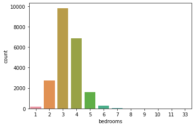

```python
import numpy as np
import pandas as pd
import matplotlib.pyplot as plt
import seaborn as sns
%matplotlib inline
```


```python
from google.colab import drive
```


```python
drive.mount('/content/drive')
```

    Mounted at /content/drive
    


```python
df = pd.read_csv('/content/drive/MyDrive/Colab Notebooks/DATA/kc_house_data.csv')
```


```python
df.head()
```


  <div id="df-c3721924-e579-41bd-b84c-59ea24b8214b">
    <div class="colab-df-container">
      <div>
<style scoped>
    .dataframe tbody tr th:only-of-type {
        vertical-align: middle;
    }

    .dataframe tbody tr th {
        vertical-align: top;
    }

    .dataframe thead th {
        text-align: right;
    }
</style>
<table border="1" class="dataframe">
  <thead>
    <tr style="text-align: right;">
      <th></th>
      <th>id</th>
      <th>date</th>
      <th>price</th>
      <th>bedrooms</th>
      <th>bathrooms</th>
      <th>sqft_living</th>
      <th>sqft_lot</th>
      <th>floors</th>
      <th>waterfront</th>
      <th>view</th>
      <th>...</th>
      <th>grade</th>
      <th>sqft_above</th>
      <th>sqft_basement</th>
      <th>yr_built</th>
      <th>yr_renovated</th>
      <th>zipcode</th>
      <th>lat</th>
      <th>long</th>
      <th>sqft_living15</th>
      <th>sqft_lot15</th>
    </tr>
  </thead>
  <tbody>
    <tr>
      <th>0</th>
      <td>7129300520</td>
      <td>10/13/2014</td>
      <td>221900.0</td>
      <td>3</td>
      <td>1.00</td>
      <td>1180</td>
      <td>5650</td>
      <td>1.0</td>
      <td>0</td>
      <td>0</td>
      <td>...</td>
      <td>7</td>
      <td>1180</td>
      <td>0</td>
      <td>1955</td>
      <td>0</td>
      <td>98178</td>
      <td>47.5112</td>
      <td>-122.257</td>
      <td>1340</td>
      <td>5650</td>
    </tr>
    <tr>
      <th>1</th>
      <td>6414100192</td>
      <td>12/9/2014</td>
      <td>538000.0</td>
      <td>3</td>
      <td>2.25</td>
      <td>2570</td>
      <td>7242</td>
      <td>2.0</td>
      <td>0</td>
      <td>0</td>
      <td>...</td>
      <td>7</td>
      <td>2170</td>
      <td>400</td>
      <td>1951</td>
      <td>1991</td>
      <td>98125</td>
      <td>47.7210</td>
      <td>-122.319</td>
      <td>1690</td>
      <td>7639</td>
    </tr>
    <tr>
      <th>2</th>
      <td>5631500400</td>
      <td>2/25/2015</td>
      <td>180000.0</td>
      <td>2</td>
      <td>1.00</td>
      <td>770</td>
      <td>10000</td>
      <td>1.0</td>
      <td>0</td>
      <td>0</td>
      <td>...</td>
      <td>6</td>
      <td>770</td>
      <td>0</td>
      <td>1933</td>
      <td>0</td>
      <td>98028</td>
      <td>47.7379</td>
      <td>-122.233</td>
      <td>2720</td>
      <td>8062</td>
    </tr>
    <tr>
      <th>3</th>
      <td>2487200875</td>
      <td>12/9/2014</td>
      <td>604000.0</td>
      <td>4</td>
      <td>3.00</td>
      <td>1960</td>
      <td>5000</td>
      <td>1.0</td>
      <td>0</td>
      <td>0</td>
      <td>...</td>
      <td>7</td>
      <td>1050</td>
      <td>910</td>
      <td>1965</td>
      <td>0</td>
      <td>98136</td>
      <td>47.5208</td>
      <td>-122.393</td>
      <td>1360</td>
      <td>5000</td>
    </tr>
    <tr>
      <th>4</th>
      <td>1954400510</td>
      <td>2/18/2015</td>
      <td>510000.0</td>
      <td>3</td>
      <td>2.00</td>
      <td>1680</td>
      <td>8080</td>
      <td>1.0</td>
      <td>0</td>
      <td>0</td>
      <td>...</td>
      <td>8</td>
      <td>1680</td>
      <td>0</td>
      <td>1987</td>
      <td>0</td>
      <td>98074</td>
      <td>47.6168</td>
      <td>-122.045</td>
      <td>1800</td>
      <td>7503</td>
    </tr>
  </tbody>
</table>
<p>5 rows × 21 columns</p>
</div>
      <button class="colab-df-convert" onclick="convertToInteractive('df-c3721924-e579-41bd-b84c-59ea24b8214b')"
              title="Convert this dataframe to an interactive table."
              style="display:none;">

  <svg xmlns="http://www.w3.org/2000/svg" height="24px"viewBox="0 0 24 24"
       width="24px">
    <path d="M0 0h24v24H0V0z" fill="none"/>
    <path d="M18.56 5.44l.94 2.06.94-2.06 2.06-.94-2.06-.94-.94-2.06-.94 2.06-2.06.94zm-11 1L8.5 8.5l.94-2.06 2.06-.94-2.06-.94L8.5 2.5l-.94 2.06-2.06.94zm10 10l.94 2.06.94-2.06 2.06-.94-2.06-.94-.94-2.06-.94 2.06-2.06.94z"/><path d="M17.41 7.96l-1.37-1.37c-.4-.4-.92-.59-1.43-.59-.52 0-1.04.2-1.43.59L10.3 9.45l-7.72 7.72c-.78.78-.78 2.05 0 2.83L4 21.41c.39.39.9.59 1.41.59.51 0 1.02-.2 1.41-.59l7.78-7.78 2.81-2.81c.8-.78.8-2.07 0-2.86zM5.41 20L4 18.59l7.72-7.72 1.47 1.35L5.41 20z"/>
  </svg>
      </button>

  <style>
    .colab-df-container {
      display:flex;
      flex-wrap:wrap;
      gap: 12px;
    }

    .colab-df-convert {
      background-color: #E8F0FE;
      border: none;
      border-radius: 50%;
      cursor: pointer;
      display: none;
      fill: #1967D2;
      height: 32px;
      padding: 0 0 0 0;
      width: 32px;
    }

    .colab-df-convert:hover {
      background-color: #E2EBFA;
      box-shadow: 0px 1px 2px rgba(60, 64, 67, 0.3), 0px 1px 3px 1px rgba(60, 64, 67, 0.15);
      fill: #174EA6;
    }

    [theme=dark] .colab-df-convert {
      background-color: #3B4455;
      fill: #D2E3FC;
    }

    [theme=dark] .colab-df-convert:hover {
      background-color: #434B5C;
      box-shadow: 0px 1px 3px 1px rgba(0, 0, 0, 0.15);
      filter: drop-shadow(0px 1px 2px rgba(0, 0, 0, 0.3));
      fill: #FFFFFF;
    }
  </style>

      <script>
        const buttonEl =
          document.querySelector('#df-c3721924-e579-41bd-b84c-59ea24b8214b button.colab-df-convert');
        buttonEl.style.display =
          google.colab.kernel.accessAllowed ? 'block' : 'none';

        async function convertToInteractive(key) {
          const element = document.querySelector('#df-c3721924-e579-41bd-b84c-59ea24b8214b');
          const dataTable =
            await google.colab.kernel.invokeFunction('convertToInteractive',
                                                     [key], {});
          if (!dataTable) return;

          const docLinkHtml = 'Like what you see? Visit the ' +
            '<a target="_blank" href=https://colab.research.google.com/notebooks/data_table.ipynb>data table notebook</a>'
            + ' to learn more about interactive tables.';
          element.innerHTML = '';
          dataTable['output_type'] = 'display_data';
          await google.colab.output.renderOutput(dataTable, element);
          const docLink = document.createElement('div');
          docLink.innerHTML = docLinkHtml;
          element.appendChild(docLink);
        }
      </script>
    </div>
  </div>


```python
df.isnull().sum()
```


    id               0
    date             0
    price            0
    bedrooms         0
    bathrooms        0
    sqft_living      0
    sqft_lot         0
    floors           0
    waterfront       0
    view             0
    condition        0
    grade            0
    sqft_above       0
    sqft_basement    0
    yr_built         0
    yr_renovated     0
    zipcode          0
    lat              0
    long             0
    sqft_living15    0
    sqft_lot15       0
    dtype: int64


```python
df.info()
```

    <class 'pandas.core.frame.DataFrame'>
    RangeIndex: 21597 entries, 0 to 21596
    Data columns (total 21 columns):
     #   Column         Non-Null Count  Dtype  
    ---  ------         --------------  -----  
     0   id             21597 non-null  int64  
     1   date           21597 non-null  object 
     2   price          21597 non-null  float64
     3   bedrooms       21597 non-null  int64  
     4   bathrooms      21597 non-null  float64
     5   sqft_living    21597 non-null  int64  
     6   sqft_lot       21597 non-null  int64  
     7   floors         21597 non-null  float64
     8   waterfront     21597 non-null  int64  
     9   view           21597 non-null  int64  
     10  condition      21597 non-null  int64  
     11  grade          21597 non-null  int64  
     12  sqft_above     21597 non-null  int64  
     13  sqft_basement  21597 non-null  int64  
     14  yr_built       21597 non-null  int64  
     15  yr_renovated   21597 non-null  int64  
     16  zipcode        21597 non-null  int64  
     17  lat            21597 non-null  float64
     18  long           21597 non-null  float64
     19  sqft_living15  21597 non-null  int64  
     20  sqft_lot15     21597 non-null  int64  
    dtypes: float64(5), int64(15), object(1)
    memory usage: 3.5+ MB
    


```python
df.describe()
```


  <div id="df-7fa3e505-9887-4d25-8e89-10cd9d36c271">
    <div class="colab-df-container">
      <div>
<style scoped>
    .dataframe tbody tr th:only-of-type {
        vertical-align: middle;
    }

    .dataframe tbody tr th {
        vertical-align: top;
    }

    .dataframe thead th {
        text-align: right;
    }
</style>
<table border="1" class="dataframe">
  <thead>
    <tr style="text-align: right;">
      <th></th>
      <th>id</th>
      <th>price</th>
      <th>bedrooms</th>
      <th>bathrooms</th>
      <th>sqft_living</th>
      <th>sqft_lot</th>
      <th>floors</th>
      <th>waterfront</th>
      <th>view</th>
      <th>condition</th>
      <th>grade</th>
      <th>sqft_above</th>
      <th>sqft_basement</th>
      <th>yr_built</th>
      <th>yr_renovated</th>
      <th>zipcode</th>
      <th>lat</th>
      <th>long</th>
      <th>sqft_living15</th>
      <th>sqft_lot15</th>
    </tr>
  </thead>
  <tbody>
    <tr>
      <th>count</th>
      <td>2.159700e+04</td>
      <td>2.159700e+04</td>
      <td>21597.000000</td>
      <td>21597.000000</td>
      <td>21597.000000</td>
      <td>2.159700e+04</td>
      <td>21597.000000</td>
      <td>21597.000000</td>
      <td>21597.000000</td>
      <td>21597.000000</td>
      <td>21597.000000</td>
      <td>21597.000000</td>
      <td>21597.000000</td>
      <td>21597.000000</td>
      <td>21597.000000</td>
      <td>21597.000000</td>
      <td>21597.000000</td>
      <td>21597.000000</td>
      <td>21597.000000</td>
      <td>21597.000000</td>
    </tr>
    <tr>
      <th>mean</th>
      <td>4.580474e+09</td>
      <td>5.402966e+05</td>
      <td>3.373200</td>
      <td>2.115826</td>
      <td>2080.321850</td>
      <td>1.509941e+04</td>
      <td>1.494096</td>
      <td>0.007547</td>
      <td>0.234292</td>
      <td>3.409825</td>
      <td>7.657915</td>
      <td>1788.596842</td>
      <td>291.725008</td>
      <td>1970.999676</td>
      <td>84.464787</td>
      <td>98077.951845</td>
      <td>47.560093</td>
      <td>-122.213982</td>
      <td>1986.620318</td>
      <td>12758.283512</td>
    </tr>
    <tr>
      <th>std</th>
      <td>2.876736e+09</td>
      <td>3.673681e+05</td>
      <td>0.926299</td>
      <td>0.768984</td>
      <td>918.106125</td>
      <td>4.141264e+04</td>
      <td>0.539683</td>
      <td>0.086549</td>
      <td>0.766390</td>
      <td>0.650546</td>
      <td>1.173200</td>
      <td>827.759761</td>
      <td>442.667800</td>
      <td>29.375234</td>
      <td>401.821438</td>
      <td>53.513072</td>
      <td>0.138552</td>
      <td>0.140724</td>
      <td>685.230472</td>
      <td>27274.441950</td>
    </tr>
    <tr>
      <th>min</th>
      <td>1.000102e+06</td>
      <td>7.800000e+04</td>
      <td>1.000000</td>
      <td>0.500000</td>
      <td>370.000000</td>
      <td>5.200000e+02</td>
      <td>1.000000</td>
      <td>0.000000</td>
      <td>0.000000</td>
      <td>1.000000</td>
      <td>3.000000</td>
      <td>370.000000</td>
      <td>0.000000</td>
      <td>1900.000000</td>
      <td>0.000000</td>
      <td>98001.000000</td>
      <td>47.155900</td>
      <td>-122.519000</td>
      <td>399.000000</td>
      <td>651.000000</td>
    </tr>
    <tr>
      <th>25%</th>
      <td>2.123049e+09</td>
      <td>3.220000e+05</td>
      <td>3.000000</td>
      <td>1.750000</td>
      <td>1430.000000</td>
      <td>5.040000e+03</td>
      <td>1.000000</td>
      <td>0.000000</td>
      <td>0.000000</td>
      <td>3.000000</td>
      <td>7.000000</td>
      <td>1190.000000</td>
      <td>0.000000</td>
      <td>1951.000000</td>
      <td>0.000000</td>
      <td>98033.000000</td>
      <td>47.471100</td>
      <td>-122.328000</td>
      <td>1490.000000</td>
      <td>5100.000000</td>
    </tr>
    <tr>
      <th>50%</th>
      <td>3.904930e+09</td>
      <td>4.500000e+05</td>
      <td>3.000000</td>
      <td>2.250000</td>
      <td>1910.000000</td>
      <td>7.618000e+03</td>
      <td>1.500000</td>
      <td>0.000000</td>
      <td>0.000000</td>
      <td>3.000000</td>
      <td>7.000000</td>
      <td>1560.000000</td>
      <td>0.000000</td>
      <td>1975.000000</td>
      <td>0.000000</td>
      <td>98065.000000</td>
      <td>47.571800</td>
      <td>-122.231000</td>
      <td>1840.000000</td>
      <td>7620.000000</td>
    </tr>
    <tr>
      <th>75%</th>
      <td>7.308900e+09</td>
      <td>6.450000e+05</td>
      <td>4.000000</td>
      <td>2.500000</td>
      <td>2550.000000</td>
      <td>1.068500e+04</td>
      <td>2.000000</td>
      <td>0.000000</td>
      <td>0.000000</td>
      <td>4.000000</td>
      <td>8.000000</td>
      <td>2210.000000</td>
      <td>560.000000</td>
      <td>1997.000000</td>
      <td>0.000000</td>
      <td>98118.000000</td>
      <td>47.678000</td>
      <td>-122.125000</td>
      <td>2360.000000</td>
      <td>10083.000000</td>
    </tr>
    <tr>
      <th>max</th>
      <td>9.900000e+09</td>
      <td>7.700000e+06</td>
      <td>33.000000</td>
      <td>8.000000</td>
      <td>13540.000000</td>
      <td>1.651359e+06</td>
      <td>3.500000</td>
      <td>1.000000</td>
      <td>4.000000</td>
      <td>5.000000</td>
      <td>13.000000</td>
      <td>9410.000000</td>
      <td>4820.000000</td>
      <td>2015.000000</td>
      <td>2015.000000</td>
      <td>98199.000000</td>
      <td>47.777600</td>
      <td>-121.315000</td>
      <td>6210.000000</td>
      <td>871200.000000</td>
    </tr>
  </tbody>
</table>
</div>
      <button class="colab-df-convert" onclick="convertToInteractive('df-7fa3e505-9887-4d25-8e89-10cd9d36c271')"
              title="Convert this dataframe to an interactive table."
              style="display:none;">

  <svg xmlns="http://www.w3.org/2000/svg" height="24px"viewBox="0 0 24 24"
       width="24px">
    <path d="M0 0h24v24H0V0z" fill="none"/>
    <path d="M18.56 5.44l.94 2.06.94-2.06 2.06-.94-2.06-.94-.94-2.06-.94 2.06-2.06.94zm-11 1L8.5 8.5l.94-2.06 2.06-.94-2.06-.94L8.5 2.5l-.94 2.06-2.06.94zm10 10l.94 2.06.94-2.06 2.06-.94-2.06-.94-.94-2.06-.94 2.06-2.06.94z"/><path d="M17.41 7.96l-1.37-1.37c-.4-.4-.92-.59-1.43-.59-.52 0-1.04.2-1.43.59L10.3 9.45l-7.72 7.72c-.78.78-.78 2.05 0 2.83L4 21.41c.39.39.9.59 1.41.59.51 0 1.02-.2 1.41-.59l7.78-7.78 2.81-2.81c.8-.78.8-2.07 0-2.86zM5.41 20L4 18.59l7.72-7.72 1.47 1.35L5.41 20z"/>
  </svg>
      </button>

  <style>
    .colab-df-container {
      display:flex;
      flex-wrap:wrap;
      gap: 12px;
    }

    .colab-df-convert {
      background-color: #E8F0FE;
      border: none;
      border-radius: 50%;
      cursor: pointer;
      display: none;
      fill: #1967D2;
      height: 32px;
      padding: 0 0 0 0;
      width: 32px;
    }

    .colab-df-convert:hover {
      background-color: #E2EBFA;
      box-shadow: 0px 1px 2px rgba(60, 64, 67, 0.3), 0px 1px 3px 1px rgba(60, 64, 67, 0.15);
      fill: #174EA6;
    }

    [theme=dark] .colab-df-convert {
      background-color: #3B4455;
      fill: #D2E3FC;
    }

    [theme=dark] .colab-df-convert:hover {
      background-color: #434B5C;
      box-shadow: 0px 1px 3px 1px rgba(0, 0, 0, 0.15);
      filter: drop-shadow(0px 1px 2px rgba(0, 0, 0, 0.3));
      fill: #FFFFFF;
    }
  </style>

      <script>
        const buttonEl =
          document.querySelector('#df-7fa3e505-9887-4d25-8e89-10cd9d36c271 button.colab-df-convert');
        buttonEl.style.display =
          google.colab.kernel.accessAllowed ? 'block' : 'none';

        async function convertToInteractive(key) {
          const element = document.querySelector('#df-7fa3e505-9887-4d25-8e89-10cd9d36c271');
          const dataTable =
            await google.colab.kernel.invokeFunction('convertToInteractive',
                                                     [key], {});
          if (!dataTable) return;

          const docLinkHtml = 'Like what you see? Visit the ' +
            '<a target="_blank" href=https://colab.research.google.com/notebooks/data_table.ipynb>data table notebook</a>'
            + ' to learn more about interactive tables.';
          element.innerHTML = '';
          dataTable['output_type'] = 'display_data';
          await google.colab.output.renderOutput(dataTable, element);
          const docLink = document.createElement('div');
          docLink.innerHTML = docLinkHtml;
          element.appendChild(docLink);
        }
      </script>
    </div>
  </div>


```python
df.describe().transpose() # change axis: row to column, column to row
```


  <div id="df-184de061-941e-4027-b222-0997cf8ac011">
    <div class="colab-df-container">
      <div>
<style scoped>
    .dataframe tbody tr th:only-of-type {
        vertical-align: middle;
    }

    .dataframe tbody tr th {
        vertical-align: top;
    }

    .dataframe thead th {
        text-align: right;
    }
</style>
<table border="1" class="dataframe">
  <thead>
    <tr style="text-align: right;">
      <th></th>
      <th>count</th>
      <th>mean</th>
      <th>std</th>
      <th>min</th>
      <th>25%</th>
      <th>50%</th>
      <th>75%</th>
      <th>max</th>
    </tr>
  </thead>
  <tbody>
    <tr>
      <th>id</th>
      <td>21597.0</td>
      <td>4.580474e+09</td>
      <td>2.876736e+09</td>
      <td>1.000102e+06</td>
      <td>2.123049e+09</td>
      <td>3.904930e+09</td>
      <td>7.308900e+09</td>
      <td>9.900000e+09</td>
    </tr>
    <tr>
      <th>price</th>
      <td>21597.0</td>
      <td>5.402966e+05</td>
      <td>3.673681e+05</td>
      <td>7.800000e+04</td>
      <td>3.220000e+05</td>
      <td>4.500000e+05</td>
      <td>6.450000e+05</td>
      <td>7.700000e+06</td>
    </tr>
    <tr>
      <th>bedrooms</th>
      <td>21597.0</td>
      <td>3.373200e+00</td>
      <td>9.262989e-01</td>
      <td>1.000000e+00</td>
      <td>3.000000e+00</td>
      <td>3.000000e+00</td>
      <td>4.000000e+00</td>
      <td>3.300000e+01</td>
    </tr>
    <tr>
      <th>bathrooms</th>
      <td>21597.0</td>
      <td>2.115826e+00</td>
      <td>7.689843e-01</td>
      <td>5.000000e-01</td>
      <td>1.750000e+00</td>
      <td>2.250000e+00</td>
      <td>2.500000e+00</td>
      <td>8.000000e+00</td>
    </tr>
    <tr>
      <th>sqft_living</th>
      <td>21597.0</td>
      <td>2.080322e+03</td>
      <td>9.181061e+02</td>
      <td>3.700000e+02</td>
      <td>1.430000e+03</td>
      <td>1.910000e+03</td>
      <td>2.550000e+03</td>
      <td>1.354000e+04</td>
    </tr>
    <tr>
      <th>sqft_lot</th>
      <td>21597.0</td>
      <td>1.509941e+04</td>
      <td>4.141264e+04</td>
      <td>5.200000e+02</td>
      <td>5.040000e+03</td>
      <td>7.618000e+03</td>
      <td>1.068500e+04</td>
      <td>1.651359e+06</td>
    </tr>
    <tr>
      <th>floors</th>
      <td>21597.0</td>
      <td>1.494096e+00</td>
      <td>5.396828e-01</td>
      <td>1.000000e+00</td>
      <td>1.000000e+00</td>
      <td>1.500000e+00</td>
      <td>2.000000e+00</td>
      <td>3.500000e+00</td>
    </tr>
    <tr>
      <th>waterfront</th>
      <td>21597.0</td>
      <td>7.547345e-03</td>
      <td>8.654900e-02</td>
      <td>0.000000e+00</td>
      <td>0.000000e+00</td>
      <td>0.000000e+00</td>
      <td>0.000000e+00</td>
      <td>1.000000e+00</td>
    </tr>
    <tr>
      <th>view</th>
      <td>21597.0</td>
      <td>2.342918e-01</td>
      <td>7.663898e-01</td>
      <td>0.000000e+00</td>
      <td>0.000000e+00</td>
      <td>0.000000e+00</td>
      <td>0.000000e+00</td>
      <td>4.000000e+00</td>
    </tr>
    <tr>
      <th>condition</th>
      <td>21597.0</td>
      <td>3.409825e+00</td>
      <td>6.505456e-01</td>
      <td>1.000000e+00</td>
      <td>3.000000e+00</td>
      <td>3.000000e+00</td>
      <td>4.000000e+00</td>
      <td>5.000000e+00</td>
    </tr>
    <tr>
      <th>grade</th>
      <td>21597.0</td>
      <td>7.657915e+00</td>
      <td>1.173200e+00</td>
      <td>3.000000e+00</td>
      <td>7.000000e+00</td>
      <td>7.000000e+00</td>
      <td>8.000000e+00</td>
      <td>1.300000e+01</td>
    </tr>
    <tr>
      <th>sqft_above</th>
      <td>21597.0</td>
      <td>1.788597e+03</td>
      <td>8.277598e+02</td>
      <td>3.700000e+02</td>
      <td>1.190000e+03</td>
      <td>1.560000e+03</td>
      <td>2.210000e+03</td>
      <td>9.410000e+03</td>
    </tr>
    <tr>
      <th>sqft_basement</th>
      <td>21597.0</td>
      <td>2.917250e+02</td>
      <td>4.426678e+02</td>
      <td>0.000000e+00</td>
      <td>0.000000e+00</td>
      <td>0.000000e+00</td>
      <td>5.600000e+02</td>
      <td>4.820000e+03</td>
    </tr>
    <tr>
      <th>yr_built</th>
      <td>21597.0</td>
      <td>1.971000e+03</td>
      <td>2.937523e+01</td>
      <td>1.900000e+03</td>
      <td>1.951000e+03</td>
      <td>1.975000e+03</td>
      <td>1.997000e+03</td>
      <td>2.015000e+03</td>
    </tr>
    <tr>
      <th>yr_renovated</th>
      <td>21597.0</td>
      <td>8.446479e+01</td>
      <td>4.018214e+02</td>
      <td>0.000000e+00</td>
      <td>0.000000e+00</td>
      <td>0.000000e+00</td>
      <td>0.000000e+00</td>
      <td>2.015000e+03</td>
    </tr>
    <tr>
      <th>zipcode</th>
      <td>21597.0</td>
      <td>9.807795e+04</td>
      <td>5.351307e+01</td>
      <td>9.800100e+04</td>
      <td>9.803300e+04</td>
      <td>9.806500e+04</td>
      <td>9.811800e+04</td>
      <td>9.819900e+04</td>
    </tr>
    <tr>
      <th>lat</th>
      <td>21597.0</td>
      <td>4.756009e+01</td>
      <td>1.385518e-01</td>
      <td>4.715590e+01</td>
      <td>4.747110e+01</td>
      <td>4.757180e+01</td>
      <td>4.767800e+01</td>
      <td>4.777760e+01</td>
    </tr>
    <tr>
      <th>long</th>
      <td>21597.0</td>
      <td>-1.222140e+02</td>
      <td>1.407235e-01</td>
      <td>-1.225190e+02</td>
      <td>-1.223280e+02</td>
      <td>-1.222310e+02</td>
      <td>-1.221250e+02</td>
      <td>-1.213150e+02</td>
    </tr>
    <tr>
      <th>sqft_living15</th>
      <td>21597.0</td>
      <td>1.986620e+03</td>
      <td>6.852305e+02</td>
      <td>3.990000e+02</td>
      <td>1.490000e+03</td>
      <td>1.840000e+03</td>
      <td>2.360000e+03</td>
      <td>6.210000e+03</td>
    </tr>
    <tr>
      <th>sqft_lot15</th>
      <td>21597.0</td>
      <td>1.275828e+04</td>
      <td>2.727444e+04</td>
      <td>6.510000e+02</td>
      <td>5.100000e+03</td>
      <td>7.620000e+03</td>
      <td>1.008300e+04</td>
      <td>8.712000e+05</td>
    </tr>
  </tbody>
</table>
</div>
      <button class="colab-df-convert" onclick="convertToInteractive('df-184de061-941e-4027-b222-0997cf8ac011')"
              title="Convert this dataframe to an interactive table."
              style="display:none;">

  <svg xmlns="http://www.w3.org/2000/svg" height="24px"viewBox="0 0 24 24"
       width="24px">
    <path d="M0 0h24v24H0V0z" fill="none"/>
    <path d="M18.56 5.44l.94 2.06.94-2.06 2.06-.94-2.06-.94-.94-2.06-.94 2.06-2.06.94zm-11 1L8.5 8.5l.94-2.06 2.06-.94-2.06-.94L8.5 2.5l-.94 2.06-2.06.94zm10 10l.94 2.06.94-2.06 2.06-.94-2.06-.94-.94-2.06-.94 2.06-2.06.94z"/><path d="M17.41 7.96l-1.37-1.37c-.4-.4-.92-.59-1.43-.59-.52 0-1.04.2-1.43.59L10.3 9.45l-7.72 7.72c-.78.78-.78 2.05 0 2.83L4 21.41c.39.39.9.59 1.41.59.51 0 1.02-.2 1.41-.59l7.78-7.78 2.81-2.81c.8-.78.8-2.07 0-2.86zM5.41 20L4 18.59l7.72-7.72 1.47 1.35L5.41 20z"/>
  </svg>
      </button>

  <style>
    .colab-df-container {
      display:flex;
      flex-wrap:wrap;
      gap: 12px;
    }

    .colab-df-convert {
      background-color: #E8F0FE;
      border: none;
      border-radius: 50%;
      cursor: pointer;
      display: none;
      fill: #1967D2;
      height: 32px;
      padding: 0 0 0 0;
      width: 32px;
    }

    .colab-df-convert:hover {
      background-color: #E2EBFA;
      box-shadow: 0px 1px 2px rgba(60, 64, 67, 0.3), 0px 1px 3px 1px rgba(60, 64, 67, 0.15);
      fill: #174EA6;
    }

    [theme=dark] .colab-df-convert {
      background-color: #3B4455;
      fill: #D2E3FC;
    }

    [theme=dark] .colab-df-convert:hover {
      background-color: #434B5C;
      box-shadow: 0px 1px 3px 1px rgba(0, 0, 0, 0.15);
      filter: drop-shadow(0px 1px 2px rgba(0, 0, 0, 0.3));
      fill: #FFFFFF;
    }
  </style>

      <script>
        const buttonEl =
          document.querySelector('#df-184de061-941e-4027-b222-0997cf8ac011 button.colab-df-convert');
        buttonEl.style.display =
          google.colab.kernel.accessAllowed ? 'block' : 'none';

        async function convertToInteractive(key) {
          const element = document.querySelector('#df-184de061-941e-4027-b222-0997cf8ac011');
          const dataTable =
            await google.colab.kernel.invokeFunction('convertToInteractive',
                                                     [key], {});
          if (!dataTable) return;

          const docLinkHtml = 'Like what you see? Visit the ' +
            '<a target="_blank" href=https://colab.research.google.com/notebooks/data_table.ipynb>data table notebook</a>'
            + ' to learn more about interactive tables.';
          element.innerHTML = '';
          dataTable['output_type'] = 'display_data';
          await google.colab.output.renderOutput(dataTable, element);
          const docLink = document.createElement('div');
          docLink.innerHTML = docLinkHtml;
          element.appendChild(docLink);
        }
      </script>
    </div>
  </div>


```python
plt.figure(figsize=(10,6))
sns.histplot(df['price'], kde=True, bins=50)
# need drop outliers to remove extream cases
```


    <matplotlib.axes._subplots.AxesSubplot at 0x7f5db6a1e990>


    

    


```python
sns.countplot(df['bedrooms'])
```

    /usr/local/lib/python3.7/dist-packages/seaborn/_decorators.py:43: FutureWarning: Pass the following variable as a keyword arg: x. From version 0.12, the only valid positional argument will be `data`, and passing other arguments without an explicit keyword will result in an error or misinterpretation.
      FutureWarning
    


    <matplotlib.axes._subplots.AxesSubplot at 0x7f5db40c3090>


    

    


```python
df.corr()
```


  <div id="df-a7463044-c3cf-433c-94a0-7b23300e0ca6">
    <div class="colab-df-container">
      <div>
<style scoped>
    .dataframe tbody tr th:only-of-type {
        vertical-align: middle;
    }

    .dataframe tbody tr th {
        vertical-align: top;
    }

    .dataframe thead th {
        text-align: right;
    }
</style>
<table border="1" class="dataframe">
  <thead>
    <tr style="text-align: right;">
      <th></th>
      <th>id</th>
      <th>price</th>
      <th>bedrooms</th>
      <th>bathrooms</th>
      <th>sqft_living</th>
      <th>sqft_lot</th>
      <th>floors</th>
      <th>waterfront</th>
      <th>view</th>
      <th>condition</th>
      <th>grade</th>
      <th>sqft_above</th>
      <th>sqft_basement</th>
      <th>yr_built</th>
      <th>yr_renovated</th>
      <th>zipcode</th>
      <th>lat</th>
      <th>long</th>
      <th>sqft_living15</th>
      <th>sqft_lot15</th>
    </tr>
  </thead>
  <tbody>
    <tr>
      <th>id</th>
      <td>1.000000</td>
      <td>-0.016772</td>
      <td>0.001150</td>
      <td>0.005162</td>
      <td>-0.012241</td>
      <td>-0.131911</td>
      <td>0.018608</td>
      <td>-0.002727</td>
      <td>0.011536</td>
      <td>-0.023803</td>
      <td>0.008188</td>
      <td>-0.010799</td>
      <td>-0.005193</td>
      <td>0.021617</td>
      <td>-0.016925</td>
      <td>-0.008211</td>
      <td>-0.001798</td>
      <td>0.020672</td>
      <td>-0.002701</td>
      <td>-0.138557</td>
    </tr>
    <tr>
      <th>price</th>
      <td>-0.016772</td>
      <td>1.000000</td>
      <td>0.308787</td>
      <td>0.525906</td>
      <td>0.701917</td>
      <td>0.089876</td>
      <td>0.256804</td>
      <td>0.266398</td>
      <td>0.397370</td>
      <td>0.036056</td>
      <td>0.667951</td>
      <td>0.605368</td>
      <td>0.323799</td>
      <td>0.053953</td>
      <td>0.126424</td>
      <td>-0.053402</td>
      <td>0.306692</td>
      <td>0.022036</td>
      <td>0.585241</td>
      <td>0.082845</td>
    </tr>
    <tr>
      <th>bedrooms</th>
      <td>0.001150</td>
      <td>0.308787</td>
      <td>1.000000</td>
      <td>0.514508</td>
      <td>0.578212</td>
      <td>0.032471</td>
      <td>0.177944</td>
      <td>-0.006834</td>
      <td>0.080008</td>
      <td>0.026496</td>
      <td>0.356563</td>
      <td>0.479386</td>
      <td>0.302808</td>
      <td>0.155670</td>
      <td>0.018389</td>
      <td>-0.154092</td>
      <td>-0.009951</td>
      <td>0.132054</td>
      <td>0.393406</td>
      <td>0.030690</td>
    </tr>
    <tr>
      <th>bathrooms</th>
      <td>0.005162</td>
      <td>0.525906</td>
      <td>0.514508</td>
      <td>1.000000</td>
      <td>0.755758</td>
      <td>0.088373</td>
      <td>0.502582</td>
      <td>0.063744</td>
      <td>0.188386</td>
      <td>-0.126479</td>
      <td>0.665838</td>
      <td>0.686668</td>
      <td>0.283440</td>
      <td>0.507173</td>
      <td>0.050544</td>
      <td>-0.204786</td>
      <td>0.024280</td>
      <td>0.224903</td>
      <td>0.569884</td>
      <td>0.088303</td>
    </tr>
    <tr>
      <th>sqft_living</th>
      <td>-0.012241</td>
      <td>0.701917</td>
      <td>0.578212</td>
      <td>0.755758</td>
      <td>1.000000</td>
      <td>0.173453</td>
      <td>0.353953</td>
      <td>0.103854</td>
      <td>0.284709</td>
      <td>-0.059445</td>
      <td>0.762779</td>
      <td>0.876448</td>
      <td>0.435130</td>
      <td>0.318152</td>
      <td>0.055308</td>
      <td>-0.199802</td>
      <td>0.052155</td>
      <td>0.241214</td>
      <td>0.756402</td>
      <td>0.184342</td>
    </tr>
    <tr>
      <th>sqft_lot</th>
      <td>-0.131911</td>
      <td>0.089876</td>
      <td>0.032471</td>
      <td>0.088373</td>
      <td>0.173453</td>
      <td>1.000000</td>
      <td>-0.004814</td>
      <td>0.021632</td>
      <td>0.074900</td>
      <td>-0.008830</td>
      <td>0.114731</td>
      <td>0.184139</td>
      <td>0.015418</td>
      <td>0.052946</td>
      <td>0.007686</td>
      <td>-0.129586</td>
      <td>-0.085514</td>
      <td>0.230227</td>
      <td>0.144763</td>
      <td>0.718204</td>
    </tr>
    <tr>
      <th>floors</th>
      <td>0.018608</td>
      <td>0.256804</td>
      <td>0.177944</td>
      <td>0.502582</td>
      <td>0.353953</td>
      <td>-0.004814</td>
      <td>1.000000</td>
      <td>0.023755</td>
      <td>0.028814</td>
      <td>-0.264075</td>
      <td>0.458794</td>
      <td>0.523989</td>
      <td>-0.245715</td>
      <td>0.489193</td>
      <td>0.006427</td>
      <td>-0.059541</td>
      <td>0.049239</td>
      <td>0.125943</td>
      <td>0.280102</td>
      <td>-0.010722</td>
    </tr>
    <tr>
      <th>waterfront</th>
      <td>-0.002727</td>
      <td>0.266398</td>
      <td>-0.006834</td>
      <td>0.063744</td>
      <td>0.103854</td>
      <td>0.021632</td>
      <td>0.023755</td>
      <td>1.000000</td>
      <td>0.401971</td>
      <td>0.016611</td>
      <td>0.082888</td>
      <td>0.072109</td>
      <td>0.080559</td>
      <td>-0.026153</td>
      <td>0.092873</td>
      <td>0.030272</td>
      <td>-0.014306</td>
      <td>-0.041904</td>
      <td>0.086507</td>
      <td>0.030781</td>
    </tr>
    <tr>
      <th>view</th>
      <td>0.011536</td>
      <td>0.397370</td>
      <td>0.080008</td>
      <td>0.188386</td>
      <td>0.284709</td>
      <td>0.074900</td>
      <td>0.028814</td>
      <td>0.401971</td>
      <td>1.000000</td>
      <td>0.045999</td>
      <td>0.251728</td>
      <td>0.167609</td>
      <td>0.277078</td>
      <td>-0.053636</td>
      <td>0.103951</td>
      <td>0.084622</td>
      <td>0.005871</td>
      <td>-0.078107</td>
      <td>0.280681</td>
      <td>0.072904</td>
    </tr>
    <tr>
      <th>condition</th>
      <td>-0.023803</td>
      <td>0.036056</td>
      <td>0.026496</td>
      <td>-0.126479</td>
      <td>-0.059445</td>
      <td>-0.008830</td>
      <td>-0.264075</td>
      <td>0.016611</td>
      <td>0.045999</td>
      <td>1.000000</td>
      <td>-0.146896</td>
      <td>-0.158904</td>
      <td>0.173849</td>
      <td>-0.361592</td>
      <td>-0.060788</td>
      <td>0.002888</td>
      <td>-0.015102</td>
      <td>-0.105877</td>
      <td>-0.093072</td>
      <td>-0.003126</td>
    </tr>
    <tr>
      <th>grade</th>
      <td>0.008188</td>
      <td>0.667951</td>
      <td>0.356563</td>
      <td>0.665838</td>
      <td>0.762779</td>
      <td>0.114731</td>
      <td>0.458794</td>
      <td>0.082888</td>
      <td>0.251728</td>
      <td>-0.146896</td>
      <td>1.000000</td>
      <td>0.756073</td>
      <td>0.168220</td>
      <td>0.447865</td>
      <td>0.014261</td>
      <td>-0.185771</td>
      <td>0.113575</td>
      <td>0.200341</td>
      <td>0.713867</td>
      <td>0.120981</td>
    </tr>
    <tr>
      <th>sqft_above</th>
      <td>-0.010799</td>
      <td>0.605368</td>
      <td>0.479386</td>
      <td>0.686668</td>
      <td>0.876448</td>
      <td>0.184139</td>
      <td>0.523989</td>
      <td>0.072109</td>
      <td>0.167609</td>
      <td>-0.158904</td>
      <td>0.756073</td>
      <td>1.000000</td>
      <td>-0.052156</td>
      <td>0.424037</td>
      <td>0.023251</td>
      <td>-0.261570</td>
      <td>-0.001199</td>
      <td>0.344842</td>
      <td>0.731767</td>
      <td>0.195077</td>
    </tr>
    <tr>
      <th>sqft_basement</th>
      <td>-0.005193</td>
      <td>0.323799</td>
      <td>0.302808</td>
      <td>0.283440</td>
      <td>0.435130</td>
      <td>0.015418</td>
      <td>-0.245715</td>
      <td>0.080559</td>
      <td>0.277078</td>
      <td>0.173849</td>
      <td>0.168220</td>
      <td>-0.052156</td>
      <td>1.000000</td>
      <td>-0.133064</td>
      <td>0.071233</td>
      <td>0.074725</td>
      <td>0.110414</td>
      <td>-0.144546</td>
      <td>0.200443</td>
      <td>0.017550</td>
    </tr>
    <tr>
      <th>yr_built</th>
      <td>0.021617</td>
      <td>0.053953</td>
      <td>0.155670</td>
      <td>0.507173</td>
      <td>0.318152</td>
      <td>0.052946</td>
      <td>0.489193</td>
      <td>-0.026153</td>
      <td>-0.053636</td>
      <td>-0.361592</td>
      <td>0.447865</td>
      <td>0.424037</td>
      <td>-0.133064</td>
      <td>1.000000</td>
      <td>-0.224907</td>
      <td>-0.347210</td>
      <td>-0.148370</td>
      <td>0.409993</td>
      <td>0.326377</td>
      <td>0.070777</td>
    </tr>
    <tr>
      <th>yr_renovated</th>
      <td>-0.016925</td>
      <td>0.126424</td>
      <td>0.018389</td>
      <td>0.050544</td>
      <td>0.055308</td>
      <td>0.007686</td>
      <td>0.006427</td>
      <td>0.092873</td>
      <td>0.103951</td>
      <td>-0.060788</td>
      <td>0.014261</td>
      <td>0.023251</td>
      <td>0.071233</td>
      <td>-0.224907</td>
      <td>1.000000</td>
      <td>0.064325</td>
      <td>0.029350</td>
      <td>-0.068321</td>
      <td>-0.002695</td>
      <td>0.007944</td>
    </tr>
    <tr>
      <th>zipcode</th>
      <td>-0.008211</td>
      <td>-0.053402</td>
      <td>-0.154092</td>
      <td>-0.204786</td>
      <td>-0.199802</td>
      <td>-0.129586</td>
      <td>-0.059541</td>
      <td>0.030272</td>
      <td>0.084622</td>
      <td>0.002888</td>
      <td>-0.185771</td>
      <td>-0.261570</td>
      <td>0.074725</td>
      <td>-0.347210</td>
      <td>0.064325</td>
      <td>1.000000</td>
      <td>0.266742</td>
      <td>-0.564259</td>
      <td>-0.279299</td>
      <td>-0.147294</td>
    </tr>
    <tr>
      <th>lat</th>
      <td>-0.001798</td>
      <td>0.306692</td>
      <td>-0.009951</td>
      <td>0.024280</td>
      <td>0.052155</td>
      <td>-0.085514</td>
      <td>0.049239</td>
      <td>-0.014306</td>
      <td>0.005871</td>
      <td>-0.015102</td>
      <td>0.113575</td>
      <td>-0.001199</td>
      <td>0.110414</td>
      <td>-0.148370</td>
      <td>0.029350</td>
      <td>0.266742</td>
      <td>1.000000</td>
      <td>-0.135371</td>
      <td>0.048679</td>
      <td>-0.086139</td>
    </tr>
    <tr>
      <th>long</th>
      <td>0.020672</td>
      <td>0.022036</td>
      <td>0.132054</td>
      <td>0.224903</td>
      <td>0.241214</td>
      <td>0.230227</td>
      <td>0.125943</td>
      <td>-0.041904</td>
      <td>-0.078107</td>
      <td>-0.105877</td>
      <td>0.200341</td>
      <td>0.344842</td>
      <td>-0.144546</td>
      <td>0.409993</td>
      <td>-0.068321</td>
      <td>-0.564259</td>
      <td>-0.135371</td>
      <td>1.000000</td>
      <td>0.335626</td>
      <td>0.255586</td>
    </tr>
    <tr>
      <th>sqft_living15</th>
      <td>-0.002701</td>
      <td>0.585241</td>
      <td>0.393406</td>
      <td>0.569884</td>
      <td>0.756402</td>
      <td>0.144763</td>
      <td>0.280102</td>
      <td>0.086507</td>
      <td>0.280681</td>
      <td>-0.093072</td>
      <td>0.713867</td>
      <td>0.731767</td>
      <td>0.200443</td>
      <td>0.326377</td>
      <td>-0.002695</td>
      <td>-0.279299</td>
      <td>0.048679</td>
      <td>0.335626</td>
      <td>1.000000</td>
      <td>0.183515</td>
    </tr>
    <tr>
      <th>sqft_lot15</th>
      <td>-0.138557</td>
      <td>0.082845</td>
      <td>0.030690</td>
      <td>0.088303</td>
      <td>0.184342</td>
      <td>0.718204</td>
      <td>-0.010722</td>
      <td>0.030781</td>
      <td>0.072904</td>
      <td>-0.003126</td>
      <td>0.120981</td>
      <td>0.195077</td>
      <td>0.017550</td>
      <td>0.070777</td>
      <td>0.007944</td>
      <td>-0.147294</td>
      <td>-0.086139</td>
      <td>0.255586</td>
      <td>0.183515</td>
      <td>1.000000</td>
    </tr>
  </tbody>
</table>
</div>
      <button class="colab-df-convert" onclick="convertToInteractive('df-a7463044-c3cf-433c-94a0-7b23300e0ca6')"
              title="Convert this dataframe to an interactive table."
              style="display:none;">

  <svg xmlns="http://www.w3.org/2000/svg" height="24px"viewBox="0 0 24 24"
       width="24px">
    <path d="M0 0h24v24H0V0z" fill="none"/>
    <path d="M18.56 5.44l.94 2.06.94-2.06 2.06-.94-2.06-.94-.94-2.06-.94 2.06-2.06.94zm-11 1L8.5 8.5l.94-2.06 2.06-.94-2.06-.94L8.5 2.5l-.94 2.06-2.06.94zm10 10l.94 2.06.94-2.06 2.06-.94-2.06-.94-.94-2.06-.94 2.06-2.06.94z"/><path d="M17.41 7.96l-1.37-1.37c-.4-.4-.92-.59-1.43-.59-.52 0-1.04.2-1.43.59L10.3 9.45l-7.72 7.72c-.78.78-.78 2.05 0 2.83L4 21.41c.39.39.9.59 1.41.59.51 0 1.02-.2 1.41-.59l7.78-7.78 2.81-2.81c.8-.78.8-2.07 0-2.86zM5.41 20L4 18.59l7.72-7.72 1.47 1.35L5.41 20z"/>
  </svg>
      </button>

  <style>
    .colab-df-container {
      display:flex;
      flex-wrap:wrap;
      gap: 12px;
    }

    .colab-df-convert {
      background-color: #E8F0FE;
      border: none;
      border-radius: 50%;
      cursor: pointer;
      display: none;
      fill: #1967D2;
      height: 32px;
      padding: 0 0 0 0;
      width: 32px;
    }

    .colab-df-convert:hover {
      background-color: #E2EBFA;
      box-shadow: 0px 1px 2px rgba(60, 64, 67, 0.3), 0px 1px 3px 1px rgba(60, 64, 67, 0.15);
      fill: #174EA6;
    }

    [theme=dark] .colab-df-convert {
      background-color: #3B4455;
      fill: #D2E3FC;
    }

    [theme=dark] .colab-df-convert:hover {
      background-color: #434B5C;
      box-shadow: 0px 1px 3px 1px rgba(0, 0, 0, 0.15);
      filter: drop-shadow(0px 1px 2px rgba(0, 0, 0, 0.3));
      fill: #FFFFFF;
    }
  </style>

      <script>
        const buttonEl =
          document.querySelector('#df-a7463044-c3cf-433c-94a0-7b23300e0ca6 button.colab-df-convert');
        buttonEl.style.display =
          google.colab.kernel.accessAllowed ? 'block' : 'none';

        async function convertToInteractive(key) {
          const element = document.querySelector('#df-a7463044-c3cf-433c-94a0-7b23300e0ca6');
          const dataTable =
            await google.colab.kernel.invokeFunction('convertToInteractive',
                                                     [key], {});
          if (!dataTable) return;

          const docLinkHtml = 'Like what you see? Visit the ' +
            '<a target="_blank" href=https://colab.research.google.com/notebooks/data_table.ipynb>data table notebook</a>'
            + ' to learn more about interactive tables.';
          element.innerHTML = '';
          dataTable['output_type'] = 'display_data';
          await google.colab.output.renderOutput(dataTable, element);
          const docLink = document.createElement('div');
          docLink.innerHTML = docLinkHtml;
          element.appendChild(docLink);
        }
      </script>
    </div>
  </div>


```python
df.corr()['price'].sort_values()
```


    zipcode         -0.053402
    id              -0.016772
    long             0.022036
    condition        0.036056
    yr_built         0.053953
    sqft_lot15       0.082845
    sqft_lot         0.089876
    yr_renovated     0.126424
    floors           0.256804
    waterfront       0.266398
    lat              0.306692
    bedrooms         0.308787
    sqft_basement    0.323799
    view             0.397370
    bathrooms        0.525906
    sqft_living15    0.585241
    sqft_above       0.605368
    grade            0.667951
    sqft_living      0.701917
    price            1.000000
    Name: price, dtype: float64


```python
plt.figure(figsize=(10,5))
sns.scatterplot(x='price', y='sqft_living', data=df) # sqrt: square feet
```


    <matplotlib.axes._subplots.AxesSubplot at 0x7f5db3bb80d0>


    

    


```python
plt.figure(figsize=(10,6))
sns.boxplot(x='bedrooms', y='price', data=df)
```


    <matplotlib.axes._subplots.AxesSubplot at 0x7f5db3acbed0>


    

    


```python
df.columns
```


    Index(['id', 'date', 'price', 'bedrooms', 'bathrooms', 'sqft_living',
           'sqft_lot', 'floors', 'waterfront', 'view', 'condition', 'grade',
           'sqft_above', 'sqft_basement', 'yr_built', 'yr_renovated', 'zipcode',
           'lat', 'long', 'sqft_living15', 'sqft_lot15'],
          dtype='object')


```python
plt.figure(figsize=(10,6))
sns.scatterplot(x='price', y='long', data=df)
```


    <matplotlib.axes._subplots.AxesSubplot at 0x7f5db3956d90>


    

    


```python
plt.figure(figsize=(10,6))
sns.scatterplot(x='price', y='lat', data=df)
```


    <matplotlib.axes._subplots.AxesSubplot at 0x7f5db3aff790>


    

    


```python
plt.figure(figsize=(12,8))
sns.scatterplot(x='long', y='lat', data=df)
```


    <matplotlib.axes._subplots.AxesSubplot at 0x7f5db3956e50>


    

    


```python
plt.figure(figsize=(12,8))
sns.scatterplot(x='long', y='lat', hue='price', data=df)
```


    <matplotlib.axes._subplots.AxesSubplot at 0x7f5db1fc1050>


    

    


```python
df.sort_values('price', ascending=False).head(20)
```


  <div id="df-7e6ed8e3-3bc1-4219-bc5a-3d175c69e7bc">
    <div class="colab-df-container">
      <div>
<style scoped>
    .dataframe tbody tr th:only-of-type {
        vertical-align: middle;
    }

    .dataframe tbody tr th {
        vertical-align: top;
    }

    .dataframe thead th {
        text-align: right;
    }
</style>
<table border="1" class="dataframe">
  <thead>
    <tr style="text-align: right;">
      <th></th>
      <th>id</th>
      <th>date</th>
      <th>price</th>
      <th>bedrooms</th>
      <th>bathrooms</th>
      <th>sqft_living</th>
      <th>sqft_lot</th>
      <th>floors</th>
      <th>waterfront</th>
      <th>view</th>
      <th>...</th>
      <th>grade</th>
      <th>sqft_above</th>
      <th>sqft_basement</th>
      <th>yr_built</th>
      <th>yr_renovated</th>
      <th>zipcode</th>
      <th>lat</th>
      <th>long</th>
      <th>sqft_living15</th>
      <th>sqft_lot15</th>
    </tr>
  </thead>
  <tbody>
    <tr>
      <th>7245</th>
      <td>6762700020</td>
      <td>10/13/2014</td>
      <td>7700000.0</td>
      <td>6</td>
      <td>8.00</td>
      <td>12050</td>
      <td>27600</td>
      <td>2.5</td>
      <td>0</td>
      <td>3</td>
      <td>...</td>
      <td>13</td>
      <td>8570</td>
      <td>3480</td>
      <td>1910</td>
      <td>1987</td>
      <td>98102</td>
      <td>47.6298</td>
      <td>-122.323</td>
      <td>3940</td>
      <td>8800</td>
    </tr>
    <tr>
      <th>3910</th>
      <td>9808700762</td>
      <td>6/11/2014</td>
      <td>7060000.0</td>
      <td>5</td>
      <td>4.50</td>
      <td>10040</td>
      <td>37325</td>
      <td>2.0</td>
      <td>1</td>
      <td>2</td>
      <td>...</td>
      <td>11</td>
      <td>7680</td>
      <td>2360</td>
      <td>1940</td>
      <td>2001</td>
      <td>98004</td>
      <td>47.6500</td>
      <td>-122.214</td>
      <td>3930</td>
      <td>25449</td>
    </tr>
    <tr>
      <th>9245</th>
      <td>9208900037</td>
      <td>9/19/2014</td>
      <td>6890000.0</td>
      <td>6</td>
      <td>7.75</td>
      <td>9890</td>
      <td>31374</td>
      <td>2.0</td>
      <td>0</td>
      <td>4</td>
      <td>...</td>
      <td>13</td>
      <td>8860</td>
      <td>1030</td>
      <td>2001</td>
      <td>0</td>
      <td>98039</td>
      <td>47.6305</td>
      <td>-122.240</td>
      <td>4540</td>
      <td>42730</td>
    </tr>
    <tr>
      <th>4407</th>
      <td>2470100110</td>
      <td>8/4/2014</td>
      <td>5570000.0</td>
      <td>5</td>
      <td>5.75</td>
      <td>9200</td>
      <td>35069</td>
      <td>2.0</td>
      <td>0</td>
      <td>0</td>
      <td>...</td>
      <td>13</td>
      <td>6200</td>
      <td>3000</td>
      <td>2001</td>
      <td>0</td>
      <td>98039</td>
      <td>47.6289</td>
      <td>-122.233</td>
      <td>3560</td>
      <td>24345</td>
    </tr>
    <tr>
      <th>1446</th>
      <td>8907500070</td>
      <td>4/13/2015</td>
      <td>5350000.0</td>
      <td>5</td>
      <td>5.00</td>
      <td>8000</td>
      <td>23985</td>
      <td>2.0</td>
      <td>0</td>
      <td>4</td>
      <td>...</td>
      <td>12</td>
      <td>6720</td>
      <td>1280</td>
      <td>2009</td>
      <td>0</td>
      <td>98004</td>
      <td>47.6232</td>
      <td>-122.220</td>
      <td>4600</td>
      <td>21750</td>
    </tr>
    <tr>
      <th>1313</th>
      <td>7558700030</td>
      <td>4/13/2015</td>
      <td>5300000.0</td>
      <td>6</td>
      <td>6.00</td>
      <td>7390</td>
      <td>24829</td>
      <td>2.0</td>
      <td>1</td>
      <td>4</td>
      <td>...</td>
      <td>12</td>
      <td>5000</td>
      <td>2390</td>
      <td>1991</td>
      <td>0</td>
      <td>98040</td>
      <td>47.5631</td>
      <td>-122.210</td>
      <td>4320</td>
      <td>24619</td>
    </tr>
    <tr>
      <th>1162</th>
      <td>1247600105</td>
      <td>10/20/2014</td>
      <td>5110000.0</td>
      <td>5</td>
      <td>5.25</td>
      <td>8010</td>
      <td>45517</td>
      <td>2.0</td>
      <td>1</td>
      <td>4</td>
      <td>...</td>
      <td>12</td>
      <td>5990</td>
      <td>2020</td>
      <td>1999</td>
      <td>0</td>
      <td>98033</td>
      <td>47.6767</td>
      <td>-122.211</td>
      <td>3430</td>
      <td>26788</td>
    </tr>
    <tr>
      <th>8085</th>
      <td>1924059029</td>
      <td>6/17/2014</td>
      <td>4670000.0</td>
      <td>5</td>
      <td>6.75</td>
      <td>9640</td>
      <td>13068</td>
      <td>1.0</td>
      <td>1</td>
      <td>4</td>
      <td>...</td>
      <td>12</td>
      <td>4820</td>
      <td>4820</td>
      <td>1983</td>
      <td>2009</td>
      <td>98040</td>
      <td>47.5570</td>
      <td>-122.210</td>
      <td>3270</td>
      <td>10454</td>
    </tr>
    <tr>
      <th>2624</th>
      <td>7738500731</td>
      <td>8/15/2014</td>
      <td>4500000.0</td>
      <td>5</td>
      <td>5.50</td>
      <td>6640</td>
      <td>40014</td>
      <td>2.0</td>
      <td>1</td>
      <td>4</td>
      <td>...</td>
      <td>12</td>
      <td>6350</td>
      <td>290</td>
      <td>2004</td>
      <td>0</td>
      <td>98155</td>
      <td>47.7493</td>
      <td>-122.280</td>
      <td>3030</td>
      <td>23408</td>
    </tr>
    <tr>
      <th>8629</th>
      <td>3835500195</td>
      <td>6/18/2014</td>
      <td>4490000.0</td>
      <td>4</td>
      <td>3.00</td>
      <td>6430</td>
      <td>27517</td>
      <td>2.0</td>
      <td>0</td>
      <td>0</td>
      <td>...</td>
      <td>12</td>
      <td>6430</td>
      <td>0</td>
      <td>2001</td>
      <td>0</td>
      <td>98004</td>
      <td>47.6208</td>
      <td>-122.219</td>
      <td>3720</td>
      <td>14592</td>
    </tr>
    <tr>
      <th>12358</th>
      <td>6065300370</td>
      <td>5/6/2015</td>
      <td>4210000.0</td>
      <td>5</td>
      <td>6.00</td>
      <td>7440</td>
      <td>21540</td>
      <td>2.0</td>
      <td>0</td>
      <td>0</td>
      <td>...</td>
      <td>12</td>
      <td>5550</td>
      <td>1890</td>
      <td>2003</td>
      <td>0</td>
      <td>98006</td>
      <td>47.5692</td>
      <td>-122.189</td>
      <td>4740</td>
      <td>19329</td>
    </tr>
    <tr>
      <th>4145</th>
      <td>6447300265</td>
      <td>10/14/2014</td>
      <td>4000000.0</td>
      <td>4</td>
      <td>5.50</td>
      <td>7080</td>
      <td>16573</td>
      <td>2.0</td>
      <td>0</td>
      <td>0</td>
      <td>...</td>
      <td>12</td>
      <td>5760</td>
      <td>1320</td>
      <td>2008</td>
      <td>0</td>
      <td>98039</td>
      <td>47.6151</td>
      <td>-122.224</td>
      <td>3140</td>
      <td>15996</td>
    </tr>
    <tr>
      <th>2083</th>
      <td>8106100105</td>
      <td>11/14/2014</td>
      <td>3850000.0</td>
      <td>4</td>
      <td>4.25</td>
      <td>5770</td>
      <td>21300</td>
      <td>2.0</td>
      <td>1</td>
      <td>4</td>
      <td>...</td>
      <td>11</td>
      <td>5770</td>
      <td>0</td>
      <td>1980</td>
      <td>0</td>
      <td>98040</td>
      <td>47.5850</td>
      <td>-122.222</td>
      <td>4620</td>
      <td>22748</td>
    </tr>
    <tr>
      <th>7028</th>
      <td>853200010</td>
      <td>7/1/2014</td>
      <td>3800000.0</td>
      <td>5</td>
      <td>5.50</td>
      <td>7050</td>
      <td>42840</td>
      <td>1.0</td>
      <td>0</td>
      <td>2</td>
      <td>...</td>
      <td>13</td>
      <td>4320</td>
      <td>2730</td>
      <td>1978</td>
      <td>0</td>
      <td>98004</td>
      <td>47.6229</td>
      <td>-122.220</td>
      <td>5070</td>
      <td>20570</td>
    </tr>
    <tr>
      <th>19002</th>
      <td>2303900100</td>
      <td>9/11/2014</td>
      <td>3800000.0</td>
      <td>3</td>
      <td>4.25</td>
      <td>5510</td>
      <td>35000</td>
      <td>2.0</td>
      <td>0</td>
      <td>4</td>
      <td>...</td>
      <td>13</td>
      <td>4910</td>
      <td>600</td>
      <td>1997</td>
      <td>0</td>
      <td>98177</td>
      <td>47.7296</td>
      <td>-122.370</td>
      <td>3430</td>
      <td>45302</td>
    </tr>
    <tr>
      <th>16288</th>
      <td>7397300170</td>
      <td>5/30/2014</td>
      <td>3710000.0</td>
      <td>4</td>
      <td>3.50</td>
      <td>5550</td>
      <td>28078</td>
      <td>2.0</td>
      <td>0</td>
      <td>2</td>
      <td>...</td>
      <td>12</td>
      <td>3350</td>
      <td>2200</td>
      <td>2000</td>
      <td>0</td>
      <td>98039</td>
      <td>47.6395</td>
      <td>-122.234</td>
      <td>2980</td>
      <td>19602</td>
    </tr>
    <tr>
      <th>18467</th>
      <td>4389201095</td>
      <td>5/11/2015</td>
      <td>3650000.0</td>
      <td>5</td>
      <td>3.75</td>
      <td>5020</td>
      <td>8694</td>
      <td>2.0</td>
      <td>0</td>
      <td>1</td>
      <td>...</td>
      <td>12</td>
      <td>3970</td>
      <td>1050</td>
      <td>2007</td>
      <td>0</td>
      <td>98004</td>
      <td>47.6146</td>
      <td>-122.213</td>
      <td>4190</td>
      <td>11275</td>
    </tr>
    <tr>
      <th>6502</th>
      <td>4217402115</td>
      <td>4/21/2015</td>
      <td>3650000.0</td>
      <td>6</td>
      <td>4.75</td>
      <td>5480</td>
      <td>19401</td>
      <td>1.5</td>
      <td>1</td>
      <td>4</td>
      <td>...</td>
      <td>11</td>
      <td>3910</td>
      <td>1570</td>
      <td>1936</td>
      <td>0</td>
      <td>98105</td>
      <td>47.6515</td>
      <td>-122.277</td>
      <td>3510</td>
      <td>15810</td>
    </tr>
    <tr>
      <th>15241</th>
      <td>2425049063</td>
      <td>9/11/2014</td>
      <td>3640000.0</td>
      <td>4</td>
      <td>3.25</td>
      <td>4830</td>
      <td>22257</td>
      <td>2.0</td>
      <td>1</td>
      <td>4</td>
      <td>...</td>
      <td>11</td>
      <td>4830</td>
      <td>0</td>
      <td>1990</td>
      <td>0</td>
      <td>98039</td>
      <td>47.6409</td>
      <td>-122.241</td>
      <td>3820</td>
      <td>25582</td>
    </tr>
    <tr>
      <th>19133</th>
      <td>3625049042</td>
      <td>10/11/2014</td>
      <td>3640000.0</td>
      <td>5</td>
      <td>6.00</td>
      <td>5490</td>
      <td>19897</td>
      <td>2.0</td>
      <td>0</td>
      <td>0</td>
      <td>...</td>
      <td>12</td>
      <td>5490</td>
      <td>0</td>
      <td>2005</td>
      <td>0</td>
      <td>98039</td>
      <td>47.6165</td>
      <td>-122.236</td>
      <td>2910</td>
      <td>17600</td>
    </tr>
  </tbody>
</table>
<p>20 rows × 21 columns</p>
</div>
      <button class="colab-df-convert" onclick="convertToInteractive('df-7e6ed8e3-3bc1-4219-bc5a-3d175c69e7bc')"
              title="Convert this dataframe to an interactive table."
              style="display:none;">

  <svg xmlns="http://www.w3.org/2000/svg" height="24px"viewBox="0 0 24 24"
       width="24px">
    <path d="M0 0h24v24H0V0z" fill="none"/>
    <path d="M18.56 5.44l.94 2.06.94-2.06 2.06-.94-2.06-.94-.94-2.06-.94 2.06-2.06.94zm-11 1L8.5 8.5l.94-2.06 2.06-.94-2.06-.94L8.5 2.5l-.94 2.06-2.06.94zm10 10l.94 2.06.94-2.06 2.06-.94-2.06-.94-.94-2.06-.94 2.06-2.06.94z"/><path d="M17.41 7.96l-1.37-1.37c-.4-.4-.92-.59-1.43-.59-.52 0-1.04.2-1.43.59L10.3 9.45l-7.72 7.72c-.78.78-.78 2.05 0 2.83L4 21.41c.39.39.9.59 1.41.59.51 0 1.02-.2 1.41-.59l7.78-7.78 2.81-2.81c.8-.78.8-2.07 0-2.86zM5.41 20L4 18.59l7.72-7.72 1.47 1.35L5.41 20z"/>
  </svg>
      </button>

  <style>
    .colab-df-container {
      display:flex;
      flex-wrap:wrap;
      gap: 12px;
    }

    .colab-df-convert {
      background-color: #E8F0FE;
      border: none;
      border-radius: 50%;
      cursor: pointer;
      display: none;
      fill: #1967D2;
      height: 32px;
      padding: 0 0 0 0;
      width: 32px;
    }

    .colab-df-convert:hover {
      background-color: #E2EBFA;
      box-shadow: 0px 1px 2px rgba(60, 64, 67, 0.3), 0px 1px 3px 1px rgba(60, 64, 67, 0.15);
      fill: #174EA6;
    }

    [theme=dark] .colab-df-convert {
      background-color: #3B4455;
      fill: #D2E3FC;
    }

    [theme=dark] .colab-df-convert:hover {
      background-color: #434B5C;
      box-shadow: 0px 1px 3px 1px rgba(0, 0, 0, 0.15);
      filter: drop-shadow(0px 1px 2px rgba(0, 0, 0, 0.3));
      fill: #FFFFFF;
    }
  </style>

      <script>
        const buttonEl =
          document.querySelector('#df-7e6ed8e3-3bc1-4219-bc5a-3d175c69e7bc button.colab-df-convert');
        buttonEl.style.display =
          google.colab.kernel.accessAllowed ? 'block' : 'none';

        async function convertToInteractive(key) {
          const element = document.querySelector('#df-7e6ed8e3-3bc1-4219-bc5a-3d175c69e7bc');
          const dataTable =
            await google.colab.kernel.invokeFunction('convertToInteractive',
                                                     [key], {});
          if (!dataTable) return;

          const docLinkHtml = 'Like what you see? Visit the ' +
            '<a target="_blank" href=https://colab.research.google.com/notebooks/data_table.ipynb>data table notebook</a>'
            + ' to learn more about interactive tables.';
          element.innerHTML = '';
          dataTable['output_type'] = 'display_data';
          await google.colab.output.renderOutput(dataTable, element);
          const docLink = document.createElement('div');
          docLink.innerHTML = docLinkHtml;
          element.appendChild(docLink);
        }
      </script>
    </div>
  </div>


```python
len(df)
```


    21597


```python
len(df)*0.01
```


    215.97


```python
# droping 1 percent of outliers
non_top_1_perc = df.sort_values('price', ascending=False).iloc[216:]
```


```python
plt.figure(figsize=(12,8))
sns.scatterplot(x='long', y='lat', hue='price', data=non_top_1_perc)
```


    <matplotlib.axes._subplots.AxesSubplot at 0x7f5db6a31ed0>


    

    


```python
plt.figure(figsize=(12,8))
sns.scatterplot(x='long', y='lat', hue='price', data=non_top_1_perc, edgecolor=None)
```


    <matplotlib.axes._subplots.AxesSubplot at 0x7f5db1fd7cd0>


    

    


```python
plt.figure(figsize=(12,8))
sns.scatterplot(x='long', y='lat', hue='price', data=non_top_1_perc, edgecolor=None, alpha=0.2)
```


    <matplotlib.axes._subplots.AxesSubplot at 0x7f5db393ca10>


    

    


```python
plt.figure(figsize=(12,8))
sns.scatterplot(x='long', y='lat', hue='price', data=non_top_1_perc, edgecolor=None, palette='RdYlGn')
```


    <matplotlib.axes._subplots.AxesSubplot at 0x7f5db393db90>


    

    


```python
sns.boxplot(x='waterfront', y='price', data=df)
```


    <matplotlib.axes._subplots.AxesSubplot at 0x7f5db39a9a50>


    

    


```python
df.head()
```


  <div id="df-9e689a87-f7f1-42aa-a8a4-7a67523447dc">
    <div class="colab-df-container">
      <div>
<style scoped>
    .dataframe tbody tr th:only-of-type {
        vertical-align: middle;
    }

    .dataframe tbody tr th {
        vertical-align: top;
    }

    .dataframe thead th {
        text-align: right;
    }
</style>
<table border="1" class="dataframe">
  <thead>
    <tr style="text-align: right;">
      <th></th>
      <th>id</th>
      <th>date</th>
      <th>price</th>
      <th>bedrooms</th>
      <th>bathrooms</th>
      <th>sqft_living</th>
      <th>sqft_lot</th>
      <th>floors</th>
      <th>waterfront</th>
      <th>view</th>
      <th>...</th>
      <th>grade</th>
      <th>sqft_above</th>
      <th>sqft_basement</th>
      <th>yr_built</th>
      <th>yr_renovated</th>
      <th>zipcode</th>
      <th>lat</th>
      <th>long</th>
      <th>sqft_living15</th>
      <th>sqft_lot15</th>
    </tr>
  </thead>
  <tbody>
    <tr>
      <th>0</th>
      <td>7129300520</td>
      <td>10/13/2014</td>
      <td>221900.0</td>
      <td>3</td>
      <td>1.00</td>
      <td>1180</td>
      <td>5650</td>
      <td>1.0</td>
      <td>0</td>
      <td>0</td>
      <td>...</td>
      <td>7</td>
      <td>1180</td>
      <td>0</td>
      <td>1955</td>
      <td>0</td>
      <td>98178</td>
      <td>47.5112</td>
      <td>-122.257</td>
      <td>1340</td>
      <td>5650</td>
    </tr>
    <tr>
      <th>1</th>
      <td>6414100192</td>
      <td>12/9/2014</td>
      <td>538000.0</td>
      <td>3</td>
      <td>2.25</td>
      <td>2570</td>
      <td>7242</td>
      <td>2.0</td>
      <td>0</td>
      <td>0</td>
      <td>...</td>
      <td>7</td>
      <td>2170</td>
      <td>400</td>
      <td>1951</td>
      <td>1991</td>
      <td>98125</td>
      <td>47.7210</td>
      <td>-122.319</td>
      <td>1690</td>
      <td>7639</td>
    </tr>
    <tr>
      <th>2</th>
      <td>5631500400</td>
      <td>2/25/2015</td>
      <td>180000.0</td>
      <td>2</td>
      <td>1.00</td>
      <td>770</td>
      <td>10000</td>
      <td>1.0</td>
      <td>0</td>
      <td>0</td>
      <td>...</td>
      <td>6</td>
      <td>770</td>
      <td>0</td>
      <td>1933</td>
      <td>0</td>
      <td>98028</td>
      <td>47.7379</td>
      <td>-122.233</td>
      <td>2720</td>
      <td>8062</td>
    </tr>
    <tr>
      <th>3</th>
      <td>2487200875</td>
      <td>12/9/2014</td>
      <td>604000.0</td>
      <td>4</td>
      <td>3.00</td>
      <td>1960</td>
      <td>5000</td>
      <td>1.0</td>
      <td>0</td>
      <td>0</td>
      <td>...</td>
      <td>7</td>
      <td>1050</td>
      <td>910</td>
      <td>1965</td>
      <td>0</td>
      <td>98136</td>
      <td>47.5208</td>
      <td>-122.393</td>
      <td>1360</td>
      <td>5000</td>
    </tr>
    <tr>
      <th>4</th>
      <td>1954400510</td>
      <td>2/18/2015</td>
      <td>510000.0</td>
      <td>3</td>
      <td>2.00</td>
      <td>1680</td>
      <td>8080</td>
      <td>1.0</td>
      <td>0</td>
      <td>0</td>
      <td>...</td>
      <td>8</td>
      <td>1680</td>
      <td>0</td>
      <td>1987</td>
      <td>0</td>
      <td>98074</td>
      <td>47.6168</td>
      <td>-122.045</td>
      <td>1800</td>
      <td>7503</td>
    </tr>
  </tbody>
</table>
<p>5 rows × 21 columns</p>
</div>
      <button class="colab-df-convert" onclick="convertToInteractive('df-9e689a87-f7f1-42aa-a8a4-7a67523447dc')"
              title="Convert this dataframe to an interactive table."
              style="display:none;">

  <svg xmlns="http://www.w3.org/2000/svg" height="24px"viewBox="0 0 24 24"
       width="24px">
    <path d="M0 0h24v24H0V0z" fill="none"/>
    <path d="M18.56 5.44l.94 2.06.94-2.06 2.06-.94-2.06-.94-.94-2.06-.94 2.06-2.06.94zm-11 1L8.5 8.5l.94-2.06 2.06-.94-2.06-.94L8.5 2.5l-.94 2.06-2.06.94zm10 10l.94 2.06.94-2.06 2.06-.94-2.06-.94-.94-2.06-.94 2.06-2.06.94z"/><path d="M17.41 7.96l-1.37-1.37c-.4-.4-.92-.59-1.43-.59-.52 0-1.04.2-1.43.59L10.3 9.45l-7.72 7.72c-.78.78-.78 2.05 0 2.83L4 21.41c.39.39.9.59 1.41.59.51 0 1.02-.2 1.41-.59l7.78-7.78 2.81-2.81c.8-.78.8-2.07 0-2.86zM5.41 20L4 18.59l7.72-7.72 1.47 1.35L5.41 20z"/>
  </svg>
      </button>

  <style>
    .colab-df-container {
      display:flex;
      flex-wrap:wrap;
      gap: 12px;
    }

    .colab-df-convert {
      background-color: #E8F0FE;
      border: none;
      border-radius: 50%;
      cursor: pointer;
      display: none;
      fill: #1967D2;
      height: 32px;
      padding: 0 0 0 0;
      width: 32px;
    }

    .colab-df-convert:hover {
      background-color: #E2EBFA;
      box-shadow: 0px 1px 2px rgba(60, 64, 67, 0.3), 0px 1px 3px 1px rgba(60, 64, 67, 0.15);
      fill: #174EA6;
    }

    [theme=dark] .colab-df-convert {
      background-color: #3B4455;
      fill: #D2E3FC;
    }

    [theme=dark] .colab-df-convert:hover {
      background-color: #434B5C;
      box-shadow: 0px 1px 3px 1px rgba(0, 0, 0, 0.15);
      filter: drop-shadow(0px 1px 2px rgba(0, 0, 0, 0.3));
      fill: #FFFFFF;
    }
  </style>

      <script>
        const buttonEl =
          document.querySelector('#df-9e689a87-f7f1-42aa-a8a4-7a67523447dc button.colab-df-convert');
        buttonEl.style.display =
          google.colab.kernel.accessAllowed ? 'block' : 'none';

        async function convertToInteractive(key) {
          const element = document.querySelector('#df-9e689a87-f7f1-42aa-a8a4-7a67523447dc');
          const dataTable =
            await google.colab.kernel.invokeFunction('convertToInteractive',
                                                     [key], {});
          if (!dataTable) return;

          const docLinkHtml = 'Like what you see? Visit the ' +
            '<a target="_blank" href=https://colab.research.google.com/notebooks/data_table.ipynb>data table notebook</a>'
            + ' to learn more about interactive tables.';
          element.innerHTML = '';
          dataTable['output_type'] = 'display_data';
          await google.colab.output.renderOutput(dataTable, element);
          const docLink = document.createElement('div');
          docLink.innerHTML = docLinkHtml;
          element.appendChild(docLink);
        }
      </script>
    </div>
  </div>


```python
df = df.drop('id', axis=1)
```


```python
df['date']
```


    0        10/13/2014
    1         12/9/2014
    2         2/25/2015
    3         12/9/2014
    4         2/18/2015
                ...    
    21592     5/21/2014
    21593     2/23/2015
    21594     6/23/2014
    21595     1/16/2015
    21596    10/15/2014
    Name: date, Length: 21597, dtype: object


```python
df['date'] = pd.to_datetime(df['date'])
```


```python
df.info()
```

    <class 'pandas.core.frame.DataFrame'>
    RangeIndex: 21597 entries, 0 to 21596
    Data columns (total 20 columns):
     #   Column         Non-Null Count  Dtype         
    ---  ------         --------------  -----         
     0   date           21597 non-null  datetime64[ns]
     1   price          21597 non-null  float64       
     2   bedrooms       21597 non-null  int64         
     3   bathrooms      21597 non-null  float64       
     4   sqft_living    21597 non-null  int64         
     5   sqft_lot       21597 non-null  int64         
     6   floors         21597 non-null  float64       
     7   waterfront     21597 non-null  int64         
     8   view           21597 non-null  int64         
     9   condition      21597 non-null  int64         
     10  grade          21597 non-null  int64         
     11  sqft_above     21597 non-null  int64         
     12  sqft_basement  21597 non-null  int64         
     13  yr_built       21597 non-null  int64         
     14  yr_renovated   21597 non-null  int64         
     15  zipcode        21597 non-null  int64         
     16  lat            21597 non-null  float64       
     17  long           21597 non-null  float64       
     18  sqft_living15  21597 non-null  int64         
     19  sqft_lot15     21597 non-null  int64         
    dtypes: datetime64[ns](1), float64(5), int64(14)
    memory usage: 3.3 MB
    


```python
def year_extraction(date):
  return date.year
```


```python
#df['year'] = df['date'].apply(year_extraction)
df['year'] = df['date'].apply(lambda date: date.year)
df['month'] = df['date'].apply(lambda date: date.month)
```


```python
df = df.drop('date',axis=1)
```


```python
df.head()
```


  <div id="df-9d31003f-5c0b-4455-866e-eda5b8854a6e">
    <div class="colab-df-container">
      <div>
<style scoped>
    .dataframe tbody tr th:only-of-type {
        vertical-align: middle;
    }

    .dataframe tbody tr th {
        vertical-align: top;
    }

    .dataframe thead th {
        text-align: right;
    }
</style>
<table border="1" class="dataframe">
  <thead>
    <tr style="text-align: right;">
      <th></th>
      <th>price</th>
      <th>bedrooms</th>
      <th>bathrooms</th>
      <th>sqft_living</th>
      <th>sqft_lot</th>
      <th>floors</th>
      <th>waterfront</th>
      <th>view</th>
      <th>condition</th>
      <th>grade</th>
      <th>...</th>
      <th>sqft_basement</th>
      <th>yr_built</th>
      <th>yr_renovated</th>
      <th>zipcode</th>
      <th>lat</th>
      <th>long</th>
      <th>sqft_living15</th>
      <th>sqft_lot15</th>
      <th>year</th>
      <th>month</th>
    </tr>
  </thead>
  <tbody>
    <tr>
      <th>0</th>
      <td>221900.0</td>
      <td>3</td>
      <td>1.00</td>
      <td>1180</td>
      <td>5650</td>
      <td>1.0</td>
      <td>0</td>
      <td>0</td>
      <td>3</td>
      <td>7</td>
      <td>...</td>
      <td>0</td>
      <td>1955</td>
      <td>0</td>
      <td>98178</td>
      <td>47.5112</td>
      <td>-122.257</td>
      <td>1340</td>
      <td>5650</td>
      <td>2014</td>
      <td>10</td>
    </tr>
    <tr>
      <th>1</th>
      <td>538000.0</td>
      <td>3</td>
      <td>2.25</td>
      <td>2570</td>
      <td>7242</td>
      <td>2.0</td>
      <td>0</td>
      <td>0</td>
      <td>3</td>
      <td>7</td>
      <td>...</td>
      <td>400</td>
      <td>1951</td>
      <td>1991</td>
      <td>98125</td>
      <td>47.7210</td>
      <td>-122.319</td>
      <td>1690</td>
      <td>7639</td>
      <td>2014</td>
      <td>12</td>
    </tr>
    <tr>
      <th>2</th>
      <td>180000.0</td>
      <td>2</td>
      <td>1.00</td>
      <td>770</td>
      <td>10000</td>
      <td>1.0</td>
      <td>0</td>
      <td>0</td>
      <td>3</td>
      <td>6</td>
      <td>...</td>
      <td>0</td>
      <td>1933</td>
      <td>0</td>
      <td>98028</td>
      <td>47.7379</td>
      <td>-122.233</td>
      <td>2720</td>
      <td>8062</td>
      <td>2015</td>
      <td>2</td>
    </tr>
    <tr>
      <th>3</th>
      <td>604000.0</td>
      <td>4</td>
      <td>3.00</td>
      <td>1960</td>
      <td>5000</td>
      <td>1.0</td>
      <td>0</td>
      <td>0</td>
      <td>5</td>
      <td>7</td>
      <td>...</td>
      <td>910</td>
      <td>1965</td>
      <td>0</td>
      <td>98136</td>
      <td>47.5208</td>
      <td>-122.393</td>
      <td>1360</td>
      <td>5000</td>
      <td>2014</td>
      <td>12</td>
    </tr>
    <tr>
      <th>4</th>
      <td>510000.0</td>
      <td>3</td>
      <td>2.00</td>
      <td>1680</td>
      <td>8080</td>
      <td>1.0</td>
      <td>0</td>
      <td>0</td>
      <td>3</td>
      <td>8</td>
      <td>...</td>
      <td>0</td>
      <td>1987</td>
      <td>0</td>
      <td>98074</td>
      <td>47.6168</td>
      <td>-122.045</td>
      <td>1800</td>
      <td>7503</td>
      <td>2015</td>
      <td>2</td>
    </tr>
  </tbody>
</table>
<p>5 rows × 21 columns</p>
</div>
      <button class="colab-df-convert" onclick="convertToInteractive('df-9d31003f-5c0b-4455-866e-eda5b8854a6e')"
              title="Convert this dataframe to an interactive table."
              style="display:none;">

  <svg xmlns="http://www.w3.org/2000/svg" height="24px"viewBox="0 0 24 24"
       width="24px">
    <path d="M0 0h24v24H0V0z" fill="none"/>
    <path d="M18.56 5.44l.94 2.06.94-2.06 2.06-.94-2.06-.94-.94-2.06-.94 2.06-2.06.94zm-11 1L8.5 8.5l.94-2.06 2.06-.94-2.06-.94L8.5 2.5l-.94 2.06-2.06.94zm10 10l.94 2.06.94-2.06 2.06-.94-2.06-.94-.94-2.06-.94 2.06-2.06.94z"/><path d="M17.41 7.96l-1.37-1.37c-.4-.4-.92-.59-1.43-.59-.52 0-1.04.2-1.43.59L10.3 9.45l-7.72 7.72c-.78.78-.78 2.05 0 2.83L4 21.41c.39.39.9.59 1.41.59.51 0 1.02-.2 1.41-.59l7.78-7.78 2.81-2.81c.8-.78.8-2.07 0-2.86zM5.41 20L4 18.59l7.72-7.72 1.47 1.35L5.41 20z"/>
  </svg>
      </button>

  <style>
    .colab-df-container {
      display:flex;
      flex-wrap:wrap;
      gap: 12px;
    }

    .colab-df-convert {
      background-color: #E8F0FE;
      border: none;
      border-radius: 50%;
      cursor: pointer;
      display: none;
      fill: #1967D2;
      height: 32px;
      padding: 0 0 0 0;
      width: 32px;
    }

    .colab-df-convert:hover {
      background-color: #E2EBFA;
      box-shadow: 0px 1px 2px rgba(60, 64, 67, 0.3), 0px 1px 3px 1px rgba(60, 64, 67, 0.15);
      fill: #174EA6;
    }

    [theme=dark] .colab-df-convert {
      background-color: #3B4455;
      fill: #D2E3FC;
    }

    [theme=dark] .colab-df-convert:hover {
      background-color: #434B5C;
      box-shadow: 0px 1px 3px 1px rgba(0, 0, 0, 0.15);
      filter: drop-shadow(0px 1px 2px rgba(0, 0, 0, 0.3));
      fill: #FFFFFF;
    }
  </style>

      <script>
        const buttonEl =
          document.querySelector('#df-9d31003f-5c0b-4455-866e-eda5b8854a6e button.colab-df-convert');
        buttonEl.style.display =
          google.colab.kernel.accessAllowed ? 'block' : 'none';

        async function convertToInteractive(key) {
          const element = document.querySelector('#df-9d31003f-5c0b-4455-866e-eda5b8854a6e');
          const dataTable =
            await google.colab.kernel.invokeFunction('convertToInteractive',
                                                     [key], {});
          if (!dataTable) return;

          const docLinkHtml = 'Like what you see? Visit the ' +
            '<a target="_blank" href=https://colab.research.google.com/notebooks/data_table.ipynb>data table notebook</a>'
            + ' to learn more about interactive tables.';
          element.innerHTML = '';
          dataTable['output_type'] = 'display_data';
          await google.colab.output.renderOutput(dataTable, element);
          const docLink = document.createElement('div');
          docLink.innerHTML = docLinkHtml;
          element.appendChild(docLink);
        }
      </script>
    </div>
  </div>


```python
df = df.drop('zipcode', axis=1)
```


```python
plt.figure(figsize=(10,6))
sns.boxplot(x='month', y='price', data=df)
```


    <matplotlib.axes._subplots.AxesSubplot at 0x7f5d3c6ec350>


    

    


```python
X = df.drop('price', axis=1).values
y = df['price'].values
```


```python
from sklearn.model_selection import train_test_split
```


```python
X_train, X_test, y_train, y_test = train_test_split(X, y, test_size=0.3, random_state=101)
```


```python
from sklearn.preprocessing import MinMaxScaler
```


```python
scaler = MinMaxScaler()
```


```python
X_train = scaler.fit_transform(X_train)
```


```python
X_test = scaler.fit_transform(X_test)
```


```python
from tensorflow.keras.models import Sequential
from tensorflow.keras.layers import Dense
```


```python
X_train.shape
```


    (15117, 19)


```python
model = Sequential()

model.add(Dense(19, activation='relu'))
model.add(Dense(19, activation='relu'))
model.add(Dense(19, activation='relu'))
model.add(Dense(19, activation='relu'))

model.add(Dense(1))

model.compile(optimizer='adam', loss='mse')
```


```python
model.fit(x=X_train, y=y_train, validation_data=(X_test, y_test), batch_size=128, epochs=400)
```

    Epoch 1/400
    119/119 [==============================] - 1s 4ms/step - loss: 430248034304.0000 - val_loss: 418964078592.0000
    Epoch 2/400
    119/119 [==============================] - 0s 3ms/step - loss: 429777977344.0000 - val_loss: 417341538304.0000
    Epoch 3/400
    119/119 [==============================] - 0s 3ms/step - loss: 422065995776.0000 - val_loss: 399868624896.0000
    Epoch 4/400
    119/119 [==============================] - 0s 2ms/step - loss: 378245152768.0000 - val_loss: 327413465088.0000
    Epoch 5/400
    119/119 [==============================] - 0s 3ms/step - loss: 262813057024.0000 - val_loss: 190070571008.0000
    Epoch 6/400
    119/119 [==============================] - 0s 3ms/step - loss: 136213512192.0000 - val_loss: 105741377536.0000
    Epoch 7/400
    119/119 [==============================] - 0s 3ms/step - loss: 99898834944.0000 - val_loss: 96137994240.0000
    Epoch 8/400
    119/119 [==============================] - 0s 2ms/step - loss: 97390092288.0000 - val_loss: 94595563520.0000
    Epoch 9/400
    119/119 [==============================] - 0s 3ms/step - loss: 95748784128.0000 - val_loss: 92779642880.0000
    Epoch 10/400
    119/119 [==============================] - 0s 2ms/step - loss: 93968105472.0000 - val_loss: 91315085312.0000
    Epoch 11/400
    119/119 [==============================] - 0s 2ms/step - loss: 92145516544.0000 - val_loss: 89349767168.0000
    Epoch 12/400
    119/119 [==============================] - 0s 3ms/step - loss: 90192822272.0000 - val_loss: 87393378304.0000
    Epoch 13/400
    119/119 [==============================] - 0s 2ms/step - loss: 88113152000.0000 - val_loss: 85129682944.0000
    Epoch 14/400
    119/119 [==============================] - 0s 2ms/step - loss: 86028042240.0000 - val_loss: 83816882176.0000
    Epoch 15/400
    119/119 [==============================] - 0s 2ms/step - loss: 83776675840.0000 - val_loss: 81434869760.0000
    Epoch 16/400
    119/119 [==============================] - 0s 3ms/step - loss: 81536442368.0000 - val_loss: 79016247296.0000
    Epoch 17/400
    119/119 [==============================] - 0s 2ms/step - loss: 79172247552.0000 - val_loss: 77677568000.0000
    Epoch 18/400
    119/119 [==============================] - 0s 2ms/step - loss: 76805718016.0000 - val_loss: 74729160704.0000
    Epoch 19/400
    119/119 [==============================] - 0s 3ms/step - loss: 74260193280.0000 - val_loss: 72153014272.0000
    Epoch 20/400
    119/119 [==============================] - 0s 3ms/step - loss: 71709966336.0000 - val_loss: 70617505792.0000
    Epoch 21/400
    119/119 [==============================] - 0s 2ms/step - loss: 69092425728.0000 - val_loss: 67318595584.0000
    Epoch 22/400
    119/119 [==============================] - 0s 2ms/step - loss: 66549661696.0000 - val_loss: 65415106560.0000
    Epoch 23/400
    119/119 [==============================] - 0s 2ms/step - loss: 63972614144.0000 - val_loss: 63544442880.0000
    Epoch 24/400
    119/119 [==============================] - 0s 2ms/step - loss: 61695397888.0000 - val_loss: 62479761408.0000
    Epoch 25/400
    119/119 [==============================] - 0s 2ms/step - loss: 59500453888.0000 - val_loss: 60560809984.0000
    Epoch 26/400
    119/119 [==============================] - 0s 2ms/step - loss: 57723600896.0000 - val_loss: 59428184064.0000
    Epoch 27/400
    119/119 [==============================] - 0s 2ms/step - loss: 56199737344.0000 - val_loss: 59859873792.0000
    Epoch 28/400
    119/119 [==============================] - 0s 2ms/step - loss: 54936412160.0000 - val_loss: 59484655616.0000
    Epoch 29/400
    119/119 [==============================] - 0s 3ms/step - loss: 53832720384.0000 - val_loss: 56696684544.0000
    Epoch 30/400
    119/119 [==============================] - 0s 2ms/step - loss: 52893724672.0000 - val_loss: 58039988224.0000
    Epoch 31/400
    119/119 [==============================] - 0s 2ms/step - loss: 52046204928.0000 - val_loss: 56876363776.0000
    Epoch 32/400
    119/119 [==============================] - 0s 2ms/step - loss: 51259817984.0000 - val_loss: 56073814016.0000
    Epoch 33/400
    119/119 [==============================] - 0s 3ms/step - loss: 50616913920.0000 - val_loss: 56659595264.0000
    Epoch 34/400
    119/119 [==============================] - 0s 2ms/step - loss: 50025295872.0000 - val_loss: 55589326848.0000
    Epoch 35/400
    119/119 [==============================] - 0s 2ms/step - loss: 49491386368.0000 - val_loss: 54478282752.0000
    Epoch 36/400
    119/119 [==============================] - 0s 3ms/step - loss: 48999448576.0000 - val_loss: 56034877440.0000
    Epoch 37/400
    119/119 [==============================] - 0s 2ms/step - loss: 48558702592.0000 - val_loss: 53915459584.0000
    Epoch 38/400
    119/119 [==============================] - 0s 2ms/step - loss: 48135737344.0000 - val_loss: 54791016448.0000
    Epoch 39/400
    119/119 [==============================] - 0s 2ms/step - loss: 47724851200.0000 - val_loss: 54552604672.0000
    Epoch 40/400
    119/119 [==============================] - 0s 2ms/step - loss: 47364194304.0000 - val_loss: 52924391424.0000
    Epoch 41/400
    119/119 [==============================] - 0s 2ms/step - loss: 47040737280.0000 - val_loss: 53934518272.0000
    Epoch 42/400
    119/119 [==============================] - 0s 2ms/step - loss: 46691713024.0000 - val_loss: 53280260096.0000
    Epoch 43/400
    119/119 [==============================] - 0s 3ms/step - loss: 46396194816.0000 - val_loss: 52522549248.0000
    Epoch 44/400
    119/119 [==============================] - 0s 3ms/step - loss: 46145196032.0000 - val_loss: 53368033280.0000
    Epoch 45/400
    119/119 [==============================] - 0s 2ms/step - loss: 45876719616.0000 - val_loss: 52397056000.0000
    Epoch 46/400
    119/119 [==============================] - 0s 3ms/step - loss: 45612744704.0000 - val_loss: 51868368896.0000
    Epoch 47/400
    119/119 [==============================] - 0s 2ms/step - loss: 45374869504.0000 - val_loss: 52913229824.0000
    Epoch 48/400
    119/119 [==============================] - 0s 2ms/step - loss: 45105872896.0000 - val_loss: 53124190208.0000
    Epoch 49/400
    119/119 [==============================] - 0s 3ms/step - loss: 44905455616.0000 - val_loss: 51449462784.0000
    Epoch 50/400
    119/119 [==============================] - 0s 2ms/step - loss: 44631523328.0000 - val_loss: 52971331584.0000
    Epoch 51/400
    119/119 [==============================] - 0s 2ms/step - loss: 44373778432.0000 - val_loss: 50140631040.0000
    Epoch 52/400
    119/119 [==============================] - 0s 2ms/step - loss: 44124737536.0000 - val_loss: 50683166720.0000
    Epoch 53/400
    119/119 [==============================] - 0s 3ms/step - loss: 43934257152.0000 - val_loss: 50379784192.0000
    Epoch 54/400
    119/119 [==============================] - 0s 2ms/step - loss: 43757047808.0000 - val_loss: 50426007552.0000
    Epoch 55/400
    119/119 [==============================] - 0s 3ms/step - loss: 43543166976.0000 - val_loss: 48362008576.0000
    Epoch 56/400
    119/119 [==============================] - 0s 3ms/step - loss: 43446435840.0000 - val_loss: 48246747136.0000
    Epoch 57/400
    119/119 [==============================] - 0s 2ms/step - loss: 43294003200.0000 - val_loss: 48498642944.0000
    Epoch 58/400
    119/119 [==============================] - 0s 2ms/step - loss: 43125956608.0000 - val_loss: 49304952832.0000
    Epoch 59/400
    119/119 [==============================] - 0s 2ms/step - loss: 42952867840.0000 - val_loss: 49349238784.0000
    Epoch 60/400
    119/119 [==============================] - 0s 3ms/step - loss: 42843815936.0000 - val_loss: 48980889600.0000
    Epoch 61/400
    119/119 [==============================] - 0s 2ms/step - loss: 42712219648.0000 - val_loss: 48939319296.0000
    Epoch 62/400
    119/119 [==============================] - 0s 2ms/step - loss: 42577666048.0000 - val_loss: 47965691904.0000
    Epoch 63/400
    119/119 [==============================] - 0s 3ms/step - loss: 42489118720.0000 - val_loss: 49226764288.0000
    Epoch 64/400
    119/119 [==============================] - 0s 2ms/step - loss: 42393300992.0000 - val_loss: 49908084736.0000
    Epoch 65/400
    119/119 [==============================] - 0s 3ms/step - loss: 42256461824.0000 - val_loss: 48386818048.0000
    Epoch 66/400
    119/119 [==============================] - 0s 3ms/step - loss: 42136989696.0000 - val_loss: 48564748288.0000
    Epoch 67/400
    119/119 [==============================] - 0s 3ms/step - loss: 42032463872.0000 - val_loss: 49529004032.0000
    Epoch 68/400
    119/119 [==============================] - 0s 3ms/step - loss: 41965170688.0000 - val_loss: 48811540480.0000
    Epoch 69/400
    119/119 [==============================] - 0s 3ms/step - loss: 41829965824.0000 - val_loss: 47688945664.0000
    Epoch 70/400
    119/119 [==============================] - 0s 3ms/step - loss: 41722331136.0000 - val_loss: 48125636608.0000
    Epoch 71/400
    119/119 [==============================] - 0s 3ms/step - loss: 41654910976.0000 - val_loss: 47082930176.0000
    Epoch 72/400
    119/119 [==============================] - 0s 3ms/step - loss: 41581821952.0000 - val_loss: 46950621184.0000
    Epoch 73/400
    119/119 [==============================] - 0s 3ms/step - loss: 41479114752.0000 - val_loss: 48533991424.0000
    Epoch 74/400
    119/119 [==============================] - 0s 3ms/step - loss: 41406279680.0000 - val_loss: 46910365696.0000
    Epoch 75/400
    119/119 [==============================] - 0s 3ms/step - loss: 41306234880.0000 - val_loss: 47033810944.0000
    Epoch 76/400
    119/119 [==============================] - 0s 3ms/step - loss: 41200881664.0000 - val_loss: 46435459072.0000
    Epoch 77/400
    119/119 [==============================] - 0s 3ms/step - loss: 41126739968.0000 - val_loss: 46287179776.0000
    Epoch 78/400
    119/119 [==============================] - 0s 3ms/step - loss: 41057955840.0000 - val_loss: 46493978624.0000
    Epoch 79/400
    119/119 [==============================] - 0s 3ms/step - loss: 40951271424.0000 - val_loss: 45287235584.0000
    Epoch 80/400
    119/119 [==============================] - 0s 2ms/step - loss: 40843395072.0000 - val_loss: 44510011392.0000
    Epoch 81/400
    119/119 [==============================] - 0s 3ms/step - loss: 40828284928.0000 - val_loss: 45822615552.0000
    Epoch 82/400
    119/119 [==============================] - 0s 3ms/step - loss: 40671506432.0000 - val_loss: 46137888768.0000
    Epoch 83/400
    119/119 [==============================] - 0s 3ms/step - loss: 40657444864.0000 - val_loss: 46223306752.0000
    Epoch 84/400
    119/119 [==============================] - 0s 3ms/step - loss: 40548098048.0000 - val_loss: 46123618304.0000
    Epoch 85/400
    119/119 [==============================] - 0s 3ms/step - loss: 40422322176.0000 - val_loss: 46482907136.0000
    Epoch 86/400
    119/119 [==============================] - 0s 3ms/step - loss: 40326881280.0000 - val_loss: 45980098560.0000
    Epoch 87/400
    119/119 [==============================] - 0s 3ms/step - loss: 40259203072.0000 - val_loss: 44942499840.0000
    Epoch 88/400
    119/119 [==============================] - 0s 3ms/step - loss: 40162127872.0000 - val_loss: 44663263232.0000
    Epoch 89/400
    119/119 [==============================] - 0s 3ms/step - loss: 40045944832.0000 - val_loss: 44005974016.0000
    Epoch 90/400
    119/119 [==============================] - 0s 2ms/step - loss: 40017960960.0000 - val_loss: 44360384512.0000
    Epoch 91/400
    119/119 [==============================] - 0s 3ms/step - loss: 39862706176.0000 - val_loss: 44781518848.0000
    Epoch 92/400
    119/119 [==============================] - 0s 3ms/step - loss: 39756328960.0000 - val_loss: 44963426304.0000
    Epoch 93/400
    119/119 [==============================] - 0s 3ms/step - loss: 39696474112.0000 - val_loss: 44191428608.0000
    Epoch 94/400
    119/119 [==============================] - 0s 3ms/step - loss: 39633973248.0000 - val_loss: 42877202432.0000
    Epoch 95/400
    119/119 [==============================] - 0s 3ms/step - loss: 39493275648.0000 - val_loss: 44498755584.0000
    Epoch 96/400
    119/119 [==============================] - 0s 3ms/step - loss: 39406874624.0000 - val_loss: 44040916992.0000
    Epoch 97/400
    119/119 [==============================] - 0s 2ms/step - loss: 39309688832.0000 - val_loss: 43446894592.0000
    Epoch 98/400
    119/119 [==============================] - 0s 3ms/step - loss: 39210516480.0000 - val_loss: 44076687360.0000
    Epoch 99/400
    119/119 [==============================] - 0s 2ms/step - loss: 39130976256.0000 - val_loss: 42092134400.0000
    Epoch 100/400
    119/119 [==============================] - 0s 3ms/step - loss: 39039893504.0000 - val_loss: 43880009728.0000
    Epoch 101/400
    119/119 [==============================] - 0s 3ms/step - loss: 38935810048.0000 - val_loss: 42833993728.0000
    Epoch 102/400
    119/119 [==============================] - 0s 3ms/step - loss: 38846066688.0000 - val_loss: 42698256384.0000
    Epoch 103/400
    119/119 [==============================] - 0s 3ms/step - loss: 38781169664.0000 - val_loss: 42535600128.0000
    Epoch 104/400
    119/119 [==============================] - 0s 2ms/step - loss: 38669082624.0000 - val_loss: 43917516800.0000
    Epoch 105/400
    119/119 [==============================] - 0s 3ms/step - loss: 38592372736.0000 - val_loss: 42768670720.0000
    Epoch 106/400
    119/119 [==============================] - 0s 2ms/step - loss: 38478573568.0000 - val_loss: 41964044288.0000
    Epoch 107/400
    119/119 [==============================] - 0s 3ms/step - loss: 38357704704.0000 - val_loss: 42689757184.0000
    Epoch 108/400
    119/119 [==============================] - 0s 3ms/step - loss: 38264238080.0000 - val_loss: 42154336256.0000
    Epoch 109/400
    119/119 [==============================] - 0s 3ms/step - loss: 38166827008.0000 - val_loss: 42238271488.0000
    Epoch 110/400
    119/119 [==============================] - 0s 3ms/step - loss: 38063575040.0000 - val_loss: 41475883008.0000
    Epoch 111/400
    119/119 [==============================] - 0s 3ms/step - loss: 37928054784.0000 - val_loss: 40828678144.0000
    Epoch 112/400
    119/119 [==============================] - 0s 3ms/step - loss: 37847597056.0000 - val_loss: 41750822912.0000
    Epoch 113/400
    119/119 [==============================] - 0s 3ms/step - loss: 37728346112.0000 - val_loss: 41750032384.0000
    Epoch 114/400
    119/119 [==============================] - 0s 2ms/step - loss: 37647790080.0000 - val_loss: 40834977792.0000
    Epoch 115/400
    119/119 [==============================] - 0s 3ms/step - loss: 37534277632.0000 - val_loss: 40716390400.0000
    Epoch 116/400
    119/119 [==============================] - 0s 2ms/step - loss: 37416235008.0000 - val_loss: 39729168384.0000
    Epoch 117/400
    119/119 [==============================] - 0s 3ms/step - loss: 37320994816.0000 - val_loss: 40721334272.0000
    Epoch 118/400
    119/119 [==============================] - 0s 3ms/step - loss: 37206478848.0000 - val_loss: 40975437824.0000
    Epoch 119/400
    119/119 [==============================] - 0s 3ms/step - loss: 37075472384.0000 - val_loss: 39647883264.0000
    Epoch 120/400
    119/119 [==============================] - 0s 2ms/step - loss: 36965183488.0000 - val_loss: 41575104512.0000
    Epoch 121/400
    119/119 [==============================] - 0s 3ms/step - loss: 36878278656.0000 - val_loss: 39253692416.0000
    Epoch 122/400
    119/119 [==============================] - 0s 2ms/step - loss: 36763054080.0000 - val_loss: 40205791232.0000
    Epoch 123/400
    119/119 [==============================] - 0s 3ms/step - loss: 36651945984.0000 - val_loss: 39437828096.0000
    Epoch 124/400
    119/119 [==============================] - 0s 3ms/step - loss: 36565446656.0000 - val_loss: 39146848256.0000
    Epoch 125/400
    119/119 [==============================] - 0s 2ms/step - loss: 36488192000.0000 - val_loss: 39790571520.0000
    Epoch 126/400
    119/119 [==============================] - 0s 3ms/step - loss: 36366426112.0000 - val_loss: 39182733312.0000
    Epoch 127/400
    119/119 [==============================] - 0s 3ms/step - loss: 36286623744.0000 - val_loss: 38656045056.0000
    Epoch 128/400
    119/119 [==============================] - 0s 2ms/step - loss: 36168294400.0000 - val_loss: 39730765824.0000
    Epoch 129/400
    119/119 [==============================] - 0s 2ms/step - loss: 36102807552.0000 - val_loss: 39832956928.0000
    Epoch 130/400
    119/119 [==============================] - 0s 3ms/step - loss: 36016087040.0000 - val_loss: 38721900544.0000
    Epoch 131/400
    119/119 [==============================] - 0s 3ms/step - loss: 35930845184.0000 - val_loss: 38241669120.0000
    Epoch 132/400
    119/119 [==============================] - 0s 3ms/step - loss: 35839311872.0000 - val_loss: 38842777600.0000
    Epoch 133/400
    119/119 [==============================] - 0s 3ms/step - loss: 35758247936.0000 - val_loss: 38707679232.0000
    Epoch 134/400
    119/119 [==============================] - 0s 3ms/step - loss: 35654971392.0000 - val_loss: 39529103360.0000
    Epoch 135/400
    119/119 [==============================] - 0s 3ms/step - loss: 35630628864.0000 - val_loss: 37816676352.0000
    Epoch 136/400
    119/119 [==============================] - 0s 2ms/step - loss: 35515383808.0000 - val_loss: 39455256576.0000
    Epoch 137/400
    119/119 [==============================] - 0s 2ms/step - loss: 35470880768.0000 - val_loss: 38723162112.0000
    Epoch 138/400
    119/119 [==============================] - 0s 3ms/step - loss: 35403935744.0000 - val_loss: 39590649856.0000
    Epoch 139/400
    119/119 [==============================] - 0s 2ms/step - loss: 35361546240.0000 - val_loss: 37907161088.0000
    Epoch 140/400
    119/119 [==============================] - 0s 3ms/step - loss: 35324993536.0000 - val_loss: 39409549312.0000
    Epoch 141/400
    119/119 [==============================] - 0s 3ms/step - loss: 35212177408.0000 - val_loss: 38447648768.0000
    Epoch 142/400
    119/119 [==============================] - 0s 3ms/step - loss: 35158355968.0000 - val_loss: 38746349568.0000
    Epoch 143/400
    119/119 [==============================] - 0s 3ms/step - loss: 35101294592.0000 - val_loss: 38118531072.0000
    Epoch 144/400
    119/119 [==============================] - 0s 3ms/step - loss: 35058118656.0000 - val_loss: 38164504576.0000
    Epoch 145/400
    119/119 [==============================] - 0s 3ms/step - loss: 34997473280.0000 - val_loss: 37889957888.0000
    Epoch 146/400
    119/119 [==============================] - 0s 2ms/step - loss: 34933370880.0000 - val_loss: 37184655360.0000
    Epoch 147/400
    119/119 [==============================] - 0s 3ms/step - loss: 34893168640.0000 - val_loss: 37535502336.0000
    Epoch 148/400
    119/119 [==============================] - 0s 2ms/step - loss: 34862850048.0000 - val_loss: 37901414400.0000
    Epoch 149/400
    119/119 [==============================] - 0s 3ms/step - loss: 34800349184.0000 - val_loss: 36700794880.0000
    Epoch 150/400
    119/119 [==============================] - 0s 3ms/step - loss: 34754121728.0000 - val_loss: 37483823104.0000
    Epoch 151/400
    119/119 [==============================] - 0s 2ms/step - loss: 34668519424.0000 - val_loss: 37777031168.0000
    Epoch 152/400
    119/119 [==============================] - 0s 2ms/step - loss: 34690039808.0000 - val_loss: 37812637696.0000
    Epoch 153/400
    119/119 [==============================] - 0s 3ms/step - loss: 34587824128.0000 - val_loss: 37977337856.0000
    Epoch 154/400
    119/119 [==============================] - 0s 3ms/step - loss: 34567233536.0000 - val_loss: 37642002432.0000
    Epoch 155/400
    119/119 [==============================] - 0s 3ms/step - loss: 34521612288.0000 - val_loss: 37679763456.0000
    Epoch 156/400
    119/119 [==============================] - 0s 2ms/step - loss: 34528505856.0000 - val_loss: 37754298368.0000
    Epoch 157/400
    119/119 [==============================] - 0s 3ms/step - loss: 34431549440.0000 - val_loss: 37309153280.0000
    Epoch 158/400
    119/119 [==============================] - 0s 3ms/step - loss: 34400198656.0000 - val_loss: 36987465728.0000
    Epoch 159/400
    119/119 [==============================] - 0s 3ms/step - loss: 34353508352.0000 - val_loss: 37551783936.0000
    Epoch 160/400
    119/119 [==============================] - 0s 3ms/step - loss: 34350977024.0000 - val_loss: 36744613888.0000
    Epoch 161/400
    119/119 [==============================] - 0s 3ms/step - loss: 34299979776.0000 - val_loss: 36627181568.0000
    Epoch 162/400
    119/119 [==============================] - 0s 3ms/step - loss: 34253119488.0000 - val_loss: 36913111040.0000
    Epoch 163/400
    119/119 [==============================] - 0s 3ms/step - loss: 34253131776.0000 - val_loss: 36448346112.0000
    Epoch 164/400
    119/119 [==============================] - 0s 2ms/step - loss: 34178334720.0000 - val_loss: 38519996416.0000
    Epoch 165/400
    119/119 [==============================] - 0s 2ms/step - loss: 34208188416.0000 - val_loss: 36293349376.0000
    Epoch 166/400
    119/119 [==============================] - 0s 2ms/step - loss: 34106568704.0000 - val_loss: 36087549952.0000
    Epoch 167/400
    119/119 [==============================] - 0s 3ms/step - loss: 34081951744.0000 - val_loss: 36083441664.0000
    Epoch 168/400
    119/119 [==============================] - 0s 3ms/step - loss: 34063785984.0000 - val_loss: 35808837632.0000
    Epoch 169/400
    119/119 [==============================] - 0s 3ms/step - loss: 34034249728.0000 - val_loss: 36279599104.0000
    Epoch 170/400
    119/119 [==============================] - 0s 3ms/step - loss: 33967431680.0000 - val_loss: 36815486976.0000
    Epoch 171/400
    119/119 [==============================] - 0s 3ms/step - loss: 33961029632.0000 - val_loss: 36176244736.0000
    Epoch 172/400
    119/119 [==============================] - 0s 3ms/step - loss: 33910630400.0000 - val_loss: 36545789952.0000
    Epoch 173/400
    119/119 [==============================] - 0s 3ms/step - loss: 33904273408.0000 - val_loss: 35745665024.0000
    Epoch 174/400
    119/119 [==============================] - 0s 3ms/step - loss: 33835659264.0000 - val_loss: 36440006656.0000
    Epoch 175/400
    119/119 [==============================] - 0s 3ms/step - loss: 33831876608.0000 - val_loss: 36092137472.0000
    Epoch 176/400
    119/119 [==============================] - 0s 3ms/step - loss: 33783183360.0000 - val_loss: 36889206784.0000
    Epoch 177/400
    119/119 [==============================] - 0s 3ms/step - loss: 33717403648.0000 - val_loss: 37371969536.0000
    Epoch 178/400
    119/119 [==============================] - 0s 3ms/step - loss: 33706446848.0000 - val_loss: 36348919808.0000
    Epoch 179/400
    119/119 [==============================] - 0s 3ms/step - loss: 33680619520.0000 - val_loss: 37695381504.0000
    Epoch 180/400
    119/119 [==============================] - 0s 2ms/step - loss: 33637476352.0000 - val_loss: 35736084480.0000
    Epoch 181/400
    119/119 [==============================] - 0s 3ms/step - loss: 33623396352.0000 - val_loss: 36874768384.0000
    Epoch 182/400
    119/119 [==============================] - 0s 2ms/step - loss: 33632413696.0000 - val_loss: 35703611392.0000
    Epoch 183/400
    119/119 [==============================] - 0s 3ms/step - loss: 33535926272.0000 - val_loss: 36314554368.0000
    Epoch 184/400
    119/119 [==============================] - 0s 3ms/step - loss: 33500946432.0000 - val_loss: 36637159424.0000
    Epoch 185/400
    119/119 [==============================] - 0s 3ms/step - loss: 33508440064.0000 - val_loss: 36854091776.0000
    Epoch 186/400
    119/119 [==============================] - 0s 3ms/step - loss: 33450702848.0000 - val_loss: 37133844480.0000
    Epoch 187/400
    119/119 [==============================] - 0s 3ms/step - loss: 33447546880.0000 - val_loss: 35650306048.0000
    Epoch 188/400
    119/119 [==============================] - 0s 3ms/step - loss: 33394145280.0000 - val_loss: 35809415168.0000
    Epoch 189/400
    119/119 [==============================] - 0s 3ms/step - loss: 33372418048.0000 - val_loss: 35693199360.0000
    Epoch 190/400
    119/119 [==============================] - 0s 3ms/step - loss: 33330759680.0000 - val_loss: 35717148672.0000
    Epoch 191/400
    119/119 [==============================] - 0s 3ms/step - loss: 33303134208.0000 - val_loss: 35539169280.0000
    Epoch 192/400
    119/119 [==============================] - 0s 3ms/step - loss: 33294454784.0000 - val_loss: 35891773440.0000
    Epoch 193/400
    119/119 [==============================] - 0s 3ms/step - loss: 33294266368.0000 - val_loss: 35680976896.0000
    Epoch 194/400
    119/119 [==============================] - 0s 3ms/step - loss: 33233242112.0000 - val_loss: 36896079872.0000
    Epoch 195/400
    119/119 [==============================] - 0s 3ms/step - loss: 33208006656.0000 - val_loss: 35302625280.0000
    Epoch 196/400
    119/119 [==============================] - 0s 3ms/step - loss: 33187403776.0000 - val_loss: 35989172224.0000
    Epoch 197/400
    119/119 [==============================] - 0s 2ms/step - loss: 33254594560.0000 - val_loss: 34996068352.0000
    Epoch 198/400
    119/119 [==============================] - 0s 3ms/step - loss: 33120102400.0000 - val_loss: 36509052928.0000
    Epoch 199/400
    119/119 [==============================] - 0s 3ms/step - loss: 33101948928.0000 - val_loss: 35196997632.0000
    Epoch 200/400
    119/119 [==============================] - 0s 3ms/step - loss: 33096065024.0000 - val_loss: 36533334016.0000
    Epoch 201/400
    119/119 [==============================] - 0s 3ms/step - loss: 33073926144.0000 - val_loss: 36085673984.0000
    Epoch 202/400
    119/119 [==============================] - 0s 3ms/step - loss: 33050232832.0000 - val_loss: 35207086080.0000
    Epoch 203/400
    119/119 [==============================] - 0s 3ms/step - loss: 33023297536.0000 - val_loss: 36146720768.0000
    Epoch 204/400
    119/119 [==============================] - 0s 3ms/step - loss: 33016571904.0000 - val_loss: 36487811072.0000
    Epoch 205/400
    119/119 [==============================] - 0s 3ms/step - loss: 33019234304.0000 - val_loss: 35507253248.0000
    Epoch 206/400
    119/119 [==============================] - 0s 2ms/step - loss: 32971751424.0000 - val_loss: 35762257920.0000
    Epoch 207/400
    119/119 [==============================] - 0s 3ms/step - loss: 32985243648.0000 - val_loss: 34683768832.0000
    Epoch 208/400
    119/119 [==============================] - 0s 2ms/step - loss: 32930015232.0000 - val_loss: 35152101376.0000
    Epoch 209/400
    119/119 [==============================] - 0s 3ms/step - loss: 32894734336.0000 - val_loss: 36047360000.0000
    Epoch 210/400
    119/119 [==============================] - 0s 3ms/step - loss: 32872828928.0000 - val_loss: 35334369280.0000
    Epoch 211/400
    119/119 [==============================] - 0s 3ms/step - loss: 32864385024.0000 - val_loss: 36028276736.0000
    Epoch 212/400
    119/119 [==============================] - 0s 3ms/step - loss: 32825335808.0000 - val_loss: 34820968448.0000
    Epoch 213/400
    119/119 [==============================] - 0s 3ms/step - loss: 32828940288.0000 - val_loss: 35634364416.0000
    Epoch 214/400
    119/119 [==============================] - 0s 3ms/step - loss: 32863569920.0000 - val_loss: 35767717888.0000
    Epoch 215/400
    119/119 [==============================] - 0s 3ms/step - loss: 32834537472.0000 - val_loss: 36152729600.0000
    Epoch 216/400
    119/119 [==============================] - 0s 3ms/step - loss: 32752818176.0000 - val_loss: 35137892352.0000
    Epoch 217/400
    119/119 [==============================] - 0s 3ms/step - loss: 32777115648.0000 - val_loss: 35889512448.0000
    Epoch 218/400
    119/119 [==============================] - 0s 3ms/step - loss: 32726624256.0000 - val_loss: 35177807872.0000
    Epoch 219/400
    119/119 [==============================] - 0s 3ms/step - loss: 32712425472.0000 - val_loss: 35522068480.0000
    Epoch 220/400
    119/119 [==============================] - 0s 2ms/step - loss: 32686858240.0000 - val_loss: 35100954624.0000
    Epoch 221/400
    119/119 [==============================] - 0s 3ms/step - loss: 32696309760.0000 - val_loss: 34580885504.0000
    Epoch 222/400
    119/119 [==============================] - 0s 3ms/step - loss: 32650088448.0000 - val_loss: 35105406976.0000
    Epoch 223/400
    119/119 [==============================] - 0s 3ms/step - loss: 32663633920.0000 - val_loss: 36354740224.0000
    Epoch 224/400
    119/119 [==============================] - 0s 3ms/step - loss: 32652517376.0000 - val_loss: 34967666688.0000
    Epoch 225/400
    119/119 [==============================] - 0s 3ms/step - loss: 32611035136.0000 - val_loss: 34665807872.0000
    Epoch 226/400
    119/119 [==============================] - 0s 3ms/step - loss: 32618180608.0000 - val_loss: 34869792768.0000
    Epoch 227/400
    119/119 [==============================] - 0s 3ms/step - loss: 32604280832.0000 - val_loss: 35310202880.0000
    Epoch 228/400
    119/119 [==============================] - 0s 3ms/step - loss: 32563496960.0000 - val_loss: 35055362048.0000
    Epoch 229/400
    119/119 [==============================] - 0s 3ms/step - loss: 32533542912.0000 - val_loss: 35463380992.0000
    Epoch 230/400
    119/119 [==============================] - 0s 3ms/step - loss: 32522076160.0000 - val_loss: 34822242304.0000
    Epoch 231/400
    119/119 [==============================] - 0s 3ms/step - loss: 32477822976.0000 - val_loss: 36505894912.0000
    Epoch 232/400
    119/119 [==============================] - 0s 3ms/step - loss: 32501528576.0000 - val_loss: 35890618368.0000
    Epoch 233/400
    119/119 [==============================] - 0s 3ms/step - loss: 32485275648.0000 - val_loss: 35849502720.0000
    Epoch 234/400
    119/119 [==============================] - 0s 3ms/step - loss: 32436801536.0000 - val_loss: 35181555712.0000
    Epoch 235/400
    119/119 [==============================] - 0s 3ms/step - loss: 32411744256.0000 - val_loss: 33855227904.0000
    Epoch 236/400
    119/119 [==============================] - 0s 3ms/step - loss: 32469911552.0000 - val_loss: 35246043136.0000
    Epoch 237/400
    119/119 [==============================] - 0s 3ms/step - loss: 32402968576.0000 - val_loss: 35068784640.0000
    Epoch 238/400
    119/119 [==============================] - 0s 3ms/step - loss: 32388026368.0000 - val_loss: 34652463104.0000
    Epoch 239/400
    119/119 [==============================] - 0s 3ms/step - loss: 32359745536.0000 - val_loss: 34959556608.0000
    Epoch 240/400
    119/119 [==============================] - 0s 3ms/step - loss: 32361725952.0000 - val_loss: 36034826240.0000
    Epoch 241/400
    119/119 [==============================] - 0s 3ms/step - loss: 32334544896.0000 - val_loss: 35187822592.0000
    Epoch 242/400
    119/119 [==============================] - 0s 3ms/step - loss: 32350181376.0000 - val_loss: 35742228480.0000
    Epoch 243/400
    119/119 [==============================] - 0s 3ms/step - loss: 32306710528.0000 - val_loss: 35830206464.0000
    Epoch 244/400
    119/119 [==============================] - 0s 3ms/step - loss: 32268011520.0000 - val_loss: 35478421504.0000
    Epoch 245/400
    119/119 [==============================] - 0s 3ms/step - loss: 32248098816.0000 - val_loss: 34187782144.0000
    Epoch 246/400
    119/119 [==============================] - 0s 3ms/step - loss: 32258734080.0000 - val_loss: 35534372864.0000
    Epoch 247/400
    119/119 [==============================] - 0s 3ms/step - loss: 32250849280.0000 - val_loss: 35982172160.0000
    Epoch 248/400
    119/119 [==============================] - 0s 3ms/step - loss: 32230299648.0000 - val_loss: 34426146816.0000
    Epoch 249/400
    119/119 [==============================] - 0s 3ms/step - loss: 32249329664.0000 - val_loss: 34609700864.0000
    Epoch 250/400
    119/119 [==============================] - 0s 3ms/step - loss: 32188016640.0000 - val_loss: 35232219136.0000
    Epoch 251/400
    119/119 [==============================] - 0s 3ms/step - loss: 32189204480.0000 - val_loss: 35449626624.0000
    Epoch 252/400
    119/119 [==============================] - 0s 3ms/step - loss: 32182339584.0000 - val_loss: 34706436096.0000
    Epoch 253/400
    119/119 [==============================] - 0s 3ms/step - loss: 32137789440.0000 - val_loss: 33575215104.0000
    Epoch 254/400
    119/119 [==============================] - 0s 3ms/step - loss: 32187150336.0000 - val_loss: 34831011840.0000
    Epoch 255/400
    119/119 [==============================] - 0s 3ms/step - loss: 32164276224.0000 - val_loss: 35064434688.0000
    Epoch 256/400
    119/119 [==============================] - 0s 3ms/step - loss: 32101722112.0000 - val_loss: 35006930944.0000
    Epoch 257/400
    119/119 [==============================] - 0s 3ms/step - loss: 32145932288.0000 - val_loss: 35338481664.0000
    Epoch 258/400
    119/119 [==============================] - 0s 3ms/step - loss: 32121473024.0000 - val_loss: 34651099136.0000
    Epoch 259/400
    119/119 [==============================] - 0s 3ms/step - loss: 32124803072.0000 - val_loss: 34585432064.0000
    Epoch 260/400
    119/119 [==============================] - 1s 8ms/step - loss: 32081219584.0000 - val_loss: 34332915712.0000
    Epoch 261/400
    119/119 [==============================] - 0s 3ms/step - loss: 32035039232.0000 - val_loss: 34915123200.0000
    Epoch 262/400
    119/119 [==============================] - 0s 3ms/step - loss: 32043448320.0000 - val_loss: 34534473728.0000
    Epoch 263/400
    119/119 [==============================] - 0s 3ms/step - loss: 32057544704.0000 - val_loss: 34893881344.0000
    Epoch 264/400
    119/119 [==============================] - 0s 3ms/step - loss: 32026308608.0000 - val_loss: 35437146112.0000
    Epoch 265/400
    119/119 [==============================] - 0s 3ms/step - loss: 31996688384.0000 - val_loss: 35947188224.0000
    Epoch 266/400
    119/119 [==============================] - 0s 3ms/step - loss: 32028428288.0000 - val_loss: 35445178368.0000
    Epoch 267/400
    119/119 [==============================] - 0s 3ms/step - loss: 31992086528.0000 - val_loss: 34913038336.0000
    Epoch 268/400
    119/119 [==============================] - 0s 3ms/step - loss: 31975581696.0000 - val_loss: 34809225216.0000
    Epoch 269/400
    119/119 [==============================] - 0s 3ms/step - loss: 31935909888.0000 - val_loss: 34669604864.0000
    Epoch 270/400
    119/119 [==============================] - 0s 3ms/step - loss: 31941974016.0000 - val_loss: 35443032064.0000
    Epoch 271/400
    119/119 [==============================] - 0s 3ms/step - loss: 31965110272.0000 - val_loss: 34711240704.0000
    Epoch 272/400
    119/119 [==============================] - 0s 3ms/step - loss: 31924156416.0000 - val_loss: 35090497536.0000
    Epoch 273/400
    119/119 [==============================] - 0s 3ms/step - loss: 31923972096.0000 - val_loss: 34384789504.0000
    Epoch 274/400
    119/119 [==============================] - 0s 3ms/step - loss: 31939235840.0000 - val_loss: 35206266880.0000
    Epoch 275/400
    119/119 [==============================] - 0s 3ms/step - loss: 31918430208.0000 - val_loss: 33861472256.0000
    Epoch 276/400
    119/119 [==============================] - 0s 3ms/step - loss: 31905269760.0000 - val_loss: 34820038656.0000
    Epoch 277/400
    119/119 [==============================] - 0s 3ms/step - loss: 31933835264.0000 - val_loss: 34430967808.0000
    Epoch 278/400
    119/119 [==============================] - 0s 3ms/step - loss: 31869323264.0000 - val_loss: 35312885760.0000
    Epoch 279/400
    119/119 [==============================] - 0s 3ms/step - loss: 31918278656.0000 - val_loss: 34954096640.0000
    Epoch 280/400
    119/119 [==============================] - 0s 3ms/step - loss: 31864631296.0000 - val_loss: 35531218944.0000
    Epoch 281/400
    119/119 [==============================] - 0s 3ms/step - loss: 31842316288.0000 - val_loss: 34847559680.0000
    Epoch 282/400
    119/119 [==============================] - 0s 3ms/step - loss: 31898472448.0000 - val_loss: 34587516928.0000
    Epoch 283/400
    119/119 [==============================] - 0s 3ms/step - loss: 31827429376.0000 - val_loss: 35060236288.0000
    Epoch 284/400
    119/119 [==============================] - 0s 3ms/step - loss: 31830335488.0000 - val_loss: 36339781632.0000
    Epoch 285/400
    119/119 [==============================] - 0s 3ms/step - loss: 31874428928.0000 - val_loss: 34744520704.0000
    Epoch 286/400
    119/119 [==============================] - 0s 3ms/step - loss: 31809282048.0000 - val_loss: 34982862848.0000
    Epoch 287/400
    119/119 [==============================] - 0s 3ms/step - loss: 31772403712.0000 - val_loss: 34477617152.0000
    Epoch 288/400
    119/119 [==============================] - 0s 3ms/step - loss: 31809669120.0000 - val_loss: 34941054976.0000
    Epoch 289/400
    119/119 [==============================] - 0s 3ms/step - loss: 31799199744.0000 - val_loss: 35587018752.0000
    Epoch 290/400
    119/119 [==============================] - 0s 3ms/step - loss: 31804102656.0000 - val_loss: 34969374720.0000
    Epoch 291/400
    119/119 [==============================] - 0s 3ms/step - loss: 31750449152.0000 - val_loss: 35909681152.0000
    Epoch 292/400
    119/119 [==============================] - 0s 3ms/step - loss: 31767578624.0000 - val_loss: 34361044992.0000
    Epoch 293/400
    119/119 [==============================] - 0s 3ms/step - loss: 31741702144.0000 - val_loss: 35902984192.0000
    Epoch 294/400
    119/119 [==============================] - 0s 3ms/step - loss: 31736145920.0000 - val_loss: 35631919104.0000
    Epoch 295/400
    119/119 [==============================] - 0s 3ms/step - loss: 31752368128.0000 - val_loss: 34717257728.0000
    Epoch 296/400
    119/119 [==============================] - 0s 2ms/step - loss: 31759020032.0000 - val_loss: 33983750144.0000
    Epoch 297/400
    119/119 [==============================] - 0s 3ms/step - loss: 31727204352.0000 - val_loss: 34910547968.0000
    Epoch 298/400
    119/119 [==============================] - 0s 2ms/step - loss: 31698593792.0000 - val_loss: 34156791808.0000
    Epoch 299/400
    119/119 [==============================] - 0s 3ms/step - loss: 31730776064.0000 - val_loss: 34011269120.0000
    Epoch 300/400
    119/119 [==============================] - 0s 3ms/step - loss: 31686397952.0000 - val_loss: 34027347968.0000
    Epoch 301/400
    119/119 [==============================] - 0s 3ms/step - loss: 31658119168.0000 - val_loss: 34147821568.0000
    Epoch 302/400
    119/119 [==============================] - 0s 3ms/step - loss: 31729065984.0000 - val_loss: 34491961344.0000
    Epoch 303/400
    119/119 [==============================] - 0s 2ms/step - loss: 31666954240.0000 - val_loss: 34586849280.0000
    Epoch 304/400
    119/119 [==============================] - 0s 3ms/step - loss: 31676921856.0000 - val_loss: 35016835072.0000
    Epoch 305/400
    119/119 [==============================] - 0s 3ms/step - loss: 31677550592.0000 - val_loss: 34532339712.0000
    Epoch 306/400
    119/119 [==============================] - 0s 3ms/step - loss: 31631796224.0000 - val_loss: 35349880832.0000
    Epoch 307/400
    119/119 [==============================] - 0s 3ms/step - loss: 31643021312.0000 - val_loss: 35131461632.0000
    Epoch 308/400
    119/119 [==============================] - 0s 3ms/step - loss: 31640393728.0000 - val_loss: 34614300672.0000
    Epoch 309/400
    119/119 [==============================] - 0s 3ms/step - loss: 31612919808.0000 - val_loss: 35187757056.0000
    Epoch 310/400
    119/119 [==============================] - 0s 3ms/step - loss: 31620995072.0000 - val_loss: 34503680000.0000
    Epoch 311/400
    119/119 [==============================] - 0s 3ms/step - loss: 31617785856.0000 - val_loss: 34542714880.0000
    Epoch 312/400
    119/119 [==============================] - 0s 3ms/step - loss: 31578486784.0000 - val_loss: 34089619456.0000
    Epoch 313/400
    119/119 [==============================] - 0s 3ms/step - loss: 31534919680.0000 - val_loss: 37211287552.0000
    Epoch 314/400
    119/119 [==============================] - 0s 3ms/step - loss: 31734380544.0000 - val_loss: 35333746688.0000
    Epoch 315/400
    119/119 [==============================] - 0s 3ms/step - loss: 31582144512.0000 - val_loss: 34244265984.0000
    Epoch 316/400
    119/119 [==============================] - 0s 3ms/step - loss: 31609333760.0000 - val_loss: 35362209792.0000
    Epoch 317/400
    119/119 [==============================] - 0s 3ms/step - loss: 31614711808.0000 - val_loss: 35704311808.0000
    Epoch 318/400
    119/119 [==============================] - 0s 3ms/step - loss: 31566190592.0000 - val_loss: 35641405440.0000
    Epoch 319/400
    119/119 [==============================] - 0s 3ms/step - loss: 31558862848.0000 - val_loss: 33795014656.0000
    Epoch 320/400
    119/119 [==============================] - 0s 3ms/step - loss: 31532601344.0000 - val_loss: 33712224256.0000
    Epoch 321/400
    119/119 [==============================] - 0s 3ms/step - loss: 31545436160.0000 - val_loss: 34346070016.0000
    Epoch 322/400
    119/119 [==============================] - 0s 3ms/step - loss: 31537309696.0000 - val_loss: 35737419776.0000
    Epoch 323/400
    119/119 [==============================] - 0s 3ms/step - loss: 31523694592.0000 - val_loss: 35641692160.0000
    Epoch 324/400
    119/119 [==============================] - 0s 2ms/step - loss: 31544614912.0000 - val_loss: 34742071296.0000
    Epoch 325/400
    119/119 [==============================] - 0s 3ms/step - loss: 31509661696.0000 - val_loss: 34981294080.0000
    Epoch 326/400
    119/119 [==============================] - 0s 3ms/step - loss: 31510589440.0000 - val_loss: 34227521536.0000
    Epoch 327/400
    119/119 [==============================] - 0s 3ms/step - loss: 31471960064.0000 - val_loss: 35026460672.0000
    Epoch 328/400
    119/119 [==============================] - 0s 3ms/step - loss: 31473856512.0000 - val_loss: 34374565888.0000
    Epoch 329/400
    119/119 [==============================] - 0s 3ms/step - loss: 31507845120.0000 - val_loss: 34157754368.0000
    Epoch 330/400
    119/119 [==============================] - 0s 3ms/step - loss: 31490256896.0000 - val_loss: 35655057408.0000
    Epoch 331/400
    119/119 [==============================] - 0s 3ms/step - loss: 31451217920.0000 - val_loss: 33676435456.0000
    Epoch 332/400
    119/119 [==============================] - 0s 3ms/step - loss: 31519670272.0000 - val_loss: 34817036288.0000
    Epoch 333/400
    119/119 [==============================] - 0s 3ms/step - loss: 31459356672.0000 - val_loss: 34259494912.0000
    Epoch 334/400
    119/119 [==============================] - 0s 3ms/step - loss: 31430152192.0000 - val_loss: 34527326208.0000
    Epoch 335/400
    119/119 [==============================] - 0s 3ms/step - loss: 31490951168.0000 - val_loss: 34013659136.0000
    Epoch 336/400
    119/119 [==============================] - 0s 3ms/step - loss: 31450179584.0000 - val_loss: 34747322368.0000
    Epoch 337/400
    119/119 [==============================] - 0s 3ms/step - loss: 31446255616.0000 - val_loss: 33704331264.0000
    Epoch 338/400
    119/119 [==============================] - 0s 3ms/step - loss: 31457003520.0000 - val_loss: 33862359040.0000
    Epoch 339/400
    119/119 [==============================] - 0s 3ms/step - loss: 31410114560.0000 - val_loss: 34043013120.0000
    Epoch 340/400
    119/119 [==============================] - 0s 3ms/step - loss: 31420387328.0000 - val_loss: 35361792000.0000
    Epoch 341/400
    119/119 [==============================] - 0s 3ms/step - loss: 31403405312.0000 - val_loss: 35781353472.0000
    Epoch 342/400
    119/119 [==============================] - 0s 3ms/step - loss: 31438188544.0000 - val_loss: 35291656192.0000
    Epoch 343/400
    119/119 [==============================] - 0s 3ms/step - loss: 31379066880.0000 - val_loss: 34556858368.0000
    Epoch 344/400
    119/119 [==============================] - 0s 3ms/step - loss: 31364751360.0000 - val_loss: 35233034240.0000
    Epoch 345/400
    119/119 [==============================] - 0s 3ms/step - loss: 31448903680.0000 - val_loss: 36349972480.0000
    Epoch 346/400
    119/119 [==============================] - 0s 3ms/step - loss: 31394736128.0000 - val_loss: 35261218816.0000
    Epoch 347/400
    119/119 [==============================] - 0s 3ms/step - loss: 31372961792.0000 - val_loss: 33041584128.0000
    Epoch 348/400
    119/119 [==============================] - 0s 3ms/step - loss: 31386613760.0000 - val_loss: 34571640832.0000
    Epoch 349/400
    119/119 [==============================] - 0s 3ms/step - loss: 31342256128.0000 - val_loss: 34022070272.0000
    Epoch 350/400
    119/119 [==============================] - 0s 3ms/step - loss: 31391766528.0000 - val_loss: 34243592192.0000
    Epoch 351/400
    119/119 [==============================] - 0s 3ms/step - loss: 31396190208.0000 - val_loss: 35261075456.0000
    Epoch 352/400
    119/119 [==============================] - 0s 3ms/step - loss: 31328391168.0000 - val_loss: 35456286720.0000
    Epoch 353/400
    119/119 [==============================] - 0s 3ms/step - loss: 31347697664.0000 - val_loss: 35641761792.0000
    Epoch 354/400
    119/119 [==============================] - 0s 3ms/step - loss: 31366678528.0000 - val_loss: 35296067584.0000
    Epoch 355/400
    119/119 [==============================] - 0s 3ms/step - loss: 31326988288.0000 - val_loss: 34972884992.0000
    Epoch 356/400
    119/119 [==============================] - 0s 3ms/step - loss: 31335806976.0000 - val_loss: 34522746880.0000
    Epoch 357/400
    119/119 [==============================] - 0s 3ms/step - loss: 31269978112.0000 - val_loss: 33680453632.0000
    Epoch 358/400
    119/119 [==============================] - 0s 2ms/step - loss: 31338905600.0000 - val_loss: 34200387584.0000
    Epoch 359/400
    119/119 [==============================] - 0s 3ms/step - loss: 31286169600.0000 - val_loss: 35968036864.0000
    Epoch 360/400
    119/119 [==============================] - 0s 3ms/step - loss: 31309916160.0000 - val_loss: 35688280064.0000
    Epoch 361/400
    119/119 [==============================] - 0s 3ms/step - loss: 31320954880.0000 - val_loss: 34693771264.0000
    Epoch 362/400
    119/119 [==============================] - 0s 3ms/step - loss: 31287818240.0000 - val_loss: 34945417216.0000
    Epoch 363/400
    119/119 [==============================] - 0s 3ms/step - loss: 31290621952.0000 - val_loss: 35468075008.0000
    Epoch 364/400
    119/119 [==============================] - 0s 3ms/step - loss: 31315283968.0000 - val_loss: 34748014592.0000
    Epoch 365/400
    119/119 [==============================] - 0s 3ms/step - loss: 31249055744.0000 - val_loss: 33530277888.0000
    Epoch 366/400
    119/119 [==============================] - 0s 3ms/step - loss: 31319877632.0000 - val_loss: 34415120384.0000
    Epoch 367/400
    119/119 [==============================] - 0s 3ms/step - loss: 31254663168.0000 - val_loss: 34017945600.0000
    Epoch 368/400
    119/119 [==============================] - 0s 3ms/step - loss: 31239307264.0000 - val_loss: 34932862976.0000
    Epoch 369/400
    119/119 [==============================] - 0s 3ms/step - loss: 31261884416.0000 - val_loss: 35906273280.0000
    Epoch 370/400
    119/119 [==============================] - 0s 3ms/step - loss: 31219046400.0000 - val_loss: 34951614464.0000
    Epoch 371/400
    119/119 [==============================] - 0s 3ms/step - loss: 31203293184.0000 - val_loss: 36450136064.0000
    Epoch 372/400
    119/119 [==============================] - 0s 3ms/step - loss: 31276275712.0000 - val_loss: 33922541568.0000
    Epoch 373/400
    119/119 [==============================] - 0s 3ms/step - loss: 31238217728.0000 - val_loss: 35054616576.0000
    Epoch 374/400
    119/119 [==============================] - 0s 3ms/step - loss: 31229726720.0000 - val_loss: 35099979776.0000
    Epoch 375/400
    119/119 [==============================] - 0s 3ms/step - loss: 31274784768.0000 - val_loss: 34626199552.0000
    Epoch 376/400
    119/119 [==============================] - 0s 3ms/step - loss: 31188803584.0000 - val_loss: 34747125760.0000
    Epoch 377/400
    119/119 [==============================] - 0s 3ms/step - loss: 31199365120.0000 - val_loss: 35862687744.0000
    Epoch 378/400
    119/119 [==============================] - 0s 3ms/step - loss: 31231283200.0000 - val_loss: 35011108864.0000
    Epoch 379/400
    119/119 [==============================] - 0s 3ms/step - loss: 31196985344.0000 - val_loss: 34716741632.0000
    Epoch 380/400
    119/119 [==============================] - 0s 3ms/step - loss: 31188953088.0000 - val_loss: 36324978688.0000
    Epoch 381/400
    119/119 [==============================] - 0s 3ms/step - loss: 31228368896.0000 - val_loss: 34029473792.0000
    Epoch 382/400
    119/119 [==============================] - 0s 3ms/step - loss: 31196811264.0000 - val_loss: 34481475584.0000
    Epoch 383/400
    119/119 [==============================] - 0s 3ms/step - loss: 31202871296.0000 - val_loss: 34224093184.0000
    Epoch 384/400
    119/119 [==============================] - 0s 3ms/step - loss: 31161786368.0000 - val_loss: 33639360512.0000
    Epoch 385/400
    119/119 [==============================] - 0s 3ms/step - loss: 31187419136.0000 - val_loss: 34897776640.0000
    Epoch 386/400
    119/119 [==============================] - 0s 3ms/step - loss: 31173971968.0000 - val_loss: 35472871424.0000
    Epoch 387/400
    119/119 [==============================] - 0s 3ms/step - loss: 31157792768.0000 - val_loss: 34656051200.0000
    Epoch 388/400
    119/119 [==============================] - 0s 3ms/step - loss: 31129579520.0000 - val_loss: 34263099392.0000
    Epoch 389/400
    119/119 [==============================] - 0s 3ms/step - loss: 31135813632.0000 - val_loss: 35581960192.0000
    Epoch 390/400
    119/119 [==============================] - 0s 3ms/step - loss: 31127156736.0000 - val_loss: 33496952832.0000
    Epoch 391/400
    119/119 [==============================] - 0s 3ms/step - loss: 31150817280.0000 - val_loss: 35829776384.0000
    Epoch 392/400
    119/119 [==============================] - 0s 3ms/step - loss: 31112105984.0000 - val_loss: 35440840704.0000
    Epoch 393/400
    119/119 [==============================] - 0s 3ms/step - loss: 31089235968.0000 - val_loss: 36272914432.0000
    Epoch 394/400
    119/119 [==============================] - 0s 3ms/step - loss: 31166771200.0000 - val_loss: 34338523136.0000
    Epoch 395/400
    119/119 [==============================] - 0s 3ms/step - loss: 31086837760.0000 - val_loss: 35910299648.0000
    Epoch 396/400
    119/119 [==============================] - 0s 3ms/step - loss: 31127498752.0000 - val_loss: 35792162816.0000
    Epoch 397/400
    119/119 [==============================] - 0s 3ms/step - loss: 31105189888.0000 - val_loss: 34584195072.0000
    Epoch 398/400
    119/119 [==============================] - 0s 3ms/step - loss: 31107094528.0000 - val_loss: 35461517312.0000
    Epoch 399/400
    119/119 [==============================] - 0s 3ms/step - loss: 31114878976.0000 - val_loss: 34742288384.0000
    Epoch 400/400
    119/119 [==============================] - 0s 3ms/step - loss: 31067136000.0000 - val_loss: 35138015232.0000
    


    <keras.callbacks.History at 0x7f5d3c70ebd0>


```python
losses = pd.DataFrame(model.history.history)
```


```python
losses.plot()
```


    <matplotlib.axes._subplots.AxesSubplot at 0x7f5d3e185350>


    

    


```python
from sklearn.metrics import mean_squared_error, mean_absolute_error, explained_variance_score
```


```python
predictions = model.predict(X_test)
```


```python
predictions
```


    array([[336911.47],
           [546845.06],
           [468963.34],
           ...,
           [322825.84],
           [489485.6 ],
           [592447.25]], dtype=float32)


```python
np.sqrt(mean_squared_error(y_test, predictions))
```


    187451.37007297817


```python
mean_absolute_error(y_test, predictions)
```


    113994.8095040027


```python
df['price'].describe()
```


    count    2.159700e+04
    mean     5.402966e+05
    std      3.673681e+05
    min      7.800000e+04
    25%      3.220000e+05
    50%      4.500000e+05
    75%      6.450000e+05
    max      7.700000e+06
    Name: price, dtype: float64


```python
5.402966e+05
```


    540296.6


```python
explained_variance_score(y_test, predictions)
```


    0.7718511013478225


```python
plt.figure(figsize=(12,6))
plt.scatter(y_test, predictions)
plt.plot(y_test, y_test,'r')
```


    [<matplotlib.lines.Line2D at 0x7f5d3e0d07d0>]


    

    


```python
df
```


  <div id="df-33d945a6-9622-4b79-86a9-df6682630eb3">
    <div class="colab-df-container">
      <div>
<style scoped>
    .dataframe tbody tr th:only-of-type {
        vertical-align: middle;
    }

    .dataframe tbody tr th {
        vertical-align: top;
    }

    .dataframe thead th {
        text-align: right;
    }
</style>
<table border="1" class="dataframe">
  <thead>
    <tr style="text-align: right;">
      <th></th>
      <th>price</th>
      <th>bedrooms</th>
      <th>bathrooms</th>
      <th>sqft_living</th>
      <th>sqft_lot</th>
      <th>floors</th>
      <th>waterfront</th>
      <th>view</th>
      <th>condition</th>
      <th>grade</th>
      <th>sqft_above</th>
      <th>sqft_basement</th>
      <th>yr_built</th>
      <th>yr_renovated</th>
      <th>lat</th>
      <th>long</th>
      <th>sqft_living15</th>
      <th>sqft_lot15</th>
      <th>year</th>
      <th>month</th>
    </tr>
  </thead>
  <tbody>
    <tr>
      <th>0</th>
      <td>221900.0</td>
      <td>3</td>
      <td>1.00</td>
      <td>1180</td>
      <td>5650</td>
      <td>1.0</td>
      <td>0</td>
      <td>0</td>
      <td>3</td>
      <td>7</td>
      <td>1180</td>
      <td>0</td>
      <td>1955</td>
      <td>0</td>
      <td>47.5112</td>
      <td>-122.257</td>
      <td>1340</td>
      <td>5650</td>
      <td>2014</td>
      <td>10</td>
    </tr>
    <tr>
      <th>1</th>
      <td>538000.0</td>
      <td>3</td>
      <td>2.25</td>
      <td>2570</td>
      <td>7242</td>
      <td>2.0</td>
      <td>0</td>
      <td>0</td>
      <td>3</td>
      <td>7</td>
      <td>2170</td>
      <td>400</td>
      <td>1951</td>
      <td>1991</td>
      <td>47.7210</td>
      <td>-122.319</td>
      <td>1690</td>
      <td>7639</td>
      <td>2014</td>
      <td>12</td>
    </tr>
    <tr>
      <th>2</th>
      <td>180000.0</td>
      <td>2</td>
      <td>1.00</td>
      <td>770</td>
      <td>10000</td>
      <td>1.0</td>
      <td>0</td>
      <td>0</td>
      <td>3</td>
      <td>6</td>
      <td>770</td>
      <td>0</td>
      <td>1933</td>
      <td>0</td>
      <td>47.7379</td>
      <td>-122.233</td>
      <td>2720</td>
      <td>8062</td>
      <td>2015</td>
      <td>2</td>
    </tr>
    <tr>
      <th>3</th>
      <td>604000.0</td>
      <td>4</td>
      <td>3.00</td>
      <td>1960</td>
      <td>5000</td>
      <td>1.0</td>
      <td>0</td>
      <td>0</td>
      <td>5</td>
      <td>7</td>
      <td>1050</td>
      <td>910</td>
      <td>1965</td>
      <td>0</td>
      <td>47.5208</td>
      <td>-122.393</td>
      <td>1360</td>
      <td>5000</td>
      <td>2014</td>
      <td>12</td>
    </tr>
    <tr>
      <th>4</th>
      <td>510000.0</td>
      <td>3</td>
      <td>2.00</td>
      <td>1680</td>
      <td>8080</td>
      <td>1.0</td>
      <td>0</td>
      <td>0</td>
      <td>3</td>
      <td>8</td>
      <td>1680</td>
      <td>0</td>
      <td>1987</td>
      <td>0</td>
      <td>47.6168</td>
      <td>-122.045</td>
      <td>1800</td>
      <td>7503</td>
      <td>2015</td>
      <td>2</td>
    </tr>
    <tr>
      <th>...</th>
      <td>...</td>
      <td>...</td>
      <td>...</td>
      <td>...</td>
      <td>...</td>
      <td>...</td>
      <td>...</td>
      <td>...</td>
      <td>...</td>
      <td>...</td>
      <td>...</td>
      <td>...</td>
      <td>...</td>
      <td>...</td>
      <td>...</td>
      <td>...</td>
      <td>...</td>
      <td>...</td>
      <td>...</td>
      <td>...</td>
    </tr>
    <tr>
      <th>21592</th>
      <td>360000.0</td>
      <td>3</td>
      <td>2.50</td>
      <td>1530</td>
      <td>1131</td>
      <td>3.0</td>
      <td>0</td>
      <td>0</td>
      <td>3</td>
      <td>8</td>
      <td>1530</td>
      <td>0</td>
      <td>2009</td>
      <td>0</td>
      <td>47.6993</td>
      <td>-122.346</td>
      <td>1530</td>
      <td>1509</td>
      <td>2014</td>
      <td>5</td>
    </tr>
    <tr>
      <th>21593</th>
      <td>400000.0</td>
      <td>4</td>
      <td>2.50</td>
      <td>2310</td>
      <td>5813</td>
      <td>2.0</td>
      <td>0</td>
      <td>0</td>
      <td>3</td>
      <td>8</td>
      <td>2310</td>
      <td>0</td>
      <td>2014</td>
      <td>0</td>
      <td>47.5107</td>
      <td>-122.362</td>
      <td>1830</td>
      <td>7200</td>
      <td>2015</td>
      <td>2</td>
    </tr>
    <tr>
      <th>21594</th>
      <td>402101.0</td>
      <td>2</td>
      <td>0.75</td>
      <td>1020</td>
      <td>1350</td>
      <td>2.0</td>
      <td>0</td>
      <td>0</td>
      <td>3</td>
      <td>7</td>
      <td>1020</td>
      <td>0</td>
      <td>2009</td>
      <td>0</td>
      <td>47.5944</td>
      <td>-122.299</td>
      <td>1020</td>
      <td>2007</td>
      <td>2014</td>
      <td>6</td>
    </tr>
    <tr>
      <th>21595</th>
      <td>400000.0</td>
      <td>3</td>
      <td>2.50</td>
      <td>1600</td>
      <td>2388</td>
      <td>2.0</td>
      <td>0</td>
      <td>0</td>
      <td>3</td>
      <td>8</td>
      <td>1600</td>
      <td>0</td>
      <td>2004</td>
      <td>0</td>
      <td>47.5345</td>
      <td>-122.069</td>
      <td>1410</td>
      <td>1287</td>
      <td>2015</td>
      <td>1</td>
    </tr>
    <tr>
      <th>21596</th>
      <td>325000.0</td>
      <td>2</td>
      <td>0.75</td>
      <td>1020</td>
      <td>1076</td>
      <td>2.0</td>
      <td>0</td>
      <td>0</td>
      <td>3</td>
      <td>7</td>
      <td>1020</td>
      <td>0</td>
      <td>2008</td>
      <td>0</td>
      <td>47.5941</td>
      <td>-122.299</td>
      <td>1020</td>
      <td>1357</td>
      <td>2014</td>
      <td>10</td>
    </tr>
  </tbody>
</table>
<p>21597 rows × 20 columns</p>
</div>
      <button class="colab-df-convert" onclick="convertToInteractive('df-33d945a6-9622-4b79-86a9-df6682630eb3')"
              title="Convert this dataframe to an interactive table."
              style="display:none;">

  <svg xmlns="http://www.w3.org/2000/svg" height="24px"viewBox="0 0 24 24"
       width="24px">
    <path d="M0 0h24v24H0V0z" fill="none"/>
    <path d="M18.56 5.44l.94 2.06.94-2.06 2.06-.94-2.06-.94-.94-2.06-.94 2.06-2.06.94zm-11 1L8.5 8.5l.94-2.06 2.06-.94-2.06-.94L8.5 2.5l-.94 2.06-2.06.94zm10 10l.94 2.06.94-2.06 2.06-.94-2.06-.94-.94-2.06-.94 2.06-2.06.94z"/><path d="M17.41 7.96l-1.37-1.37c-.4-.4-.92-.59-1.43-.59-.52 0-1.04.2-1.43.59L10.3 9.45l-7.72 7.72c-.78.78-.78 2.05 0 2.83L4 21.41c.39.39.9.59 1.41.59.51 0 1.02-.2 1.41-.59l7.78-7.78 2.81-2.81c.8-.78.8-2.07 0-2.86zM5.41 20L4 18.59l7.72-7.72 1.47 1.35L5.41 20z"/>
  </svg>
      </button>

  <style>
    .colab-df-container {
      display:flex;
      flex-wrap:wrap;
      gap: 12px;
    }

    .colab-df-convert {
      background-color: #E8F0FE;
      border: none;
      border-radius: 50%;
      cursor: pointer;
      display: none;
      fill: #1967D2;
      height: 32px;
      padding: 0 0 0 0;
      width: 32px;
    }

    .colab-df-convert:hover {
      background-color: #E2EBFA;
      box-shadow: 0px 1px 2px rgba(60, 64, 67, 0.3), 0px 1px 3px 1px rgba(60, 64, 67, 0.15);
      fill: #174EA6;
    }

    [theme=dark] .colab-df-convert {
      background-color: #3B4455;
      fill: #D2E3FC;
    }

    [theme=dark] .colab-df-convert:hover {
      background-color: #434B5C;
      box-shadow: 0px 1px 3px 1px rgba(0, 0, 0, 0.15);
      filter: drop-shadow(0px 1px 2px rgba(0, 0, 0, 0.3));
      fill: #FFFFFF;
    }
  </style>

      <script>
        const buttonEl =
          document.querySelector('#df-33d945a6-9622-4b79-86a9-df6682630eb3 button.colab-df-convert');
        buttonEl.style.display =
          google.colab.kernel.accessAllowed ? 'block' : 'none';

        async function convertToInteractive(key) {
          const element = document.querySelector('#df-33d945a6-9622-4b79-86a9-df6682630eb3');
          const dataTable =
            await google.colab.kernel.invokeFunction('convertToInteractive',
                                                     [key], {});
          if (!dataTable) return;

          const docLinkHtml = 'Like what you see? Visit the ' +
            '<a target="_blank" href=https://colab.research.google.com/notebooks/data_table.ipynb>data table notebook</a>'
            + ' to learn more about interactive tables.';
          element.innerHTML = '';
          dataTable['output_type'] = 'display_data';
          await google.colab.output.renderOutput(dataTable, element);
          const docLink = document.createElement('div');
          docLink.innerHTML = docLinkHtml;
          element.appendChild(docLink);
        }
      </script>
    </div>
  </div>


```python
single_house = df.drop('price', axis=1).iloc[0]
```


```python
single_house.values
```


    array([ 3.00000e+00,  1.00000e+00,  1.18000e+03,  5.65000e+03,
            1.00000e+00,  0.00000e+00,  0.00000e+00,  3.00000e+00,
            7.00000e+00,  1.18000e+03,  0.00000e+00,  1.95500e+03,
            0.00000e+00,  4.75112e+01, -1.22257e+02,  1.34000e+03,
            5.65000e+03,  2.01400e+03,  1.00000e+01])


```python
single_house = single_house.values.reshape(-1, 19)
```


```python
model.predict(single_house)
```


    array([[1.851793e+09]], dtype=float32)


```python
df.head(1)
```


  <div id="df-124e3ef3-e996-462c-a7fe-cbfac5737ab7">
    <div class="colab-df-container">
      <div>
<style scoped>
    .dataframe tbody tr th:only-of-type {
        vertical-align: middle;
    }

    .dataframe tbody tr th {
        vertical-align: top;
    }

    .dataframe thead th {
        text-align: right;
    }
</style>
<table border="1" class="dataframe">
  <thead>
    <tr style="text-align: right;">
      <th></th>
      <th>price</th>
      <th>bedrooms</th>
      <th>bathrooms</th>
      <th>sqft_living</th>
      <th>sqft_lot</th>
      <th>floors</th>
      <th>waterfront</th>
      <th>view</th>
      <th>condition</th>
      <th>grade</th>
      <th>sqft_above</th>
      <th>sqft_basement</th>
      <th>yr_built</th>
      <th>yr_renovated</th>
      <th>lat</th>
      <th>long</th>
      <th>sqft_living15</th>
      <th>sqft_lot15</th>
      <th>year</th>
      <th>month</th>
    </tr>
  </thead>
  <tbody>
    <tr>
      <th>0</th>
      <td>221900.0</td>
      <td>3</td>
      <td>1.0</td>
      <td>1180</td>
      <td>5650</td>
      <td>1.0</td>
      <td>0</td>
      <td>0</td>
      <td>3</td>
      <td>7</td>
      <td>1180</td>
      <td>0</td>
      <td>1955</td>
      <td>0</td>
      <td>47.5112</td>
      <td>-122.257</td>
      <td>1340</td>
      <td>5650</td>
      <td>2014</td>
      <td>10</td>
    </tr>
  </tbody>
</table>
</div>
      <button class="colab-df-convert" onclick="convertToInteractive('df-124e3ef3-e996-462c-a7fe-cbfac5737ab7')"
              title="Convert this dataframe to an interactive table."
              style="display:none;">

  <svg xmlns="http://www.w3.org/2000/svg" height="24px"viewBox="0 0 24 24"
       width="24px">
    <path d="M0 0h24v24H0V0z" fill="none"/>
    <path d="M18.56 5.44l.94 2.06.94-2.06 2.06-.94-2.06-.94-.94-2.06-.94 2.06-2.06.94zm-11 1L8.5 8.5l.94-2.06 2.06-.94-2.06-.94L8.5 2.5l-.94 2.06-2.06.94zm10 10l.94 2.06.94-2.06 2.06-.94-2.06-.94-.94-2.06-.94 2.06-2.06.94z"/><path d="M17.41 7.96l-1.37-1.37c-.4-.4-.92-.59-1.43-.59-.52 0-1.04.2-1.43.59L10.3 9.45l-7.72 7.72c-.78.78-.78 2.05 0 2.83L4 21.41c.39.39.9.59 1.41.59.51 0 1.02-.2 1.41-.59l7.78-7.78 2.81-2.81c.8-.78.8-2.07 0-2.86zM5.41 20L4 18.59l7.72-7.72 1.47 1.35L5.41 20z"/>
  </svg>
      </button>

  <style>
    .colab-df-container {
      display:flex;
      flex-wrap:wrap;
      gap: 12px;
    }

    .colab-df-convert {
      background-color: #E8F0FE;
      border: none;
      border-radius: 50%;
      cursor: pointer;
      display: none;
      fill: #1967D2;
      height: 32px;
      padding: 0 0 0 0;
      width: 32px;
    }

    .colab-df-convert:hover {
      background-color: #E2EBFA;
      box-shadow: 0px 1px 2px rgba(60, 64, 67, 0.3), 0px 1px 3px 1px rgba(60, 64, 67, 0.15);
      fill: #174EA6;
    }

    [theme=dark] .colab-df-convert {
      background-color: #3B4455;
      fill: #D2E3FC;
    }

    [theme=dark] .colab-df-convert:hover {
      background-color: #434B5C;
      box-shadow: 0px 1px 3px 1px rgba(0, 0, 0, 0.15);
      filter: drop-shadow(0px 1px 2px rgba(0, 0, 0, 0.3));
      fill: #FFFFFF;
    }
  </style>

      <script>
        const buttonEl =
          document.querySelector('#df-124e3ef3-e996-462c-a7fe-cbfac5737ab7 button.colab-df-convert');
        buttonEl.style.display =
          google.colab.kernel.accessAllowed ? 'block' : 'none';

        async function convertToInteractive(key) {
          const element = document.querySelector('#df-124e3ef3-e996-462c-a7fe-cbfac5737ab7');
          const dataTable =
            await google.colab.kernel.invokeFunction('convertToInteractive',
                                                     [key], {});
          if (!dataTable) return;

          const docLinkHtml = 'Like what you see? Visit the ' +
            '<a target="_blank" href=https://colab.research.google.com/notebooks/data_table.ipynb>data table notebook</a>'
            + ' to learn more about interactive tables.';
          element.innerHTML = '';
          dataTable['output_type'] = 'display_data';
          await google.colab.output.renderOutput(dataTable, element);
          const docLink = document.createElement('div');
          docLink.innerHTML = docLinkHtml;
          element.appendChild(docLink);
        }
      </script>
    </div>
  </div>


```python
1.851793e+09
```


    1851793000.0


```python

```
