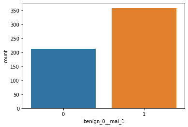
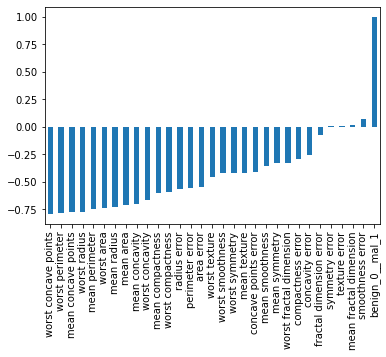
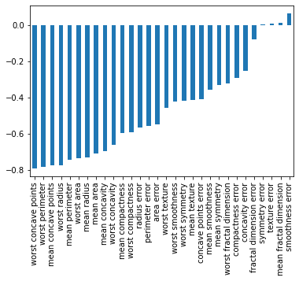
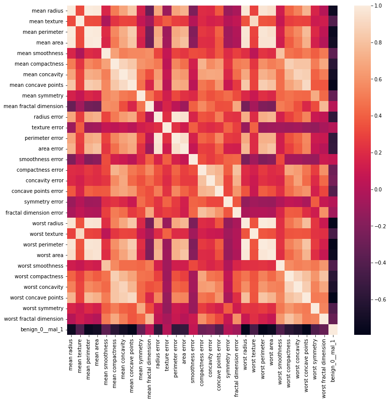
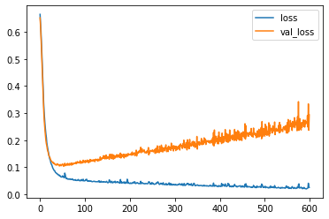
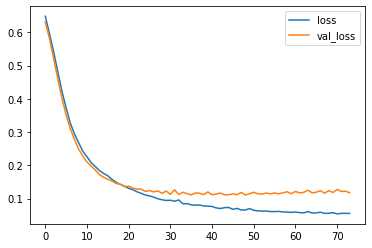
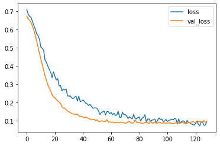

```python
import pandas as pd
import numpy as np
import matplotlib.pyplot as plt
import seaborn as sns
%matplotlib inline
```


```python
from google.colab import drive
```


```python
drive.mount("/content/drive")
```

    Mounted at /content/drive
    


```python
df = pd.read_csv('/content/drive/MyDrive/Colab Notebooks/DATA/cancer_classification.csv')
```


```python
df.info()
```

    <class 'pandas.core.frame.DataFrame'>
    RangeIndex: 569 entries, 0 to 568
    Data columns (total 31 columns):
     #   Column                   Non-Null Count  Dtype  
    ---  ------                   --------------  -----  
     0   mean radius              569 non-null    float64
     1   mean texture             569 non-null    float64
     2   mean perimeter           569 non-null    float64
     3   mean area                569 non-null    float64
     4   mean smoothness          569 non-null    float64
     5   mean compactness         569 non-null    float64
     6   mean concavity           569 non-null    float64
     7   mean concave points      569 non-null    float64
     8   mean symmetry            569 non-null    float64
     9   mean fractal dimension   569 non-null    float64
     10  radius error             569 non-null    float64
     11  texture error            569 non-null    float64
     12  perimeter error          569 non-null    float64
     13  area error               569 non-null    float64
     14  smoothness error         569 non-null    float64
     15  compactness error        569 non-null    float64
     16  concavity error          569 non-null    float64
     17  concave points error     569 non-null    float64
     18  symmetry error           569 non-null    float64
     19  fractal dimension error  569 non-null    float64
     20  worst radius             569 non-null    float64
     21  worst texture            569 non-null    float64
     22  worst perimeter          569 non-null    float64
     23  worst area               569 non-null    float64
     24  worst smoothness         569 non-null    float64
     25  worst compactness        569 non-null    float64
     26  worst concavity          569 non-null    float64
     27  worst concave points     569 non-null    float64
     28  worst symmetry           569 non-null    float64
     29  worst fractal dimension  569 non-null    float64
     30  benign_0__mal_1          569 non-null    int64  
    dtypes: float64(30), int64(1)
    memory usage: 137.9 KB
    


```python
df.describe()
```


  <div id="df-454d6cd0-d0f0-4a4e-96e1-1ad131159803">
    <div class="colab-df-container">
      <div>
<style scoped>
    .dataframe tbody tr th:only-of-type {
        vertical-align: middle;
    }

    .dataframe tbody tr th {
        vertical-align: top;
    }

    .dataframe thead th {
        text-align: right;
    }
</style>
<table border="1" class="dataframe">
  <thead>
    <tr style="text-align: right;">
      <th></th>
      <th>mean radius</th>
      <th>mean texture</th>
      <th>mean perimeter</th>
      <th>mean area</th>
      <th>mean smoothness</th>
      <th>mean compactness</th>
      <th>mean concavity</th>
      <th>mean concave points</th>
      <th>mean symmetry</th>
      <th>mean fractal dimension</th>
      <th>...</th>
      <th>worst texture</th>
      <th>worst perimeter</th>
      <th>worst area</th>
      <th>worst smoothness</th>
      <th>worst compactness</th>
      <th>worst concavity</th>
      <th>worst concave points</th>
      <th>worst symmetry</th>
      <th>worst fractal dimension</th>
      <th>benign_0__mal_1</th>
    </tr>
  </thead>
  <tbody>
    <tr>
      <th>count</th>
      <td>569.000000</td>
      <td>569.000000</td>
      <td>569.000000</td>
      <td>569.000000</td>
      <td>569.000000</td>
      <td>569.000000</td>
      <td>569.000000</td>
      <td>569.000000</td>
      <td>569.000000</td>
      <td>569.000000</td>
      <td>...</td>
      <td>569.000000</td>
      <td>569.000000</td>
      <td>569.000000</td>
      <td>569.000000</td>
      <td>569.000000</td>
      <td>569.000000</td>
      <td>569.000000</td>
      <td>569.000000</td>
      <td>569.000000</td>
      <td>569.000000</td>
    </tr>
    <tr>
      <th>mean</th>
      <td>14.127292</td>
      <td>19.289649</td>
      <td>91.969033</td>
      <td>654.889104</td>
      <td>0.096360</td>
      <td>0.104341</td>
      <td>0.088799</td>
      <td>0.048919</td>
      <td>0.181162</td>
      <td>0.062798</td>
      <td>...</td>
      <td>25.677223</td>
      <td>107.261213</td>
      <td>880.583128</td>
      <td>0.132369</td>
      <td>0.254265</td>
      <td>0.272188</td>
      <td>0.114606</td>
      <td>0.290076</td>
      <td>0.083946</td>
      <td>0.627417</td>
    </tr>
    <tr>
      <th>std</th>
      <td>3.524049</td>
      <td>4.301036</td>
      <td>24.298981</td>
      <td>351.914129</td>
      <td>0.014064</td>
      <td>0.052813</td>
      <td>0.079720</td>
      <td>0.038803</td>
      <td>0.027414</td>
      <td>0.007060</td>
      <td>...</td>
      <td>6.146258</td>
      <td>33.602542</td>
      <td>569.356993</td>
      <td>0.022832</td>
      <td>0.157336</td>
      <td>0.208624</td>
      <td>0.065732</td>
      <td>0.061867</td>
      <td>0.018061</td>
      <td>0.483918</td>
    </tr>
    <tr>
      <th>min</th>
      <td>6.981000</td>
      <td>9.710000</td>
      <td>43.790000</td>
      <td>143.500000</td>
      <td>0.052630</td>
      <td>0.019380</td>
      <td>0.000000</td>
      <td>0.000000</td>
      <td>0.106000</td>
      <td>0.049960</td>
      <td>...</td>
      <td>12.020000</td>
      <td>50.410000</td>
      <td>185.200000</td>
      <td>0.071170</td>
      <td>0.027290</td>
      <td>0.000000</td>
      <td>0.000000</td>
      <td>0.156500</td>
      <td>0.055040</td>
      <td>0.000000</td>
    </tr>
    <tr>
      <th>25%</th>
      <td>11.700000</td>
      <td>16.170000</td>
      <td>75.170000</td>
      <td>420.300000</td>
      <td>0.086370</td>
      <td>0.064920</td>
      <td>0.029560</td>
      <td>0.020310</td>
      <td>0.161900</td>
      <td>0.057700</td>
      <td>...</td>
      <td>21.080000</td>
      <td>84.110000</td>
      <td>515.300000</td>
      <td>0.116600</td>
      <td>0.147200</td>
      <td>0.114500</td>
      <td>0.064930</td>
      <td>0.250400</td>
      <td>0.071460</td>
      <td>0.000000</td>
    </tr>
    <tr>
      <th>50%</th>
      <td>13.370000</td>
      <td>18.840000</td>
      <td>86.240000</td>
      <td>551.100000</td>
      <td>0.095870</td>
      <td>0.092630</td>
      <td>0.061540</td>
      <td>0.033500</td>
      <td>0.179200</td>
      <td>0.061540</td>
      <td>...</td>
      <td>25.410000</td>
      <td>97.660000</td>
      <td>686.500000</td>
      <td>0.131300</td>
      <td>0.211900</td>
      <td>0.226700</td>
      <td>0.099930</td>
      <td>0.282200</td>
      <td>0.080040</td>
      <td>1.000000</td>
    </tr>
    <tr>
      <th>75%</th>
      <td>15.780000</td>
      <td>21.800000</td>
      <td>104.100000</td>
      <td>782.700000</td>
      <td>0.105300</td>
      <td>0.130400</td>
      <td>0.130700</td>
      <td>0.074000</td>
      <td>0.195700</td>
      <td>0.066120</td>
      <td>...</td>
      <td>29.720000</td>
      <td>125.400000</td>
      <td>1084.000000</td>
      <td>0.146000</td>
      <td>0.339100</td>
      <td>0.382900</td>
      <td>0.161400</td>
      <td>0.317900</td>
      <td>0.092080</td>
      <td>1.000000</td>
    </tr>
    <tr>
      <th>max</th>
      <td>28.110000</td>
      <td>39.280000</td>
      <td>188.500000</td>
      <td>2501.000000</td>
      <td>0.163400</td>
      <td>0.345400</td>
      <td>0.426800</td>
      <td>0.201200</td>
      <td>0.304000</td>
      <td>0.097440</td>
      <td>...</td>
      <td>49.540000</td>
      <td>251.200000</td>
      <td>4254.000000</td>
      <td>0.222600</td>
      <td>1.058000</td>
      <td>1.252000</td>
      <td>0.291000</td>
      <td>0.663800</td>
      <td>0.207500</td>
      <td>1.000000</td>
    </tr>
  </tbody>
</table>
<p>8 rows × 31 columns</p>
</div>
      <button class="colab-df-convert" onclick="convertToInteractive('df-454d6cd0-d0f0-4a4e-96e1-1ad131159803')"
              title="Convert this dataframe to an interactive table."
              style="display:none;">

  <svg xmlns="http://www.w3.org/2000/svg" height="24px"viewBox="0 0 24 24"
       width="24px">
    <path d="M0 0h24v24H0V0z" fill="none"/>
    <path d="M18.56 5.44l.94 2.06.94-2.06 2.06-.94-2.06-.94-.94-2.06-.94 2.06-2.06.94zm-11 1L8.5 8.5l.94-2.06 2.06-.94-2.06-.94L8.5 2.5l-.94 2.06-2.06.94zm10 10l.94 2.06.94-2.06 2.06-.94-2.06-.94-.94-2.06-.94 2.06-2.06.94z"/><path d="M17.41 7.96l-1.37-1.37c-.4-.4-.92-.59-1.43-.59-.52 0-1.04.2-1.43.59L10.3 9.45l-7.72 7.72c-.78.78-.78 2.05 0 2.83L4 21.41c.39.39.9.59 1.41.59.51 0 1.02-.2 1.41-.59l7.78-7.78 2.81-2.81c.8-.78.8-2.07 0-2.86zM5.41 20L4 18.59l7.72-7.72 1.47 1.35L5.41 20z"/>
  </svg>
      </button>

  <style>
    .colab-df-container {
      display:flex;
      flex-wrap:wrap;
      gap: 12px;
    }

    .colab-df-convert {
      background-color: #E8F0FE;
      border: none;
      border-radius: 50%;
      cursor: pointer;
      display: none;
      fill: #1967D2;
      height: 32px;
      padding: 0 0 0 0;
      width: 32px;
    }

    .colab-df-convert:hover {
      background-color: #E2EBFA;
      box-shadow: 0px 1px 2px rgba(60, 64, 67, 0.3), 0px 1px 3px 1px rgba(60, 64, 67, 0.15);
      fill: #174EA6;
    }

    [theme=dark] .colab-df-convert {
      background-color: #3B4455;
      fill: #D2E3FC;
    }

    [theme=dark] .colab-df-convert:hover {
      background-color: #434B5C;
      box-shadow: 0px 1px 3px 1px rgba(0, 0, 0, 0.15);
      filter: drop-shadow(0px 1px 2px rgba(0, 0, 0, 0.3));
      fill: #FFFFFF;
    }
  </style>

      <script>
        const buttonEl =
          document.querySelector('#df-454d6cd0-d0f0-4a4e-96e1-1ad131159803 button.colab-df-convert');
        buttonEl.style.display =
          google.colab.kernel.accessAllowed ? 'block' : 'none';

        async function convertToInteractive(key) {
          const element = document.querySelector('#df-454d6cd0-d0f0-4a4e-96e1-1ad131159803');
          const dataTable =
            await google.colab.kernel.invokeFunction('convertToInteractive',
                                                     [key], {});
          if (!dataTable) return;

          const docLinkHtml = 'Like what you see? Visit the ' +
            '<a target="_blank" href=https://colab.research.google.com/notebooks/data_table.ipynb>data table notebook</a>'
            + ' to learn more about interactive tables.';
          element.innerHTML = '';
          dataTable['output_type'] = 'display_data';
          await google.colab.output.renderOutput(dataTable, element);
          const docLink = document.createElement('div');
          docLink.innerHTML = docLinkHtml;
          element.appendChild(docLink);
        }
      </script>
    </div>
  </div>


```python
df.describe().transpose()
```


  <div id="df-cd141638-acdb-4eb5-8ea2-0736f2897dd9">
    <div class="colab-df-container">
      <div>
<style scoped>
    .dataframe tbody tr th:only-of-type {
        vertical-align: middle;
    }

    .dataframe tbody tr th {
        vertical-align: top;
    }

    .dataframe thead th {
        text-align: right;
    }
</style>
<table border="1" class="dataframe">
  <thead>
    <tr style="text-align: right;">
      <th></th>
      <th>count</th>
      <th>mean</th>
      <th>std</th>
      <th>min</th>
      <th>25%</th>
      <th>50%</th>
      <th>75%</th>
      <th>max</th>
    </tr>
  </thead>
  <tbody>
    <tr>
      <th>mean radius</th>
      <td>569.0</td>
      <td>14.127292</td>
      <td>3.524049</td>
      <td>6.981000</td>
      <td>11.700000</td>
      <td>13.370000</td>
      <td>15.780000</td>
      <td>28.11000</td>
    </tr>
    <tr>
      <th>mean texture</th>
      <td>569.0</td>
      <td>19.289649</td>
      <td>4.301036</td>
      <td>9.710000</td>
      <td>16.170000</td>
      <td>18.840000</td>
      <td>21.800000</td>
      <td>39.28000</td>
    </tr>
    <tr>
      <th>mean perimeter</th>
      <td>569.0</td>
      <td>91.969033</td>
      <td>24.298981</td>
      <td>43.790000</td>
      <td>75.170000</td>
      <td>86.240000</td>
      <td>104.100000</td>
      <td>188.50000</td>
    </tr>
    <tr>
      <th>mean area</th>
      <td>569.0</td>
      <td>654.889104</td>
      <td>351.914129</td>
      <td>143.500000</td>
      <td>420.300000</td>
      <td>551.100000</td>
      <td>782.700000</td>
      <td>2501.00000</td>
    </tr>
    <tr>
      <th>mean smoothness</th>
      <td>569.0</td>
      <td>0.096360</td>
      <td>0.014064</td>
      <td>0.052630</td>
      <td>0.086370</td>
      <td>0.095870</td>
      <td>0.105300</td>
      <td>0.16340</td>
    </tr>
    <tr>
      <th>mean compactness</th>
      <td>569.0</td>
      <td>0.104341</td>
      <td>0.052813</td>
      <td>0.019380</td>
      <td>0.064920</td>
      <td>0.092630</td>
      <td>0.130400</td>
      <td>0.34540</td>
    </tr>
    <tr>
      <th>mean concavity</th>
      <td>569.0</td>
      <td>0.088799</td>
      <td>0.079720</td>
      <td>0.000000</td>
      <td>0.029560</td>
      <td>0.061540</td>
      <td>0.130700</td>
      <td>0.42680</td>
    </tr>
    <tr>
      <th>mean concave points</th>
      <td>569.0</td>
      <td>0.048919</td>
      <td>0.038803</td>
      <td>0.000000</td>
      <td>0.020310</td>
      <td>0.033500</td>
      <td>0.074000</td>
      <td>0.20120</td>
    </tr>
    <tr>
      <th>mean symmetry</th>
      <td>569.0</td>
      <td>0.181162</td>
      <td>0.027414</td>
      <td>0.106000</td>
      <td>0.161900</td>
      <td>0.179200</td>
      <td>0.195700</td>
      <td>0.30400</td>
    </tr>
    <tr>
      <th>mean fractal dimension</th>
      <td>569.0</td>
      <td>0.062798</td>
      <td>0.007060</td>
      <td>0.049960</td>
      <td>0.057700</td>
      <td>0.061540</td>
      <td>0.066120</td>
      <td>0.09744</td>
    </tr>
    <tr>
      <th>radius error</th>
      <td>569.0</td>
      <td>0.405172</td>
      <td>0.277313</td>
      <td>0.111500</td>
      <td>0.232400</td>
      <td>0.324200</td>
      <td>0.478900</td>
      <td>2.87300</td>
    </tr>
    <tr>
      <th>texture error</th>
      <td>569.0</td>
      <td>1.216853</td>
      <td>0.551648</td>
      <td>0.360200</td>
      <td>0.833900</td>
      <td>1.108000</td>
      <td>1.474000</td>
      <td>4.88500</td>
    </tr>
    <tr>
      <th>perimeter error</th>
      <td>569.0</td>
      <td>2.866059</td>
      <td>2.021855</td>
      <td>0.757000</td>
      <td>1.606000</td>
      <td>2.287000</td>
      <td>3.357000</td>
      <td>21.98000</td>
    </tr>
    <tr>
      <th>area error</th>
      <td>569.0</td>
      <td>40.337079</td>
      <td>45.491006</td>
      <td>6.802000</td>
      <td>17.850000</td>
      <td>24.530000</td>
      <td>45.190000</td>
      <td>542.20000</td>
    </tr>
    <tr>
      <th>smoothness error</th>
      <td>569.0</td>
      <td>0.007041</td>
      <td>0.003003</td>
      <td>0.001713</td>
      <td>0.005169</td>
      <td>0.006380</td>
      <td>0.008146</td>
      <td>0.03113</td>
    </tr>
    <tr>
      <th>compactness error</th>
      <td>569.0</td>
      <td>0.025478</td>
      <td>0.017908</td>
      <td>0.002252</td>
      <td>0.013080</td>
      <td>0.020450</td>
      <td>0.032450</td>
      <td>0.13540</td>
    </tr>
    <tr>
      <th>concavity error</th>
      <td>569.0</td>
      <td>0.031894</td>
      <td>0.030186</td>
      <td>0.000000</td>
      <td>0.015090</td>
      <td>0.025890</td>
      <td>0.042050</td>
      <td>0.39600</td>
    </tr>
    <tr>
      <th>concave points error</th>
      <td>569.0</td>
      <td>0.011796</td>
      <td>0.006170</td>
      <td>0.000000</td>
      <td>0.007638</td>
      <td>0.010930</td>
      <td>0.014710</td>
      <td>0.05279</td>
    </tr>
    <tr>
      <th>symmetry error</th>
      <td>569.0</td>
      <td>0.020542</td>
      <td>0.008266</td>
      <td>0.007882</td>
      <td>0.015160</td>
      <td>0.018730</td>
      <td>0.023480</td>
      <td>0.07895</td>
    </tr>
    <tr>
      <th>fractal dimension error</th>
      <td>569.0</td>
      <td>0.003795</td>
      <td>0.002646</td>
      <td>0.000895</td>
      <td>0.002248</td>
      <td>0.003187</td>
      <td>0.004558</td>
      <td>0.02984</td>
    </tr>
    <tr>
      <th>worst radius</th>
      <td>569.0</td>
      <td>16.269190</td>
      <td>4.833242</td>
      <td>7.930000</td>
      <td>13.010000</td>
      <td>14.970000</td>
      <td>18.790000</td>
      <td>36.04000</td>
    </tr>
    <tr>
      <th>worst texture</th>
      <td>569.0</td>
      <td>25.677223</td>
      <td>6.146258</td>
      <td>12.020000</td>
      <td>21.080000</td>
      <td>25.410000</td>
      <td>29.720000</td>
      <td>49.54000</td>
    </tr>
    <tr>
      <th>worst perimeter</th>
      <td>569.0</td>
      <td>107.261213</td>
      <td>33.602542</td>
      <td>50.410000</td>
      <td>84.110000</td>
      <td>97.660000</td>
      <td>125.400000</td>
      <td>251.20000</td>
    </tr>
    <tr>
      <th>worst area</th>
      <td>569.0</td>
      <td>880.583128</td>
      <td>569.356993</td>
      <td>185.200000</td>
      <td>515.300000</td>
      <td>686.500000</td>
      <td>1084.000000</td>
      <td>4254.00000</td>
    </tr>
    <tr>
      <th>worst smoothness</th>
      <td>569.0</td>
      <td>0.132369</td>
      <td>0.022832</td>
      <td>0.071170</td>
      <td>0.116600</td>
      <td>0.131300</td>
      <td>0.146000</td>
      <td>0.22260</td>
    </tr>
    <tr>
      <th>worst compactness</th>
      <td>569.0</td>
      <td>0.254265</td>
      <td>0.157336</td>
      <td>0.027290</td>
      <td>0.147200</td>
      <td>0.211900</td>
      <td>0.339100</td>
      <td>1.05800</td>
    </tr>
    <tr>
      <th>worst concavity</th>
      <td>569.0</td>
      <td>0.272188</td>
      <td>0.208624</td>
      <td>0.000000</td>
      <td>0.114500</td>
      <td>0.226700</td>
      <td>0.382900</td>
      <td>1.25200</td>
    </tr>
    <tr>
      <th>worst concave points</th>
      <td>569.0</td>
      <td>0.114606</td>
      <td>0.065732</td>
      <td>0.000000</td>
      <td>0.064930</td>
      <td>0.099930</td>
      <td>0.161400</td>
      <td>0.29100</td>
    </tr>
    <tr>
      <th>worst symmetry</th>
      <td>569.0</td>
      <td>0.290076</td>
      <td>0.061867</td>
      <td>0.156500</td>
      <td>0.250400</td>
      <td>0.282200</td>
      <td>0.317900</td>
      <td>0.66380</td>
    </tr>
    <tr>
      <th>worst fractal dimension</th>
      <td>569.0</td>
      <td>0.083946</td>
      <td>0.018061</td>
      <td>0.055040</td>
      <td>0.071460</td>
      <td>0.080040</td>
      <td>0.092080</td>
      <td>0.20750</td>
    </tr>
    <tr>
      <th>benign_0__mal_1</th>
      <td>569.0</td>
      <td>0.627417</td>
      <td>0.483918</td>
      <td>0.000000</td>
      <td>0.000000</td>
      <td>1.000000</td>
      <td>1.000000</td>
      <td>1.00000</td>
    </tr>
  </tbody>
</table>
</div>
      <button class="colab-df-convert" onclick="convertToInteractive('df-cd141638-acdb-4eb5-8ea2-0736f2897dd9')"
              title="Convert this dataframe to an interactive table."
              style="display:none;">

  <svg xmlns="http://www.w3.org/2000/svg" height="24px"viewBox="0 0 24 24"
       width="24px">
    <path d="M0 0h24v24H0V0z" fill="none"/>
    <path d="M18.56 5.44l.94 2.06.94-2.06 2.06-.94-2.06-.94-.94-2.06-.94 2.06-2.06.94zm-11 1L8.5 8.5l.94-2.06 2.06-.94-2.06-.94L8.5 2.5l-.94 2.06-2.06.94zm10 10l.94 2.06.94-2.06 2.06-.94-2.06-.94-.94-2.06-.94 2.06-2.06.94z"/><path d="M17.41 7.96l-1.37-1.37c-.4-.4-.92-.59-1.43-.59-.52 0-1.04.2-1.43.59L10.3 9.45l-7.72 7.72c-.78.78-.78 2.05 0 2.83L4 21.41c.39.39.9.59 1.41.59.51 0 1.02-.2 1.41-.59l7.78-7.78 2.81-2.81c.8-.78.8-2.07 0-2.86zM5.41 20L4 18.59l7.72-7.72 1.47 1.35L5.41 20z"/>
  </svg>
      </button>

  <style>
    .colab-df-container {
      display:flex;
      flex-wrap:wrap;
      gap: 12px;
    }

    .colab-df-convert {
      background-color: #E8F0FE;
      border: none;
      border-radius: 50%;
      cursor: pointer;
      display: none;
      fill: #1967D2;
      height: 32px;
      padding: 0 0 0 0;
      width: 32px;
    }

    .colab-df-convert:hover {
      background-color: #E2EBFA;
      box-shadow: 0px 1px 2px rgba(60, 64, 67, 0.3), 0px 1px 3px 1px rgba(60, 64, 67, 0.15);
      fill: #174EA6;
    }

    [theme=dark] .colab-df-convert {
      background-color: #3B4455;
      fill: #D2E3FC;
    }

    [theme=dark] .colab-df-convert:hover {
      background-color: #434B5C;
      box-shadow: 0px 1px 3px 1px rgba(0, 0, 0, 0.15);
      filter: drop-shadow(0px 1px 2px rgba(0, 0, 0, 0.3));
      fill: #FFFFFF;
    }
  </style>

      <script>
        const buttonEl =
          document.querySelector('#df-cd141638-acdb-4eb5-8ea2-0736f2897dd9 button.colab-df-convert');
        buttonEl.style.display =
          google.colab.kernel.accessAllowed ? 'block' : 'none';

        async function convertToInteractive(key) {
          const element = document.querySelector('#df-cd141638-acdb-4eb5-8ea2-0736f2897dd9');
          const dataTable =
            await google.colab.kernel.invokeFunction('convertToInteractive',
                                                     [key], {});
          if (!dataTable) return;

          const docLinkHtml = 'Like what you see? Visit the ' +
            '<a target="_blank" href=https://colab.research.google.com/notebooks/data_table.ipynb>data table notebook</a>'
            + ' to learn more about interactive tables.';
          element.innerHTML = '';
          dataTable['output_type'] = 'display_data';
          await google.colab.output.renderOutput(dataTable, element);
          const docLink = document.createElement('div');
          docLink.innerHTML = docLinkHtml;
          element.appendChild(docLink);
        }
      </script>
    </div>
  </div>


```python
sns.countplot(x='benign_0__mal_1', data=df)
```


    <matplotlib.axes._subplots.AxesSubplot at 0x7f2c462504d0>


    

    


```python
df.corr()
```


  <div id="df-832d9554-8133-469d-969f-1572a7605a53">
    <div class="colab-df-container">
      <div>
<style scoped>
    .dataframe tbody tr th:only-of-type {
        vertical-align: middle;
    }

    .dataframe tbody tr th {
        vertical-align: top;
    }

    .dataframe thead th {
        text-align: right;
    }
</style>
<table border="1" class="dataframe">
  <thead>
    <tr style="text-align: right;">
      <th></th>
      <th>mean radius</th>
      <th>mean texture</th>
      <th>mean perimeter</th>
      <th>mean area</th>
      <th>mean smoothness</th>
      <th>mean compactness</th>
      <th>mean concavity</th>
      <th>mean concave points</th>
      <th>mean symmetry</th>
      <th>mean fractal dimension</th>
      <th>...</th>
      <th>worst texture</th>
      <th>worst perimeter</th>
      <th>worst area</th>
      <th>worst smoothness</th>
      <th>worst compactness</th>
      <th>worst concavity</th>
      <th>worst concave points</th>
      <th>worst symmetry</th>
      <th>worst fractal dimension</th>
      <th>benign_0__mal_1</th>
    </tr>
  </thead>
  <tbody>
    <tr>
      <th>mean radius</th>
      <td>1.000000</td>
      <td>0.323782</td>
      <td>0.997855</td>
      <td>0.987357</td>
      <td>0.170581</td>
      <td>0.506124</td>
      <td>0.676764</td>
      <td>0.822529</td>
      <td>0.147741</td>
      <td>-0.311631</td>
      <td>...</td>
      <td>0.297008</td>
      <td>0.965137</td>
      <td>0.941082</td>
      <td>0.119616</td>
      <td>0.413463</td>
      <td>0.526911</td>
      <td>0.744214</td>
      <td>0.163953</td>
      <td>0.007066</td>
      <td>-0.730029</td>
    </tr>
    <tr>
      <th>mean texture</th>
      <td>0.323782</td>
      <td>1.000000</td>
      <td>0.329533</td>
      <td>0.321086</td>
      <td>-0.023389</td>
      <td>0.236702</td>
      <td>0.302418</td>
      <td>0.293464</td>
      <td>0.071401</td>
      <td>-0.076437</td>
      <td>...</td>
      <td>0.912045</td>
      <td>0.358040</td>
      <td>0.343546</td>
      <td>0.077503</td>
      <td>0.277830</td>
      <td>0.301025</td>
      <td>0.295316</td>
      <td>0.105008</td>
      <td>0.119205</td>
      <td>-0.415185</td>
    </tr>
    <tr>
      <th>mean perimeter</th>
      <td>0.997855</td>
      <td>0.329533</td>
      <td>1.000000</td>
      <td>0.986507</td>
      <td>0.207278</td>
      <td>0.556936</td>
      <td>0.716136</td>
      <td>0.850977</td>
      <td>0.183027</td>
      <td>-0.261477</td>
      <td>...</td>
      <td>0.303038</td>
      <td>0.970387</td>
      <td>0.941550</td>
      <td>0.150549</td>
      <td>0.455774</td>
      <td>0.563879</td>
      <td>0.771241</td>
      <td>0.189115</td>
      <td>0.051019</td>
      <td>-0.742636</td>
    </tr>
    <tr>
      <th>mean area</th>
      <td>0.987357</td>
      <td>0.321086</td>
      <td>0.986507</td>
      <td>1.000000</td>
      <td>0.177028</td>
      <td>0.498502</td>
      <td>0.685983</td>
      <td>0.823269</td>
      <td>0.151293</td>
      <td>-0.283110</td>
      <td>...</td>
      <td>0.287489</td>
      <td>0.959120</td>
      <td>0.959213</td>
      <td>0.123523</td>
      <td>0.390410</td>
      <td>0.512606</td>
      <td>0.722017</td>
      <td>0.143570</td>
      <td>0.003738</td>
      <td>-0.708984</td>
    </tr>
    <tr>
      <th>mean smoothness</th>
      <td>0.170581</td>
      <td>-0.023389</td>
      <td>0.207278</td>
      <td>0.177028</td>
      <td>1.000000</td>
      <td>0.659123</td>
      <td>0.521984</td>
      <td>0.553695</td>
      <td>0.557775</td>
      <td>0.584792</td>
      <td>...</td>
      <td>0.036072</td>
      <td>0.238853</td>
      <td>0.206718</td>
      <td>0.805324</td>
      <td>0.472468</td>
      <td>0.434926</td>
      <td>0.503053</td>
      <td>0.394309</td>
      <td>0.499316</td>
      <td>-0.358560</td>
    </tr>
    <tr>
      <th>mean compactness</th>
      <td>0.506124</td>
      <td>0.236702</td>
      <td>0.556936</td>
      <td>0.498502</td>
      <td>0.659123</td>
      <td>1.000000</td>
      <td>0.883121</td>
      <td>0.831135</td>
      <td>0.602641</td>
      <td>0.565369</td>
      <td>...</td>
      <td>0.248133</td>
      <td>0.590210</td>
      <td>0.509604</td>
      <td>0.565541</td>
      <td>0.865809</td>
      <td>0.816275</td>
      <td>0.815573</td>
      <td>0.510223</td>
      <td>0.687382</td>
      <td>-0.596534</td>
    </tr>
    <tr>
      <th>mean concavity</th>
      <td>0.676764</td>
      <td>0.302418</td>
      <td>0.716136</td>
      <td>0.685983</td>
      <td>0.521984</td>
      <td>0.883121</td>
      <td>1.000000</td>
      <td>0.921391</td>
      <td>0.500667</td>
      <td>0.336783</td>
      <td>...</td>
      <td>0.299879</td>
      <td>0.729565</td>
      <td>0.675987</td>
      <td>0.448822</td>
      <td>0.754968</td>
      <td>0.884103</td>
      <td>0.861323</td>
      <td>0.409464</td>
      <td>0.514930</td>
      <td>-0.696360</td>
    </tr>
    <tr>
      <th>mean concave points</th>
      <td>0.822529</td>
      <td>0.293464</td>
      <td>0.850977</td>
      <td>0.823269</td>
      <td>0.553695</td>
      <td>0.831135</td>
      <td>0.921391</td>
      <td>1.000000</td>
      <td>0.462497</td>
      <td>0.166917</td>
      <td>...</td>
      <td>0.292752</td>
      <td>0.855923</td>
      <td>0.809630</td>
      <td>0.452753</td>
      <td>0.667454</td>
      <td>0.752399</td>
      <td>0.910155</td>
      <td>0.375744</td>
      <td>0.368661</td>
      <td>-0.776614</td>
    </tr>
    <tr>
      <th>mean symmetry</th>
      <td>0.147741</td>
      <td>0.071401</td>
      <td>0.183027</td>
      <td>0.151293</td>
      <td>0.557775</td>
      <td>0.602641</td>
      <td>0.500667</td>
      <td>0.462497</td>
      <td>1.000000</td>
      <td>0.479921</td>
      <td>...</td>
      <td>0.090651</td>
      <td>0.219169</td>
      <td>0.177193</td>
      <td>0.426675</td>
      <td>0.473200</td>
      <td>0.433721</td>
      <td>0.430297</td>
      <td>0.699826</td>
      <td>0.438413</td>
      <td>-0.330499</td>
    </tr>
    <tr>
      <th>mean fractal dimension</th>
      <td>-0.311631</td>
      <td>-0.076437</td>
      <td>-0.261477</td>
      <td>-0.283110</td>
      <td>0.584792</td>
      <td>0.565369</td>
      <td>0.336783</td>
      <td>0.166917</td>
      <td>0.479921</td>
      <td>1.000000</td>
      <td>...</td>
      <td>-0.051269</td>
      <td>-0.205151</td>
      <td>-0.231854</td>
      <td>0.504942</td>
      <td>0.458798</td>
      <td>0.346234</td>
      <td>0.175325</td>
      <td>0.334019</td>
      <td>0.767297</td>
      <td>0.012838</td>
    </tr>
    <tr>
      <th>radius error</th>
      <td>0.679090</td>
      <td>0.275869</td>
      <td>0.691765</td>
      <td>0.732562</td>
      <td>0.301467</td>
      <td>0.497473</td>
      <td>0.631925</td>
      <td>0.698050</td>
      <td>0.303379</td>
      <td>0.000111</td>
      <td>...</td>
      <td>0.194799</td>
      <td>0.719684</td>
      <td>0.751548</td>
      <td>0.141919</td>
      <td>0.287103</td>
      <td>0.380585</td>
      <td>0.531062</td>
      <td>0.094543</td>
      <td>0.049559</td>
      <td>-0.567134</td>
    </tr>
    <tr>
      <th>texture error</th>
      <td>-0.097317</td>
      <td>0.386358</td>
      <td>-0.086761</td>
      <td>-0.066280</td>
      <td>0.068406</td>
      <td>0.046205</td>
      <td>0.076218</td>
      <td>0.021480</td>
      <td>0.128053</td>
      <td>0.164174</td>
      <td>...</td>
      <td>0.409003</td>
      <td>-0.102242</td>
      <td>-0.083195</td>
      <td>-0.073658</td>
      <td>-0.092439</td>
      <td>-0.068956</td>
      <td>-0.119638</td>
      <td>-0.128215</td>
      <td>-0.045655</td>
      <td>0.008303</td>
    </tr>
    <tr>
      <th>perimeter error</th>
      <td>0.674172</td>
      <td>0.281673</td>
      <td>0.693135</td>
      <td>0.726628</td>
      <td>0.296092</td>
      <td>0.548905</td>
      <td>0.660391</td>
      <td>0.710650</td>
      <td>0.313893</td>
      <td>0.039830</td>
      <td>...</td>
      <td>0.200371</td>
      <td>0.721031</td>
      <td>0.730713</td>
      <td>0.130054</td>
      <td>0.341919</td>
      <td>0.418899</td>
      <td>0.554897</td>
      <td>0.109930</td>
      <td>0.085433</td>
      <td>-0.556141</td>
    </tr>
    <tr>
      <th>area error</th>
      <td>0.735864</td>
      <td>0.259845</td>
      <td>0.744983</td>
      <td>0.800086</td>
      <td>0.246552</td>
      <td>0.455653</td>
      <td>0.617427</td>
      <td>0.690299</td>
      <td>0.223970</td>
      <td>-0.090170</td>
      <td>...</td>
      <td>0.196497</td>
      <td>0.761213</td>
      <td>0.811408</td>
      <td>0.125389</td>
      <td>0.283257</td>
      <td>0.385100</td>
      <td>0.538166</td>
      <td>0.074126</td>
      <td>0.017539</td>
      <td>-0.548236</td>
    </tr>
    <tr>
      <th>smoothness error</th>
      <td>-0.222600</td>
      <td>0.006614</td>
      <td>-0.202694</td>
      <td>-0.166777</td>
      <td>0.332375</td>
      <td>0.135299</td>
      <td>0.098564</td>
      <td>0.027653</td>
      <td>0.187321</td>
      <td>0.401964</td>
      <td>...</td>
      <td>-0.074743</td>
      <td>-0.217304</td>
      <td>-0.182195</td>
      <td>0.314457</td>
      <td>-0.055558</td>
      <td>-0.058298</td>
      <td>-0.102007</td>
      <td>-0.107342</td>
      <td>0.101480</td>
      <td>0.067016</td>
    </tr>
    <tr>
      <th>compactness error</th>
      <td>0.206000</td>
      <td>0.191975</td>
      <td>0.250744</td>
      <td>0.212583</td>
      <td>0.318943</td>
      <td>0.738722</td>
      <td>0.670279</td>
      <td>0.490424</td>
      <td>0.421659</td>
      <td>0.559837</td>
      <td>...</td>
      <td>0.143003</td>
      <td>0.260516</td>
      <td>0.199371</td>
      <td>0.227394</td>
      <td>0.678780</td>
      <td>0.639147</td>
      <td>0.483208</td>
      <td>0.277878</td>
      <td>0.590973</td>
      <td>-0.292999</td>
    </tr>
    <tr>
      <th>concavity error</th>
      <td>0.194204</td>
      <td>0.143293</td>
      <td>0.228082</td>
      <td>0.207660</td>
      <td>0.248396</td>
      <td>0.570517</td>
      <td>0.691270</td>
      <td>0.439167</td>
      <td>0.342627</td>
      <td>0.446630</td>
      <td>...</td>
      <td>0.100241</td>
      <td>0.226680</td>
      <td>0.188353</td>
      <td>0.168481</td>
      <td>0.484858</td>
      <td>0.662564</td>
      <td>0.440472</td>
      <td>0.197788</td>
      <td>0.439329</td>
      <td>-0.253730</td>
    </tr>
    <tr>
      <th>concave points error</th>
      <td>0.376169</td>
      <td>0.163851</td>
      <td>0.407217</td>
      <td>0.372320</td>
      <td>0.380676</td>
      <td>0.642262</td>
      <td>0.683260</td>
      <td>0.615634</td>
      <td>0.393298</td>
      <td>0.341198</td>
      <td>...</td>
      <td>0.086741</td>
      <td>0.394999</td>
      <td>0.342271</td>
      <td>0.215351</td>
      <td>0.452888</td>
      <td>0.549592</td>
      <td>0.602450</td>
      <td>0.143116</td>
      <td>0.310655</td>
      <td>-0.408042</td>
    </tr>
    <tr>
      <th>symmetry error</th>
      <td>-0.104321</td>
      <td>0.009127</td>
      <td>-0.081629</td>
      <td>-0.072497</td>
      <td>0.200774</td>
      <td>0.229977</td>
      <td>0.178009</td>
      <td>0.095351</td>
      <td>0.449137</td>
      <td>0.345007</td>
      <td>...</td>
      <td>-0.077473</td>
      <td>-0.103753</td>
      <td>-0.110343</td>
      <td>-0.012662</td>
      <td>0.060255</td>
      <td>0.037119</td>
      <td>-0.030413</td>
      <td>0.389402</td>
      <td>0.078079</td>
      <td>0.006522</td>
    </tr>
    <tr>
      <th>fractal dimension error</th>
      <td>-0.042641</td>
      <td>0.054458</td>
      <td>-0.005523</td>
      <td>-0.019887</td>
      <td>0.283607</td>
      <td>0.507318</td>
      <td>0.449301</td>
      <td>0.257584</td>
      <td>0.331786</td>
      <td>0.688132</td>
      <td>...</td>
      <td>-0.003195</td>
      <td>-0.001000</td>
      <td>-0.022736</td>
      <td>0.170568</td>
      <td>0.390159</td>
      <td>0.379975</td>
      <td>0.215204</td>
      <td>0.111094</td>
      <td>0.591328</td>
      <td>-0.077972</td>
    </tr>
    <tr>
      <th>worst radius</th>
      <td>0.969539</td>
      <td>0.352573</td>
      <td>0.969476</td>
      <td>0.962746</td>
      <td>0.213120</td>
      <td>0.535315</td>
      <td>0.688236</td>
      <td>0.830318</td>
      <td>0.185728</td>
      <td>-0.253691</td>
      <td>...</td>
      <td>0.359921</td>
      <td>0.993708</td>
      <td>0.984015</td>
      <td>0.216574</td>
      <td>0.475820</td>
      <td>0.573975</td>
      <td>0.787424</td>
      <td>0.243529</td>
      <td>0.093492</td>
      <td>-0.776454</td>
    </tr>
    <tr>
      <th>worst texture</th>
      <td>0.297008</td>
      <td>0.912045</td>
      <td>0.303038</td>
      <td>0.287489</td>
      <td>0.036072</td>
      <td>0.248133</td>
      <td>0.299879</td>
      <td>0.292752</td>
      <td>0.090651</td>
      <td>-0.051269</td>
      <td>...</td>
      <td>1.000000</td>
      <td>0.365098</td>
      <td>0.345842</td>
      <td>0.225429</td>
      <td>0.360832</td>
      <td>0.368366</td>
      <td>0.359755</td>
      <td>0.233027</td>
      <td>0.219122</td>
      <td>-0.456903</td>
    </tr>
    <tr>
      <th>worst perimeter</th>
      <td>0.965137</td>
      <td>0.358040</td>
      <td>0.970387</td>
      <td>0.959120</td>
      <td>0.238853</td>
      <td>0.590210</td>
      <td>0.729565</td>
      <td>0.855923</td>
      <td>0.219169</td>
      <td>-0.205151</td>
      <td>...</td>
      <td>0.365098</td>
      <td>1.000000</td>
      <td>0.977578</td>
      <td>0.236775</td>
      <td>0.529408</td>
      <td>0.618344</td>
      <td>0.816322</td>
      <td>0.269493</td>
      <td>0.138957</td>
      <td>-0.782914</td>
    </tr>
    <tr>
      <th>worst area</th>
      <td>0.941082</td>
      <td>0.343546</td>
      <td>0.941550</td>
      <td>0.959213</td>
      <td>0.206718</td>
      <td>0.509604</td>
      <td>0.675987</td>
      <td>0.809630</td>
      <td>0.177193</td>
      <td>-0.231854</td>
      <td>...</td>
      <td>0.345842</td>
      <td>0.977578</td>
      <td>1.000000</td>
      <td>0.209145</td>
      <td>0.438296</td>
      <td>0.543331</td>
      <td>0.747419</td>
      <td>0.209146</td>
      <td>0.079647</td>
      <td>-0.733825</td>
    </tr>
    <tr>
      <th>worst smoothness</th>
      <td>0.119616</td>
      <td>0.077503</td>
      <td>0.150549</td>
      <td>0.123523</td>
      <td>0.805324</td>
      <td>0.565541</td>
      <td>0.448822</td>
      <td>0.452753</td>
      <td>0.426675</td>
      <td>0.504942</td>
      <td>...</td>
      <td>0.225429</td>
      <td>0.236775</td>
      <td>0.209145</td>
      <td>1.000000</td>
      <td>0.568187</td>
      <td>0.518523</td>
      <td>0.547691</td>
      <td>0.493838</td>
      <td>0.617624</td>
      <td>-0.421465</td>
    </tr>
    <tr>
      <th>worst compactness</th>
      <td>0.413463</td>
      <td>0.277830</td>
      <td>0.455774</td>
      <td>0.390410</td>
      <td>0.472468</td>
      <td>0.865809</td>
      <td>0.754968</td>
      <td>0.667454</td>
      <td>0.473200</td>
      <td>0.458798</td>
      <td>...</td>
      <td>0.360832</td>
      <td>0.529408</td>
      <td>0.438296</td>
      <td>0.568187</td>
      <td>1.000000</td>
      <td>0.892261</td>
      <td>0.801080</td>
      <td>0.614441</td>
      <td>0.810455</td>
      <td>-0.590998</td>
    </tr>
    <tr>
      <th>worst concavity</th>
      <td>0.526911</td>
      <td>0.301025</td>
      <td>0.563879</td>
      <td>0.512606</td>
      <td>0.434926</td>
      <td>0.816275</td>
      <td>0.884103</td>
      <td>0.752399</td>
      <td>0.433721</td>
      <td>0.346234</td>
      <td>...</td>
      <td>0.368366</td>
      <td>0.618344</td>
      <td>0.543331</td>
      <td>0.518523</td>
      <td>0.892261</td>
      <td>1.000000</td>
      <td>0.855434</td>
      <td>0.532520</td>
      <td>0.686511</td>
      <td>-0.659610</td>
    </tr>
    <tr>
      <th>worst concave points</th>
      <td>0.744214</td>
      <td>0.295316</td>
      <td>0.771241</td>
      <td>0.722017</td>
      <td>0.503053</td>
      <td>0.815573</td>
      <td>0.861323</td>
      <td>0.910155</td>
      <td>0.430297</td>
      <td>0.175325</td>
      <td>...</td>
      <td>0.359755</td>
      <td>0.816322</td>
      <td>0.747419</td>
      <td>0.547691</td>
      <td>0.801080</td>
      <td>0.855434</td>
      <td>1.000000</td>
      <td>0.502528</td>
      <td>0.511114</td>
      <td>-0.793566</td>
    </tr>
    <tr>
      <th>worst symmetry</th>
      <td>0.163953</td>
      <td>0.105008</td>
      <td>0.189115</td>
      <td>0.143570</td>
      <td>0.394309</td>
      <td>0.510223</td>
      <td>0.409464</td>
      <td>0.375744</td>
      <td>0.699826</td>
      <td>0.334019</td>
      <td>...</td>
      <td>0.233027</td>
      <td>0.269493</td>
      <td>0.209146</td>
      <td>0.493838</td>
      <td>0.614441</td>
      <td>0.532520</td>
      <td>0.502528</td>
      <td>1.000000</td>
      <td>0.537848</td>
      <td>-0.416294</td>
    </tr>
    <tr>
      <th>worst fractal dimension</th>
      <td>0.007066</td>
      <td>0.119205</td>
      <td>0.051019</td>
      <td>0.003738</td>
      <td>0.499316</td>
      <td>0.687382</td>
      <td>0.514930</td>
      <td>0.368661</td>
      <td>0.438413</td>
      <td>0.767297</td>
      <td>...</td>
      <td>0.219122</td>
      <td>0.138957</td>
      <td>0.079647</td>
      <td>0.617624</td>
      <td>0.810455</td>
      <td>0.686511</td>
      <td>0.511114</td>
      <td>0.537848</td>
      <td>1.000000</td>
      <td>-0.323872</td>
    </tr>
    <tr>
      <th>benign_0__mal_1</th>
      <td>-0.730029</td>
      <td>-0.415185</td>
      <td>-0.742636</td>
      <td>-0.708984</td>
      <td>-0.358560</td>
      <td>-0.596534</td>
      <td>-0.696360</td>
      <td>-0.776614</td>
      <td>-0.330499</td>
      <td>0.012838</td>
      <td>...</td>
      <td>-0.456903</td>
      <td>-0.782914</td>
      <td>-0.733825</td>
      <td>-0.421465</td>
      <td>-0.590998</td>
      <td>-0.659610</td>
      <td>-0.793566</td>
      <td>-0.416294</td>
      <td>-0.323872</td>
      <td>1.000000</td>
    </tr>
  </tbody>
</table>
<p>31 rows × 31 columns</p>
</div>
      <button class="colab-df-convert" onclick="convertToInteractive('df-832d9554-8133-469d-969f-1572a7605a53')"
              title="Convert this dataframe to an interactive table."
              style="display:none;">

  <svg xmlns="http://www.w3.org/2000/svg" height="24px"viewBox="0 0 24 24"
       width="24px">
    <path d="M0 0h24v24H0V0z" fill="none"/>
    <path d="M18.56 5.44l.94 2.06.94-2.06 2.06-.94-2.06-.94-.94-2.06-.94 2.06-2.06.94zm-11 1L8.5 8.5l.94-2.06 2.06-.94-2.06-.94L8.5 2.5l-.94 2.06-2.06.94zm10 10l.94 2.06.94-2.06 2.06-.94-2.06-.94-.94-2.06-.94 2.06-2.06.94z"/><path d="M17.41 7.96l-1.37-1.37c-.4-.4-.92-.59-1.43-.59-.52 0-1.04.2-1.43.59L10.3 9.45l-7.72 7.72c-.78.78-.78 2.05 0 2.83L4 21.41c.39.39.9.59 1.41.59.51 0 1.02-.2 1.41-.59l7.78-7.78 2.81-2.81c.8-.78.8-2.07 0-2.86zM5.41 20L4 18.59l7.72-7.72 1.47 1.35L5.41 20z"/>
  </svg>
      </button>

  <style>
    .colab-df-container {
      display:flex;
      flex-wrap:wrap;
      gap: 12px;
    }

    .colab-df-convert {
      background-color: #E8F0FE;
      border: none;
      border-radius: 50%;
      cursor: pointer;
      display: none;
      fill: #1967D2;
      height: 32px;
      padding: 0 0 0 0;
      width: 32px;
    }

    .colab-df-convert:hover {
      background-color: #E2EBFA;
      box-shadow: 0px 1px 2px rgba(60, 64, 67, 0.3), 0px 1px 3px 1px rgba(60, 64, 67, 0.15);
      fill: #174EA6;
    }

    [theme=dark] .colab-df-convert {
      background-color: #3B4455;
      fill: #D2E3FC;
    }

    [theme=dark] .colab-df-convert:hover {
      background-color: #434B5C;
      box-shadow: 0px 1px 3px 1px rgba(0, 0, 0, 0.15);
      filter: drop-shadow(0px 1px 2px rgba(0, 0, 0, 0.3));
      fill: #FFFFFF;
    }
  </style>

      <script>
        const buttonEl =
          document.querySelector('#df-832d9554-8133-469d-969f-1572a7605a53 button.colab-df-convert');
        buttonEl.style.display =
          google.colab.kernel.accessAllowed ? 'block' : 'none';

        async function convertToInteractive(key) {
          const element = document.querySelector('#df-832d9554-8133-469d-969f-1572a7605a53');
          const dataTable =
            await google.colab.kernel.invokeFunction('convertToInteractive',
                                                     [key], {});
          if (!dataTable) return;

          const docLinkHtml = 'Like what you see? Visit the ' +
            '<a target="_blank" href=https://colab.research.google.com/notebooks/data_table.ipynb>data table notebook</a>'
            + ' to learn more about interactive tables.';
          element.innerHTML = '';
          dataTable['output_type'] = 'display_data';
          await google.colab.output.renderOutput(dataTable, element);
          const docLink = document.createElement('div');
          docLink.innerHTML = docLinkHtml;
          element.appendChild(docLink);
        }
      </script>
    </div>
  </div>


```python
df.corr()['benign_0__mal_1']
```


    mean radius               -0.730029
    mean texture              -0.415185
    mean perimeter            -0.742636
    mean area                 -0.708984
    mean smoothness           -0.358560
    mean compactness          -0.596534
    mean concavity            -0.696360
    mean concave points       -0.776614
    mean symmetry             -0.330499
    mean fractal dimension     0.012838
    radius error              -0.567134
    texture error              0.008303
    perimeter error           -0.556141
    area error                -0.548236
    smoothness error           0.067016
    compactness error         -0.292999
    concavity error           -0.253730
    concave points error      -0.408042
    symmetry error             0.006522
    fractal dimension error   -0.077972
    worst radius              -0.776454
    worst texture             -0.456903
    worst perimeter           -0.782914
    worst area                -0.733825
    worst smoothness          -0.421465
    worst compactness         -0.590998
    worst concavity           -0.659610
    worst concave points      -0.793566
    worst symmetry            -0.416294
    worst fractal dimension   -0.323872
    benign_0__mal_1            1.000000
    Name: benign_0__mal_1, dtype: float64


```python
df.corr()['benign_0__mal_1'].sort_values()
```


    worst concave points      -0.793566
    worst perimeter           -0.782914
    mean concave points       -0.776614
    worst radius              -0.776454
    mean perimeter            -0.742636
    worst area                -0.733825
    mean radius               -0.730029
    mean area                 -0.708984
    mean concavity            -0.696360
    worst concavity           -0.659610
    mean compactness          -0.596534
    worst compactness         -0.590998
    radius error              -0.567134
    perimeter error           -0.556141
    area error                -0.548236
    worst texture             -0.456903
    worst smoothness          -0.421465
    worst symmetry            -0.416294
    mean texture              -0.415185
    concave points error      -0.408042
    mean smoothness           -0.358560
    mean symmetry             -0.330499
    worst fractal dimension   -0.323872
    compactness error         -0.292999
    concavity error           -0.253730
    fractal dimension error   -0.077972
    symmetry error             0.006522
    texture error              0.008303
    mean fractal dimension     0.012838
    smoothness error           0.067016
    benign_0__mal_1            1.000000
    Name: benign_0__mal_1, dtype: float64


```python
df.corr()['benign_0__mal_1'].sort_values().plot(kind='bar')
```


    <matplotlib.axes._subplots.AxesSubplot at 0x7f2c4616d9d0>


    

    


```python
df.corr()['benign_0__mal_1'].sort_values()[:-1].plot(kind='bar')
```


    <matplotlib.axes._subplots.AxesSubplot at 0x7f2c45b8ee10>


    

    


```python
plt.figure(figsize=(12,12))
sns.heatmap(df.corr())
```


    <matplotlib.axes._subplots.AxesSubplot at 0x7f2c461fe490>


    

    


```python
X = df.drop('benign_0__mal_1', axis=1).values
y = df['benign_0__mal_1'].values
```


```python
from sklearn.model_selection import train_test_split
```


```python
X_train, X_test, y_train, y_test = train_test_split(X, y, test_size=0.25, random_state=101)
```


```python
from sklearn.preprocessing import MinMaxScaler
```


```python
scaler = MinMaxScaler()
```


```python
scaler.fit(X_train)
```


    MinMaxScaler()


```python
X_train = scaler.transform(X_train)
```


```python
X_test = scaler.transform(X_test)
```


```python
from tensorflow.keras.models import Sequential
```


```python
from tensorflow.keras.layers import Dense, Dropout
```


```python
X_train.shape
```


    (426, 30)


```python
model = Sequential()

model.add(Dense(30, activation='relu'))
model.add(Dense(15, activation='relu'))
model.add(Dense(1, activation='sigmoid')) # binary classification

model.compile(loss='binary_crossentropy', optimizer='adam')
```


```python
model.fit(x=X_train, y=y_train, epochs=600, validation_data=(X_test, y_test))
```

    Epoch 1/600
    14/14 [==============================] - 1s 14ms/step - loss: 0.6644 - val_loss: 0.6515
    Epoch 2/600
    14/14 [==============================] - 0s 5ms/step - loss: 0.6339 - val_loss: 0.6234
    Epoch 3/600
    14/14 [==============================] - 0s 5ms/step - loss: 0.6027 - val_loss: 0.5868
    Epoch 4/600
    14/14 [==============================] - 0s 4ms/step - loss: 0.5639 - val_loss: 0.5450
    Epoch 5/600
    14/14 [==============================] - 0s 5ms/step - loss: 0.5215 - val_loss: 0.4984
    Epoch 6/600
    14/14 [==============================] - 0s 5ms/step - loss: 0.4754 - val_loss: 0.4505
    Epoch 7/600
    14/14 [==============================] - 0s 4ms/step - loss: 0.4269 - val_loss: 0.3979
    Epoch 8/600
    14/14 [==============================] - 0s 4ms/step - loss: 0.3801 - val_loss: 0.3529
    Epoch 9/600
    14/14 [==============================] - 0s 4ms/step - loss: 0.3395 - val_loss: 0.3157
    Epoch 10/600
    14/14 [==============================] - 0s 4ms/step - loss: 0.3068 - val_loss: 0.2791
    Epoch 11/600
    14/14 [==============================] - 0s 4ms/step - loss: 0.2818 - val_loss: 0.2559
    Epoch 12/600
    14/14 [==============================] - 0s 6ms/step - loss: 0.2578 - val_loss: 0.2346
    Epoch 13/600
    14/14 [==============================] - 0s 4ms/step - loss: 0.2386 - val_loss: 0.2147
    Epoch 14/600
    14/14 [==============================] - 0s 5ms/step - loss: 0.2228 - val_loss: 0.1988
    Epoch 15/600
    14/14 [==============================] - 0s 5ms/step - loss: 0.2109 - val_loss: 0.1870
    Epoch 16/600
    14/14 [==============================] - 0s 5ms/step - loss: 0.1905 - val_loss: 0.1803
    Epoch 17/600
    14/14 [==============================] - 0s 5ms/step - loss: 0.1798 - val_loss: 0.1683
    Epoch 18/600
    14/14 [==============================] - 0s 5ms/step - loss: 0.1701 - val_loss: 0.1607
    Epoch 19/600
    14/14 [==============================] - 0s 5ms/step - loss: 0.1611 - val_loss: 0.1561
    Epoch 20/600
    14/14 [==============================] - 0s 5ms/step - loss: 0.1519 - val_loss: 0.1461
    Epoch 21/600
    14/14 [==============================] - 0s 5ms/step - loss: 0.1434 - val_loss: 0.1423
    Epoch 22/600
    14/14 [==============================] - 0s 4ms/step - loss: 0.1342 - val_loss: 0.1385
    Epoch 23/600
    14/14 [==============================] - 0s 4ms/step - loss: 0.1289 - val_loss: 0.1360
    Epoch 24/600
    14/14 [==============================] - 0s 5ms/step - loss: 0.1251 - val_loss: 0.1303
    Epoch 25/600
    14/14 [==============================] - 0s 4ms/step - loss: 0.1168 - val_loss: 0.1256
    Epoch 26/600
    14/14 [==============================] - 0s 5ms/step - loss: 0.1118 - val_loss: 0.1241
    Epoch 27/600
    14/14 [==============================] - 0s 5ms/step - loss: 0.1096 - val_loss: 0.1219
    Epoch 28/600
    14/14 [==============================] - 0s 4ms/step - loss: 0.1043 - val_loss: 0.1204
    Epoch 29/600
    14/14 [==============================] - 0s 4ms/step - loss: 0.0992 - val_loss: 0.1172
    Epoch 30/600
    14/14 [==============================] - 0s 5ms/step - loss: 0.0953 - val_loss: 0.1192
    Epoch 31/600
    14/14 [==============================] - 0s 4ms/step - loss: 0.0929 - val_loss: 0.1136
    Epoch 32/600
    14/14 [==============================] - 0s 5ms/step - loss: 0.0893 - val_loss: 0.1144
    Epoch 33/600
    14/14 [==============================] - 0s 4ms/step - loss: 0.0871 - val_loss: 0.1151
    Epoch 34/600
    14/14 [==============================] - 0s 5ms/step - loss: 0.0866 - val_loss: 0.1107
    Epoch 35/600
    14/14 [==============================] - 0s 4ms/step - loss: 0.0819 - val_loss: 0.1092
    Epoch 36/600
    14/14 [==============================] - 0s 5ms/step - loss: 0.0800 - val_loss: 0.1100
    Epoch 37/600
    14/14 [==============================] - 0s 5ms/step - loss: 0.0794 - val_loss: 0.1102
    Epoch 38/600
    14/14 [==============================] - 0s 5ms/step - loss: 0.0768 - val_loss: 0.1079
    Epoch 39/600
    14/14 [==============================] - 0s 5ms/step - loss: 0.0766 - val_loss: 0.1131
    Epoch 40/600
    14/14 [==============================] - 0s 4ms/step - loss: 0.0741 - val_loss: 0.1095
    Epoch 41/600
    14/14 [==============================] - 0s 5ms/step - loss: 0.0740 - val_loss: 0.1103
    Epoch 42/600
    14/14 [==============================] - 0s 4ms/step - loss: 0.0714 - val_loss: 0.1100
    Epoch 43/600
    14/14 [==============================] - 0s 4ms/step - loss: 0.0702 - val_loss: 0.1092
    Epoch 44/600
    14/14 [==============================] - 0s 4ms/step - loss: 0.0714 - val_loss: 0.1048
    Epoch 45/600
    14/14 [==============================] - 0s 5ms/step - loss: 0.0682 - val_loss: 0.1064
    Epoch 46/600
    14/14 [==============================] - 0s 5ms/step - loss: 0.0685 - val_loss: 0.1106
    Epoch 47/600
    14/14 [==============================] - 0s 4ms/step - loss: 0.0654 - val_loss: 0.1067
    Epoch 48/600
    14/14 [==============================] - 0s 4ms/step - loss: 0.0642 - val_loss: 0.1058
    Epoch 49/600
    14/14 [==============================] - 0s 5ms/step - loss: 0.0642 - val_loss: 0.1074
    Epoch 50/600
    14/14 [==============================] - 0s 4ms/step - loss: 0.0648 - val_loss: 0.1111
    Epoch 51/600
    14/14 [==============================] - 0s 5ms/step - loss: 0.0687 - val_loss: 0.1124
    Epoch 52/600
    14/14 [==============================] - 0s 4ms/step - loss: 0.0652 - val_loss: 0.1105
    Epoch 53/600
    14/14 [==============================] - 0s 4ms/step - loss: 0.0655 - val_loss: 0.1043
    Epoch 54/600
    14/14 [==============================] - 0s 5ms/step - loss: 0.0621 - val_loss: 0.1070
    Epoch 55/600
    14/14 [==============================] - 0s 4ms/step - loss: 0.0617 - val_loss: 0.1052
    Epoch 56/600
    14/14 [==============================] - 0s 5ms/step - loss: 0.0788 - val_loss: 0.1150
    Epoch 57/600
    14/14 [==============================] - 0s 5ms/step - loss: 0.0739 - val_loss: 0.1089
    Epoch 58/600
    14/14 [==============================] - 0s 5ms/step - loss: 0.0644 - val_loss: 0.1063
    Epoch 59/600
    14/14 [==============================] - 0s 5ms/step - loss: 0.0587 - val_loss: 0.1110
    Epoch 60/600
    14/14 [==============================] - 0s 4ms/step - loss: 0.0582 - val_loss: 0.1108
    Epoch 61/600
    14/14 [==============================] - 0s 4ms/step - loss: 0.0597 - val_loss: 0.1080
    Epoch 62/600
    14/14 [==============================] - 0s 5ms/step - loss: 0.0565 - val_loss: 0.1147
    Epoch 63/600
    14/14 [==============================] - 0s 5ms/step - loss: 0.0570 - val_loss: 0.1085
    Epoch 64/600
    14/14 [==============================] - 0s 4ms/step - loss: 0.0565 - val_loss: 0.1084
    Epoch 65/600
    14/14 [==============================] - 0s 4ms/step - loss: 0.0572 - val_loss: 0.1086
    Epoch 66/600
    14/14 [==============================] - 0s 4ms/step - loss: 0.0559 - val_loss: 0.1142
    Epoch 67/600
    14/14 [==============================] - 0s 4ms/step - loss: 0.0570 - val_loss: 0.1082
    Epoch 68/600
    14/14 [==============================] - 0s 5ms/step - loss: 0.0575 - val_loss: 0.1135
    Epoch 69/600
    14/14 [==============================] - 0s 4ms/step - loss: 0.0553 - val_loss: 0.1117
    Epoch 70/600
    14/14 [==============================] - 0s 4ms/step - loss: 0.0551 - val_loss: 0.1149
    Epoch 71/600
    14/14 [==============================] - 0s 4ms/step - loss: 0.0551 - val_loss: 0.1078
    Epoch 72/600
    14/14 [==============================] - 0s 5ms/step - loss: 0.0574 - val_loss: 0.1157
    Epoch 73/600
    14/14 [==============================] - 0s 4ms/step - loss: 0.0570 - val_loss: 0.1142
    Epoch 74/600
    14/14 [==============================] - 0s 6ms/step - loss: 0.0540 - val_loss: 0.1102
    Epoch 75/600
    14/14 [==============================] - 0s 4ms/step - loss: 0.0541 - val_loss: 0.1121
    Epoch 76/600
    14/14 [==============================] - 0s 5ms/step - loss: 0.0528 - val_loss: 0.1159
    Epoch 77/600
    14/14 [==============================] - 0s 4ms/step - loss: 0.0540 - val_loss: 0.1138
    Epoch 78/600
    14/14 [==============================] - 0s 4ms/step - loss: 0.0531 - val_loss: 0.1154
    Epoch 79/600
    14/14 [==============================] - 0s 4ms/step - loss: 0.0527 - val_loss: 0.1163
    Epoch 80/600
    14/14 [==============================] - 0s 5ms/step - loss: 0.0546 - val_loss: 0.1143
    Epoch 81/600
    14/14 [==============================] - 0s 5ms/step - loss: 0.0522 - val_loss: 0.1190
    Epoch 82/600
    14/14 [==============================] - 0s 4ms/step - loss: 0.0516 - val_loss: 0.1134
    Epoch 83/600
    14/14 [==============================] - 0s 5ms/step - loss: 0.0516 - val_loss: 0.1164
    Epoch 84/600
    14/14 [==============================] - 0s 4ms/step - loss: 0.0516 - val_loss: 0.1214
    Epoch 85/600
    14/14 [==============================] - 0s 4ms/step - loss: 0.0540 - val_loss: 0.1180
    Epoch 86/600
    14/14 [==============================] - 0s 5ms/step - loss: 0.0552 - val_loss: 0.1187
    Epoch 87/600
    14/14 [==============================] - 0s 5ms/step - loss: 0.0522 - val_loss: 0.1163
    Epoch 88/600
    14/14 [==============================] - 0s 4ms/step - loss: 0.0522 - val_loss: 0.1180
    Epoch 89/600
    14/14 [==============================] - 0s 4ms/step - loss: 0.0505 - val_loss: 0.1167
    Epoch 90/600
    14/14 [==============================] - 0s 5ms/step - loss: 0.0510 - val_loss: 0.1242
    Epoch 91/600
    14/14 [==============================] - 0s 5ms/step - loss: 0.0501 - val_loss: 0.1147
    Epoch 92/600
    14/14 [==============================] - 0s 4ms/step - loss: 0.0539 - val_loss: 0.1205
    Epoch 93/600
    14/14 [==============================] - 0s 5ms/step - loss: 0.0533 - val_loss: 0.1175
    Epoch 94/600
    14/14 [==============================] - 0s 4ms/step - loss: 0.0549 - val_loss: 0.1156
    Epoch 95/600
    14/14 [==============================] - 0s 4ms/step - loss: 0.0506 - val_loss: 0.1215
    Epoch 96/600
    14/14 [==============================] - 0s 4ms/step - loss: 0.0509 - val_loss: 0.1166
    Epoch 97/600
    14/14 [==============================] - 0s 4ms/step - loss: 0.0561 - val_loss: 0.1262
    Epoch 98/600
    14/14 [==============================] - 0s 5ms/step - loss: 0.0501 - val_loss: 0.1194
    Epoch 99/600
    14/14 [==============================] - 0s 5ms/step - loss: 0.0506 - val_loss: 0.1192
    Epoch 100/600
    14/14 [==============================] - 0s 4ms/step - loss: 0.0500 - val_loss: 0.1187
    Epoch 101/600
    14/14 [==============================] - 0s 5ms/step - loss: 0.0503 - val_loss: 0.1249
    Epoch 102/600
    14/14 [==============================] - 0s 4ms/step - loss: 0.0524 - val_loss: 0.1173
    Epoch 103/600
    14/14 [==============================] - 0s 5ms/step - loss: 0.0552 - val_loss: 0.1242
    Epoch 104/600
    14/14 [==============================] - 0s 4ms/step - loss: 0.0535 - val_loss: 0.1212
    Epoch 105/600
    14/14 [==============================] - 0s 4ms/step - loss: 0.0558 - val_loss: 0.1198
    Epoch 106/600
    14/14 [==============================] - 0s 5ms/step - loss: 0.0496 - val_loss: 0.1268
    Epoch 107/600
    14/14 [==============================] - 0s 4ms/step - loss: 0.0500 - val_loss: 0.1217
    Epoch 108/600
    14/14 [==============================] - 0s 4ms/step - loss: 0.0483 - val_loss: 0.1243
    Epoch 109/600
    14/14 [==============================] - 0s 5ms/step - loss: 0.0509 - val_loss: 0.1169
    Epoch 110/600
    14/14 [==============================] - 0s 4ms/step - loss: 0.0507 - val_loss: 0.1240
    Epoch 111/600
    14/14 [==============================] - 0s 4ms/step - loss: 0.0487 - val_loss: 0.1196
    Epoch 112/600
    14/14 [==============================] - 0s 4ms/step - loss: 0.0487 - val_loss: 0.1291
    Epoch 113/600
    14/14 [==============================] - 0s 4ms/step - loss: 0.0500 - val_loss: 0.1207
    Epoch 114/600
    14/14 [==============================] - 0s 4ms/step - loss: 0.0487 - val_loss: 0.1274
    Epoch 115/600
    14/14 [==============================] - 0s 5ms/step - loss: 0.0493 - val_loss: 0.1256
    Epoch 116/600
    14/14 [==============================] - 0s 4ms/step - loss: 0.0474 - val_loss: 0.1228
    Epoch 117/600
    14/14 [==============================] - 0s 5ms/step - loss: 0.0470 - val_loss: 0.1270
    Epoch 118/600
    14/14 [==============================] - 0s 4ms/step - loss: 0.0472 - val_loss: 0.1237
    Epoch 119/600
    14/14 [==============================] - 0s 5ms/step - loss: 0.0478 - val_loss: 0.1237
    Epoch 120/600
    14/14 [==============================] - 0s 4ms/step - loss: 0.0483 - val_loss: 0.1281
    Epoch 121/600
    14/14 [==============================] - 0s 4ms/step - loss: 0.0489 - val_loss: 0.1230
    Epoch 122/600
    14/14 [==============================] - 0s 4ms/step - loss: 0.0474 - val_loss: 0.1273
    Epoch 123/600
    14/14 [==============================] - 0s 5ms/step - loss: 0.0476 - val_loss: 0.1206
    Epoch 124/600
    14/14 [==============================] - 0s 5ms/step - loss: 0.0478 - val_loss: 0.1277
    Epoch 125/600
    14/14 [==============================] - 0s 4ms/step - loss: 0.0464 - val_loss: 0.1302
    Epoch 126/600
    14/14 [==============================] - 0s 4ms/step - loss: 0.0471 - val_loss: 0.1277
    Epoch 127/600
    14/14 [==============================] - 0s 5ms/step - loss: 0.0471 - val_loss: 0.1285
    Epoch 128/600
    14/14 [==============================] - 0s 5ms/step - loss: 0.0469 - val_loss: 0.1269
    Epoch 129/600
    14/14 [==============================] - 0s 5ms/step - loss: 0.0467 - val_loss: 0.1231
    Epoch 130/600
    14/14 [==============================] - 0s 6ms/step - loss: 0.0471 - val_loss: 0.1304
    Epoch 131/600
    14/14 [==============================] - 0s 6ms/step - loss: 0.0496 - val_loss: 0.1277
    Epoch 132/600
    14/14 [==============================] - 0s 5ms/step - loss: 0.0465 - val_loss: 0.1240
    Epoch 133/600
    14/14 [==============================] - 0s 4ms/step - loss: 0.0498 - val_loss: 0.1289
    Epoch 134/600
    14/14 [==============================] - 0s 5ms/step - loss: 0.0453 - val_loss: 0.1275
    Epoch 135/600
    14/14 [==============================] - 0s 5ms/step - loss: 0.0477 - val_loss: 0.1386
    Epoch 136/600
    14/14 [==============================] - 0s 4ms/step - loss: 0.0453 - val_loss: 0.1268
    Epoch 137/600
    14/14 [==============================] - 0s 4ms/step - loss: 0.0490 - val_loss: 0.1305
    Epoch 138/600
    14/14 [==============================] - 0s 5ms/step - loss: 0.0468 - val_loss: 0.1294
    Epoch 139/600
    14/14 [==============================] - 0s 6ms/step - loss: 0.0458 - val_loss: 0.1358
    Epoch 140/600
    14/14 [==============================] - 0s 4ms/step - loss: 0.0462 - val_loss: 0.1326
    Epoch 141/600
    14/14 [==============================] - 0s 5ms/step - loss: 0.0469 - val_loss: 0.1335
    Epoch 142/600
    14/14 [==============================] - 0s 4ms/step - loss: 0.0451 - val_loss: 0.1428
    Epoch 143/600
    14/14 [==============================] - 0s 5ms/step - loss: 0.0468 - val_loss: 0.1340
    Epoch 144/600
    14/14 [==============================] - 0s 5ms/step - loss: 0.0472 - val_loss: 0.1427
    Epoch 145/600
    14/14 [==============================] - 0s 5ms/step - loss: 0.0461 - val_loss: 0.1313
    Epoch 146/600
    14/14 [==============================] - 0s 4ms/step - loss: 0.0450 - val_loss: 0.1317
    Epoch 147/600
    14/14 [==============================] - 0s 5ms/step - loss: 0.0451 - val_loss: 0.1323
    Epoch 148/600
    14/14 [==============================] - 0s 4ms/step - loss: 0.0469 - val_loss: 0.1453
    Epoch 149/600
    14/14 [==============================] - 0s 4ms/step - loss: 0.0484 - val_loss: 0.1316
    Epoch 150/600
    14/14 [==============================] - 0s 5ms/step - loss: 0.0456 - val_loss: 0.1386
    Epoch 151/600
    14/14 [==============================] - 0s 6ms/step - loss: 0.0433 - val_loss: 0.1332
    Epoch 152/600
    14/14 [==============================] - 0s 4ms/step - loss: 0.0441 - val_loss: 0.1396
    Epoch 153/600
    14/14 [==============================] - 0s 4ms/step - loss: 0.0434 - val_loss: 0.1375
    Epoch 154/600
    14/14 [==============================] - 0s 4ms/step - loss: 0.0450 - val_loss: 0.1355
    Epoch 155/600
    14/14 [==============================] - 0s 4ms/step - loss: 0.0540 - val_loss: 0.1296
    Epoch 156/600
    14/14 [==============================] - 0s 4ms/step - loss: 0.0508 - val_loss: 0.1480
    Epoch 157/600
    14/14 [==============================] - 0s 5ms/step - loss: 0.0457 - val_loss: 0.1382
    Epoch 158/600
    14/14 [==============================] - 0s 4ms/step - loss: 0.0444 - val_loss: 0.1354
    Epoch 159/600
    14/14 [==============================] - 0s 5ms/step - loss: 0.0433 - val_loss: 0.1477
    Epoch 160/600
    14/14 [==============================] - 0s 4ms/step - loss: 0.0485 - val_loss: 0.1318
    Epoch 161/600
    14/14 [==============================] - 0s 4ms/step - loss: 0.0478 - val_loss: 0.1469
    Epoch 162/600
    14/14 [==============================] - 0s 4ms/step - loss: 0.0437 - val_loss: 0.1351
    Epoch 163/600
    14/14 [==============================] - 0s 5ms/step - loss: 0.0425 - val_loss: 0.1469
    Epoch 164/600
    14/14 [==============================] - 0s 4ms/step - loss: 0.0450 - val_loss: 0.1301
    Epoch 165/600
    14/14 [==============================] - 0s 5ms/step - loss: 0.0462 - val_loss: 0.1432
    Epoch 166/600
    14/14 [==============================] - 0s 4ms/step - loss: 0.0474 - val_loss: 0.1438
    Epoch 167/600
    14/14 [==============================] - 0s 4ms/step - loss: 0.0446 - val_loss: 0.1328
    Epoch 168/600
    14/14 [==============================] - 0s 4ms/step - loss: 0.0487 - val_loss: 0.1379
    Epoch 169/600
    14/14 [==============================] - 0s 4ms/step - loss: 0.0431 - val_loss: 0.1417
    Epoch 170/600
    14/14 [==============================] - 0s 5ms/step - loss: 0.0443 - val_loss: 0.1386
    Epoch 171/600
    14/14 [==============================] - 0s 5ms/step - loss: 0.0456 - val_loss: 0.1463
    Epoch 172/600
    14/14 [==============================] - 0s 4ms/step - loss: 0.0461 - val_loss: 0.1369
    Epoch 173/600
    14/14 [==============================] - 0s 5ms/step - loss: 0.0437 - val_loss: 0.1463
    Epoch 174/600
    14/14 [==============================] - 0s 5ms/step - loss: 0.0469 - val_loss: 0.1411
    Epoch 175/600
    14/14 [==============================] - 0s 5ms/step - loss: 0.0458 - val_loss: 0.1384
    Epoch 176/600
    14/14 [==============================] - 0s 4ms/step - loss: 0.0447 - val_loss: 0.1461
    Epoch 177/600
    14/14 [==============================] - 0s 4ms/step - loss: 0.0425 - val_loss: 0.1456
    Epoch 178/600
    14/14 [==============================] - 0s 4ms/step - loss: 0.0414 - val_loss: 0.1363
    Epoch 179/600
    14/14 [==============================] - 0s 5ms/step - loss: 0.0449 - val_loss: 0.1503
    Epoch 180/600
    14/14 [==============================] - 0s 5ms/step - loss: 0.0551 - val_loss: 0.1524
    Epoch 181/600
    14/14 [==============================] - 0s 5ms/step - loss: 0.0428 - val_loss: 0.1343
    Epoch 182/600
    14/14 [==============================] - 0s 4ms/step - loss: 0.0470 - val_loss: 0.1481
    Epoch 183/600
    14/14 [==============================] - 0s 4ms/step - loss: 0.0423 - val_loss: 0.1412
    Epoch 184/600
    14/14 [==============================] - 0s 4ms/step - loss: 0.0425 - val_loss: 0.1467
    Epoch 185/600
    14/14 [==============================] - 0s 4ms/step - loss: 0.0431 - val_loss: 0.1402
    Epoch 186/600
    14/14 [==============================] - 0s 4ms/step - loss: 0.0455 - val_loss: 0.1399
    Epoch 187/600
    14/14 [==============================] - 0s 5ms/step - loss: 0.0441 - val_loss: 0.1485
    Epoch 188/600
    14/14 [==============================] - 0s 4ms/step - loss: 0.0422 - val_loss: 0.1344
    Epoch 189/600
    14/14 [==============================] - 0s 5ms/step - loss: 0.0463 - val_loss: 0.1480
    Epoch 190/600
    14/14 [==============================] - 0s 4ms/step - loss: 0.0408 - val_loss: 0.1397
    Epoch 191/600
    14/14 [==============================] - 0s 4ms/step - loss: 0.0441 - val_loss: 0.1439
    Epoch 192/600
    14/14 [==============================] - 0s 5ms/step - loss: 0.0446 - val_loss: 0.1385
    Epoch 193/600
    14/14 [==============================] - 0s 4ms/step - loss: 0.0416 - val_loss: 0.1486
    Epoch 194/600
    14/14 [==============================] - 0s 5ms/step - loss: 0.0443 - val_loss: 0.1430
    Epoch 195/600
    14/14 [==============================] - 0s 4ms/step - loss: 0.0564 - val_loss: 0.1413
    Epoch 196/600
    14/14 [==============================] - 0s 4ms/step - loss: 0.0509 - val_loss: 0.1419
    Epoch 197/600
    14/14 [==============================] - 0s 4ms/step - loss: 0.0412 - val_loss: 0.1512
    Epoch 198/600
    14/14 [==============================] - 0s 4ms/step - loss: 0.0429 - val_loss: 0.1455
    Epoch 199/600
    14/14 [==============================] - 0s 4ms/step - loss: 0.0417 - val_loss: 0.1455
    Epoch 200/600
    14/14 [==============================] - 0s 4ms/step - loss: 0.0405 - val_loss: 0.1475
    Epoch 201/600
    14/14 [==============================] - 0s 4ms/step - loss: 0.0405 - val_loss: 0.1480
    Epoch 202/600
    14/14 [==============================] - 0s 4ms/step - loss: 0.0425 - val_loss: 0.1481
    Epoch 203/600
    14/14 [==============================] - 0s 5ms/step - loss: 0.0406 - val_loss: 0.1503
    Epoch 204/600
    14/14 [==============================] - 0s 5ms/step - loss: 0.0413 - val_loss: 0.1448
    Epoch 205/600
    14/14 [==============================] - 0s 4ms/step - loss: 0.0404 - val_loss: 0.1515
    Epoch 206/600
    14/14 [==============================] - 0s 4ms/step - loss: 0.0429 - val_loss: 0.1564
    Epoch 207/600
    14/14 [==============================] - 0s 4ms/step - loss: 0.0413 - val_loss: 0.1450
    Epoch 208/600
    14/14 [==============================] - 0s 4ms/step - loss: 0.0427 - val_loss: 0.1499
    Epoch 209/600
    14/14 [==============================] - 0s 4ms/step - loss: 0.0455 - val_loss: 0.1503
    Epoch 210/600
    14/14 [==============================] - 0s 5ms/step - loss: 0.0457 - val_loss: 0.1528
    Epoch 211/600
    14/14 [==============================] - 0s 4ms/step - loss: 0.0420 - val_loss: 0.1539
    Epoch 212/600
    14/14 [==============================] - 0s 5ms/step - loss: 0.0466 - val_loss: 0.1430
    Epoch 213/600
    14/14 [==============================] - 0s 4ms/step - loss: 0.0405 - val_loss: 0.1520
    Epoch 214/600
    14/14 [==============================] - 0s 5ms/step - loss: 0.0400 - val_loss: 0.1460
    Epoch 215/600
    14/14 [==============================] - 0s 4ms/step - loss: 0.0415 - val_loss: 0.1635
    Epoch 216/600
    14/14 [==============================] - 0s 4ms/step - loss: 0.0418 - val_loss: 0.1417
    Epoch 217/600
    14/14 [==============================] - 0s 4ms/step - loss: 0.0437 - val_loss: 0.1500
    Epoch 218/600
    14/14 [==============================] - 0s 5ms/step - loss: 0.0431 - val_loss: 0.1560
    Epoch 219/600
    14/14 [==============================] - 0s 5ms/step - loss: 0.0420 - val_loss: 0.1520
    Epoch 220/600
    14/14 [==============================] - 0s 6ms/step - loss: 0.0400 - val_loss: 0.1580
    Epoch 221/600
    14/14 [==============================] - 0s 5ms/step - loss: 0.0403 - val_loss: 0.1597
    Epoch 222/600
    14/14 [==============================] - 0s 5ms/step - loss: 0.0407 - val_loss: 0.1546
    Epoch 223/600
    14/14 [==============================] - 0s 6ms/step - loss: 0.0394 - val_loss: 0.1631
    Epoch 224/600
    14/14 [==============================] - 0s 4ms/step - loss: 0.0413 - val_loss: 0.1587
    Epoch 225/600
    14/14 [==============================] - 0s 4ms/step - loss: 0.0486 - val_loss: 0.1741
    Epoch 226/600
    14/14 [==============================] - 0s 4ms/step - loss: 0.0394 - val_loss: 0.1537
    Epoch 227/600
    14/14 [==============================] - 0s 4ms/step - loss: 0.0407 - val_loss: 0.1649
    Epoch 228/600
    14/14 [==============================] - 0s 5ms/step - loss: 0.0433 - val_loss: 0.1686
    Epoch 229/600
    14/14 [==============================] - 0s 4ms/step - loss: 0.0430 - val_loss: 0.1610
    Epoch 230/600
    14/14 [==============================] - 0s 5ms/step - loss: 0.0405 - val_loss: 0.1569
    Epoch 231/600
    14/14 [==============================] - 0s 4ms/step - loss: 0.0399 - val_loss: 0.1588
    Epoch 232/600
    14/14 [==============================] - 0s 6ms/step - loss: 0.0408 - val_loss: 0.1639
    Epoch 233/600
    14/14 [==============================] - 0s 5ms/step - loss: 0.0399 - val_loss: 0.1639
    Epoch 234/600
    14/14 [==============================] - 0s 5ms/step - loss: 0.0390 - val_loss: 0.1538
    Epoch 235/600
    14/14 [==============================] - 0s 4ms/step - loss: 0.0393 - val_loss: 0.1541
    Epoch 236/600
    14/14 [==============================] - 0s 5ms/step - loss: 0.0404 - val_loss: 0.1565
    Epoch 237/600
    14/14 [==============================] - 0s 5ms/step - loss: 0.0407 - val_loss: 0.1539
    Epoch 238/600
    14/14 [==============================] - 0s 4ms/step - loss: 0.0397 - val_loss: 0.1526
    Epoch 239/600
    14/14 [==============================] - 0s 5ms/step - loss: 0.0396 - val_loss: 0.1605
    Epoch 240/600
    14/14 [==============================] - 0s 4ms/step - loss: 0.0394 - val_loss: 0.1554
    Epoch 241/600
    14/14 [==============================] - 0s 5ms/step - loss: 0.0395 - val_loss: 0.1615
    Epoch 242/600
    14/14 [==============================] - 0s 4ms/step - loss: 0.0436 - val_loss: 0.1732
    Epoch 243/600
    14/14 [==============================] - 0s 5ms/step - loss: 0.0473 - val_loss: 0.1460
    Epoch 244/600
    14/14 [==============================] - 0s 5ms/step - loss: 0.0457 - val_loss: 0.1567
    Epoch 245/600
    14/14 [==============================] - 0s 4ms/step - loss: 0.0449 - val_loss: 0.1515
    Epoch 246/600
    14/14 [==============================] - 0s 5ms/step - loss: 0.0377 - val_loss: 0.1628
    Epoch 247/600
    14/14 [==============================] - 0s 5ms/step - loss: 0.0388 - val_loss: 0.1612
    Epoch 248/600
    14/14 [==============================] - 0s 6ms/step - loss: 0.0407 - val_loss: 0.1592
    Epoch 249/600
    14/14 [==============================] - 0s 6ms/step - loss: 0.0380 - val_loss: 0.1585
    Epoch 250/600
    14/14 [==============================] - 0s 4ms/step - loss: 0.0440 - val_loss: 0.1617
    Epoch 251/600
    14/14 [==============================] - 0s 6ms/step - loss: 0.0399 - val_loss: 0.1644
    Epoch 252/600
    14/14 [==============================] - 0s 5ms/step - loss: 0.0402 - val_loss: 0.1594
    Epoch 253/600
    14/14 [==============================] - 0s 6ms/step - loss: 0.0412 - val_loss: 0.1569
    Epoch 254/600
    14/14 [==============================] - 0s 4ms/step - loss: 0.0378 - val_loss: 0.1618
    Epoch 255/600
    14/14 [==============================] - 0s 5ms/step - loss: 0.0375 - val_loss: 0.1635
    Epoch 256/600
    14/14 [==============================] - 0s 5ms/step - loss: 0.0372 - val_loss: 0.1656
    Epoch 257/600
    14/14 [==============================] - 0s 4ms/step - loss: 0.0390 - val_loss: 0.1515
    Epoch 258/600
    14/14 [==============================] - 0s 5ms/step - loss: 0.0390 - val_loss: 0.1612
    Epoch 259/600
    14/14 [==============================] - 0s 4ms/step - loss: 0.0392 - val_loss: 0.1705
    Epoch 260/600
    14/14 [==============================] - 0s 5ms/step - loss: 0.0430 - val_loss: 0.1535
    Epoch 261/600
    14/14 [==============================] - 0s 6ms/step - loss: 0.0409 - val_loss: 0.1604
    Epoch 262/600
    14/14 [==============================] - 0s 4ms/step - loss: 0.0433 - val_loss: 0.1794
    Epoch 263/600
    14/14 [==============================] - 0s 4ms/step - loss: 0.0467 - val_loss: 0.1558
    Epoch 264/600
    14/14 [==============================] - 0s 4ms/step - loss: 0.0446 - val_loss: 0.1632
    Epoch 265/600
    14/14 [==============================] - 0s 5ms/step - loss: 0.0405 - val_loss: 0.1606
    Epoch 266/600
    14/14 [==============================] - 0s 4ms/step - loss: 0.0373 - val_loss: 0.1537
    Epoch 267/600
    14/14 [==============================] - 0s 5ms/step - loss: 0.0368 - val_loss: 0.1782
    Epoch 268/600
    14/14 [==============================] - 0s 4ms/step - loss: 0.0390 - val_loss: 0.1595
    Epoch 269/600
    14/14 [==============================] - 0s 5ms/step - loss: 0.0396 - val_loss: 0.1677
    Epoch 270/600
    14/14 [==============================] - 0s 4ms/step - loss: 0.0416 - val_loss: 0.1579
    Epoch 271/600
    14/14 [==============================] - 0s 4ms/step - loss: 0.0398 - val_loss: 0.1820
    Epoch 272/600
    14/14 [==============================] - 0s 5ms/step - loss: 0.0406 - val_loss: 0.1592
    Epoch 273/600
    14/14 [==============================] - 0s 4ms/step - loss: 0.0371 - val_loss: 0.1742
    Epoch 274/600
    14/14 [==============================] - 0s 4ms/step - loss: 0.0371 - val_loss: 0.1564
    Epoch 275/600
    14/14 [==============================] - 0s 5ms/step - loss: 0.0433 - val_loss: 0.1685
    Epoch 276/600
    14/14 [==============================] - 0s 5ms/step - loss: 0.0373 - val_loss: 0.1713
    Epoch 277/600
    14/14 [==============================] - 0s 4ms/step - loss: 0.0373 - val_loss: 0.1647
    Epoch 278/600
    14/14 [==============================] - 0s 4ms/step - loss: 0.0362 - val_loss: 0.1605
    Epoch 279/600
    14/14 [==============================] - 0s 4ms/step - loss: 0.0360 - val_loss: 0.1732
    Epoch 280/600
    14/14 [==============================] - 0s 4ms/step - loss: 0.0369 - val_loss: 0.1705
    Epoch 281/600
    14/14 [==============================] - 0s 4ms/step - loss: 0.0404 - val_loss: 0.1830
    Epoch 282/600
    14/14 [==============================] - 0s 4ms/step - loss: 0.0363 - val_loss: 0.1625
    Epoch 283/600
    14/14 [==============================] - 0s 5ms/step - loss: 0.0387 - val_loss: 0.1577
    Epoch 284/600
    14/14 [==============================] - 0s 5ms/step - loss: 0.0353 - val_loss: 0.1706
    Epoch 285/600
    14/14 [==============================] - 0s 4ms/step - loss: 0.0368 - val_loss: 0.1730
    Epoch 286/600
    14/14 [==============================] - 0s 4ms/step - loss: 0.0367 - val_loss: 0.1580
    Epoch 287/600
    14/14 [==============================] - 0s 4ms/step - loss: 0.0394 - val_loss: 0.1782
    Epoch 288/600
    14/14 [==============================] - 0s 4ms/step - loss: 0.0427 - val_loss: 0.1736
    Epoch 289/600
    14/14 [==============================] - 0s 4ms/step - loss: 0.0358 - val_loss: 0.1660
    Epoch 290/600
    14/14 [==============================] - 0s 4ms/step - loss: 0.0407 - val_loss: 0.1671
    Epoch 291/600
    14/14 [==============================] - 0s 5ms/step - loss: 0.0350 - val_loss: 0.1746
    Epoch 292/600
    14/14 [==============================] - 0s 4ms/step - loss: 0.0351 - val_loss: 0.1625
    Epoch 293/600
    14/14 [==============================] - 0s 5ms/step - loss: 0.0397 - val_loss: 0.1893
    Epoch 294/600
    14/14 [==============================] - 0s 4ms/step - loss: 0.0359 - val_loss: 0.1689
    Epoch 295/600
    14/14 [==============================] - 0s 4ms/step - loss: 0.0345 - val_loss: 0.1689
    Epoch 296/600
    14/14 [==============================] - 0s 5ms/step - loss: 0.0355 - val_loss: 0.1711
    Epoch 297/600
    14/14 [==============================] - 0s 4ms/step - loss: 0.0364 - val_loss: 0.1794
    Epoch 298/600
    14/14 [==============================] - 0s 4ms/step - loss: 0.0352 - val_loss: 0.1602
    Epoch 299/600
    14/14 [==============================] - 0s 4ms/step - loss: 0.0377 - val_loss: 0.1796
    Epoch 300/600
    14/14 [==============================] - 0s 4ms/step - loss: 0.0359 - val_loss: 0.1719
    Epoch 301/600
    14/14 [==============================] - 0s 5ms/step - loss: 0.0347 - val_loss: 0.1699
    Epoch 302/600
    14/14 [==============================] - 0s 5ms/step - loss: 0.0346 - val_loss: 0.1777
    Epoch 303/600
    14/14 [==============================] - 0s 4ms/step - loss: 0.0376 - val_loss: 0.1618
    Epoch 304/600
    14/14 [==============================] - 0s 4ms/step - loss: 0.0352 - val_loss: 0.1720
    Epoch 305/600
    14/14 [==============================] - 0s 4ms/step - loss: 0.0348 - val_loss: 0.1774
    Epoch 306/600
    14/14 [==============================] - 0s 5ms/step - loss: 0.0341 - val_loss: 0.1652
    Epoch 307/600
    14/14 [==============================] - 0s 4ms/step - loss: 0.0355 - val_loss: 0.1739
    Epoch 308/600
    14/14 [==============================] - 0s 4ms/step - loss: 0.0373 - val_loss: 0.1684
    Epoch 309/600
    14/14 [==============================] - 0s 4ms/step - loss: 0.0368 - val_loss: 0.1778
    Epoch 310/600
    14/14 [==============================] - 0s 5ms/step - loss: 0.0359 - val_loss: 0.1733
    Epoch 311/600
    14/14 [==============================] - 0s 5ms/step - loss: 0.0398 - val_loss: 0.1818
    Epoch 312/600
    14/14 [==============================] - 0s 4ms/step - loss: 0.0380 - val_loss: 0.1636
    Epoch 313/600
    14/14 [==============================] - 0s 4ms/step - loss: 0.0374 - val_loss: 0.1827
    Epoch 314/600
    14/14 [==============================] - 0s 5ms/step - loss: 0.0362 - val_loss: 0.1866
    Epoch 315/600
    14/14 [==============================] - 0s 5ms/step - loss: 0.0341 - val_loss: 0.1783
    Epoch 316/600
    14/14 [==============================] - 0s 4ms/step - loss: 0.0389 - val_loss: 0.1808
    Epoch 317/600
    14/14 [==============================] - 0s 4ms/step - loss: 0.0397 - val_loss: 0.1713
    Epoch 318/600
    14/14 [==============================] - 0s 4ms/step - loss: 0.0360 - val_loss: 0.1696
    Epoch 319/600
    14/14 [==============================] - 0s 5ms/step - loss: 0.0328 - val_loss: 0.1869
    Epoch 320/600
    14/14 [==============================] - 0s 4ms/step - loss: 0.0338 - val_loss: 0.1826
    Epoch 321/600
    14/14 [==============================] - 0s 4ms/step - loss: 0.0393 - val_loss: 0.2002
    Epoch 322/600
    14/14 [==============================] - 0s 5ms/step - loss: 0.0404 - val_loss: 0.1732
    Epoch 323/600
    14/14 [==============================] - 0s 4ms/step - loss: 0.0330 - val_loss: 0.1850
    Epoch 324/600
    14/14 [==============================] - 0s 4ms/step - loss: 0.0331 - val_loss: 0.1716
    Epoch 325/600
    14/14 [==============================] - 0s 4ms/step - loss: 0.0355 - val_loss: 0.1785
    Epoch 326/600
    14/14 [==============================] - 0s 4ms/step - loss: 0.0356 - val_loss: 0.1917
    Epoch 327/600
    14/14 [==============================] - 0s 4ms/step - loss: 0.0358 - val_loss: 0.1825
    Epoch 328/600
    14/14 [==============================] - 0s 4ms/step - loss: 0.0406 - val_loss: 0.1641
    Epoch 329/600
    14/14 [==============================] - 0s 5ms/step - loss: 0.0406 - val_loss: 0.2018
    Epoch 330/600
    14/14 [==============================] - 0s 4ms/step - loss: 0.0387 - val_loss: 0.1715
    Epoch 331/600
    14/14 [==============================] - 0s 5ms/step - loss: 0.0403 - val_loss: 0.1737
    Epoch 332/600
    14/14 [==============================] - 0s 5ms/step - loss: 0.0344 - val_loss: 0.1915
    Epoch 333/600
    14/14 [==============================] - 0s 4ms/step - loss: 0.0355 - val_loss: 0.1686
    Epoch 334/600
    14/14 [==============================] - 0s 5ms/step - loss: 0.0376 - val_loss: 0.2030
    Epoch 335/600
    14/14 [==============================] - 0s 4ms/step - loss: 0.0373 - val_loss: 0.1813
    Epoch 336/600
    14/14 [==============================] - 0s 4ms/step - loss: 0.0344 - val_loss: 0.1854
    Epoch 337/600
    14/14 [==============================] - 0s 4ms/step - loss: 0.0387 - val_loss: 0.1779
    Epoch 338/600
    14/14 [==============================] - 0s 5ms/step - loss: 0.0398 - val_loss: 0.1795
    Epoch 339/600
    14/14 [==============================] - 0s 5ms/step - loss: 0.0327 - val_loss: 0.1916
    Epoch 340/600
    14/14 [==============================] - 0s 5ms/step - loss: 0.0341 - val_loss: 0.1946
    Epoch 341/600
    14/14 [==============================] - 0s 4ms/step - loss: 0.0328 - val_loss: 0.1808
    Epoch 342/600
    14/14 [==============================] - 0s 5ms/step - loss: 0.0365 - val_loss: 0.1961
    Epoch 343/600
    14/14 [==============================] - 0s 6ms/step - loss: 0.0410 - val_loss: 0.1769
    Epoch 344/600
    14/14 [==============================] - 0s 4ms/step - loss: 0.0408 - val_loss: 0.1866
    Epoch 345/600
    14/14 [==============================] - 0s 6ms/step - loss: 0.0359 - val_loss: 0.1936
    Epoch 346/600
    14/14 [==============================] - 0s 5ms/step - loss: 0.0318 - val_loss: 0.1732
    Epoch 347/600
    14/14 [==============================] - 0s 4ms/step - loss: 0.0330 - val_loss: 0.1861
    Epoch 348/600
    14/14 [==============================] - 0s 5ms/step - loss: 0.0329 - val_loss: 0.1838
    Epoch 349/600
    14/14 [==============================] - 0s 4ms/step - loss: 0.0335 - val_loss: 0.1764
    Epoch 350/600
    14/14 [==============================] - 0s 4ms/step - loss: 0.0347 - val_loss: 0.2139
    Epoch 351/600
    14/14 [==============================] - 0s 4ms/step - loss: 0.0356 - val_loss: 0.1672
    Epoch 352/600
    14/14 [==============================] - 0s 5ms/step - loss: 0.0347 - val_loss: 0.1926
    Epoch 353/600
    14/14 [==============================] - 0s 4ms/step - loss: 0.0325 - val_loss: 0.1916
    Epoch 354/600
    14/14 [==============================] - 0s 5ms/step - loss: 0.0322 - val_loss: 0.1840
    Epoch 355/600
    14/14 [==============================] - 0s 4ms/step - loss: 0.0330 - val_loss: 0.1947
    Epoch 356/600
    14/14 [==============================] - 0s 6ms/step - loss: 0.0319 - val_loss: 0.1819
    Epoch 357/600
    14/14 [==============================] - 0s 4ms/step - loss: 0.0327 - val_loss: 0.1908
    Epoch 358/600
    14/14 [==============================] - 0s 4ms/step - loss: 0.0335 - val_loss: 0.1888
    Epoch 359/600
    14/14 [==============================] - 0s 6ms/step - loss: 0.0328 - val_loss: 0.1928
    Epoch 360/600
    14/14 [==============================] - 0s 5ms/step - loss: 0.0327 - val_loss: 0.2065
    Epoch 361/600
    14/14 [==============================] - 0s 4ms/step - loss: 0.0328 - val_loss: 0.1835
    Epoch 362/600
    14/14 [==============================] - 0s 5ms/step - loss: 0.0310 - val_loss: 0.1981
    Epoch 363/600
    14/14 [==============================] - 0s 4ms/step - loss: 0.0321 - val_loss: 0.1845
    Epoch 364/600
    14/14 [==============================] - 0s 4ms/step - loss: 0.0321 - val_loss: 0.1966
    Epoch 365/600
    14/14 [==============================] - 0s 4ms/step - loss: 0.0310 - val_loss: 0.1857
    Epoch 366/600
    14/14 [==============================] - 0s 5ms/step - loss: 0.0344 - val_loss: 0.2089
    Epoch 367/600
    14/14 [==============================] - 0s 6ms/step - loss: 0.0322 - val_loss: 0.1912
    Epoch 368/600
    14/14 [==============================] - 0s 5ms/step - loss: 0.0310 - val_loss: 0.2050
    Epoch 369/600
    14/14 [==============================] - 0s 4ms/step - loss: 0.0317 - val_loss: 0.1935
    Epoch 370/600
    14/14 [==============================] - 0s 4ms/step - loss: 0.0322 - val_loss: 0.1842
    Epoch 371/600
    14/14 [==============================] - 0s 6ms/step - loss: 0.0321 - val_loss: 0.1931
    Epoch 372/600
    14/14 [==============================] - 0s 4ms/step - loss: 0.0308 - val_loss: 0.1990
    Epoch 373/600
    14/14 [==============================] - 0s 5ms/step - loss: 0.0320 - val_loss: 0.1958
    Epoch 374/600
    14/14 [==============================] - 0s 5ms/step - loss: 0.0319 - val_loss: 0.1972
    Epoch 375/600
    14/14 [==============================] - 0s 6ms/step - loss: 0.0308 - val_loss: 0.1933
    Epoch 376/600
    14/14 [==============================] - 0s 5ms/step - loss: 0.0304 - val_loss: 0.1987
    Epoch 377/600
    14/14 [==============================] - 0s 4ms/step - loss: 0.0313 - val_loss: 0.1917
    Epoch 378/600
    14/14 [==============================] - 0s 4ms/step - loss: 0.0310 - val_loss: 0.1968
    Epoch 379/600
    14/14 [==============================] - 0s 4ms/step - loss: 0.0337 - val_loss: 0.1889
    Epoch 380/600
    14/14 [==============================] - 0s 4ms/step - loss: 0.0342 - val_loss: 0.1968
    Epoch 381/600
    14/14 [==============================] - 0s 4ms/step - loss: 0.0312 - val_loss: 0.1997
    Epoch 382/600
    14/14 [==============================] - 0s 6ms/step - loss: 0.0304 - val_loss: 0.1984
    Epoch 383/600
    14/14 [==============================] - 0s 5ms/step - loss: 0.0313 - val_loss: 0.1903
    Epoch 384/600
    14/14 [==============================] - 0s 5ms/step - loss: 0.0327 - val_loss: 0.1945
    Epoch 385/600
    14/14 [==============================] - 0s 5ms/step - loss: 0.0304 - val_loss: 0.2081
    Epoch 386/600
    14/14 [==============================] - 0s 4ms/step - loss: 0.0305 - val_loss: 0.1825
    Epoch 387/600
    14/14 [==============================] - 0s 4ms/step - loss: 0.0420 - val_loss: 0.2283
    Epoch 388/600
    14/14 [==============================] - 0s 4ms/step - loss: 0.0322 - val_loss: 0.1791
    Epoch 389/600
    14/14 [==============================] - 0s 5ms/step - loss: 0.0300 - val_loss: 0.2380
    Epoch 390/600
    14/14 [==============================] - 0s 6ms/step - loss: 0.0330 - val_loss: 0.1887
    Epoch 391/600
    14/14 [==============================] - 0s 4ms/step - loss: 0.0316 - val_loss: 0.1987
    Epoch 392/600
    14/14 [==============================] - 0s 5ms/step - loss: 0.0331 - val_loss: 0.2150
    Epoch 393/600
    14/14 [==============================] - 0s 4ms/step - loss: 0.0309 - val_loss: 0.1963
    Epoch 394/600
    14/14 [==============================] - 0s 4ms/step - loss: 0.0319 - val_loss: 0.2069
    Epoch 395/600
    14/14 [==============================] - 0s 4ms/step - loss: 0.0305 - val_loss: 0.1920
    Epoch 396/600
    14/14 [==============================] - 0s 5ms/step - loss: 0.0309 - val_loss: 0.1873
    Epoch 397/600
    14/14 [==============================] - 0s 5ms/step - loss: 0.0284 - val_loss: 0.2149
    Epoch 398/600
    14/14 [==============================] - 0s 5ms/step - loss: 0.0296 - val_loss: 0.1866
    Epoch 399/600
    14/14 [==============================] - 0s 4ms/step - loss: 0.0329 - val_loss: 0.2304
    Epoch 400/600
    14/14 [==============================] - 0s 6ms/step - loss: 0.0319 - val_loss: 0.1955
    Epoch 401/600
    14/14 [==============================] - 0s 4ms/step - loss: 0.0299 - val_loss: 0.2110
    Epoch 402/600
    14/14 [==============================] - 0s 5ms/step - loss: 0.0306 - val_loss: 0.2022
    Epoch 403/600
    14/14 [==============================] - 0s 5ms/step - loss: 0.0293 - val_loss: 0.1945
    Epoch 404/600
    14/14 [==============================] - 0s 5ms/step - loss: 0.0306 - val_loss: 0.2110
    Epoch 405/600
    14/14 [==============================] - 0s 4ms/step - loss: 0.0405 - val_loss: 0.1877
    Epoch 406/600
    14/14 [==============================] - 0s 4ms/step - loss: 0.0300 - val_loss: 0.2262
    Epoch 407/600
    14/14 [==============================] - 0s 5ms/step - loss: 0.0347 - val_loss: 0.1992
    Epoch 408/600
    14/14 [==============================] - 0s 5ms/step - loss: 0.0366 - val_loss: 0.1905
    Epoch 409/600
    14/14 [==============================] - 0s 5ms/step - loss: 0.0365 - val_loss: 0.2130
    Epoch 410/600
    14/14 [==============================] - 0s 5ms/step - loss: 0.0322 - val_loss: 0.1928
    Epoch 411/600
    14/14 [==============================] - 0s 4ms/step - loss: 0.0306 - val_loss: 0.2109
    Epoch 412/600
    14/14 [==============================] - 0s 5ms/step - loss: 0.0312 - val_loss: 0.2077
    Epoch 413/600
    14/14 [==============================] - 0s 4ms/step - loss: 0.0388 - val_loss: 0.2392
    Epoch 414/600
    14/14 [==============================] - 0s 5ms/step - loss: 0.0325 - val_loss: 0.1972
    Epoch 415/600
    14/14 [==============================] - 0s 4ms/step - loss: 0.0298 - val_loss: 0.1955
    Epoch 416/600
    14/14 [==============================] - 0s 5ms/step - loss: 0.0298 - val_loss: 0.2250
    Epoch 417/600
    14/14 [==============================] - 0s 5ms/step - loss: 0.0303 - val_loss: 0.2028
    Epoch 418/600
    14/14 [==============================] - 0s 6ms/step - loss: 0.0321 - val_loss: 0.1930
    Epoch 419/600
    14/14 [==============================] - 0s 4ms/step - loss: 0.0407 - val_loss: 0.2218
    Epoch 420/600
    14/14 [==============================] - 0s 4ms/step - loss: 0.0337 - val_loss: 0.1926
    Epoch 421/600
    14/14 [==============================] - 0s 4ms/step - loss: 0.0387 - val_loss: 0.2204
    Epoch 422/600
    14/14 [==============================] - 0s 4ms/step - loss: 0.0332 - val_loss: 0.1963
    Epoch 423/600
    14/14 [==============================] - 0s 4ms/step - loss: 0.0284 - val_loss: 0.2379
    Epoch 424/600
    14/14 [==============================] - 0s 4ms/step - loss: 0.0313 - val_loss: 0.1975
    Epoch 425/600
    14/14 [==============================] - 0s 5ms/step - loss: 0.0300 - val_loss: 0.2118
    Epoch 426/600
    14/14 [==============================] - 0s 6ms/step - loss: 0.0286 - val_loss: 0.2068
    Epoch 427/600
    14/14 [==============================] - 0s 5ms/step - loss: 0.0281 - val_loss: 0.2102
    Epoch 428/600
    14/14 [==============================] - 0s 4ms/step - loss: 0.0310 - val_loss: 0.2181
    Epoch 429/600
    14/14 [==============================] - 0s 4ms/step - loss: 0.0316 - val_loss: 0.2014
    Epoch 430/600
    14/14 [==============================] - 0s 5ms/step - loss: 0.0282 - val_loss: 0.2192
    Epoch 431/600
    14/14 [==============================] - 0s 4ms/step - loss: 0.0288 - val_loss: 0.2109
    Epoch 432/600
    14/14 [==============================] - 0s 5ms/step - loss: 0.0291 - val_loss: 0.2125
    Epoch 433/600
    14/14 [==============================] - 0s 4ms/step - loss: 0.0335 - val_loss: 0.1988
    Epoch 434/600
    14/14 [==============================] - 0s 5ms/step - loss: 0.0373 - val_loss: 0.2398
    Epoch 435/600
    14/14 [==============================] - 0s 4ms/step - loss: 0.0329 - val_loss: 0.2025
    Epoch 436/600
    14/14 [==============================] - 0s 5ms/step - loss: 0.0311 - val_loss: 0.2122
    Epoch 437/600
    14/14 [==============================] - 0s 4ms/step - loss: 0.0304 - val_loss: 0.2307
    Epoch 438/600
    14/14 [==============================] - 0s 4ms/step - loss: 0.0280 - val_loss: 0.1985
    Epoch 439/600
    14/14 [==============================] - 0s 5ms/step - loss: 0.0295 - val_loss: 0.2238
    Epoch 440/600
    14/14 [==============================] - 0s 4ms/step - loss: 0.0279 - val_loss: 0.2086
    Epoch 441/600
    14/14 [==============================] - 0s 5ms/step - loss: 0.0287 - val_loss: 0.2356
    Epoch 442/600
    14/14 [==============================] - 0s 5ms/step - loss: 0.0302 - val_loss: 0.2030
    Epoch 443/600
    14/14 [==============================] - 0s 4ms/step - loss: 0.0306 - val_loss: 0.2171
    Epoch 444/600
    14/14 [==============================] - 0s 5ms/step - loss: 0.0309 - val_loss: 0.2308
    Epoch 445/600
    14/14 [==============================] - 0s 5ms/step - loss: 0.0311 - val_loss: 0.1996
    Epoch 446/600
    14/14 [==============================] - 0s 4ms/step - loss: 0.0322 - val_loss: 0.2220
    Epoch 447/600
    14/14 [==============================] - 0s 4ms/step - loss: 0.0308 - val_loss: 0.2163
    Epoch 448/600
    14/14 [==============================] - 0s 6ms/step - loss: 0.0272 - val_loss: 0.2031
    Epoch 449/600
    14/14 [==============================] - 0s 4ms/step - loss: 0.0273 - val_loss: 0.2268
    Epoch 450/600
    14/14 [==============================] - 0s 4ms/step - loss: 0.0306 - val_loss: 0.1989
    Epoch 451/600
    14/14 [==============================] - 0s 4ms/step - loss: 0.0316 - val_loss: 0.2273
    Epoch 452/600
    14/14 [==============================] - 0s 4ms/step - loss: 0.0277 - val_loss: 0.2148
    Epoch 453/600
    14/14 [==============================] - 0s 6ms/step - loss: 0.0292 - val_loss: 0.2316
    Epoch 454/600
    14/14 [==============================] - 0s 4ms/step - loss: 0.0280 - val_loss: 0.2142
    Epoch 455/600
    14/14 [==============================] - 0s 5ms/step - loss: 0.0294 - val_loss: 0.2261
    Epoch 456/600
    14/14 [==============================] - 0s 4ms/step - loss: 0.0269 - val_loss: 0.2085
    Epoch 457/600
    14/14 [==============================] - 0s 5ms/step - loss: 0.0374 - val_loss: 0.2611
    Epoch 458/600
    14/14 [==============================] - 0s 5ms/step - loss: 0.0305 - val_loss: 0.2040
    Epoch 459/600
    14/14 [==============================] - 0s 4ms/step - loss: 0.0396 - val_loss: 0.2534
    Epoch 460/600
    14/14 [==============================] - 0s 5ms/step - loss: 0.0318 - val_loss: 0.2135
    Epoch 461/600
    14/14 [==============================] - 0s 4ms/step - loss: 0.0270 - val_loss: 0.2237
    Epoch 462/600
    14/14 [==============================] - 0s 4ms/step - loss: 0.0309 - val_loss: 0.2281
    Epoch 463/600
    14/14 [==============================] - 0s 4ms/step - loss: 0.0275 - val_loss: 0.2244
    Epoch 464/600
    14/14 [==============================] - 0s 6ms/step - loss: 0.0285 - val_loss: 0.2239
    Epoch 465/600
    14/14 [==============================] - 0s 6ms/step - loss: 0.0285 - val_loss: 0.2144
    Epoch 466/600
    14/14 [==============================] - 0s 4ms/step - loss: 0.0278 - val_loss: 0.2279
    Epoch 467/600
    14/14 [==============================] - 0s 5ms/step - loss: 0.0287 - val_loss: 0.2270
    Epoch 468/600
    14/14 [==============================] - 0s 4ms/step - loss: 0.0284 - val_loss: 0.2215
    Epoch 469/600
    14/14 [==============================] - 0s 4ms/step - loss: 0.0271 - val_loss: 0.2303
    Epoch 470/600
    14/14 [==============================] - 0s 6ms/step - loss: 0.0260 - val_loss: 0.2187
    Epoch 471/600
    14/14 [==============================] - 0s 5ms/step - loss: 0.0267 - val_loss: 0.2435
    Epoch 472/600
    14/14 [==============================] - 0s 5ms/step - loss: 0.0257 - val_loss: 0.2142
    Epoch 473/600
    14/14 [==============================] - 0s 4ms/step - loss: 0.0276 - val_loss: 0.2228
    Epoch 474/600
    14/14 [==============================] - 0s 5ms/step - loss: 0.0258 - val_loss: 0.2243
    Epoch 475/600
    14/14 [==============================] - 0s 5ms/step - loss: 0.0278 - val_loss: 0.2116
    Epoch 476/600
    14/14 [==============================] - 0s 5ms/step - loss: 0.0335 - val_loss: 0.2450
    Epoch 477/600
    14/14 [==============================] - 0s 5ms/step - loss: 0.0292 - val_loss: 0.2227
    Epoch 478/600
    14/14 [==============================] - 0s 4ms/step - loss: 0.0292 - val_loss: 0.2221
    Epoch 479/600
    14/14 [==============================] - 0s 6ms/step - loss: 0.0254 - val_loss: 0.2258
    Epoch 480/600
    14/14 [==============================] - 0s 5ms/step - loss: 0.0261 - val_loss: 0.2184
    Epoch 481/600
    14/14 [==============================] - 0s 5ms/step - loss: 0.0257 - val_loss: 0.2254
    Epoch 482/600
    14/14 [==============================] - 0s 4ms/step - loss: 0.0248 - val_loss: 0.2090
    Epoch 483/600
    14/14 [==============================] - 0s 4ms/step - loss: 0.0306 - val_loss: 0.2184
    Epoch 484/600
    14/14 [==============================] - 0s 4ms/step - loss: 0.0268 - val_loss: 0.2177
    Epoch 485/600
    14/14 [==============================] - 0s 5ms/step - loss: 0.0293 - val_loss: 0.2347
    Epoch 486/600
    14/14 [==============================] - 0s 4ms/step - loss: 0.0277 - val_loss: 0.2118
    Epoch 487/600
    14/14 [==============================] - 0s 5ms/step - loss: 0.0283 - val_loss: 0.2247
    Epoch 488/600
    14/14 [==============================] - 0s 5ms/step - loss: 0.0273 - val_loss: 0.2403
    Epoch 489/600
    14/14 [==============================] - 0s 6ms/step - loss: 0.0275 - val_loss: 0.2127
    Epoch 490/600
    14/14 [==============================] - 0s 5ms/step - loss: 0.0289 - val_loss: 0.2237
    Epoch 491/600
    14/14 [==============================] - 0s 4ms/step - loss: 0.0297 - val_loss: 0.2372
    Epoch 492/600
    14/14 [==============================] - 0s 6ms/step - loss: 0.0260 - val_loss: 0.2154
    Epoch 493/600
    14/14 [==============================] - 0s 6ms/step - loss: 0.0259 - val_loss: 0.2467
    Epoch 494/600
    14/14 [==============================] - 0s 5ms/step - loss: 0.0382 - val_loss: 0.2054
    Epoch 495/600
    14/14 [==============================] - 0s 4ms/step - loss: 0.0354 - val_loss: 0.2690
    Epoch 496/600
    14/14 [==============================] - 0s 5ms/step - loss: 0.0339 - val_loss: 0.2123
    Epoch 497/600
    14/14 [==============================] - 0s 4ms/step - loss: 0.0262 - val_loss: 0.2432
    Epoch 498/600
    14/14 [==============================] - 0s 5ms/step - loss: 0.0274 - val_loss: 0.2274
    Epoch 499/600
    14/14 [==============================] - 0s 5ms/step - loss: 0.0257 - val_loss: 0.2219
    Epoch 500/600
    14/14 [==============================] - 0s 5ms/step - loss: 0.0272 - val_loss: 0.2426
    Epoch 501/600
    14/14 [==============================] - 0s 5ms/step - loss: 0.0278 - val_loss: 0.2151
    Epoch 502/600
    14/14 [==============================] - 0s 4ms/step - loss: 0.0303 - val_loss: 0.2589
    Epoch 503/600
    14/14 [==============================] - 0s 4ms/step - loss: 0.0247 - val_loss: 0.2212
    Epoch 504/600
    14/14 [==============================] - 0s 5ms/step - loss: 0.0268 - val_loss: 0.2222
    Epoch 505/600
    14/14 [==============================] - 0s 5ms/step - loss: 0.0271 - val_loss: 0.2509
    Epoch 506/600
    14/14 [==============================] - 0s 5ms/step - loss: 0.0267 - val_loss: 0.2180
    Epoch 507/600
    14/14 [==============================] - 0s 5ms/step - loss: 0.0254 - val_loss: 0.2310
    Epoch 508/600
    14/14 [==============================] - 0s 4ms/step - loss: 0.0253 - val_loss: 0.2337
    Epoch 509/600
    14/14 [==============================] - 0s 5ms/step - loss: 0.0239 - val_loss: 0.2228
    Epoch 510/600
    14/14 [==============================] - 0s 4ms/step - loss: 0.0257 - val_loss: 0.2647
    Epoch 511/600
    14/14 [==============================] - 0s 6ms/step - loss: 0.0246 - val_loss: 0.2151
    Epoch 512/600
    14/14 [==============================] - 0s 6ms/step - loss: 0.0268 - val_loss: 0.2563
    Epoch 513/600
    14/14 [==============================] - 0s 6ms/step - loss: 0.0245 - val_loss: 0.2251
    Epoch 514/600
    14/14 [==============================] - 0s 4ms/step - loss: 0.0310 - val_loss: 0.2417
    Epoch 515/600
    14/14 [==============================] - 0s 4ms/step - loss: 0.0263 - val_loss: 0.2366
    Epoch 516/600
    14/14 [==============================] - 0s 6ms/step - loss: 0.0254 - val_loss: 0.2443
    Epoch 517/600
    14/14 [==============================] - 0s 4ms/step - loss: 0.0279 - val_loss: 0.2382
    Epoch 518/600
    14/14 [==============================] - 0s 5ms/step - loss: 0.0260 - val_loss: 0.2268
    Epoch 519/600
    14/14 [==============================] - 0s 5ms/step - loss: 0.0279 - val_loss: 0.2530
    Epoch 520/600
    14/14 [==============================] - 0s 5ms/step - loss: 0.0253 - val_loss: 0.2436
    Epoch 521/600
    14/14 [==============================] - 0s 5ms/step - loss: 0.0265 - val_loss: 0.2338
    Epoch 522/600
    14/14 [==============================] - 0s 6ms/step - loss: 0.0245 - val_loss: 0.2357
    Epoch 523/600
    14/14 [==============================] - 0s 4ms/step - loss: 0.0327 - val_loss: 0.2671
    Epoch 524/600
    14/14 [==============================] - 0s 5ms/step - loss: 0.0250 - val_loss: 0.2205
    Epoch 525/600
    14/14 [==============================] - 0s 5ms/step - loss: 0.0262 - val_loss: 0.2390
    Epoch 526/600
    14/14 [==============================] - 0s 5ms/step - loss: 0.0249 - val_loss: 0.2369
    Epoch 527/600
    14/14 [==============================] - 0s 4ms/step - loss: 0.0241 - val_loss: 0.2440
    Epoch 528/600
    14/14 [==============================] - 0s 5ms/step - loss: 0.0241 - val_loss: 0.2333
    Epoch 529/600
    14/14 [==============================] - 0s 4ms/step - loss: 0.0246 - val_loss: 0.2390
    Epoch 530/600
    14/14 [==============================] - 0s 5ms/step - loss: 0.0247 - val_loss: 0.2344
    Epoch 531/600
    14/14 [==============================] - 0s 4ms/step - loss: 0.0265 - val_loss: 0.2382
    Epoch 532/600
    14/14 [==============================] - 0s 5ms/step - loss: 0.0257 - val_loss: 0.2553
    Epoch 533/600
    14/14 [==============================] - 0s 5ms/step - loss: 0.0241 - val_loss: 0.2279
    Epoch 534/600
    14/14 [==============================] - 0s 6ms/step - loss: 0.0241 - val_loss: 0.2656
    Epoch 535/600
    14/14 [==============================] - 0s 4ms/step - loss: 0.0236 - val_loss: 0.2286
    Epoch 536/600
    14/14 [==============================] - 0s 4ms/step - loss: 0.0230 - val_loss: 0.2571
    Epoch 537/600
    14/14 [==============================] - 0s 5ms/step - loss: 0.0257 - val_loss: 0.2427
    Epoch 538/600
    14/14 [==============================] - 0s 4ms/step - loss: 0.0237 - val_loss: 0.2368
    Epoch 539/600
    14/14 [==============================] - 0s 5ms/step - loss: 0.0247 - val_loss: 0.2395
    Epoch 540/600
    14/14 [==============================] - 0s 4ms/step - loss: 0.0261 - val_loss: 0.2340
    Epoch 541/600
    14/14 [==============================] - 0s 5ms/step - loss: 0.0238 - val_loss: 0.2316
    Epoch 542/600
    14/14 [==============================] - 0s 4ms/step - loss: 0.0241 - val_loss: 0.2465
    Epoch 543/600
    14/14 [==============================] - 0s 5ms/step - loss: 0.0246 - val_loss: 0.2461
    Epoch 544/600
    14/14 [==============================] - 0s 4ms/step - loss: 0.0241 - val_loss: 0.2505
    Epoch 545/600
    14/14 [==============================] - 0s 4ms/step - loss: 0.0239 - val_loss: 0.2386
    Epoch 546/600
    14/14 [==============================] - 0s 4ms/step - loss: 0.0251 - val_loss: 0.2384
    Epoch 547/600
    14/14 [==============================] - 0s 4ms/step - loss: 0.0231 - val_loss: 0.2448
    Epoch 548/600
    14/14 [==============================] - 0s 5ms/step - loss: 0.0266 - val_loss: 0.2543
    Epoch 549/600
    14/14 [==============================] - 0s 5ms/step - loss: 0.0315 - val_loss: 0.2265
    Epoch 550/600
    14/14 [==============================] - 0s 6ms/step - loss: 0.0282 - val_loss: 0.2350
    Epoch 551/600
    14/14 [==============================] - 0s 4ms/step - loss: 0.0251 - val_loss: 0.2649
    Epoch 552/600
    14/14 [==============================] - 0s 4ms/step - loss: 0.0279 - val_loss: 0.2263
    Epoch 553/600
    14/14 [==============================] - 0s 6ms/step - loss: 0.0282 - val_loss: 0.2765
    Epoch 554/600
    14/14 [==============================] - 0s 6ms/step - loss: 0.0221 - val_loss: 0.2317
    Epoch 555/600
    14/14 [==============================] - 0s 5ms/step - loss: 0.0259 - val_loss: 0.2321
    Epoch 556/600
    14/14 [==============================] - 0s 4ms/step - loss: 0.0240 - val_loss: 0.2537
    Epoch 557/600
    14/14 [==============================] - 0s 4ms/step - loss: 0.0222 - val_loss: 0.2516
    Epoch 558/600
    14/14 [==============================] - 0s 5ms/step - loss: 0.0239 - val_loss: 0.2731
    Epoch 559/600
    14/14 [==============================] - 0s 4ms/step - loss: 0.0229 - val_loss: 0.2510
    Epoch 560/600
    14/14 [==============================] - 0s 5ms/step - loss: 0.0218 - val_loss: 0.2634
    Epoch 561/600
    14/14 [==============================] - 0s 5ms/step - loss: 0.0252 - val_loss: 0.2439
    Epoch 562/600
    14/14 [==============================] - 0s 5ms/step - loss: 0.0290 - val_loss: 0.2358
    Epoch 563/600
    14/14 [==============================] - 0s 6ms/step - loss: 0.0253 - val_loss: 0.2690
    Epoch 564/600
    14/14 [==============================] - 0s 6ms/step - loss: 0.0250 - val_loss: 0.2491
    Epoch 565/600
    14/14 [==============================] - 0s 4ms/step - loss: 0.0221 - val_loss: 0.2520
    Epoch 566/600
    14/14 [==============================] - 0s 5ms/step - loss: 0.0222 - val_loss: 0.2566
    Epoch 567/600
    14/14 [==============================] - 0s 4ms/step - loss: 0.0254 - val_loss: 0.2832
    Epoch 568/600
    14/14 [==============================] - 0s 5ms/step - loss: 0.0252 - val_loss: 0.2462
    Epoch 569/600
    14/14 [==============================] - 0s 4ms/step - loss: 0.0233 - val_loss: 0.2546
    Epoch 570/600
    14/14 [==============================] - 0s 5ms/step - loss: 0.0219 - val_loss: 0.2644
    Epoch 571/600
    14/14 [==============================] - 0s 4ms/step - loss: 0.0225 - val_loss: 0.2587
    Epoch 572/600
    14/14 [==============================] - 0s 5ms/step - loss: 0.0230 - val_loss: 0.2727
    Epoch 573/600
    14/14 [==============================] - 0s 5ms/step - loss: 0.0267 - val_loss: 0.2349
    Epoch 574/600
    14/14 [==============================] - 0s 6ms/step - loss: 0.0244 - val_loss: 0.2867
    Epoch 575/600
    14/14 [==============================] - 0s 6ms/step - loss: 0.0245 - val_loss: 0.2461
    Epoch 576/600
    14/14 [==============================] - 0s 5ms/step - loss: 0.0361 - val_loss: 0.3424
    Epoch 577/600
    14/14 [==============================] - 0s 6ms/step - loss: 0.0391 - val_loss: 0.2362
    Epoch 578/600
    14/14 [==============================] - 0s 4ms/step - loss: 0.0242 - val_loss: 0.2527
    Epoch 579/600
    14/14 [==============================] - 0s 4ms/step - loss: 0.0234 - val_loss: 0.2797
    Epoch 580/600
    14/14 [==============================] - 0s 5ms/step - loss: 0.0246 - val_loss: 0.2446
    Epoch 581/600
    14/14 [==============================] - 0s 5ms/step - loss: 0.0260 - val_loss: 0.2411
    Epoch 582/600
    14/14 [==============================] - 0s 6ms/step - loss: 0.0269 - val_loss: 0.2378
    Epoch 583/600
    14/14 [==============================] - 0s 6ms/step - loss: 0.0233 - val_loss: 0.2653
    Epoch 584/600
    14/14 [==============================] - 0s 4ms/step - loss: 0.0246 - val_loss: 0.2472
    Epoch 585/600
    14/14 [==============================] - 0s 4ms/step - loss: 0.0209 - val_loss: 0.2662
    Epoch 586/600
    14/14 [==============================] - 0s 6ms/step - loss: 0.0224 - val_loss: 0.2652
    Epoch 587/600
    14/14 [==============================] - 0s 6ms/step - loss: 0.0221 - val_loss: 0.2748
    Epoch 588/600
    14/14 [==============================] - 0s 5ms/step - loss: 0.0254 - val_loss: 0.2506
    Epoch 589/600
    14/14 [==============================] - 0s 4ms/step - loss: 0.0253 - val_loss: 0.2674
    Epoch 590/600
    14/14 [==============================] - 0s 4ms/step - loss: 0.0225 - val_loss: 0.2482
    Epoch 591/600
    14/14 [==============================] - 0s 5ms/step - loss: 0.0210 - val_loss: 0.2740
    Epoch 592/600
    14/14 [==============================] - 0s 6ms/step - loss: 0.0210 - val_loss: 0.2593
    Epoch 593/600
    14/14 [==============================] - 0s 5ms/step - loss: 0.0211 - val_loss: 0.2661
    Epoch 594/600
    14/14 [==============================] - 0s 5ms/step - loss: 0.0204 - val_loss: 0.2670
    Epoch 595/600
    14/14 [==============================] - 0s 5ms/step - loss: 0.0219 - val_loss: 0.2635
    Epoch 596/600
    14/14 [==============================] - 0s 5ms/step - loss: 0.0228 - val_loss: 0.2910
    Epoch 597/600
    14/14 [==============================] - 0s 4ms/step - loss: 0.0235 - val_loss: 0.2483
    Epoch 598/600
    14/14 [==============================] - 0s 5ms/step - loss: 0.0414 - val_loss: 0.3340
    Epoch 599/600
    14/14 [==============================] - 0s 4ms/step - loss: 0.0299 - val_loss: 0.2367
    Epoch 600/600
    14/14 [==============================] - 0s 4ms/step - loss: 0.0258 - val_loss: 0.2937
    


    <keras.callbacks.History at 0x7f2bcd6f2f90>


```python
losses = pd.DataFrame(model.history.history)
```


```python
losses.plot()
```


    <matplotlib.axes._subplots.AxesSubplot at 0x7f2bcd5dd250>


    

    


```python
model = Sequential()
model.add(Dense(units=30,activation='relu'))
model.add(Dense(15, activation='relu'))
model.add(Dense(1, activation='sigmoid')) # binary classification

model.compile(loss='binary_crossentropy', optimizer='adam')
```


```python
from tensorflow.keras.callbacks import EarlyStopping
```


```python
help(EarlyStopping)
```

    Help on class EarlyStopping in module keras.callbacks:
    
    class EarlyStopping(Callback)
     |  EarlyStopping(monitor='val_loss', min_delta=0, patience=0, verbose=0, mode='auto', baseline=None, restore_best_weights=False)
     |  
     |  Stop training when a monitored metric has stopped improving.
     |  
     |  Assuming the goal of a training is to minimize the loss. With this, the
     |  metric to be monitored would be `'loss'`, and mode would be `'min'`. A
     |  `model.fit()` training loop will check at end of every epoch whether
     |  the loss is no longer decreasing, considering the `min_delta` and
     |  `patience` if applicable. Once it's found no longer decreasing,
     |  `model.stop_training` is marked True and the training terminates.
     |  
     |  The quantity to be monitored needs to be available in `logs` dict.
     |  To make it so, pass the loss or metrics at `model.compile()`.
     |  
     |  Args:
     |    monitor: Quantity to be monitored.
     |    min_delta: Minimum change in the monitored quantity
     |        to qualify as an improvement, i.e. an absolute
     |        change of less than min_delta, will count as no
     |        improvement.
     |    patience: Number of epochs with no improvement
     |        after which training will be stopped.
     |    verbose: verbosity mode.
     |    mode: One of `{"auto", "min", "max"}`. In `min` mode,
     |        training will stop when the quantity
     |        monitored has stopped decreasing; in `"max"`
     |        mode it will stop when the quantity
     |        monitored has stopped increasing; in `"auto"`
     |        mode, the direction is automatically inferred
     |        from the name of the monitored quantity.
     |    baseline: Baseline value for the monitored quantity.
     |        Training will stop if the model doesn't show improvement over the
     |        baseline.
     |    restore_best_weights: Whether to restore model weights from
     |        the epoch with the best value of the monitored quantity.
     |        If False, the model weights obtained at the last step of
     |        training are used. An epoch will be restored regardless
     |        of the performance relative to the `baseline`. If no epoch
     |        improves on `baseline`, training will run for `patience`
     |        epochs and restore weights from the best epoch in that set.
     |  
     |  Example:
     |  
     |  >>> callback = tf.keras.callbacks.EarlyStopping(monitor='loss', patience=3)
     |  >>> # This callback will stop the training when there is no improvement in
     |  >>> # the loss for three consecutive epochs.
     |  >>> model = tf.keras.models.Sequential([tf.keras.layers.Dense(10)])
     |  >>> model.compile(tf.keras.optimizers.SGD(), loss='mse')
     |  >>> history = model.fit(np.arange(100).reshape(5, 20), np.zeros(5),
     |  ...                     epochs=10, batch_size=1, callbacks=[callback],
     |  ...                     verbose=0)
     |  >>> len(history.history['loss'])  # Only 4 epochs are run.
     |  4
     |  
     |  Method resolution order:
     |      EarlyStopping
     |      Callback
     |      builtins.object
     |  
     |  Methods defined here:
     |  
     |  __init__(self, monitor='val_loss', min_delta=0, patience=0, verbose=0, mode='auto', baseline=None, restore_best_weights=False)
     |      Initialize self.  See help(type(self)) for accurate signature.
     |  
     |  get_monitor_value(self, logs)
     |  
     |  on_epoch_end(self, epoch, logs=None)
     |      Called at the end of an epoch.
     |      
     |      Subclasses should override for any actions to run. This function should only
     |      be called during TRAIN mode.
     |      
     |      Args:
     |          epoch: Integer, index of epoch.
     |          logs: Dict, metric results for this training epoch, and for the
     |            validation epoch if validation is performed. Validation result keys
     |            are prefixed with `val_`. For training epoch, the values of the
     |           `Model`'s metrics are returned. Example : `{'loss': 0.2, 'accuracy':
     |             0.7}`.
     |  
     |  on_train_begin(self, logs=None)
     |      Called at the beginning of training.
     |      
     |      Subclasses should override for any actions to run.
     |      
     |      Args:
     |          logs: Dict. Currently no data is passed to this argument for this method
     |            but that may change in the future.
     |  
     |  on_train_end(self, logs=None)
     |      Called at the end of training.
     |      
     |      Subclasses should override for any actions to run.
     |      
     |      Args:
     |          logs: Dict. Currently the output of the last call to `on_epoch_end()`
     |            is passed to this argument for this method but that may change in
     |            the future.
     |  
     |  ----------------------------------------------------------------------
     |  Methods inherited from Callback:
     |  
     |  on_batch_begin(self, batch, logs=None)
     |      A backwards compatibility alias for `on_train_batch_begin`.
     |  
     |  on_batch_end(self, batch, logs=None)
     |      A backwards compatibility alias for `on_train_batch_end`.
     |  
     |  on_epoch_begin(self, epoch, logs=None)
     |      Called at the start of an epoch.
     |      
     |      Subclasses should override for any actions to run. This function should only
     |      be called during TRAIN mode.
     |      
     |      Args:
     |          epoch: Integer, index of epoch.
     |          logs: Dict. Currently no data is passed to this argument for this method
     |            but that may change in the future.
     |  
     |  on_predict_batch_begin(self, batch, logs=None)
     |      Called at the beginning of a batch in `predict` methods.
     |      
     |      Subclasses should override for any actions to run.
     |      
     |      Note that if the `steps_per_execution` argument to `compile` in
     |      `tf.keras.Model` is set to `N`, this method will only be called every `N`
     |      batches.
     |      
     |      Args:
     |          batch: Integer, index of batch within the current epoch.
     |          logs: Dict. Currently no data is passed to this argument for this method
     |            but that may change in the future.
     |  
     |  on_predict_batch_end(self, batch, logs=None)
     |      Called at the end of a batch in `predict` methods.
     |      
     |      Subclasses should override for any actions to run.
     |      
     |      Note that if the `steps_per_execution` argument to `compile` in
     |      `tf.keras.Model` is set to `N`, this method will only be called every `N`
     |      batches.
     |      
     |      Args:
     |          batch: Integer, index of batch within the current epoch.
     |          logs: Dict. Aggregated metric results up until this batch.
     |  
     |  on_predict_begin(self, logs=None)
     |      Called at the beginning of prediction.
     |      
     |      Subclasses should override for any actions to run.
     |      
     |      Args:
     |          logs: Dict. Currently no data is passed to this argument for this method
     |            but that may change in the future.
     |  
     |  on_predict_end(self, logs=None)
     |      Called at the end of prediction.
     |      
     |      Subclasses should override for any actions to run.
     |      
     |      Args:
     |          logs: Dict. Currently no data is passed to this argument for this method
     |            but that may change in the future.
     |  
     |  on_test_batch_begin(self, batch, logs=None)
     |      Called at the beginning of a batch in `evaluate` methods.
     |      
     |      Also called at the beginning of a validation batch in the `fit`
     |      methods, if validation data is provided.
     |      
     |      Subclasses should override for any actions to run.
     |      
     |      Note that if the `steps_per_execution` argument to `compile` in
     |      `tf.keras.Model` is set to `N`, this method will only be called every `N`
     |      batches.
     |      
     |      Args:
     |          batch: Integer, index of batch within the current epoch.
     |          logs: Dict. Currently no data is passed to this argument for this method
     |            but that may change in the future.
     |  
     |  on_test_batch_end(self, batch, logs=None)
     |      Called at the end of a batch in `evaluate` methods.
     |      
     |      Also called at the end of a validation batch in the `fit`
     |      methods, if validation data is provided.
     |      
     |      Subclasses should override for any actions to run.
     |      
     |      Note that if the `steps_per_execution` argument to `compile` in
     |      `tf.keras.Model` is set to `N`, this method will only be called every `N`
     |      batches.
     |      
     |      Args:
     |          batch: Integer, index of batch within the current epoch.
     |          logs: Dict. Aggregated metric results up until this batch.
     |  
     |  on_test_begin(self, logs=None)
     |      Called at the beginning of evaluation or validation.
     |      
     |      Subclasses should override for any actions to run.
     |      
     |      Args:
     |          logs: Dict. Currently no data is passed to this argument for this method
     |            but that may change in the future.
     |  
     |  on_test_end(self, logs=None)
     |      Called at the end of evaluation or validation.
     |      
     |      Subclasses should override for any actions to run.
     |      
     |      Args:
     |          logs: Dict. Currently the output of the last call to
     |            `on_test_batch_end()` is passed to this argument for this method
     |            but that may change in the future.
     |  
     |  on_train_batch_begin(self, batch, logs=None)
     |      Called at the beginning of a training batch in `fit` methods.
     |      
     |      Subclasses should override for any actions to run.
     |      
     |      Note that if the `steps_per_execution` argument to `compile` in
     |      `tf.keras.Model` is set to `N`, this method will only be called every `N`
     |      batches.
     |      
     |      Args:
     |          batch: Integer, index of batch within the current epoch.
     |          logs: Dict. Currently no data is passed to this argument for this method
     |            but that may change in the future.
     |  
     |  on_train_batch_end(self, batch, logs=None)
     |      Called at the end of a training batch in `fit` methods.
     |      
     |      Subclasses should override for any actions to run.
     |      
     |      Note that if the `steps_per_execution` argument to `compile` in
     |      `tf.keras.Model` is set to `N`, this method will only be called every `N`
     |      batches.
     |      
     |      Args:
     |          batch: Integer, index of batch within the current epoch.
     |          logs: Dict. Aggregated metric results up until this batch.
     |  
     |  set_model(self, model)
     |  
     |  set_params(self, params)
     |  
     |  ----------------------------------------------------------------------
     |  Data descriptors inherited from Callback:
     |  
     |  __dict__
     |      dictionary for instance variables (if defined)
     |  
     |  __weakref__
     |      list of weak references to the object (if defined)
    
    


```python
early_stop = EarlyStopping(monitor='val_loss', mode='min', verbose=1, patience=25)
```


```python
model.fit(x=X_train, y=y_train, epochs=600, validation_data=(X_test, y_test), verbose=1, callbacks=[early_stop])
```

    Epoch 1/600
    14/14 [==============================] - 1s 14ms/step - loss: 0.6483 - val_loss: 0.6306
    Epoch 2/600
    14/14 [==============================] - 0s 4ms/step - loss: 0.5960 - val_loss: 0.5818
    Epoch 3/600
    14/14 [==============================] - 0s 4ms/step - loss: 0.5417 - val_loss: 0.5218
    Epoch 4/600
    14/14 [==============================] - 0s 6ms/step - loss: 0.4814 - val_loss: 0.4596
    Epoch 5/600
    14/14 [==============================] - 0s 4ms/step - loss: 0.4222 - val_loss: 0.4012
    Epoch 6/600
    14/14 [==============================] - 0s 6ms/step - loss: 0.3726 - val_loss: 0.3508
    Epoch 7/600
    14/14 [==============================] - 0s 5ms/step - loss: 0.3268 - val_loss: 0.3097
    Epoch 8/600
    14/14 [==============================] - 0s 5ms/step - loss: 0.2941 - val_loss: 0.2778
    Epoch 9/600
    14/14 [==============================] - 0s 5ms/step - loss: 0.2678 - val_loss: 0.2486
    Epoch 10/600
    14/14 [==============================] - 0s 5ms/step - loss: 0.2423 - val_loss: 0.2279
    Epoch 11/600
    14/14 [==============================] - 0s 5ms/step - loss: 0.2258 - val_loss: 0.2099
    Epoch 12/600
    14/14 [==============================] - 0s 4ms/step - loss: 0.2079 - val_loss: 0.1975
    Epoch 13/600
    14/14 [==============================] - 0s 5ms/step - loss: 0.1961 - val_loss: 0.1857
    Epoch 14/600
    14/14 [==============================] - 0s 5ms/step - loss: 0.1840 - val_loss: 0.1722
    Epoch 15/600
    14/14 [==============================] - 0s 4ms/step - loss: 0.1754 - val_loss: 0.1637
    Epoch 16/600
    14/14 [==============================] - 0s 4ms/step - loss: 0.1685 - val_loss: 0.1579
    Epoch 17/600
    14/14 [==============================] - 0s 4ms/step - loss: 0.1578 - val_loss: 0.1526
    Epoch 18/600
    14/14 [==============================] - 0s 5ms/step - loss: 0.1487 - val_loss: 0.1453
    Epoch 19/600
    14/14 [==============================] - 0s 4ms/step - loss: 0.1426 - val_loss: 0.1433
    Epoch 20/600
    14/14 [==============================] - 0s 5ms/step - loss: 0.1372 - val_loss: 0.1358
    Epoch 21/600
    14/14 [==============================] - 0s 5ms/step - loss: 0.1306 - val_loss: 0.1372
    Epoch 22/600
    14/14 [==============================] - 0s 5ms/step - loss: 0.1266 - val_loss: 0.1314
    Epoch 23/600
    14/14 [==============================] - 0s 5ms/step - loss: 0.1203 - val_loss: 0.1286
    Epoch 24/600
    14/14 [==============================] - 0s 5ms/step - loss: 0.1157 - val_loss: 0.1281
    Epoch 25/600
    14/14 [==============================] - 0s 5ms/step - loss: 0.1107 - val_loss: 0.1216
    Epoch 26/600
    14/14 [==============================] - 0s 4ms/step - loss: 0.1080 - val_loss: 0.1239
    Epoch 27/600
    14/14 [==============================] - 0s 4ms/step - loss: 0.1043 - val_loss: 0.1200
    Epoch 28/600
    14/14 [==============================] - 0s 4ms/step - loss: 0.0995 - val_loss: 0.1231
    Epoch 29/600
    14/14 [==============================] - 0s 4ms/step - loss: 0.0963 - val_loss: 0.1156
    Epoch 30/600
    14/14 [==============================] - 0s 5ms/step - loss: 0.0943 - val_loss: 0.1226
    Epoch 31/600
    14/14 [==============================] - 0s 5ms/step - loss: 0.0950 - val_loss: 0.1126
    Epoch 32/600
    14/14 [==============================] - 0s 4ms/step - loss: 0.0918 - val_loss: 0.1263
    Epoch 33/600
    14/14 [==============================] - 0s 5ms/step - loss: 0.0959 - val_loss: 0.1122
    Epoch 34/600
    14/14 [==============================] - 0s 5ms/step - loss: 0.0842 - val_loss: 0.1189
    Epoch 35/600
    14/14 [==============================] - 0s 5ms/step - loss: 0.0848 - val_loss: 0.1146
    Epoch 36/600
    14/14 [==============================] - 0s 5ms/step - loss: 0.0810 - val_loss: 0.1112
    Epoch 37/600
    14/14 [==============================] - 0s 5ms/step - loss: 0.0800 - val_loss: 0.1167
    Epoch 38/600
    14/14 [==============================] - 0s 5ms/step - loss: 0.0804 - val_loss: 0.1159
    Epoch 39/600
    14/14 [==============================] - 0s 4ms/step - loss: 0.0776 - val_loss: 0.1120
    Epoch 40/600
    14/14 [==============================] - 0s 4ms/step - loss: 0.0770 - val_loss: 0.1199
    Epoch 41/600
    14/14 [==============================] - 0s 4ms/step - loss: 0.0763 - val_loss: 0.1114
    Epoch 42/600
    14/14 [==============================] - 0s 4ms/step - loss: 0.0717 - val_loss: 0.1135
    Epoch 43/600
    14/14 [==============================] - 0s 4ms/step - loss: 0.0701 - val_loss: 0.1166
    Epoch 44/600
    14/14 [==============================] - 0s 5ms/step - loss: 0.0726 - val_loss: 0.1111
    Epoch 45/600
    14/14 [==============================] - 0s 4ms/step - loss: 0.0733 - val_loss: 0.1115
    Epoch 46/600
    14/14 [==============================] - 0s 4ms/step - loss: 0.0675 - val_loss: 0.1140
    Epoch 47/600
    14/14 [==============================] - 0s 4ms/step - loss: 0.0704 - val_loss: 0.1118
    Epoch 48/600
    14/14 [==============================] - 0s 4ms/step - loss: 0.0655 - val_loss: 0.1183
    Epoch 49/600
    14/14 [==============================] - 0s 4ms/step - loss: 0.0656 - val_loss: 0.1106
    Epoch 50/600
    14/14 [==============================] - 0s 4ms/step - loss: 0.0699 - val_loss: 0.1146
    Epoch 51/600
    14/14 [==============================] - 0s 4ms/step - loss: 0.0646 - val_loss: 0.1189
    Epoch 52/600
    14/14 [==============================] - 0s 4ms/step - loss: 0.0631 - val_loss: 0.1142
    Epoch 53/600
    14/14 [==============================] - 0s 4ms/step - loss: 0.0623 - val_loss: 0.1134
    Epoch 54/600
    14/14 [==============================] - 0s 4ms/step - loss: 0.0624 - val_loss: 0.1166
    Epoch 55/600
    14/14 [==============================] - 0s 5ms/step - loss: 0.0610 - val_loss: 0.1140
    Epoch 56/600
    14/14 [==============================] - 0s 5ms/step - loss: 0.0607 - val_loss: 0.1169
    Epoch 57/600
    14/14 [==============================] - 0s 5ms/step - loss: 0.0615 - val_loss: 0.1142
    Epoch 58/600
    14/14 [==============================] - 0s 5ms/step - loss: 0.0598 - val_loss: 0.1173
    Epoch 59/600
    14/14 [==============================] - 0s 4ms/step - loss: 0.0593 - val_loss: 0.1205
    Epoch 60/600
    14/14 [==============================] - 0s 4ms/step - loss: 0.0585 - val_loss: 0.1146
    Epoch 61/600
    14/14 [==============================] - 0s 4ms/step - loss: 0.0595 - val_loss: 0.1213
    Epoch 62/600
    14/14 [==============================] - 0s 5ms/step - loss: 0.0577 - val_loss: 0.1168
    Epoch 63/600
    14/14 [==============================] - 0s 5ms/step - loss: 0.0571 - val_loss: 0.1187
    Epoch 64/600
    14/14 [==============================] - 0s 4ms/step - loss: 0.0607 - val_loss: 0.1251
    Epoch 65/600
    14/14 [==============================] - 0s 5ms/step - loss: 0.0566 - val_loss: 0.1170
    Epoch 66/600
    14/14 [==============================] - 0s 5ms/step - loss: 0.0569 - val_loss: 0.1190
    Epoch 67/600
    14/14 [==============================] - 0s 4ms/step - loss: 0.0589 - val_loss: 0.1236
    Epoch 68/600
    14/14 [==============================] - 0s 5ms/step - loss: 0.0553 - val_loss: 0.1159
    Epoch 69/600
    14/14 [==============================] - 0s 4ms/step - loss: 0.0558 - val_loss: 0.1240
    Epoch 70/600
    14/14 [==============================] - 0s 4ms/step - loss: 0.0576 - val_loss: 0.1182
    Epoch 71/600
    14/14 [==============================] - 0s 5ms/step - loss: 0.0538 - val_loss: 0.1273
    Epoch 72/600
    14/14 [==============================] - 0s 5ms/step - loss: 0.0556 - val_loss: 0.1214
    Epoch 73/600
    14/14 [==============================] - 0s 4ms/step - loss: 0.0554 - val_loss: 0.1220
    Epoch 74/600
    14/14 [==============================] - 0s 5ms/step - loss: 0.0554 - val_loss: 0.1176
    Epoch 74: early stopping
    


    <keras.callbacks.History at 0x7f2bcd605990>


```python
losses = pd.DataFrame(model.history.history)
```


```python
losses.plot()
```


    <matplotlib.axes._subplots.AxesSubplot at 0x7f2bcd5fc650>


    

    


```python
model_loss = pd.DataFrame(model.history.history)
model_loss.plot()
```


    <matplotlib.axes._subplots.AxesSubplot at 0x7f2bcd3519d0>


    

    


```python
from tensorflow.keras.layers import Dropout
```


```python
model = Sequential()
model.add(Dense(units=30,activation='relu'))
model.add(Dropout(0.5)) # 0: dont dropout, 1: dropout all, typically 0.2 to 0.5
model.add(Dense(15, activation='relu'))
model.add(Dropout(0.5))
model.add(Dense(1, activation='sigmoid')) # binary classification

model.compile(loss='binary_crossentropy', optimizer='adam')
```


```python
 early_stop = EarlyStopping(monitor='val_loss', mode='min', verbose=1, patience=25)
```


```python
model.fit(x=X_train, y=y_train, epochs=600, validation_data=(X_test, y_test), verbose=1, callbacks=[early_stop])
```

    Epoch 1/600
    14/14 [==============================] - 1s 14ms/step - loss: 0.7093 - val_loss: 0.6716
    Epoch 2/600
    14/14 [==============================] - 0s 4ms/step - loss: 0.6850 - val_loss: 0.6600
    Epoch 3/600
    14/14 [==============================] - 0s 5ms/step - loss: 0.6719 - val_loss: 0.6503
    Epoch 4/600
    14/14 [==============================] - 0s 4ms/step - loss: 0.6668 - val_loss: 0.6380
    Epoch 5/600
    14/14 [==============================] - 0s 5ms/step - loss: 0.6443 - val_loss: 0.6197
    Epoch 6/600
    14/14 [==============================] - 0s 5ms/step - loss: 0.6228 - val_loss: 0.5969
    Epoch 7/600
    14/14 [==============================] - 0s 4ms/step - loss: 0.6028 - val_loss: 0.5699
    Epoch 8/600
    14/14 [==============================] - 0s 5ms/step - loss: 0.5775 - val_loss: 0.5375
    Epoch 9/600
    14/14 [==============================] - 0s 5ms/step - loss: 0.5669 - val_loss: 0.5042
    Epoch 10/600
    14/14 [==============================] - 0s 4ms/step - loss: 0.5479 - val_loss: 0.4703
    Epoch 11/600
    14/14 [==============================] - 0s 5ms/step - loss: 0.5035 - val_loss: 0.4393
    Epoch 12/600
    14/14 [==============================] - 0s 4ms/step - loss: 0.4976 - val_loss: 0.4087
    Epoch 13/600
    14/14 [==============================] - 0s 4ms/step - loss: 0.4858 - val_loss: 0.3773
    Epoch 14/600
    14/14 [==============================] - 0s 5ms/step - loss: 0.4312 - val_loss: 0.3450
    Epoch 15/600
    14/14 [==============================] - 0s 5ms/step - loss: 0.4196 - val_loss: 0.3208
    Epoch 16/600
    14/14 [==============================] - 0s 4ms/step - loss: 0.3995 - val_loss: 0.2980
    Epoch 17/600
    14/14 [==============================] - 0s 4ms/step - loss: 0.3814 - val_loss: 0.2792
    Epoch 18/600
    14/14 [==============================] - 0s 4ms/step - loss: 0.3652 - val_loss: 0.2636
    Epoch 19/600
    14/14 [==============================] - 0s 4ms/step - loss: 0.3362 - val_loss: 0.2433
    Epoch 20/600
    14/14 [==============================] - 0s 4ms/step - loss: 0.3684 - val_loss: 0.2316
    Epoch 21/600
    14/14 [==============================] - 0s 4ms/step - loss: 0.3437 - val_loss: 0.2256
    Epoch 22/600
    14/14 [==============================] - 0s 4ms/step - loss: 0.3233 - val_loss: 0.2171
    Epoch 23/600
    14/14 [==============================] - 0s 5ms/step - loss: 0.3320 - val_loss: 0.2090
    Epoch 24/600
    14/14 [==============================] - 0s 4ms/step - loss: 0.2914 - val_loss: 0.2031
    Epoch 25/600
    14/14 [==============================] - 0s 4ms/step - loss: 0.2936 - val_loss: 0.1944
    Epoch 26/600
    14/14 [==============================] - 0s 5ms/step - loss: 0.2636 - val_loss: 0.1774
    Epoch 27/600
    14/14 [==============================] - 0s 5ms/step - loss: 0.2739 - val_loss: 0.1688
    Epoch 28/600
    14/14 [==============================] - 0s 5ms/step - loss: 0.2695 - val_loss: 0.1698
    Epoch 29/600
    14/14 [==============================] - 0s 4ms/step - loss: 0.2738 - val_loss: 0.1619
    Epoch 30/600
    14/14 [==============================] - 0s 4ms/step - loss: 0.2371 - val_loss: 0.1533
    Epoch 31/600
    14/14 [==============================] - 0s 4ms/step - loss: 0.2351 - val_loss: 0.1485
    Epoch 32/600
    14/14 [==============================] - 0s 4ms/step - loss: 0.2362 - val_loss: 0.1461
    Epoch 33/600
    14/14 [==============================] - 0s 4ms/step - loss: 0.2247 - val_loss: 0.1394
    Epoch 34/600
    14/14 [==============================] - 0s 5ms/step - loss: 0.2220 - val_loss: 0.1379
    Epoch 35/600
    14/14 [==============================] - 0s 4ms/step - loss: 0.2296 - val_loss: 0.1359
    Epoch 36/600
    14/14 [==============================] - 0s 4ms/step - loss: 0.2351 - val_loss: 0.1342
    Epoch 37/600
    14/14 [==============================] - 0s 4ms/step - loss: 0.2083 - val_loss: 0.1364
    Epoch 38/600
    14/14 [==============================] - 0s 5ms/step - loss: 0.2341 - val_loss: 0.1283
    Epoch 39/600
    14/14 [==============================] - 0s 4ms/step - loss: 0.2050 - val_loss: 0.1233
    Epoch 40/600
    14/14 [==============================] - 0s 5ms/step - loss: 0.2082 - val_loss: 0.1252
    Epoch 41/600
    14/14 [==============================] - 0s 4ms/step - loss: 0.2137 - val_loss: 0.1207
    Epoch 42/600
    14/14 [==============================] - 0s 4ms/step - loss: 0.2073 - val_loss: 0.1172
    Epoch 43/600
    14/14 [==============================] - 0s 5ms/step - loss: 0.1958 - val_loss: 0.1203
    Epoch 44/600
    14/14 [==============================] - 0s 5ms/step - loss: 0.1925 - val_loss: 0.1173
    Epoch 45/600
    14/14 [==============================] - 0s 6ms/step - loss: 0.1840 - val_loss: 0.1127
    Epoch 46/600
    14/14 [==============================] - 0s 4ms/step - loss: 0.1902 - val_loss: 0.1085
    Epoch 47/600
    14/14 [==============================] - 0s 5ms/step - loss: 0.1796 - val_loss: 0.1088
    Epoch 48/600
    14/14 [==============================] - 0s 5ms/step - loss: 0.1687 - val_loss: 0.1079
    Epoch 49/600
    14/14 [==============================] - 0s 5ms/step - loss: 0.1711 - val_loss: 0.1084
    Epoch 50/600
    14/14 [==============================] - 0s 5ms/step - loss: 0.1710 - val_loss: 0.1005
    Epoch 51/600
    14/14 [==============================] - 0s 5ms/step - loss: 0.1680 - val_loss: 0.1058
    Epoch 52/600
    14/14 [==============================] - 0s 4ms/step - loss: 0.1547 - val_loss: 0.0978
    Epoch 53/600
    14/14 [==============================] - 0s 4ms/step - loss: 0.1343 - val_loss: 0.0947
    Epoch 54/600
    14/14 [==============================] - 0s 4ms/step - loss: 0.1448 - val_loss: 0.1006
    Epoch 55/600
    14/14 [==============================] - 0s 5ms/step - loss: 0.1493 - val_loss: 0.0984
    Epoch 56/600
    14/14 [==============================] - 0s 4ms/step - loss: 0.1541 - val_loss: 0.0961
    Epoch 57/600
    14/14 [==============================] - 0s 5ms/step - loss: 0.1328 - val_loss: 0.0970
    Epoch 58/600
    14/14 [==============================] - 0s 6ms/step - loss: 0.1517 - val_loss: 0.1066
    Epoch 59/600
    14/14 [==============================] - 0s 6ms/step - loss: 0.1498 - val_loss: 0.0926
    Epoch 60/600
    14/14 [==============================] - 0s 4ms/step - loss: 0.1389 - val_loss: 0.0949
    Epoch 61/600
    14/14 [==============================] - 0s 5ms/step - loss: 0.1460 - val_loss: 0.0916
    Epoch 62/600
    14/14 [==============================] - 0s 4ms/step - loss: 0.1335 - val_loss: 0.0938
    Epoch 63/600
    14/14 [==============================] - 0s 4ms/step - loss: 0.1414 - val_loss: 0.0899
    Epoch 64/600
    14/14 [==============================] - 0s 5ms/step - loss: 0.1290 - val_loss: 0.0902
    Epoch 65/600
    14/14 [==============================] - 0s 4ms/step - loss: 0.1319 - val_loss: 0.0912
    Epoch 66/600
    14/14 [==============================] - 0s 5ms/step - loss: 0.1529 - val_loss: 0.0924
    Epoch 67/600
    14/14 [==============================] - 0s 6ms/step - loss: 0.1204 - val_loss: 0.0902
    Epoch 68/600
    14/14 [==============================] - 0s 6ms/step - loss: 0.1177 - val_loss: 0.0936
    Epoch 69/600
    14/14 [==============================] - 0s 6ms/step - loss: 0.1471 - val_loss: 0.0923
    Epoch 70/600
    14/14 [==============================] - 0s 5ms/step - loss: 0.1338 - val_loss: 0.0890
    Epoch 71/600
    14/14 [==============================] - 0s 5ms/step - loss: 0.1349 - val_loss: 0.0865
    Epoch 72/600
    14/14 [==============================] - 0s 4ms/step - loss: 0.1271 - val_loss: 0.0893
    Epoch 73/600
    14/14 [==============================] - 0s 5ms/step - loss: 0.1121 - val_loss: 0.0938
    Epoch 74/600
    14/14 [==============================] - 0s 4ms/step - loss: 0.1216 - val_loss: 0.0970
    Epoch 75/600
    14/14 [==============================] - 0s 4ms/step - loss: 0.1164 - val_loss: 0.0889
    Epoch 76/600
    14/14 [==============================] - 0s 4ms/step - loss: 0.1104 - val_loss: 0.0871
    Epoch 77/600
    14/14 [==============================] - 0s 4ms/step - loss: 0.1358 - val_loss: 0.0886
    Epoch 78/600
    14/14 [==============================] - 0s 4ms/step - loss: 0.1141 - val_loss: 0.1056
    Epoch 79/600
    14/14 [==============================] - 0s 4ms/step - loss: 0.1103 - val_loss: 0.0923
    Epoch 80/600
    14/14 [==============================] - 0s 5ms/step - loss: 0.1179 - val_loss: 0.0892
    Epoch 81/600
    14/14 [==============================] - 0s 6ms/step - loss: 0.1210 - val_loss: 0.0933
    Epoch 82/600
    14/14 [==============================] - 0s 5ms/step - loss: 0.0988 - val_loss: 0.0879
    Epoch 83/600
    14/14 [==============================] - 0s 4ms/step - loss: 0.1152 - val_loss: 0.0862
    Epoch 84/600
    14/14 [==============================] - 0s 5ms/step - loss: 0.1182 - val_loss: 0.0861
    Epoch 85/600
    14/14 [==============================] - 0s 4ms/step - loss: 0.1332 - val_loss: 0.0915
    Epoch 86/600
    14/14 [==============================] - 0s 5ms/step - loss: 0.0950 - val_loss: 0.0899
    Epoch 87/600
    14/14 [==============================] - 0s 4ms/step - loss: 0.1103 - val_loss: 0.0884
    Epoch 88/600
    14/14 [==============================] - 0s 4ms/step - loss: 0.1094 - val_loss: 0.0861
    Epoch 89/600
    14/14 [==============================] - 0s 5ms/step - loss: 0.0983 - val_loss: 0.0985
    Epoch 90/600
    14/14 [==============================] - 0s 4ms/step - loss: 0.1037 - val_loss: 0.0887
    Epoch 91/600
    14/14 [==============================] - 0s 5ms/step - loss: 0.1053 - val_loss: 0.0868
    Epoch 92/600
    14/14 [==============================] - 0s 5ms/step - loss: 0.1105 - val_loss: 0.0938
    Epoch 93/600
    14/14 [==============================] - 0s 4ms/step - loss: 0.0888 - val_loss: 0.0878
    Epoch 94/600
    14/14 [==============================] - 0s 5ms/step - loss: 0.1026 - val_loss: 0.0872
    Epoch 95/600
    14/14 [==============================] - 0s 5ms/step - loss: 0.1165 - val_loss: 0.0933
    Epoch 96/600
    14/14 [==============================] - 0s 4ms/step - loss: 0.1073 - val_loss: 0.0897
    Epoch 97/600
    14/14 [==============================] - 0s 6ms/step - loss: 0.1102 - val_loss: 0.0864
    Epoch 98/600
    14/14 [==============================] - 0s 5ms/step - loss: 0.0962 - val_loss: 0.0886
    Epoch 99/600
    14/14 [==============================] - 0s 5ms/step - loss: 0.0995 - val_loss: 0.0891
    Epoch 100/600
    14/14 [==============================] - 0s 4ms/step - loss: 0.1077 - val_loss: 0.0856
    Epoch 101/600
    14/14 [==============================] - 0s 5ms/step - loss: 0.0968 - val_loss: 0.0885
    Epoch 102/600
    14/14 [==============================] - 0s 5ms/step - loss: 0.1025 - val_loss: 0.0881
    Epoch 103/600
    14/14 [==============================] - 0s 5ms/step - loss: 0.1046 - val_loss: 0.0899
    Epoch 104/600
    14/14 [==============================] - 0s 5ms/step - loss: 0.1094 - val_loss: 0.0843
    Epoch 105/600
    14/14 [==============================] - 0s 4ms/step - loss: 0.1048 - val_loss: 0.0858
    Epoch 106/600
    14/14 [==============================] - 0s 4ms/step - loss: 0.1121 - val_loss: 0.0870
    Epoch 107/600
    14/14 [==============================] - 0s 4ms/step - loss: 0.1119 - val_loss: 0.0881
    Epoch 108/600
    14/14 [==============================] - 0s 6ms/step - loss: 0.0832 - val_loss: 0.0946
    Epoch 109/600
    14/14 [==============================] - 0s 6ms/step - loss: 0.1107 - val_loss: 0.0873
    Epoch 110/600
    14/14 [==============================] - 0s 5ms/step - loss: 0.0874 - val_loss: 0.0871
    Epoch 111/600
    14/14 [==============================] - 0s 5ms/step - loss: 0.0947 - val_loss: 0.0907
    Epoch 112/600
    14/14 [==============================] - 0s 4ms/step - loss: 0.1001 - val_loss: 0.0887
    Epoch 113/600
    14/14 [==============================] - 0s 4ms/step - loss: 0.0958 - val_loss: 0.0878
    Epoch 114/600
    14/14 [==============================] - 0s 4ms/step - loss: 0.0837 - val_loss: 0.0845
    Epoch 115/600
    14/14 [==============================] - 0s 4ms/step - loss: 0.1023 - val_loss: 0.0846
    Epoch 116/600
    14/14 [==============================] - 0s 4ms/step - loss: 0.0912 - val_loss: 0.0935
    Epoch 117/600
    14/14 [==============================] - 0s 4ms/step - loss: 0.0892 - val_loss: 0.0886
    Epoch 118/600
    14/14 [==============================] - 0s 4ms/step - loss: 0.0822 - val_loss: 0.0935
    Epoch 119/600
    14/14 [==============================] - 0s 5ms/step - loss: 0.0805 - val_loss: 0.0960
    Epoch 120/600
    14/14 [==============================] - 0s 6ms/step - loss: 0.0765 - val_loss: 0.0929
    Epoch 121/600
    14/14 [==============================] - 0s 4ms/step - loss: 0.0853 - val_loss: 0.0902
    Epoch 122/600
    14/14 [==============================] - 0s 4ms/step - loss: 0.0973 - val_loss: 0.0990
    Epoch 123/600
    14/14 [==============================] - 0s 4ms/step - loss: 0.0811 - val_loss: 0.0951
    Epoch 124/600
    14/14 [==============================] - 0s 5ms/step - loss: 0.0720 - val_loss: 0.0967
    Epoch 125/600
    14/14 [==============================] - 0s 4ms/step - loss: 0.0948 - val_loss: 0.0950
    Epoch 126/600
    14/14 [==============================] - 0s 4ms/step - loss: 0.0926 - val_loss: 0.0942
    Epoch 127/600
    14/14 [==============================] - 0s 4ms/step - loss: 0.0751 - val_loss: 0.1010
    Epoch 128/600
    14/14 [==============================] - 0s 5ms/step - loss: 0.0772 - val_loss: 0.0911
    Epoch 129/600
    14/14 [==============================] - 0s 4ms/step - loss: 0.0968 - val_loss: 0.0959
    Epoch 129: early stopping
    


    <keras.callbacks.History at 0x7f2bc9a9ffd0>


```python
model_loss = pd.DataFrame(model.history.history)
```


```python
model_loss.plot()
```


    <matplotlib.axes._subplots.AxesSubplot at 0x7f2bc98acad0>


    

    


```python
predictions = (model.predict(X_test) > 0.5) * 1
```


```python
 from sklearn.metrics import classification_report, confusion_matrix
```


```python
print(classification_report(y_test, predictions))
```

                  precision    recall  f1-score   support
    
               0       0.96      0.98      0.97        55
               1       0.99      0.98      0.98        88
    
        accuracy                           0.98       143
       macro avg       0.98      0.98      0.98       143
    weighted avg       0.98      0.98      0.98       143
    
    


```python
print(confusion_matrix(y_test, predictions))
```

    [[54  1]
     [ 2 86]]
    


```python

```
