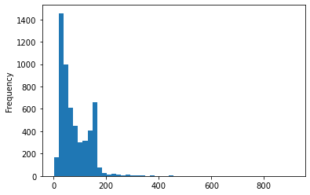
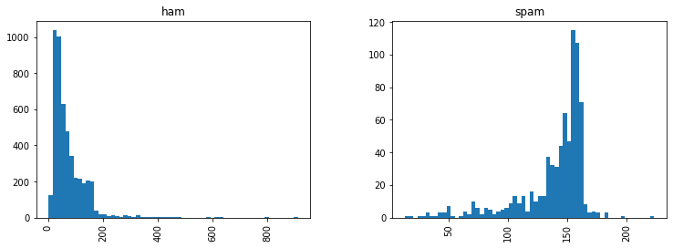

```python
import nltk
```


```python
# nltk.download_shell()
```

    NLTK Downloader
    ---------------------------------------------------------------------------
        d) Download   l) List    u) Update   c) Config   h) Help   q) Quit
    ---------------------------------------------------------------------------
    Downloader> l
    
    Packages:
      [ ] abc................. Australian Broadcasting Commission 2006
      [ ] alpino.............. Alpino Dutch Treebank
      [ ] averaged_perceptron_tagger Averaged Perceptron Tagger
      [ ] averaged_perceptron_tagger_ru Averaged Perceptron Tagger (Russian)
      [ ] basque_grammars..... Grammars for Basque
      [ ] biocreative_ppi..... BioCreAtIvE (Critical Assessment of Information
                               Extraction Systems in Biology)
      [ ] bllip_wsj_no_aux.... BLLIP Parser: WSJ Model
      [ ] book_grammars....... Grammars from NLTK Book
      [ ] brown............... Brown Corpus
      [ ] brown_tei........... Brown Corpus (TEI XML Version)
      [ ] cess_cat............ CESS-CAT Treebank
      [ ] cess_esp............ CESS-ESP Treebank
      [ ] chat80.............. Chat-80 Data Files
      [ ] city_database....... City Database
      [ ] cmudict............. The Carnegie Mellon Pronouncing Dictionary (0.6)
      [ ] comparative_sentences Comparative Sentence Dataset
      [ ] comtrans............ ComTrans Corpus Sample
      [ ] conll2000........... CONLL 2000 Chunking Corpus
      [ ] conll2002........... CONLL 2002 Named Entity Recognition Corpus
    Hit Enter to continue: 
      [ ] conll2007........... Dependency Treebanks from CoNLL 2007 (Catalan
                               and Basque Subset)
      [ ] crubadan............ Crubadan Corpus
      [ ] dependency_treebank. Dependency Parsed Treebank
      [ ] dolch............... Dolch Word List
      [ ] europarl_raw........ Sample European Parliament Proceedings Parallel
                               Corpus
      [ ] extended_omw........ Extended Open Multilingual WordNet
      [ ] floresta............ Portuguese Treebank
      [ ] framenet_v15........ FrameNet 1.5
      [ ] framenet_v17........ FrameNet 1.7
      [ ] gazetteers.......... Gazeteer Lists
      [ ] genesis............. Genesis Corpus
      [ ] gutenberg........... Project Gutenberg Selections
      [ ] ieer................ NIST IE-ER DATA SAMPLE
      [ ] inaugural........... C-Span Inaugural Address Corpus
      [ ] indian.............. Indian Language POS-Tagged Corpus
      [ ] jeita............... JEITA Public Morphologically Tagged Corpus (in
                               ChaSen format)
      [ ] kimmo............... PC-KIMMO Data Files
      [ ] knbc................ KNB Corpus (Annotated blog corpus)
    Hit Enter to continue: 
      [ ] large_grammars...... Large context-free and feature-based grammars
                               for parser comparison
      [ ] lin_thesaurus....... Lin's Dependency Thesaurus
      [ ] mac_morpho.......... MAC-MORPHO: Brazilian Portuguese news text with
                               part-of-speech tags
      [ ] machado............. Machado de Assis -- Obra Completa
      [ ] masc_tagged......... MASC Tagged Corpus
      [ ] maxent_ne_chunker... ACE Named Entity Chunker (Maximum entropy)
      [ ] maxent_treebank_pos_tagger Treebank Part of Speech Tagger (Maximum entropy)
      [ ] moses_sample........ Moses Sample Models
      [ ] movie_reviews....... Sentiment Polarity Dataset Version 2.0
      [ ] mte_teip5........... MULTEXT-East 1984 annotated corpus 4.0
      [ ] mwa_ppdb............ The monolingual word aligner (Sultan et al.
                               2015) subset of the Paraphrase Database.
      [ ] names............... Names Corpus, Version 1.3 (1994-03-29)
      [ ] nombank.1.0......... NomBank Corpus 1.0
      [ ] nonbreaking_prefixes Non-Breaking Prefixes (Moses Decoder)
      [ ] nps_chat............ NPS Chat
      [ ] omw-1.4............. Open Multilingual Wordnet
      [ ] omw................. Open Multilingual Wordnet
      [ ] opinion_lexicon..... Opinion Lexicon
    Hit Enter to continue: 
      [ ] panlex_swadesh...... PanLex Swadesh Corpora
      [ ] paradigms........... Paradigm Corpus
      [ ] pe08................ Cross-Framework and Cross-Domain Parser
                               Evaluation Shared Task
      [ ] perluniprops........ perluniprops: Index of Unicode Version 7.0.0
                               character properties in Perl
      [ ] pil................. The Patient Information Leaflet (PIL) Corpus
      [ ] pl196x.............. Polish language of the XX century sixties
      [ ] porter_test......... Porter Stemmer Test Files
      [ ] ppattach............ Prepositional Phrase Attachment Corpus
      [ ] problem_reports..... Problem Report Corpus
      [ ] product_reviews_1... Product Reviews (5 Products)
      [ ] product_reviews_2... Product Reviews (9 Products)
      [ ] propbank............ Proposition Bank Corpus 1.0
      [ ] pros_cons........... Pros and Cons
      [ ] ptb................. Penn Treebank
      [ ] punkt............... Punkt Tokenizer Models
      [ ] qc.................. Experimental Data for Question Classification
      [ ] reuters............. The Reuters-21578 benchmark corpus, ApteMod
                               version
      [ ] rslp................ RSLP Stemmer (Removedor de Sufixos da Lingua
                               Portuguesa)
    Hit Enter to continue: 
      [ ] rte................. PASCAL RTE Challenges 1, 2, and 3
      [ ] sample_grammars..... Sample Grammars
      [ ] semcor.............. SemCor 3.0
      [ ] senseval............ SENSEVAL 2 Corpus: Sense Tagged Text
      [ ] sentence_polarity... Sentence Polarity Dataset v1.0
      [ ] sentiwordnet........ SentiWordNet
      [ ] shakespeare......... Shakespeare XML Corpus Sample
      [ ] sinica_treebank..... Sinica Treebank Corpus Sample
      [ ] smultron............ SMULTRON Corpus Sample
      [ ] snowball_data....... Snowball Data
      [ ] spanish_grammars.... Grammars for Spanish
      [ ] state_union......... C-Span State of the Union Address Corpus
      [ ] stopwords........... Stopwords Corpus
      [ ] subjectivity........ Subjectivity Dataset v1.0
      [ ] swadesh............. Swadesh Wordlists
      [ ] switchboard......... Switchboard Corpus Sample
      [ ] tagsets............. Help on Tagsets
      [ ] timit............... TIMIT Corpus Sample
      [ ] toolbox............. Toolbox Sample Files
      [ ] treebank............ Penn Treebank Sample
      [ ] twitter_samples..... Twitter Samples
    Hit Enter to continue: 
      [ ] udhr2............... Universal Declaration of Human Rights Corpus
                               (Unicode Version)
      [ ] udhr................ Universal Declaration of Human Rights Corpus
      [ ] unicode_samples..... Unicode Samples
      [ ] universal_tagset.... Mappings to the Universal Part-of-Speech Tagset
      [ ] universal_treebanks_v20 Universal Treebanks Version 2.0
      [ ] vader_lexicon....... VADER Sentiment Lexicon
      [ ] verbnet3............ VerbNet Lexicon, Version 3.3
      [ ] verbnet............. VerbNet Lexicon, Version 2.1
      [ ] webtext............. Web Text Corpus
      [ ] wmt15_eval.......... Evaluation data from WMT15
      [ ] word2vec_sample..... Word2Vec Sample
      [ ] wordnet2021......... Open English Wordnet 2021
      [ ] wordnet31........... Wordnet 3.1
      [ ] wordnet............. WordNet
      [ ] wordnet_ic.......... WordNet-InfoContent
      [ ] words............... Word Lists
      [ ] ycoe................ York-Toronto-Helsinki Parsed Corpus of Old
                               English Prose
    
    Collections:
      [ ] all-corpora......... All the corpora
    Hit Enter to continue: 
      [ ] all-nltk............ All packages available on nltk_data gh-pages
                               branch
      [ ] all................. All packages
      [ ] book................ Everything used in the NLTK Book
      [ ] popular............. Popular packages
      [ ] tests............... Packages for running tests
      [ ] third-party......... Third-party data packages
    
    ([*] marks installed packages)
    
    ---------------------------------------------------------------------------
        d) Download   l) List    u) Update   c) Config   h) Help   q) Quit
    ---------------------------------------------------------------------------
    Downloader> d
    
    Download which package (l=list; x=cancel)?
      Identifier> stopwords
    

        Downloading package stopwords to
            C:\Users\bluec\AppData\Roaming\nltk_data...
          Unzipping corpora\stopwords.zip.
    

    
    ---------------------------------------------------------------------------
        d) Download   l) List    u) Update   c) Config   h) Help   q) Quit
    ---------------------------------------------------------------------------
    Downloader> q
    


```python
messages = [line.rstrip() for line in open('smsspamcollection/SMSSpamCollection', 'rt', encoding='UTF8')] # rstrip() is equal to right trim()
```


```python
print(len(messages))
```

    5574
    


```python
messages[0]
```


    'ham\tGo until jurong point, crazy.. Available only in bugis n great world la e buffet... Cine there got amore wat...'


```python
messages[50]
```


    'ham\tWhat you thinked about me. First time you saw me in class.'


```python
for mess_no, message in enumerate(messages[:10]): # enumerate shows index and value
    print(mess_no, message)
    print('\n')
```

    0 ham	Go until jurong point, crazy.. Available only in bugis n great world la e buffet... Cine there got amore wat...
    
    
    1 ham	Ok lar... Joking wif u oni...
    
    
    2 spam	Free entry in 2 a wkly comp to win FA Cup final tkts 21st May 2005. Text FA to 87121 to receive entry question(std txt rate)T&C's apply 08452810075over18's
    
    
    3 ham	U dun say so early hor... U c already then say...
    
    
    4 ham	Nah I don't think he goes to usf, he lives around here though
    
    
    5 spam	FreeMsg Hey there darling it's been 3 week's now and no word back! I'd like some fun you up for it still? Tb ok! XxX std chgs to send, £1.50 to rcv
    
    
    6 ham	Even my brother is not like to speak with me. They treat me like aids patent.
    
    
    7 ham	As per your request 'Melle Melle (Oru Minnaminunginte Nurungu Vettam)' has been set as your callertune for all Callers. Press *9 to copy your friends Callertune
    
    
    8 spam	WINNER!! As a valued network customer you have been selected to receivea £900 prize reward! To claim call 09061701461. Claim code KL341. Valid 12 hours only.
    
    
    9 spam	Had your mobile 11 months or more? U R entitled to Update to the latest colour mobiles with camera for Free! Call The Mobile Update Co FREE on 08002986030
    
    
    


```python
import pandas as pd
```


```python
messages = pd.read_csv('smsspamcollection/SMSSpamCollection', sep='\t', names=['label', 'message'])
```


```python
messages.head()
```


<div>
<style scoped>
    .dataframe tbody tr th:only-of-type {
        vertical-align: middle;
    }

    .dataframe tbody tr th {
        vertical-align: top;
    }

    .dataframe thead th {
        text-align: right;
    }
</style>
<table border="1" class="dataframe">
  <thead>
    <tr style="text-align: right;">
      <th></th>
      <th>label</th>
      <th>message</th>
    </tr>
  </thead>
  <tbody>
    <tr>
      <th>0</th>
      <td>ham</td>
      <td>Go until jurong point, crazy.. Available only ...</td>
    </tr>
    <tr>
      <th>1</th>
      <td>ham</td>
      <td>Ok lar... Joking wif u oni...</td>
    </tr>
    <tr>
      <th>2</th>
      <td>spam</td>
      <td>Free entry in 2 a wkly comp to win FA Cup fina...</td>
    </tr>
    <tr>
      <th>3</th>
      <td>ham</td>
      <td>U dun say so early hor... U c already then say...</td>
    </tr>
    <tr>
      <th>4</th>
      <td>ham</td>
      <td>Nah I don't think he goes to usf, he lives aro...</td>
    </tr>
  </tbody>
</table>
</div>


```python
messages.describe()
```


<div>
<style scoped>
    .dataframe tbody tr th:only-of-type {
        vertical-align: middle;
    }

    .dataframe tbody tr th {
        vertical-align: top;
    }

    .dataframe thead th {
        text-align: right;
    }
</style>
<table border="1" class="dataframe">
  <thead>
    <tr style="text-align: right;">
      <th></th>
      <th>label</th>
      <th>message</th>
    </tr>
  </thead>
  <tbody>
    <tr>
      <th>count</th>
      <td>5572</td>
      <td>5572</td>
    </tr>
    <tr>
      <th>unique</th>
      <td>2</td>
      <td>5169</td>
    </tr>
    <tr>
      <th>top</th>
      <td>ham</td>
      <td>Sorry, I'll call later</td>
    </tr>
    <tr>
      <th>freq</th>
      <td>4825</td>
      <td>30</td>
    </tr>
  </tbody>
</table>
</div>


```python
messages.groupby('label').describe()
```


<div>
<style scoped>
    .dataframe tbody tr th:only-of-type {
        vertical-align: middle;
    }

    .dataframe tbody tr th {
        vertical-align: top;
    }

    .dataframe thead tr th {
        text-align: left;
    }

    .dataframe thead tr:last-of-type th {
        text-align: right;
    }
</style>
<table border="1" class="dataframe">
  <thead>
    <tr>
      <th></th>
      <th colspan="4" halign="left">message</th>
    </tr>
    <tr>
      <th></th>
      <th>count</th>
      <th>unique</th>
      <th>top</th>
      <th>freq</th>
    </tr>
    <tr>
      <th>label</th>
      <th></th>
      <th></th>
      <th></th>
      <th></th>
    </tr>
  </thead>
  <tbody>
    <tr>
      <th>ham</th>
      <td>4825</td>
      <td>4516</td>
      <td>Sorry, I'll call later</td>
      <td>30</td>
    </tr>
    <tr>
      <th>spam</th>
      <td>747</td>
      <td>653</td>
      <td>Please call our customer service representativ...</td>
      <td>4</td>
    </tr>
  </tbody>
</table>
</div>


```python
messages['length'] = messages['message'].apply(len)
```


```python
messages
```


<div>
<style scoped>
    .dataframe tbody tr th:only-of-type {
        vertical-align: middle;
    }

    .dataframe tbody tr th {
        vertical-align: top;
    }

    .dataframe thead th {
        text-align: right;
    }
</style>
<table border="1" class="dataframe">
  <thead>
    <tr style="text-align: right;">
      <th></th>
      <th>label</th>
      <th>message</th>
      <th>length</th>
    </tr>
  </thead>
  <tbody>
    <tr>
      <th>0</th>
      <td>ham</td>
      <td>Go until jurong point, crazy.. Available only ...</td>
      <td>111</td>
    </tr>
    <tr>
      <th>1</th>
      <td>ham</td>
      <td>Ok lar... Joking wif u oni...</td>
      <td>29</td>
    </tr>
    <tr>
      <th>2</th>
      <td>spam</td>
      <td>Free entry in 2 a wkly comp to win FA Cup fina...</td>
      <td>155</td>
    </tr>
    <tr>
      <th>3</th>
      <td>ham</td>
      <td>U dun say so early hor... U c already then say...</td>
      <td>49</td>
    </tr>
    <tr>
      <th>4</th>
      <td>ham</td>
      <td>Nah I don't think he goes to usf, he lives aro...</td>
      <td>61</td>
    </tr>
    <tr>
      <th>...</th>
      <td>...</td>
      <td>...</td>
      <td>...</td>
    </tr>
    <tr>
      <th>5567</th>
      <td>spam</td>
      <td>This is the 2nd time we have tried 2 contact u...</td>
      <td>160</td>
    </tr>
    <tr>
      <th>5568</th>
      <td>ham</td>
      <td>Will ü b going to esplanade fr home?</td>
      <td>36</td>
    </tr>
    <tr>
      <th>5569</th>
      <td>ham</td>
      <td>Pity, * was in mood for that. So...any other s...</td>
      <td>57</td>
    </tr>
    <tr>
      <th>5570</th>
      <td>ham</td>
      <td>The guy did some bitching but I acted like i'd...</td>
      <td>125</td>
    </tr>
    <tr>
      <th>5571</th>
      <td>ham</td>
      <td>Rofl. Its true to its name</td>
      <td>26</td>
    </tr>
  </tbody>
</table>
<p>5572 rows × 3 columns</p>
</div>


```python
import matplotlib.pyplot as plt
import seaborn as sns
%matplotlib inline
```


```python
messages['length'].plot.hist(bins=50)
```


    <AxesSubplot:ylabel='Frequency'>


    

    


```python
messages['length'].describe()
```


    count    5572.000000
    mean       80.489950
    std        59.942907
    min         2.000000
    25%        36.000000
    50%        62.000000
    75%       122.000000
    max       910.000000
    Name: length, dtype: float64


```python
messages[messages['length'] == 910]['message'].iloc[0]
```


    "For me the love should start with attraction.i should feel that I need her every time around me.she should be the first thing which comes in my thoughts.I would start the day and end it with her.she should be there every time I dream.love will be then when my every breath has her name.my life should happen around her.my life will be named to her.I would cry for her.will give all my happiness and take all her sorrows.I will be ready to fight with anyone for her.I will be in love when I will be doing the craziest things for her.love will be when I don't have to proove anyone that my girl is the most beautiful lady on the whole planet.I will always be singing praises for her.love will be when I start up making chicken curry and end up makiing sambar.life will be the most beautiful then.will get every morning and thank god for the day because she is with me.I would like to say a lot..will tell later.."


```python
messages.hist(column='length', by='label', bins=60, figsize=(12,4))
```


    array([<AxesSubplot:title={'center':'ham'}>,
           <AxesSubplot:title={'center':'spam'}>], dtype=object)


    

    


```python
import string
```


```python
mess = 'Sample message! Notice: it has punctuation.'
```


```python
string.punctuation
```


    '!"#$%&\'()*+,-./:;<=>?@[\\]^_`{|}~'


```python
nopunc = [c for c in mess if c not in string.punctuation]
```


```python
nopunc
```


    ['S',
     'a',
     'm',
     'p',
     'l',
     'e',
     ' ',
     'm',
     'e',
     's',
     's',
     'a',
     'g',
     'e',
     ' ',
     'N',
     'o',
     't',
     'i',
     'c',
     'e',
     ' ',
     'i',
     't',
     ' ',
     'h',
     'a',
     's',
     ' ',
     'p',
     'u',
     'n',
     'c',
     't',
     'u',
     'a',
     't',
     'i',
     'o',
     'n']


```python
from nltk.corpus import stopwords
```


```python
stopwords.words('english')
```


    ['i',
     'me',
     'my',
     'myself',
     'we',
     'our',
     'ours',
     'ourselves',
     'you',
     "you're",
     "you've",
     "you'll",
     "you'd",
     'your',
     'yours',
     'yourself',
     'yourselves',
     'he',
     'him',
     'his',
     'himself',
     'she',
     "she's",
     'her',
     'hers',
     'herself',
     'it',
     "it's",
     'its',
     'itself',
     'they',
     'them',
     'their',
     'theirs',
     'themselves',
     'what',
     'which',
     'who',
     'whom',
     'this',
     'that',
     "that'll",
     'these',
     'those',
     'am',
     'is',
     'are',
     'was',
     'were',
     'be',
     'been',
     'being',
     'have',
     'has',
     'had',
     'having',
     'do',
     'does',
     'did',
     'doing',
     'a',
     'an',
     'the',
     'and',
     'but',
     'if',
     'or',
     'because',
     'as',
     'until',
     'while',
     'of',
     'at',
     'by',
     'for',
     'with',
     'about',
     'against',
     'between',
     'into',
     'through',
     'during',
     'before',
     'after',
     'above',
     'below',
     'to',
     'from',
     'up',
     'down',
     'in',
     'out',
     'on',
     'off',
     'over',
     'under',
     'again',
     'further',
     'then',
     'once',
     'here',
     'there',
     'when',
     'where',
     'why',
     'how',
     'all',
     'any',
     'both',
     'each',
     'few',
     'more',
     'most',
     'other',
     'some',
     'such',
     'no',
     'nor',
     'not',
     'only',
     'own',
     'same',
     'so',
     'than',
     'too',
     'very',
     's',
     't',
     'can',
     'will',
     'just',
     'don',
     "don't",
     'should',
     "should've",
     'now',
     'd',
     'll',
     'm',
     'o',
     're',
     've',
     'y',
     'ain',
     'aren',
     "aren't",
     'couldn',
     "couldn't",
     'didn',
     "didn't",
     'doesn',
     "doesn't",
     'hadn',
     "hadn't",
     'hasn',
     "hasn't",
     'haven',
     "haven't",
     'isn',
     "isn't",
     'ma',
     'mightn',
     "mightn't",
     'mustn',
     "mustn't",
     'needn',
     "needn't",
     'shan',
     "shan't",
     'shouldn',
     "shouldn't",
     'wasn',
     "wasn't",
     'weren',
     "weren't",
     'won',
     "won't",
     'wouldn',
     "wouldn't"]


```python
nopunc = ''.join(nopunc)
```


```python
nopunc
```


    'Sample message Notice it has punctuation'


```python
x = ['a', 'b', 'c', 'd']
```


```python
x
```


    ['a', 'b', 'c', 'd']


```python
''.join(x)
```


    'abcd'


```python

```


```python
nopunc.split()
```


    ['Sample', 'message', 'Notice', 'it', 'has', 'punctuation']


```python
clean_mess = [word for word in nopunc.split() if word.lower() not in stopwords.words('english')]
```


```python
clean_mess
```


    ['Sample', 'message', 'Notice', 'punctuation']


```python
def text_process(mess):
    """
    1. remove puncuation
    2. remove stop words
    3. return list of clean text words
    """
    nopunc = [char for char in mess if char not in string.punctuation]
    
    nopunc = ''.join(nopunc)
    
    return [word for word in nopunc.split() if word.lower() not in stopwords.words('english')]
```


```python
messages.head()
```


<div>
<style scoped>
    .dataframe tbody tr th:only-of-type {
        vertical-align: middle;
    }

    .dataframe tbody tr th {
        vertical-align: top;
    }

    .dataframe thead th {
        text-align: right;
    }
</style>
<table border="1" class="dataframe">
  <thead>
    <tr style="text-align: right;">
      <th></th>
      <th>label</th>
      <th>message</th>
      <th>length</th>
    </tr>
  </thead>
  <tbody>
    <tr>
      <th>0</th>
      <td>ham</td>
      <td>Go until jurong point, crazy.. Available only ...</td>
      <td>111</td>
    </tr>
    <tr>
      <th>1</th>
      <td>ham</td>
      <td>Ok lar... Joking wif u oni...</td>
      <td>29</td>
    </tr>
    <tr>
      <th>2</th>
      <td>spam</td>
      <td>Free entry in 2 a wkly comp to win FA Cup fina...</td>
      <td>155</td>
    </tr>
    <tr>
      <th>3</th>
      <td>ham</td>
      <td>U dun say so early hor... U c already then say...</td>
      <td>49</td>
    </tr>
    <tr>
      <th>4</th>
      <td>ham</td>
      <td>Nah I don't think he goes to usf, he lives aro...</td>
      <td>61</td>
    </tr>
  </tbody>
</table>
</div>


```python
messages['message'].head().apply(text_process)
```


    0    [Go, jurong, point, crazy, Available, bugis, n...
    1                       [Ok, lar, Joking, wif, u, oni]
    2    [Free, entry, 2, wkly, comp, win, FA, Cup, fin...
    3        [U, dun, say, early, hor, U, c, already, say]
    4    [Nah, dont, think, goes, usf, lives, around, t...
    Name: message, dtype: object


```python
from sklearn.feature_extraction.text import CountVectorizer
```


```python
bow_transformer = CountVectorizer(analyzer=text_process).fit(messages['message']) # back or words
```


```python
print(len(bow_transformer.vocabulary_))
```

    11425
    


```python
mess4 = messages['message'][3]
```


```python
print(mess4)
```

    U dun say so early hor... U c already then say...
    


```python
bow4 = bow_transformer.transform([mess4])
```


```python
print(bow4)
```

      (0, 4068)	2
      (0, 4629)	1
      (0, 5261)	1
      (0, 6204)	1
      (0, 6222)	1
      (0, 7186)	1
      (0, 9554)	2
    


```python
print(bow4.shape)
```

    (1, 11425)
    


```python
bow_transformer.get_feature_names()[4068]
```


    'U'


```python
bow_transformer.get_feature_names()[9554]
```


    'say'


```python
messages_bow = bow_transformer.transform(messages['message'])
```


```python
print('Shape of Sparse Matrix: ', messages_bow.shape)
```

    Shape of Sparse Matrix:  (5572, 11425)
    


```python
messages_bow.nnz # non zero occurrence
```


    50548


```python
sparsity = (100.0 * messages_bow.nnz / (messages_bow.shape[0] * messages_bow.shape[1]))
print('sparsity: {}'.format(sparsity))
```

    sparsity: 0.07940295412668218
    


```python
from sklearn.feature_extraction.text import TfidfTransformer
```


```python
tfidf_transformer = TfidfTransformer().fit(messages_bow) # Tfidf: Term frequence inverse document frequency
```


```python
tfidf4 = tfidf_transformer.transform(bow4)
```


```python
print(tfidf4)
```

      (0, 9554)	0.5385626262927564
      (0, 7186)	0.4389365653379857
      (0, 6222)	0.3187216892949149
      (0, 6204)	0.29953799723697416
      (0, 5261)	0.29729957405868723
      (0, 4629)	0.26619801906087187
      (0, 4068)	0.40832589933384067
    


```python
tfidf_transformer.idf_[bow_transformer.vocabulary_['university']]
```


    8.527076498901426


```python
messages_tfidf = tfidf_transformer.transform(messages_bow)
```


```python
from sklearn.naive_bayes import MultinomialNB
```


```python
spam_detect_model = MultinomialNB().fit(messages_tfidf, messages['label'])
```


```python
spam_detect_model.predict(tfidf4)
```


    array(['ham'], dtype='<U4')


```python
spam_detect_model.predict(tfidf4)[0]
```


    'ham'


```python
messages['label'].head()
```


    0     ham
    1     ham
    2    spam
    3     ham
    4     ham
    Name: label, dtype: object


```python
messages['label'][3]
```


    'ham'


```python
all_pred = spam_detect_model.predict(messages_tfidf)
```


```python
from sklearn.model_selection import train_test_split
```


```python
msg_train, msg_test, label_train, label_test = train_test_split(messages['message'], messages['label'], test_size=0.3)
```


```python
msg_train
```


    5220                  I have to take exam with in march 3
    3057                             Webpage s not available!
    1121             Cancel cheyyamo?and get some money back?
    3242      Ok i've sent u da latest version of da project.
    3037                     ;-) ok. I feel like john lennon.
                                  ...                        
    4478    Oh :-)only 4 outside players allowed to play know
    2480    Sppok up ur mob with a Halloween collection of...
    5035                          I want to go to perumbavoor
    2478    I'm done. I'm sorry. I hope your next space gi...
    3927                          I havent add ü yet right.. 
    Name: message, Length: 3900, dtype: object


```python
from sklearn.pipeline import Pipeline
```


```python

```


```python
pipeline = Pipeline([
    ('bow', CountVectorizer(analyzer=text_process)),
    ('tfidf', TfidfTransformer()),
    ('classifier', MultinomialNB())
])
```


```python
pipeline.fit(msg_train, label_train)
```


    Pipeline(steps=[('bow',
                     CountVectorizer(analyzer=<function text_process at 0x00000160BE944AF0>)),
                    ('tfidf', TfidfTransformer()),
                    ('classifier', MultinomialNB())])


```python
predictions = pipeline.predict(msg_test)
```


```python
from sklearn.metrics import classification_report
```


```python
print(classification_report(label_test, predictions))
```

                  precision    recall  f1-score   support
    
             ham       0.95      1.00      0.98      1435
            spam       1.00      0.70      0.82       237
    
        accuracy                           0.96      1672
       macro avg       0.98      0.85      0.90      1672
    weighted avg       0.96      0.96      0.95      1672
    
    


```python
from sklearn.ensemble import RandomForestClassifier
```


```python
pipeline = Pipeline([
    ('bow', CountVectorizer(analyzer=text_process)),
    ('tfidf', TfidfTransformer()),
    ('classifier', RandomForestClassifier())
])
```


```python
pipeline.fit(msg_train, label_train)
```


    Pipeline(steps=[('bow',
                     CountVectorizer(analyzer=<function text_process at 0x00000160BE944AF0>)),
                    ('tfidf', TfidfTransformer()),
                    ('classifier', RandomForestClassifier())])


```python
predictions = pipeline.predict(msg_test)
```


```python
from sklearn.metrics import classification_report
```


```python
print(classification_report(label_test, predictions))
```

                  precision    recall  f1-score   support
    
             ham       0.96      1.00      0.98      1435
            spam       1.00      0.76      0.87       237
    
        accuracy                           0.97      1672
       macro avg       0.98      0.88      0.92      1672
    weighted avg       0.97      0.97      0.96      1672
    
    


```python

```
