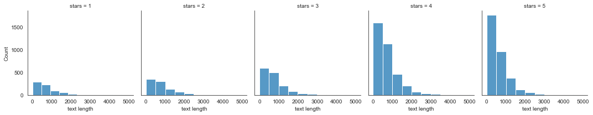
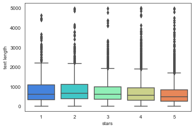
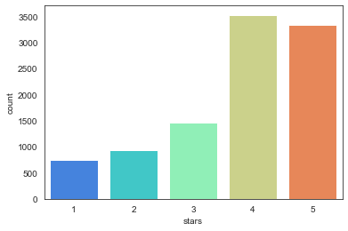
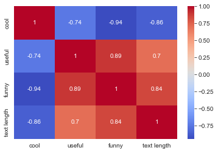
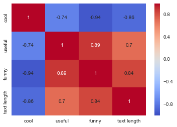
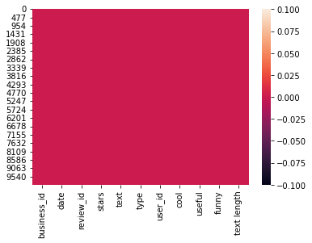

___

<a href='http://www.pieriandata.com'> </a>
___

# Natural Language Processing Project

Welcome to the NLP Project for this section of the course. In this NLP project you will be attempting to classify Yelp Reviews into 1 star or 5 star categories based off the text content in the reviews. This will be a simpler procedure than the lecture, since we will utilize the pipeline methods for more complex tasks.

We will use the [Yelp Review Data Set from Kaggle](https://www.kaggle.com/c/yelp-recsys-2013).

Each observation in this dataset is a review of a particular business by a particular user.

The "stars" column is the number of stars (1 through 5) assigned by the reviewer to the business. (Higher stars is better.) In other words, it is the rating of the business by the person who wrote the review.

The "cool" column is the number of "cool" votes this review received from other Yelp users. 

All reviews start with 0 "cool" votes, and there is no limit to how many "cool" votes a review can receive. In other words, it is a rating of the review itself, not a rating of the business.

The "useful" and "funny" columns are similar to the "cool" column.

Let's get started! Just follow the directions below!

## Imports
 **Import the usual suspects. :) **


```python
import numpy as np
import pandas as pd
import matplotlib.pyplot as plt
import seaborn as sns
%matplotlib inline
```

## The Data

**Read the yelp.csv file and set it as a dataframe called yelp.**


```python
yelp = pd.read_csv('yelp.csv')
```

** Check the head, info , and describe methods on yelp.**


```python
yelp.head()
```


<div>
<style scoped>
    .dataframe tbody tr th:only-of-type {
        vertical-align: middle;
    }

    .dataframe tbody tr th {
        vertical-align: top;
    }

    .dataframe thead th {
        text-align: right;
    }
</style>
<table border="1" class="dataframe">
  <thead>
    <tr style="text-align: right;">
      <th></th>
      <th>business_id</th>
      <th>date</th>
      <th>review_id</th>
      <th>stars</th>
      <th>text</th>
      <th>type</th>
      <th>user_id</th>
      <th>cool</th>
      <th>useful</th>
      <th>funny</th>
    </tr>
  </thead>
  <tbody>
    <tr>
      <th>0</th>
      <td>9yKzy9PApeiPPOUJEtnvkg</td>
      <td>2011-01-26</td>
      <td>fWKvX83p0-ka4JS3dc6E5A</td>
      <td>5</td>
      <td>My wife took me here on my birthday for breakf...</td>
      <td>review</td>
      <td>rLtl8ZkDX5vH5nAx9C3q5Q</td>
      <td>2</td>
      <td>5</td>
      <td>0</td>
    </tr>
    <tr>
      <th>1</th>
      <td>ZRJwVLyzEJq1VAihDhYiow</td>
      <td>2011-07-27</td>
      <td>IjZ33sJrzXqU-0X6U8NwyA</td>
      <td>5</td>
      <td>I have no idea why some people give bad review...</td>
      <td>review</td>
      <td>0a2KyEL0d3Yb1V6aivbIuQ</td>
      <td>0</td>
      <td>0</td>
      <td>0</td>
    </tr>
    <tr>
      <th>2</th>
      <td>6oRAC4uyJCsJl1X0WZpVSA</td>
      <td>2012-06-14</td>
      <td>IESLBzqUCLdSzSqm0eCSxQ</td>
      <td>4</td>
      <td>love the gyro plate. Rice is so good and I als...</td>
      <td>review</td>
      <td>0hT2KtfLiobPvh6cDC8JQg</td>
      <td>0</td>
      <td>1</td>
      <td>0</td>
    </tr>
    <tr>
      <th>3</th>
      <td>_1QQZuf4zZOyFCvXc0o6Vg</td>
      <td>2010-05-27</td>
      <td>G-WvGaISbqqaMHlNnByodA</td>
      <td>5</td>
      <td>Rosie, Dakota, and I LOVE Chaparral Dog Park!!...</td>
      <td>review</td>
      <td>uZetl9T0NcROGOyFfughhg</td>
      <td>1</td>
      <td>2</td>
      <td>0</td>
    </tr>
    <tr>
      <th>4</th>
      <td>6ozycU1RpktNG2-1BroVtw</td>
      <td>2012-01-05</td>
      <td>1uJFq2r5QfJG_6ExMRCaGw</td>
      <td>5</td>
      <td>General Manager Scott Petello is a good egg!!!...</td>
      <td>review</td>
      <td>vYmM4KTsC8ZfQBg-j5MWkw</td>
      <td>0</td>
      <td>0</td>
      <td>0</td>
    </tr>
  </tbody>
</table>
</div>


```python
yelp.info()
```

    <class 'pandas.core.frame.DataFrame'>
    RangeIndex: 10000 entries, 0 to 9999
    Data columns (total 10 columns):
     #   Column       Non-Null Count  Dtype 
    ---  ------       --------------  ----- 
     0   business_id  10000 non-null  object
     1   date         10000 non-null  object
     2   review_id    10000 non-null  object
     3   stars        10000 non-null  int64 
     4   text         10000 non-null  object
     5   type         10000 non-null  object
     6   user_id      10000 non-null  object
     7   cool         10000 non-null  int64 
     8   useful       10000 non-null  int64 
     9   funny        10000 non-null  int64 
    dtypes: int64(4), object(6)
    memory usage: 781.4+ KB
    


```python
yelp.describe()
```


<div>
<style scoped>
    .dataframe tbody tr th:only-of-type {
        vertical-align: middle;
    }

    .dataframe tbody tr th {
        vertical-align: top;
    }

    .dataframe thead th {
        text-align: right;
    }
</style>
<table border="1" class="dataframe">
  <thead>
    <tr style="text-align: right;">
      <th></th>
      <th>stars</th>
      <th>cool</th>
      <th>useful</th>
      <th>funny</th>
    </tr>
  </thead>
  <tbody>
    <tr>
      <th>count</th>
      <td>10000.000000</td>
      <td>10000.000000</td>
      <td>10000.000000</td>
      <td>10000.000000</td>
    </tr>
    <tr>
      <th>mean</th>
      <td>3.777500</td>
      <td>0.876800</td>
      <td>1.409300</td>
      <td>0.701300</td>
    </tr>
    <tr>
      <th>std</th>
      <td>1.214636</td>
      <td>2.067861</td>
      <td>2.336647</td>
      <td>1.907942</td>
    </tr>
    <tr>
      <th>min</th>
      <td>1.000000</td>
      <td>0.000000</td>
      <td>0.000000</td>
      <td>0.000000</td>
    </tr>
    <tr>
      <th>25%</th>
      <td>3.000000</td>
      <td>0.000000</td>
      <td>0.000000</td>
      <td>0.000000</td>
    </tr>
    <tr>
      <th>50%</th>
      <td>4.000000</td>
      <td>0.000000</td>
      <td>1.000000</td>
      <td>0.000000</td>
    </tr>
    <tr>
      <th>75%</th>
      <td>5.000000</td>
      <td>1.000000</td>
      <td>2.000000</td>
      <td>1.000000</td>
    </tr>
    <tr>
      <th>max</th>
      <td>5.000000</td>
      <td>77.000000</td>
      <td>76.000000</td>
      <td>57.000000</td>
    </tr>
  </tbody>
</table>
</div>


**Create a new column called "text length" which is the number of words in the text column.**


```python
yelp['text length'] = yelp['text'].apply(len)
```


```python
yelp.head()
```


<div>
<style scoped>
    .dataframe tbody tr th:only-of-type {
        vertical-align: middle;
    }

    .dataframe tbody tr th {
        vertical-align: top;
    }

    .dataframe thead th {
        text-align: right;
    }
</style>
<table border="1" class="dataframe">
  <thead>
    <tr style="text-align: right;">
      <th></th>
      <th>business_id</th>
      <th>date</th>
      <th>review_id</th>
      <th>stars</th>
      <th>text</th>
      <th>type</th>
      <th>user_id</th>
      <th>cool</th>
      <th>useful</th>
      <th>funny</th>
      <th>text length</th>
    </tr>
  </thead>
  <tbody>
    <tr>
      <th>0</th>
      <td>9yKzy9PApeiPPOUJEtnvkg</td>
      <td>2011-01-26</td>
      <td>fWKvX83p0-ka4JS3dc6E5A</td>
      <td>5</td>
      <td>My wife took me here on my birthday for breakf...</td>
      <td>review</td>
      <td>rLtl8ZkDX5vH5nAx9C3q5Q</td>
      <td>2</td>
      <td>5</td>
      <td>0</td>
      <td>889</td>
    </tr>
    <tr>
      <th>1</th>
      <td>ZRJwVLyzEJq1VAihDhYiow</td>
      <td>2011-07-27</td>
      <td>IjZ33sJrzXqU-0X6U8NwyA</td>
      <td>5</td>
      <td>I have no idea why some people give bad review...</td>
      <td>review</td>
      <td>0a2KyEL0d3Yb1V6aivbIuQ</td>
      <td>0</td>
      <td>0</td>
      <td>0</td>
      <td>1345</td>
    </tr>
    <tr>
      <th>2</th>
      <td>6oRAC4uyJCsJl1X0WZpVSA</td>
      <td>2012-06-14</td>
      <td>IESLBzqUCLdSzSqm0eCSxQ</td>
      <td>4</td>
      <td>love the gyro plate. Rice is so good and I als...</td>
      <td>review</td>
      <td>0hT2KtfLiobPvh6cDC8JQg</td>
      <td>0</td>
      <td>1</td>
      <td>0</td>
      <td>76</td>
    </tr>
    <tr>
      <th>3</th>
      <td>_1QQZuf4zZOyFCvXc0o6Vg</td>
      <td>2010-05-27</td>
      <td>G-WvGaISbqqaMHlNnByodA</td>
      <td>5</td>
      <td>Rosie, Dakota, and I LOVE Chaparral Dog Park!!...</td>
      <td>review</td>
      <td>uZetl9T0NcROGOyFfughhg</td>
      <td>1</td>
      <td>2</td>
      <td>0</td>
      <td>419</td>
    </tr>
    <tr>
      <th>4</th>
      <td>6ozycU1RpktNG2-1BroVtw</td>
      <td>2012-01-05</td>
      <td>1uJFq2r5QfJG_6ExMRCaGw</td>
      <td>5</td>
      <td>General Manager Scott Petello is a good egg!!!...</td>
      <td>review</td>
      <td>vYmM4KTsC8ZfQBg-j5MWkw</td>
      <td>0</td>
      <td>0</td>
      <td>0</td>
      <td>469</td>
    </tr>
  </tbody>
</table>
</div>


# EDA

Let's explore the data

## Imports

**Import the data visualization libraries if you haven't done so already.**


```python
sns.set_style('white')
```

**Use FacetGrid from the seaborn library to create a grid of 5 histograms of text length based off of the star ratings. Reference the seaborn documentation for hints on this**


```python
g = sns.FacetGrid(data=yelp, col='stars')
g.map(sns.histplot, 'text length', bins=10)
```


    <seaborn.axisgrid.FacetGrid at 0x159b4798c70>


    

    


```python

```


    <seaborn.axisgrid.FacetGrid at 0x121e705f8>


    

    


**Create a boxplot of text length for each star category.**


```python
sns.boxplot(x='stars', y='text length', data=yelp, palette='rainbow')
```


    <AxesSubplot:xlabel='stars', ylabel='text length'>


    

    


```python

```


    <matplotlib.axes._subplots.AxesSubplot at 0x121283470>


    

    


**Create a countplot of the number of occurrences for each type of star rating.**


```python
sns.countplot(data=yelp, x='stars', palette='rainbow')
```


    <AxesSubplot:xlabel='stars', ylabel='count'>


    

    


```python

```


    <matplotlib.axes._subplots.AxesSubplot at 0x12578fc88>


    

    


** Use groupby to get the mean values of the numerical columns, you should be able to create this dataframe with the operation:**


```python
stars = yelp.groupby('stars').mean()
```


```python

```


<div>
<table border="1" class="dataframe">
  <thead>
    <tr style="text-align: right;">
      <th></th>
      <th>cool</th>
      <th>useful</th>
      <th>funny</th>
      <th>text length</th>
    </tr>
    <tr>
      <th>stars</th>
      <th></th>
      <th></th>
      <th></th>
      <th></th>
    </tr>
  </thead>
  <tbody>
    <tr>
      <th>1</th>
      <td>0.576769</td>
      <td>1.604806</td>
      <td>1.056075</td>
      <td>826.515354</td>
    </tr>
    <tr>
      <th>2</th>
      <td>0.719525</td>
      <td>1.563107</td>
      <td>0.875944</td>
      <td>842.256742</td>
    </tr>
    <tr>
      <th>3</th>
      <td>0.788501</td>
      <td>1.306639</td>
      <td>0.694730</td>
      <td>758.498289</td>
    </tr>
    <tr>
      <th>4</th>
      <td>0.954623</td>
      <td>1.395916</td>
      <td>0.670448</td>
      <td>712.923142</td>
    </tr>
    <tr>
      <th>5</th>
      <td>0.944261</td>
      <td>1.381780</td>
      <td>0.608631</td>
      <td>624.999101</td>
    </tr>
  </tbody>
</table>
</div>


**Use the corr() method on that groupby dataframe to produce this dataframe:**


```python
stars.corr()
```


<div>
<style scoped>
    .dataframe tbody tr th:only-of-type {
        vertical-align: middle;
    }

    .dataframe tbody tr th {
        vertical-align: top;
    }

    .dataframe thead th {
        text-align: right;
    }
</style>
<table border="1" class="dataframe">
  <thead>
    <tr style="text-align: right;">
      <th></th>
      <th>cool</th>
      <th>useful</th>
      <th>funny</th>
      <th>text length</th>
    </tr>
  </thead>
  <tbody>
    <tr>
      <th>cool</th>
      <td>1.000000</td>
      <td>-0.743329</td>
      <td>-0.944939</td>
      <td>-0.857664</td>
    </tr>
    <tr>
      <th>useful</th>
      <td>-0.743329</td>
      <td>1.000000</td>
      <td>0.894506</td>
      <td>0.699881</td>
    </tr>
    <tr>
      <th>funny</th>
      <td>-0.944939</td>
      <td>0.894506</td>
      <td>1.000000</td>
      <td>0.843461</td>
    </tr>
    <tr>
      <th>text length</th>
      <td>-0.857664</td>
      <td>0.699881</td>
      <td>0.843461</td>
      <td>1.000000</td>
    </tr>
  </tbody>
</table>
</div>


```python

```


<div>
<table border="1" class="dataframe">
  <thead>
    <tr style="text-align: right;">
      <th></th>
      <th>cool</th>
      <th>useful</th>
      <th>funny</th>
      <th>text length</th>
    </tr>
  </thead>
  <tbody>
    <tr>
      <th>cool</th>
      <td>1.000000</td>
      <td>-0.743329</td>
      <td>-0.944939</td>
      <td>-0.857664</td>
    </tr>
    <tr>
      <th>useful</th>
      <td>-0.743329</td>
      <td>1.000000</td>
      <td>0.894506</td>
      <td>0.699881</td>
    </tr>
    <tr>
      <th>funny</th>
      <td>-0.944939</td>
      <td>0.894506</td>
      <td>1.000000</td>
      <td>0.843461</td>
    </tr>
    <tr>
      <th>text length</th>
      <td>-0.857664</td>
      <td>0.699881</td>
      <td>0.843461</td>
      <td>1.000000</td>
    </tr>
  </tbody>
</table>
</div>


**Then use seaborn to create a heatmap based off that .corr() dataframe:**


```python
sns.heatmap(stars.corr(), cmap='coolwarm', annot=True)
```


    <AxesSubplot:>


    

    


```python

```


    <matplotlib.axes._subplots.AxesSubplot at 0x120edb828>


    

    


## NLP Classification Task

Let's move on to the actual task. To make things a little easier, go ahead and only grab reviews that were either 1 star or 5 stars.

**Create a dataframe called yelp_class that contains the columns of yelp dataframe but for only the 1 or 5 star reviews.**


```python

```


```python
yelp_class = yelp[(yelp['stars'] == 1) | (yelp['stars'] == 5)]
```


```python
yelp_class.info()
```

    <class 'pandas.core.frame.DataFrame'>
    Int64Index: 4086 entries, 0 to 9999
    Data columns (total 11 columns):
     #   Column       Non-Null Count  Dtype 
    ---  ------       --------------  ----- 
     0   business_id  4086 non-null   object
     1   date         4086 non-null   object
     2   review_id    4086 non-null   object
     3   stars        4086 non-null   int64 
     4   text         4086 non-null   object
     5   type         4086 non-null   object
     6   user_id      4086 non-null   object
     7   cool         4086 non-null   int64 
     8   useful       4086 non-null   int64 
     9   funny        4086 non-null   int64 
     10  text length  4086 non-null   int64 
    dtypes: int64(5), object(6)
    memory usage: 383.1+ KB
    


```python
sns.heatmap(yelp.isnull())
```


    <AxesSubplot:>


    

    


```python

```

** Create two objects X and y. X will be the 'text' column of yelp_class and y will be the 'stars' column of yelp_class. (Your features and target/labels)**


```python
X = yelp_class['text']
y = yelp_class['stars']
```


```python
X.head()
```


    0    My wife took me here on my birthday for breakf...
    1    I have no idea why some people give bad review...
    3    Rosie, Dakota, and I LOVE Chaparral Dog Park!!...
    4    General Manager Scott Petello is a good egg!!!...
    6    Drop what you're doing and drive here. After I...
    Name: text, dtype: object


```python
y.head()
```


    0    5
    1    5
    3    5
    4    5
    6    5
    Name: stars, dtype: int64


```python

```

**Import CountVectorizer and create a CountVectorizer object.**


```python
from sklearn.feature_extraction.text import CountVectorizer
```


```python
cv = CountVectorizer()
```

** Use the fit_transform method on the CountVectorizer object and pass in X (the 'text' column). Save this result by overwriting X.**


```python
X = cv.fit_transform(X)
```

## Train Test Split

Let's split our data into training and testing data.

** Use train_test_split to split up the data into X_train, X_test, y_train, y_test. Use test_size=0.3 and random_state=101 **


```python
from sklearn.model_selection import train_test_split
```


```python
X_train, X_test, y_train, y_test = train_test_split(X, y, test_size=0.3, random_state=101)
```

## Training a Model

Time to train a model!

** Import MultinomialNB and create an instance of the estimator and call is nb **


```python
from sklearn.naive_bayes import MultinomialNB
```


```python
nb = MultinomialNB()
```

**Now fit nb using the training data.**


```python
nb.fit(X_train, y_train)
```


    MultinomialNB()


```python

```


    MultinomialNB(alpha=1.0, class_prior=None, fit_prior=True)


## Predictions and Evaluations

Time to see how our model did!

**Use the predict method off of nb to predict labels from X_test.**


```python
predictions = nb.predict(X_test)
```


```python

```

** Create a confusion matrix and classification report using these predictions and y_test **


```python
from sklearn.metrics import confusion_matrix, classification_report
```


```python
print(confusion_matrix(y_test, predictions))
print(classification_report(y_test, predictions))
```

    [[159  69]
     [ 22 976]]
                  precision    recall  f1-score   support
    
               1       0.88      0.70      0.78       228
               5       0.93      0.98      0.96       998
    
        accuracy                           0.93      1226
       macro avg       0.91      0.84      0.87      1226
    weighted avg       0.92      0.93      0.92      1226
    
    


```python

```


```python

```

    [[159  69]
     [ 22 976]]
    
    
                 precision    recall  f1-score   support
    
              1       0.88      0.70      0.78       228
              5       0.93      0.98      0.96       998
    
    avg / total       0.92      0.93      0.92      1226
    
    

**Great! Let's see what happens if we try to include TF-IDF to this process using a pipeline.**

# Using Text Processing

** Import TfidfTransformer from sklearn. **


```python
from sklearn.feature_extraction.text import TfidfTransformer
```

** Import Pipeline from sklearn. **


```python
from sklearn.pipeline import Pipeline
```

** Now create a pipeline with the following steps:CountVectorizer(), TfidfTransformer(),MultinomialNB()**


```python
pipe = Pipeline([
    ('bow', CountVectorizer(analyzer='word')),
    ('tfidf', TfidfTransformer()),
    ('model', MultinomialNB())
])
```

## Using the Pipeline

**Time to use the pipeline! Remember this pipeline has all your pre-process steps in it already, meaning we'll need to re-split the original data (Remember that we overwrote X as the CountVectorized version. What we need is just the text**

### Train Test Split

**Redo the train test split on the yelp_class object.**


```python
X_pipeline = yelp_class['text']
y_pipeline = yelp_class['stars']
```


```python
X_train, X_test, y_train, y_test = train_test_split(X_pipeline, y_pipeline, test_size=0.3, random_state=101)
```

**Now fit the pipeline to the training data. Remember you can't use the same training data as last time because that data has already been vectorized. We need to pass in just the text and labels**


```python
pipe.fit(X_train, y_train)
```


    Pipeline(steps=[('bow', CountVectorizer()), ('tfidf', TfidfTransformer()),
                    ('model', MultinomialNB())])


```python

```


    Pipeline(steps=[('bow', CountVectorizer(analyzer='word', binary=False, decode_error='strict',
            dtype=<class 'numpy.int64'>, encoding='utf-8', input='content',
            lowercase=True, max_df=1.0, max_features=None, min_df=1,
            ngram_range=(1, 1), preprocessor=None, stop_words=None,
            strip_...f=False, use_idf=True)), ('classifier', MultinomialNB(alpha=1.0, class_prior=None, fit_prior=True))])


### Predictions and Evaluation

** Now use the pipeline to predict from the X_test and create a classification report and confusion matrix. You should notice strange results.**


```python
predictions = pipe.predict(X_test)
```


```python
print(confusion_matrix(y_test, predictions))
print(classification_report(y_test, predictions))
```

    [[  0 228]
     [  0 998]]
                  precision    recall  f1-score   support
    
               1       0.00      0.00      0.00       228
               5       0.81      1.00      0.90       998
    
        accuracy                           0.81      1226
       macro avg       0.41      0.50      0.45      1226
    weighted avg       0.66      0.81      0.73      1226
    
    

    C:\Work\Utils\Anaconda3\lib\site-packages\sklearn\metrics\_classification.py:1248: UndefinedMetricWarning: Precision and F-score are ill-defined and being set to 0.0 in labels with no predicted samples. Use `zero_division` parameter to control this behavior.
      _warn_prf(average, modifier, msg_start, len(result))
    C:\Work\Utils\Anaconda3\lib\site-packages\sklearn\metrics\_classification.py:1248: UndefinedMetricWarning: Precision and F-score are ill-defined and being set to 0.0 in labels with no predicted samples. Use `zero_division` parameter to control this behavior.
      _warn_prf(average, modifier, msg_start, len(result))
    C:\Work\Utils\Anaconda3\lib\site-packages\sklearn\metrics\_classification.py:1248: UndefinedMetricWarning: Precision and F-score are ill-defined and being set to 0.0 in labels with no predicted samples. Use `zero_division` parameter to control this behavior.
      _warn_prf(average, modifier, msg_start, len(result))
    


```python

```

    [[  0 228]
     [  0 998]]
                 precision    recall  f1-score   support
    
              1       0.00      0.00      0.00       228
              5       0.81      1.00      0.90       998
    
    avg / total       0.66      0.81      0.73      1226
    
    

    /Users/marci/anaconda/lib/python3.5/site-packages/sklearn/metrics/classification.py:1074: UndefinedMetricWarning: Precision and F-score are ill-defined and being set to 0.0 in labels with no predicted samples.
      'precision', 'predicted', average, warn_for)
    

Looks like Tf-Idf actually made things worse! That is it for this project. But there is still a lot more you can play with:

**Some other things to try....**
Try going back and playing around with the pipeline steps and seeing if creating a custom analyzer like we did in the lecture helps (note: it probably won't). Or recreate the pipeline with just the CountVectorizer() and NaiveBayes. Does changing the ML model at the end to another classifier help at all?

# Great Job!
