```python
import numpy as np
import seaborn as sns
import pandas as pd

%matplotlib inline
```


```python
df1 = pd.read_csv('df1', index_col=0)
```


```python
df1.head()
```


<div>
<style scoped>
    .dataframe tbody tr th:only-of-type {
        vertical-align: middle;
    }

    .dataframe tbody tr th {
        vertical-align: top;
    }

    .dataframe thead th {
        text-align: right;
    }
</style>
<table border="1" class="dataframe">
  <thead>
    <tr style="text-align: right;">
      <th></th>
      <th>A</th>
      <th>B</th>
      <th>C</th>
      <th>D</th>
    </tr>
  </thead>
  <tbody>
    <tr>
      <th>2000-01-01</th>
      <td>1.339091</td>
      <td>-0.163643</td>
      <td>-0.646443</td>
      <td>1.041233</td>
    </tr>
    <tr>
      <th>2000-01-02</th>
      <td>-0.774984</td>
      <td>0.137034</td>
      <td>-0.882716</td>
      <td>-2.253382</td>
    </tr>
    <tr>
      <th>2000-01-03</th>
      <td>-0.921037</td>
      <td>-0.482943</td>
      <td>-0.417100</td>
      <td>0.478638</td>
    </tr>
    <tr>
      <th>2000-01-04</th>
      <td>-1.738808</td>
      <td>-0.072973</td>
      <td>0.056517</td>
      <td>0.015085</td>
    </tr>
    <tr>
      <th>2000-01-05</th>
      <td>-0.905980</td>
      <td>1.778576</td>
      <td>0.381918</td>
      <td>0.291436</td>
    </tr>
  </tbody>
</table>
</div>


```python
df2 = pd.read_csv('df2')
```


```python
df2.head()
```


<div>
<style scoped>
    .dataframe tbody tr th:only-of-type {
        vertical-align: middle;
    }

    .dataframe tbody tr th {
        vertical-align: top;
    }

    .dataframe thead th {
        text-align: right;
    }
</style>
<table border="1" class="dataframe">
  <thead>
    <tr style="text-align: right;">
      <th></th>
      <th>a</th>
      <th>b</th>
      <th>c</th>
      <th>d</th>
    </tr>
  </thead>
  <tbody>
    <tr>
      <th>0</th>
      <td>0.039762</td>
      <td>0.218517</td>
      <td>0.103423</td>
      <td>0.957904</td>
    </tr>
    <tr>
      <th>1</th>
      <td>0.937288</td>
      <td>0.041567</td>
      <td>0.899125</td>
      <td>0.977680</td>
    </tr>
    <tr>
      <th>2</th>
      <td>0.780504</td>
      <td>0.008948</td>
      <td>0.557808</td>
      <td>0.797510</td>
    </tr>
    <tr>
      <th>3</th>
      <td>0.672717</td>
      <td>0.247870</td>
      <td>0.264071</td>
      <td>0.444358</td>
    </tr>
    <tr>
      <th>4</th>
      <td>0.053829</td>
      <td>0.520124</td>
      <td>0.552264</td>
      <td>0.190008</td>
    </tr>
  </tbody>
</table>
</div>


```python
df1['A'].hist()
```


    <AxesSubplot:>


    
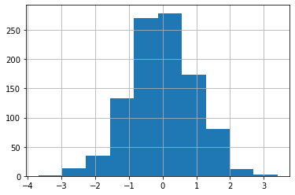
    


```python
df1['A'].hist(bins=30)
```


    <AxesSubplot:>


    
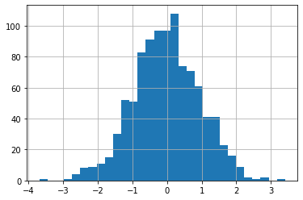
    


```python
df1['A'].plot(kind='hist')
```


    <AxesSubplot:ylabel='Frequency'>


    
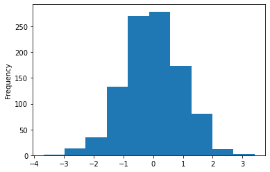
    


```python
df1['A'].plot(kind='hist', bins=30)
```


    <AxesSubplot:ylabel='Frequency'>


    
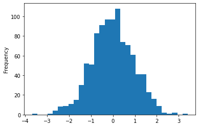
    


```python
df1['A'].plot.hist()
```


    <AxesSubplot:ylabel='Frequency'>


    

    


```python
df2.head()
```


<div>
<style scoped>
    .dataframe tbody tr th:only-of-type {
        vertical-align: middle;
    }

    .dataframe tbody tr th {
        vertical-align: top;
    }

    .dataframe thead th {
        text-align: right;
    }
</style>
<table border="1" class="dataframe">
  <thead>
    <tr style="text-align: right;">
      <th></th>
      <th>a</th>
      <th>b</th>
      <th>c</th>
      <th>d</th>
    </tr>
  </thead>
  <tbody>
    <tr>
      <th>0</th>
      <td>0.039762</td>
      <td>0.218517</td>
      <td>0.103423</td>
      <td>0.957904</td>
    </tr>
    <tr>
      <th>1</th>
      <td>0.937288</td>
      <td>0.041567</td>
      <td>0.899125</td>
      <td>0.977680</td>
    </tr>
    <tr>
      <th>2</th>
      <td>0.780504</td>
      <td>0.008948</td>
      <td>0.557808</td>
      <td>0.797510</td>
    </tr>
    <tr>
      <th>3</th>
      <td>0.672717</td>
      <td>0.247870</td>
      <td>0.264071</td>
      <td>0.444358</td>
    </tr>
    <tr>
      <th>4</th>
      <td>0.053829</td>
      <td>0.520124</td>
      <td>0.552264</td>
      <td>0.190008</td>
    </tr>
  </tbody>
</table>
</div>


```python
df2.plot.area()
```


    <AxesSubplot:>


    
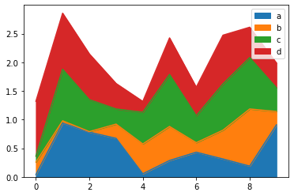
    


```python
df2.plot.area(alpha=0.4)
```


    <AxesSubplot:>


    
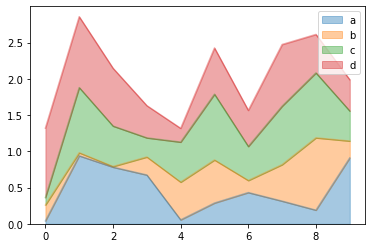
    


```python
df2.plot.bar()
```


    <AxesSubplot:>


    
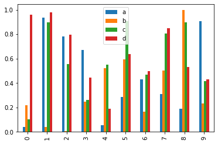
    


```python
df2
```


<div>
<style scoped>
    .dataframe tbody tr th:only-of-type {
        vertical-align: middle;
    }

    .dataframe tbody tr th {
        vertical-align: top;
    }

    .dataframe thead th {
        text-align: right;
    }
</style>
<table border="1" class="dataframe">
  <thead>
    <tr style="text-align: right;">
      <th></th>
      <th>a</th>
      <th>b</th>
      <th>c</th>
      <th>d</th>
    </tr>
  </thead>
  <tbody>
    <tr>
      <th>0</th>
      <td>0.039762</td>
      <td>0.218517</td>
      <td>0.103423</td>
      <td>0.957904</td>
    </tr>
    <tr>
      <th>1</th>
      <td>0.937288</td>
      <td>0.041567</td>
      <td>0.899125</td>
      <td>0.977680</td>
    </tr>
    <tr>
      <th>2</th>
      <td>0.780504</td>
      <td>0.008948</td>
      <td>0.557808</td>
      <td>0.797510</td>
    </tr>
    <tr>
      <th>3</th>
      <td>0.672717</td>
      <td>0.247870</td>
      <td>0.264071</td>
      <td>0.444358</td>
    </tr>
    <tr>
      <th>4</th>
      <td>0.053829</td>
      <td>0.520124</td>
      <td>0.552264</td>
      <td>0.190008</td>
    </tr>
    <tr>
      <th>5</th>
      <td>0.286043</td>
      <td>0.593465</td>
      <td>0.907307</td>
      <td>0.637898</td>
    </tr>
    <tr>
      <th>6</th>
      <td>0.430436</td>
      <td>0.166230</td>
      <td>0.469383</td>
      <td>0.497701</td>
    </tr>
    <tr>
      <th>7</th>
      <td>0.312296</td>
      <td>0.502823</td>
      <td>0.806609</td>
      <td>0.850519</td>
    </tr>
    <tr>
      <th>8</th>
      <td>0.187765</td>
      <td>0.997075</td>
      <td>0.895955</td>
      <td>0.530390</td>
    </tr>
    <tr>
      <th>9</th>
      <td>0.908162</td>
      <td>0.232726</td>
      <td>0.414138</td>
      <td>0.432007</td>
    </tr>
  </tbody>
</table>
</div>


```python
df2.plot.bar(stacked=True)
```


    <AxesSubplot:>


    
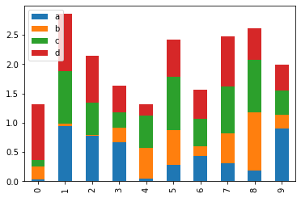
    


```python
df1['A'].plot.hist(bins=50)
```


    <AxesSubplot:ylabel='Frequency'>


    
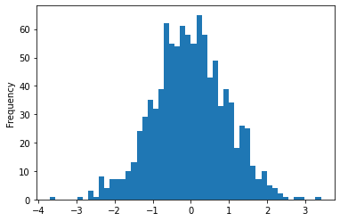
    


```python
df1.head()
```


<div>
<style scoped>
    .dataframe tbody tr th:only-of-type {
        vertical-align: middle;
    }

    .dataframe tbody tr th {
        vertical-align: top;
    }

    .dataframe thead th {
        text-align: right;
    }
</style>
<table border="1" class="dataframe">
  <thead>
    <tr style="text-align: right;">
      <th></th>
      <th>A</th>
      <th>B</th>
      <th>C</th>
      <th>D</th>
    </tr>
  </thead>
  <tbody>
    <tr>
      <th>2000-01-01</th>
      <td>1.339091</td>
      <td>-0.163643</td>
      <td>-0.646443</td>
      <td>1.041233</td>
    </tr>
    <tr>
      <th>2000-01-02</th>
      <td>-0.774984</td>
      <td>0.137034</td>
      <td>-0.882716</td>
      <td>-2.253382</td>
    </tr>
    <tr>
      <th>2000-01-03</th>
      <td>-0.921037</td>
      <td>-0.482943</td>
      <td>-0.417100</td>
      <td>0.478638</td>
    </tr>
    <tr>
      <th>2000-01-04</th>
      <td>-1.738808</td>
      <td>-0.072973</td>
      <td>0.056517</td>
      <td>0.015085</td>
    </tr>
    <tr>
      <th>2000-01-05</th>
      <td>-0.905980</td>
      <td>1.778576</td>
      <td>0.381918</td>
      <td>0.291436</td>
    </tr>
  </tbody>
</table>
</div>


```python
df1.plot.line(y='B')
```


    <AxesSubplot:>


    
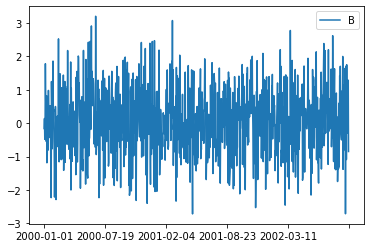
    


```python
df1.plot.line(y='B', figsize=(12, 3))
```


    <AxesSubplot:>


    
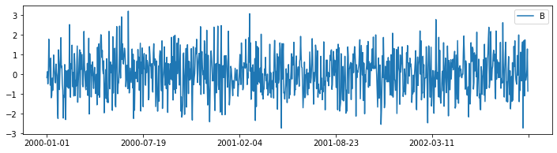
    


```python
df1.plot.line(y='B', figsize=(12, 3), lw=1)
```


    <AxesSubplot:>


    
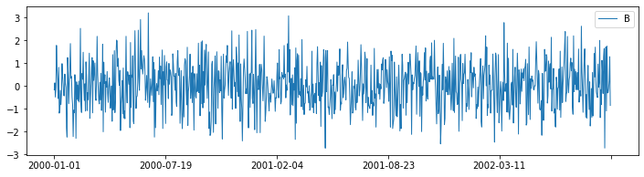
    


```python
df1.plot.scatter(x='A', y='B')
```


    <AxesSubplot:xlabel='A', ylabel='B'>


    
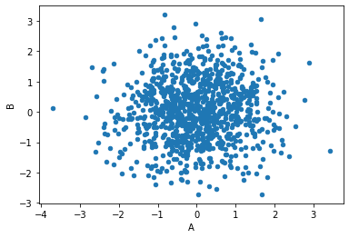
    


```python
df1.plot.scatter(x='A', y='B', c='C')
```


    <AxesSubplot:xlabel='A', ylabel='B'>


    
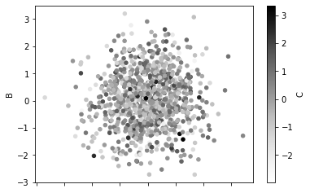
    


```python
df1.head()
```


<div>
<style scoped>
    .dataframe tbody tr th:only-of-type {
        vertical-align: middle;
    }

    .dataframe tbody tr th {
        vertical-align: top;
    }

    .dataframe thead th {
        text-align: right;
    }
</style>
<table border="1" class="dataframe">
  <thead>
    <tr style="text-align: right;">
      <th></th>
      <th>A</th>
      <th>B</th>
      <th>C</th>
      <th>D</th>
    </tr>
  </thead>
  <tbody>
    <tr>
      <th>2000-01-01</th>
      <td>1.339091</td>
      <td>-0.163643</td>
      <td>-0.646443</td>
      <td>1.041233</td>
    </tr>
    <tr>
      <th>2000-01-02</th>
      <td>-0.774984</td>
      <td>0.137034</td>
      <td>-0.882716</td>
      <td>-2.253382</td>
    </tr>
    <tr>
      <th>2000-01-03</th>
      <td>-0.921037</td>
      <td>-0.482943</td>
      <td>-0.417100</td>
      <td>0.478638</td>
    </tr>
    <tr>
      <th>2000-01-04</th>
      <td>-1.738808</td>
      <td>-0.072973</td>
      <td>0.056517</td>
      <td>0.015085</td>
    </tr>
    <tr>
      <th>2000-01-05</th>
      <td>-0.905980</td>
      <td>1.778576</td>
      <td>0.381918</td>
      <td>0.291436</td>
    </tr>
  </tbody>
</table>
</div>


```python
df1.plot.scatter(x='A', y='B', c='C', cmap='coolwarm')
```


    <AxesSubplot:xlabel='A', ylabel='B'>


    
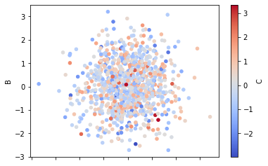
    


```python
df1.plot.scatter(x='A', y='B', s=df1['C'])
```

    C:\Work\Utils\Anaconda3\lib\site-packages\matplotlib\collections.py:1003: RuntimeWarning: invalid value encountered in sqrt
      scale = np.sqrt(self._sizes) * dpi / 72.0 * self._factor
    


    <AxesSubplot:xlabel='A', ylabel='B'>


    
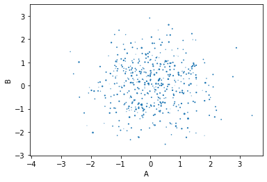
    


```python
df1.plot.scatter(x='A', y='B', s=df1['C'] * 10)
```


    <AxesSubplot:xlabel='A', ylabel='B'>


    
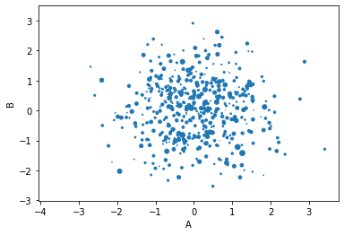
    


```python
df2.plot.box()
```


    <AxesSubplot:>


    
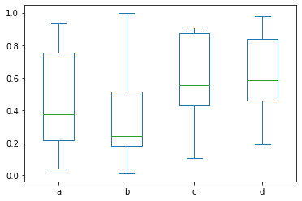
    


```python
df = pd.DataFrame(np.random.randn(1000, 2), columns=['a', 'b'])
```


```python
df.head()
```


<div>
<style scoped>
    .dataframe tbody tr th:only-of-type {
        vertical-align: middle;
    }

    .dataframe tbody tr th {
        vertical-align: top;
    }

    .dataframe thead th {
        text-align: right;
    }
</style>
<table border="1" class="dataframe">
  <thead>
    <tr style="text-align: right;">
      <th></th>
      <th>a</th>
      <th>b</th>
    </tr>
  </thead>
  <tbody>
    <tr>
      <th>0</th>
      <td>-0.333798</td>
      <td>-1.557157</td>
    </tr>
    <tr>
      <th>1</th>
      <td>-0.745467</td>
      <td>0.516026</td>
    </tr>
    <tr>
      <th>2</th>
      <td>1.815974</td>
      <td>1.514793</td>
    </tr>
    <tr>
      <th>3</th>
      <td>-0.943893</td>
      <td>0.132875</td>
    </tr>
    <tr>
      <th>4</th>
      <td>1.394275</td>
      <td>-0.412573</td>
    </tr>
  </tbody>
</table>
</div>


```python
df.plot.hexbin(x='a', y='b') # scatter but dot is hexagon
```


    <AxesSubplot:xlabel='a', ylabel='b'>


    
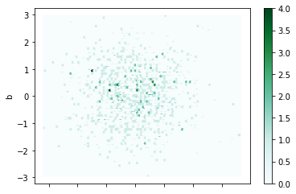
    


```python
df.plot.hexbin(x='a', y='b', gridsize=25)
```


    <AxesSubplot:xlabel='a', ylabel='b'>


    
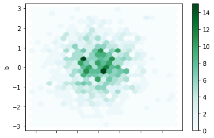
    


```python
df.plot.hexbin(x='a', y='b', gridsize=25, cmap='coolwarm')
```


    <AxesSubplot:xlabel='a', ylabel='b'>


    
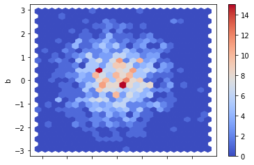
    


```python
df2['a'].plot.kde()
```


    <AxesSubplot:ylabel='Density'>


    
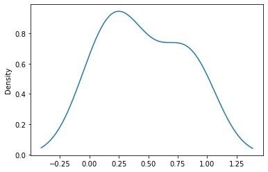
    


```python
df2.plot.density()
```


    <AxesSubplot:ylabel='Density'>


    
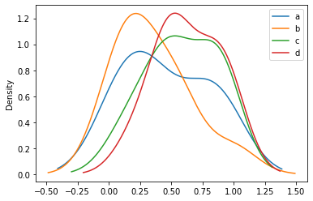
    


```python

```
