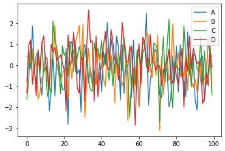

```python
# ploty and cufflinks make pandas Interactive
'''
1. Possible Import Error 1: You need to install a new package. In your command line type and run:

pip install chart-studio

Then in jupyter make sure you import it by running the code:

import chart_studio.plotly as py


2.Possible Colorscale Error 2: In the "Real Data US Map Choropleth", when you are creating the data dictionary, make sure the colorscale line is = 'ylorbr', not 'YIOrbr'... so like this:

colorscale='ylorbr'


3.Possible projection Error 3: In the "World Map Choropleth", when you are creating the layout, ensure that your projection line is = {'type':'mercator'} not Mercator with a capital...so like this:

projection={'type':'mercator'}


'''
```


    '\n1. Possible Import Error 1: You need to install a new package. In your command line type and run:\n\npip install chart-studio\n\nThen in jupyter make sure you import it by running the code:\n\nimport chart_studio.plotly as py\n\n\n\n2.Possible Colorscale Error 2: In the "Real Data US Map Choropleth", when you are creating the data dictionary, make sure the colorscale line is = \'ylorbr\', not \'YIOrbr\'... so like this:\n\ncolorscale=\'ylorbr\'\n\n\n\n3.Possible projection Error 3: In the "World Map Choropleth", when you are creating the layout, ensure that your projection line is = {\'type\':\'mercator\'} not Mercator with a capital...so like this:\n\nprojection={\'type\':\'mercator\'}\n\n\n'


```python
'''
##############  Need to insall packages   ################
conda install -c conda-forge chart-studio
conda install -c conda-forge cufflinks-py
'''
```


```python
import pandas as pd
import numpy as np
import matplotlib as plt
%matplotlib inline
```


```python
import plotly
plotly.__version__
```


    '5.6.0'


```python
import cufflinks as cf
```


```python
from plotly.offline import download_plotlyjs, init_notebook_mode, plot, iplot
```


```python
init_notebook_mode(connected=True)
```


<script type="text/javascript">
window.PlotlyConfig = {MathJaxConfig: 'local'};
if (window.MathJax) {MathJax.Hub.Config({SVG: {font: "STIX-Web"}});}
if (typeof require !== 'undefined') {
require.undef("plotly");
requirejs.config({
    paths: {
        'plotly': ['https://cdn.plot.ly/plotly-2.9.0.min']
    }
});
require(['plotly'], function(Plotly) {
    window._Plotly = Plotly;
});
}
</script>


```python
cf.go_offline()
```


<script type="text/javascript">
window.PlotlyConfig = {MathJaxConfig: 'local'};
if (window.MathJax) {MathJax.Hub.Config({SVG: {font: "STIX-Web"}});}
if (typeof require !== 'undefined') {
require.undef("plotly");
requirejs.config({
    paths: {
        'plotly': ['https://cdn.plot.ly/plotly-2.9.0.min']
    }
});
require(['plotly'], function(Plotly) {
    window._Plotly = Plotly;
});
}
</script>


```python
df = pd.DataFrame(np.random.randn(100, 4), columns='A B C D'.split())
```


```python
df
```


<div>
<style scoped>
    .dataframe tbody tr th:only-of-type {
        vertical-align: middle;
    }

    .dataframe tbody tr th {
        vertical-align: top;
    }

    .dataframe thead th {
        text-align: right;
    }
</style>
<table border="1" class="dataframe">
  <thead>
    <tr style="text-align: right;">
      <th></th>
      <th>A</th>
      <th>B</th>
      <th>C</th>
      <th>D</th>
    </tr>
  </thead>
  <tbody>
    <tr>
      <th>0</th>
      <td>-0.805627</td>
      <td>0.400420</td>
      <td>-1.620923</td>
      <td>-1.332703</td>
    </tr>
    <tr>
      <th>1</th>
      <td>0.695299</td>
      <td>0.508101</td>
      <td>-0.633434</td>
      <td>0.958764</td>
    </tr>
    <tr>
      <th>2</th>
      <td>-0.170557</td>
      <td>0.113122</td>
      <td>1.159291</td>
      <td>1.211398</td>
    </tr>
    <tr>
      <th>3</th>
      <td>1.868195</td>
      <td>0.780966</td>
      <td>0.337344</td>
      <td>-0.920802</td>
    </tr>
    <tr>
      <th>4</th>
      <td>-0.277539</td>
      <td>-0.251525</td>
      <td>-0.283921</td>
      <td>-0.002970</td>
    </tr>
    <tr>
      <th>...</th>
      <td>...</td>
      <td>...</td>
      <td>...</td>
      <td>...</td>
    </tr>
    <tr>
      <th>95</th>
      <td>-1.715885</td>
      <td>-0.698867</td>
      <td>0.677005</td>
      <td>-1.545181</td>
    </tr>
    <tr>
      <th>96</th>
      <td>-0.450144</td>
      <td>-0.303198</td>
      <td>-0.933266</td>
      <td>-0.370888</td>
    </tr>
    <tr>
      <th>97</th>
      <td>1.289279</td>
      <td>1.116204</td>
      <td>-0.312999</td>
      <td>-0.985664</td>
    </tr>
    <tr>
      <th>98</th>
      <td>0.543539</td>
      <td>1.426201</td>
      <td>0.742517</td>
      <td>0.631584</td>
    </tr>
    <tr>
      <th>99</th>
      <td>0.408511</td>
      <td>-1.278164</td>
      <td>-1.428092</td>
      <td>-0.096208</td>
    </tr>
  </tbody>
</table>
<p>100 rows × 4 columns</p>
</div>


```python
df2 = pd.DataFrame({'Category': ['A', 'B', 'C'], 'Values': [32, 43, 50]})
```


```python
df2
```


<div>
<style scoped>
    .dataframe tbody tr th:only-of-type {
        vertical-align: middle;
    }

    .dataframe tbody tr th {
        vertical-align: top;
    }

    .dataframe thead th {
        text-align: right;
    }
</style>
<table border="1" class="dataframe">
  <thead>
    <tr style="text-align: right;">
      <th></th>
      <th>Category</th>
      <th>Values</th>
    </tr>
  </thead>
  <tbody>
    <tr>
      <th>0</th>
      <td>A</td>
      <td>32</td>
    </tr>
    <tr>
      <th>1</th>
      <td>B</td>
      <td>43</td>
    </tr>
    <tr>
      <th>2</th>
      <td>C</td>
      <td>50</td>
    </tr>
  </tbody>
</table>
</div>


```python
df.plot()
```


    <AxesSubplot:>


    

    


```python
df.iplot()
```


<div>                            <div id="50e048d9-3251-452e-9b59-03e5d9949a69" class="plotly-graph-div" style="height:525px; width:100%;"></div>            <script type="text/javascript">                require(["plotly"], function(Plotly) {                    window.PLOTLYENV=window.PLOTLYENV || {};
                    window.PLOTLYENV.BASE_URL='https://plot.ly';                                    if (document.getElementById("50e048d9-3251-452e-9b59-03e5d9949a69")) {                    Plotly.newPlot(                        "50e048d9-3251-452e-9b59-03e5d9949a69",                        [{"line":{"color":"rgba(255, 153, 51, 1.0)","dash":"solid","shape":"linear","width":1.3},"mode":"lines","name":"A","text":"","x":[0,1,2,3,4,5,6,7,8,9,10,11,12,13,14,15,16,17,18,19,20,21,22,23,24,25,26,27,28,29,30,31,32,33,34,35,36,37,38,39,40,41,42,43,44,45,46,47,48,49,50,51,52,53,54,55,56,57,58,59,60,61,62,63,64,65,66,67,68,69,70,71,72,73,74,75,76,77,78,79,80,81,82,83,84,85,86,87,88,89,90,91,92,93,94,95,96,97,98,99],"y":[-0.8056268156961869,0.6952988358756005,-0.17055722826109523,1.8681948125632366,-0.2775388617438564,0.47049575177771513,0.6433342857499722,-0.5183315981134969,-1.4328821845248774,-0.05526221742929483,0.4096848316835925,0.280693516391771,-2.177061001946123,-1.0971860081298836,0.47534577146376605,-1.4807830643082052,0.3683956910344816,0.1747325850327416,-0.5660502573637762,-1.1591609396042821,-1.1721525780245714,0.7997154435386922,-2.8325251911287204,1.032851769044611,1.128828437709571,-0.31644932810896426,1.086482347603282,-0.3952523729745856,-0.2303908088198054,-2.252998776487316,0.7625212171323595,1.0011641616325826,0.09789745472060203,-0.8591539727324143,-0.1171932927166054,-0.9239386925098351,-0.26707442797523095,-0.8958060466357758,-0.7825358854535597,0.14535848148077607,-1.2732356536725211,0.643221303851257,0.019141155311373295,2.041400587962166,0.2134833735384341,1.2994107121853464,0.6147286259579879,-0.3769499698942641,1.3821618979715364,0.8743698910609945,-1.6501847279812498,0.9776647492713418,-1.3502217582162825,0.11969728219106615,-0.0910171498377074,0.924058325434405,-1.5417818705379565,1.1937278016448394,-0.8523769184195286,-0.09784296232390875,-1.9826123693654265,-0.6581697072586155,0.6019090842095004,0.797318402966389,2.4824324266800506,-1.9274075207601795,-0.7736249447586548,-0.13344575592700408,0.5405128019903549,0.7710055333036233,0.10662344015114911,-1.379131650825603,-1.5612577213804253,-0.19763516196205463,-0.370204977105733,-0.12043111558577854,-1.9876623084758487,-1.6148223706218716,0.45067258870186194,-0.8079038430518549,0.9220834370110096,-1.278473227108251,0.973697023942519,-0.6182539867150351,-0.7685008772535015,-1.5144049594378162,1.5886861469243425,-0.45380537388066855,0.2514556492322022,0.5261957571810811,-1.6460101973864156,-2.137353654443856,-0.3132695759597831,0.33245508227610737,0.4477028129511402,-1.7158847246885753,-0.45014387212057444,1.2892788101957287,0.5435393834593669,0.40851139067184733],"type":"scatter"},{"line":{"color":"rgba(55, 128, 191, 1.0)","dash":"solid","shape":"linear","width":1.3},"mode":"lines","name":"B","text":"","x":[0,1,2,3,4,5,6,7,8,9,10,11,12,13,14,15,16,17,18,19,20,21,22,23,24,25,26,27,28,29,30,31,32,33,34,35,36,37,38,39,40,41,42,43,44,45,46,47,48,49,50,51,52,53,54,55,56,57,58,59,60,61,62,63,64,65,66,67,68,69,70,71,72,73,74,75,76,77,78,79,80,81,82,83,84,85,86,87,88,89,90,91,92,93,94,95,96,97,98,99],"y":[0.4004198219229937,0.5081008034501124,0.1131220879074051,0.7809660916410259,-0.2515249329551259,0.30219464106488225,-1.6205358594710793,-1.3501013944630953,-0.6406085287868836,-0.38666967152719084,0.4809249680226603,-0.7873548995552071,-0.8115978225600681,0.26611201099623266,0.29424078116320485,1.9113604090856908,0.16617971771290013,-0.45782903791219864,-0.6128057937056304,-0.5422891674423329,-0.13829952341400947,-0.9396069514594312,-1.60531304491407,0.30092794525903044,-0.6528826141897119,0.11088042354092731,1.1020272328160716,1.458796211130982,1.897525538433295,-0.07221910405500864,1.96495313900884,-2.5071031099912053,-0.8230826710766936,0.8104876139951571,-0.4747416793613401,-0.8396477354129768,-0.662046441111991,-0.9393449926116415,0.6102126994246284,0.21626855064827677,0.5775724624884301,-0.6760512722584606,-1.020173238820633,0.8115721104617937,0.16135233750905292,0.5053459063089583,0.04436776534740539,-1.785520354191145,0.6693421544428335,-0.3761037989140285,-0.5174690861329819,-0.9819075223059217,-0.6698498289803483,0.3091821289814916,-2.647094284910356,0.8949709505798793,0.7314268384803502,-1.1835001841091686,-0.35568391431931656,0.5397577160725294,-2.0334696477168186,0.183744751329945,1.2463122828159479,1.142847964375866,1.5530848541497095,1.4216145138688225,-0.2327688171459704,-0.5832289430980405,0.8528455724131165,-0.4948981876346697,1.4550285261672358,-3.1153500700981662,0.4007447156852149,-1.413642156476823,-0.35256614040003287,0.26157700995978256,-0.7270113028715489,-0.26465792992060766,1.9678941070201856,0.0571783999618472,-0.1195630793602319,0.6005647187291708,-0.5364333582563126,-0.3133816749416166,-0.5502986527938813,0.5104653242231263,-1.2080080943650309,0.600970539863136,-0.7183656095142147,-1.0743602636799636,-0.673043790258854,-1.2889961607546436,0.19204952668960654,-0.8054895976085752,-0.9111634175240881,-0.6988669886605341,-0.30319847137618167,1.1162037125017057,1.4262011277411466,-1.2781644282218327],"type":"scatter"},{"line":{"color":"rgba(50, 171, 96, 1.0)","dash":"solid","shape":"linear","width":1.3},"mode":"lines","name":"C","text":"","x":[0,1,2,3,4,5,6,7,8,9,10,11,12,13,14,15,16,17,18,19,20,21,22,23,24,25,26,27,28,29,30,31,32,33,34,35,36,37,38,39,40,41,42,43,44,45,46,47,48,49,50,51,52,53,54,55,56,57,58,59,60,61,62,63,64,65,66,67,68,69,70,71,72,73,74,75,76,77,78,79,80,81,82,83,84,85,86,87,88,89,90,91,92,93,94,95,96,97,98,99],"y":[-1.6209231447446828,-0.6334341127822587,1.1592912369909891,0.33734427013362833,-0.28392127515956656,-0.8734021496960008,0.6688008264337227,-0.4215422105519261,1.1233803873853418,-0.3442916737126083,-0.0837326633993305,-1.5017049983470219,-1.0822921668215892,-1.3334110500449008,2.1220720820985113,1.0870734422334007,0.8880718986288906,-0.10401954304575341,-1.3658772641925305,0.9353325665438481,0.4611503327092344,0.6419204478593834,-0.5381977072518592,1.1443193022238356,0.35613297719002046,0.7274149650319881,-0.322415986273629,0.4275154827260423,0.8829681130046549,0.437274544328096,0.16017096037892453,0.652957496800085,0.825732349017906,-0.7445524218872935,-1.1649583101604217,-1.2596404824463614,1.0749825356397613,0.46408898219664063,0.8056209172872847,0.3650975127542695,1.1825633573860082,-0.06490849988027608,0.535030166097424,0.06411364879724893,-0.7368025296971044,0.35590362706380113,-0.9856608956809526,-0.04828518277474146,0.4206486986591142,-0.18973391112105198,0.6500196973858402,-0.2754231629049873,1.3065621351927312,0.5251909632374726,-0.557937499028009,-2.504197282152381,-0.6270024622622477,-0.1602464729803624,-0.9652611940441344,0.7417275923694204,0.4044586024568922,0.0322262558840133,1.1474078837565251,0.9135969746662768,-0.11713289144953462,0.3203776290409714,-0.05785153998563771,0.172826377374793,1.0602806719003532,0.9513221001846358,0.770099650587018,-2.7434060456985043,-0.1988887028730965,1.3526080371125269,-0.8083043093063205,0.9129446494013015,2.1939478610757397,-0.8050025802208918,-2.048633695766662,0.14254960065478536,-0.08953923727845046,-0.18615374782828445,-0.14760684201042434,-0.5570249331416394,1.8733968870846749,0.4957905266350593,-0.2952941278574904,0.1478719858903619,-1.038585055519184,0.5135951995436049,0.5037238299597508,-0.160753498230176,-0.321579257462974,1.405034781629979,-0.9001765501847874,0.6770050158398804,-0.9332663377111542,-0.3129987729525433,0.7425168956645805,-1.4280916754291628],"type":"scatter"},{"line":{"color":"rgba(128, 0, 128, 1.0)","dash":"solid","shape":"linear","width":1.3},"mode":"lines","name":"D","text":"","x":[0,1,2,3,4,5,6,7,8,9,10,11,12,13,14,15,16,17,18,19,20,21,22,23,24,25,26,27,28,29,30,31,32,33,34,35,36,37,38,39,40,41,42,43,44,45,46,47,48,49,50,51,52,53,54,55,56,57,58,59,60,61,62,63,64,65,66,67,68,69,70,71,72,73,74,75,76,77,78,79,80,81,82,83,84,85,86,87,88,89,90,91,92,93,94,95,96,97,98,99],"y":[-1.3327032584979166,0.9587636861435833,1.2113978712557605,-0.9208020986939116,-0.002970133261885695,-1.4702653270061619,0.7506633024849435,-0.25141492375902424,1.0272264126180148,1.3888127557879546,0.1120684450872214,-0.346064847067963,-1.0536900716694981,1.006153953910453,0.6251305074065201,0.8502443931527338,0.19468372828830893,0.3482490911660157,0.4907277026339374,0.08034370427903749,-0.21472412918780534,-2.1929760499664313,1.4509672978764194,-0.003031199869531307,0.1607536945550285,1.5843055310992815,0.3629287659510042,-1.1120856841929847,-1.3341308373209535,0.36478074334691485,0.2803943185036733,-1.7449238381086538,0.8674159265176722,2.643126264363736,1.0816502484954542,1.168328778158287,-1.7241555205268522,1.3867550008150302,-1.508722382510269,-0.3807621775254338,-0.01606164807773748,0.9589673221539534,1.6089087871890986,-0.048521186961209856,-0.2365539423634875,1.7042614396740332,1.1239970172669167,0.25842202849172274,0.1821476110466295,-0.7175155555206448,0.16954039301963852,2.0407765626629546,1.0275420302315201,0.22067136912772048,0.14182585384227694,0.6096310994567846,0.9107572546936187,-0.7543648878258301,-2.8700713675025935,0.21658500967564176,1.0341021995669215,-0.9360827040650294,1.3386513325232343,1.1109116911440058,0.14555556270294268,-0.33512599840642754,1.458884795048351,0.1676035965699214,0.11675881619953778,-0.2588438614762975,0.01467206642058652,-0.03508516416701065,-0.9600088184636677,-0.5441664345009051,0.08105151346977343,0.15388509933745537,0.7767900722975403,-0.5930341429898746,-0.8740424185291331,0.017346846149231775,-0.49287522132521633,-0.9823268069713108,-0.03213524757568448,0.8098956923593219,-2.0117588240309323,0.19674818405284877,-0.23993190057620123,1.393909659893949,-0.1796636797350385,0.8223240115565822,0.4142216684411635,0.07657378008733777,0.16382786672495964,0.05638917199442176,-1.850276835039205,-1.5451806345713999,-0.37088806556358317,-0.985664004457123,0.6315836794476966,-0.09620826619761362],"type":"scatter"}],                        {"legend":{"bgcolor":"#F5F6F9","font":{"color":"#4D5663"}},"paper_bgcolor":"#F5F6F9","plot_bgcolor":"#F5F6F9","template":{"data":{"barpolar":[{"marker":{"line":{"color":"#E5ECF6","width":0.5},"pattern":{"fillmode":"overlay","size":10,"solidity":0.2}},"type":"barpolar"}],"bar":[{"error_x":{"color":"#2a3f5f"},"error_y":{"color":"#2a3f5f"},"marker":{"line":{"color":"#E5ECF6","width":0.5},"pattern":{"fillmode":"overlay","size":10,"solidity":0.2}},"type":"bar"}],"carpet":[{"aaxis":{"endlinecolor":"#2a3f5f","gridcolor":"white","linecolor":"white","minorgridcolor":"white","startlinecolor":"#2a3f5f"},"baxis":{"endlinecolor":"#2a3f5f","gridcolor":"white","linecolor":"white","minorgridcolor":"white","startlinecolor":"#2a3f5f"},"type":"carpet"}],"choropleth":[{"colorbar":{"outlinewidth":0,"ticks":""},"type":"choropleth"}],"contourcarpet":[{"colorbar":{"outlinewidth":0,"ticks":""},"type":"contourcarpet"}],"contour":[{"colorbar":{"outlinewidth":0,"ticks":""},"colorscale":[[0.0,"#0d0887"],[0.1111111111111111,"#46039f"],[0.2222222222222222,"#7201a8"],[0.3333333333333333,"#9c179e"],[0.4444444444444444,"#bd3786"],[0.5555555555555556,"#d8576b"],[0.6666666666666666,"#ed7953"],[0.7777777777777778,"#fb9f3a"],[0.8888888888888888,"#fdca26"],[1.0,"#f0f921"]],"type":"contour"}],"heatmapgl":[{"colorbar":{"outlinewidth":0,"ticks":""},"colorscale":[[0.0,"#0d0887"],[0.1111111111111111,"#46039f"],[0.2222222222222222,"#7201a8"],[0.3333333333333333,"#9c179e"],[0.4444444444444444,"#bd3786"],[0.5555555555555556,"#d8576b"],[0.6666666666666666,"#ed7953"],[0.7777777777777778,"#fb9f3a"],[0.8888888888888888,"#fdca26"],[1.0,"#f0f921"]],"type":"heatmapgl"}],"heatmap":[{"colorbar":{"outlinewidth":0,"ticks":""},"colorscale":[[0.0,"#0d0887"],[0.1111111111111111,"#46039f"],[0.2222222222222222,"#7201a8"],[0.3333333333333333,"#9c179e"],[0.4444444444444444,"#bd3786"],[0.5555555555555556,"#d8576b"],[0.6666666666666666,"#ed7953"],[0.7777777777777778,"#fb9f3a"],[0.8888888888888888,"#fdca26"],[1.0,"#f0f921"]],"type":"heatmap"}],"histogram2dcontour":[{"colorbar":{"outlinewidth":0,"ticks":""},"colorscale":[[0.0,"#0d0887"],[0.1111111111111111,"#46039f"],[0.2222222222222222,"#7201a8"],[0.3333333333333333,"#9c179e"],[0.4444444444444444,"#bd3786"],[0.5555555555555556,"#d8576b"],[0.6666666666666666,"#ed7953"],[0.7777777777777778,"#fb9f3a"],[0.8888888888888888,"#fdca26"],[1.0,"#f0f921"]],"type":"histogram2dcontour"}],"histogram2d":[{"colorbar":{"outlinewidth":0,"ticks":""},"colorscale":[[0.0,"#0d0887"],[0.1111111111111111,"#46039f"],[0.2222222222222222,"#7201a8"],[0.3333333333333333,"#9c179e"],[0.4444444444444444,"#bd3786"],[0.5555555555555556,"#d8576b"],[0.6666666666666666,"#ed7953"],[0.7777777777777778,"#fb9f3a"],[0.8888888888888888,"#fdca26"],[1.0,"#f0f921"]],"type":"histogram2d"}],"histogram":[{"marker":{"pattern":{"fillmode":"overlay","size":10,"solidity":0.2}},"type":"histogram"}],"mesh3d":[{"colorbar":{"outlinewidth":0,"ticks":""},"type":"mesh3d"}],"parcoords":[{"line":{"colorbar":{"outlinewidth":0,"ticks":""}},"type":"parcoords"}],"pie":[{"automargin":true,"type":"pie"}],"scatter3d":[{"line":{"colorbar":{"outlinewidth":0,"ticks":""}},"marker":{"colorbar":{"outlinewidth":0,"ticks":""}},"type":"scatter3d"}],"scattercarpet":[{"marker":{"colorbar":{"outlinewidth":0,"ticks":""}},"type":"scattercarpet"}],"scattergeo":[{"marker":{"colorbar":{"outlinewidth":0,"ticks":""}},"type":"scattergeo"}],"scattergl":[{"marker":{"colorbar":{"outlinewidth":0,"ticks":""}},"type":"scattergl"}],"scattermapbox":[{"marker":{"colorbar":{"outlinewidth":0,"ticks":""}},"type":"scattermapbox"}],"scatterpolargl":[{"marker":{"colorbar":{"outlinewidth":0,"ticks":""}},"type":"scatterpolargl"}],"scatterpolar":[{"marker":{"colorbar":{"outlinewidth":0,"ticks":""}},"type":"scatterpolar"}],"scatter":[{"marker":{"colorbar":{"outlinewidth":0,"ticks":""}},"type":"scatter"}],"scatterternary":[{"marker":{"colorbar":{"outlinewidth":0,"ticks":""}},"type":"scatterternary"}],"surface":[{"colorbar":{"outlinewidth":0,"ticks":""},"colorscale":[[0.0,"#0d0887"],[0.1111111111111111,"#46039f"],[0.2222222222222222,"#7201a8"],[0.3333333333333333,"#9c179e"],[0.4444444444444444,"#bd3786"],[0.5555555555555556,"#d8576b"],[0.6666666666666666,"#ed7953"],[0.7777777777777778,"#fb9f3a"],[0.8888888888888888,"#fdca26"],[1.0,"#f0f921"]],"type":"surface"}],"table":[{"cells":{"fill":{"color":"#EBF0F8"},"line":{"color":"white"}},"header":{"fill":{"color":"#C8D4E3"},"line":{"color":"white"}},"type":"table"}]},"layout":{"annotationdefaults":{"arrowcolor":"#2a3f5f","arrowhead":0,"arrowwidth":1},"autotypenumbers":"strict","coloraxis":{"colorbar":{"outlinewidth":0,"ticks":""}},"colorscale":{"diverging":[[0,"#8e0152"],[0.1,"#c51b7d"],[0.2,"#de77ae"],[0.3,"#f1b6da"],[0.4,"#fde0ef"],[0.5,"#f7f7f7"],[0.6,"#e6f5d0"],[0.7,"#b8e186"],[0.8,"#7fbc41"],[0.9,"#4d9221"],[1,"#276419"]],"sequential":[[0.0,"#0d0887"],[0.1111111111111111,"#46039f"],[0.2222222222222222,"#7201a8"],[0.3333333333333333,"#9c179e"],[0.4444444444444444,"#bd3786"],[0.5555555555555556,"#d8576b"],[0.6666666666666666,"#ed7953"],[0.7777777777777778,"#fb9f3a"],[0.8888888888888888,"#fdca26"],[1.0,"#f0f921"]],"sequentialminus":[[0.0,"#0d0887"],[0.1111111111111111,"#46039f"],[0.2222222222222222,"#7201a8"],[0.3333333333333333,"#9c179e"],[0.4444444444444444,"#bd3786"],[0.5555555555555556,"#d8576b"],[0.6666666666666666,"#ed7953"],[0.7777777777777778,"#fb9f3a"],[0.8888888888888888,"#fdca26"],[1.0,"#f0f921"]]},"colorway":["#636efa","#EF553B","#00cc96","#ab63fa","#FFA15A","#19d3f3","#FF6692","#B6E880","#FF97FF","#FECB52"],"font":{"color":"#2a3f5f"},"geo":{"bgcolor":"white","lakecolor":"white","landcolor":"#E5ECF6","showlakes":true,"showland":true,"subunitcolor":"white"},"hoverlabel":{"align":"left"},"hovermode":"closest","mapbox":{"style":"light"},"paper_bgcolor":"white","plot_bgcolor":"#E5ECF6","polar":{"angularaxis":{"gridcolor":"white","linecolor":"white","ticks":""},"bgcolor":"#E5ECF6","radialaxis":{"gridcolor":"white","linecolor":"white","ticks":""}},"scene":{"xaxis":{"backgroundcolor":"#E5ECF6","gridcolor":"white","gridwidth":2,"linecolor":"white","showbackground":true,"ticks":"","zerolinecolor":"white"},"yaxis":{"backgroundcolor":"#E5ECF6","gridcolor":"white","gridwidth":2,"linecolor":"white","showbackground":true,"ticks":"","zerolinecolor":"white"},"zaxis":{"backgroundcolor":"#E5ECF6","gridcolor":"white","gridwidth":2,"linecolor":"white","showbackground":true,"ticks":"","zerolinecolor":"white"}},"shapedefaults":{"line":{"color":"#2a3f5f"}},"ternary":{"aaxis":{"gridcolor":"white","linecolor":"white","ticks":""},"baxis":{"gridcolor":"white","linecolor":"white","ticks":""},"bgcolor":"#E5ECF6","caxis":{"gridcolor":"white","linecolor":"white","ticks":""}},"title":{"x":0.05},"xaxis":{"automargin":true,"gridcolor":"white","linecolor":"white","ticks":"","title":{"standoff":15},"zerolinecolor":"white","zerolinewidth":2},"yaxis":{"automargin":true,"gridcolor":"white","linecolor":"white","ticks":"","title":{"standoff":15},"zerolinecolor":"white","zerolinewidth":2}}},"title":{"font":{"color":"#4D5663"}},"xaxis":{"gridcolor":"#E1E5ED","showgrid":true,"tickfont":{"color":"#4D5663"},"title":{"font":{"color":"#4D5663"},"text":""},"zerolinecolor":"#E1E5ED"},"yaxis":{"gridcolor":"#E1E5ED","showgrid":true,"tickfont":{"color":"#4D5663"},"title":{"font":{"color":"#4D5663"},"text":""},"zerolinecolor":"#E1E5ED"}},                        {"showLink": true, "linkText": "Export to plot.ly", "plotlyServerURL": "https://plot.ly", "responsive": true}                    ).then(function(){

var gd = document.getElementById('50e048d9-3251-452e-9b59-03e5d9949a69');
var x = new MutationObserver(function (mutations, observer) {{
        var display = window.getComputedStyle(gd).display;
        if (!display || display === 'none') {{
            console.log([gd, 'removed!']);
            Plotly.purge(gd);
            observer.disconnect();
        }}
}});

// Listen for the removal of the full notebook cells
var notebookContainer = gd.closest('#notebook-container');
if (notebookContainer) {{
    x.observe(notebookContainer, {childList: true});
}}

// Listen for the clearing of the current output cell
var outputEl = gd.closest('.output');
if (outputEl) {{
    x.observe(outputEl, {childList: true});
}}

                        })                };                });            </script>        </div>


```python
df.iplot(kind='scatter', x='A', y='B', mode='markers')
```


<div>                            <div id="f83d83c8-5145-4460-b988-25e054e180f6" class="plotly-graph-div" style="height:525px; width:100%;"></div>            <script type="text/javascript">                require(["plotly"], function(Plotly) {                    window.PLOTLYENV=window.PLOTLYENV || {};
                    window.PLOTLYENV.BASE_URL='https://plot.ly';                                    if (document.getElementById("f83d83c8-5145-4460-b988-25e054e180f6")) {                    Plotly.newPlot(                        "f83d83c8-5145-4460-b988-25e054e180f6",                        [{"line":{"color":"rgba(255, 153, 51, 1.0)","dash":"solid","shape":"linear","width":1.3},"marker":{"size":12,"symbol":"circle"},"mode":"markers","name":"B","text":"","x":[-0.8056268156961869,0.6952988358756005,-0.17055722826109523,1.8681948125632366,-0.2775388617438564,0.47049575177771513,0.6433342857499722,-0.5183315981134969,-1.4328821845248774,-0.05526221742929483,0.4096848316835925,0.280693516391771,-2.177061001946123,-1.0971860081298836,0.47534577146376605,-1.4807830643082052,0.3683956910344816,0.1747325850327416,-0.5660502573637762,-1.1591609396042821,-1.1721525780245714,0.7997154435386922,-2.8325251911287204,1.032851769044611,1.128828437709571,-0.31644932810896426,1.086482347603282,-0.3952523729745856,-0.2303908088198054,-2.252998776487316,0.7625212171323595,1.0011641616325826,0.09789745472060203,-0.8591539727324143,-0.1171932927166054,-0.9239386925098351,-0.26707442797523095,-0.8958060466357758,-0.7825358854535597,0.14535848148077607,-1.2732356536725211,0.643221303851257,0.019141155311373295,2.041400587962166,0.2134833735384341,1.2994107121853464,0.6147286259579879,-0.3769499698942641,1.3821618979715364,0.8743698910609945,-1.6501847279812498,0.9776647492713418,-1.3502217582162825,0.11969728219106615,-0.0910171498377074,0.924058325434405,-1.5417818705379565,1.1937278016448394,-0.8523769184195286,-0.09784296232390875,-1.9826123693654265,-0.6581697072586155,0.6019090842095004,0.797318402966389,2.4824324266800506,-1.9274075207601795,-0.7736249447586548,-0.13344575592700408,0.5405128019903549,0.7710055333036233,0.10662344015114911,-1.379131650825603,-1.5612577213804253,-0.19763516196205463,-0.370204977105733,-0.12043111558577854,-1.9876623084758487,-1.6148223706218716,0.45067258870186194,-0.8079038430518549,0.9220834370110096,-1.278473227108251,0.973697023942519,-0.6182539867150351,-0.7685008772535015,-1.5144049594378162,1.5886861469243425,-0.45380537388066855,0.2514556492322022,0.5261957571810811,-1.6460101973864156,-2.137353654443856,-0.3132695759597831,0.33245508227610737,0.4477028129511402,-1.7158847246885753,-0.45014387212057444,1.2892788101957287,0.5435393834593669,0.40851139067184733],"y":[0.4004198219229937,0.5081008034501124,0.1131220879074051,0.7809660916410259,-0.2515249329551259,0.30219464106488225,-1.6205358594710793,-1.3501013944630953,-0.6406085287868836,-0.38666967152719084,0.4809249680226603,-0.7873548995552071,-0.8115978225600681,0.26611201099623266,0.29424078116320485,1.9113604090856908,0.16617971771290013,-0.45782903791219864,-0.6128057937056304,-0.5422891674423329,-0.13829952341400947,-0.9396069514594312,-1.60531304491407,0.30092794525903044,-0.6528826141897119,0.11088042354092731,1.1020272328160716,1.458796211130982,1.897525538433295,-0.07221910405500864,1.96495313900884,-2.5071031099912053,-0.8230826710766936,0.8104876139951571,-0.4747416793613401,-0.8396477354129768,-0.662046441111991,-0.9393449926116415,0.6102126994246284,0.21626855064827677,0.5775724624884301,-0.6760512722584606,-1.020173238820633,0.8115721104617937,0.16135233750905292,0.5053459063089583,0.04436776534740539,-1.785520354191145,0.6693421544428335,-0.3761037989140285,-0.5174690861329819,-0.9819075223059217,-0.6698498289803483,0.3091821289814916,-2.647094284910356,0.8949709505798793,0.7314268384803502,-1.1835001841091686,-0.35568391431931656,0.5397577160725294,-2.0334696477168186,0.183744751329945,1.2463122828159479,1.142847964375866,1.5530848541497095,1.4216145138688225,-0.2327688171459704,-0.5832289430980405,0.8528455724131165,-0.4948981876346697,1.4550285261672358,-3.1153500700981662,0.4007447156852149,-1.413642156476823,-0.35256614040003287,0.26157700995978256,-0.7270113028715489,-0.26465792992060766,1.9678941070201856,0.0571783999618472,-0.1195630793602319,0.6005647187291708,-0.5364333582563126,-0.3133816749416166,-0.5502986527938813,0.5104653242231263,-1.2080080943650309,0.600970539863136,-0.7183656095142147,-1.0743602636799636,-0.673043790258854,-1.2889961607546436,0.19204952668960654,-0.8054895976085752,-0.9111634175240881,-0.6988669886605341,-0.30319847137618167,1.1162037125017057,1.4262011277411466,-1.2781644282218327],"type":"scatter"}],                        {"legend":{"bgcolor":"#F5F6F9","font":{"color":"#4D5663"}},"paper_bgcolor":"#F5F6F9","plot_bgcolor":"#F5F6F9","template":{"data":{"barpolar":[{"marker":{"line":{"color":"#E5ECF6","width":0.5},"pattern":{"fillmode":"overlay","size":10,"solidity":0.2}},"type":"barpolar"}],"bar":[{"error_x":{"color":"#2a3f5f"},"error_y":{"color":"#2a3f5f"},"marker":{"line":{"color":"#E5ECF6","width":0.5},"pattern":{"fillmode":"overlay","size":10,"solidity":0.2}},"type":"bar"}],"carpet":[{"aaxis":{"endlinecolor":"#2a3f5f","gridcolor":"white","linecolor":"white","minorgridcolor":"white","startlinecolor":"#2a3f5f"},"baxis":{"endlinecolor":"#2a3f5f","gridcolor":"white","linecolor":"white","minorgridcolor":"white","startlinecolor":"#2a3f5f"},"type":"carpet"}],"choropleth":[{"colorbar":{"outlinewidth":0,"ticks":""},"type":"choropleth"}],"contourcarpet":[{"colorbar":{"outlinewidth":0,"ticks":""},"type":"contourcarpet"}],"contour":[{"colorbar":{"outlinewidth":0,"ticks":""},"colorscale":[[0.0,"#0d0887"],[0.1111111111111111,"#46039f"],[0.2222222222222222,"#7201a8"],[0.3333333333333333,"#9c179e"],[0.4444444444444444,"#bd3786"],[0.5555555555555556,"#d8576b"],[0.6666666666666666,"#ed7953"],[0.7777777777777778,"#fb9f3a"],[0.8888888888888888,"#fdca26"],[1.0,"#f0f921"]],"type":"contour"}],"heatmapgl":[{"colorbar":{"outlinewidth":0,"ticks":""},"colorscale":[[0.0,"#0d0887"],[0.1111111111111111,"#46039f"],[0.2222222222222222,"#7201a8"],[0.3333333333333333,"#9c179e"],[0.4444444444444444,"#bd3786"],[0.5555555555555556,"#d8576b"],[0.6666666666666666,"#ed7953"],[0.7777777777777778,"#fb9f3a"],[0.8888888888888888,"#fdca26"],[1.0,"#f0f921"]],"type":"heatmapgl"}],"heatmap":[{"colorbar":{"outlinewidth":0,"ticks":""},"colorscale":[[0.0,"#0d0887"],[0.1111111111111111,"#46039f"],[0.2222222222222222,"#7201a8"],[0.3333333333333333,"#9c179e"],[0.4444444444444444,"#bd3786"],[0.5555555555555556,"#d8576b"],[0.6666666666666666,"#ed7953"],[0.7777777777777778,"#fb9f3a"],[0.8888888888888888,"#fdca26"],[1.0,"#f0f921"]],"type":"heatmap"}],"histogram2dcontour":[{"colorbar":{"outlinewidth":0,"ticks":""},"colorscale":[[0.0,"#0d0887"],[0.1111111111111111,"#46039f"],[0.2222222222222222,"#7201a8"],[0.3333333333333333,"#9c179e"],[0.4444444444444444,"#bd3786"],[0.5555555555555556,"#d8576b"],[0.6666666666666666,"#ed7953"],[0.7777777777777778,"#fb9f3a"],[0.8888888888888888,"#fdca26"],[1.0,"#f0f921"]],"type":"histogram2dcontour"}],"histogram2d":[{"colorbar":{"outlinewidth":0,"ticks":""},"colorscale":[[0.0,"#0d0887"],[0.1111111111111111,"#46039f"],[0.2222222222222222,"#7201a8"],[0.3333333333333333,"#9c179e"],[0.4444444444444444,"#bd3786"],[0.5555555555555556,"#d8576b"],[0.6666666666666666,"#ed7953"],[0.7777777777777778,"#fb9f3a"],[0.8888888888888888,"#fdca26"],[1.0,"#f0f921"]],"type":"histogram2d"}],"histogram":[{"marker":{"pattern":{"fillmode":"overlay","size":10,"solidity":0.2}},"type":"histogram"}],"mesh3d":[{"colorbar":{"outlinewidth":0,"ticks":""},"type":"mesh3d"}],"parcoords":[{"line":{"colorbar":{"outlinewidth":0,"ticks":""}},"type":"parcoords"}],"pie":[{"automargin":true,"type":"pie"}],"scatter3d":[{"line":{"colorbar":{"outlinewidth":0,"ticks":""}},"marker":{"colorbar":{"outlinewidth":0,"ticks":""}},"type":"scatter3d"}],"scattercarpet":[{"marker":{"colorbar":{"outlinewidth":0,"ticks":""}},"type":"scattercarpet"}],"scattergeo":[{"marker":{"colorbar":{"outlinewidth":0,"ticks":""}},"type":"scattergeo"}],"scattergl":[{"marker":{"colorbar":{"outlinewidth":0,"ticks":""}},"type":"scattergl"}],"scattermapbox":[{"marker":{"colorbar":{"outlinewidth":0,"ticks":""}},"type":"scattermapbox"}],"scatterpolargl":[{"marker":{"colorbar":{"outlinewidth":0,"ticks":""}},"type":"scatterpolargl"}],"scatterpolar":[{"marker":{"colorbar":{"outlinewidth":0,"ticks":""}},"type":"scatterpolar"}],"scatter":[{"marker":{"colorbar":{"outlinewidth":0,"ticks":""}},"type":"scatter"}],"scatterternary":[{"marker":{"colorbar":{"outlinewidth":0,"ticks":""}},"type":"scatterternary"}],"surface":[{"colorbar":{"outlinewidth":0,"ticks":""},"colorscale":[[0.0,"#0d0887"],[0.1111111111111111,"#46039f"],[0.2222222222222222,"#7201a8"],[0.3333333333333333,"#9c179e"],[0.4444444444444444,"#bd3786"],[0.5555555555555556,"#d8576b"],[0.6666666666666666,"#ed7953"],[0.7777777777777778,"#fb9f3a"],[0.8888888888888888,"#fdca26"],[1.0,"#f0f921"]],"type":"surface"}],"table":[{"cells":{"fill":{"color":"#EBF0F8"},"line":{"color":"white"}},"header":{"fill":{"color":"#C8D4E3"},"line":{"color":"white"}},"type":"table"}]},"layout":{"annotationdefaults":{"arrowcolor":"#2a3f5f","arrowhead":0,"arrowwidth":1},"autotypenumbers":"strict","coloraxis":{"colorbar":{"outlinewidth":0,"ticks":""}},"colorscale":{"diverging":[[0,"#8e0152"],[0.1,"#c51b7d"],[0.2,"#de77ae"],[0.3,"#f1b6da"],[0.4,"#fde0ef"],[0.5,"#f7f7f7"],[0.6,"#e6f5d0"],[0.7,"#b8e186"],[0.8,"#7fbc41"],[0.9,"#4d9221"],[1,"#276419"]],"sequential":[[0.0,"#0d0887"],[0.1111111111111111,"#46039f"],[0.2222222222222222,"#7201a8"],[0.3333333333333333,"#9c179e"],[0.4444444444444444,"#bd3786"],[0.5555555555555556,"#d8576b"],[0.6666666666666666,"#ed7953"],[0.7777777777777778,"#fb9f3a"],[0.8888888888888888,"#fdca26"],[1.0,"#f0f921"]],"sequentialminus":[[0.0,"#0d0887"],[0.1111111111111111,"#46039f"],[0.2222222222222222,"#7201a8"],[0.3333333333333333,"#9c179e"],[0.4444444444444444,"#bd3786"],[0.5555555555555556,"#d8576b"],[0.6666666666666666,"#ed7953"],[0.7777777777777778,"#fb9f3a"],[0.8888888888888888,"#fdca26"],[1.0,"#f0f921"]]},"colorway":["#636efa","#EF553B","#00cc96","#ab63fa","#FFA15A","#19d3f3","#FF6692","#B6E880","#FF97FF","#FECB52"],"font":{"color":"#2a3f5f"},"geo":{"bgcolor":"white","lakecolor":"white","landcolor":"#E5ECF6","showlakes":true,"showland":true,"subunitcolor":"white"},"hoverlabel":{"align":"left"},"hovermode":"closest","mapbox":{"style":"light"},"paper_bgcolor":"white","plot_bgcolor":"#E5ECF6","polar":{"angularaxis":{"gridcolor":"white","linecolor":"white","ticks":""},"bgcolor":"#E5ECF6","radialaxis":{"gridcolor":"white","linecolor":"white","ticks":""}},"scene":{"xaxis":{"backgroundcolor":"#E5ECF6","gridcolor":"white","gridwidth":2,"linecolor":"white","showbackground":true,"ticks":"","zerolinecolor":"white"},"yaxis":{"backgroundcolor":"#E5ECF6","gridcolor":"white","gridwidth":2,"linecolor":"white","showbackground":true,"ticks":"","zerolinecolor":"white"},"zaxis":{"backgroundcolor":"#E5ECF6","gridcolor":"white","gridwidth":2,"linecolor":"white","showbackground":true,"ticks":"","zerolinecolor":"white"}},"shapedefaults":{"line":{"color":"#2a3f5f"}},"ternary":{"aaxis":{"gridcolor":"white","linecolor":"white","ticks":""},"baxis":{"gridcolor":"white","linecolor":"white","ticks":""},"bgcolor":"#E5ECF6","caxis":{"gridcolor":"white","linecolor":"white","ticks":""}},"title":{"x":0.05},"xaxis":{"automargin":true,"gridcolor":"white","linecolor":"white","ticks":"","title":{"standoff":15},"zerolinecolor":"white","zerolinewidth":2},"yaxis":{"automargin":true,"gridcolor":"white","linecolor":"white","ticks":"","title":{"standoff":15},"zerolinecolor":"white","zerolinewidth":2}}},"title":{"font":{"color":"#4D5663"}},"xaxis":{"gridcolor":"#E1E5ED","showgrid":true,"tickfont":{"color":"#4D5663"},"title":{"font":{"color":"#4D5663"},"text":""},"zerolinecolor":"#E1E5ED"},"yaxis":{"gridcolor":"#E1E5ED","showgrid":true,"tickfont":{"color":"#4D5663"},"title":{"font":{"color":"#4D5663"},"text":""},"zerolinecolor":"#E1E5ED"}},                        {"showLink": true, "linkText": "Export to plot.ly", "plotlyServerURL": "https://plot.ly", "responsive": true}                    ).then(function(){

var gd = document.getElementById('f83d83c8-5145-4460-b988-25e054e180f6');
var x = new MutationObserver(function (mutations, observer) {{
        var display = window.getComputedStyle(gd).display;
        if (!display || display === 'none') {{
            console.log([gd, 'removed!']);
            Plotly.purge(gd);
            observer.disconnect();
        }}
}});

// Listen for the removal of the full notebook cells
var notebookContainer = gd.closest('#notebook-container');
if (notebookContainer) {{
    x.observe(notebookContainer, {childList: true});
}}

// Listen for the clearing of the current output cell
var outputEl = gd.closest('.output');
if (outputEl) {{
    x.observe(outputEl, {childList: true});
}}

                        })                };                });            </script>        </div>


```python
df.iplot(kind='scatter', x='A', y='B', mode='markers', size=20)
```


<div>                            <div id="bbd4a07e-2a58-4adc-8bc5-a76c5bb9e54e" class="plotly-graph-div" style="height:525px; width:100%;"></div>            <script type="text/javascript">                require(["plotly"], function(Plotly) {                    window.PLOTLYENV=window.PLOTLYENV || {};
                    window.PLOTLYENV.BASE_URL='https://plot.ly';                                    if (document.getElementById("bbd4a07e-2a58-4adc-8bc5-a76c5bb9e54e")) {                    Plotly.newPlot(                        "bbd4a07e-2a58-4adc-8bc5-a76c5bb9e54e",                        [{"line":{"color":"rgba(255, 153, 51, 1.0)","dash":"solid","shape":"linear","width":1.3},"marker":{"size":20,"symbol":"circle"},"mode":"markers","name":"B","text":"","x":[-0.8056268156961869,0.6952988358756005,-0.17055722826109523,1.8681948125632366,-0.2775388617438564,0.47049575177771513,0.6433342857499722,-0.5183315981134969,-1.4328821845248774,-0.05526221742929483,0.4096848316835925,0.280693516391771,-2.177061001946123,-1.0971860081298836,0.47534577146376605,-1.4807830643082052,0.3683956910344816,0.1747325850327416,-0.5660502573637762,-1.1591609396042821,-1.1721525780245714,0.7997154435386922,-2.8325251911287204,1.032851769044611,1.128828437709571,-0.31644932810896426,1.086482347603282,-0.3952523729745856,-0.2303908088198054,-2.252998776487316,0.7625212171323595,1.0011641616325826,0.09789745472060203,-0.8591539727324143,-0.1171932927166054,-0.9239386925098351,-0.26707442797523095,-0.8958060466357758,-0.7825358854535597,0.14535848148077607,-1.2732356536725211,0.643221303851257,0.019141155311373295,2.041400587962166,0.2134833735384341,1.2994107121853464,0.6147286259579879,-0.3769499698942641,1.3821618979715364,0.8743698910609945,-1.6501847279812498,0.9776647492713418,-1.3502217582162825,0.11969728219106615,-0.0910171498377074,0.924058325434405,-1.5417818705379565,1.1937278016448394,-0.8523769184195286,-0.09784296232390875,-1.9826123693654265,-0.6581697072586155,0.6019090842095004,0.797318402966389,2.4824324266800506,-1.9274075207601795,-0.7736249447586548,-0.13344575592700408,0.5405128019903549,0.7710055333036233,0.10662344015114911,-1.379131650825603,-1.5612577213804253,-0.19763516196205463,-0.370204977105733,-0.12043111558577854,-1.9876623084758487,-1.6148223706218716,0.45067258870186194,-0.8079038430518549,0.9220834370110096,-1.278473227108251,0.973697023942519,-0.6182539867150351,-0.7685008772535015,-1.5144049594378162,1.5886861469243425,-0.45380537388066855,0.2514556492322022,0.5261957571810811,-1.6460101973864156,-2.137353654443856,-0.3132695759597831,0.33245508227610737,0.4477028129511402,-1.7158847246885753,-0.45014387212057444,1.2892788101957287,0.5435393834593669,0.40851139067184733],"y":[0.4004198219229937,0.5081008034501124,0.1131220879074051,0.7809660916410259,-0.2515249329551259,0.30219464106488225,-1.6205358594710793,-1.3501013944630953,-0.6406085287868836,-0.38666967152719084,0.4809249680226603,-0.7873548995552071,-0.8115978225600681,0.26611201099623266,0.29424078116320485,1.9113604090856908,0.16617971771290013,-0.45782903791219864,-0.6128057937056304,-0.5422891674423329,-0.13829952341400947,-0.9396069514594312,-1.60531304491407,0.30092794525903044,-0.6528826141897119,0.11088042354092731,1.1020272328160716,1.458796211130982,1.897525538433295,-0.07221910405500864,1.96495313900884,-2.5071031099912053,-0.8230826710766936,0.8104876139951571,-0.4747416793613401,-0.8396477354129768,-0.662046441111991,-0.9393449926116415,0.6102126994246284,0.21626855064827677,0.5775724624884301,-0.6760512722584606,-1.020173238820633,0.8115721104617937,0.16135233750905292,0.5053459063089583,0.04436776534740539,-1.785520354191145,0.6693421544428335,-0.3761037989140285,-0.5174690861329819,-0.9819075223059217,-0.6698498289803483,0.3091821289814916,-2.647094284910356,0.8949709505798793,0.7314268384803502,-1.1835001841091686,-0.35568391431931656,0.5397577160725294,-2.0334696477168186,0.183744751329945,1.2463122828159479,1.142847964375866,1.5530848541497095,1.4216145138688225,-0.2327688171459704,-0.5832289430980405,0.8528455724131165,-0.4948981876346697,1.4550285261672358,-3.1153500700981662,0.4007447156852149,-1.413642156476823,-0.35256614040003287,0.26157700995978256,-0.7270113028715489,-0.26465792992060766,1.9678941070201856,0.0571783999618472,-0.1195630793602319,0.6005647187291708,-0.5364333582563126,-0.3133816749416166,-0.5502986527938813,0.5104653242231263,-1.2080080943650309,0.600970539863136,-0.7183656095142147,-1.0743602636799636,-0.673043790258854,-1.2889961607546436,0.19204952668960654,-0.8054895976085752,-0.9111634175240881,-0.6988669886605341,-0.30319847137618167,1.1162037125017057,1.4262011277411466,-1.2781644282218327],"type":"scatter"}],                        {"legend":{"bgcolor":"#F5F6F9","font":{"color":"#4D5663"}},"paper_bgcolor":"#F5F6F9","plot_bgcolor":"#F5F6F9","template":{"data":{"barpolar":[{"marker":{"line":{"color":"#E5ECF6","width":0.5},"pattern":{"fillmode":"overlay","size":10,"solidity":0.2}},"type":"barpolar"}],"bar":[{"error_x":{"color":"#2a3f5f"},"error_y":{"color":"#2a3f5f"},"marker":{"line":{"color":"#E5ECF6","width":0.5},"pattern":{"fillmode":"overlay","size":10,"solidity":0.2}},"type":"bar"}],"carpet":[{"aaxis":{"endlinecolor":"#2a3f5f","gridcolor":"white","linecolor":"white","minorgridcolor":"white","startlinecolor":"#2a3f5f"},"baxis":{"endlinecolor":"#2a3f5f","gridcolor":"white","linecolor":"white","minorgridcolor":"white","startlinecolor":"#2a3f5f"},"type":"carpet"}],"choropleth":[{"colorbar":{"outlinewidth":0,"ticks":""},"type":"choropleth"}],"contourcarpet":[{"colorbar":{"outlinewidth":0,"ticks":""},"type":"contourcarpet"}],"contour":[{"colorbar":{"outlinewidth":0,"ticks":""},"colorscale":[[0.0,"#0d0887"],[0.1111111111111111,"#46039f"],[0.2222222222222222,"#7201a8"],[0.3333333333333333,"#9c179e"],[0.4444444444444444,"#bd3786"],[0.5555555555555556,"#d8576b"],[0.6666666666666666,"#ed7953"],[0.7777777777777778,"#fb9f3a"],[0.8888888888888888,"#fdca26"],[1.0,"#f0f921"]],"type":"contour"}],"heatmapgl":[{"colorbar":{"outlinewidth":0,"ticks":""},"colorscale":[[0.0,"#0d0887"],[0.1111111111111111,"#46039f"],[0.2222222222222222,"#7201a8"],[0.3333333333333333,"#9c179e"],[0.4444444444444444,"#bd3786"],[0.5555555555555556,"#d8576b"],[0.6666666666666666,"#ed7953"],[0.7777777777777778,"#fb9f3a"],[0.8888888888888888,"#fdca26"],[1.0,"#f0f921"]],"type":"heatmapgl"}],"heatmap":[{"colorbar":{"outlinewidth":0,"ticks":""},"colorscale":[[0.0,"#0d0887"],[0.1111111111111111,"#46039f"],[0.2222222222222222,"#7201a8"],[0.3333333333333333,"#9c179e"],[0.4444444444444444,"#bd3786"],[0.5555555555555556,"#d8576b"],[0.6666666666666666,"#ed7953"],[0.7777777777777778,"#fb9f3a"],[0.8888888888888888,"#fdca26"],[1.0,"#f0f921"]],"type":"heatmap"}],"histogram2dcontour":[{"colorbar":{"outlinewidth":0,"ticks":""},"colorscale":[[0.0,"#0d0887"],[0.1111111111111111,"#46039f"],[0.2222222222222222,"#7201a8"],[0.3333333333333333,"#9c179e"],[0.4444444444444444,"#bd3786"],[0.5555555555555556,"#d8576b"],[0.6666666666666666,"#ed7953"],[0.7777777777777778,"#fb9f3a"],[0.8888888888888888,"#fdca26"],[1.0,"#f0f921"]],"type":"histogram2dcontour"}],"histogram2d":[{"colorbar":{"outlinewidth":0,"ticks":""},"colorscale":[[0.0,"#0d0887"],[0.1111111111111111,"#46039f"],[0.2222222222222222,"#7201a8"],[0.3333333333333333,"#9c179e"],[0.4444444444444444,"#bd3786"],[0.5555555555555556,"#d8576b"],[0.6666666666666666,"#ed7953"],[0.7777777777777778,"#fb9f3a"],[0.8888888888888888,"#fdca26"],[1.0,"#f0f921"]],"type":"histogram2d"}],"histogram":[{"marker":{"pattern":{"fillmode":"overlay","size":10,"solidity":0.2}},"type":"histogram"}],"mesh3d":[{"colorbar":{"outlinewidth":0,"ticks":""},"type":"mesh3d"}],"parcoords":[{"line":{"colorbar":{"outlinewidth":0,"ticks":""}},"type":"parcoords"}],"pie":[{"automargin":true,"type":"pie"}],"scatter3d":[{"line":{"colorbar":{"outlinewidth":0,"ticks":""}},"marker":{"colorbar":{"outlinewidth":0,"ticks":""}},"type":"scatter3d"}],"scattercarpet":[{"marker":{"colorbar":{"outlinewidth":0,"ticks":""}},"type":"scattercarpet"}],"scattergeo":[{"marker":{"colorbar":{"outlinewidth":0,"ticks":""}},"type":"scattergeo"}],"scattergl":[{"marker":{"colorbar":{"outlinewidth":0,"ticks":""}},"type":"scattergl"}],"scattermapbox":[{"marker":{"colorbar":{"outlinewidth":0,"ticks":""}},"type":"scattermapbox"}],"scatterpolargl":[{"marker":{"colorbar":{"outlinewidth":0,"ticks":""}},"type":"scatterpolargl"}],"scatterpolar":[{"marker":{"colorbar":{"outlinewidth":0,"ticks":""}},"type":"scatterpolar"}],"scatter":[{"marker":{"colorbar":{"outlinewidth":0,"ticks":""}},"type":"scatter"}],"scatterternary":[{"marker":{"colorbar":{"outlinewidth":0,"ticks":""}},"type":"scatterternary"}],"surface":[{"colorbar":{"outlinewidth":0,"ticks":""},"colorscale":[[0.0,"#0d0887"],[0.1111111111111111,"#46039f"],[0.2222222222222222,"#7201a8"],[0.3333333333333333,"#9c179e"],[0.4444444444444444,"#bd3786"],[0.5555555555555556,"#d8576b"],[0.6666666666666666,"#ed7953"],[0.7777777777777778,"#fb9f3a"],[0.8888888888888888,"#fdca26"],[1.0,"#f0f921"]],"type":"surface"}],"table":[{"cells":{"fill":{"color":"#EBF0F8"},"line":{"color":"white"}},"header":{"fill":{"color":"#C8D4E3"},"line":{"color":"white"}},"type":"table"}]},"layout":{"annotationdefaults":{"arrowcolor":"#2a3f5f","arrowhead":0,"arrowwidth":1},"autotypenumbers":"strict","coloraxis":{"colorbar":{"outlinewidth":0,"ticks":""}},"colorscale":{"diverging":[[0,"#8e0152"],[0.1,"#c51b7d"],[0.2,"#de77ae"],[0.3,"#f1b6da"],[0.4,"#fde0ef"],[0.5,"#f7f7f7"],[0.6,"#e6f5d0"],[0.7,"#b8e186"],[0.8,"#7fbc41"],[0.9,"#4d9221"],[1,"#276419"]],"sequential":[[0.0,"#0d0887"],[0.1111111111111111,"#46039f"],[0.2222222222222222,"#7201a8"],[0.3333333333333333,"#9c179e"],[0.4444444444444444,"#bd3786"],[0.5555555555555556,"#d8576b"],[0.6666666666666666,"#ed7953"],[0.7777777777777778,"#fb9f3a"],[0.8888888888888888,"#fdca26"],[1.0,"#f0f921"]],"sequentialminus":[[0.0,"#0d0887"],[0.1111111111111111,"#46039f"],[0.2222222222222222,"#7201a8"],[0.3333333333333333,"#9c179e"],[0.4444444444444444,"#bd3786"],[0.5555555555555556,"#d8576b"],[0.6666666666666666,"#ed7953"],[0.7777777777777778,"#fb9f3a"],[0.8888888888888888,"#fdca26"],[1.0,"#f0f921"]]},"colorway":["#636efa","#EF553B","#00cc96","#ab63fa","#FFA15A","#19d3f3","#FF6692","#B6E880","#FF97FF","#FECB52"],"font":{"color":"#2a3f5f"},"geo":{"bgcolor":"white","lakecolor":"white","landcolor":"#E5ECF6","showlakes":true,"showland":true,"subunitcolor":"white"},"hoverlabel":{"align":"left"},"hovermode":"closest","mapbox":{"style":"light"},"paper_bgcolor":"white","plot_bgcolor":"#E5ECF6","polar":{"angularaxis":{"gridcolor":"white","linecolor":"white","ticks":""},"bgcolor":"#E5ECF6","radialaxis":{"gridcolor":"white","linecolor":"white","ticks":""}},"scene":{"xaxis":{"backgroundcolor":"#E5ECF6","gridcolor":"white","gridwidth":2,"linecolor":"white","showbackground":true,"ticks":"","zerolinecolor":"white"},"yaxis":{"backgroundcolor":"#E5ECF6","gridcolor":"white","gridwidth":2,"linecolor":"white","showbackground":true,"ticks":"","zerolinecolor":"white"},"zaxis":{"backgroundcolor":"#E5ECF6","gridcolor":"white","gridwidth":2,"linecolor":"white","showbackground":true,"ticks":"","zerolinecolor":"white"}},"shapedefaults":{"line":{"color":"#2a3f5f"}},"ternary":{"aaxis":{"gridcolor":"white","linecolor":"white","ticks":""},"baxis":{"gridcolor":"white","linecolor":"white","ticks":""},"bgcolor":"#E5ECF6","caxis":{"gridcolor":"white","linecolor":"white","ticks":""}},"title":{"x":0.05},"xaxis":{"automargin":true,"gridcolor":"white","linecolor":"white","ticks":"","title":{"standoff":15},"zerolinecolor":"white","zerolinewidth":2},"yaxis":{"automargin":true,"gridcolor":"white","linecolor":"white","ticks":"","title":{"standoff":15},"zerolinecolor":"white","zerolinewidth":2}}},"title":{"font":{"color":"#4D5663"}},"xaxis":{"gridcolor":"#E1E5ED","showgrid":true,"tickfont":{"color":"#4D5663"},"title":{"font":{"color":"#4D5663"},"text":""},"zerolinecolor":"#E1E5ED"},"yaxis":{"gridcolor":"#E1E5ED","showgrid":true,"tickfont":{"color":"#4D5663"},"title":{"font":{"color":"#4D5663"},"text":""},"zerolinecolor":"#E1E5ED"}},                        {"showLink": true, "linkText": "Export to plot.ly", "plotlyServerURL": "https://plot.ly", "responsive": true}                    ).then(function(){

var gd = document.getElementById('bbd4a07e-2a58-4adc-8bc5-a76c5bb9e54e');
var x = new MutationObserver(function (mutations, observer) {{
        var display = window.getComputedStyle(gd).display;
        if (!display || display === 'none') {{
            console.log([gd, 'removed!']);
            Plotly.purge(gd);
            observer.disconnect();
        }}
}});

// Listen for the removal of the full notebook cells
var notebookContainer = gd.closest('#notebook-container');
if (notebookContainer) {{
    x.observe(notebookContainer, {childList: true});
}}

// Listen for the clearing of the current output cell
var outputEl = gd.closest('.output');
if (outputEl) {{
    x.observe(outputEl, {childList: true});
}}

                        })                };                });            </script>        </div>


```python
df2.iplot(kind='bar', x='Category', y='Values')
```


<div>                            <div id="ada85f07-73d7-4a3b-95a4-538bd816fa2c" class="plotly-graph-div" style="height:525px; width:100%;"></div>            <script type="text/javascript">                require(["plotly"], function(Plotly) {                    window.PLOTLYENV=window.PLOTLYENV || {};
                    window.PLOTLYENV.BASE_URL='https://plot.ly';                                    if (document.getElementById("ada85f07-73d7-4a3b-95a4-538bd816fa2c")) {                    Plotly.newPlot(                        "ada85f07-73d7-4a3b-95a4-538bd816fa2c",                        [{"marker":{"color":"rgba(255, 153, 51, 0.6)","line":{"color":"rgba(255, 153, 51, 1.0)","width":1}},"name":"Values","orientation":"v","text":"","x":["A","B","C"],"y":[32,43,50],"type":"bar"}],                        {"legend":{"bgcolor":"#F5F6F9","font":{"color":"#4D5663"}},"paper_bgcolor":"#F5F6F9","plot_bgcolor":"#F5F6F9","template":{"data":{"barpolar":[{"marker":{"line":{"color":"#E5ECF6","width":0.5},"pattern":{"fillmode":"overlay","size":10,"solidity":0.2}},"type":"barpolar"}],"bar":[{"error_x":{"color":"#2a3f5f"},"error_y":{"color":"#2a3f5f"},"marker":{"line":{"color":"#E5ECF6","width":0.5},"pattern":{"fillmode":"overlay","size":10,"solidity":0.2}},"type":"bar"}],"carpet":[{"aaxis":{"endlinecolor":"#2a3f5f","gridcolor":"white","linecolor":"white","minorgridcolor":"white","startlinecolor":"#2a3f5f"},"baxis":{"endlinecolor":"#2a3f5f","gridcolor":"white","linecolor":"white","minorgridcolor":"white","startlinecolor":"#2a3f5f"},"type":"carpet"}],"choropleth":[{"colorbar":{"outlinewidth":0,"ticks":""},"type":"choropleth"}],"contourcarpet":[{"colorbar":{"outlinewidth":0,"ticks":""},"type":"contourcarpet"}],"contour":[{"colorbar":{"outlinewidth":0,"ticks":""},"colorscale":[[0.0,"#0d0887"],[0.1111111111111111,"#46039f"],[0.2222222222222222,"#7201a8"],[0.3333333333333333,"#9c179e"],[0.4444444444444444,"#bd3786"],[0.5555555555555556,"#d8576b"],[0.6666666666666666,"#ed7953"],[0.7777777777777778,"#fb9f3a"],[0.8888888888888888,"#fdca26"],[1.0,"#f0f921"]],"type":"contour"}],"heatmapgl":[{"colorbar":{"outlinewidth":0,"ticks":""},"colorscale":[[0.0,"#0d0887"],[0.1111111111111111,"#46039f"],[0.2222222222222222,"#7201a8"],[0.3333333333333333,"#9c179e"],[0.4444444444444444,"#bd3786"],[0.5555555555555556,"#d8576b"],[0.6666666666666666,"#ed7953"],[0.7777777777777778,"#fb9f3a"],[0.8888888888888888,"#fdca26"],[1.0,"#f0f921"]],"type":"heatmapgl"}],"heatmap":[{"colorbar":{"outlinewidth":0,"ticks":""},"colorscale":[[0.0,"#0d0887"],[0.1111111111111111,"#46039f"],[0.2222222222222222,"#7201a8"],[0.3333333333333333,"#9c179e"],[0.4444444444444444,"#bd3786"],[0.5555555555555556,"#d8576b"],[0.6666666666666666,"#ed7953"],[0.7777777777777778,"#fb9f3a"],[0.8888888888888888,"#fdca26"],[1.0,"#f0f921"]],"type":"heatmap"}],"histogram2dcontour":[{"colorbar":{"outlinewidth":0,"ticks":""},"colorscale":[[0.0,"#0d0887"],[0.1111111111111111,"#46039f"],[0.2222222222222222,"#7201a8"],[0.3333333333333333,"#9c179e"],[0.4444444444444444,"#bd3786"],[0.5555555555555556,"#d8576b"],[0.6666666666666666,"#ed7953"],[0.7777777777777778,"#fb9f3a"],[0.8888888888888888,"#fdca26"],[1.0,"#f0f921"]],"type":"histogram2dcontour"}],"histogram2d":[{"colorbar":{"outlinewidth":0,"ticks":""},"colorscale":[[0.0,"#0d0887"],[0.1111111111111111,"#46039f"],[0.2222222222222222,"#7201a8"],[0.3333333333333333,"#9c179e"],[0.4444444444444444,"#bd3786"],[0.5555555555555556,"#d8576b"],[0.6666666666666666,"#ed7953"],[0.7777777777777778,"#fb9f3a"],[0.8888888888888888,"#fdca26"],[1.0,"#f0f921"]],"type":"histogram2d"}],"histogram":[{"marker":{"pattern":{"fillmode":"overlay","size":10,"solidity":0.2}},"type":"histogram"}],"mesh3d":[{"colorbar":{"outlinewidth":0,"ticks":""},"type":"mesh3d"}],"parcoords":[{"line":{"colorbar":{"outlinewidth":0,"ticks":""}},"type":"parcoords"}],"pie":[{"automargin":true,"type":"pie"}],"scatter3d":[{"line":{"colorbar":{"outlinewidth":0,"ticks":""}},"marker":{"colorbar":{"outlinewidth":0,"ticks":""}},"type":"scatter3d"}],"scattercarpet":[{"marker":{"colorbar":{"outlinewidth":0,"ticks":""}},"type":"scattercarpet"}],"scattergeo":[{"marker":{"colorbar":{"outlinewidth":0,"ticks":""}},"type":"scattergeo"}],"scattergl":[{"marker":{"colorbar":{"outlinewidth":0,"ticks":""}},"type":"scattergl"}],"scattermapbox":[{"marker":{"colorbar":{"outlinewidth":0,"ticks":""}},"type":"scattermapbox"}],"scatterpolargl":[{"marker":{"colorbar":{"outlinewidth":0,"ticks":""}},"type":"scatterpolargl"}],"scatterpolar":[{"marker":{"colorbar":{"outlinewidth":0,"ticks":""}},"type":"scatterpolar"}],"scatter":[{"marker":{"colorbar":{"outlinewidth":0,"ticks":""}},"type":"scatter"}],"scatterternary":[{"marker":{"colorbar":{"outlinewidth":0,"ticks":""}},"type":"scatterternary"}],"surface":[{"colorbar":{"outlinewidth":0,"ticks":""},"colorscale":[[0.0,"#0d0887"],[0.1111111111111111,"#46039f"],[0.2222222222222222,"#7201a8"],[0.3333333333333333,"#9c179e"],[0.4444444444444444,"#bd3786"],[0.5555555555555556,"#d8576b"],[0.6666666666666666,"#ed7953"],[0.7777777777777778,"#fb9f3a"],[0.8888888888888888,"#fdca26"],[1.0,"#f0f921"]],"type":"surface"}],"table":[{"cells":{"fill":{"color":"#EBF0F8"},"line":{"color":"white"}},"header":{"fill":{"color":"#C8D4E3"},"line":{"color":"white"}},"type":"table"}]},"layout":{"annotationdefaults":{"arrowcolor":"#2a3f5f","arrowhead":0,"arrowwidth":1},"autotypenumbers":"strict","coloraxis":{"colorbar":{"outlinewidth":0,"ticks":""}},"colorscale":{"diverging":[[0,"#8e0152"],[0.1,"#c51b7d"],[0.2,"#de77ae"],[0.3,"#f1b6da"],[0.4,"#fde0ef"],[0.5,"#f7f7f7"],[0.6,"#e6f5d0"],[0.7,"#b8e186"],[0.8,"#7fbc41"],[0.9,"#4d9221"],[1,"#276419"]],"sequential":[[0.0,"#0d0887"],[0.1111111111111111,"#46039f"],[0.2222222222222222,"#7201a8"],[0.3333333333333333,"#9c179e"],[0.4444444444444444,"#bd3786"],[0.5555555555555556,"#d8576b"],[0.6666666666666666,"#ed7953"],[0.7777777777777778,"#fb9f3a"],[0.8888888888888888,"#fdca26"],[1.0,"#f0f921"]],"sequentialminus":[[0.0,"#0d0887"],[0.1111111111111111,"#46039f"],[0.2222222222222222,"#7201a8"],[0.3333333333333333,"#9c179e"],[0.4444444444444444,"#bd3786"],[0.5555555555555556,"#d8576b"],[0.6666666666666666,"#ed7953"],[0.7777777777777778,"#fb9f3a"],[0.8888888888888888,"#fdca26"],[1.0,"#f0f921"]]},"colorway":["#636efa","#EF553B","#00cc96","#ab63fa","#FFA15A","#19d3f3","#FF6692","#B6E880","#FF97FF","#FECB52"],"font":{"color":"#2a3f5f"},"geo":{"bgcolor":"white","lakecolor":"white","landcolor":"#E5ECF6","showlakes":true,"showland":true,"subunitcolor":"white"},"hoverlabel":{"align":"left"},"hovermode":"closest","mapbox":{"style":"light"},"paper_bgcolor":"white","plot_bgcolor":"#E5ECF6","polar":{"angularaxis":{"gridcolor":"white","linecolor":"white","ticks":""},"bgcolor":"#E5ECF6","radialaxis":{"gridcolor":"white","linecolor":"white","ticks":""}},"scene":{"xaxis":{"backgroundcolor":"#E5ECF6","gridcolor":"white","gridwidth":2,"linecolor":"white","showbackground":true,"ticks":"","zerolinecolor":"white"},"yaxis":{"backgroundcolor":"#E5ECF6","gridcolor":"white","gridwidth":2,"linecolor":"white","showbackground":true,"ticks":"","zerolinecolor":"white"},"zaxis":{"backgroundcolor":"#E5ECF6","gridcolor":"white","gridwidth":2,"linecolor":"white","showbackground":true,"ticks":"","zerolinecolor":"white"}},"shapedefaults":{"line":{"color":"#2a3f5f"}},"ternary":{"aaxis":{"gridcolor":"white","linecolor":"white","ticks":""},"baxis":{"gridcolor":"white","linecolor":"white","ticks":""},"bgcolor":"#E5ECF6","caxis":{"gridcolor":"white","linecolor":"white","ticks":""}},"title":{"x":0.05},"xaxis":{"automargin":true,"gridcolor":"white","linecolor":"white","ticks":"","title":{"standoff":15},"zerolinecolor":"white","zerolinewidth":2},"yaxis":{"automargin":true,"gridcolor":"white","linecolor":"white","ticks":"","title":{"standoff":15},"zerolinecolor":"white","zerolinewidth":2}}},"title":{"font":{"color":"#4D5663"}},"xaxis":{"gridcolor":"#E1E5ED","showgrid":true,"tickfont":{"color":"#4D5663"},"title":{"font":{"color":"#4D5663"},"text":""},"zerolinecolor":"#E1E5ED"},"yaxis":{"gridcolor":"#E1E5ED","showgrid":true,"tickfont":{"color":"#4D5663"},"title":{"font":{"color":"#4D5663"},"text":""},"zerolinecolor":"#E1E5ED"}},                        {"showLink": true, "linkText": "Export to plot.ly", "plotlyServerURL": "https://plot.ly", "responsive": true}                    ).then(function(){

var gd = document.getElementById('ada85f07-73d7-4a3b-95a4-538bd816fa2c');
var x = new MutationObserver(function (mutations, observer) {{
        var display = window.getComputedStyle(gd).display;
        if (!display || display === 'none') {{
            console.log([gd, 'removed!']);
            Plotly.purge(gd);
            observer.disconnect();
        }}
}});

// Listen for the removal of the full notebook cells
var notebookContainer = gd.closest('#notebook-container');
if (notebookContainer) {{
    x.observe(notebookContainer, {childList: true});
}}

// Listen for the clearing of the current output cell
var outputEl = gd.closest('.output');
if (outputEl) {{
    x.observe(outputEl, {childList: true});
}}

                        })                };                });            </script>        </div>


```python
df.head()
```


<div>
<style scoped>
    .dataframe tbody tr th:only-of-type {
        vertical-align: middle;
    }

    .dataframe tbody tr th {
        vertical-align: top;
    }

    .dataframe thead th {
        text-align: right;
    }
</style>
<table border="1" class="dataframe">
  <thead>
    <tr style="text-align: right;">
      <th></th>
      <th>A</th>
      <th>B</th>
      <th>C</th>
      <th>D</th>
    </tr>
  </thead>
  <tbody>
    <tr>
      <th>0</th>
      <td>-0.805627</td>
      <td>0.400420</td>
      <td>-1.620923</td>
      <td>-1.332703</td>
    </tr>
    <tr>
      <th>1</th>
      <td>0.695299</td>
      <td>0.508101</td>
      <td>-0.633434</td>
      <td>0.958764</td>
    </tr>
    <tr>
      <th>2</th>
      <td>-0.170557</td>
      <td>0.113122</td>
      <td>1.159291</td>
      <td>1.211398</td>
    </tr>
    <tr>
      <th>3</th>
      <td>1.868195</td>
      <td>0.780966</td>
      <td>0.337344</td>
      <td>-0.920802</td>
    </tr>
    <tr>
      <th>4</th>
      <td>-0.277539</td>
      <td>-0.251525</td>
      <td>-0.283921</td>
      <td>-0.002970</td>
    </tr>
  </tbody>
</table>
</div>


```python
df.iplot(kind='bar')
```


<div>                            <div id="05bc3e02-707d-4be9-adaa-1cdd3e6c44ba" class="plotly-graph-div" style="height:525px; width:100%;"></div>            <script type="text/javascript">                require(["plotly"], function(Plotly) {                    window.PLOTLYENV=window.PLOTLYENV || {};
                    window.PLOTLYENV.BASE_URL='https://plot.ly';                                    if (document.getElementById("05bc3e02-707d-4be9-adaa-1cdd3e6c44ba")) {                    Plotly.newPlot(                        "05bc3e02-707d-4be9-adaa-1cdd3e6c44ba",                        [{"marker":{"color":"rgba(255, 153, 51, 0.6)","line":{"color":"rgba(255, 153, 51, 1.0)","width":1}},"name":"A","orientation":"v","text":"","x":[0,1,2,3,4,5,6,7,8,9,10,11,12,13,14,15,16,17,18,19,20,21,22,23,24,25,26,27,28,29,30,31,32,33,34,35,36,37,38,39,40,41,42,43,44,45,46,47,48,49,50,51,52,53,54,55,56,57,58,59,60,61,62,63,64,65,66,67,68,69,70,71,72,73,74,75,76,77,78,79,80,81,82,83,84,85,86,87,88,89,90,91,92,93,94,95,96,97,98,99],"y":[-0.8056268156961869,0.6952988358756005,-0.17055722826109523,1.8681948125632366,-0.2775388617438564,0.47049575177771513,0.6433342857499722,-0.5183315981134969,-1.4328821845248774,-0.05526221742929483,0.4096848316835925,0.280693516391771,-2.177061001946123,-1.0971860081298836,0.47534577146376605,-1.4807830643082052,0.3683956910344816,0.1747325850327416,-0.5660502573637762,-1.1591609396042821,-1.1721525780245714,0.7997154435386922,-2.8325251911287204,1.032851769044611,1.128828437709571,-0.31644932810896426,1.086482347603282,-0.3952523729745856,-0.2303908088198054,-2.252998776487316,0.7625212171323595,1.0011641616325826,0.09789745472060203,-0.8591539727324143,-0.1171932927166054,-0.9239386925098351,-0.26707442797523095,-0.8958060466357758,-0.7825358854535597,0.14535848148077607,-1.2732356536725211,0.643221303851257,0.019141155311373295,2.041400587962166,0.2134833735384341,1.2994107121853464,0.6147286259579879,-0.3769499698942641,1.3821618979715364,0.8743698910609945,-1.6501847279812498,0.9776647492713418,-1.3502217582162825,0.11969728219106615,-0.0910171498377074,0.924058325434405,-1.5417818705379565,1.1937278016448394,-0.8523769184195286,-0.09784296232390875,-1.9826123693654265,-0.6581697072586155,0.6019090842095004,0.797318402966389,2.4824324266800506,-1.9274075207601795,-0.7736249447586548,-0.13344575592700408,0.5405128019903549,0.7710055333036233,0.10662344015114911,-1.379131650825603,-1.5612577213804253,-0.19763516196205463,-0.370204977105733,-0.12043111558577854,-1.9876623084758487,-1.6148223706218716,0.45067258870186194,-0.8079038430518549,0.9220834370110096,-1.278473227108251,0.973697023942519,-0.6182539867150351,-0.7685008772535015,-1.5144049594378162,1.5886861469243425,-0.45380537388066855,0.2514556492322022,0.5261957571810811,-1.6460101973864156,-2.137353654443856,-0.3132695759597831,0.33245508227610737,0.4477028129511402,-1.7158847246885753,-0.45014387212057444,1.2892788101957287,0.5435393834593669,0.40851139067184733],"type":"bar"},{"marker":{"color":"rgba(55, 128, 191, 0.6)","line":{"color":"rgba(55, 128, 191, 1.0)","width":1}},"name":"B","orientation":"v","text":"","x":[0,1,2,3,4,5,6,7,8,9,10,11,12,13,14,15,16,17,18,19,20,21,22,23,24,25,26,27,28,29,30,31,32,33,34,35,36,37,38,39,40,41,42,43,44,45,46,47,48,49,50,51,52,53,54,55,56,57,58,59,60,61,62,63,64,65,66,67,68,69,70,71,72,73,74,75,76,77,78,79,80,81,82,83,84,85,86,87,88,89,90,91,92,93,94,95,96,97,98,99],"y":[0.4004198219229937,0.5081008034501124,0.1131220879074051,0.7809660916410259,-0.2515249329551259,0.30219464106488225,-1.6205358594710793,-1.3501013944630953,-0.6406085287868836,-0.38666967152719084,0.4809249680226603,-0.7873548995552071,-0.8115978225600681,0.26611201099623266,0.29424078116320485,1.9113604090856908,0.16617971771290013,-0.45782903791219864,-0.6128057937056304,-0.5422891674423329,-0.13829952341400947,-0.9396069514594312,-1.60531304491407,0.30092794525903044,-0.6528826141897119,0.11088042354092731,1.1020272328160716,1.458796211130982,1.897525538433295,-0.07221910405500864,1.96495313900884,-2.5071031099912053,-0.8230826710766936,0.8104876139951571,-0.4747416793613401,-0.8396477354129768,-0.662046441111991,-0.9393449926116415,0.6102126994246284,0.21626855064827677,0.5775724624884301,-0.6760512722584606,-1.020173238820633,0.8115721104617937,0.16135233750905292,0.5053459063089583,0.04436776534740539,-1.785520354191145,0.6693421544428335,-0.3761037989140285,-0.5174690861329819,-0.9819075223059217,-0.6698498289803483,0.3091821289814916,-2.647094284910356,0.8949709505798793,0.7314268384803502,-1.1835001841091686,-0.35568391431931656,0.5397577160725294,-2.0334696477168186,0.183744751329945,1.2463122828159479,1.142847964375866,1.5530848541497095,1.4216145138688225,-0.2327688171459704,-0.5832289430980405,0.8528455724131165,-0.4948981876346697,1.4550285261672358,-3.1153500700981662,0.4007447156852149,-1.413642156476823,-0.35256614040003287,0.26157700995978256,-0.7270113028715489,-0.26465792992060766,1.9678941070201856,0.0571783999618472,-0.1195630793602319,0.6005647187291708,-0.5364333582563126,-0.3133816749416166,-0.5502986527938813,0.5104653242231263,-1.2080080943650309,0.600970539863136,-0.7183656095142147,-1.0743602636799636,-0.673043790258854,-1.2889961607546436,0.19204952668960654,-0.8054895976085752,-0.9111634175240881,-0.6988669886605341,-0.30319847137618167,1.1162037125017057,1.4262011277411466,-1.2781644282218327],"type":"bar"},{"marker":{"color":"rgba(50, 171, 96, 0.6)","line":{"color":"rgba(50, 171, 96, 1.0)","width":1}},"name":"C","orientation":"v","text":"","x":[0,1,2,3,4,5,6,7,8,9,10,11,12,13,14,15,16,17,18,19,20,21,22,23,24,25,26,27,28,29,30,31,32,33,34,35,36,37,38,39,40,41,42,43,44,45,46,47,48,49,50,51,52,53,54,55,56,57,58,59,60,61,62,63,64,65,66,67,68,69,70,71,72,73,74,75,76,77,78,79,80,81,82,83,84,85,86,87,88,89,90,91,92,93,94,95,96,97,98,99],"y":[-1.6209231447446828,-0.6334341127822587,1.1592912369909891,0.33734427013362833,-0.28392127515956656,-0.8734021496960008,0.6688008264337227,-0.4215422105519261,1.1233803873853418,-0.3442916737126083,-0.0837326633993305,-1.5017049983470219,-1.0822921668215892,-1.3334110500449008,2.1220720820985113,1.0870734422334007,0.8880718986288906,-0.10401954304575341,-1.3658772641925305,0.9353325665438481,0.4611503327092344,0.6419204478593834,-0.5381977072518592,1.1443193022238356,0.35613297719002046,0.7274149650319881,-0.322415986273629,0.4275154827260423,0.8829681130046549,0.437274544328096,0.16017096037892453,0.652957496800085,0.825732349017906,-0.7445524218872935,-1.1649583101604217,-1.2596404824463614,1.0749825356397613,0.46408898219664063,0.8056209172872847,0.3650975127542695,1.1825633573860082,-0.06490849988027608,0.535030166097424,0.06411364879724893,-0.7368025296971044,0.35590362706380113,-0.9856608956809526,-0.04828518277474146,0.4206486986591142,-0.18973391112105198,0.6500196973858402,-0.2754231629049873,1.3065621351927312,0.5251909632374726,-0.557937499028009,-2.504197282152381,-0.6270024622622477,-0.1602464729803624,-0.9652611940441344,0.7417275923694204,0.4044586024568922,0.0322262558840133,1.1474078837565251,0.9135969746662768,-0.11713289144953462,0.3203776290409714,-0.05785153998563771,0.172826377374793,1.0602806719003532,0.9513221001846358,0.770099650587018,-2.7434060456985043,-0.1988887028730965,1.3526080371125269,-0.8083043093063205,0.9129446494013015,2.1939478610757397,-0.8050025802208918,-2.048633695766662,0.14254960065478536,-0.08953923727845046,-0.18615374782828445,-0.14760684201042434,-0.5570249331416394,1.8733968870846749,0.4957905266350593,-0.2952941278574904,0.1478719858903619,-1.038585055519184,0.5135951995436049,0.5037238299597508,-0.160753498230176,-0.321579257462974,1.405034781629979,-0.9001765501847874,0.6770050158398804,-0.9332663377111542,-0.3129987729525433,0.7425168956645805,-1.4280916754291628],"type":"bar"},{"marker":{"color":"rgba(128, 0, 128, 0.6)","line":{"color":"rgba(128, 0, 128, 1.0)","width":1}},"name":"D","orientation":"v","text":"","x":[0,1,2,3,4,5,6,7,8,9,10,11,12,13,14,15,16,17,18,19,20,21,22,23,24,25,26,27,28,29,30,31,32,33,34,35,36,37,38,39,40,41,42,43,44,45,46,47,48,49,50,51,52,53,54,55,56,57,58,59,60,61,62,63,64,65,66,67,68,69,70,71,72,73,74,75,76,77,78,79,80,81,82,83,84,85,86,87,88,89,90,91,92,93,94,95,96,97,98,99],"y":[-1.3327032584979166,0.9587636861435833,1.2113978712557605,-0.9208020986939116,-0.002970133261885695,-1.4702653270061619,0.7506633024849435,-0.25141492375902424,1.0272264126180148,1.3888127557879546,0.1120684450872214,-0.346064847067963,-1.0536900716694981,1.006153953910453,0.6251305074065201,0.8502443931527338,0.19468372828830893,0.3482490911660157,0.4907277026339374,0.08034370427903749,-0.21472412918780534,-2.1929760499664313,1.4509672978764194,-0.003031199869531307,0.1607536945550285,1.5843055310992815,0.3629287659510042,-1.1120856841929847,-1.3341308373209535,0.36478074334691485,0.2803943185036733,-1.7449238381086538,0.8674159265176722,2.643126264363736,1.0816502484954542,1.168328778158287,-1.7241555205268522,1.3867550008150302,-1.508722382510269,-0.3807621775254338,-0.01606164807773748,0.9589673221539534,1.6089087871890986,-0.048521186961209856,-0.2365539423634875,1.7042614396740332,1.1239970172669167,0.25842202849172274,0.1821476110466295,-0.7175155555206448,0.16954039301963852,2.0407765626629546,1.0275420302315201,0.22067136912772048,0.14182585384227694,0.6096310994567846,0.9107572546936187,-0.7543648878258301,-2.8700713675025935,0.21658500967564176,1.0341021995669215,-0.9360827040650294,1.3386513325232343,1.1109116911440058,0.14555556270294268,-0.33512599840642754,1.458884795048351,0.1676035965699214,0.11675881619953778,-0.2588438614762975,0.01467206642058652,-0.03508516416701065,-0.9600088184636677,-0.5441664345009051,0.08105151346977343,0.15388509933745537,0.7767900722975403,-0.5930341429898746,-0.8740424185291331,0.017346846149231775,-0.49287522132521633,-0.9823268069713108,-0.03213524757568448,0.8098956923593219,-2.0117588240309323,0.19674818405284877,-0.23993190057620123,1.393909659893949,-0.1796636797350385,0.8223240115565822,0.4142216684411635,0.07657378008733777,0.16382786672495964,0.05638917199442176,-1.850276835039205,-1.5451806345713999,-0.37088806556358317,-0.985664004457123,0.6315836794476966,-0.09620826619761362],"type":"bar"}],                        {"legend":{"bgcolor":"#F5F6F9","font":{"color":"#4D5663"}},"paper_bgcolor":"#F5F6F9","plot_bgcolor":"#F5F6F9","template":{"data":{"barpolar":[{"marker":{"line":{"color":"#E5ECF6","width":0.5},"pattern":{"fillmode":"overlay","size":10,"solidity":0.2}},"type":"barpolar"}],"bar":[{"error_x":{"color":"#2a3f5f"},"error_y":{"color":"#2a3f5f"},"marker":{"line":{"color":"#E5ECF6","width":0.5},"pattern":{"fillmode":"overlay","size":10,"solidity":0.2}},"type":"bar"}],"carpet":[{"aaxis":{"endlinecolor":"#2a3f5f","gridcolor":"white","linecolor":"white","minorgridcolor":"white","startlinecolor":"#2a3f5f"},"baxis":{"endlinecolor":"#2a3f5f","gridcolor":"white","linecolor":"white","minorgridcolor":"white","startlinecolor":"#2a3f5f"},"type":"carpet"}],"choropleth":[{"colorbar":{"outlinewidth":0,"ticks":""},"type":"choropleth"}],"contourcarpet":[{"colorbar":{"outlinewidth":0,"ticks":""},"type":"contourcarpet"}],"contour":[{"colorbar":{"outlinewidth":0,"ticks":""},"colorscale":[[0.0,"#0d0887"],[0.1111111111111111,"#46039f"],[0.2222222222222222,"#7201a8"],[0.3333333333333333,"#9c179e"],[0.4444444444444444,"#bd3786"],[0.5555555555555556,"#d8576b"],[0.6666666666666666,"#ed7953"],[0.7777777777777778,"#fb9f3a"],[0.8888888888888888,"#fdca26"],[1.0,"#f0f921"]],"type":"contour"}],"heatmapgl":[{"colorbar":{"outlinewidth":0,"ticks":""},"colorscale":[[0.0,"#0d0887"],[0.1111111111111111,"#46039f"],[0.2222222222222222,"#7201a8"],[0.3333333333333333,"#9c179e"],[0.4444444444444444,"#bd3786"],[0.5555555555555556,"#d8576b"],[0.6666666666666666,"#ed7953"],[0.7777777777777778,"#fb9f3a"],[0.8888888888888888,"#fdca26"],[1.0,"#f0f921"]],"type":"heatmapgl"}],"heatmap":[{"colorbar":{"outlinewidth":0,"ticks":""},"colorscale":[[0.0,"#0d0887"],[0.1111111111111111,"#46039f"],[0.2222222222222222,"#7201a8"],[0.3333333333333333,"#9c179e"],[0.4444444444444444,"#bd3786"],[0.5555555555555556,"#d8576b"],[0.6666666666666666,"#ed7953"],[0.7777777777777778,"#fb9f3a"],[0.8888888888888888,"#fdca26"],[1.0,"#f0f921"]],"type":"heatmap"}],"histogram2dcontour":[{"colorbar":{"outlinewidth":0,"ticks":""},"colorscale":[[0.0,"#0d0887"],[0.1111111111111111,"#46039f"],[0.2222222222222222,"#7201a8"],[0.3333333333333333,"#9c179e"],[0.4444444444444444,"#bd3786"],[0.5555555555555556,"#d8576b"],[0.6666666666666666,"#ed7953"],[0.7777777777777778,"#fb9f3a"],[0.8888888888888888,"#fdca26"],[1.0,"#f0f921"]],"type":"histogram2dcontour"}],"histogram2d":[{"colorbar":{"outlinewidth":0,"ticks":""},"colorscale":[[0.0,"#0d0887"],[0.1111111111111111,"#46039f"],[0.2222222222222222,"#7201a8"],[0.3333333333333333,"#9c179e"],[0.4444444444444444,"#bd3786"],[0.5555555555555556,"#d8576b"],[0.6666666666666666,"#ed7953"],[0.7777777777777778,"#fb9f3a"],[0.8888888888888888,"#fdca26"],[1.0,"#f0f921"]],"type":"histogram2d"}],"histogram":[{"marker":{"pattern":{"fillmode":"overlay","size":10,"solidity":0.2}},"type":"histogram"}],"mesh3d":[{"colorbar":{"outlinewidth":0,"ticks":""},"type":"mesh3d"}],"parcoords":[{"line":{"colorbar":{"outlinewidth":0,"ticks":""}},"type":"parcoords"}],"pie":[{"automargin":true,"type":"pie"}],"scatter3d":[{"line":{"colorbar":{"outlinewidth":0,"ticks":""}},"marker":{"colorbar":{"outlinewidth":0,"ticks":""}},"type":"scatter3d"}],"scattercarpet":[{"marker":{"colorbar":{"outlinewidth":0,"ticks":""}},"type":"scattercarpet"}],"scattergeo":[{"marker":{"colorbar":{"outlinewidth":0,"ticks":""}},"type":"scattergeo"}],"scattergl":[{"marker":{"colorbar":{"outlinewidth":0,"ticks":""}},"type":"scattergl"}],"scattermapbox":[{"marker":{"colorbar":{"outlinewidth":0,"ticks":""}},"type":"scattermapbox"}],"scatterpolargl":[{"marker":{"colorbar":{"outlinewidth":0,"ticks":""}},"type":"scatterpolargl"}],"scatterpolar":[{"marker":{"colorbar":{"outlinewidth":0,"ticks":""}},"type":"scatterpolar"}],"scatter":[{"marker":{"colorbar":{"outlinewidth":0,"ticks":""}},"type":"scatter"}],"scatterternary":[{"marker":{"colorbar":{"outlinewidth":0,"ticks":""}},"type":"scatterternary"}],"surface":[{"colorbar":{"outlinewidth":0,"ticks":""},"colorscale":[[0.0,"#0d0887"],[0.1111111111111111,"#46039f"],[0.2222222222222222,"#7201a8"],[0.3333333333333333,"#9c179e"],[0.4444444444444444,"#bd3786"],[0.5555555555555556,"#d8576b"],[0.6666666666666666,"#ed7953"],[0.7777777777777778,"#fb9f3a"],[0.8888888888888888,"#fdca26"],[1.0,"#f0f921"]],"type":"surface"}],"table":[{"cells":{"fill":{"color":"#EBF0F8"},"line":{"color":"white"}},"header":{"fill":{"color":"#C8D4E3"},"line":{"color":"white"}},"type":"table"}]},"layout":{"annotationdefaults":{"arrowcolor":"#2a3f5f","arrowhead":0,"arrowwidth":1},"autotypenumbers":"strict","coloraxis":{"colorbar":{"outlinewidth":0,"ticks":""}},"colorscale":{"diverging":[[0,"#8e0152"],[0.1,"#c51b7d"],[0.2,"#de77ae"],[0.3,"#f1b6da"],[0.4,"#fde0ef"],[0.5,"#f7f7f7"],[0.6,"#e6f5d0"],[0.7,"#b8e186"],[0.8,"#7fbc41"],[0.9,"#4d9221"],[1,"#276419"]],"sequential":[[0.0,"#0d0887"],[0.1111111111111111,"#46039f"],[0.2222222222222222,"#7201a8"],[0.3333333333333333,"#9c179e"],[0.4444444444444444,"#bd3786"],[0.5555555555555556,"#d8576b"],[0.6666666666666666,"#ed7953"],[0.7777777777777778,"#fb9f3a"],[0.8888888888888888,"#fdca26"],[1.0,"#f0f921"]],"sequentialminus":[[0.0,"#0d0887"],[0.1111111111111111,"#46039f"],[0.2222222222222222,"#7201a8"],[0.3333333333333333,"#9c179e"],[0.4444444444444444,"#bd3786"],[0.5555555555555556,"#d8576b"],[0.6666666666666666,"#ed7953"],[0.7777777777777778,"#fb9f3a"],[0.8888888888888888,"#fdca26"],[1.0,"#f0f921"]]},"colorway":["#636efa","#EF553B","#00cc96","#ab63fa","#FFA15A","#19d3f3","#FF6692","#B6E880","#FF97FF","#FECB52"],"font":{"color":"#2a3f5f"},"geo":{"bgcolor":"white","lakecolor":"white","landcolor":"#E5ECF6","showlakes":true,"showland":true,"subunitcolor":"white"},"hoverlabel":{"align":"left"},"hovermode":"closest","mapbox":{"style":"light"},"paper_bgcolor":"white","plot_bgcolor":"#E5ECF6","polar":{"angularaxis":{"gridcolor":"white","linecolor":"white","ticks":""},"bgcolor":"#E5ECF6","radialaxis":{"gridcolor":"white","linecolor":"white","ticks":""}},"scene":{"xaxis":{"backgroundcolor":"#E5ECF6","gridcolor":"white","gridwidth":2,"linecolor":"white","showbackground":true,"ticks":"","zerolinecolor":"white"},"yaxis":{"backgroundcolor":"#E5ECF6","gridcolor":"white","gridwidth":2,"linecolor":"white","showbackground":true,"ticks":"","zerolinecolor":"white"},"zaxis":{"backgroundcolor":"#E5ECF6","gridcolor":"white","gridwidth":2,"linecolor":"white","showbackground":true,"ticks":"","zerolinecolor":"white"}},"shapedefaults":{"line":{"color":"#2a3f5f"}},"ternary":{"aaxis":{"gridcolor":"white","linecolor":"white","ticks":""},"baxis":{"gridcolor":"white","linecolor":"white","ticks":""},"bgcolor":"#E5ECF6","caxis":{"gridcolor":"white","linecolor":"white","ticks":""}},"title":{"x":0.05},"xaxis":{"automargin":true,"gridcolor":"white","linecolor":"white","ticks":"","title":{"standoff":15},"zerolinecolor":"white","zerolinewidth":2},"yaxis":{"automargin":true,"gridcolor":"white","linecolor":"white","ticks":"","title":{"standoff":15},"zerolinecolor":"white","zerolinewidth":2}}},"title":{"font":{"color":"#4D5663"}},"xaxis":{"gridcolor":"#E1E5ED","showgrid":true,"tickfont":{"color":"#4D5663"},"title":{"font":{"color":"#4D5663"},"text":""},"zerolinecolor":"#E1E5ED"},"yaxis":{"gridcolor":"#E1E5ED","showgrid":true,"tickfont":{"color":"#4D5663"},"title":{"font":{"color":"#4D5663"},"text":""},"zerolinecolor":"#E1E5ED"}},                        {"showLink": true, "linkText": "Export to plot.ly", "plotlyServerURL": "https://plot.ly", "responsive": true}                    ).then(function(){

var gd = document.getElementById('05bc3e02-707d-4be9-adaa-1cdd3e6c44ba');
var x = new MutationObserver(function (mutations, observer) {{
        var display = window.getComputedStyle(gd).display;
        if (!display || display === 'none') {{
            console.log([gd, 'removed!']);
            Plotly.purge(gd);
            observer.disconnect();
        }}
}});

// Listen for the removal of the full notebook cells
var notebookContainer = gd.closest('#notebook-container');
if (notebookContainer) {{
    x.observe(notebookContainer, {childList: true});
}}

// Listen for the clearing of the current output cell
var outputEl = gd.closest('.output');
if (outputEl) {{
    x.observe(outputEl, {childList: true});
}}

                        })                };                });            </script>        </div>


```python
df.count().iplot(kind='bar')
```


<div>                            <div id="52352868-4a34-4965-8c94-fd64f8712b73" class="plotly-graph-div" style="height:525px; width:100%;"></div>            <script type="text/javascript">                require(["plotly"], function(Plotly) {                    window.PLOTLYENV=window.PLOTLYENV || {};
                    window.PLOTLYENV.BASE_URL='https://plot.ly';                                    if (document.getElementById("52352868-4a34-4965-8c94-fd64f8712b73")) {                    Plotly.newPlot(                        "52352868-4a34-4965-8c94-fd64f8712b73",                        [{"marker":{"color":"rgba(255, 153, 51, 0.6)","line":{"color":"rgba(255, 153, 51, 1.0)","width":1}},"name":"None","orientation":"v","text":"","x":["A","B","C","D"],"y":[100,100,100,100],"type":"bar"}],                        {"legend":{"bgcolor":"#F5F6F9","font":{"color":"#4D5663"}},"paper_bgcolor":"#F5F6F9","plot_bgcolor":"#F5F6F9","template":{"data":{"barpolar":[{"marker":{"line":{"color":"#E5ECF6","width":0.5},"pattern":{"fillmode":"overlay","size":10,"solidity":0.2}},"type":"barpolar"}],"bar":[{"error_x":{"color":"#2a3f5f"},"error_y":{"color":"#2a3f5f"},"marker":{"line":{"color":"#E5ECF6","width":0.5},"pattern":{"fillmode":"overlay","size":10,"solidity":0.2}},"type":"bar"}],"carpet":[{"aaxis":{"endlinecolor":"#2a3f5f","gridcolor":"white","linecolor":"white","minorgridcolor":"white","startlinecolor":"#2a3f5f"},"baxis":{"endlinecolor":"#2a3f5f","gridcolor":"white","linecolor":"white","minorgridcolor":"white","startlinecolor":"#2a3f5f"},"type":"carpet"}],"choropleth":[{"colorbar":{"outlinewidth":0,"ticks":""},"type":"choropleth"}],"contourcarpet":[{"colorbar":{"outlinewidth":0,"ticks":""},"type":"contourcarpet"}],"contour":[{"colorbar":{"outlinewidth":0,"ticks":""},"colorscale":[[0.0,"#0d0887"],[0.1111111111111111,"#46039f"],[0.2222222222222222,"#7201a8"],[0.3333333333333333,"#9c179e"],[0.4444444444444444,"#bd3786"],[0.5555555555555556,"#d8576b"],[0.6666666666666666,"#ed7953"],[0.7777777777777778,"#fb9f3a"],[0.8888888888888888,"#fdca26"],[1.0,"#f0f921"]],"type":"contour"}],"heatmapgl":[{"colorbar":{"outlinewidth":0,"ticks":""},"colorscale":[[0.0,"#0d0887"],[0.1111111111111111,"#46039f"],[0.2222222222222222,"#7201a8"],[0.3333333333333333,"#9c179e"],[0.4444444444444444,"#bd3786"],[0.5555555555555556,"#d8576b"],[0.6666666666666666,"#ed7953"],[0.7777777777777778,"#fb9f3a"],[0.8888888888888888,"#fdca26"],[1.0,"#f0f921"]],"type":"heatmapgl"}],"heatmap":[{"colorbar":{"outlinewidth":0,"ticks":""},"colorscale":[[0.0,"#0d0887"],[0.1111111111111111,"#46039f"],[0.2222222222222222,"#7201a8"],[0.3333333333333333,"#9c179e"],[0.4444444444444444,"#bd3786"],[0.5555555555555556,"#d8576b"],[0.6666666666666666,"#ed7953"],[0.7777777777777778,"#fb9f3a"],[0.8888888888888888,"#fdca26"],[1.0,"#f0f921"]],"type":"heatmap"}],"histogram2dcontour":[{"colorbar":{"outlinewidth":0,"ticks":""},"colorscale":[[0.0,"#0d0887"],[0.1111111111111111,"#46039f"],[0.2222222222222222,"#7201a8"],[0.3333333333333333,"#9c179e"],[0.4444444444444444,"#bd3786"],[0.5555555555555556,"#d8576b"],[0.6666666666666666,"#ed7953"],[0.7777777777777778,"#fb9f3a"],[0.8888888888888888,"#fdca26"],[1.0,"#f0f921"]],"type":"histogram2dcontour"}],"histogram2d":[{"colorbar":{"outlinewidth":0,"ticks":""},"colorscale":[[0.0,"#0d0887"],[0.1111111111111111,"#46039f"],[0.2222222222222222,"#7201a8"],[0.3333333333333333,"#9c179e"],[0.4444444444444444,"#bd3786"],[0.5555555555555556,"#d8576b"],[0.6666666666666666,"#ed7953"],[0.7777777777777778,"#fb9f3a"],[0.8888888888888888,"#fdca26"],[1.0,"#f0f921"]],"type":"histogram2d"}],"histogram":[{"marker":{"pattern":{"fillmode":"overlay","size":10,"solidity":0.2}},"type":"histogram"}],"mesh3d":[{"colorbar":{"outlinewidth":0,"ticks":""},"type":"mesh3d"}],"parcoords":[{"line":{"colorbar":{"outlinewidth":0,"ticks":""}},"type":"parcoords"}],"pie":[{"automargin":true,"type":"pie"}],"scatter3d":[{"line":{"colorbar":{"outlinewidth":0,"ticks":""}},"marker":{"colorbar":{"outlinewidth":0,"ticks":""}},"type":"scatter3d"}],"scattercarpet":[{"marker":{"colorbar":{"outlinewidth":0,"ticks":""}},"type":"scattercarpet"}],"scattergeo":[{"marker":{"colorbar":{"outlinewidth":0,"ticks":""}},"type":"scattergeo"}],"scattergl":[{"marker":{"colorbar":{"outlinewidth":0,"ticks":""}},"type":"scattergl"}],"scattermapbox":[{"marker":{"colorbar":{"outlinewidth":0,"ticks":""}},"type":"scattermapbox"}],"scatterpolargl":[{"marker":{"colorbar":{"outlinewidth":0,"ticks":""}},"type":"scatterpolargl"}],"scatterpolar":[{"marker":{"colorbar":{"outlinewidth":0,"ticks":""}},"type":"scatterpolar"}],"scatter":[{"marker":{"colorbar":{"outlinewidth":0,"ticks":""}},"type":"scatter"}],"scatterternary":[{"marker":{"colorbar":{"outlinewidth":0,"ticks":""}},"type":"scatterternary"}],"surface":[{"colorbar":{"outlinewidth":0,"ticks":""},"colorscale":[[0.0,"#0d0887"],[0.1111111111111111,"#46039f"],[0.2222222222222222,"#7201a8"],[0.3333333333333333,"#9c179e"],[0.4444444444444444,"#bd3786"],[0.5555555555555556,"#d8576b"],[0.6666666666666666,"#ed7953"],[0.7777777777777778,"#fb9f3a"],[0.8888888888888888,"#fdca26"],[1.0,"#f0f921"]],"type":"surface"}],"table":[{"cells":{"fill":{"color":"#EBF0F8"},"line":{"color":"white"}},"header":{"fill":{"color":"#C8D4E3"},"line":{"color":"white"}},"type":"table"}]},"layout":{"annotationdefaults":{"arrowcolor":"#2a3f5f","arrowhead":0,"arrowwidth":1},"autotypenumbers":"strict","coloraxis":{"colorbar":{"outlinewidth":0,"ticks":""}},"colorscale":{"diverging":[[0,"#8e0152"],[0.1,"#c51b7d"],[0.2,"#de77ae"],[0.3,"#f1b6da"],[0.4,"#fde0ef"],[0.5,"#f7f7f7"],[0.6,"#e6f5d0"],[0.7,"#b8e186"],[0.8,"#7fbc41"],[0.9,"#4d9221"],[1,"#276419"]],"sequential":[[0.0,"#0d0887"],[0.1111111111111111,"#46039f"],[0.2222222222222222,"#7201a8"],[0.3333333333333333,"#9c179e"],[0.4444444444444444,"#bd3786"],[0.5555555555555556,"#d8576b"],[0.6666666666666666,"#ed7953"],[0.7777777777777778,"#fb9f3a"],[0.8888888888888888,"#fdca26"],[1.0,"#f0f921"]],"sequentialminus":[[0.0,"#0d0887"],[0.1111111111111111,"#46039f"],[0.2222222222222222,"#7201a8"],[0.3333333333333333,"#9c179e"],[0.4444444444444444,"#bd3786"],[0.5555555555555556,"#d8576b"],[0.6666666666666666,"#ed7953"],[0.7777777777777778,"#fb9f3a"],[0.8888888888888888,"#fdca26"],[1.0,"#f0f921"]]},"colorway":["#636efa","#EF553B","#00cc96","#ab63fa","#FFA15A","#19d3f3","#FF6692","#B6E880","#FF97FF","#FECB52"],"font":{"color":"#2a3f5f"},"geo":{"bgcolor":"white","lakecolor":"white","landcolor":"#E5ECF6","showlakes":true,"showland":true,"subunitcolor":"white"},"hoverlabel":{"align":"left"},"hovermode":"closest","mapbox":{"style":"light"},"paper_bgcolor":"white","plot_bgcolor":"#E5ECF6","polar":{"angularaxis":{"gridcolor":"white","linecolor":"white","ticks":""},"bgcolor":"#E5ECF6","radialaxis":{"gridcolor":"white","linecolor":"white","ticks":""}},"scene":{"xaxis":{"backgroundcolor":"#E5ECF6","gridcolor":"white","gridwidth":2,"linecolor":"white","showbackground":true,"ticks":"","zerolinecolor":"white"},"yaxis":{"backgroundcolor":"#E5ECF6","gridcolor":"white","gridwidth":2,"linecolor":"white","showbackground":true,"ticks":"","zerolinecolor":"white"},"zaxis":{"backgroundcolor":"#E5ECF6","gridcolor":"white","gridwidth":2,"linecolor":"white","showbackground":true,"ticks":"","zerolinecolor":"white"}},"shapedefaults":{"line":{"color":"#2a3f5f"}},"ternary":{"aaxis":{"gridcolor":"white","linecolor":"white","ticks":""},"baxis":{"gridcolor":"white","linecolor":"white","ticks":""},"bgcolor":"#E5ECF6","caxis":{"gridcolor":"white","linecolor":"white","ticks":""}},"title":{"x":0.05},"xaxis":{"automargin":true,"gridcolor":"white","linecolor":"white","ticks":"","title":{"standoff":15},"zerolinecolor":"white","zerolinewidth":2},"yaxis":{"automargin":true,"gridcolor":"white","linecolor":"white","ticks":"","title":{"standoff":15},"zerolinecolor":"white","zerolinewidth":2}}},"title":{"font":{"color":"#4D5663"}},"xaxis":{"gridcolor":"#E1E5ED","showgrid":true,"tickfont":{"color":"#4D5663"},"title":{"font":{"color":"#4D5663"},"text":""},"zerolinecolor":"#E1E5ED"},"yaxis":{"gridcolor":"#E1E5ED","showgrid":true,"tickfont":{"color":"#4D5663"},"title":{"font":{"color":"#4D5663"},"text":""},"zerolinecolor":"#E1E5ED"}},                        {"showLink": true, "linkText": "Export to plot.ly", "plotlyServerURL": "https://plot.ly", "responsive": true}                    ).then(function(){

var gd = document.getElementById('52352868-4a34-4965-8c94-fd64f8712b73');
var x = new MutationObserver(function (mutations, observer) {{
        var display = window.getComputedStyle(gd).display;
        if (!display || display === 'none') {{
            console.log([gd, 'removed!']);
            Plotly.purge(gd);
            observer.disconnect();
        }}
}});

// Listen for the removal of the full notebook cells
var notebookContainer = gd.closest('#notebook-container');
if (notebookContainer) {{
    x.observe(notebookContainer, {childList: true});
}}

// Listen for the clearing of the current output cell
var outputEl = gd.closest('.output');
if (outputEl) {{
    x.observe(outputEl, {childList: true});
}}

                        })                };                });            </script>        </div>


```python
df.sum().iplot(kind='bar')
```


<div>                            <div id="1ae81a04-ae9c-4ecc-a0fa-c6dfb81d8aff" class="plotly-graph-div" style="height:525px; width:100%;"></div>            <script type="text/javascript">                require(["plotly"], function(Plotly) {                    window.PLOTLYENV=window.PLOTLYENV || {};
                    window.PLOTLYENV.BASE_URL='https://plot.ly';                                    if (document.getElementById("1ae81a04-ae9c-4ecc-a0fa-c6dfb81d8aff")) {                    Plotly.newPlot(                        "1ae81a04-ae9c-4ecc-a0fa-c6dfb81d8aff",                        [{"marker":{"color":"rgba(255, 153, 51, 0.6)","line":{"color":"rgba(255, 153, 51, 1.0)","width":1}},"name":"None","orientation":"v","text":"","x":["A","B","C","D"],"y":[-17.651791584981023,-13.095966538205284,6.31998887817834,8.991783112358844],"type":"bar"}],                        {"legend":{"bgcolor":"#F5F6F9","font":{"color":"#4D5663"}},"paper_bgcolor":"#F5F6F9","plot_bgcolor":"#F5F6F9","template":{"data":{"barpolar":[{"marker":{"line":{"color":"#E5ECF6","width":0.5},"pattern":{"fillmode":"overlay","size":10,"solidity":0.2}},"type":"barpolar"}],"bar":[{"error_x":{"color":"#2a3f5f"},"error_y":{"color":"#2a3f5f"},"marker":{"line":{"color":"#E5ECF6","width":0.5},"pattern":{"fillmode":"overlay","size":10,"solidity":0.2}},"type":"bar"}],"carpet":[{"aaxis":{"endlinecolor":"#2a3f5f","gridcolor":"white","linecolor":"white","minorgridcolor":"white","startlinecolor":"#2a3f5f"},"baxis":{"endlinecolor":"#2a3f5f","gridcolor":"white","linecolor":"white","minorgridcolor":"white","startlinecolor":"#2a3f5f"},"type":"carpet"}],"choropleth":[{"colorbar":{"outlinewidth":0,"ticks":""},"type":"choropleth"}],"contourcarpet":[{"colorbar":{"outlinewidth":0,"ticks":""},"type":"contourcarpet"}],"contour":[{"colorbar":{"outlinewidth":0,"ticks":""},"colorscale":[[0.0,"#0d0887"],[0.1111111111111111,"#46039f"],[0.2222222222222222,"#7201a8"],[0.3333333333333333,"#9c179e"],[0.4444444444444444,"#bd3786"],[0.5555555555555556,"#d8576b"],[0.6666666666666666,"#ed7953"],[0.7777777777777778,"#fb9f3a"],[0.8888888888888888,"#fdca26"],[1.0,"#f0f921"]],"type":"contour"}],"heatmapgl":[{"colorbar":{"outlinewidth":0,"ticks":""},"colorscale":[[0.0,"#0d0887"],[0.1111111111111111,"#46039f"],[0.2222222222222222,"#7201a8"],[0.3333333333333333,"#9c179e"],[0.4444444444444444,"#bd3786"],[0.5555555555555556,"#d8576b"],[0.6666666666666666,"#ed7953"],[0.7777777777777778,"#fb9f3a"],[0.8888888888888888,"#fdca26"],[1.0,"#f0f921"]],"type":"heatmapgl"}],"heatmap":[{"colorbar":{"outlinewidth":0,"ticks":""},"colorscale":[[0.0,"#0d0887"],[0.1111111111111111,"#46039f"],[0.2222222222222222,"#7201a8"],[0.3333333333333333,"#9c179e"],[0.4444444444444444,"#bd3786"],[0.5555555555555556,"#d8576b"],[0.6666666666666666,"#ed7953"],[0.7777777777777778,"#fb9f3a"],[0.8888888888888888,"#fdca26"],[1.0,"#f0f921"]],"type":"heatmap"}],"histogram2dcontour":[{"colorbar":{"outlinewidth":0,"ticks":""},"colorscale":[[0.0,"#0d0887"],[0.1111111111111111,"#46039f"],[0.2222222222222222,"#7201a8"],[0.3333333333333333,"#9c179e"],[0.4444444444444444,"#bd3786"],[0.5555555555555556,"#d8576b"],[0.6666666666666666,"#ed7953"],[0.7777777777777778,"#fb9f3a"],[0.8888888888888888,"#fdca26"],[1.0,"#f0f921"]],"type":"histogram2dcontour"}],"histogram2d":[{"colorbar":{"outlinewidth":0,"ticks":""},"colorscale":[[0.0,"#0d0887"],[0.1111111111111111,"#46039f"],[0.2222222222222222,"#7201a8"],[0.3333333333333333,"#9c179e"],[0.4444444444444444,"#bd3786"],[0.5555555555555556,"#d8576b"],[0.6666666666666666,"#ed7953"],[0.7777777777777778,"#fb9f3a"],[0.8888888888888888,"#fdca26"],[1.0,"#f0f921"]],"type":"histogram2d"}],"histogram":[{"marker":{"pattern":{"fillmode":"overlay","size":10,"solidity":0.2}},"type":"histogram"}],"mesh3d":[{"colorbar":{"outlinewidth":0,"ticks":""},"type":"mesh3d"}],"parcoords":[{"line":{"colorbar":{"outlinewidth":0,"ticks":""}},"type":"parcoords"}],"pie":[{"automargin":true,"type":"pie"}],"scatter3d":[{"line":{"colorbar":{"outlinewidth":0,"ticks":""}},"marker":{"colorbar":{"outlinewidth":0,"ticks":""}},"type":"scatter3d"}],"scattercarpet":[{"marker":{"colorbar":{"outlinewidth":0,"ticks":""}},"type":"scattercarpet"}],"scattergeo":[{"marker":{"colorbar":{"outlinewidth":0,"ticks":""}},"type":"scattergeo"}],"scattergl":[{"marker":{"colorbar":{"outlinewidth":0,"ticks":""}},"type":"scattergl"}],"scattermapbox":[{"marker":{"colorbar":{"outlinewidth":0,"ticks":""}},"type":"scattermapbox"}],"scatterpolargl":[{"marker":{"colorbar":{"outlinewidth":0,"ticks":""}},"type":"scatterpolargl"}],"scatterpolar":[{"marker":{"colorbar":{"outlinewidth":0,"ticks":""}},"type":"scatterpolar"}],"scatter":[{"marker":{"colorbar":{"outlinewidth":0,"ticks":""}},"type":"scatter"}],"scatterternary":[{"marker":{"colorbar":{"outlinewidth":0,"ticks":""}},"type":"scatterternary"}],"surface":[{"colorbar":{"outlinewidth":0,"ticks":""},"colorscale":[[0.0,"#0d0887"],[0.1111111111111111,"#46039f"],[0.2222222222222222,"#7201a8"],[0.3333333333333333,"#9c179e"],[0.4444444444444444,"#bd3786"],[0.5555555555555556,"#d8576b"],[0.6666666666666666,"#ed7953"],[0.7777777777777778,"#fb9f3a"],[0.8888888888888888,"#fdca26"],[1.0,"#f0f921"]],"type":"surface"}],"table":[{"cells":{"fill":{"color":"#EBF0F8"},"line":{"color":"white"}},"header":{"fill":{"color":"#C8D4E3"},"line":{"color":"white"}},"type":"table"}]},"layout":{"annotationdefaults":{"arrowcolor":"#2a3f5f","arrowhead":0,"arrowwidth":1},"autotypenumbers":"strict","coloraxis":{"colorbar":{"outlinewidth":0,"ticks":""}},"colorscale":{"diverging":[[0,"#8e0152"],[0.1,"#c51b7d"],[0.2,"#de77ae"],[0.3,"#f1b6da"],[0.4,"#fde0ef"],[0.5,"#f7f7f7"],[0.6,"#e6f5d0"],[0.7,"#b8e186"],[0.8,"#7fbc41"],[0.9,"#4d9221"],[1,"#276419"]],"sequential":[[0.0,"#0d0887"],[0.1111111111111111,"#46039f"],[0.2222222222222222,"#7201a8"],[0.3333333333333333,"#9c179e"],[0.4444444444444444,"#bd3786"],[0.5555555555555556,"#d8576b"],[0.6666666666666666,"#ed7953"],[0.7777777777777778,"#fb9f3a"],[0.8888888888888888,"#fdca26"],[1.0,"#f0f921"]],"sequentialminus":[[0.0,"#0d0887"],[0.1111111111111111,"#46039f"],[0.2222222222222222,"#7201a8"],[0.3333333333333333,"#9c179e"],[0.4444444444444444,"#bd3786"],[0.5555555555555556,"#d8576b"],[0.6666666666666666,"#ed7953"],[0.7777777777777778,"#fb9f3a"],[0.8888888888888888,"#fdca26"],[1.0,"#f0f921"]]},"colorway":["#636efa","#EF553B","#00cc96","#ab63fa","#FFA15A","#19d3f3","#FF6692","#B6E880","#FF97FF","#FECB52"],"font":{"color":"#2a3f5f"},"geo":{"bgcolor":"white","lakecolor":"white","landcolor":"#E5ECF6","showlakes":true,"showland":true,"subunitcolor":"white"},"hoverlabel":{"align":"left"},"hovermode":"closest","mapbox":{"style":"light"},"paper_bgcolor":"white","plot_bgcolor":"#E5ECF6","polar":{"angularaxis":{"gridcolor":"white","linecolor":"white","ticks":""},"bgcolor":"#E5ECF6","radialaxis":{"gridcolor":"white","linecolor":"white","ticks":""}},"scene":{"xaxis":{"backgroundcolor":"#E5ECF6","gridcolor":"white","gridwidth":2,"linecolor":"white","showbackground":true,"ticks":"","zerolinecolor":"white"},"yaxis":{"backgroundcolor":"#E5ECF6","gridcolor":"white","gridwidth":2,"linecolor":"white","showbackground":true,"ticks":"","zerolinecolor":"white"},"zaxis":{"backgroundcolor":"#E5ECF6","gridcolor":"white","gridwidth":2,"linecolor":"white","showbackground":true,"ticks":"","zerolinecolor":"white"}},"shapedefaults":{"line":{"color":"#2a3f5f"}},"ternary":{"aaxis":{"gridcolor":"white","linecolor":"white","ticks":""},"baxis":{"gridcolor":"white","linecolor":"white","ticks":""},"bgcolor":"#E5ECF6","caxis":{"gridcolor":"white","linecolor":"white","ticks":""}},"title":{"x":0.05},"xaxis":{"automargin":true,"gridcolor":"white","linecolor":"white","ticks":"","title":{"standoff":15},"zerolinecolor":"white","zerolinewidth":2},"yaxis":{"automargin":true,"gridcolor":"white","linecolor":"white","ticks":"","title":{"standoff":15},"zerolinecolor":"white","zerolinewidth":2}}},"title":{"font":{"color":"#4D5663"}},"xaxis":{"gridcolor":"#E1E5ED","showgrid":true,"tickfont":{"color":"#4D5663"},"title":{"font":{"color":"#4D5663"},"text":""},"zerolinecolor":"#E1E5ED"},"yaxis":{"gridcolor":"#E1E5ED","showgrid":true,"tickfont":{"color":"#4D5663"},"title":{"font":{"color":"#4D5663"},"text":""},"zerolinecolor":"#E1E5ED"}},                        {"showLink": true, "linkText": "Export to plot.ly", "plotlyServerURL": "https://plot.ly", "responsive": true}                    ).then(function(){

var gd = document.getElementById('1ae81a04-ae9c-4ecc-a0fa-c6dfb81d8aff');
var x = new MutationObserver(function (mutations, observer) {{
        var display = window.getComputedStyle(gd).display;
        if (!display || display === 'none') {{
            console.log([gd, 'removed!']);
            Plotly.purge(gd);
            observer.disconnect();
        }}
}});

// Listen for the removal of the full notebook cells
var notebookContainer = gd.closest('#notebook-container');
if (notebookContainer) {{
    x.observe(notebookContainer, {childList: true});
}}

// Listen for the clearing of the current output cell
var outputEl = gd.closest('.output');
if (outputEl) {{
    x.observe(outputEl, {childList: true});
}}

                        })                };                });            </script>        </div>


```python
df.head()
```


<div>
<style scoped>
    .dataframe tbody tr th:only-of-type {
        vertical-align: middle;
    }

    .dataframe tbody tr th {
        vertical-align: top;
    }

    .dataframe thead th {
        text-align: right;
    }
</style>
<table border="1" class="dataframe">
  <thead>
    <tr style="text-align: right;">
      <th></th>
      <th>A</th>
      <th>B</th>
      <th>C</th>
      <th>D</th>
    </tr>
  </thead>
  <tbody>
    <tr>
      <th>0</th>
      <td>-0.805627</td>
      <td>0.400420</td>
      <td>-1.620923</td>
      <td>-1.332703</td>
    </tr>
    <tr>
      <th>1</th>
      <td>0.695299</td>
      <td>0.508101</td>
      <td>-0.633434</td>
      <td>0.958764</td>
    </tr>
    <tr>
      <th>2</th>
      <td>-0.170557</td>
      <td>0.113122</td>
      <td>1.159291</td>
      <td>1.211398</td>
    </tr>
    <tr>
      <th>3</th>
      <td>1.868195</td>
      <td>0.780966</td>
      <td>0.337344</td>
      <td>-0.920802</td>
    </tr>
    <tr>
      <th>4</th>
      <td>-0.277539</td>
      <td>-0.251525</td>
      <td>-0.283921</td>
      <td>-0.002970</td>
    </tr>
  </tbody>
</table>
</div>


```python
df.iplot(kind='box')
```


<div>                            <div id="a495989a-a64d-404c-b69e-c810a707c6e2" class="plotly-graph-div" style="height:525px; width:100%;"></div>            <script type="text/javascript">                require(["plotly"], function(Plotly) {                    window.PLOTLYENV=window.PLOTLYENV || {};
                    window.PLOTLYENV.BASE_URL='https://plot.ly';                                    if (document.getElementById("a495989a-a64d-404c-b69e-c810a707c6e2")) {                    Plotly.newPlot(                        "a495989a-a64d-404c-b69e-c810a707c6e2",                        [{"boxpoints":false,"line":{"width":1.3},"marker":{"color":"rgba(255, 153, 51, 1.0)"},"name":"A","orientation":"v","y":[-0.8056268156961869,0.6952988358756005,-0.17055722826109523,1.8681948125632366,-0.2775388617438564,0.47049575177771513,0.6433342857499722,-0.5183315981134969,-1.4328821845248774,-0.05526221742929483,0.4096848316835925,0.280693516391771,-2.177061001946123,-1.0971860081298836,0.47534577146376605,-1.4807830643082052,0.3683956910344816,0.1747325850327416,-0.5660502573637762,-1.1591609396042821,-1.1721525780245714,0.7997154435386922,-2.8325251911287204,1.032851769044611,1.128828437709571,-0.31644932810896426,1.086482347603282,-0.3952523729745856,-0.2303908088198054,-2.252998776487316,0.7625212171323595,1.0011641616325826,0.09789745472060203,-0.8591539727324143,-0.1171932927166054,-0.9239386925098351,-0.26707442797523095,-0.8958060466357758,-0.7825358854535597,0.14535848148077607,-1.2732356536725211,0.643221303851257,0.019141155311373295,2.041400587962166,0.2134833735384341,1.2994107121853464,0.6147286259579879,-0.3769499698942641,1.3821618979715364,0.8743698910609945,-1.6501847279812498,0.9776647492713418,-1.3502217582162825,0.11969728219106615,-0.0910171498377074,0.924058325434405,-1.5417818705379565,1.1937278016448394,-0.8523769184195286,-0.09784296232390875,-1.9826123693654265,-0.6581697072586155,0.6019090842095004,0.797318402966389,2.4824324266800506,-1.9274075207601795,-0.7736249447586548,-0.13344575592700408,0.5405128019903549,0.7710055333036233,0.10662344015114911,-1.379131650825603,-1.5612577213804253,-0.19763516196205463,-0.370204977105733,-0.12043111558577854,-1.9876623084758487,-1.6148223706218716,0.45067258870186194,-0.8079038430518549,0.9220834370110096,-1.278473227108251,0.973697023942519,-0.6182539867150351,-0.7685008772535015,-1.5144049594378162,1.5886861469243425,-0.45380537388066855,0.2514556492322022,0.5261957571810811,-1.6460101973864156,-2.137353654443856,-0.3132695759597831,0.33245508227610737,0.4477028129511402,-1.7158847246885753,-0.45014387212057444,1.2892788101957287,0.5435393834593669,0.40851139067184733],"type":"box"},{"boxpoints":false,"line":{"width":1.3},"marker":{"color":"rgba(55, 128, 191, 1.0)"},"name":"B","orientation":"v","y":[0.4004198219229937,0.5081008034501124,0.1131220879074051,0.7809660916410259,-0.2515249329551259,0.30219464106488225,-1.6205358594710793,-1.3501013944630953,-0.6406085287868836,-0.38666967152719084,0.4809249680226603,-0.7873548995552071,-0.8115978225600681,0.26611201099623266,0.29424078116320485,1.9113604090856908,0.16617971771290013,-0.45782903791219864,-0.6128057937056304,-0.5422891674423329,-0.13829952341400947,-0.9396069514594312,-1.60531304491407,0.30092794525903044,-0.6528826141897119,0.11088042354092731,1.1020272328160716,1.458796211130982,1.897525538433295,-0.07221910405500864,1.96495313900884,-2.5071031099912053,-0.8230826710766936,0.8104876139951571,-0.4747416793613401,-0.8396477354129768,-0.662046441111991,-0.9393449926116415,0.6102126994246284,0.21626855064827677,0.5775724624884301,-0.6760512722584606,-1.020173238820633,0.8115721104617937,0.16135233750905292,0.5053459063089583,0.04436776534740539,-1.785520354191145,0.6693421544428335,-0.3761037989140285,-0.5174690861329819,-0.9819075223059217,-0.6698498289803483,0.3091821289814916,-2.647094284910356,0.8949709505798793,0.7314268384803502,-1.1835001841091686,-0.35568391431931656,0.5397577160725294,-2.0334696477168186,0.183744751329945,1.2463122828159479,1.142847964375866,1.5530848541497095,1.4216145138688225,-0.2327688171459704,-0.5832289430980405,0.8528455724131165,-0.4948981876346697,1.4550285261672358,-3.1153500700981662,0.4007447156852149,-1.413642156476823,-0.35256614040003287,0.26157700995978256,-0.7270113028715489,-0.26465792992060766,1.9678941070201856,0.0571783999618472,-0.1195630793602319,0.6005647187291708,-0.5364333582563126,-0.3133816749416166,-0.5502986527938813,0.5104653242231263,-1.2080080943650309,0.600970539863136,-0.7183656095142147,-1.0743602636799636,-0.673043790258854,-1.2889961607546436,0.19204952668960654,-0.8054895976085752,-0.9111634175240881,-0.6988669886605341,-0.30319847137618167,1.1162037125017057,1.4262011277411466,-1.2781644282218327],"type":"box"},{"boxpoints":false,"line":{"width":1.3},"marker":{"color":"rgba(50, 171, 96, 1.0)"},"name":"C","orientation":"v","y":[-1.6209231447446828,-0.6334341127822587,1.1592912369909891,0.33734427013362833,-0.28392127515956656,-0.8734021496960008,0.6688008264337227,-0.4215422105519261,1.1233803873853418,-0.3442916737126083,-0.0837326633993305,-1.5017049983470219,-1.0822921668215892,-1.3334110500449008,2.1220720820985113,1.0870734422334007,0.8880718986288906,-0.10401954304575341,-1.3658772641925305,0.9353325665438481,0.4611503327092344,0.6419204478593834,-0.5381977072518592,1.1443193022238356,0.35613297719002046,0.7274149650319881,-0.322415986273629,0.4275154827260423,0.8829681130046549,0.437274544328096,0.16017096037892453,0.652957496800085,0.825732349017906,-0.7445524218872935,-1.1649583101604217,-1.2596404824463614,1.0749825356397613,0.46408898219664063,0.8056209172872847,0.3650975127542695,1.1825633573860082,-0.06490849988027608,0.535030166097424,0.06411364879724893,-0.7368025296971044,0.35590362706380113,-0.9856608956809526,-0.04828518277474146,0.4206486986591142,-0.18973391112105198,0.6500196973858402,-0.2754231629049873,1.3065621351927312,0.5251909632374726,-0.557937499028009,-2.504197282152381,-0.6270024622622477,-0.1602464729803624,-0.9652611940441344,0.7417275923694204,0.4044586024568922,0.0322262558840133,1.1474078837565251,0.9135969746662768,-0.11713289144953462,0.3203776290409714,-0.05785153998563771,0.172826377374793,1.0602806719003532,0.9513221001846358,0.770099650587018,-2.7434060456985043,-0.1988887028730965,1.3526080371125269,-0.8083043093063205,0.9129446494013015,2.1939478610757397,-0.8050025802208918,-2.048633695766662,0.14254960065478536,-0.08953923727845046,-0.18615374782828445,-0.14760684201042434,-0.5570249331416394,1.8733968870846749,0.4957905266350593,-0.2952941278574904,0.1478719858903619,-1.038585055519184,0.5135951995436049,0.5037238299597508,-0.160753498230176,-0.321579257462974,1.405034781629979,-0.9001765501847874,0.6770050158398804,-0.9332663377111542,-0.3129987729525433,0.7425168956645805,-1.4280916754291628],"type":"box"},{"boxpoints":false,"line":{"width":1.3},"marker":{"color":"rgba(128, 0, 128, 1.0)"},"name":"D","orientation":"v","y":[-1.3327032584979166,0.9587636861435833,1.2113978712557605,-0.9208020986939116,-0.002970133261885695,-1.4702653270061619,0.7506633024849435,-0.25141492375902424,1.0272264126180148,1.3888127557879546,0.1120684450872214,-0.346064847067963,-1.0536900716694981,1.006153953910453,0.6251305074065201,0.8502443931527338,0.19468372828830893,0.3482490911660157,0.4907277026339374,0.08034370427903749,-0.21472412918780534,-2.1929760499664313,1.4509672978764194,-0.003031199869531307,0.1607536945550285,1.5843055310992815,0.3629287659510042,-1.1120856841929847,-1.3341308373209535,0.36478074334691485,0.2803943185036733,-1.7449238381086538,0.8674159265176722,2.643126264363736,1.0816502484954542,1.168328778158287,-1.7241555205268522,1.3867550008150302,-1.508722382510269,-0.3807621775254338,-0.01606164807773748,0.9589673221539534,1.6089087871890986,-0.048521186961209856,-0.2365539423634875,1.7042614396740332,1.1239970172669167,0.25842202849172274,0.1821476110466295,-0.7175155555206448,0.16954039301963852,2.0407765626629546,1.0275420302315201,0.22067136912772048,0.14182585384227694,0.6096310994567846,0.9107572546936187,-0.7543648878258301,-2.8700713675025935,0.21658500967564176,1.0341021995669215,-0.9360827040650294,1.3386513325232343,1.1109116911440058,0.14555556270294268,-0.33512599840642754,1.458884795048351,0.1676035965699214,0.11675881619953778,-0.2588438614762975,0.01467206642058652,-0.03508516416701065,-0.9600088184636677,-0.5441664345009051,0.08105151346977343,0.15388509933745537,0.7767900722975403,-0.5930341429898746,-0.8740424185291331,0.017346846149231775,-0.49287522132521633,-0.9823268069713108,-0.03213524757568448,0.8098956923593219,-2.0117588240309323,0.19674818405284877,-0.23993190057620123,1.393909659893949,-0.1796636797350385,0.8223240115565822,0.4142216684411635,0.07657378008733777,0.16382786672495964,0.05638917199442176,-1.850276835039205,-1.5451806345713999,-0.37088806556358317,-0.985664004457123,0.6315836794476966,-0.09620826619761362],"type":"box"}],                        {"legend":{"bgcolor":"#F5F6F9","font":{"color":"#4D5663"}},"paper_bgcolor":"#F5F6F9","plot_bgcolor":"#F5F6F9","template":{"data":{"barpolar":[{"marker":{"line":{"color":"#E5ECF6","width":0.5},"pattern":{"fillmode":"overlay","size":10,"solidity":0.2}},"type":"barpolar"}],"bar":[{"error_x":{"color":"#2a3f5f"},"error_y":{"color":"#2a3f5f"},"marker":{"line":{"color":"#E5ECF6","width":0.5},"pattern":{"fillmode":"overlay","size":10,"solidity":0.2}},"type":"bar"}],"carpet":[{"aaxis":{"endlinecolor":"#2a3f5f","gridcolor":"white","linecolor":"white","minorgridcolor":"white","startlinecolor":"#2a3f5f"},"baxis":{"endlinecolor":"#2a3f5f","gridcolor":"white","linecolor":"white","minorgridcolor":"white","startlinecolor":"#2a3f5f"},"type":"carpet"}],"choropleth":[{"colorbar":{"outlinewidth":0,"ticks":""},"type":"choropleth"}],"contourcarpet":[{"colorbar":{"outlinewidth":0,"ticks":""},"type":"contourcarpet"}],"contour":[{"colorbar":{"outlinewidth":0,"ticks":""},"colorscale":[[0.0,"#0d0887"],[0.1111111111111111,"#46039f"],[0.2222222222222222,"#7201a8"],[0.3333333333333333,"#9c179e"],[0.4444444444444444,"#bd3786"],[0.5555555555555556,"#d8576b"],[0.6666666666666666,"#ed7953"],[0.7777777777777778,"#fb9f3a"],[0.8888888888888888,"#fdca26"],[1.0,"#f0f921"]],"type":"contour"}],"heatmapgl":[{"colorbar":{"outlinewidth":0,"ticks":""},"colorscale":[[0.0,"#0d0887"],[0.1111111111111111,"#46039f"],[0.2222222222222222,"#7201a8"],[0.3333333333333333,"#9c179e"],[0.4444444444444444,"#bd3786"],[0.5555555555555556,"#d8576b"],[0.6666666666666666,"#ed7953"],[0.7777777777777778,"#fb9f3a"],[0.8888888888888888,"#fdca26"],[1.0,"#f0f921"]],"type":"heatmapgl"}],"heatmap":[{"colorbar":{"outlinewidth":0,"ticks":""},"colorscale":[[0.0,"#0d0887"],[0.1111111111111111,"#46039f"],[0.2222222222222222,"#7201a8"],[0.3333333333333333,"#9c179e"],[0.4444444444444444,"#bd3786"],[0.5555555555555556,"#d8576b"],[0.6666666666666666,"#ed7953"],[0.7777777777777778,"#fb9f3a"],[0.8888888888888888,"#fdca26"],[1.0,"#f0f921"]],"type":"heatmap"}],"histogram2dcontour":[{"colorbar":{"outlinewidth":0,"ticks":""},"colorscale":[[0.0,"#0d0887"],[0.1111111111111111,"#46039f"],[0.2222222222222222,"#7201a8"],[0.3333333333333333,"#9c179e"],[0.4444444444444444,"#bd3786"],[0.5555555555555556,"#d8576b"],[0.6666666666666666,"#ed7953"],[0.7777777777777778,"#fb9f3a"],[0.8888888888888888,"#fdca26"],[1.0,"#f0f921"]],"type":"histogram2dcontour"}],"histogram2d":[{"colorbar":{"outlinewidth":0,"ticks":""},"colorscale":[[0.0,"#0d0887"],[0.1111111111111111,"#46039f"],[0.2222222222222222,"#7201a8"],[0.3333333333333333,"#9c179e"],[0.4444444444444444,"#bd3786"],[0.5555555555555556,"#d8576b"],[0.6666666666666666,"#ed7953"],[0.7777777777777778,"#fb9f3a"],[0.8888888888888888,"#fdca26"],[1.0,"#f0f921"]],"type":"histogram2d"}],"histogram":[{"marker":{"pattern":{"fillmode":"overlay","size":10,"solidity":0.2}},"type":"histogram"}],"mesh3d":[{"colorbar":{"outlinewidth":0,"ticks":""},"type":"mesh3d"}],"parcoords":[{"line":{"colorbar":{"outlinewidth":0,"ticks":""}},"type":"parcoords"}],"pie":[{"automargin":true,"type":"pie"}],"scatter3d":[{"line":{"colorbar":{"outlinewidth":0,"ticks":""}},"marker":{"colorbar":{"outlinewidth":0,"ticks":""}},"type":"scatter3d"}],"scattercarpet":[{"marker":{"colorbar":{"outlinewidth":0,"ticks":""}},"type":"scattercarpet"}],"scattergeo":[{"marker":{"colorbar":{"outlinewidth":0,"ticks":""}},"type":"scattergeo"}],"scattergl":[{"marker":{"colorbar":{"outlinewidth":0,"ticks":""}},"type":"scattergl"}],"scattermapbox":[{"marker":{"colorbar":{"outlinewidth":0,"ticks":""}},"type":"scattermapbox"}],"scatterpolargl":[{"marker":{"colorbar":{"outlinewidth":0,"ticks":""}},"type":"scatterpolargl"}],"scatterpolar":[{"marker":{"colorbar":{"outlinewidth":0,"ticks":""}},"type":"scatterpolar"}],"scatter":[{"marker":{"colorbar":{"outlinewidth":0,"ticks":""}},"type":"scatter"}],"scatterternary":[{"marker":{"colorbar":{"outlinewidth":0,"ticks":""}},"type":"scatterternary"}],"surface":[{"colorbar":{"outlinewidth":0,"ticks":""},"colorscale":[[0.0,"#0d0887"],[0.1111111111111111,"#46039f"],[0.2222222222222222,"#7201a8"],[0.3333333333333333,"#9c179e"],[0.4444444444444444,"#bd3786"],[0.5555555555555556,"#d8576b"],[0.6666666666666666,"#ed7953"],[0.7777777777777778,"#fb9f3a"],[0.8888888888888888,"#fdca26"],[1.0,"#f0f921"]],"type":"surface"}],"table":[{"cells":{"fill":{"color":"#EBF0F8"},"line":{"color":"white"}},"header":{"fill":{"color":"#C8D4E3"},"line":{"color":"white"}},"type":"table"}]},"layout":{"annotationdefaults":{"arrowcolor":"#2a3f5f","arrowhead":0,"arrowwidth":1},"autotypenumbers":"strict","coloraxis":{"colorbar":{"outlinewidth":0,"ticks":""}},"colorscale":{"diverging":[[0,"#8e0152"],[0.1,"#c51b7d"],[0.2,"#de77ae"],[0.3,"#f1b6da"],[0.4,"#fde0ef"],[0.5,"#f7f7f7"],[0.6,"#e6f5d0"],[0.7,"#b8e186"],[0.8,"#7fbc41"],[0.9,"#4d9221"],[1,"#276419"]],"sequential":[[0.0,"#0d0887"],[0.1111111111111111,"#46039f"],[0.2222222222222222,"#7201a8"],[0.3333333333333333,"#9c179e"],[0.4444444444444444,"#bd3786"],[0.5555555555555556,"#d8576b"],[0.6666666666666666,"#ed7953"],[0.7777777777777778,"#fb9f3a"],[0.8888888888888888,"#fdca26"],[1.0,"#f0f921"]],"sequentialminus":[[0.0,"#0d0887"],[0.1111111111111111,"#46039f"],[0.2222222222222222,"#7201a8"],[0.3333333333333333,"#9c179e"],[0.4444444444444444,"#bd3786"],[0.5555555555555556,"#d8576b"],[0.6666666666666666,"#ed7953"],[0.7777777777777778,"#fb9f3a"],[0.8888888888888888,"#fdca26"],[1.0,"#f0f921"]]},"colorway":["#636efa","#EF553B","#00cc96","#ab63fa","#FFA15A","#19d3f3","#FF6692","#B6E880","#FF97FF","#FECB52"],"font":{"color":"#2a3f5f"},"geo":{"bgcolor":"white","lakecolor":"white","landcolor":"#E5ECF6","showlakes":true,"showland":true,"subunitcolor":"white"},"hoverlabel":{"align":"left"},"hovermode":"closest","mapbox":{"style":"light"},"paper_bgcolor":"white","plot_bgcolor":"#E5ECF6","polar":{"angularaxis":{"gridcolor":"white","linecolor":"white","ticks":""},"bgcolor":"#E5ECF6","radialaxis":{"gridcolor":"white","linecolor":"white","ticks":""}},"scene":{"xaxis":{"backgroundcolor":"#E5ECF6","gridcolor":"white","gridwidth":2,"linecolor":"white","showbackground":true,"ticks":"","zerolinecolor":"white"},"yaxis":{"backgroundcolor":"#E5ECF6","gridcolor":"white","gridwidth":2,"linecolor":"white","showbackground":true,"ticks":"","zerolinecolor":"white"},"zaxis":{"backgroundcolor":"#E5ECF6","gridcolor":"white","gridwidth":2,"linecolor":"white","showbackground":true,"ticks":"","zerolinecolor":"white"}},"shapedefaults":{"line":{"color":"#2a3f5f"}},"ternary":{"aaxis":{"gridcolor":"white","linecolor":"white","ticks":""},"baxis":{"gridcolor":"white","linecolor":"white","ticks":""},"bgcolor":"#E5ECF6","caxis":{"gridcolor":"white","linecolor":"white","ticks":""}},"title":{"x":0.05},"xaxis":{"automargin":true,"gridcolor":"white","linecolor":"white","ticks":"","title":{"standoff":15},"zerolinecolor":"white","zerolinewidth":2},"yaxis":{"automargin":true,"gridcolor":"white","linecolor":"white","ticks":"","title":{"standoff":15},"zerolinecolor":"white","zerolinewidth":2}}},"title":{"font":{"color":"#4D5663"}},"xaxis":{"gridcolor":"#E1E5ED","showgrid":true,"tickfont":{"color":"#4D5663"},"title":{"font":{"color":"#4D5663"},"text":""},"zerolinecolor":"#E1E5ED"},"yaxis":{"gridcolor":"#E1E5ED","showgrid":true,"tickfont":{"color":"#4D5663"},"title":{"font":{"color":"#4D5663"},"text":""},"zerolinecolor":"#E1E5ED"}},                        {"showLink": true, "linkText": "Export to plot.ly", "plotlyServerURL": "https://plot.ly", "responsive": true}                    ).then(function(){

var gd = document.getElementById('a495989a-a64d-404c-b69e-c810a707c6e2');
var x = new MutationObserver(function (mutations, observer) {{
        var display = window.getComputedStyle(gd).display;
        if (!display || display === 'none') {{
            console.log([gd, 'removed!']);
            Plotly.purge(gd);
            observer.disconnect();
        }}
}});

// Listen for the removal of the full notebook cells
var notebookContainer = gd.closest('#notebook-container');
if (notebookContainer) {{
    x.observe(notebookContainer, {childList: true});
}}

// Listen for the clearing of the current output cell
var outputEl = gd.closest('.output');
if (outputEl) {{
    x.observe(outputEl, {childList: true});
}}

                        })                };                });            </script>        </div>


```python
df3 = pd.DataFrame({'x': [1,2,3,4,5],'y':[10,20,30,20,10],'z':[500,400,300,200,100]})
```


```python
df3
```


<div>
<style scoped>
    .dataframe tbody tr th:only-of-type {
        vertical-align: middle;
    }

    .dataframe tbody tr th {
        vertical-align: top;
    }

    .dataframe thead th {
        text-align: right;
    }
</style>
<table border="1" class="dataframe">
  <thead>
    <tr style="text-align: right;">
      <th></th>
      <th>x</th>
      <th>y</th>
      <th>z</th>
    </tr>
  </thead>
  <tbody>
    <tr>
      <th>0</th>
      <td>1</td>
      <td>10</td>
      <td>500</td>
    </tr>
    <tr>
      <th>1</th>
      <td>2</td>
      <td>20</td>
      <td>400</td>
    </tr>
    <tr>
      <th>2</th>
      <td>3</td>
      <td>30</td>
      <td>300</td>
    </tr>
    <tr>
      <th>3</th>
      <td>4</td>
      <td>20</td>
      <td>200</td>
    </tr>
    <tr>
      <th>4</th>
      <td>5</td>
      <td>10</td>
      <td>100</td>
    </tr>
  </tbody>
</table>
</div>


```python
df3.iplot(kind='surface')
```


<div>                            <div id="ab47c6e5-feea-414e-ad52-df0dfddc19eb" class="plotly-graph-div" style="height:525px; width:100%;"></div>            <script type="text/javascript">                require(["plotly"], function(Plotly) {                    window.PLOTLYENV=window.PLOTLYENV || {};
                    window.PLOTLYENV.BASE_URL='https://plot.ly';                                    if (document.getElementById("ab47c6e5-feea-414e-ad52-df0dfddc19eb")) {                    Plotly.newPlot(                        "ab47c6e5-feea-414e-ad52-df0dfddc19eb",                        [{"colorscale":[[0.0,"rgb(255, 153, 51)"],[0.1111111111111111,"rgb(55, 128, 191)"],[0.2222222222222222,"rgb(50, 171, 96)"],[0.3333333333333333,"rgb(128, 0, 128)"],[0.4444444444444444,"rgb(219, 64, 82)"],[0.5555555555555556,"rgb(0, 128, 128)"],[0.6666666666666666,"rgb(255, 255, 51)"],[0.7777777777777778,"rgb(128, 128, 0)"],[0.8888888888888888,"rgb(251, 128, 114)"],[1.0,"rgb(128, 177, 211)"]],"x":[0,1,2,3,4],"y":["x","y","z"],"z":[[1,2,3,4,5],[10,20,30,20,10],[500,400,300,200,100]],"type":"surface"}],                        {"legend":{"bgcolor":"#F5F6F9","font":{"color":"#4D5663"}},"paper_bgcolor":"#F5F6F9","plot_bgcolor":"#F5F6F9","template":{"data":{"barpolar":[{"marker":{"line":{"color":"#E5ECF6","width":0.5},"pattern":{"fillmode":"overlay","size":10,"solidity":0.2}},"type":"barpolar"}],"bar":[{"error_x":{"color":"#2a3f5f"},"error_y":{"color":"#2a3f5f"},"marker":{"line":{"color":"#E5ECF6","width":0.5},"pattern":{"fillmode":"overlay","size":10,"solidity":0.2}},"type":"bar"}],"carpet":[{"aaxis":{"endlinecolor":"#2a3f5f","gridcolor":"white","linecolor":"white","minorgridcolor":"white","startlinecolor":"#2a3f5f"},"baxis":{"endlinecolor":"#2a3f5f","gridcolor":"white","linecolor":"white","minorgridcolor":"white","startlinecolor":"#2a3f5f"},"type":"carpet"}],"choropleth":[{"colorbar":{"outlinewidth":0,"ticks":""},"type":"choropleth"}],"contourcarpet":[{"colorbar":{"outlinewidth":0,"ticks":""},"type":"contourcarpet"}],"contour":[{"colorbar":{"outlinewidth":0,"ticks":""},"colorscale":[[0.0,"#0d0887"],[0.1111111111111111,"#46039f"],[0.2222222222222222,"#7201a8"],[0.3333333333333333,"#9c179e"],[0.4444444444444444,"#bd3786"],[0.5555555555555556,"#d8576b"],[0.6666666666666666,"#ed7953"],[0.7777777777777778,"#fb9f3a"],[0.8888888888888888,"#fdca26"],[1.0,"#f0f921"]],"type":"contour"}],"heatmapgl":[{"colorbar":{"outlinewidth":0,"ticks":""},"colorscale":[[0.0,"#0d0887"],[0.1111111111111111,"#46039f"],[0.2222222222222222,"#7201a8"],[0.3333333333333333,"#9c179e"],[0.4444444444444444,"#bd3786"],[0.5555555555555556,"#d8576b"],[0.6666666666666666,"#ed7953"],[0.7777777777777778,"#fb9f3a"],[0.8888888888888888,"#fdca26"],[1.0,"#f0f921"]],"type":"heatmapgl"}],"heatmap":[{"colorbar":{"outlinewidth":0,"ticks":""},"colorscale":[[0.0,"#0d0887"],[0.1111111111111111,"#46039f"],[0.2222222222222222,"#7201a8"],[0.3333333333333333,"#9c179e"],[0.4444444444444444,"#bd3786"],[0.5555555555555556,"#d8576b"],[0.6666666666666666,"#ed7953"],[0.7777777777777778,"#fb9f3a"],[0.8888888888888888,"#fdca26"],[1.0,"#f0f921"]],"type":"heatmap"}],"histogram2dcontour":[{"colorbar":{"outlinewidth":0,"ticks":""},"colorscale":[[0.0,"#0d0887"],[0.1111111111111111,"#46039f"],[0.2222222222222222,"#7201a8"],[0.3333333333333333,"#9c179e"],[0.4444444444444444,"#bd3786"],[0.5555555555555556,"#d8576b"],[0.6666666666666666,"#ed7953"],[0.7777777777777778,"#fb9f3a"],[0.8888888888888888,"#fdca26"],[1.0,"#f0f921"]],"type":"histogram2dcontour"}],"histogram2d":[{"colorbar":{"outlinewidth":0,"ticks":""},"colorscale":[[0.0,"#0d0887"],[0.1111111111111111,"#46039f"],[0.2222222222222222,"#7201a8"],[0.3333333333333333,"#9c179e"],[0.4444444444444444,"#bd3786"],[0.5555555555555556,"#d8576b"],[0.6666666666666666,"#ed7953"],[0.7777777777777778,"#fb9f3a"],[0.8888888888888888,"#fdca26"],[1.0,"#f0f921"]],"type":"histogram2d"}],"histogram":[{"marker":{"pattern":{"fillmode":"overlay","size":10,"solidity":0.2}},"type":"histogram"}],"mesh3d":[{"colorbar":{"outlinewidth":0,"ticks":""},"type":"mesh3d"}],"parcoords":[{"line":{"colorbar":{"outlinewidth":0,"ticks":""}},"type":"parcoords"}],"pie":[{"automargin":true,"type":"pie"}],"scatter3d":[{"line":{"colorbar":{"outlinewidth":0,"ticks":""}},"marker":{"colorbar":{"outlinewidth":0,"ticks":""}},"type":"scatter3d"}],"scattercarpet":[{"marker":{"colorbar":{"outlinewidth":0,"ticks":""}},"type":"scattercarpet"}],"scattergeo":[{"marker":{"colorbar":{"outlinewidth":0,"ticks":""}},"type":"scattergeo"}],"scattergl":[{"marker":{"colorbar":{"outlinewidth":0,"ticks":""}},"type":"scattergl"}],"scattermapbox":[{"marker":{"colorbar":{"outlinewidth":0,"ticks":""}},"type":"scattermapbox"}],"scatterpolargl":[{"marker":{"colorbar":{"outlinewidth":0,"ticks":""}},"type":"scatterpolargl"}],"scatterpolar":[{"marker":{"colorbar":{"outlinewidth":0,"ticks":""}},"type":"scatterpolar"}],"scatter":[{"marker":{"colorbar":{"outlinewidth":0,"ticks":""}},"type":"scatter"}],"scatterternary":[{"marker":{"colorbar":{"outlinewidth":0,"ticks":""}},"type":"scatterternary"}],"surface":[{"colorbar":{"outlinewidth":0,"ticks":""},"colorscale":[[0.0,"#0d0887"],[0.1111111111111111,"#46039f"],[0.2222222222222222,"#7201a8"],[0.3333333333333333,"#9c179e"],[0.4444444444444444,"#bd3786"],[0.5555555555555556,"#d8576b"],[0.6666666666666666,"#ed7953"],[0.7777777777777778,"#fb9f3a"],[0.8888888888888888,"#fdca26"],[1.0,"#f0f921"]],"type":"surface"}],"table":[{"cells":{"fill":{"color":"#EBF0F8"},"line":{"color":"white"}},"header":{"fill":{"color":"#C8D4E3"},"line":{"color":"white"}},"type":"table"}]},"layout":{"annotationdefaults":{"arrowcolor":"#2a3f5f","arrowhead":0,"arrowwidth":1},"autotypenumbers":"strict","coloraxis":{"colorbar":{"outlinewidth":0,"ticks":""}},"colorscale":{"diverging":[[0,"#8e0152"],[0.1,"#c51b7d"],[0.2,"#de77ae"],[0.3,"#f1b6da"],[0.4,"#fde0ef"],[0.5,"#f7f7f7"],[0.6,"#e6f5d0"],[0.7,"#b8e186"],[0.8,"#7fbc41"],[0.9,"#4d9221"],[1,"#276419"]],"sequential":[[0.0,"#0d0887"],[0.1111111111111111,"#46039f"],[0.2222222222222222,"#7201a8"],[0.3333333333333333,"#9c179e"],[0.4444444444444444,"#bd3786"],[0.5555555555555556,"#d8576b"],[0.6666666666666666,"#ed7953"],[0.7777777777777778,"#fb9f3a"],[0.8888888888888888,"#fdca26"],[1.0,"#f0f921"]],"sequentialminus":[[0.0,"#0d0887"],[0.1111111111111111,"#46039f"],[0.2222222222222222,"#7201a8"],[0.3333333333333333,"#9c179e"],[0.4444444444444444,"#bd3786"],[0.5555555555555556,"#d8576b"],[0.6666666666666666,"#ed7953"],[0.7777777777777778,"#fb9f3a"],[0.8888888888888888,"#fdca26"],[1.0,"#f0f921"]]},"colorway":["#636efa","#EF553B","#00cc96","#ab63fa","#FFA15A","#19d3f3","#FF6692","#B6E880","#FF97FF","#FECB52"],"font":{"color":"#2a3f5f"},"geo":{"bgcolor":"white","lakecolor":"white","landcolor":"#E5ECF6","showlakes":true,"showland":true,"subunitcolor":"white"},"hoverlabel":{"align":"left"},"hovermode":"closest","mapbox":{"style":"light"},"paper_bgcolor":"white","plot_bgcolor":"#E5ECF6","polar":{"angularaxis":{"gridcolor":"white","linecolor":"white","ticks":""},"bgcolor":"#E5ECF6","radialaxis":{"gridcolor":"white","linecolor":"white","ticks":""}},"scene":{"xaxis":{"backgroundcolor":"#E5ECF6","gridcolor":"white","gridwidth":2,"linecolor":"white","showbackground":true,"ticks":"","zerolinecolor":"white"},"yaxis":{"backgroundcolor":"#E5ECF6","gridcolor":"white","gridwidth":2,"linecolor":"white","showbackground":true,"ticks":"","zerolinecolor":"white"},"zaxis":{"backgroundcolor":"#E5ECF6","gridcolor":"white","gridwidth":2,"linecolor":"white","showbackground":true,"ticks":"","zerolinecolor":"white"}},"shapedefaults":{"line":{"color":"#2a3f5f"}},"ternary":{"aaxis":{"gridcolor":"white","linecolor":"white","ticks":""},"baxis":{"gridcolor":"white","linecolor":"white","ticks":""},"bgcolor":"#E5ECF6","caxis":{"gridcolor":"white","linecolor":"white","ticks":""}},"title":{"x":0.05},"xaxis":{"automargin":true,"gridcolor":"white","linecolor":"white","ticks":"","title":{"standoff":15},"zerolinecolor":"white","zerolinewidth":2},"yaxis":{"automargin":true,"gridcolor":"white","linecolor":"white","ticks":"","title":{"standoff":15},"zerolinecolor":"white","zerolinewidth":2}}},"title":{"font":{"color":"#4D5663"}},"xaxis":{"gridcolor":"#E1E5ED","showgrid":true,"tickfont":{"color":"#4D5663"},"title":{"font":{"color":"#4D5663"},"text":""},"zerolinecolor":"#E1E5ED"},"yaxis":{"gridcolor":"#E1E5ED","showgrid":true,"tickfont":{"color":"#4D5663"},"title":{"font":{"color":"#4D5663"},"text":""},"zerolinecolor":"#E1E5ED"}},                        {"showLink": true, "linkText": "Export to plot.ly", "plotlyServerURL": "https://plot.ly", "responsive": true}                    ).then(function(){

var gd = document.getElementById('ab47c6e5-feea-414e-ad52-df0dfddc19eb');
var x = new MutationObserver(function (mutations, observer) {{
        var display = window.getComputedStyle(gd).display;
        if (!display || display === 'none') {{
            console.log([gd, 'removed!']);
            Plotly.purge(gd);
            observer.disconnect();
        }}
}});

// Listen for the removal of the full notebook cells
var notebookContainer = gd.closest('#notebook-container');
if (notebookContainer) {{
    x.observe(notebookContainer, {childList: true});
}}

// Listen for the clearing of the current output cell
var outputEl = gd.closest('.output');
if (outputEl) {{
    x.observe(outputEl, {childList: true});
}}

                        })                };                });            </script>        </div>


```python
df31 = pd.DataFrame({'x': [1,2,3,4,5],'y':[10,20,30,20,10],'z':[5,4,3,2,1]})
```


```python
df31.iplot(kind='surface')
```


<div>                            <div id="e69e205e-e159-4a92-832a-a08fa4ac50e7" class="plotly-graph-div" style="height:525px; width:100%;"></div>            <script type="text/javascript">                require(["plotly"], function(Plotly) {                    window.PLOTLYENV=window.PLOTLYENV || {};
                    window.PLOTLYENV.BASE_URL='https://plot.ly';                                    if (document.getElementById("e69e205e-e159-4a92-832a-a08fa4ac50e7")) {                    Plotly.newPlot(                        "e69e205e-e159-4a92-832a-a08fa4ac50e7",                        [{"colorscale":[[0.0,"rgb(255, 153, 51)"],[0.1111111111111111,"rgb(55, 128, 191)"],[0.2222222222222222,"rgb(50, 171, 96)"],[0.3333333333333333,"rgb(128, 0, 128)"],[0.4444444444444444,"rgb(219, 64, 82)"],[0.5555555555555556,"rgb(0, 128, 128)"],[0.6666666666666666,"rgb(255, 255, 51)"],[0.7777777777777778,"rgb(128, 128, 0)"],[0.8888888888888888,"rgb(251, 128, 114)"],[1.0,"rgb(128, 177, 211)"]],"x":[0,1,2,3,4],"y":["x","y","z"],"z":[[1,2,3,4,5],[10,20,30,20,10],[5,4,3,2,1]],"type":"surface"}],                        {"legend":{"bgcolor":"#F5F6F9","font":{"color":"#4D5663"}},"paper_bgcolor":"#F5F6F9","plot_bgcolor":"#F5F6F9","template":{"data":{"barpolar":[{"marker":{"line":{"color":"#E5ECF6","width":0.5},"pattern":{"fillmode":"overlay","size":10,"solidity":0.2}},"type":"barpolar"}],"bar":[{"error_x":{"color":"#2a3f5f"},"error_y":{"color":"#2a3f5f"},"marker":{"line":{"color":"#E5ECF6","width":0.5},"pattern":{"fillmode":"overlay","size":10,"solidity":0.2}},"type":"bar"}],"carpet":[{"aaxis":{"endlinecolor":"#2a3f5f","gridcolor":"white","linecolor":"white","minorgridcolor":"white","startlinecolor":"#2a3f5f"},"baxis":{"endlinecolor":"#2a3f5f","gridcolor":"white","linecolor":"white","minorgridcolor":"white","startlinecolor":"#2a3f5f"},"type":"carpet"}],"choropleth":[{"colorbar":{"outlinewidth":0,"ticks":""},"type":"choropleth"}],"contourcarpet":[{"colorbar":{"outlinewidth":0,"ticks":""},"type":"contourcarpet"}],"contour":[{"colorbar":{"outlinewidth":0,"ticks":""},"colorscale":[[0.0,"#0d0887"],[0.1111111111111111,"#46039f"],[0.2222222222222222,"#7201a8"],[0.3333333333333333,"#9c179e"],[0.4444444444444444,"#bd3786"],[0.5555555555555556,"#d8576b"],[0.6666666666666666,"#ed7953"],[0.7777777777777778,"#fb9f3a"],[0.8888888888888888,"#fdca26"],[1.0,"#f0f921"]],"type":"contour"}],"heatmapgl":[{"colorbar":{"outlinewidth":0,"ticks":""},"colorscale":[[0.0,"#0d0887"],[0.1111111111111111,"#46039f"],[0.2222222222222222,"#7201a8"],[0.3333333333333333,"#9c179e"],[0.4444444444444444,"#bd3786"],[0.5555555555555556,"#d8576b"],[0.6666666666666666,"#ed7953"],[0.7777777777777778,"#fb9f3a"],[0.8888888888888888,"#fdca26"],[1.0,"#f0f921"]],"type":"heatmapgl"}],"heatmap":[{"colorbar":{"outlinewidth":0,"ticks":""},"colorscale":[[0.0,"#0d0887"],[0.1111111111111111,"#46039f"],[0.2222222222222222,"#7201a8"],[0.3333333333333333,"#9c179e"],[0.4444444444444444,"#bd3786"],[0.5555555555555556,"#d8576b"],[0.6666666666666666,"#ed7953"],[0.7777777777777778,"#fb9f3a"],[0.8888888888888888,"#fdca26"],[1.0,"#f0f921"]],"type":"heatmap"}],"histogram2dcontour":[{"colorbar":{"outlinewidth":0,"ticks":""},"colorscale":[[0.0,"#0d0887"],[0.1111111111111111,"#46039f"],[0.2222222222222222,"#7201a8"],[0.3333333333333333,"#9c179e"],[0.4444444444444444,"#bd3786"],[0.5555555555555556,"#d8576b"],[0.6666666666666666,"#ed7953"],[0.7777777777777778,"#fb9f3a"],[0.8888888888888888,"#fdca26"],[1.0,"#f0f921"]],"type":"histogram2dcontour"}],"histogram2d":[{"colorbar":{"outlinewidth":0,"ticks":""},"colorscale":[[0.0,"#0d0887"],[0.1111111111111111,"#46039f"],[0.2222222222222222,"#7201a8"],[0.3333333333333333,"#9c179e"],[0.4444444444444444,"#bd3786"],[0.5555555555555556,"#d8576b"],[0.6666666666666666,"#ed7953"],[0.7777777777777778,"#fb9f3a"],[0.8888888888888888,"#fdca26"],[1.0,"#f0f921"]],"type":"histogram2d"}],"histogram":[{"marker":{"pattern":{"fillmode":"overlay","size":10,"solidity":0.2}},"type":"histogram"}],"mesh3d":[{"colorbar":{"outlinewidth":0,"ticks":""},"type":"mesh3d"}],"parcoords":[{"line":{"colorbar":{"outlinewidth":0,"ticks":""}},"type":"parcoords"}],"pie":[{"automargin":true,"type":"pie"}],"scatter3d":[{"line":{"colorbar":{"outlinewidth":0,"ticks":""}},"marker":{"colorbar":{"outlinewidth":0,"ticks":""}},"type":"scatter3d"}],"scattercarpet":[{"marker":{"colorbar":{"outlinewidth":0,"ticks":""}},"type":"scattercarpet"}],"scattergeo":[{"marker":{"colorbar":{"outlinewidth":0,"ticks":""}},"type":"scattergeo"}],"scattergl":[{"marker":{"colorbar":{"outlinewidth":0,"ticks":""}},"type":"scattergl"}],"scattermapbox":[{"marker":{"colorbar":{"outlinewidth":0,"ticks":""}},"type":"scattermapbox"}],"scatterpolargl":[{"marker":{"colorbar":{"outlinewidth":0,"ticks":""}},"type":"scatterpolargl"}],"scatterpolar":[{"marker":{"colorbar":{"outlinewidth":0,"ticks":""}},"type":"scatterpolar"}],"scatter":[{"marker":{"colorbar":{"outlinewidth":0,"ticks":""}},"type":"scatter"}],"scatterternary":[{"marker":{"colorbar":{"outlinewidth":0,"ticks":""}},"type":"scatterternary"}],"surface":[{"colorbar":{"outlinewidth":0,"ticks":""},"colorscale":[[0.0,"#0d0887"],[0.1111111111111111,"#46039f"],[0.2222222222222222,"#7201a8"],[0.3333333333333333,"#9c179e"],[0.4444444444444444,"#bd3786"],[0.5555555555555556,"#d8576b"],[0.6666666666666666,"#ed7953"],[0.7777777777777778,"#fb9f3a"],[0.8888888888888888,"#fdca26"],[1.0,"#f0f921"]],"type":"surface"}],"table":[{"cells":{"fill":{"color":"#EBF0F8"},"line":{"color":"white"}},"header":{"fill":{"color":"#C8D4E3"},"line":{"color":"white"}},"type":"table"}]},"layout":{"annotationdefaults":{"arrowcolor":"#2a3f5f","arrowhead":0,"arrowwidth":1},"autotypenumbers":"strict","coloraxis":{"colorbar":{"outlinewidth":0,"ticks":""}},"colorscale":{"diverging":[[0,"#8e0152"],[0.1,"#c51b7d"],[0.2,"#de77ae"],[0.3,"#f1b6da"],[0.4,"#fde0ef"],[0.5,"#f7f7f7"],[0.6,"#e6f5d0"],[0.7,"#b8e186"],[0.8,"#7fbc41"],[0.9,"#4d9221"],[1,"#276419"]],"sequential":[[0.0,"#0d0887"],[0.1111111111111111,"#46039f"],[0.2222222222222222,"#7201a8"],[0.3333333333333333,"#9c179e"],[0.4444444444444444,"#bd3786"],[0.5555555555555556,"#d8576b"],[0.6666666666666666,"#ed7953"],[0.7777777777777778,"#fb9f3a"],[0.8888888888888888,"#fdca26"],[1.0,"#f0f921"]],"sequentialminus":[[0.0,"#0d0887"],[0.1111111111111111,"#46039f"],[0.2222222222222222,"#7201a8"],[0.3333333333333333,"#9c179e"],[0.4444444444444444,"#bd3786"],[0.5555555555555556,"#d8576b"],[0.6666666666666666,"#ed7953"],[0.7777777777777778,"#fb9f3a"],[0.8888888888888888,"#fdca26"],[1.0,"#f0f921"]]},"colorway":["#636efa","#EF553B","#00cc96","#ab63fa","#FFA15A","#19d3f3","#FF6692","#B6E880","#FF97FF","#FECB52"],"font":{"color":"#2a3f5f"},"geo":{"bgcolor":"white","lakecolor":"white","landcolor":"#E5ECF6","showlakes":true,"showland":true,"subunitcolor":"white"},"hoverlabel":{"align":"left"},"hovermode":"closest","mapbox":{"style":"light"},"paper_bgcolor":"white","plot_bgcolor":"#E5ECF6","polar":{"angularaxis":{"gridcolor":"white","linecolor":"white","ticks":""},"bgcolor":"#E5ECF6","radialaxis":{"gridcolor":"white","linecolor":"white","ticks":""}},"scene":{"xaxis":{"backgroundcolor":"#E5ECF6","gridcolor":"white","gridwidth":2,"linecolor":"white","showbackground":true,"ticks":"","zerolinecolor":"white"},"yaxis":{"backgroundcolor":"#E5ECF6","gridcolor":"white","gridwidth":2,"linecolor":"white","showbackground":true,"ticks":"","zerolinecolor":"white"},"zaxis":{"backgroundcolor":"#E5ECF6","gridcolor":"white","gridwidth":2,"linecolor":"white","showbackground":true,"ticks":"","zerolinecolor":"white"}},"shapedefaults":{"line":{"color":"#2a3f5f"}},"ternary":{"aaxis":{"gridcolor":"white","linecolor":"white","ticks":""},"baxis":{"gridcolor":"white","linecolor":"white","ticks":""},"bgcolor":"#E5ECF6","caxis":{"gridcolor":"white","linecolor":"white","ticks":""}},"title":{"x":0.05},"xaxis":{"automargin":true,"gridcolor":"white","linecolor":"white","ticks":"","title":{"standoff":15},"zerolinecolor":"white","zerolinewidth":2},"yaxis":{"automargin":true,"gridcolor":"white","linecolor":"white","ticks":"","title":{"standoff":15},"zerolinecolor":"white","zerolinewidth":2}}},"title":{"font":{"color":"#4D5663"}},"xaxis":{"gridcolor":"#E1E5ED","showgrid":true,"tickfont":{"color":"#4D5663"},"title":{"font":{"color":"#4D5663"},"text":""},"zerolinecolor":"#E1E5ED"},"yaxis":{"gridcolor":"#E1E5ED","showgrid":true,"tickfont":{"color":"#4D5663"},"title":{"font":{"color":"#4D5663"},"text":""},"zerolinecolor":"#E1E5ED"}},                        {"showLink": true, "linkText": "Export to plot.ly", "plotlyServerURL": "https://plot.ly", "responsive": true}                    ).then(function(){

var gd = document.getElementById('e69e205e-e159-4a92-832a-a08fa4ac50e7');
var x = new MutationObserver(function (mutations, observer) {{
        var display = window.getComputedStyle(gd).display;
        if (!display || display === 'none') {{
            console.log([gd, 'removed!']);
            Plotly.purge(gd);
            observer.disconnect();
        }}
}});

// Listen for the removal of the full notebook cells
var notebookContainer = gd.closest('#notebook-container');
if (notebookContainer) {{
    x.observe(notebookContainer, {childList: true});
}}

// Listen for the clearing of the current output cell
var outputEl = gd.closest('.output');
if (outputEl) {{
    x.observe(outputEl, {childList: true});
}}

                        })                };                });            </script>        </div>


```python
df31.iplot(kind='surface', colorscale='rdylbu') # red yellow blue
```


<div>                            <div id="527fa7ae-ce26-409e-bc5b-11a52d690b37" class="plotly-graph-div" style="height:525px; width:100%;"></div>            <script type="text/javascript">                require(["plotly"], function(Plotly) {                    window.PLOTLYENV=window.PLOTLYENV || {};
                    window.PLOTLYENV.BASE_URL='https://plot.ly';                                    if (document.getElementById("527fa7ae-ce26-409e-bc5b-11a52d690b37")) {                    Plotly.newPlot(                        "527fa7ae-ce26-409e-bc5b-11a52d690b37",                        [{"colorscale":[[0.0,"rgb(165,0,38)"],[0.1,"rgb(215,48,39)"],[0.2,"rgb(244,109,67)"],[0.3,"rgb(253,174,97)"],[0.4,"rgb(254,224,144)"],[0.5,"rgb(255,255,191)"],[0.6,"rgb(224,243,248)"],[0.7,"rgb(171,217,233)"],[0.8,"rgb(116,173,209)"],[0.9,"rgb(69,117,180)"],[1.0,"rgb(49,54,149)"]],"x":[0,1,2,3,4],"y":["x","y","z"],"z":[[1,2,3,4,5],[10,20,30,20,10],[5,4,3,2,1]],"type":"surface"}],                        {"legend":{"bgcolor":"#F5F6F9","font":{"color":"#4D5663"}},"paper_bgcolor":"#F5F6F9","plot_bgcolor":"#F5F6F9","template":{"data":{"barpolar":[{"marker":{"line":{"color":"#E5ECF6","width":0.5},"pattern":{"fillmode":"overlay","size":10,"solidity":0.2}},"type":"barpolar"}],"bar":[{"error_x":{"color":"#2a3f5f"},"error_y":{"color":"#2a3f5f"},"marker":{"line":{"color":"#E5ECF6","width":0.5},"pattern":{"fillmode":"overlay","size":10,"solidity":0.2}},"type":"bar"}],"carpet":[{"aaxis":{"endlinecolor":"#2a3f5f","gridcolor":"white","linecolor":"white","minorgridcolor":"white","startlinecolor":"#2a3f5f"},"baxis":{"endlinecolor":"#2a3f5f","gridcolor":"white","linecolor":"white","minorgridcolor":"white","startlinecolor":"#2a3f5f"},"type":"carpet"}],"choropleth":[{"colorbar":{"outlinewidth":0,"ticks":""},"type":"choropleth"}],"contourcarpet":[{"colorbar":{"outlinewidth":0,"ticks":""},"type":"contourcarpet"}],"contour":[{"colorbar":{"outlinewidth":0,"ticks":""},"colorscale":[[0.0,"#0d0887"],[0.1111111111111111,"#46039f"],[0.2222222222222222,"#7201a8"],[0.3333333333333333,"#9c179e"],[0.4444444444444444,"#bd3786"],[0.5555555555555556,"#d8576b"],[0.6666666666666666,"#ed7953"],[0.7777777777777778,"#fb9f3a"],[0.8888888888888888,"#fdca26"],[1.0,"#f0f921"]],"type":"contour"}],"heatmapgl":[{"colorbar":{"outlinewidth":0,"ticks":""},"colorscale":[[0.0,"#0d0887"],[0.1111111111111111,"#46039f"],[0.2222222222222222,"#7201a8"],[0.3333333333333333,"#9c179e"],[0.4444444444444444,"#bd3786"],[0.5555555555555556,"#d8576b"],[0.6666666666666666,"#ed7953"],[0.7777777777777778,"#fb9f3a"],[0.8888888888888888,"#fdca26"],[1.0,"#f0f921"]],"type":"heatmapgl"}],"heatmap":[{"colorbar":{"outlinewidth":0,"ticks":""},"colorscale":[[0.0,"#0d0887"],[0.1111111111111111,"#46039f"],[0.2222222222222222,"#7201a8"],[0.3333333333333333,"#9c179e"],[0.4444444444444444,"#bd3786"],[0.5555555555555556,"#d8576b"],[0.6666666666666666,"#ed7953"],[0.7777777777777778,"#fb9f3a"],[0.8888888888888888,"#fdca26"],[1.0,"#f0f921"]],"type":"heatmap"}],"histogram2dcontour":[{"colorbar":{"outlinewidth":0,"ticks":""},"colorscale":[[0.0,"#0d0887"],[0.1111111111111111,"#46039f"],[0.2222222222222222,"#7201a8"],[0.3333333333333333,"#9c179e"],[0.4444444444444444,"#bd3786"],[0.5555555555555556,"#d8576b"],[0.6666666666666666,"#ed7953"],[0.7777777777777778,"#fb9f3a"],[0.8888888888888888,"#fdca26"],[1.0,"#f0f921"]],"type":"histogram2dcontour"}],"histogram2d":[{"colorbar":{"outlinewidth":0,"ticks":""},"colorscale":[[0.0,"#0d0887"],[0.1111111111111111,"#46039f"],[0.2222222222222222,"#7201a8"],[0.3333333333333333,"#9c179e"],[0.4444444444444444,"#bd3786"],[0.5555555555555556,"#d8576b"],[0.6666666666666666,"#ed7953"],[0.7777777777777778,"#fb9f3a"],[0.8888888888888888,"#fdca26"],[1.0,"#f0f921"]],"type":"histogram2d"}],"histogram":[{"marker":{"pattern":{"fillmode":"overlay","size":10,"solidity":0.2}},"type":"histogram"}],"mesh3d":[{"colorbar":{"outlinewidth":0,"ticks":""},"type":"mesh3d"}],"parcoords":[{"line":{"colorbar":{"outlinewidth":0,"ticks":""}},"type":"parcoords"}],"pie":[{"automargin":true,"type":"pie"}],"scatter3d":[{"line":{"colorbar":{"outlinewidth":0,"ticks":""}},"marker":{"colorbar":{"outlinewidth":0,"ticks":""}},"type":"scatter3d"}],"scattercarpet":[{"marker":{"colorbar":{"outlinewidth":0,"ticks":""}},"type":"scattercarpet"}],"scattergeo":[{"marker":{"colorbar":{"outlinewidth":0,"ticks":""}},"type":"scattergeo"}],"scattergl":[{"marker":{"colorbar":{"outlinewidth":0,"ticks":""}},"type":"scattergl"}],"scattermapbox":[{"marker":{"colorbar":{"outlinewidth":0,"ticks":""}},"type":"scattermapbox"}],"scatterpolargl":[{"marker":{"colorbar":{"outlinewidth":0,"ticks":""}},"type":"scatterpolargl"}],"scatterpolar":[{"marker":{"colorbar":{"outlinewidth":0,"ticks":""}},"type":"scatterpolar"}],"scatter":[{"marker":{"colorbar":{"outlinewidth":0,"ticks":""}},"type":"scatter"}],"scatterternary":[{"marker":{"colorbar":{"outlinewidth":0,"ticks":""}},"type":"scatterternary"}],"surface":[{"colorbar":{"outlinewidth":0,"ticks":""},"colorscale":[[0.0,"#0d0887"],[0.1111111111111111,"#46039f"],[0.2222222222222222,"#7201a8"],[0.3333333333333333,"#9c179e"],[0.4444444444444444,"#bd3786"],[0.5555555555555556,"#d8576b"],[0.6666666666666666,"#ed7953"],[0.7777777777777778,"#fb9f3a"],[0.8888888888888888,"#fdca26"],[1.0,"#f0f921"]],"type":"surface"}],"table":[{"cells":{"fill":{"color":"#EBF0F8"},"line":{"color":"white"}},"header":{"fill":{"color":"#C8D4E3"},"line":{"color":"white"}},"type":"table"}]},"layout":{"annotationdefaults":{"arrowcolor":"#2a3f5f","arrowhead":0,"arrowwidth":1},"autotypenumbers":"strict","coloraxis":{"colorbar":{"outlinewidth":0,"ticks":""}},"colorscale":{"diverging":[[0,"#8e0152"],[0.1,"#c51b7d"],[0.2,"#de77ae"],[0.3,"#f1b6da"],[0.4,"#fde0ef"],[0.5,"#f7f7f7"],[0.6,"#e6f5d0"],[0.7,"#b8e186"],[0.8,"#7fbc41"],[0.9,"#4d9221"],[1,"#276419"]],"sequential":[[0.0,"#0d0887"],[0.1111111111111111,"#46039f"],[0.2222222222222222,"#7201a8"],[0.3333333333333333,"#9c179e"],[0.4444444444444444,"#bd3786"],[0.5555555555555556,"#d8576b"],[0.6666666666666666,"#ed7953"],[0.7777777777777778,"#fb9f3a"],[0.8888888888888888,"#fdca26"],[1.0,"#f0f921"]],"sequentialminus":[[0.0,"#0d0887"],[0.1111111111111111,"#46039f"],[0.2222222222222222,"#7201a8"],[0.3333333333333333,"#9c179e"],[0.4444444444444444,"#bd3786"],[0.5555555555555556,"#d8576b"],[0.6666666666666666,"#ed7953"],[0.7777777777777778,"#fb9f3a"],[0.8888888888888888,"#fdca26"],[1.0,"#f0f921"]]},"colorway":["#636efa","#EF553B","#00cc96","#ab63fa","#FFA15A","#19d3f3","#FF6692","#B6E880","#FF97FF","#FECB52"],"font":{"color":"#2a3f5f"},"geo":{"bgcolor":"white","lakecolor":"white","landcolor":"#E5ECF6","showlakes":true,"showland":true,"subunitcolor":"white"},"hoverlabel":{"align":"left"},"hovermode":"closest","mapbox":{"style":"light"},"paper_bgcolor":"white","plot_bgcolor":"#E5ECF6","polar":{"angularaxis":{"gridcolor":"white","linecolor":"white","ticks":""},"bgcolor":"#E5ECF6","radialaxis":{"gridcolor":"white","linecolor":"white","ticks":""}},"scene":{"xaxis":{"backgroundcolor":"#E5ECF6","gridcolor":"white","gridwidth":2,"linecolor":"white","showbackground":true,"ticks":"","zerolinecolor":"white"},"yaxis":{"backgroundcolor":"#E5ECF6","gridcolor":"white","gridwidth":2,"linecolor":"white","showbackground":true,"ticks":"","zerolinecolor":"white"},"zaxis":{"backgroundcolor":"#E5ECF6","gridcolor":"white","gridwidth":2,"linecolor":"white","showbackground":true,"ticks":"","zerolinecolor":"white"}},"shapedefaults":{"line":{"color":"#2a3f5f"}},"ternary":{"aaxis":{"gridcolor":"white","linecolor":"white","ticks":""},"baxis":{"gridcolor":"white","linecolor":"white","ticks":""},"bgcolor":"#E5ECF6","caxis":{"gridcolor":"white","linecolor":"white","ticks":""}},"title":{"x":0.05},"xaxis":{"automargin":true,"gridcolor":"white","linecolor":"white","ticks":"","title":{"standoff":15},"zerolinecolor":"white","zerolinewidth":2},"yaxis":{"automargin":true,"gridcolor":"white","linecolor":"white","ticks":"","title":{"standoff":15},"zerolinecolor":"white","zerolinewidth":2}}},"title":{"font":{"color":"#4D5663"}},"xaxis":{"gridcolor":"#E1E5ED","showgrid":true,"tickfont":{"color":"#4D5663"},"title":{"font":{"color":"#4D5663"},"text":""},"zerolinecolor":"#E1E5ED"},"yaxis":{"gridcolor":"#E1E5ED","showgrid":true,"tickfont":{"color":"#4D5663"},"title":{"font":{"color":"#4D5663"},"text":""},"zerolinecolor":"#E1E5ED"}},                        {"showLink": true, "linkText": "Export to plot.ly", "plotlyServerURL": "https://plot.ly", "responsive": true}                    ).then(function(){

var gd = document.getElementById('527fa7ae-ce26-409e-bc5b-11a52d690b37');
var x = new MutationObserver(function (mutations, observer) {{
        var display = window.getComputedStyle(gd).display;
        if (!display || display === 'none') {{
            console.log([gd, 'removed!']);
            Plotly.purge(gd);
            observer.disconnect();
        }}
}});

// Listen for the removal of the full notebook cells
var notebookContainer = gd.closest('#notebook-container');
if (notebookContainer) {{
    x.observe(notebookContainer, {childList: true});
}}

// Listen for the clearing of the current output cell
var outputEl = gd.closest('.output');
if (outputEl) {{
    x.observe(outputEl, {childList: true});
}}

                        })                };                });            </script>        </div>


```python
df['A'].iplot(kind='hist')
```


<div>                            <div id="898bd30c-b1a9-43f7-a0dd-80b1132ee636" class="plotly-graph-div" style="height:525px; width:100%;"></div>            <script type="text/javascript">                require(["plotly"], function(Plotly) {                    window.PLOTLYENV=window.PLOTLYENV || {};
                    window.PLOTLYENV.BASE_URL='https://plot.ly';                                    if (document.getElementById("898bd30c-b1a9-43f7-a0dd-80b1132ee636")) {                    Plotly.newPlot(                        "898bd30c-b1a9-43f7-a0dd-80b1132ee636",                        [{"histfunc":"count","histnorm":"","marker":{"color":"rgba(255, 153, 51, 1.0)","line":{"color":"#4D5663","width":1.3}},"name":"A","opacity":0.8,"orientation":"v","x":[-0.8056268156961869,0.6952988358756005,-0.17055722826109523,1.8681948125632366,-0.2775388617438564,0.47049575177771513,0.6433342857499722,-0.5183315981134969,-1.4328821845248774,-0.05526221742929483,0.4096848316835925,0.280693516391771,-2.177061001946123,-1.0971860081298836,0.47534577146376605,-1.4807830643082052,0.3683956910344816,0.1747325850327416,-0.5660502573637762,-1.1591609396042821,-1.1721525780245714,0.7997154435386922,-2.8325251911287204,1.032851769044611,1.128828437709571,-0.31644932810896426,1.086482347603282,-0.3952523729745856,-0.2303908088198054,-2.252998776487316,0.7625212171323595,1.0011641616325826,0.09789745472060203,-0.8591539727324143,-0.1171932927166054,-0.9239386925098351,-0.26707442797523095,-0.8958060466357758,-0.7825358854535597,0.14535848148077607,-1.2732356536725211,0.643221303851257,0.019141155311373295,2.041400587962166,0.2134833735384341,1.2994107121853464,0.6147286259579879,-0.3769499698942641,1.3821618979715364,0.8743698910609945,-1.6501847279812498,0.9776647492713418,-1.3502217582162825,0.11969728219106615,-0.0910171498377074,0.924058325434405,-1.5417818705379565,1.1937278016448394,-0.8523769184195286,-0.09784296232390875,-1.9826123693654265,-0.6581697072586155,0.6019090842095004,0.797318402966389,2.4824324266800506,-1.9274075207601795,-0.7736249447586548,-0.13344575592700408,0.5405128019903549,0.7710055333036233,0.10662344015114911,-1.379131650825603,-1.5612577213804253,-0.19763516196205463,-0.370204977105733,-0.12043111558577854,-1.9876623084758487,-1.6148223706218716,0.45067258870186194,-0.8079038430518549,0.9220834370110096,-1.278473227108251,0.973697023942519,-0.6182539867150351,-0.7685008772535015,-1.5144049594378162,1.5886861469243425,-0.45380537388066855,0.2514556492322022,0.5261957571810811,-1.6460101973864156,-2.137353654443856,-0.3132695759597831,0.33245508227610737,0.4477028129511402,-1.7158847246885753,-0.45014387212057444,1.2892788101957287,0.5435393834593669,0.40851139067184733],"type":"histogram"}],                        {"barmode":"overlay","legend":{"bgcolor":"#F5F6F9","font":{"color":"#4D5663"}},"paper_bgcolor":"#F5F6F9","plot_bgcolor":"#F5F6F9","template":{"data":{"barpolar":[{"marker":{"line":{"color":"#E5ECF6","width":0.5},"pattern":{"fillmode":"overlay","size":10,"solidity":0.2}},"type":"barpolar"}],"bar":[{"error_x":{"color":"#2a3f5f"},"error_y":{"color":"#2a3f5f"},"marker":{"line":{"color":"#E5ECF6","width":0.5},"pattern":{"fillmode":"overlay","size":10,"solidity":0.2}},"type":"bar"}],"carpet":[{"aaxis":{"endlinecolor":"#2a3f5f","gridcolor":"white","linecolor":"white","minorgridcolor":"white","startlinecolor":"#2a3f5f"},"baxis":{"endlinecolor":"#2a3f5f","gridcolor":"white","linecolor":"white","minorgridcolor":"white","startlinecolor":"#2a3f5f"},"type":"carpet"}],"choropleth":[{"colorbar":{"outlinewidth":0,"ticks":""},"type":"choropleth"}],"contourcarpet":[{"colorbar":{"outlinewidth":0,"ticks":""},"type":"contourcarpet"}],"contour":[{"colorbar":{"outlinewidth":0,"ticks":""},"colorscale":[[0.0,"#0d0887"],[0.1111111111111111,"#46039f"],[0.2222222222222222,"#7201a8"],[0.3333333333333333,"#9c179e"],[0.4444444444444444,"#bd3786"],[0.5555555555555556,"#d8576b"],[0.6666666666666666,"#ed7953"],[0.7777777777777778,"#fb9f3a"],[0.8888888888888888,"#fdca26"],[1.0,"#f0f921"]],"type":"contour"}],"heatmapgl":[{"colorbar":{"outlinewidth":0,"ticks":""},"colorscale":[[0.0,"#0d0887"],[0.1111111111111111,"#46039f"],[0.2222222222222222,"#7201a8"],[0.3333333333333333,"#9c179e"],[0.4444444444444444,"#bd3786"],[0.5555555555555556,"#d8576b"],[0.6666666666666666,"#ed7953"],[0.7777777777777778,"#fb9f3a"],[0.8888888888888888,"#fdca26"],[1.0,"#f0f921"]],"type":"heatmapgl"}],"heatmap":[{"colorbar":{"outlinewidth":0,"ticks":""},"colorscale":[[0.0,"#0d0887"],[0.1111111111111111,"#46039f"],[0.2222222222222222,"#7201a8"],[0.3333333333333333,"#9c179e"],[0.4444444444444444,"#bd3786"],[0.5555555555555556,"#d8576b"],[0.6666666666666666,"#ed7953"],[0.7777777777777778,"#fb9f3a"],[0.8888888888888888,"#fdca26"],[1.0,"#f0f921"]],"type":"heatmap"}],"histogram2dcontour":[{"colorbar":{"outlinewidth":0,"ticks":""},"colorscale":[[0.0,"#0d0887"],[0.1111111111111111,"#46039f"],[0.2222222222222222,"#7201a8"],[0.3333333333333333,"#9c179e"],[0.4444444444444444,"#bd3786"],[0.5555555555555556,"#d8576b"],[0.6666666666666666,"#ed7953"],[0.7777777777777778,"#fb9f3a"],[0.8888888888888888,"#fdca26"],[1.0,"#f0f921"]],"type":"histogram2dcontour"}],"histogram2d":[{"colorbar":{"outlinewidth":0,"ticks":""},"colorscale":[[0.0,"#0d0887"],[0.1111111111111111,"#46039f"],[0.2222222222222222,"#7201a8"],[0.3333333333333333,"#9c179e"],[0.4444444444444444,"#bd3786"],[0.5555555555555556,"#d8576b"],[0.6666666666666666,"#ed7953"],[0.7777777777777778,"#fb9f3a"],[0.8888888888888888,"#fdca26"],[1.0,"#f0f921"]],"type":"histogram2d"}],"histogram":[{"marker":{"pattern":{"fillmode":"overlay","size":10,"solidity":0.2}},"type":"histogram"}],"mesh3d":[{"colorbar":{"outlinewidth":0,"ticks":""},"type":"mesh3d"}],"parcoords":[{"line":{"colorbar":{"outlinewidth":0,"ticks":""}},"type":"parcoords"}],"pie":[{"automargin":true,"type":"pie"}],"scatter3d":[{"line":{"colorbar":{"outlinewidth":0,"ticks":""}},"marker":{"colorbar":{"outlinewidth":0,"ticks":""}},"type":"scatter3d"}],"scattercarpet":[{"marker":{"colorbar":{"outlinewidth":0,"ticks":""}},"type":"scattercarpet"}],"scattergeo":[{"marker":{"colorbar":{"outlinewidth":0,"ticks":""}},"type":"scattergeo"}],"scattergl":[{"marker":{"colorbar":{"outlinewidth":0,"ticks":""}},"type":"scattergl"}],"scattermapbox":[{"marker":{"colorbar":{"outlinewidth":0,"ticks":""}},"type":"scattermapbox"}],"scatterpolargl":[{"marker":{"colorbar":{"outlinewidth":0,"ticks":""}},"type":"scatterpolargl"}],"scatterpolar":[{"marker":{"colorbar":{"outlinewidth":0,"ticks":""}},"type":"scatterpolar"}],"scatter":[{"marker":{"colorbar":{"outlinewidth":0,"ticks":""}},"type":"scatter"}],"scatterternary":[{"marker":{"colorbar":{"outlinewidth":0,"ticks":""}},"type":"scatterternary"}],"surface":[{"colorbar":{"outlinewidth":0,"ticks":""},"colorscale":[[0.0,"#0d0887"],[0.1111111111111111,"#46039f"],[0.2222222222222222,"#7201a8"],[0.3333333333333333,"#9c179e"],[0.4444444444444444,"#bd3786"],[0.5555555555555556,"#d8576b"],[0.6666666666666666,"#ed7953"],[0.7777777777777778,"#fb9f3a"],[0.8888888888888888,"#fdca26"],[1.0,"#f0f921"]],"type":"surface"}],"table":[{"cells":{"fill":{"color":"#EBF0F8"},"line":{"color":"white"}},"header":{"fill":{"color":"#C8D4E3"},"line":{"color":"white"}},"type":"table"}]},"layout":{"annotationdefaults":{"arrowcolor":"#2a3f5f","arrowhead":0,"arrowwidth":1},"autotypenumbers":"strict","coloraxis":{"colorbar":{"outlinewidth":0,"ticks":""}},"colorscale":{"diverging":[[0,"#8e0152"],[0.1,"#c51b7d"],[0.2,"#de77ae"],[0.3,"#f1b6da"],[0.4,"#fde0ef"],[0.5,"#f7f7f7"],[0.6,"#e6f5d0"],[0.7,"#b8e186"],[0.8,"#7fbc41"],[0.9,"#4d9221"],[1,"#276419"]],"sequential":[[0.0,"#0d0887"],[0.1111111111111111,"#46039f"],[0.2222222222222222,"#7201a8"],[0.3333333333333333,"#9c179e"],[0.4444444444444444,"#bd3786"],[0.5555555555555556,"#d8576b"],[0.6666666666666666,"#ed7953"],[0.7777777777777778,"#fb9f3a"],[0.8888888888888888,"#fdca26"],[1.0,"#f0f921"]],"sequentialminus":[[0.0,"#0d0887"],[0.1111111111111111,"#46039f"],[0.2222222222222222,"#7201a8"],[0.3333333333333333,"#9c179e"],[0.4444444444444444,"#bd3786"],[0.5555555555555556,"#d8576b"],[0.6666666666666666,"#ed7953"],[0.7777777777777778,"#fb9f3a"],[0.8888888888888888,"#fdca26"],[1.0,"#f0f921"]]},"colorway":["#636efa","#EF553B","#00cc96","#ab63fa","#FFA15A","#19d3f3","#FF6692","#B6E880","#FF97FF","#FECB52"],"font":{"color":"#2a3f5f"},"geo":{"bgcolor":"white","lakecolor":"white","landcolor":"#E5ECF6","showlakes":true,"showland":true,"subunitcolor":"white"},"hoverlabel":{"align":"left"},"hovermode":"closest","mapbox":{"style":"light"},"paper_bgcolor":"white","plot_bgcolor":"#E5ECF6","polar":{"angularaxis":{"gridcolor":"white","linecolor":"white","ticks":""},"bgcolor":"#E5ECF6","radialaxis":{"gridcolor":"white","linecolor":"white","ticks":""}},"scene":{"xaxis":{"backgroundcolor":"#E5ECF6","gridcolor":"white","gridwidth":2,"linecolor":"white","showbackground":true,"ticks":"","zerolinecolor":"white"},"yaxis":{"backgroundcolor":"#E5ECF6","gridcolor":"white","gridwidth":2,"linecolor":"white","showbackground":true,"ticks":"","zerolinecolor":"white"},"zaxis":{"backgroundcolor":"#E5ECF6","gridcolor":"white","gridwidth":2,"linecolor":"white","showbackground":true,"ticks":"","zerolinecolor":"white"}},"shapedefaults":{"line":{"color":"#2a3f5f"}},"ternary":{"aaxis":{"gridcolor":"white","linecolor":"white","ticks":""},"baxis":{"gridcolor":"white","linecolor":"white","ticks":""},"bgcolor":"#E5ECF6","caxis":{"gridcolor":"white","linecolor":"white","ticks":""}},"title":{"x":0.05},"xaxis":{"automargin":true,"gridcolor":"white","linecolor":"white","ticks":"","title":{"standoff":15},"zerolinecolor":"white","zerolinewidth":2},"yaxis":{"automargin":true,"gridcolor":"white","linecolor":"white","ticks":"","title":{"standoff":15},"zerolinecolor":"white","zerolinewidth":2}}},"title":{"font":{"color":"#4D5663"}},"xaxis":{"gridcolor":"#E1E5ED","showgrid":true,"tickfont":{"color":"#4D5663"},"title":{"font":{"color":"#4D5663"},"text":""},"zerolinecolor":"#E1E5ED"},"yaxis":{"gridcolor":"#E1E5ED","showgrid":true,"tickfont":{"color":"#4D5663"},"title":{"font":{"color":"#4D5663"},"text":""},"zerolinecolor":"#E1E5ED"}},                        {"showLink": true, "linkText": "Export to plot.ly", "plotlyServerURL": "https://plot.ly", "responsive": true}                    ).then(function(){

var gd = document.getElementById('898bd30c-b1a9-43f7-a0dd-80b1132ee636');
var x = new MutationObserver(function (mutations, observer) {{
        var display = window.getComputedStyle(gd).display;
        if (!display || display === 'none') {{
            console.log([gd, 'removed!']);
            Plotly.purge(gd);
            observer.disconnect();
        }}
}});

// Listen for the removal of the full notebook cells
var notebookContainer = gd.closest('#notebook-container');
if (notebookContainer) {{
    x.observe(notebookContainer, {childList: true});
}}

// Listen for the clearing of the current output cell
var outputEl = gd.closest('.output');
if (outputEl) {{
    x.observe(outputEl, {childList: true});
}}

                        })                };                });            </script>        </div>


```python
df['A'].iplot(kind='hist', bins=50)
```


<div>                            <div id="6eef7f55-8253-436f-bd18-602590cabc04" class="plotly-graph-div" style="height:525px; width:100%;"></div>            <script type="text/javascript">                require(["plotly"], function(Plotly) {                    window.PLOTLYENV=window.PLOTLYENV || {};
                    window.PLOTLYENV.BASE_URL='https://plot.ly';                                    if (document.getElementById("6eef7f55-8253-436f-bd18-602590cabc04")) {                    Plotly.newPlot(                        "6eef7f55-8253-436f-bd18-602590cabc04",                        [{"histfunc":"count","histnorm":"","marker":{"color":"rgba(255, 153, 51, 1.0)","line":{"color":"#4D5663","width":1.3}},"name":"A","nbinsx":50,"opacity":0.8,"orientation":"v","x":[-0.8056268156961869,0.6952988358756005,-0.17055722826109523,1.8681948125632366,-0.2775388617438564,0.47049575177771513,0.6433342857499722,-0.5183315981134969,-1.4328821845248774,-0.05526221742929483,0.4096848316835925,0.280693516391771,-2.177061001946123,-1.0971860081298836,0.47534577146376605,-1.4807830643082052,0.3683956910344816,0.1747325850327416,-0.5660502573637762,-1.1591609396042821,-1.1721525780245714,0.7997154435386922,-2.8325251911287204,1.032851769044611,1.128828437709571,-0.31644932810896426,1.086482347603282,-0.3952523729745856,-0.2303908088198054,-2.252998776487316,0.7625212171323595,1.0011641616325826,0.09789745472060203,-0.8591539727324143,-0.1171932927166054,-0.9239386925098351,-0.26707442797523095,-0.8958060466357758,-0.7825358854535597,0.14535848148077607,-1.2732356536725211,0.643221303851257,0.019141155311373295,2.041400587962166,0.2134833735384341,1.2994107121853464,0.6147286259579879,-0.3769499698942641,1.3821618979715364,0.8743698910609945,-1.6501847279812498,0.9776647492713418,-1.3502217582162825,0.11969728219106615,-0.0910171498377074,0.924058325434405,-1.5417818705379565,1.1937278016448394,-0.8523769184195286,-0.09784296232390875,-1.9826123693654265,-0.6581697072586155,0.6019090842095004,0.797318402966389,2.4824324266800506,-1.9274075207601795,-0.7736249447586548,-0.13344575592700408,0.5405128019903549,0.7710055333036233,0.10662344015114911,-1.379131650825603,-1.5612577213804253,-0.19763516196205463,-0.370204977105733,-0.12043111558577854,-1.9876623084758487,-1.6148223706218716,0.45067258870186194,-0.8079038430518549,0.9220834370110096,-1.278473227108251,0.973697023942519,-0.6182539867150351,-0.7685008772535015,-1.5144049594378162,1.5886861469243425,-0.45380537388066855,0.2514556492322022,0.5261957571810811,-1.6460101973864156,-2.137353654443856,-0.3132695759597831,0.33245508227610737,0.4477028129511402,-1.7158847246885753,-0.45014387212057444,1.2892788101957287,0.5435393834593669,0.40851139067184733],"type":"histogram"}],                        {"barmode":"overlay","legend":{"bgcolor":"#F5F6F9","font":{"color":"#4D5663"}},"paper_bgcolor":"#F5F6F9","plot_bgcolor":"#F5F6F9","template":{"data":{"barpolar":[{"marker":{"line":{"color":"#E5ECF6","width":0.5},"pattern":{"fillmode":"overlay","size":10,"solidity":0.2}},"type":"barpolar"}],"bar":[{"error_x":{"color":"#2a3f5f"},"error_y":{"color":"#2a3f5f"},"marker":{"line":{"color":"#E5ECF6","width":0.5},"pattern":{"fillmode":"overlay","size":10,"solidity":0.2}},"type":"bar"}],"carpet":[{"aaxis":{"endlinecolor":"#2a3f5f","gridcolor":"white","linecolor":"white","minorgridcolor":"white","startlinecolor":"#2a3f5f"},"baxis":{"endlinecolor":"#2a3f5f","gridcolor":"white","linecolor":"white","minorgridcolor":"white","startlinecolor":"#2a3f5f"},"type":"carpet"}],"choropleth":[{"colorbar":{"outlinewidth":0,"ticks":""},"type":"choropleth"}],"contourcarpet":[{"colorbar":{"outlinewidth":0,"ticks":""},"type":"contourcarpet"}],"contour":[{"colorbar":{"outlinewidth":0,"ticks":""},"colorscale":[[0.0,"#0d0887"],[0.1111111111111111,"#46039f"],[0.2222222222222222,"#7201a8"],[0.3333333333333333,"#9c179e"],[0.4444444444444444,"#bd3786"],[0.5555555555555556,"#d8576b"],[0.6666666666666666,"#ed7953"],[0.7777777777777778,"#fb9f3a"],[0.8888888888888888,"#fdca26"],[1.0,"#f0f921"]],"type":"contour"}],"heatmapgl":[{"colorbar":{"outlinewidth":0,"ticks":""},"colorscale":[[0.0,"#0d0887"],[0.1111111111111111,"#46039f"],[0.2222222222222222,"#7201a8"],[0.3333333333333333,"#9c179e"],[0.4444444444444444,"#bd3786"],[0.5555555555555556,"#d8576b"],[0.6666666666666666,"#ed7953"],[0.7777777777777778,"#fb9f3a"],[0.8888888888888888,"#fdca26"],[1.0,"#f0f921"]],"type":"heatmapgl"}],"heatmap":[{"colorbar":{"outlinewidth":0,"ticks":""},"colorscale":[[0.0,"#0d0887"],[0.1111111111111111,"#46039f"],[0.2222222222222222,"#7201a8"],[0.3333333333333333,"#9c179e"],[0.4444444444444444,"#bd3786"],[0.5555555555555556,"#d8576b"],[0.6666666666666666,"#ed7953"],[0.7777777777777778,"#fb9f3a"],[0.8888888888888888,"#fdca26"],[1.0,"#f0f921"]],"type":"heatmap"}],"histogram2dcontour":[{"colorbar":{"outlinewidth":0,"ticks":""},"colorscale":[[0.0,"#0d0887"],[0.1111111111111111,"#46039f"],[0.2222222222222222,"#7201a8"],[0.3333333333333333,"#9c179e"],[0.4444444444444444,"#bd3786"],[0.5555555555555556,"#d8576b"],[0.6666666666666666,"#ed7953"],[0.7777777777777778,"#fb9f3a"],[0.8888888888888888,"#fdca26"],[1.0,"#f0f921"]],"type":"histogram2dcontour"}],"histogram2d":[{"colorbar":{"outlinewidth":0,"ticks":""},"colorscale":[[0.0,"#0d0887"],[0.1111111111111111,"#46039f"],[0.2222222222222222,"#7201a8"],[0.3333333333333333,"#9c179e"],[0.4444444444444444,"#bd3786"],[0.5555555555555556,"#d8576b"],[0.6666666666666666,"#ed7953"],[0.7777777777777778,"#fb9f3a"],[0.8888888888888888,"#fdca26"],[1.0,"#f0f921"]],"type":"histogram2d"}],"histogram":[{"marker":{"pattern":{"fillmode":"overlay","size":10,"solidity":0.2}},"type":"histogram"}],"mesh3d":[{"colorbar":{"outlinewidth":0,"ticks":""},"type":"mesh3d"}],"parcoords":[{"line":{"colorbar":{"outlinewidth":0,"ticks":""}},"type":"parcoords"}],"pie":[{"automargin":true,"type":"pie"}],"scatter3d":[{"line":{"colorbar":{"outlinewidth":0,"ticks":""}},"marker":{"colorbar":{"outlinewidth":0,"ticks":""}},"type":"scatter3d"}],"scattercarpet":[{"marker":{"colorbar":{"outlinewidth":0,"ticks":""}},"type":"scattercarpet"}],"scattergeo":[{"marker":{"colorbar":{"outlinewidth":0,"ticks":""}},"type":"scattergeo"}],"scattergl":[{"marker":{"colorbar":{"outlinewidth":0,"ticks":""}},"type":"scattergl"}],"scattermapbox":[{"marker":{"colorbar":{"outlinewidth":0,"ticks":""}},"type":"scattermapbox"}],"scatterpolargl":[{"marker":{"colorbar":{"outlinewidth":0,"ticks":""}},"type":"scatterpolargl"}],"scatterpolar":[{"marker":{"colorbar":{"outlinewidth":0,"ticks":""}},"type":"scatterpolar"}],"scatter":[{"marker":{"colorbar":{"outlinewidth":0,"ticks":""}},"type":"scatter"}],"scatterternary":[{"marker":{"colorbar":{"outlinewidth":0,"ticks":""}},"type":"scatterternary"}],"surface":[{"colorbar":{"outlinewidth":0,"ticks":""},"colorscale":[[0.0,"#0d0887"],[0.1111111111111111,"#46039f"],[0.2222222222222222,"#7201a8"],[0.3333333333333333,"#9c179e"],[0.4444444444444444,"#bd3786"],[0.5555555555555556,"#d8576b"],[0.6666666666666666,"#ed7953"],[0.7777777777777778,"#fb9f3a"],[0.8888888888888888,"#fdca26"],[1.0,"#f0f921"]],"type":"surface"}],"table":[{"cells":{"fill":{"color":"#EBF0F8"},"line":{"color":"white"}},"header":{"fill":{"color":"#C8D4E3"},"line":{"color":"white"}},"type":"table"}]},"layout":{"annotationdefaults":{"arrowcolor":"#2a3f5f","arrowhead":0,"arrowwidth":1},"autotypenumbers":"strict","coloraxis":{"colorbar":{"outlinewidth":0,"ticks":""}},"colorscale":{"diverging":[[0,"#8e0152"],[0.1,"#c51b7d"],[0.2,"#de77ae"],[0.3,"#f1b6da"],[0.4,"#fde0ef"],[0.5,"#f7f7f7"],[0.6,"#e6f5d0"],[0.7,"#b8e186"],[0.8,"#7fbc41"],[0.9,"#4d9221"],[1,"#276419"]],"sequential":[[0.0,"#0d0887"],[0.1111111111111111,"#46039f"],[0.2222222222222222,"#7201a8"],[0.3333333333333333,"#9c179e"],[0.4444444444444444,"#bd3786"],[0.5555555555555556,"#d8576b"],[0.6666666666666666,"#ed7953"],[0.7777777777777778,"#fb9f3a"],[0.8888888888888888,"#fdca26"],[1.0,"#f0f921"]],"sequentialminus":[[0.0,"#0d0887"],[0.1111111111111111,"#46039f"],[0.2222222222222222,"#7201a8"],[0.3333333333333333,"#9c179e"],[0.4444444444444444,"#bd3786"],[0.5555555555555556,"#d8576b"],[0.6666666666666666,"#ed7953"],[0.7777777777777778,"#fb9f3a"],[0.8888888888888888,"#fdca26"],[1.0,"#f0f921"]]},"colorway":["#636efa","#EF553B","#00cc96","#ab63fa","#FFA15A","#19d3f3","#FF6692","#B6E880","#FF97FF","#FECB52"],"font":{"color":"#2a3f5f"},"geo":{"bgcolor":"white","lakecolor":"white","landcolor":"#E5ECF6","showlakes":true,"showland":true,"subunitcolor":"white"},"hoverlabel":{"align":"left"},"hovermode":"closest","mapbox":{"style":"light"},"paper_bgcolor":"white","plot_bgcolor":"#E5ECF6","polar":{"angularaxis":{"gridcolor":"white","linecolor":"white","ticks":""},"bgcolor":"#E5ECF6","radialaxis":{"gridcolor":"white","linecolor":"white","ticks":""}},"scene":{"xaxis":{"backgroundcolor":"#E5ECF6","gridcolor":"white","gridwidth":2,"linecolor":"white","showbackground":true,"ticks":"","zerolinecolor":"white"},"yaxis":{"backgroundcolor":"#E5ECF6","gridcolor":"white","gridwidth":2,"linecolor":"white","showbackground":true,"ticks":"","zerolinecolor":"white"},"zaxis":{"backgroundcolor":"#E5ECF6","gridcolor":"white","gridwidth":2,"linecolor":"white","showbackground":true,"ticks":"","zerolinecolor":"white"}},"shapedefaults":{"line":{"color":"#2a3f5f"}},"ternary":{"aaxis":{"gridcolor":"white","linecolor":"white","ticks":""},"baxis":{"gridcolor":"white","linecolor":"white","ticks":""},"bgcolor":"#E5ECF6","caxis":{"gridcolor":"white","linecolor":"white","ticks":""}},"title":{"x":0.05},"xaxis":{"automargin":true,"gridcolor":"white","linecolor":"white","ticks":"","title":{"standoff":15},"zerolinecolor":"white","zerolinewidth":2},"yaxis":{"automargin":true,"gridcolor":"white","linecolor":"white","ticks":"","title":{"standoff":15},"zerolinecolor":"white","zerolinewidth":2}}},"title":{"font":{"color":"#4D5663"}},"xaxis":{"gridcolor":"#E1E5ED","showgrid":true,"tickfont":{"color":"#4D5663"},"title":{"font":{"color":"#4D5663"},"text":""},"zerolinecolor":"#E1E5ED"},"yaxis":{"gridcolor":"#E1E5ED","showgrid":true,"tickfont":{"color":"#4D5663"},"title":{"font":{"color":"#4D5663"},"text":""},"zerolinecolor":"#E1E5ED"}},                        {"showLink": true, "linkText": "Export to plot.ly", "plotlyServerURL": "https://plot.ly", "responsive": true}                    ).then(function(){

var gd = document.getElementById('6eef7f55-8253-436f-bd18-602590cabc04');
var x = new MutationObserver(function (mutations, observer) {{
        var display = window.getComputedStyle(gd).display;
        if (!display || display === 'none') {{
            console.log([gd, 'removed!']);
            Plotly.purge(gd);
            observer.disconnect();
        }}
}});

// Listen for the removal of the full notebook cells
var notebookContainer = gd.closest('#notebook-container');
if (notebookContainer) {{
    x.observe(notebookContainer, {childList: true});
}}

// Listen for the clearing of the current output cell
var outputEl = gd.closest('.output');
if (outputEl) {{
    x.observe(outputEl, {childList: true});
}}

                        })                };                });            </script>        </div>


```python
df.iplot(kind='hist')
```


<div>                            <div id="2c3388cd-290d-49aa-b6da-ecc45ed2fd11" class="plotly-graph-div" style="height:525px; width:100%;"></div>            <script type="text/javascript">                require(["plotly"], function(Plotly) {                    window.PLOTLYENV=window.PLOTLYENV || {};
                    window.PLOTLYENV.BASE_URL='https://plot.ly';                                    if (document.getElementById("2c3388cd-290d-49aa-b6da-ecc45ed2fd11")) {                    Plotly.newPlot(                        "2c3388cd-290d-49aa-b6da-ecc45ed2fd11",                        [{"histfunc":"count","histnorm":"","marker":{"color":"rgba(255, 153, 51, 1.0)","line":{"color":"#4D5663","width":1.3}},"name":"A","opacity":0.8,"orientation":"v","x":[-0.8056268156961869,0.6952988358756005,-0.17055722826109523,1.8681948125632366,-0.2775388617438564,0.47049575177771513,0.6433342857499722,-0.5183315981134969,-1.4328821845248774,-0.05526221742929483,0.4096848316835925,0.280693516391771,-2.177061001946123,-1.0971860081298836,0.47534577146376605,-1.4807830643082052,0.3683956910344816,0.1747325850327416,-0.5660502573637762,-1.1591609396042821,-1.1721525780245714,0.7997154435386922,-2.8325251911287204,1.032851769044611,1.128828437709571,-0.31644932810896426,1.086482347603282,-0.3952523729745856,-0.2303908088198054,-2.252998776487316,0.7625212171323595,1.0011641616325826,0.09789745472060203,-0.8591539727324143,-0.1171932927166054,-0.9239386925098351,-0.26707442797523095,-0.8958060466357758,-0.7825358854535597,0.14535848148077607,-1.2732356536725211,0.643221303851257,0.019141155311373295,2.041400587962166,0.2134833735384341,1.2994107121853464,0.6147286259579879,-0.3769499698942641,1.3821618979715364,0.8743698910609945,-1.6501847279812498,0.9776647492713418,-1.3502217582162825,0.11969728219106615,-0.0910171498377074,0.924058325434405,-1.5417818705379565,1.1937278016448394,-0.8523769184195286,-0.09784296232390875,-1.9826123693654265,-0.6581697072586155,0.6019090842095004,0.797318402966389,2.4824324266800506,-1.9274075207601795,-0.7736249447586548,-0.13344575592700408,0.5405128019903549,0.7710055333036233,0.10662344015114911,-1.379131650825603,-1.5612577213804253,-0.19763516196205463,-0.370204977105733,-0.12043111558577854,-1.9876623084758487,-1.6148223706218716,0.45067258870186194,-0.8079038430518549,0.9220834370110096,-1.278473227108251,0.973697023942519,-0.6182539867150351,-0.7685008772535015,-1.5144049594378162,1.5886861469243425,-0.45380537388066855,0.2514556492322022,0.5261957571810811,-1.6460101973864156,-2.137353654443856,-0.3132695759597831,0.33245508227610737,0.4477028129511402,-1.7158847246885753,-0.45014387212057444,1.2892788101957287,0.5435393834593669,0.40851139067184733],"type":"histogram"},{"histfunc":"count","histnorm":"","marker":{"color":"rgba(55, 128, 191, 1.0)","line":{"color":"#4D5663","width":1.3}},"name":"B","opacity":0.8,"orientation":"v","x":[0.4004198219229937,0.5081008034501124,0.1131220879074051,0.7809660916410259,-0.2515249329551259,0.30219464106488225,-1.6205358594710793,-1.3501013944630953,-0.6406085287868836,-0.38666967152719084,0.4809249680226603,-0.7873548995552071,-0.8115978225600681,0.26611201099623266,0.29424078116320485,1.9113604090856908,0.16617971771290013,-0.45782903791219864,-0.6128057937056304,-0.5422891674423329,-0.13829952341400947,-0.9396069514594312,-1.60531304491407,0.30092794525903044,-0.6528826141897119,0.11088042354092731,1.1020272328160716,1.458796211130982,1.897525538433295,-0.07221910405500864,1.96495313900884,-2.5071031099912053,-0.8230826710766936,0.8104876139951571,-0.4747416793613401,-0.8396477354129768,-0.662046441111991,-0.9393449926116415,0.6102126994246284,0.21626855064827677,0.5775724624884301,-0.6760512722584606,-1.020173238820633,0.8115721104617937,0.16135233750905292,0.5053459063089583,0.04436776534740539,-1.785520354191145,0.6693421544428335,-0.3761037989140285,-0.5174690861329819,-0.9819075223059217,-0.6698498289803483,0.3091821289814916,-2.647094284910356,0.8949709505798793,0.7314268384803502,-1.1835001841091686,-0.35568391431931656,0.5397577160725294,-2.0334696477168186,0.183744751329945,1.2463122828159479,1.142847964375866,1.5530848541497095,1.4216145138688225,-0.2327688171459704,-0.5832289430980405,0.8528455724131165,-0.4948981876346697,1.4550285261672358,-3.1153500700981662,0.4007447156852149,-1.413642156476823,-0.35256614040003287,0.26157700995978256,-0.7270113028715489,-0.26465792992060766,1.9678941070201856,0.0571783999618472,-0.1195630793602319,0.6005647187291708,-0.5364333582563126,-0.3133816749416166,-0.5502986527938813,0.5104653242231263,-1.2080080943650309,0.600970539863136,-0.7183656095142147,-1.0743602636799636,-0.673043790258854,-1.2889961607546436,0.19204952668960654,-0.8054895976085752,-0.9111634175240881,-0.6988669886605341,-0.30319847137618167,1.1162037125017057,1.4262011277411466,-1.2781644282218327],"type":"histogram"},{"histfunc":"count","histnorm":"","marker":{"color":"rgba(50, 171, 96, 1.0)","line":{"color":"#4D5663","width":1.3}},"name":"C","opacity":0.8,"orientation":"v","x":[-1.6209231447446828,-0.6334341127822587,1.1592912369909891,0.33734427013362833,-0.28392127515956656,-0.8734021496960008,0.6688008264337227,-0.4215422105519261,1.1233803873853418,-0.3442916737126083,-0.0837326633993305,-1.5017049983470219,-1.0822921668215892,-1.3334110500449008,2.1220720820985113,1.0870734422334007,0.8880718986288906,-0.10401954304575341,-1.3658772641925305,0.9353325665438481,0.4611503327092344,0.6419204478593834,-0.5381977072518592,1.1443193022238356,0.35613297719002046,0.7274149650319881,-0.322415986273629,0.4275154827260423,0.8829681130046549,0.437274544328096,0.16017096037892453,0.652957496800085,0.825732349017906,-0.7445524218872935,-1.1649583101604217,-1.2596404824463614,1.0749825356397613,0.46408898219664063,0.8056209172872847,0.3650975127542695,1.1825633573860082,-0.06490849988027608,0.535030166097424,0.06411364879724893,-0.7368025296971044,0.35590362706380113,-0.9856608956809526,-0.04828518277474146,0.4206486986591142,-0.18973391112105198,0.6500196973858402,-0.2754231629049873,1.3065621351927312,0.5251909632374726,-0.557937499028009,-2.504197282152381,-0.6270024622622477,-0.1602464729803624,-0.9652611940441344,0.7417275923694204,0.4044586024568922,0.0322262558840133,1.1474078837565251,0.9135969746662768,-0.11713289144953462,0.3203776290409714,-0.05785153998563771,0.172826377374793,1.0602806719003532,0.9513221001846358,0.770099650587018,-2.7434060456985043,-0.1988887028730965,1.3526080371125269,-0.8083043093063205,0.9129446494013015,2.1939478610757397,-0.8050025802208918,-2.048633695766662,0.14254960065478536,-0.08953923727845046,-0.18615374782828445,-0.14760684201042434,-0.5570249331416394,1.8733968870846749,0.4957905266350593,-0.2952941278574904,0.1478719858903619,-1.038585055519184,0.5135951995436049,0.5037238299597508,-0.160753498230176,-0.321579257462974,1.405034781629979,-0.9001765501847874,0.6770050158398804,-0.9332663377111542,-0.3129987729525433,0.7425168956645805,-1.4280916754291628],"type":"histogram"},{"histfunc":"count","histnorm":"","marker":{"color":"rgba(128, 0, 128, 1.0)","line":{"color":"#4D5663","width":1.3}},"name":"D","opacity":0.8,"orientation":"v","x":[-1.3327032584979166,0.9587636861435833,1.2113978712557605,-0.9208020986939116,-0.002970133261885695,-1.4702653270061619,0.7506633024849435,-0.25141492375902424,1.0272264126180148,1.3888127557879546,0.1120684450872214,-0.346064847067963,-1.0536900716694981,1.006153953910453,0.6251305074065201,0.8502443931527338,0.19468372828830893,0.3482490911660157,0.4907277026339374,0.08034370427903749,-0.21472412918780534,-2.1929760499664313,1.4509672978764194,-0.003031199869531307,0.1607536945550285,1.5843055310992815,0.3629287659510042,-1.1120856841929847,-1.3341308373209535,0.36478074334691485,0.2803943185036733,-1.7449238381086538,0.8674159265176722,2.643126264363736,1.0816502484954542,1.168328778158287,-1.7241555205268522,1.3867550008150302,-1.508722382510269,-0.3807621775254338,-0.01606164807773748,0.9589673221539534,1.6089087871890986,-0.048521186961209856,-0.2365539423634875,1.7042614396740332,1.1239970172669167,0.25842202849172274,0.1821476110466295,-0.7175155555206448,0.16954039301963852,2.0407765626629546,1.0275420302315201,0.22067136912772048,0.14182585384227694,0.6096310994567846,0.9107572546936187,-0.7543648878258301,-2.8700713675025935,0.21658500967564176,1.0341021995669215,-0.9360827040650294,1.3386513325232343,1.1109116911440058,0.14555556270294268,-0.33512599840642754,1.458884795048351,0.1676035965699214,0.11675881619953778,-0.2588438614762975,0.01467206642058652,-0.03508516416701065,-0.9600088184636677,-0.5441664345009051,0.08105151346977343,0.15388509933745537,0.7767900722975403,-0.5930341429898746,-0.8740424185291331,0.017346846149231775,-0.49287522132521633,-0.9823268069713108,-0.03213524757568448,0.8098956923593219,-2.0117588240309323,0.19674818405284877,-0.23993190057620123,1.393909659893949,-0.1796636797350385,0.8223240115565822,0.4142216684411635,0.07657378008733777,0.16382786672495964,0.05638917199442176,-1.850276835039205,-1.5451806345713999,-0.37088806556358317,-0.985664004457123,0.6315836794476966,-0.09620826619761362],"type":"histogram"}],                        {"barmode":"overlay","legend":{"bgcolor":"#F5F6F9","font":{"color":"#4D5663"}},"paper_bgcolor":"#F5F6F9","plot_bgcolor":"#F5F6F9","template":{"data":{"barpolar":[{"marker":{"line":{"color":"#E5ECF6","width":0.5},"pattern":{"fillmode":"overlay","size":10,"solidity":0.2}},"type":"barpolar"}],"bar":[{"error_x":{"color":"#2a3f5f"},"error_y":{"color":"#2a3f5f"},"marker":{"line":{"color":"#E5ECF6","width":0.5},"pattern":{"fillmode":"overlay","size":10,"solidity":0.2}},"type":"bar"}],"carpet":[{"aaxis":{"endlinecolor":"#2a3f5f","gridcolor":"white","linecolor":"white","minorgridcolor":"white","startlinecolor":"#2a3f5f"},"baxis":{"endlinecolor":"#2a3f5f","gridcolor":"white","linecolor":"white","minorgridcolor":"white","startlinecolor":"#2a3f5f"},"type":"carpet"}],"choropleth":[{"colorbar":{"outlinewidth":0,"ticks":""},"type":"choropleth"}],"contourcarpet":[{"colorbar":{"outlinewidth":0,"ticks":""},"type":"contourcarpet"}],"contour":[{"colorbar":{"outlinewidth":0,"ticks":""},"colorscale":[[0.0,"#0d0887"],[0.1111111111111111,"#46039f"],[0.2222222222222222,"#7201a8"],[0.3333333333333333,"#9c179e"],[0.4444444444444444,"#bd3786"],[0.5555555555555556,"#d8576b"],[0.6666666666666666,"#ed7953"],[0.7777777777777778,"#fb9f3a"],[0.8888888888888888,"#fdca26"],[1.0,"#f0f921"]],"type":"contour"}],"heatmapgl":[{"colorbar":{"outlinewidth":0,"ticks":""},"colorscale":[[0.0,"#0d0887"],[0.1111111111111111,"#46039f"],[0.2222222222222222,"#7201a8"],[0.3333333333333333,"#9c179e"],[0.4444444444444444,"#bd3786"],[0.5555555555555556,"#d8576b"],[0.6666666666666666,"#ed7953"],[0.7777777777777778,"#fb9f3a"],[0.8888888888888888,"#fdca26"],[1.0,"#f0f921"]],"type":"heatmapgl"}],"heatmap":[{"colorbar":{"outlinewidth":0,"ticks":""},"colorscale":[[0.0,"#0d0887"],[0.1111111111111111,"#46039f"],[0.2222222222222222,"#7201a8"],[0.3333333333333333,"#9c179e"],[0.4444444444444444,"#bd3786"],[0.5555555555555556,"#d8576b"],[0.6666666666666666,"#ed7953"],[0.7777777777777778,"#fb9f3a"],[0.8888888888888888,"#fdca26"],[1.0,"#f0f921"]],"type":"heatmap"}],"histogram2dcontour":[{"colorbar":{"outlinewidth":0,"ticks":""},"colorscale":[[0.0,"#0d0887"],[0.1111111111111111,"#46039f"],[0.2222222222222222,"#7201a8"],[0.3333333333333333,"#9c179e"],[0.4444444444444444,"#bd3786"],[0.5555555555555556,"#d8576b"],[0.6666666666666666,"#ed7953"],[0.7777777777777778,"#fb9f3a"],[0.8888888888888888,"#fdca26"],[1.0,"#f0f921"]],"type":"histogram2dcontour"}],"histogram2d":[{"colorbar":{"outlinewidth":0,"ticks":""},"colorscale":[[0.0,"#0d0887"],[0.1111111111111111,"#46039f"],[0.2222222222222222,"#7201a8"],[0.3333333333333333,"#9c179e"],[0.4444444444444444,"#bd3786"],[0.5555555555555556,"#d8576b"],[0.6666666666666666,"#ed7953"],[0.7777777777777778,"#fb9f3a"],[0.8888888888888888,"#fdca26"],[1.0,"#f0f921"]],"type":"histogram2d"}],"histogram":[{"marker":{"pattern":{"fillmode":"overlay","size":10,"solidity":0.2}},"type":"histogram"}],"mesh3d":[{"colorbar":{"outlinewidth":0,"ticks":""},"type":"mesh3d"}],"parcoords":[{"line":{"colorbar":{"outlinewidth":0,"ticks":""}},"type":"parcoords"}],"pie":[{"automargin":true,"type":"pie"}],"scatter3d":[{"line":{"colorbar":{"outlinewidth":0,"ticks":""}},"marker":{"colorbar":{"outlinewidth":0,"ticks":""}},"type":"scatter3d"}],"scattercarpet":[{"marker":{"colorbar":{"outlinewidth":0,"ticks":""}},"type":"scattercarpet"}],"scattergeo":[{"marker":{"colorbar":{"outlinewidth":0,"ticks":""}},"type":"scattergeo"}],"scattergl":[{"marker":{"colorbar":{"outlinewidth":0,"ticks":""}},"type":"scattergl"}],"scattermapbox":[{"marker":{"colorbar":{"outlinewidth":0,"ticks":""}},"type":"scattermapbox"}],"scatterpolargl":[{"marker":{"colorbar":{"outlinewidth":0,"ticks":""}},"type":"scatterpolargl"}],"scatterpolar":[{"marker":{"colorbar":{"outlinewidth":0,"ticks":""}},"type":"scatterpolar"}],"scatter":[{"marker":{"colorbar":{"outlinewidth":0,"ticks":""}},"type":"scatter"}],"scatterternary":[{"marker":{"colorbar":{"outlinewidth":0,"ticks":""}},"type":"scatterternary"}],"surface":[{"colorbar":{"outlinewidth":0,"ticks":""},"colorscale":[[0.0,"#0d0887"],[0.1111111111111111,"#46039f"],[0.2222222222222222,"#7201a8"],[0.3333333333333333,"#9c179e"],[0.4444444444444444,"#bd3786"],[0.5555555555555556,"#d8576b"],[0.6666666666666666,"#ed7953"],[0.7777777777777778,"#fb9f3a"],[0.8888888888888888,"#fdca26"],[1.0,"#f0f921"]],"type":"surface"}],"table":[{"cells":{"fill":{"color":"#EBF0F8"},"line":{"color":"white"}},"header":{"fill":{"color":"#C8D4E3"},"line":{"color":"white"}},"type":"table"}]},"layout":{"annotationdefaults":{"arrowcolor":"#2a3f5f","arrowhead":0,"arrowwidth":1},"autotypenumbers":"strict","coloraxis":{"colorbar":{"outlinewidth":0,"ticks":""}},"colorscale":{"diverging":[[0,"#8e0152"],[0.1,"#c51b7d"],[0.2,"#de77ae"],[0.3,"#f1b6da"],[0.4,"#fde0ef"],[0.5,"#f7f7f7"],[0.6,"#e6f5d0"],[0.7,"#b8e186"],[0.8,"#7fbc41"],[0.9,"#4d9221"],[1,"#276419"]],"sequential":[[0.0,"#0d0887"],[0.1111111111111111,"#46039f"],[0.2222222222222222,"#7201a8"],[0.3333333333333333,"#9c179e"],[0.4444444444444444,"#bd3786"],[0.5555555555555556,"#d8576b"],[0.6666666666666666,"#ed7953"],[0.7777777777777778,"#fb9f3a"],[0.8888888888888888,"#fdca26"],[1.0,"#f0f921"]],"sequentialminus":[[0.0,"#0d0887"],[0.1111111111111111,"#46039f"],[0.2222222222222222,"#7201a8"],[0.3333333333333333,"#9c179e"],[0.4444444444444444,"#bd3786"],[0.5555555555555556,"#d8576b"],[0.6666666666666666,"#ed7953"],[0.7777777777777778,"#fb9f3a"],[0.8888888888888888,"#fdca26"],[1.0,"#f0f921"]]},"colorway":["#636efa","#EF553B","#00cc96","#ab63fa","#FFA15A","#19d3f3","#FF6692","#B6E880","#FF97FF","#FECB52"],"font":{"color":"#2a3f5f"},"geo":{"bgcolor":"white","lakecolor":"white","landcolor":"#E5ECF6","showlakes":true,"showland":true,"subunitcolor":"white"},"hoverlabel":{"align":"left"},"hovermode":"closest","mapbox":{"style":"light"},"paper_bgcolor":"white","plot_bgcolor":"#E5ECF6","polar":{"angularaxis":{"gridcolor":"white","linecolor":"white","ticks":""},"bgcolor":"#E5ECF6","radialaxis":{"gridcolor":"white","linecolor":"white","ticks":""}},"scene":{"xaxis":{"backgroundcolor":"#E5ECF6","gridcolor":"white","gridwidth":2,"linecolor":"white","showbackground":true,"ticks":"","zerolinecolor":"white"},"yaxis":{"backgroundcolor":"#E5ECF6","gridcolor":"white","gridwidth":2,"linecolor":"white","showbackground":true,"ticks":"","zerolinecolor":"white"},"zaxis":{"backgroundcolor":"#E5ECF6","gridcolor":"white","gridwidth":2,"linecolor":"white","showbackground":true,"ticks":"","zerolinecolor":"white"}},"shapedefaults":{"line":{"color":"#2a3f5f"}},"ternary":{"aaxis":{"gridcolor":"white","linecolor":"white","ticks":""},"baxis":{"gridcolor":"white","linecolor":"white","ticks":""},"bgcolor":"#E5ECF6","caxis":{"gridcolor":"white","linecolor":"white","ticks":""}},"title":{"x":0.05},"xaxis":{"automargin":true,"gridcolor":"white","linecolor":"white","ticks":"","title":{"standoff":15},"zerolinecolor":"white","zerolinewidth":2},"yaxis":{"automargin":true,"gridcolor":"white","linecolor":"white","ticks":"","title":{"standoff":15},"zerolinecolor":"white","zerolinewidth":2}}},"title":{"font":{"color":"#4D5663"}},"xaxis":{"gridcolor":"#E1E5ED","showgrid":true,"tickfont":{"color":"#4D5663"},"title":{"font":{"color":"#4D5663"},"text":""},"zerolinecolor":"#E1E5ED"},"yaxis":{"gridcolor":"#E1E5ED","showgrid":true,"tickfont":{"color":"#4D5663"},"title":{"font":{"color":"#4D5663"},"text":""},"zerolinecolor":"#E1E5ED"}},                        {"showLink": true, "linkText": "Export to plot.ly", "plotlyServerURL": "https://plot.ly", "responsive": true}                    ).then(function(){

var gd = document.getElementById('2c3388cd-290d-49aa-b6da-ecc45ed2fd11');
var x = new MutationObserver(function (mutations, observer) {{
        var display = window.getComputedStyle(gd).display;
        if (!display || display === 'none') {{
            console.log([gd, 'removed!']);
            Plotly.purge(gd);
            observer.disconnect();
        }}
}});

// Listen for the removal of the full notebook cells
var notebookContainer = gd.closest('#notebook-container');
if (notebookContainer) {{
    x.observe(notebookContainer, {childList: true});
}}

// Listen for the clearing of the current output cell
var outputEl = gd.closest('.output');
if (outputEl) {{
    x.observe(outputEl, {childList: true});
}}

                        })                };                });            </script>        </div>


```python
df[['A', 'B']]
```


<div>
<style scoped>
    .dataframe tbody tr th:only-of-type {
        vertical-align: middle;
    }

    .dataframe tbody tr th {
        vertical-align: top;
    }

    .dataframe thead th {
        text-align: right;
    }
</style>
<table border="1" class="dataframe">
  <thead>
    <tr style="text-align: right;">
      <th></th>
      <th>A</th>
      <th>B</th>
    </tr>
  </thead>
  <tbody>
    <tr>
      <th>0</th>
      <td>-0.805627</td>
      <td>0.400420</td>
    </tr>
    <tr>
      <th>1</th>
      <td>0.695299</td>
      <td>0.508101</td>
    </tr>
    <tr>
      <th>2</th>
      <td>-0.170557</td>
      <td>0.113122</td>
    </tr>
    <tr>
      <th>3</th>
      <td>1.868195</td>
      <td>0.780966</td>
    </tr>
    <tr>
      <th>4</th>
      <td>-0.277539</td>
      <td>-0.251525</td>
    </tr>
    <tr>
      <th>...</th>
      <td>...</td>
      <td>...</td>
    </tr>
    <tr>
      <th>95</th>
      <td>-1.715885</td>
      <td>-0.698867</td>
    </tr>
    <tr>
      <th>96</th>
      <td>-0.450144</td>
      <td>-0.303198</td>
    </tr>
    <tr>
      <th>97</th>
      <td>1.289279</td>
      <td>1.116204</td>
    </tr>
    <tr>
      <th>98</th>
      <td>0.543539</td>
      <td>1.426201</td>
    </tr>
    <tr>
      <th>99</th>
      <td>0.408511</td>
      <td>-1.278164</td>
    </tr>
  </tbody>
</table>
<p>100 rows × 2 columns</p>
</div>


```python
df[['A', 'B']].iplot(kind='spread')
```

    C:\Work\Utils\Anaconda3\lib\site-packages\cufflinks\plotlytools.py:849: FutureWarning:
    
    The pandas.np module is deprecated and will be removed from pandas in a future version. Import numpy directly instead
    
    C:\Work\Utils\Anaconda3\lib\site-packages\cufflinks\plotlytools.py:850: FutureWarning:
    
    The pandas.np module is deprecated and will be removed from pandas in a future version. Import numpy directly instead
    
    


<div>                            <div id="02744527-65f2-4cf1-b051-52c283745a78" class="plotly-graph-div" style="height:525px; width:100%;"></div>            <script type="text/javascript">                require(["plotly"], function(Plotly) {                    window.PLOTLYENV=window.PLOTLYENV || {};
                    window.PLOTLYENV.BASE_URL='https://plot.ly';                                    if (document.getElementById("02744527-65f2-4cf1-b051-52c283745a78")) {                    Plotly.newPlot(                        "02744527-65f2-4cf1-b051-52c283745a78",                        [{"line":{"color":"rgba(255, 153, 51, 1.0)","dash":"solid","shape":"linear","width":1.3},"mode":"lines","name":"A","text":"","x":[0,1,2,3,4,5,6,7,8,9,10,11,12,13,14,15,16,17,18,19,20,21,22,23,24,25,26,27,28,29,30,31,32,33,34,35,36,37,38,39,40,41,42,43,44,45,46,47,48,49,50,51,52,53,54,55,56,57,58,59,60,61,62,63,64,65,66,67,68,69,70,71,72,73,74,75,76,77,78,79,80,81,82,83,84,85,86,87,88,89,90,91,92,93,94,95,96,97,98,99],"y":[-0.8056268156961869,0.6952988358756005,-0.17055722826109523,1.8681948125632366,-0.2775388617438564,0.47049575177771513,0.6433342857499722,-0.5183315981134969,-1.4328821845248774,-0.05526221742929483,0.4096848316835925,0.280693516391771,-2.177061001946123,-1.0971860081298836,0.47534577146376605,-1.4807830643082052,0.3683956910344816,0.1747325850327416,-0.5660502573637762,-1.1591609396042821,-1.1721525780245714,0.7997154435386922,-2.8325251911287204,1.032851769044611,1.128828437709571,-0.31644932810896426,1.086482347603282,-0.3952523729745856,-0.2303908088198054,-2.252998776487316,0.7625212171323595,1.0011641616325826,0.09789745472060203,-0.8591539727324143,-0.1171932927166054,-0.9239386925098351,-0.26707442797523095,-0.8958060466357758,-0.7825358854535597,0.14535848148077607,-1.2732356536725211,0.643221303851257,0.019141155311373295,2.041400587962166,0.2134833735384341,1.2994107121853464,0.6147286259579879,-0.3769499698942641,1.3821618979715364,0.8743698910609945,-1.6501847279812498,0.9776647492713418,-1.3502217582162825,0.11969728219106615,-0.0910171498377074,0.924058325434405,-1.5417818705379565,1.1937278016448394,-0.8523769184195286,-0.09784296232390875,-1.9826123693654265,-0.6581697072586155,0.6019090842095004,0.797318402966389,2.4824324266800506,-1.9274075207601795,-0.7736249447586548,-0.13344575592700408,0.5405128019903549,0.7710055333036233,0.10662344015114911,-1.379131650825603,-1.5612577213804253,-0.19763516196205463,-0.370204977105733,-0.12043111558577854,-1.9876623084758487,-1.6148223706218716,0.45067258870186194,-0.8079038430518549,0.9220834370110096,-1.278473227108251,0.973697023942519,-0.6182539867150351,-0.7685008772535015,-1.5144049594378162,1.5886861469243425,-0.45380537388066855,0.2514556492322022,0.5261957571810811,-1.6460101973864156,-2.137353654443856,-0.3132695759597831,0.33245508227610737,0.4477028129511402,-1.7158847246885753,-0.45014387212057444,1.2892788101957287,0.5435393834593669,0.40851139067184733],"type":"scatter"},{"line":{"color":"rgba(55, 128, 191, 1.0)","dash":"solid","shape":"linear","width":1.3},"mode":"lines","name":"B","text":"","x":[0,1,2,3,4,5,6,7,8,9,10,11,12,13,14,15,16,17,18,19,20,21,22,23,24,25,26,27,28,29,30,31,32,33,34,35,36,37,38,39,40,41,42,43,44,45,46,47,48,49,50,51,52,53,54,55,56,57,58,59,60,61,62,63,64,65,66,67,68,69,70,71,72,73,74,75,76,77,78,79,80,81,82,83,84,85,86,87,88,89,90,91,92,93,94,95,96,97,98,99],"y":[0.4004198219229937,0.5081008034501124,0.1131220879074051,0.7809660916410259,-0.2515249329551259,0.30219464106488225,-1.6205358594710793,-1.3501013944630953,-0.6406085287868836,-0.38666967152719084,0.4809249680226603,-0.7873548995552071,-0.8115978225600681,0.26611201099623266,0.29424078116320485,1.9113604090856908,0.16617971771290013,-0.45782903791219864,-0.6128057937056304,-0.5422891674423329,-0.13829952341400947,-0.9396069514594312,-1.60531304491407,0.30092794525903044,-0.6528826141897119,0.11088042354092731,1.1020272328160716,1.458796211130982,1.897525538433295,-0.07221910405500864,1.96495313900884,-2.5071031099912053,-0.8230826710766936,0.8104876139951571,-0.4747416793613401,-0.8396477354129768,-0.662046441111991,-0.9393449926116415,0.6102126994246284,0.21626855064827677,0.5775724624884301,-0.6760512722584606,-1.020173238820633,0.8115721104617937,0.16135233750905292,0.5053459063089583,0.04436776534740539,-1.785520354191145,0.6693421544428335,-0.3761037989140285,-0.5174690861329819,-0.9819075223059217,-0.6698498289803483,0.3091821289814916,-2.647094284910356,0.8949709505798793,0.7314268384803502,-1.1835001841091686,-0.35568391431931656,0.5397577160725294,-2.0334696477168186,0.183744751329945,1.2463122828159479,1.142847964375866,1.5530848541497095,1.4216145138688225,-0.2327688171459704,-0.5832289430980405,0.8528455724131165,-0.4948981876346697,1.4550285261672358,-3.1153500700981662,0.4007447156852149,-1.413642156476823,-0.35256614040003287,0.26157700995978256,-0.7270113028715489,-0.26465792992060766,1.9678941070201856,0.0571783999618472,-0.1195630793602319,0.6005647187291708,-0.5364333582563126,-0.3133816749416166,-0.5502986527938813,0.5104653242231263,-1.2080080943650309,0.600970539863136,-0.7183656095142147,-1.0743602636799636,-0.673043790258854,-1.2889961607546436,0.19204952668960654,-0.8054895976085752,-0.9111634175240881,-0.6988669886605341,-0.30319847137618167,1.1162037125017057,1.4262011277411466,-1.2781644282218327],"type":"scatter"},{"connectgaps":false,"fill":"tozeroy","line":{"color":"green","dash":"solid","shape":"linear","width":0.5},"mode":"lines","name":"Spread","showlegend":false,"x":[0,1,2,3,4,5,6,7,8,9,10,11,12,13,14,15,16,17,18,19,20,21,22,23,24,25,26,27,28,29,30,31,32,33,34,35,36,37,38,39,40,41,42,43,44,45,46,47,48,49,50,51,52,53,54,55,56,57,58,59,60,61,62,63,64,65,66,67,68,69,70,71,72,73,74,75,76,77,78,79,80,81,82,83,84,85,86,87,88,89,90,91,92,93,94,95,96,97,98,99],"xaxis":"x2","y":["",0.18719803242548805,"",1.0872287209222107,"",0.16830111071283288,2.2638701452210515,0.8317697963495984,"",0.331407454097896,"",1.068048415946978,"","",0.1811049903005612,"",0.20221597332158148,0.6325616229449402,0.04675553634185414,"","",1.7393223949981234,"",0.7319238237855806,1.781711051899283,"","","","","","",3.508267271623788,0.9209801257972957,"",0.3575483866447347,"",0.39497201313676,0.04353894597586572,"","","",1.3192725761097175,1.0393143941320064,1.2298284775003723,0.052131036029381184,0.7940648058763882,0.5703608606105826,1.408570384296881,0.7128197435287029,1.250473689975023,"",1.9595722715772634,"","",2.5560771350726483,0.029087374854525727,"",2.3772279857540077,"","",0.05085727835139209,"","","",0.9293475725303411,"","",0.44978318717103644,"",1.265903720938293,"",1.7362184192725632,"",1.2160069945147682,"","","","","","",1.0416465163712414,"",1.5101303821988314,"","","",2.7966942412893734,"",0.9698212587464169,1.6005560208610448,"","","",1.1379446798846826,1.3588662304752284,"","",0.17307509769402296,"",1.6866758188936801],"yaxis":"y2","type":"scatter"},{"connectgaps":false,"fill":"tozeroy","line":{"color":"red","dash":"solid","shape":"linear","width":0.5},"mode":"lines","name":"Spread","showlegend":false,"x":[0,1,2,3,4,5,6,7,8,9,10,11,12,13,14,15,16,17,18,19,20,21,22,23,24,25,26,27,28,29,30,31,32,33,34,35,36,37,38,39,40,41,42,43,44,45,46,47,48,49,50,51,52,53,54,55,56,57,58,59,60,61,62,63,64,65,66,67,68,69,70,71,72,73,74,75,76,77,78,79,80,81,82,83,84,85,86,87,88,89,90,91,92,93,94,95,96,97,98,99],"xaxis":"x2","y":[-1.2060466376191805,"",-0.28367931616850034,"",-0.02601392878873049,"","","",-0.7922736557379938,"",-0.07124013633906784,"",-1.365463179386055,-1.3632980191261164,"",-3.392143473393896,"","","",-0.6168717721619492,-1.033853054610562,"",-1.2272121462146504,"","",-0.42732975164989156,-0.015544885212789517,-1.8540485841055676,-2.1279163472531004,-2.1807796724323074,-1.2024319218764803,"","",-1.6696415867275713,"",-0.0842909570968583,"","",-1.3927485848781882,-0.0709100691675007,-1.8508081161609513,"","","","","","","","","",-1.132715641848268,"",-0.6803719292359343,-0.18948484679042546,"","",-2.2732087090183066,"",-0.496693004100212,-0.6376006783964382,"",-0.8419144585885605,-0.6444031986064475,-0.345529561409477,"",-3.349022034629002,-0.5408561276126844,"",-0.31233277042276164,"",-1.3484050860160868,"",-1.9620024370656401,"",-0.017638836705700156,-0.3820081255455611,-1.2606510056042999,-1.3501644407012638,-1.5172215183183237,-0.8650822430137021,"",-1.879037945837422,"",-0.30487231177341845,-0.21820222445962012,-2.0248702836609427,"",-1.0547759137438044,"","",-0.9729664071275617,-0.8483574936892124,-0.5053191026493896,"","",-1.0170177360280412,-0.14694540074439277,"",-0.8826617442817797,""],"yaxis":"y2","type":"scatter"}],                        {"hovermode":"x","legend":{"bgcolor":"#F5F6F9","font":{"color":"#4D5663"}},"paper_bgcolor":"#F5F6F9","plot_bgcolor":"#F5F6F9","template":{"data":{"barpolar":[{"marker":{"line":{"color":"#E5ECF6","width":0.5},"pattern":{"fillmode":"overlay","size":10,"solidity":0.2}},"type":"barpolar"}],"bar":[{"error_x":{"color":"#2a3f5f"},"error_y":{"color":"#2a3f5f"},"marker":{"line":{"color":"#E5ECF6","width":0.5},"pattern":{"fillmode":"overlay","size":10,"solidity":0.2}},"type":"bar"}],"carpet":[{"aaxis":{"endlinecolor":"#2a3f5f","gridcolor":"white","linecolor":"white","minorgridcolor":"white","startlinecolor":"#2a3f5f"},"baxis":{"endlinecolor":"#2a3f5f","gridcolor":"white","linecolor":"white","minorgridcolor":"white","startlinecolor":"#2a3f5f"},"type":"carpet"}],"choropleth":[{"colorbar":{"outlinewidth":0,"ticks":""},"type":"choropleth"}],"contourcarpet":[{"colorbar":{"outlinewidth":0,"ticks":""},"type":"contourcarpet"}],"contour":[{"colorbar":{"outlinewidth":0,"ticks":""},"colorscale":[[0.0,"#0d0887"],[0.1111111111111111,"#46039f"],[0.2222222222222222,"#7201a8"],[0.3333333333333333,"#9c179e"],[0.4444444444444444,"#bd3786"],[0.5555555555555556,"#d8576b"],[0.6666666666666666,"#ed7953"],[0.7777777777777778,"#fb9f3a"],[0.8888888888888888,"#fdca26"],[1.0,"#f0f921"]],"type":"contour"}],"heatmapgl":[{"colorbar":{"outlinewidth":0,"ticks":""},"colorscale":[[0.0,"#0d0887"],[0.1111111111111111,"#46039f"],[0.2222222222222222,"#7201a8"],[0.3333333333333333,"#9c179e"],[0.4444444444444444,"#bd3786"],[0.5555555555555556,"#d8576b"],[0.6666666666666666,"#ed7953"],[0.7777777777777778,"#fb9f3a"],[0.8888888888888888,"#fdca26"],[1.0,"#f0f921"]],"type":"heatmapgl"}],"heatmap":[{"colorbar":{"outlinewidth":0,"ticks":""},"colorscale":[[0.0,"#0d0887"],[0.1111111111111111,"#46039f"],[0.2222222222222222,"#7201a8"],[0.3333333333333333,"#9c179e"],[0.4444444444444444,"#bd3786"],[0.5555555555555556,"#d8576b"],[0.6666666666666666,"#ed7953"],[0.7777777777777778,"#fb9f3a"],[0.8888888888888888,"#fdca26"],[1.0,"#f0f921"]],"type":"heatmap"}],"histogram2dcontour":[{"colorbar":{"outlinewidth":0,"ticks":""},"colorscale":[[0.0,"#0d0887"],[0.1111111111111111,"#46039f"],[0.2222222222222222,"#7201a8"],[0.3333333333333333,"#9c179e"],[0.4444444444444444,"#bd3786"],[0.5555555555555556,"#d8576b"],[0.6666666666666666,"#ed7953"],[0.7777777777777778,"#fb9f3a"],[0.8888888888888888,"#fdca26"],[1.0,"#f0f921"]],"type":"histogram2dcontour"}],"histogram2d":[{"colorbar":{"outlinewidth":0,"ticks":""},"colorscale":[[0.0,"#0d0887"],[0.1111111111111111,"#46039f"],[0.2222222222222222,"#7201a8"],[0.3333333333333333,"#9c179e"],[0.4444444444444444,"#bd3786"],[0.5555555555555556,"#d8576b"],[0.6666666666666666,"#ed7953"],[0.7777777777777778,"#fb9f3a"],[0.8888888888888888,"#fdca26"],[1.0,"#f0f921"]],"type":"histogram2d"}],"histogram":[{"marker":{"pattern":{"fillmode":"overlay","size":10,"solidity":0.2}},"type":"histogram"}],"mesh3d":[{"colorbar":{"outlinewidth":0,"ticks":""},"type":"mesh3d"}],"parcoords":[{"line":{"colorbar":{"outlinewidth":0,"ticks":""}},"type":"parcoords"}],"pie":[{"automargin":true,"type":"pie"}],"scatter3d":[{"line":{"colorbar":{"outlinewidth":0,"ticks":""}},"marker":{"colorbar":{"outlinewidth":0,"ticks":""}},"type":"scatter3d"}],"scattercarpet":[{"marker":{"colorbar":{"outlinewidth":0,"ticks":""}},"type":"scattercarpet"}],"scattergeo":[{"marker":{"colorbar":{"outlinewidth":0,"ticks":""}},"type":"scattergeo"}],"scattergl":[{"marker":{"colorbar":{"outlinewidth":0,"ticks":""}},"type":"scattergl"}],"scattermapbox":[{"marker":{"colorbar":{"outlinewidth":0,"ticks":""}},"type":"scattermapbox"}],"scatterpolargl":[{"marker":{"colorbar":{"outlinewidth":0,"ticks":""}},"type":"scatterpolargl"}],"scatterpolar":[{"marker":{"colorbar":{"outlinewidth":0,"ticks":""}},"type":"scatterpolar"}],"scatter":[{"marker":{"colorbar":{"outlinewidth":0,"ticks":""}},"type":"scatter"}],"scatterternary":[{"marker":{"colorbar":{"outlinewidth":0,"ticks":""}},"type":"scatterternary"}],"surface":[{"colorbar":{"outlinewidth":0,"ticks":""},"colorscale":[[0.0,"#0d0887"],[0.1111111111111111,"#46039f"],[0.2222222222222222,"#7201a8"],[0.3333333333333333,"#9c179e"],[0.4444444444444444,"#bd3786"],[0.5555555555555556,"#d8576b"],[0.6666666666666666,"#ed7953"],[0.7777777777777778,"#fb9f3a"],[0.8888888888888888,"#fdca26"],[1.0,"#f0f921"]],"type":"surface"}],"table":[{"cells":{"fill":{"color":"#EBF0F8"},"line":{"color":"white"}},"header":{"fill":{"color":"#C8D4E3"},"line":{"color":"white"}},"type":"table"}]},"layout":{"annotationdefaults":{"arrowcolor":"#2a3f5f","arrowhead":0,"arrowwidth":1},"autotypenumbers":"strict","coloraxis":{"colorbar":{"outlinewidth":0,"ticks":""}},"colorscale":{"diverging":[[0,"#8e0152"],[0.1,"#c51b7d"],[0.2,"#de77ae"],[0.3,"#f1b6da"],[0.4,"#fde0ef"],[0.5,"#f7f7f7"],[0.6,"#e6f5d0"],[0.7,"#b8e186"],[0.8,"#7fbc41"],[0.9,"#4d9221"],[1,"#276419"]],"sequential":[[0.0,"#0d0887"],[0.1111111111111111,"#46039f"],[0.2222222222222222,"#7201a8"],[0.3333333333333333,"#9c179e"],[0.4444444444444444,"#bd3786"],[0.5555555555555556,"#d8576b"],[0.6666666666666666,"#ed7953"],[0.7777777777777778,"#fb9f3a"],[0.8888888888888888,"#fdca26"],[1.0,"#f0f921"]],"sequentialminus":[[0.0,"#0d0887"],[0.1111111111111111,"#46039f"],[0.2222222222222222,"#7201a8"],[0.3333333333333333,"#9c179e"],[0.4444444444444444,"#bd3786"],[0.5555555555555556,"#d8576b"],[0.6666666666666666,"#ed7953"],[0.7777777777777778,"#fb9f3a"],[0.8888888888888888,"#fdca26"],[1.0,"#f0f921"]]},"colorway":["#636efa","#EF553B","#00cc96","#ab63fa","#FFA15A","#19d3f3","#FF6692","#B6E880","#FF97FF","#FECB52"],"font":{"color":"#2a3f5f"},"geo":{"bgcolor":"white","lakecolor":"white","landcolor":"#E5ECF6","showlakes":true,"showland":true,"subunitcolor":"white"},"hoverlabel":{"align":"left"},"hovermode":"closest","mapbox":{"style":"light"},"paper_bgcolor":"white","plot_bgcolor":"#E5ECF6","polar":{"angularaxis":{"gridcolor":"white","linecolor":"white","ticks":""},"bgcolor":"#E5ECF6","radialaxis":{"gridcolor":"white","linecolor":"white","ticks":""}},"scene":{"xaxis":{"backgroundcolor":"#E5ECF6","gridcolor":"white","gridwidth":2,"linecolor":"white","showbackground":true,"ticks":"","zerolinecolor":"white"},"yaxis":{"backgroundcolor":"#E5ECF6","gridcolor":"white","gridwidth":2,"linecolor":"white","showbackground":true,"ticks":"","zerolinecolor":"white"},"zaxis":{"backgroundcolor":"#E5ECF6","gridcolor":"white","gridwidth":2,"linecolor":"white","showbackground":true,"ticks":"","zerolinecolor":"white"}},"shapedefaults":{"line":{"color":"#2a3f5f"}},"ternary":{"aaxis":{"gridcolor":"white","linecolor":"white","ticks":""},"baxis":{"gridcolor":"white","linecolor":"white","ticks":""},"bgcolor":"#E5ECF6","caxis":{"gridcolor":"white","linecolor":"white","ticks":""}},"title":{"x":0.05},"xaxis":{"automargin":true,"gridcolor":"white","linecolor":"white","ticks":"","title":{"standoff":15},"zerolinecolor":"white","zerolinewidth":2},"yaxis":{"automargin":true,"gridcolor":"white","linecolor":"white","ticks":"","title":{"standoff":15},"zerolinecolor":"white","zerolinewidth":2}}},"title":{"font":{"color":"#4D5663"}},"xaxis":{"gridcolor":"#E1E5ED","showgrid":true,"tickfont":{"color":"#4D5663"},"title":{"font":{"color":"#4D5663"},"text":""},"zerolinecolor":"#E1E5ED"},"yaxis":{"domain":[0.3,1],"gridcolor":"#E1E5ED","showgrid":true,"tickfont":{"color":"#4D5663"},"title":{"font":{"color":"#4D5663"},"text":""},"zerolinecolor":"#E1E5ED"},"yaxis2":{"domain":[0,0.25],"gridcolor":"#E1E5ED","showgrid":true,"tickfont":{"color":"#4D5663"},"title":{"font":{"color":"#4D5663"},"text":"Spread"},"zerolinecolor":"#E1E5ED"},"xaxis2":{"anchor":"y2","gridcolor":"#E1E5ED","showgrid":true,"showticklabels":false,"tickfont":{"color":"#4D5663"},"title":{"font":{"color":"#4D5663"},"text":""},"zerolinecolor":"#E1E5ED"}},                        {"showLink": true, "linkText": "Export to plot.ly", "plotlyServerURL": "https://plot.ly", "responsive": true}                    ).then(function(){

var gd = document.getElementById('02744527-65f2-4cf1-b051-52c283745a78');
var x = new MutationObserver(function (mutations, observer) {{
        var display = window.getComputedStyle(gd).display;
        if (!display || display === 'none') {{
            console.log([gd, 'removed!']);
            Plotly.purge(gd);
            observer.disconnect();
        }}
}});

// Listen for the removal of the full notebook cells
var notebookContainer = gd.closest('#notebook-container');
if (notebookContainer) {{
    x.observe(notebookContainer, {childList: true});
}}

// Listen for the clearing of the current output cell
var outputEl = gd.closest('.output');
if (outputEl) {{
    x.observe(outputEl, {childList: true});
}}

                        })                };                });            </script>        </div>


```python
df.iplot(kind='bubble', x='A', y='B', size='C')
```


<div>                            <div id="a9ebdd3f-ef89-42e7-8553-7a033bda6cc9" class="plotly-graph-div" style="height:525px; width:100%;"></div>            <script type="text/javascript">                require(["plotly"], function(Plotly) {                    window.PLOTLYENV=window.PLOTLYENV || {};
                    window.PLOTLYENV.BASE_URL='https://plot.ly';                                    if (document.getElementById("a9ebdd3f-ef89-42e7-8553-7a033bda6cc9")) {                    Plotly.newPlot(                        "a9ebdd3f-ef89-42e7-8553-7a033bda6cc9",                        [{"marker":{"color":["rgb(255, 153, 51)","rgb(55, 128, 191)","rgb(50, 171, 96)","rgb(128, 0, 128)","rgb(219, 64, 82)","rgb(0, 128, 128)","rgb(255, 255, 51)","rgb(128, 128, 0)","rgb(251, 128, 114)","rgb(128, 177, 211)"],"line":{"width":1.3},"size":[34,54,91,74,61,49,81,59,90,60,65,37,45,40,110,89,85,65,39,86,76,80,56,90,74,82,61,76,85,76,70,80,84,52,43,42,89,76,83,74,91,66,78,68,52,74,47,66,76,63,80,61,94,78,56,16,54,64,48,82,75,68,90,86,65,74,66,71,89,86,83,12,63,94,51,86,112,51,26,70,65,63,64,56,105,77,61,70,46,77,77,64,61,96,49,81,48,61,82,38],"symbol":"circle"},"mode":"markers","text":"","x":[-0.8056268156961869,0.6952988358756005,-0.17055722826109523,1.8681948125632366,-0.2775388617438564,0.47049575177771513,0.6433342857499722,-0.5183315981134969,-1.4328821845248774,-0.05526221742929483,0.4096848316835925,0.280693516391771,-2.177061001946123,-1.0971860081298836,0.47534577146376605,-1.4807830643082052,0.3683956910344816,0.1747325850327416,-0.5660502573637762,-1.1591609396042821,-1.1721525780245714,0.7997154435386922,-2.8325251911287204,1.032851769044611,1.128828437709571,-0.31644932810896426,1.086482347603282,-0.3952523729745856,-0.2303908088198054,-2.252998776487316,0.7625212171323595,1.0011641616325826,0.09789745472060203,-0.8591539727324143,-0.1171932927166054,-0.9239386925098351,-0.26707442797523095,-0.8958060466357758,-0.7825358854535597,0.14535848148077607,-1.2732356536725211,0.643221303851257,0.019141155311373295,2.041400587962166,0.2134833735384341,1.2994107121853464,0.6147286259579879,-0.3769499698942641,1.3821618979715364,0.8743698910609945,-1.6501847279812498,0.9776647492713418,-1.3502217582162825,0.11969728219106615,-0.0910171498377074,0.924058325434405,-1.5417818705379565,1.1937278016448394,-0.8523769184195286,-0.09784296232390875,-1.9826123693654265,-0.6581697072586155,0.6019090842095004,0.797318402966389,2.4824324266800506,-1.9274075207601795,-0.7736249447586548,-0.13344575592700408,0.5405128019903549,0.7710055333036233,0.10662344015114911,-1.379131650825603,-1.5612577213804253,-0.19763516196205463,-0.370204977105733,-0.12043111558577854,-1.9876623084758487,-1.6148223706218716,0.45067258870186194,-0.8079038430518549,0.9220834370110096,-1.278473227108251,0.973697023942519,-0.6182539867150351,-0.7685008772535015,-1.5144049594378162,1.5886861469243425,-0.45380537388066855,0.2514556492322022,0.5261957571810811,-1.6460101973864156,-2.137353654443856,-0.3132695759597831,0.33245508227610737,0.4477028129511402,-1.7158847246885753,-0.45014387212057444,1.2892788101957287,0.5435393834593669,0.40851139067184733],"y":[0.4004198219229937,0.5081008034501124,0.1131220879074051,0.7809660916410259,-0.2515249329551259,0.30219464106488225,-1.6205358594710793,-1.3501013944630953,-0.6406085287868836,-0.38666967152719084,0.4809249680226603,-0.7873548995552071,-0.8115978225600681,0.26611201099623266,0.29424078116320485,1.9113604090856908,0.16617971771290013,-0.45782903791219864,-0.6128057937056304,-0.5422891674423329,-0.13829952341400947,-0.9396069514594312,-1.60531304491407,0.30092794525903044,-0.6528826141897119,0.11088042354092731,1.1020272328160716,1.458796211130982,1.897525538433295,-0.07221910405500864,1.96495313900884,-2.5071031099912053,-0.8230826710766936,0.8104876139951571,-0.4747416793613401,-0.8396477354129768,-0.662046441111991,-0.9393449926116415,0.6102126994246284,0.21626855064827677,0.5775724624884301,-0.6760512722584606,-1.020173238820633,0.8115721104617937,0.16135233750905292,0.5053459063089583,0.04436776534740539,-1.785520354191145,0.6693421544428335,-0.3761037989140285,-0.5174690861329819,-0.9819075223059217,-0.6698498289803483,0.3091821289814916,-2.647094284910356,0.8949709505798793,0.7314268384803502,-1.1835001841091686,-0.35568391431931656,0.5397577160725294,-2.0334696477168186,0.183744751329945,1.2463122828159479,1.142847964375866,1.5530848541497095,1.4216145138688225,-0.2327688171459704,-0.5832289430980405,0.8528455724131165,-0.4948981876346697,1.4550285261672358,-3.1153500700981662,0.4007447156852149,-1.413642156476823,-0.35256614040003287,0.26157700995978256,-0.7270113028715489,-0.26465792992060766,1.9678941070201856,0.0571783999618472,-0.1195630793602319,0.6005647187291708,-0.5364333582563126,-0.3133816749416166,-0.5502986527938813,0.5104653242231263,-1.2080080943650309,0.600970539863136,-0.7183656095142147,-1.0743602636799636,-0.673043790258854,-1.2889961607546436,0.19204952668960654,-0.8054895976085752,-0.9111634175240881,-0.6988669886605341,-0.30319847137618167,1.1162037125017057,1.4262011277411466,-1.2781644282218327],"type":"scatter"}],                        {"legend":{"bgcolor":"#F5F6F9","font":{"color":"#4D5663"}},"paper_bgcolor":"#F5F6F9","plot_bgcolor":"#F5F6F9","template":{"data":{"barpolar":[{"marker":{"line":{"color":"#E5ECF6","width":0.5},"pattern":{"fillmode":"overlay","size":10,"solidity":0.2}},"type":"barpolar"}],"bar":[{"error_x":{"color":"#2a3f5f"},"error_y":{"color":"#2a3f5f"},"marker":{"line":{"color":"#E5ECF6","width":0.5},"pattern":{"fillmode":"overlay","size":10,"solidity":0.2}},"type":"bar"}],"carpet":[{"aaxis":{"endlinecolor":"#2a3f5f","gridcolor":"white","linecolor":"white","minorgridcolor":"white","startlinecolor":"#2a3f5f"},"baxis":{"endlinecolor":"#2a3f5f","gridcolor":"white","linecolor":"white","minorgridcolor":"white","startlinecolor":"#2a3f5f"},"type":"carpet"}],"choropleth":[{"colorbar":{"outlinewidth":0,"ticks":""},"type":"choropleth"}],"contourcarpet":[{"colorbar":{"outlinewidth":0,"ticks":""},"type":"contourcarpet"}],"contour":[{"colorbar":{"outlinewidth":0,"ticks":""},"colorscale":[[0.0,"#0d0887"],[0.1111111111111111,"#46039f"],[0.2222222222222222,"#7201a8"],[0.3333333333333333,"#9c179e"],[0.4444444444444444,"#bd3786"],[0.5555555555555556,"#d8576b"],[0.6666666666666666,"#ed7953"],[0.7777777777777778,"#fb9f3a"],[0.8888888888888888,"#fdca26"],[1.0,"#f0f921"]],"type":"contour"}],"heatmapgl":[{"colorbar":{"outlinewidth":0,"ticks":""},"colorscale":[[0.0,"#0d0887"],[0.1111111111111111,"#46039f"],[0.2222222222222222,"#7201a8"],[0.3333333333333333,"#9c179e"],[0.4444444444444444,"#bd3786"],[0.5555555555555556,"#d8576b"],[0.6666666666666666,"#ed7953"],[0.7777777777777778,"#fb9f3a"],[0.8888888888888888,"#fdca26"],[1.0,"#f0f921"]],"type":"heatmapgl"}],"heatmap":[{"colorbar":{"outlinewidth":0,"ticks":""},"colorscale":[[0.0,"#0d0887"],[0.1111111111111111,"#46039f"],[0.2222222222222222,"#7201a8"],[0.3333333333333333,"#9c179e"],[0.4444444444444444,"#bd3786"],[0.5555555555555556,"#d8576b"],[0.6666666666666666,"#ed7953"],[0.7777777777777778,"#fb9f3a"],[0.8888888888888888,"#fdca26"],[1.0,"#f0f921"]],"type":"heatmap"}],"histogram2dcontour":[{"colorbar":{"outlinewidth":0,"ticks":""},"colorscale":[[0.0,"#0d0887"],[0.1111111111111111,"#46039f"],[0.2222222222222222,"#7201a8"],[0.3333333333333333,"#9c179e"],[0.4444444444444444,"#bd3786"],[0.5555555555555556,"#d8576b"],[0.6666666666666666,"#ed7953"],[0.7777777777777778,"#fb9f3a"],[0.8888888888888888,"#fdca26"],[1.0,"#f0f921"]],"type":"histogram2dcontour"}],"histogram2d":[{"colorbar":{"outlinewidth":0,"ticks":""},"colorscale":[[0.0,"#0d0887"],[0.1111111111111111,"#46039f"],[0.2222222222222222,"#7201a8"],[0.3333333333333333,"#9c179e"],[0.4444444444444444,"#bd3786"],[0.5555555555555556,"#d8576b"],[0.6666666666666666,"#ed7953"],[0.7777777777777778,"#fb9f3a"],[0.8888888888888888,"#fdca26"],[1.0,"#f0f921"]],"type":"histogram2d"}],"histogram":[{"marker":{"pattern":{"fillmode":"overlay","size":10,"solidity":0.2}},"type":"histogram"}],"mesh3d":[{"colorbar":{"outlinewidth":0,"ticks":""},"type":"mesh3d"}],"parcoords":[{"line":{"colorbar":{"outlinewidth":0,"ticks":""}},"type":"parcoords"}],"pie":[{"automargin":true,"type":"pie"}],"scatter3d":[{"line":{"colorbar":{"outlinewidth":0,"ticks":""}},"marker":{"colorbar":{"outlinewidth":0,"ticks":""}},"type":"scatter3d"}],"scattercarpet":[{"marker":{"colorbar":{"outlinewidth":0,"ticks":""}},"type":"scattercarpet"}],"scattergeo":[{"marker":{"colorbar":{"outlinewidth":0,"ticks":""}},"type":"scattergeo"}],"scattergl":[{"marker":{"colorbar":{"outlinewidth":0,"ticks":""}},"type":"scattergl"}],"scattermapbox":[{"marker":{"colorbar":{"outlinewidth":0,"ticks":""}},"type":"scattermapbox"}],"scatterpolargl":[{"marker":{"colorbar":{"outlinewidth":0,"ticks":""}},"type":"scatterpolargl"}],"scatterpolar":[{"marker":{"colorbar":{"outlinewidth":0,"ticks":""}},"type":"scatterpolar"}],"scatter":[{"marker":{"colorbar":{"outlinewidth":0,"ticks":""}},"type":"scatter"}],"scatterternary":[{"marker":{"colorbar":{"outlinewidth":0,"ticks":""}},"type":"scatterternary"}],"surface":[{"colorbar":{"outlinewidth":0,"ticks":""},"colorscale":[[0.0,"#0d0887"],[0.1111111111111111,"#46039f"],[0.2222222222222222,"#7201a8"],[0.3333333333333333,"#9c179e"],[0.4444444444444444,"#bd3786"],[0.5555555555555556,"#d8576b"],[0.6666666666666666,"#ed7953"],[0.7777777777777778,"#fb9f3a"],[0.8888888888888888,"#fdca26"],[1.0,"#f0f921"]],"type":"surface"}],"table":[{"cells":{"fill":{"color":"#EBF0F8"},"line":{"color":"white"}},"header":{"fill":{"color":"#C8D4E3"},"line":{"color":"white"}},"type":"table"}]},"layout":{"annotationdefaults":{"arrowcolor":"#2a3f5f","arrowhead":0,"arrowwidth":1},"autotypenumbers":"strict","coloraxis":{"colorbar":{"outlinewidth":0,"ticks":""}},"colorscale":{"diverging":[[0,"#8e0152"],[0.1,"#c51b7d"],[0.2,"#de77ae"],[0.3,"#f1b6da"],[0.4,"#fde0ef"],[0.5,"#f7f7f7"],[0.6,"#e6f5d0"],[0.7,"#b8e186"],[0.8,"#7fbc41"],[0.9,"#4d9221"],[1,"#276419"]],"sequential":[[0.0,"#0d0887"],[0.1111111111111111,"#46039f"],[0.2222222222222222,"#7201a8"],[0.3333333333333333,"#9c179e"],[0.4444444444444444,"#bd3786"],[0.5555555555555556,"#d8576b"],[0.6666666666666666,"#ed7953"],[0.7777777777777778,"#fb9f3a"],[0.8888888888888888,"#fdca26"],[1.0,"#f0f921"]],"sequentialminus":[[0.0,"#0d0887"],[0.1111111111111111,"#46039f"],[0.2222222222222222,"#7201a8"],[0.3333333333333333,"#9c179e"],[0.4444444444444444,"#bd3786"],[0.5555555555555556,"#d8576b"],[0.6666666666666666,"#ed7953"],[0.7777777777777778,"#fb9f3a"],[0.8888888888888888,"#fdca26"],[1.0,"#f0f921"]]},"colorway":["#636efa","#EF553B","#00cc96","#ab63fa","#FFA15A","#19d3f3","#FF6692","#B6E880","#FF97FF","#FECB52"],"font":{"color":"#2a3f5f"},"geo":{"bgcolor":"white","lakecolor":"white","landcolor":"#E5ECF6","showlakes":true,"showland":true,"subunitcolor":"white"},"hoverlabel":{"align":"left"},"hovermode":"closest","mapbox":{"style":"light"},"paper_bgcolor":"white","plot_bgcolor":"#E5ECF6","polar":{"angularaxis":{"gridcolor":"white","linecolor":"white","ticks":""},"bgcolor":"#E5ECF6","radialaxis":{"gridcolor":"white","linecolor":"white","ticks":""}},"scene":{"xaxis":{"backgroundcolor":"#E5ECF6","gridcolor":"white","gridwidth":2,"linecolor":"white","showbackground":true,"ticks":"","zerolinecolor":"white"},"yaxis":{"backgroundcolor":"#E5ECF6","gridcolor":"white","gridwidth":2,"linecolor":"white","showbackground":true,"ticks":"","zerolinecolor":"white"},"zaxis":{"backgroundcolor":"#E5ECF6","gridcolor":"white","gridwidth":2,"linecolor":"white","showbackground":true,"ticks":"","zerolinecolor":"white"}},"shapedefaults":{"line":{"color":"#2a3f5f"}},"ternary":{"aaxis":{"gridcolor":"white","linecolor":"white","ticks":""},"baxis":{"gridcolor":"white","linecolor":"white","ticks":""},"bgcolor":"#E5ECF6","caxis":{"gridcolor":"white","linecolor":"white","ticks":""}},"title":{"x":0.05},"xaxis":{"automargin":true,"gridcolor":"white","linecolor":"white","ticks":"","title":{"standoff":15},"zerolinecolor":"white","zerolinewidth":2},"yaxis":{"automargin":true,"gridcolor":"white","linecolor":"white","ticks":"","title":{"standoff":15},"zerolinecolor":"white","zerolinewidth":2}}},"title":{"font":{"color":"#4D5663"}},"xaxis":{"gridcolor":"#E1E5ED","showgrid":true,"tickfont":{"color":"#4D5663"},"title":{"font":{"color":"#4D5663"},"text":""},"zerolinecolor":"#E1E5ED"},"yaxis":{"gridcolor":"#E1E5ED","showgrid":true,"tickfont":{"color":"#4D5663"},"title":{"font":{"color":"#4D5663"},"text":""},"zerolinecolor":"#E1E5ED"}},                        {"showLink": true, "linkText": "Export to plot.ly", "plotlyServerURL": "https://plot.ly", "responsive": true}                    ).then(function(){

var gd = document.getElementById('a9ebdd3f-ef89-42e7-8553-7a033bda6cc9');
var x = new MutationObserver(function (mutations, observer) {{
        var display = window.getComputedStyle(gd).display;
        if (!display || display === 'none') {{
            console.log([gd, 'removed!']);
            Plotly.purge(gd);
            observer.disconnect();
        }}
}});

// Listen for the removal of the full notebook cells
var notebookContainer = gd.closest('#notebook-container');
if (notebookContainer) {{
    x.observe(notebookContainer, {childList: true});
}}

// Listen for the clearing of the current output cell
var outputEl = gd.closest('.output');
if (outputEl) {{
    x.observe(outputEl, {childList: true});
}}

                        })                };                });            </script>        </div>


```python
df.scatter_matrix()
```


<div>                            <div id="f14510ea-1b26-433f-a782-cdf6f856dd26" class="plotly-graph-div" style="height:525px; width:100%;"></div>            <script type="text/javascript">                require(["plotly"], function(Plotly) {                    window.PLOTLYENV=window.PLOTLYENV || {};
                    window.PLOTLYENV.BASE_URL='https://plot.ly';                                    if (document.getElementById("f14510ea-1b26-433f-a782-cdf6f856dd26")) {                    Plotly.newPlot(                        "f14510ea-1b26-433f-a782-cdf6f856dd26",                        [{"histfunc":"count","histnorm":"","marker":{"color":"rgba(255, 153, 51, 1.0)","line":{"color":"#4D5663","width":1.3}},"name":"A","nbinsx":10,"opacity":0.8,"orientation":"v","x":[-0.8056268156961869,0.6952988358756005,-0.17055722826109523,1.8681948125632366,-0.2775388617438564,0.47049575177771513,0.6433342857499722,-0.5183315981134969,-1.4328821845248774,-0.05526221742929483,0.4096848316835925,0.280693516391771,-2.177061001946123,-1.0971860081298836,0.47534577146376605,-1.4807830643082052,0.3683956910344816,0.1747325850327416,-0.5660502573637762,-1.1591609396042821,-1.1721525780245714,0.7997154435386922,-2.8325251911287204,1.032851769044611,1.128828437709571,-0.31644932810896426,1.086482347603282,-0.3952523729745856,-0.2303908088198054,-2.252998776487316,0.7625212171323595,1.0011641616325826,0.09789745472060203,-0.8591539727324143,-0.1171932927166054,-0.9239386925098351,-0.26707442797523095,-0.8958060466357758,-0.7825358854535597,0.14535848148077607,-1.2732356536725211,0.643221303851257,0.019141155311373295,2.041400587962166,0.2134833735384341,1.2994107121853464,0.6147286259579879,-0.3769499698942641,1.3821618979715364,0.8743698910609945,-1.6501847279812498,0.9776647492713418,-1.3502217582162825,0.11969728219106615,-0.0910171498377074,0.924058325434405,-1.5417818705379565,1.1937278016448394,-0.8523769184195286,-0.09784296232390875,-1.9826123693654265,-0.6581697072586155,0.6019090842095004,0.797318402966389,2.4824324266800506,-1.9274075207601795,-0.7736249447586548,-0.13344575592700408,0.5405128019903549,0.7710055333036233,0.10662344015114911,-1.379131650825603,-1.5612577213804253,-0.19763516196205463,-0.370204977105733,-0.12043111558577854,-1.9876623084758487,-1.6148223706218716,0.45067258870186194,-0.8079038430518549,0.9220834370110096,-1.278473227108251,0.973697023942519,-0.6182539867150351,-0.7685008772535015,-1.5144049594378162,1.5886861469243425,-0.45380537388066855,0.2514556492322022,0.5261957571810811,-1.6460101973864156,-2.137353654443856,-0.3132695759597831,0.33245508227610737,0.4477028129511402,-1.7158847246885753,-0.45014387212057444,1.2892788101957287,0.5435393834593669,0.40851139067184733],"xaxis":"x","yaxis":"y","type":"histogram"},{"line":{"color":"rgba(128, 128, 128, 1.0)","dash":"solid","shape":"linear","width":1.3},"marker":{"size":2,"symbol":"circle"},"mode":"markers","name":"A","text":"","x":[0.4004198219229937,0.5081008034501124,0.1131220879074051,0.7809660916410259,-0.2515249329551259,0.30219464106488225,-1.6205358594710793,-1.3501013944630953,-0.6406085287868836,-0.38666967152719084,0.4809249680226603,-0.7873548995552071,-0.8115978225600681,0.26611201099623266,0.29424078116320485,1.9113604090856908,0.16617971771290013,-0.45782903791219864,-0.6128057937056304,-0.5422891674423329,-0.13829952341400947,-0.9396069514594312,-1.60531304491407,0.30092794525903044,-0.6528826141897119,0.11088042354092731,1.1020272328160716,1.458796211130982,1.897525538433295,-0.07221910405500864,1.96495313900884,-2.5071031099912053,-0.8230826710766936,0.8104876139951571,-0.4747416793613401,-0.8396477354129768,-0.662046441111991,-0.9393449926116415,0.6102126994246284,0.21626855064827677,0.5775724624884301,-0.6760512722584606,-1.020173238820633,0.8115721104617937,0.16135233750905292,0.5053459063089583,0.04436776534740539,-1.785520354191145,0.6693421544428335,-0.3761037989140285,-0.5174690861329819,-0.9819075223059217,-0.6698498289803483,0.3091821289814916,-2.647094284910356,0.8949709505798793,0.7314268384803502,-1.1835001841091686,-0.35568391431931656,0.5397577160725294,-2.0334696477168186,0.183744751329945,1.2463122828159479,1.142847964375866,1.5530848541497095,1.4216145138688225,-0.2327688171459704,-0.5832289430980405,0.8528455724131165,-0.4948981876346697,1.4550285261672358,-3.1153500700981662,0.4007447156852149,-1.413642156476823,-0.35256614040003287,0.26157700995978256,-0.7270113028715489,-0.26465792992060766,1.9678941070201856,0.0571783999618472,-0.1195630793602319,0.6005647187291708,-0.5364333582563126,-0.3133816749416166,-0.5502986527938813,0.5104653242231263,-1.2080080943650309,0.600970539863136,-0.7183656095142147,-1.0743602636799636,-0.673043790258854,-1.2889961607546436,0.19204952668960654,-0.8054895976085752,-0.9111634175240881,-0.6988669886605341,-0.30319847137618167,1.1162037125017057,1.4262011277411466,-1.2781644282218327],"xaxis":"x2","y":[-0.8056268156961869,0.6952988358756005,-0.17055722826109523,1.8681948125632366,-0.2775388617438564,0.47049575177771513,0.6433342857499722,-0.5183315981134969,-1.4328821845248774,-0.05526221742929483,0.4096848316835925,0.280693516391771,-2.177061001946123,-1.0971860081298836,0.47534577146376605,-1.4807830643082052,0.3683956910344816,0.1747325850327416,-0.5660502573637762,-1.1591609396042821,-1.1721525780245714,0.7997154435386922,-2.8325251911287204,1.032851769044611,1.128828437709571,-0.31644932810896426,1.086482347603282,-0.3952523729745856,-0.2303908088198054,-2.252998776487316,0.7625212171323595,1.0011641616325826,0.09789745472060203,-0.8591539727324143,-0.1171932927166054,-0.9239386925098351,-0.26707442797523095,-0.8958060466357758,-0.7825358854535597,0.14535848148077607,-1.2732356536725211,0.643221303851257,0.019141155311373295,2.041400587962166,0.2134833735384341,1.2994107121853464,0.6147286259579879,-0.3769499698942641,1.3821618979715364,0.8743698910609945,-1.6501847279812498,0.9776647492713418,-1.3502217582162825,0.11969728219106615,-0.0910171498377074,0.924058325434405,-1.5417818705379565,1.1937278016448394,-0.8523769184195286,-0.09784296232390875,-1.9826123693654265,-0.6581697072586155,0.6019090842095004,0.797318402966389,2.4824324266800506,-1.9274075207601795,-0.7736249447586548,-0.13344575592700408,0.5405128019903549,0.7710055333036233,0.10662344015114911,-1.379131650825603,-1.5612577213804253,-0.19763516196205463,-0.370204977105733,-0.12043111558577854,-1.9876623084758487,-1.6148223706218716,0.45067258870186194,-0.8079038430518549,0.9220834370110096,-1.278473227108251,0.973697023942519,-0.6182539867150351,-0.7685008772535015,-1.5144049594378162,1.5886861469243425,-0.45380537388066855,0.2514556492322022,0.5261957571810811,-1.6460101973864156,-2.137353654443856,-0.3132695759597831,0.33245508227610737,0.4477028129511402,-1.7158847246885753,-0.45014387212057444,1.2892788101957287,0.5435393834593669,0.40851139067184733],"yaxis":"y2","type":"scatter"},{"line":{"color":"rgba(128, 128, 128, 1.0)","dash":"solid","shape":"linear","width":1.3},"marker":{"size":2,"symbol":"circle"},"mode":"markers","name":"A","text":"","x":[-1.6209231447446828,-0.6334341127822587,1.1592912369909891,0.33734427013362833,-0.28392127515956656,-0.8734021496960008,0.6688008264337227,-0.4215422105519261,1.1233803873853418,-0.3442916737126083,-0.0837326633993305,-1.5017049983470219,-1.0822921668215892,-1.3334110500449008,2.1220720820985113,1.0870734422334007,0.8880718986288906,-0.10401954304575341,-1.3658772641925305,0.9353325665438481,0.4611503327092344,0.6419204478593834,-0.5381977072518592,1.1443193022238356,0.35613297719002046,0.7274149650319881,-0.322415986273629,0.4275154827260423,0.8829681130046549,0.437274544328096,0.16017096037892453,0.652957496800085,0.825732349017906,-0.7445524218872935,-1.1649583101604217,-1.2596404824463614,1.0749825356397613,0.46408898219664063,0.8056209172872847,0.3650975127542695,1.1825633573860082,-0.06490849988027608,0.535030166097424,0.06411364879724893,-0.7368025296971044,0.35590362706380113,-0.9856608956809526,-0.04828518277474146,0.4206486986591142,-0.18973391112105198,0.6500196973858402,-0.2754231629049873,1.3065621351927312,0.5251909632374726,-0.557937499028009,-2.504197282152381,-0.6270024622622477,-0.1602464729803624,-0.9652611940441344,0.7417275923694204,0.4044586024568922,0.0322262558840133,1.1474078837565251,0.9135969746662768,-0.11713289144953462,0.3203776290409714,-0.05785153998563771,0.172826377374793,1.0602806719003532,0.9513221001846358,0.770099650587018,-2.7434060456985043,-0.1988887028730965,1.3526080371125269,-0.8083043093063205,0.9129446494013015,2.1939478610757397,-0.8050025802208918,-2.048633695766662,0.14254960065478536,-0.08953923727845046,-0.18615374782828445,-0.14760684201042434,-0.5570249331416394,1.8733968870846749,0.4957905266350593,-0.2952941278574904,0.1478719858903619,-1.038585055519184,0.5135951995436049,0.5037238299597508,-0.160753498230176,-0.321579257462974,1.405034781629979,-0.9001765501847874,0.6770050158398804,-0.9332663377111542,-0.3129987729525433,0.7425168956645805,-1.4280916754291628],"xaxis":"x3","y":[-0.8056268156961869,0.6952988358756005,-0.17055722826109523,1.8681948125632366,-0.2775388617438564,0.47049575177771513,0.6433342857499722,-0.5183315981134969,-1.4328821845248774,-0.05526221742929483,0.4096848316835925,0.280693516391771,-2.177061001946123,-1.0971860081298836,0.47534577146376605,-1.4807830643082052,0.3683956910344816,0.1747325850327416,-0.5660502573637762,-1.1591609396042821,-1.1721525780245714,0.7997154435386922,-2.8325251911287204,1.032851769044611,1.128828437709571,-0.31644932810896426,1.086482347603282,-0.3952523729745856,-0.2303908088198054,-2.252998776487316,0.7625212171323595,1.0011641616325826,0.09789745472060203,-0.8591539727324143,-0.1171932927166054,-0.9239386925098351,-0.26707442797523095,-0.8958060466357758,-0.7825358854535597,0.14535848148077607,-1.2732356536725211,0.643221303851257,0.019141155311373295,2.041400587962166,0.2134833735384341,1.2994107121853464,0.6147286259579879,-0.3769499698942641,1.3821618979715364,0.8743698910609945,-1.6501847279812498,0.9776647492713418,-1.3502217582162825,0.11969728219106615,-0.0910171498377074,0.924058325434405,-1.5417818705379565,1.1937278016448394,-0.8523769184195286,-0.09784296232390875,-1.9826123693654265,-0.6581697072586155,0.6019090842095004,0.797318402966389,2.4824324266800506,-1.9274075207601795,-0.7736249447586548,-0.13344575592700408,0.5405128019903549,0.7710055333036233,0.10662344015114911,-1.379131650825603,-1.5612577213804253,-0.19763516196205463,-0.370204977105733,-0.12043111558577854,-1.9876623084758487,-1.6148223706218716,0.45067258870186194,-0.8079038430518549,0.9220834370110096,-1.278473227108251,0.973697023942519,-0.6182539867150351,-0.7685008772535015,-1.5144049594378162,1.5886861469243425,-0.45380537388066855,0.2514556492322022,0.5261957571810811,-1.6460101973864156,-2.137353654443856,-0.3132695759597831,0.33245508227610737,0.4477028129511402,-1.7158847246885753,-0.45014387212057444,1.2892788101957287,0.5435393834593669,0.40851139067184733],"yaxis":"y3","type":"scatter"},{"line":{"color":"rgba(128, 128, 128, 1.0)","dash":"solid","shape":"linear","width":1.3},"marker":{"size":2,"symbol":"circle"},"mode":"markers","name":"A","text":"","x":[-1.3327032584979166,0.9587636861435833,1.2113978712557605,-0.9208020986939116,-0.002970133261885695,-1.4702653270061619,0.7506633024849435,-0.25141492375902424,1.0272264126180148,1.3888127557879546,0.1120684450872214,-0.346064847067963,-1.0536900716694981,1.006153953910453,0.6251305074065201,0.8502443931527338,0.19468372828830893,0.3482490911660157,0.4907277026339374,0.08034370427903749,-0.21472412918780534,-2.1929760499664313,1.4509672978764194,-0.003031199869531307,0.1607536945550285,1.5843055310992815,0.3629287659510042,-1.1120856841929847,-1.3341308373209535,0.36478074334691485,0.2803943185036733,-1.7449238381086538,0.8674159265176722,2.643126264363736,1.0816502484954542,1.168328778158287,-1.7241555205268522,1.3867550008150302,-1.508722382510269,-0.3807621775254338,-0.01606164807773748,0.9589673221539534,1.6089087871890986,-0.048521186961209856,-0.2365539423634875,1.7042614396740332,1.1239970172669167,0.25842202849172274,0.1821476110466295,-0.7175155555206448,0.16954039301963852,2.0407765626629546,1.0275420302315201,0.22067136912772048,0.14182585384227694,0.6096310994567846,0.9107572546936187,-0.7543648878258301,-2.8700713675025935,0.21658500967564176,1.0341021995669215,-0.9360827040650294,1.3386513325232343,1.1109116911440058,0.14555556270294268,-0.33512599840642754,1.458884795048351,0.1676035965699214,0.11675881619953778,-0.2588438614762975,0.01467206642058652,-0.03508516416701065,-0.9600088184636677,-0.5441664345009051,0.08105151346977343,0.15388509933745537,0.7767900722975403,-0.5930341429898746,-0.8740424185291331,0.017346846149231775,-0.49287522132521633,-0.9823268069713108,-0.03213524757568448,0.8098956923593219,-2.0117588240309323,0.19674818405284877,-0.23993190057620123,1.393909659893949,-0.1796636797350385,0.8223240115565822,0.4142216684411635,0.07657378008733777,0.16382786672495964,0.05638917199442176,-1.850276835039205,-1.5451806345713999,-0.37088806556358317,-0.985664004457123,0.6315836794476966,-0.09620826619761362],"xaxis":"x4","y":[-0.8056268156961869,0.6952988358756005,-0.17055722826109523,1.8681948125632366,-0.2775388617438564,0.47049575177771513,0.6433342857499722,-0.5183315981134969,-1.4328821845248774,-0.05526221742929483,0.4096848316835925,0.280693516391771,-2.177061001946123,-1.0971860081298836,0.47534577146376605,-1.4807830643082052,0.3683956910344816,0.1747325850327416,-0.5660502573637762,-1.1591609396042821,-1.1721525780245714,0.7997154435386922,-2.8325251911287204,1.032851769044611,1.128828437709571,-0.31644932810896426,1.086482347603282,-0.3952523729745856,-0.2303908088198054,-2.252998776487316,0.7625212171323595,1.0011641616325826,0.09789745472060203,-0.8591539727324143,-0.1171932927166054,-0.9239386925098351,-0.26707442797523095,-0.8958060466357758,-0.7825358854535597,0.14535848148077607,-1.2732356536725211,0.643221303851257,0.019141155311373295,2.041400587962166,0.2134833735384341,1.2994107121853464,0.6147286259579879,-0.3769499698942641,1.3821618979715364,0.8743698910609945,-1.6501847279812498,0.9776647492713418,-1.3502217582162825,0.11969728219106615,-0.0910171498377074,0.924058325434405,-1.5417818705379565,1.1937278016448394,-0.8523769184195286,-0.09784296232390875,-1.9826123693654265,-0.6581697072586155,0.6019090842095004,0.797318402966389,2.4824324266800506,-1.9274075207601795,-0.7736249447586548,-0.13344575592700408,0.5405128019903549,0.7710055333036233,0.10662344015114911,-1.379131650825603,-1.5612577213804253,-0.19763516196205463,-0.370204977105733,-0.12043111558577854,-1.9876623084758487,-1.6148223706218716,0.45067258870186194,-0.8079038430518549,0.9220834370110096,-1.278473227108251,0.973697023942519,-0.6182539867150351,-0.7685008772535015,-1.5144049594378162,1.5886861469243425,-0.45380537388066855,0.2514556492322022,0.5261957571810811,-1.6460101973864156,-2.137353654443856,-0.3132695759597831,0.33245508227610737,0.4477028129511402,-1.7158847246885753,-0.45014387212057444,1.2892788101957287,0.5435393834593669,0.40851139067184733],"yaxis":"y4","type":"scatter"},{"line":{"color":"rgba(128, 128, 128, 1.0)","dash":"solid","shape":"linear","width":1.3},"marker":{"size":2,"symbol":"circle"},"mode":"markers","name":"B","text":"","x":[-0.8056268156961869,0.6952988358756005,-0.17055722826109523,1.8681948125632366,-0.2775388617438564,0.47049575177771513,0.6433342857499722,-0.5183315981134969,-1.4328821845248774,-0.05526221742929483,0.4096848316835925,0.280693516391771,-2.177061001946123,-1.0971860081298836,0.47534577146376605,-1.4807830643082052,0.3683956910344816,0.1747325850327416,-0.5660502573637762,-1.1591609396042821,-1.1721525780245714,0.7997154435386922,-2.8325251911287204,1.032851769044611,1.128828437709571,-0.31644932810896426,1.086482347603282,-0.3952523729745856,-0.2303908088198054,-2.252998776487316,0.7625212171323595,1.0011641616325826,0.09789745472060203,-0.8591539727324143,-0.1171932927166054,-0.9239386925098351,-0.26707442797523095,-0.8958060466357758,-0.7825358854535597,0.14535848148077607,-1.2732356536725211,0.643221303851257,0.019141155311373295,2.041400587962166,0.2134833735384341,1.2994107121853464,0.6147286259579879,-0.3769499698942641,1.3821618979715364,0.8743698910609945,-1.6501847279812498,0.9776647492713418,-1.3502217582162825,0.11969728219106615,-0.0910171498377074,0.924058325434405,-1.5417818705379565,1.1937278016448394,-0.8523769184195286,-0.09784296232390875,-1.9826123693654265,-0.6581697072586155,0.6019090842095004,0.797318402966389,2.4824324266800506,-1.9274075207601795,-0.7736249447586548,-0.13344575592700408,0.5405128019903549,0.7710055333036233,0.10662344015114911,-1.379131650825603,-1.5612577213804253,-0.19763516196205463,-0.370204977105733,-0.12043111558577854,-1.9876623084758487,-1.6148223706218716,0.45067258870186194,-0.8079038430518549,0.9220834370110096,-1.278473227108251,0.973697023942519,-0.6182539867150351,-0.7685008772535015,-1.5144049594378162,1.5886861469243425,-0.45380537388066855,0.2514556492322022,0.5261957571810811,-1.6460101973864156,-2.137353654443856,-0.3132695759597831,0.33245508227610737,0.4477028129511402,-1.7158847246885753,-0.45014387212057444,1.2892788101957287,0.5435393834593669,0.40851139067184733],"xaxis":"x5","y":[0.4004198219229937,0.5081008034501124,0.1131220879074051,0.7809660916410259,-0.2515249329551259,0.30219464106488225,-1.6205358594710793,-1.3501013944630953,-0.6406085287868836,-0.38666967152719084,0.4809249680226603,-0.7873548995552071,-0.8115978225600681,0.26611201099623266,0.29424078116320485,1.9113604090856908,0.16617971771290013,-0.45782903791219864,-0.6128057937056304,-0.5422891674423329,-0.13829952341400947,-0.9396069514594312,-1.60531304491407,0.30092794525903044,-0.6528826141897119,0.11088042354092731,1.1020272328160716,1.458796211130982,1.897525538433295,-0.07221910405500864,1.96495313900884,-2.5071031099912053,-0.8230826710766936,0.8104876139951571,-0.4747416793613401,-0.8396477354129768,-0.662046441111991,-0.9393449926116415,0.6102126994246284,0.21626855064827677,0.5775724624884301,-0.6760512722584606,-1.020173238820633,0.8115721104617937,0.16135233750905292,0.5053459063089583,0.04436776534740539,-1.785520354191145,0.6693421544428335,-0.3761037989140285,-0.5174690861329819,-0.9819075223059217,-0.6698498289803483,0.3091821289814916,-2.647094284910356,0.8949709505798793,0.7314268384803502,-1.1835001841091686,-0.35568391431931656,0.5397577160725294,-2.0334696477168186,0.183744751329945,1.2463122828159479,1.142847964375866,1.5530848541497095,1.4216145138688225,-0.2327688171459704,-0.5832289430980405,0.8528455724131165,-0.4948981876346697,1.4550285261672358,-3.1153500700981662,0.4007447156852149,-1.413642156476823,-0.35256614040003287,0.26157700995978256,-0.7270113028715489,-0.26465792992060766,1.9678941070201856,0.0571783999618472,-0.1195630793602319,0.6005647187291708,-0.5364333582563126,-0.3133816749416166,-0.5502986527938813,0.5104653242231263,-1.2080080943650309,0.600970539863136,-0.7183656095142147,-1.0743602636799636,-0.673043790258854,-1.2889961607546436,0.19204952668960654,-0.8054895976085752,-0.9111634175240881,-0.6988669886605341,-0.30319847137618167,1.1162037125017057,1.4262011277411466,-1.2781644282218327],"yaxis":"y5","type":"scatter"},{"histfunc":"count","histnorm":"","marker":{"color":"rgba(55, 128, 191, 1.0)","line":{"color":"#4D5663","width":1.3}},"name":"B","nbinsx":10,"opacity":0.8,"orientation":"v","x":[0.4004198219229937,0.5081008034501124,0.1131220879074051,0.7809660916410259,-0.2515249329551259,0.30219464106488225,-1.6205358594710793,-1.3501013944630953,-0.6406085287868836,-0.38666967152719084,0.4809249680226603,-0.7873548995552071,-0.8115978225600681,0.26611201099623266,0.29424078116320485,1.9113604090856908,0.16617971771290013,-0.45782903791219864,-0.6128057937056304,-0.5422891674423329,-0.13829952341400947,-0.9396069514594312,-1.60531304491407,0.30092794525903044,-0.6528826141897119,0.11088042354092731,1.1020272328160716,1.458796211130982,1.897525538433295,-0.07221910405500864,1.96495313900884,-2.5071031099912053,-0.8230826710766936,0.8104876139951571,-0.4747416793613401,-0.8396477354129768,-0.662046441111991,-0.9393449926116415,0.6102126994246284,0.21626855064827677,0.5775724624884301,-0.6760512722584606,-1.020173238820633,0.8115721104617937,0.16135233750905292,0.5053459063089583,0.04436776534740539,-1.785520354191145,0.6693421544428335,-0.3761037989140285,-0.5174690861329819,-0.9819075223059217,-0.6698498289803483,0.3091821289814916,-2.647094284910356,0.8949709505798793,0.7314268384803502,-1.1835001841091686,-0.35568391431931656,0.5397577160725294,-2.0334696477168186,0.183744751329945,1.2463122828159479,1.142847964375866,1.5530848541497095,1.4216145138688225,-0.2327688171459704,-0.5832289430980405,0.8528455724131165,-0.4948981876346697,1.4550285261672358,-3.1153500700981662,0.4007447156852149,-1.413642156476823,-0.35256614040003287,0.26157700995978256,-0.7270113028715489,-0.26465792992060766,1.9678941070201856,0.0571783999618472,-0.1195630793602319,0.6005647187291708,-0.5364333582563126,-0.3133816749416166,-0.5502986527938813,0.5104653242231263,-1.2080080943650309,0.600970539863136,-0.7183656095142147,-1.0743602636799636,-0.673043790258854,-1.2889961607546436,0.19204952668960654,-0.8054895976085752,-0.9111634175240881,-0.6988669886605341,-0.30319847137618167,1.1162037125017057,1.4262011277411466,-1.2781644282218327],"xaxis":"x6","yaxis":"y6","type":"histogram"},{"line":{"color":"rgba(128, 128, 128, 1.0)","dash":"solid","shape":"linear","width":1.3},"marker":{"size":2,"symbol":"circle"},"mode":"markers","name":"B","text":"","x":[-1.6209231447446828,-0.6334341127822587,1.1592912369909891,0.33734427013362833,-0.28392127515956656,-0.8734021496960008,0.6688008264337227,-0.4215422105519261,1.1233803873853418,-0.3442916737126083,-0.0837326633993305,-1.5017049983470219,-1.0822921668215892,-1.3334110500449008,2.1220720820985113,1.0870734422334007,0.8880718986288906,-0.10401954304575341,-1.3658772641925305,0.9353325665438481,0.4611503327092344,0.6419204478593834,-0.5381977072518592,1.1443193022238356,0.35613297719002046,0.7274149650319881,-0.322415986273629,0.4275154827260423,0.8829681130046549,0.437274544328096,0.16017096037892453,0.652957496800085,0.825732349017906,-0.7445524218872935,-1.1649583101604217,-1.2596404824463614,1.0749825356397613,0.46408898219664063,0.8056209172872847,0.3650975127542695,1.1825633573860082,-0.06490849988027608,0.535030166097424,0.06411364879724893,-0.7368025296971044,0.35590362706380113,-0.9856608956809526,-0.04828518277474146,0.4206486986591142,-0.18973391112105198,0.6500196973858402,-0.2754231629049873,1.3065621351927312,0.5251909632374726,-0.557937499028009,-2.504197282152381,-0.6270024622622477,-0.1602464729803624,-0.9652611940441344,0.7417275923694204,0.4044586024568922,0.0322262558840133,1.1474078837565251,0.9135969746662768,-0.11713289144953462,0.3203776290409714,-0.05785153998563771,0.172826377374793,1.0602806719003532,0.9513221001846358,0.770099650587018,-2.7434060456985043,-0.1988887028730965,1.3526080371125269,-0.8083043093063205,0.9129446494013015,2.1939478610757397,-0.8050025802208918,-2.048633695766662,0.14254960065478536,-0.08953923727845046,-0.18615374782828445,-0.14760684201042434,-0.5570249331416394,1.8733968870846749,0.4957905266350593,-0.2952941278574904,0.1478719858903619,-1.038585055519184,0.5135951995436049,0.5037238299597508,-0.160753498230176,-0.321579257462974,1.405034781629979,-0.9001765501847874,0.6770050158398804,-0.9332663377111542,-0.3129987729525433,0.7425168956645805,-1.4280916754291628],"xaxis":"x7","y":[0.4004198219229937,0.5081008034501124,0.1131220879074051,0.7809660916410259,-0.2515249329551259,0.30219464106488225,-1.6205358594710793,-1.3501013944630953,-0.6406085287868836,-0.38666967152719084,0.4809249680226603,-0.7873548995552071,-0.8115978225600681,0.26611201099623266,0.29424078116320485,1.9113604090856908,0.16617971771290013,-0.45782903791219864,-0.6128057937056304,-0.5422891674423329,-0.13829952341400947,-0.9396069514594312,-1.60531304491407,0.30092794525903044,-0.6528826141897119,0.11088042354092731,1.1020272328160716,1.458796211130982,1.897525538433295,-0.07221910405500864,1.96495313900884,-2.5071031099912053,-0.8230826710766936,0.8104876139951571,-0.4747416793613401,-0.8396477354129768,-0.662046441111991,-0.9393449926116415,0.6102126994246284,0.21626855064827677,0.5775724624884301,-0.6760512722584606,-1.020173238820633,0.8115721104617937,0.16135233750905292,0.5053459063089583,0.04436776534740539,-1.785520354191145,0.6693421544428335,-0.3761037989140285,-0.5174690861329819,-0.9819075223059217,-0.6698498289803483,0.3091821289814916,-2.647094284910356,0.8949709505798793,0.7314268384803502,-1.1835001841091686,-0.35568391431931656,0.5397577160725294,-2.0334696477168186,0.183744751329945,1.2463122828159479,1.142847964375866,1.5530848541497095,1.4216145138688225,-0.2327688171459704,-0.5832289430980405,0.8528455724131165,-0.4948981876346697,1.4550285261672358,-3.1153500700981662,0.4007447156852149,-1.413642156476823,-0.35256614040003287,0.26157700995978256,-0.7270113028715489,-0.26465792992060766,1.9678941070201856,0.0571783999618472,-0.1195630793602319,0.6005647187291708,-0.5364333582563126,-0.3133816749416166,-0.5502986527938813,0.5104653242231263,-1.2080080943650309,0.600970539863136,-0.7183656095142147,-1.0743602636799636,-0.673043790258854,-1.2889961607546436,0.19204952668960654,-0.8054895976085752,-0.9111634175240881,-0.6988669886605341,-0.30319847137618167,1.1162037125017057,1.4262011277411466,-1.2781644282218327],"yaxis":"y7","type":"scatter"},{"line":{"color":"rgba(128, 128, 128, 1.0)","dash":"solid","shape":"linear","width":1.3},"marker":{"size":2,"symbol":"circle"},"mode":"markers","name":"B","text":"","x":[-1.3327032584979166,0.9587636861435833,1.2113978712557605,-0.9208020986939116,-0.002970133261885695,-1.4702653270061619,0.7506633024849435,-0.25141492375902424,1.0272264126180148,1.3888127557879546,0.1120684450872214,-0.346064847067963,-1.0536900716694981,1.006153953910453,0.6251305074065201,0.8502443931527338,0.19468372828830893,0.3482490911660157,0.4907277026339374,0.08034370427903749,-0.21472412918780534,-2.1929760499664313,1.4509672978764194,-0.003031199869531307,0.1607536945550285,1.5843055310992815,0.3629287659510042,-1.1120856841929847,-1.3341308373209535,0.36478074334691485,0.2803943185036733,-1.7449238381086538,0.8674159265176722,2.643126264363736,1.0816502484954542,1.168328778158287,-1.7241555205268522,1.3867550008150302,-1.508722382510269,-0.3807621775254338,-0.01606164807773748,0.9589673221539534,1.6089087871890986,-0.048521186961209856,-0.2365539423634875,1.7042614396740332,1.1239970172669167,0.25842202849172274,0.1821476110466295,-0.7175155555206448,0.16954039301963852,2.0407765626629546,1.0275420302315201,0.22067136912772048,0.14182585384227694,0.6096310994567846,0.9107572546936187,-0.7543648878258301,-2.8700713675025935,0.21658500967564176,1.0341021995669215,-0.9360827040650294,1.3386513325232343,1.1109116911440058,0.14555556270294268,-0.33512599840642754,1.458884795048351,0.1676035965699214,0.11675881619953778,-0.2588438614762975,0.01467206642058652,-0.03508516416701065,-0.9600088184636677,-0.5441664345009051,0.08105151346977343,0.15388509933745537,0.7767900722975403,-0.5930341429898746,-0.8740424185291331,0.017346846149231775,-0.49287522132521633,-0.9823268069713108,-0.03213524757568448,0.8098956923593219,-2.0117588240309323,0.19674818405284877,-0.23993190057620123,1.393909659893949,-0.1796636797350385,0.8223240115565822,0.4142216684411635,0.07657378008733777,0.16382786672495964,0.05638917199442176,-1.850276835039205,-1.5451806345713999,-0.37088806556358317,-0.985664004457123,0.6315836794476966,-0.09620826619761362],"xaxis":"x8","y":[0.4004198219229937,0.5081008034501124,0.1131220879074051,0.7809660916410259,-0.2515249329551259,0.30219464106488225,-1.6205358594710793,-1.3501013944630953,-0.6406085287868836,-0.38666967152719084,0.4809249680226603,-0.7873548995552071,-0.8115978225600681,0.26611201099623266,0.29424078116320485,1.9113604090856908,0.16617971771290013,-0.45782903791219864,-0.6128057937056304,-0.5422891674423329,-0.13829952341400947,-0.9396069514594312,-1.60531304491407,0.30092794525903044,-0.6528826141897119,0.11088042354092731,1.1020272328160716,1.458796211130982,1.897525538433295,-0.07221910405500864,1.96495313900884,-2.5071031099912053,-0.8230826710766936,0.8104876139951571,-0.4747416793613401,-0.8396477354129768,-0.662046441111991,-0.9393449926116415,0.6102126994246284,0.21626855064827677,0.5775724624884301,-0.6760512722584606,-1.020173238820633,0.8115721104617937,0.16135233750905292,0.5053459063089583,0.04436776534740539,-1.785520354191145,0.6693421544428335,-0.3761037989140285,-0.5174690861329819,-0.9819075223059217,-0.6698498289803483,0.3091821289814916,-2.647094284910356,0.8949709505798793,0.7314268384803502,-1.1835001841091686,-0.35568391431931656,0.5397577160725294,-2.0334696477168186,0.183744751329945,1.2463122828159479,1.142847964375866,1.5530848541497095,1.4216145138688225,-0.2327688171459704,-0.5832289430980405,0.8528455724131165,-0.4948981876346697,1.4550285261672358,-3.1153500700981662,0.4007447156852149,-1.413642156476823,-0.35256614040003287,0.26157700995978256,-0.7270113028715489,-0.26465792992060766,1.9678941070201856,0.0571783999618472,-0.1195630793602319,0.6005647187291708,-0.5364333582563126,-0.3133816749416166,-0.5502986527938813,0.5104653242231263,-1.2080080943650309,0.600970539863136,-0.7183656095142147,-1.0743602636799636,-0.673043790258854,-1.2889961607546436,0.19204952668960654,-0.8054895976085752,-0.9111634175240881,-0.6988669886605341,-0.30319847137618167,1.1162037125017057,1.4262011277411466,-1.2781644282218327],"yaxis":"y8","type":"scatter"},{"line":{"color":"rgba(128, 128, 128, 1.0)","dash":"solid","shape":"linear","width":1.3},"marker":{"size":2,"symbol":"circle"},"mode":"markers","name":"C","text":"","x":[-0.8056268156961869,0.6952988358756005,-0.17055722826109523,1.8681948125632366,-0.2775388617438564,0.47049575177771513,0.6433342857499722,-0.5183315981134969,-1.4328821845248774,-0.05526221742929483,0.4096848316835925,0.280693516391771,-2.177061001946123,-1.0971860081298836,0.47534577146376605,-1.4807830643082052,0.3683956910344816,0.1747325850327416,-0.5660502573637762,-1.1591609396042821,-1.1721525780245714,0.7997154435386922,-2.8325251911287204,1.032851769044611,1.128828437709571,-0.31644932810896426,1.086482347603282,-0.3952523729745856,-0.2303908088198054,-2.252998776487316,0.7625212171323595,1.0011641616325826,0.09789745472060203,-0.8591539727324143,-0.1171932927166054,-0.9239386925098351,-0.26707442797523095,-0.8958060466357758,-0.7825358854535597,0.14535848148077607,-1.2732356536725211,0.643221303851257,0.019141155311373295,2.041400587962166,0.2134833735384341,1.2994107121853464,0.6147286259579879,-0.3769499698942641,1.3821618979715364,0.8743698910609945,-1.6501847279812498,0.9776647492713418,-1.3502217582162825,0.11969728219106615,-0.0910171498377074,0.924058325434405,-1.5417818705379565,1.1937278016448394,-0.8523769184195286,-0.09784296232390875,-1.9826123693654265,-0.6581697072586155,0.6019090842095004,0.797318402966389,2.4824324266800506,-1.9274075207601795,-0.7736249447586548,-0.13344575592700408,0.5405128019903549,0.7710055333036233,0.10662344015114911,-1.379131650825603,-1.5612577213804253,-0.19763516196205463,-0.370204977105733,-0.12043111558577854,-1.9876623084758487,-1.6148223706218716,0.45067258870186194,-0.8079038430518549,0.9220834370110096,-1.278473227108251,0.973697023942519,-0.6182539867150351,-0.7685008772535015,-1.5144049594378162,1.5886861469243425,-0.45380537388066855,0.2514556492322022,0.5261957571810811,-1.6460101973864156,-2.137353654443856,-0.3132695759597831,0.33245508227610737,0.4477028129511402,-1.7158847246885753,-0.45014387212057444,1.2892788101957287,0.5435393834593669,0.40851139067184733],"xaxis":"x9","y":[-1.6209231447446828,-0.6334341127822587,1.1592912369909891,0.33734427013362833,-0.28392127515956656,-0.8734021496960008,0.6688008264337227,-0.4215422105519261,1.1233803873853418,-0.3442916737126083,-0.0837326633993305,-1.5017049983470219,-1.0822921668215892,-1.3334110500449008,2.1220720820985113,1.0870734422334007,0.8880718986288906,-0.10401954304575341,-1.3658772641925305,0.9353325665438481,0.4611503327092344,0.6419204478593834,-0.5381977072518592,1.1443193022238356,0.35613297719002046,0.7274149650319881,-0.322415986273629,0.4275154827260423,0.8829681130046549,0.437274544328096,0.16017096037892453,0.652957496800085,0.825732349017906,-0.7445524218872935,-1.1649583101604217,-1.2596404824463614,1.0749825356397613,0.46408898219664063,0.8056209172872847,0.3650975127542695,1.1825633573860082,-0.06490849988027608,0.535030166097424,0.06411364879724893,-0.7368025296971044,0.35590362706380113,-0.9856608956809526,-0.04828518277474146,0.4206486986591142,-0.18973391112105198,0.6500196973858402,-0.2754231629049873,1.3065621351927312,0.5251909632374726,-0.557937499028009,-2.504197282152381,-0.6270024622622477,-0.1602464729803624,-0.9652611940441344,0.7417275923694204,0.4044586024568922,0.0322262558840133,1.1474078837565251,0.9135969746662768,-0.11713289144953462,0.3203776290409714,-0.05785153998563771,0.172826377374793,1.0602806719003532,0.9513221001846358,0.770099650587018,-2.7434060456985043,-0.1988887028730965,1.3526080371125269,-0.8083043093063205,0.9129446494013015,2.1939478610757397,-0.8050025802208918,-2.048633695766662,0.14254960065478536,-0.08953923727845046,-0.18615374782828445,-0.14760684201042434,-0.5570249331416394,1.8733968870846749,0.4957905266350593,-0.2952941278574904,0.1478719858903619,-1.038585055519184,0.5135951995436049,0.5037238299597508,-0.160753498230176,-0.321579257462974,1.405034781629979,-0.9001765501847874,0.6770050158398804,-0.9332663377111542,-0.3129987729525433,0.7425168956645805,-1.4280916754291628],"yaxis":"y9","type":"scatter"},{"line":{"color":"rgba(128, 128, 128, 1.0)","dash":"solid","shape":"linear","width":1.3},"marker":{"size":2,"symbol":"circle"},"mode":"markers","name":"C","text":"","x":[0.4004198219229937,0.5081008034501124,0.1131220879074051,0.7809660916410259,-0.2515249329551259,0.30219464106488225,-1.6205358594710793,-1.3501013944630953,-0.6406085287868836,-0.38666967152719084,0.4809249680226603,-0.7873548995552071,-0.8115978225600681,0.26611201099623266,0.29424078116320485,1.9113604090856908,0.16617971771290013,-0.45782903791219864,-0.6128057937056304,-0.5422891674423329,-0.13829952341400947,-0.9396069514594312,-1.60531304491407,0.30092794525903044,-0.6528826141897119,0.11088042354092731,1.1020272328160716,1.458796211130982,1.897525538433295,-0.07221910405500864,1.96495313900884,-2.5071031099912053,-0.8230826710766936,0.8104876139951571,-0.4747416793613401,-0.8396477354129768,-0.662046441111991,-0.9393449926116415,0.6102126994246284,0.21626855064827677,0.5775724624884301,-0.6760512722584606,-1.020173238820633,0.8115721104617937,0.16135233750905292,0.5053459063089583,0.04436776534740539,-1.785520354191145,0.6693421544428335,-0.3761037989140285,-0.5174690861329819,-0.9819075223059217,-0.6698498289803483,0.3091821289814916,-2.647094284910356,0.8949709505798793,0.7314268384803502,-1.1835001841091686,-0.35568391431931656,0.5397577160725294,-2.0334696477168186,0.183744751329945,1.2463122828159479,1.142847964375866,1.5530848541497095,1.4216145138688225,-0.2327688171459704,-0.5832289430980405,0.8528455724131165,-0.4948981876346697,1.4550285261672358,-3.1153500700981662,0.4007447156852149,-1.413642156476823,-0.35256614040003287,0.26157700995978256,-0.7270113028715489,-0.26465792992060766,1.9678941070201856,0.0571783999618472,-0.1195630793602319,0.6005647187291708,-0.5364333582563126,-0.3133816749416166,-0.5502986527938813,0.5104653242231263,-1.2080080943650309,0.600970539863136,-0.7183656095142147,-1.0743602636799636,-0.673043790258854,-1.2889961607546436,0.19204952668960654,-0.8054895976085752,-0.9111634175240881,-0.6988669886605341,-0.30319847137618167,1.1162037125017057,1.4262011277411466,-1.2781644282218327],"xaxis":"x10","y":[-1.6209231447446828,-0.6334341127822587,1.1592912369909891,0.33734427013362833,-0.28392127515956656,-0.8734021496960008,0.6688008264337227,-0.4215422105519261,1.1233803873853418,-0.3442916737126083,-0.0837326633993305,-1.5017049983470219,-1.0822921668215892,-1.3334110500449008,2.1220720820985113,1.0870734422334007,0.8880718986288906,-0.10401954304575341,-1.3658772641925305,0.9353325665438481,0.4611503327092344,0.6419204478593834,-0.5381977072518592,1.1443193022238356,0.35613297719002046,0.7274149650319881,-0.322415986273629,0.4275154827260423,0.8829681130046549,0.437274544328096,0.16017096037892453,0.652957496800085,0.825732349017906,-0.7445524218872935,-1.1649583101604217,-1.2596404824463614,1.0749825356397613,0.46408898219664063,0.8056209172872847,0.3650975127542695,1.1825633573860082,-0.06490849988027608,0.535030166097424,0.06411364879724893,-0.7368025296971044,0.35590362706380113,-0.9856608956809526,-0.04828518277474146,0.4206486986591142,-0.18973391112105198,0.6500196973858402,-0.2754231629049873,1.3065621351927312,0.5251909632374726,-0.557937499028009,-2.504197282152381,-0.6270024622622477,-0.1602464729803624,-0.9652611940441344,0.7417275923694204,0.4044586024568922,0.0322262558840133,1.1474078837565251,0.9135969746662768,-0.11713289144953462,0.3203776290409714,-0.05785153998563771,0.172826377374793,1.0602806719003532,0.9513221001846358,0.770099650587018,-2.7434060456985043,-0.1988887028730965,1.3526080371125269,-0.8083043093063205,0.9129446494013015,2.1939478610757397,-0.8050025802208918,-2.048633695766662,0.14254960065478536,-0.08953923727845046,-0.18615374782828445,-0.14760684201042434,-0.5570249331416394,1.8733968870846749,0.4957905266350593,-0.2952941278574904,0.1478719858903619,-1.038585055519184,0.5135951995436049,0.5037238299597508,-0.160753498230176,-0.321579257462974,1.405034781629979,-0.9001765501847874,0.6770050158398804,-0.9332663377111542,-0.3129987729525433,0.7425168956645805,-1.4280916754291628],"yaxis":"y10","type":"scatter"},{"histfunc":"count","histnorm":"","marker":{"color":"rgba(50, 171, 96, 1.0)","line":{"color":"#4D5663","width":1.3}},"name":"C","nbinsx":10,"opacity":0.8,"orientation":"v","x":[-1.6209231447446828,-0.6334341127822587,1.1592912369909891,0.33734427013362833,-0.28392127515956656,-0.8734021496960008,0.6688008264337227,-0.4215422105519261,1.1233803873853418,-0.3442916737126083,-0.0837326633993305,-1.5017049983470219,-1.0822921668215892,-1.3334110500449008,2.1220720820985113,1.0870734422334007,0.8880718986288906,-0.10401954304575341,-1.3658772641925305,0.9353325665438481,0.4611503327092344,0.6419204478593834,-0.5381977072518592,1.1443193022238356,0.35613297719002046,0.7274149650319881,-0.322415986273629,0.4275154827260423,0.8829681130046549,0.437274544328096,0.16017096037892453,0.652957496800085,0.825732349017906,-0.7445524218872935,-1.1649583101604217,-1.2596404824463614,1.0749825356397613,0.46408898219664063,0.8056209172872847,0.3650975127542695,1.1825633573860082,-0.06490849988027608,0.535030166097424,0.06411364879724893,-0.7368025296971044,0.35590362706380113,-0.9856608956809526,-0.04828518277474146,0.4206486986591142,-0.18973391112105198,0.6500196973858402,-0.2754231629049873,1.3065621351927312,0.5251909632374726,-0.557937499028009,-2.504197282152381,-0.6270024622622477,-0.1602464729803624,-0.9652611940441344,0.7417275923694204,0.4044586024568922,0.0322262558840133,1.1474078837565251,0.9135969746662768,-0.11713289144953462,0.3203776290409714,-0.05785153998563771,0.172826377374793,1.0602806719003532,0.9513221001846358,0.770099650587018,-2.7434060456985043,-0.1988887028730965,1.3526080371125269,-0.8083043093063205,0.9129446494013015,2.1939478610757397,-0.8050025802208918,-2.048633695766662,0.14254960065478536,-0.08953923727845046,-0.18615374782828445,-0.14760684201042434,-0.5570249331416394,1.8733968870846749,0.4957905266350593,-0.2952941278574904,0.1478719858903619,-1.038585055519184,0.5135951995436049,0.5037238299597508,-0.160753498230176,-0.321579257462974,1.405034781629979,-0.9001765501847874,0.6770050158398804,-0.9332663377111542,-0.3129987729525433,0.7425168956645805,-1.4280916754291628],"xaxis":"x11","yaxis":"y11","type":"histogram"},{"line":{"color":"rgba(128, 128, 128, 1.0)","dash":"solid","shape":"linear","width":1.3},"marker":{"size":2,"symbol":"circle"},"mode":"markers","name":"C","text":"","x":[-1.3327032584979166,0.9587636861435833,1.2113978712557605,-0.9208020986939116,-0.002970133261885695,-1.4702653270061619,0.7506633024849435,-0.25141492375902424,1.0272264126180148,1.3888127557879546,0.1120684450872214,-0.346064847067963,-1.0536900716694981,1.006153953910453,0.6251305074065201,0.8502443931527338,0.19468372828830893,0.3482490911660157,0.4907277026339374,0.08034370427903749,-0.21472412918780534,-2.1929760499664313,1.4509672978764194,-0.003031199869531307,0.1607536945550285,1.5843055310992815,0.3629287659510042,-1.1120856841929847,-1.3341308373209535,0.36478074334691485,0.2803943185036733,-1.7449238381086538,0.8674159265176722,2.643126264363736,1.0816502484954542,1.168328778158287,-1.7241555205268522,1.3867550008150302,-1.508722382510269,-0.3807621775254338,-0.01606164807773748,0.9589673221539534,1.6089087871890986,-0.048521186961209856,-0.2365539423634875,1.7042614396740332,1.1239970172669167,0.25842202849172274,0.1821476110466295,-0.7175155555206448,0.16954039301963852,2.0407765626629546,1.0275420302315201,0.22067136912772048,0.14182585384227694,0.6096310994567846,0.9107572546936187,-0.7543648878258301,-2.8700713675025935,0.21658500967564176,1.0341021995669215,-0.9360827040650294,1.3386513325232343,1.1109116911440058,0.14555556270294268,-0.33512599840642754,1.458884795048351,0.1676035965699214,0.11675881619953778,-0.2588438614762975,0.01467206642058652,-0.03508516416701065,-0.9600088184636677,-0.5441664345009051,0.08105151346977343,0.15388509933745537,0.7767900722975403,-0.5930341429898746,-0.8740424185291331,0.017346846149231775,-0.49287522132521633,-0.9823268069713108,-0.03213524757568448,0.8098956923593219,-2.0117588240309323,0.19674818405284877,-0.23993190057620123,1.393909659893949,-0.1796636797350385,0.8223240115565822,0.4142216684411635,0.07657378008733777,0.16382786672495964,0.05638917199442176,-1.850276835039205,-1.5451806345713999,-0.37088806556358317,-0.985664004457123,0.6315836794476966,-0.09620826619761362],"xaxis":"x12","y":[-1.6209231447446828,-0.6334341127822587,1.1592912369909891,0.33734427013362833,-0.28392127515956656,-0.8734021496960008,0.6688008264337227,-0.4215422105519261,1.1233803873853418,-0.3442916737126083,-0.0837326633993305,-1.5017049983470219,-1.0822921668215892,-1.3334110500449008,2.1220720820985113,1.0870734422334007,0.8880718986288906,-0.10401954304575341,-1.3658772641925305,0.9353325665438481,0.4611503327092344,0.6419204478593834,-0.5381977072518592,1.1443193022238356,0.35613297719002046,0.7274149650319881,-0.322415986273629,0.4275154827260423,0.8829681130046549,0.437274544328096,0.16017096037892453,0.652957496800085,0.825732349017906,-0.7445524218872935,-1.1649583101604217,-1.2596404824463614,1.0749825356397613,0.46408898219664063,0.8056209172872847,0.3650975127542695,1.1825633573860082,-0.06490849988027608,0.535030166097424,0.06411364879724893,-0.7368025296971044,0.35590362706380113,-0.9856608956809526,-0.04828518277474146,0.4206486986591142,-0.18973391112105198,0.6500196973858402,-0.2754231629049873,1.3065621351927312,0.5251909632374726,-0.557937499028009,-2.504197282152381,-0.6270024622622477,-0.1602464729803624,-0.9652611940441344,0.7417275923694204,0.4044586024568922,0.0322262558840133,1.1474078837565251,0.9135969746662768,-0.11713289144953462,0.3203776290409714,-0.05785153998563771,0.172826377374793,1.0602806719003532,0.9513221001846358,0.770099650587018,-2.7434060456985043,-0.1988887028730965,1.3526080371125269,-0.8083043093063205,0.9129446494013015,2.1939478610757397,-0.8050025802208918,-2.048633695766662,0.14254960065478536,-0.08953923727845046,-0.18615374782828445,-0.14760684201042434,-0.5570249331416394,1.8733968870846749,0.4957905266350593,-0.2952941278574904,0.1478719858903619,-1.038585055519184,0.5135951995436049,0.5037238299597508,-0.160753498230176,-0.321579257462974,1.405034781629979,-0.9001765501847874,0.6770050158398804,-0.9332663377111542,-0.3129987729525433,0.7425168956645805,-1.4280916754291628],"yaxis":"y12","type":"scatter"},{"line":{"color":"rgba(128, 128, 128, 1.0)","dash":"solid","shape":"linear","width":1.3},"marker":{"size":2,"symbol":"circle"},"mode":"markers","name":"D","text":"","x":[-0.8056268156961869,0.6952988358756005,-0.17055722826109523,1.8681948125632366,-0.2775388617438564,0.47049575177771513,0.6433342857499722,-0.5183315981134969,-1.4328821845248774,-0.05526221742929483,0.4096848316835925,0.280693516391771,-2.177061001946123,-1.0971860081298836,0.47534577146376605,-1.4807830643082052,0.3683956910344816,0.1747325850327416,-0.5660502573637762,-1.1591609396042821,-1.1721525780245714,0.7997154435386922,-2.8325251911287204,1.032851769044611,1.128828437709571,-0.31644932810896426,1.086482347603282,-0.3952523729745856,-0.2303908088198054,-2.252998776487316,0.7625212171323595,1.0011641616325826,0.09789745472060203,-0.8591539727324143,-0.1171932927166054,-0.9239386925098351,-0.26707442797523095,-0.8958060466357758,-0.7825358854535597,0.14535848148077607,-1.2732356536725211,0.643221303851257,0.019141155311373295,2.041400587962166,0.2134833735384341,1.2994107121853464,0.6147286259579879,-0.3769499698942641,1.3821618979715364,0.8743698910609945,-1.6501847279812498,0.9776647492713418,-1.3502217582162825,0.11969728219106615,-0.0910171498377074,0.924058325434405,-1.5417818705379565,1.1937278016448394,-0.8523769184195286,-0.09784296232390875,-1.9826123693654265,-0.6581697072586155,0.6019090842095004,0.797318402966389,2.4824324266800506,-1.9274075207601795,-0.7736249447586548,-0.13344575592700408,0.5405128019903549,0.7710055333036233,0.10662344015114911,-1.379131650825603,-1.5612577213804253,-0.19763516196205463,-0.370204977105733,-0.12043111558577854,-1.9876623084758487,-1.6148223706218716,0.45067258870186194,-0.8079038430518549,0.9220834370110096,-1.278473227108251,0.973697023942519,-0.6182539867150351,-0.7685008772535015,-1.5144049594378162,1.5886861469243425,-0.45380537388066855,0.2514556492322022,0.5261957571810811,-1.6460101973864156,-2.137353654443856,-0.3132695759597831,0.33245508227610737,0.4477028129511402,-1.7158847246885753,-0.45014387212057444,1.2892788101957287,0.5435393834593669,0.40851139067184733],"xaxis":"x13","y":[-1.3327032584979166,0.9587636861435833,1.2113978712557605,-0.9208020986939116,-0.002970133261885695,-1.4702653270061619,0.7506633024849435,-0.25141492375902424,1.0272264126180148,1.3888127557879546,0.1120684450872214,-0.346064847067963,-1.0536900716694981,1.006153953910453,0.6251305074065201,0.8502443931527338,0.19468372828830893,0.3482490911660157,0.4907277026339374,0.08034370427903749,-0.21472412918780534,-2.1929760499664313,1.4509672978764194,-0.003031199869531307,0.1607536945550285,1.5843055310992815,0.3629287659510042,-1.1120856841929847,-1.3341308373209535,0.36478074334691485,0.2803943185036733,-1.7449238381086538,0.8674159265176722,2.643126264363736,1.0816502484954542,1.168328778158287,-1.7241555205268522,1.3867550008150302,-1.508722382510269,-0.3807621775254338,-0.01606164807773748,0.9589673221539534,1.6089087871890986,-0.048521186961209856,-0.2365539423634875,1.7042614396740332,1.1239970172669167,0.25842202849172274,0.1821476110466295,-0.7175155555206448,0.16954039301963852,2.0407765626629546,1.0275420302315201,0.22067136912772048,0.14182585384227694,0.6096310994567846,0.9107572546936187,-0.7543648878258301,-2.8700713675025935,0.21658500967564176,1.0341021995669215,-0.9360827040650294,1.3386513325232343,1.1109116911440058,0.14555556270294268,-0.33512599840642754,1.458884795048351,0.1676035965699214,0.11675881619953778,-0.2588438614762975,0.01467206642058652,-0.03508516416701065,-0.9600088184636677,-0.5441664345009051,0.08105151346977343,0.15388509933745537,0.7767900722975403,-0.5930341429898746,-0.8740424185291331,0.017346846149231775,-0.49287522132521633,-0.9823268069713108,-0.03213524757568448,0.8098956923593219,-2.0117588240309323,0.19674818405284877,-0.23993190057620123,1.393909659893949,-0.1796636797350385,0.8223240115565822,0.4142216684411635,0.07657378008733777,0.16382786672495964,0.05638917199442176,-1.850276835039205,-1.5451806345713999,-0.37088806556358317,-0.985664004457123,0.6315836794476966,-0.09620826619761362],"yaxis":"y13","type":"scatter"},{"line":{"color":"rgba(128, 128, 128, 1.0)","dash":"solid","shape":"linear","width":1.3},"marker":{"size":2,"symbol":"circle"},"mode":"markers","name":"D","text":"","x":[0.4004198219229937,0.5081008034501124,0.1131220879074051,0.7809660916410259,-0.2515249329551259,0.30219464106488225,-1.6205358594710793,-1.3501013944630953,-0.6406085287868836,-0.38666967152719084,0.4809249680226603,-0.7873548995552071,-0.8115978225600681,0.26611201099623266,0.29424078116320485,1.9113604090856908,0.16617971771290013,-0.45782903791219864,-0.6128057937056304,-0.5422891674423329,-0.13829952341400947,-0.9396069514594312,-1.60531304491407,0.30092794525903044,-0.6528826141897119,0.11088042354092731,1.1020272328160716,1.458796211130982,1.897525538433295,-0.07221910405500864,1.96495313900884,-2.5071031099912053,-0.8230826710766936,0.8104876139951571,-0.4747416793613401,-0.8396477354129768,-0.662046441111991,-0.9393449926116415,0.6102126994246284,0.21626855064827677,0.5775724624884301,-0.6760512722584606,-1.020173238820633,0.8115721104617937,0.16135233750905292,0.5053459063089583,0.04436776534740539,-1.785520354191145,0.6693421544428335,-0.3761037989140285,-0.5174690861329819,-0.9819075223059217,-0.6698498289803483,0.3091821289814916,-2.647094284910356,0.8949709505798793,0.7314268384803502,-1.1835001841091686,-0.35568391431931656,0.5397577160725294,-2.0334696477168186,0.183744751329945,1.2463122828159479,1.142847964375866,1.5530848541497095,1.4216145138688225,-0.2327688171459704,-0.5832289430980405,0.8528455724131165,-0.4948981876346697,1.4550285261672358,-3.1153500700981662,0.4007447156852149,-1.413642156476823,-0.35256614040003287,0.26157700995978256,-0.7270113028715489,-0.26465792992060766,1.9678941070201856,0.0571783999618472,-0.1195630793602319,0.6005647187291708,-0.5364333582563126,-0.3133816749416166,-0.5502986527938813,0.5104653242231263,-1.2080080943650309,0.600970539863136,-0.7183656095142147,-1.0743602636799636,-0.673043790258854,-1.2889961607546436,0.19204952668960654,-0.8054895976085752,-0.9111634175240881,-0.6988669886605341,-0.30319847137618167,1.1162037125017057,1.4262011277411466,-1.2781644282218327],"xaxis":"x14","y":[-1.3327032584979166,0.9587636861435833,1.2113978712557605,-0.9208020986939116,-0.002970133261885695,-1.4702653270061619,0.7506633024849435,-0.25141492375902424,1.0272264126180148,1.3888127557879546,0.1120684450872214,-0.346064847067963,-1.0536900716694981,1.006153953910453,0.6251305074065201,0.8502443931527338,0.19468372828830893,0.3482490911660157,0.4907277026339374,0.08034370427903749,-0.21472412918780534,-2.1929760499664313,1.4509672978764194,-0.003031199869531307,0.1607536945550285,1.5843055310992815,0.3629287659510042,-1.1120856841929847,-1.3341308373209535,0.36478074334691485,0.2803943185036733,-1.7449238381086538,0.8674159265176722,2.643126264363736,1.0816502484954542,1.168328778158287,-1.7241555205268522,1.3867550008150302,-1.508722382510269,-0.3807621775254338,-0.01606164807773748,0.9589673221539534,1.6089087871890986,-0.048521186961209856,-0.2365539423634875,1.7042614396740332,1.1239970172669167,0.25842202849172274,0.1821476110466295,-0.7175155555206448,0.16954039301963852,2.0407765626629546,1.0275420302315201,0.22067136912772048,0.14182585384227694,0.6096310994567846,0.9107572546936187,-0.7543648878258301,-2.8700713675025935,0.21658500967564176,1.0341021995669215,-0.9360827040650294,1.3386513325232343,1.1109116911440058,0.14555556270294268,-0.33512599840642754,1.458884795048351,0.1676035965699214,0.11675881619953778,-0.2588438614762975,0.01467206642058652,-0.03508516416701065,-0.9600088184636677,-0.5441664345009051,0.08105151346977343,0.15388509933745537,0.7767900722975403,-0.5930341429898746,-0.8740424185291331,0.017346846149231775,-0.49287522132521633,-0.9823268069713108,-0.03213524757568448,0.8098956923593219,-2.0117588240309323,0.19674818405284877,-0.23993190057620123,1.393909659893949,-0.1796636797350385,0.8223240115565822,0.4142216684411635,0.07657378008733777,0.16382786672495964,0.05638917199442176,-1.850276835039205,-1.5451806345713999,-0.37088806556358317,-0.985664004457123,0.6315836794476966,-0.09620826619761362],"yaxis":"y14","type":"scatter"},{"line":{"color":"rgba(128, 128, 128, 1.0)","dash":"solid","shape":"linear","width":1.3},"marker":{"size":2,"symbol":"circle"},"mode":"markers","name":"D","text":"","x":[-1.6209231447446828,-0.6334341127822587,1.1592912369909891,0.33734427013362833,-0.28392127515956656,-0.8734021496960008,0.6688008264337227,-0.4215422105519261,1.1233803873853418,-0.3442916737126083,-0.0837326633993305,-1.5017049983470219,-1.0822921668215892,-1.3334110500449008,2.1220720820985113,1.0870734422334007,0.8880718986288906,-0.10401954304575341,-1.3658772641925305,0.9353325665438481,0.4611503327092344,0.6419204478593834,-0.5381977072518592,1.1443193022238356,0.35613297719002046,0.7274149650319881,-0.322415986273629,0.4275154827260423,0.8829681130046549,0.437274544328096,0.16017096037892453,0.652957496800085,0.825732349017906,-0.7445524218872935,-1.1649583101604217,-1.2596404824463614,1.0749825356397613,0.46408898219664063,0.8056209172872847,0.3650975127542695,1.1825633573860082,-0.06490849988027608,0.535030166097424,0.06411364879724893,-0.7368025296971044,0.35590362706380113,-0.9856608956809526,-0.04828518277474146,0.4206486986591142,-0.18973391112105198,0.6500196973858402,-0.2754231629049873,1.3065621351927312,0.5251909632374726,-0.557937499028009,-2.504197282152381,-0.6270024622622477,-0.1602464729803624,-0.9652611940441344,0.7417275923694204,0.4044586024568922,0.0322262558840133,1.1474078837565251,0.9135969746662768,-0.11713289144953462,0.3203776290409714,-0.05785153998563771,0.172826377374793,1.0602806719003532,0.9513221001846358,0.770099650587018,-2.7434060456985043,-0.1988887028730965,1.3526080371125269,-0.8083043093063205,0.9129446494013015,2.1939478610757397,-0.8050025802208918,-2.048633695766662,0.14254960065478536,-0.08953923727845046,-0.18615374782828445,-0.14760684201042434,-0.5570249331416394,1.8733968870846749,0.4957905266350593,-0.2952941278574904,0.1478719858903619,-1.038585055519184,0.5135951995436049,0.5037238299597508,-0.160753498230176,-0.321579257462974,1.405034781629979,-0.9001765501847874,0.6770050158398804,-0.9332663377111542,-0.3129987729525433,0.7425168956645805,-1.4280916754291628],"xaxis":"x15","y":[-1.3327032584979166,0.9587636861435833,1.2113978712557605,-0.9208020986939116,-0.002970133261885695,-1.4702653270061619,0.7506633024849435,-0.25141492375902424,1.0272264126180148,1.3888127557879546,0.1120684450872214,-0.346064847067963,-1.0536900716694981,1.006153953910453,0.6251305074065201,0.8502443931527338,0.19468372828830893,0.3482490911660157,0.4907277026339374,0.08034370427903749,-0.21472412918780534,-2.1929760499664313,1.4509672978764194,-0.003031199869531307,0.1607536945550285,1.5843055310992815,0.3629287659510042,-1.1120856841929847,-1.3341308373209535,0.36478074334691485,0.2803943185036733,-1.7449238381086538,0.8674159265176722,2.643126264363736,1.0816502484954542,1.168328778158287,-1.7241555205268522,1.3867550008150302,-1.508722382510269,-0.3807621775254338,-0.01606164807773748,0.9589673221539534,1.6089087871890986,-0.048521186961209856,-0.2365539423634875,1.7042614396740332,1.1239970172669167,0.25842202849172274,0.1821476110466295,-0.7175155555206448,0.16954039301963852,2.0407765626629546,1.0275420302315201,0.22067136912772048,0.14182585384227694,0.6096310994567846,0.9107572546936187,-0.7543648878258301,-2.8700713675025935,0.21658500967564176,1.0341021995669215,-0.9360827040650294,1.3386513325232343,1.1109116911440058,0.14555556270294268,-0.33512599840642754,1.458884795048351,0.1676035965699214,0.11675881619953778,-0.2588438614762975,0.01467206642058652,-0.03508516416701065,-0.9600088184636677,-0.5441664345009051,0.08105151346977343,0.15388509933745537,0.7767900722975403,-0.5930341429898746,-0.8740424185291331,0.017346846149231775,-0.49287522132521633,-0.9823268069713108,-0.03213524757568448,0.8098956923593219,-2.0117588240309323,0.19674818405284877,-0.23993190057620123,1.393909659893949,-0.1796636797350385,0.8223240115565822,0.4142216684411635,0.07657378008733777,0.16382786672495964,0.05638917199442176,-1.850276835039205,-1.5451806345713999,-0.37088806556358317,-0.985664004457123,0.6315836794476966,-0.09620826619761362],"yaxis":"y15","type":"scatter"},{"histfunc":"count","histnorm":"","marker":{"color":"rgba(128, 0, 128, 1.0)","line":{"color":"#4D5663","width":1.3}},"name":"D","nbinsx":10,"opacity":0.8,"orientation":"v","x":[-1.3327032584979166,0.9587636861435833,1.2113978712557605,-0.9208020986939116,-0.002970133261885695,-1.4702653270061619,0.7506633024849435,-0.25141492375902424,1.0272264126180148,1.3888127557879546,0.1120684450872214,-0.346064847067963,-1.0536900716694981,1.006153953910453,0.6251305074065201,0.8502443931527338,0.19468372828830893,0.3482490911660157,0.4907277026339374,0.08034370427903749,-0.21472412918780534,-2.1929760499664313,1.4509672978764194,-0.003031199869531307,0.1607536945550285,1.5843055310992815,0.3629287659510042,-1.1120856841929847,-1.3341308373209535,0.36478074334691485,0.2803943185036733,-1.7449238381086538,0.8674159265176722,2.643126264363736,1.0816502484954542,1.168328778158287,-1.7241555205268522,1.3867550008150302,-1.508722382510269,-0.3807621775254338,-0.01606164807773748,0.9589673221539534,1.6089087871890986,-0.048521186961209856,-0.2365539423634875,1.7042614396740332,1.1239970172669167,0.25842202849172274,0.1821476110466295,-0.7175155555206448,0.16954039301963852,2.0407765626629546,1.0275420302315201,0.22067136912772048,0.14182585384227694,0.6096310994567846,0.9107572546936187,-0.7543648878258301,-2.8700713675025935,0.21658500967564176,1.0341021995669215,-0.9360827040650294,1.3386513325232343,1.1109116911440058,0.14555556270294268,-0.33512599840642754,1.458884795048351,0.1676035965699214,0.11675881619953778,-0.2588438614762975,0.01467206642058652,-0.03508516416701065,-0.9600088184636677,-0.5441664345009051,0.08105151346977343,0.15388509933745537,0.7767900722975403,-0.5930341429898746,-0.8740424185291331,0.017346846149231775,-0.49287522132521633,-0.9823268069713108,-0.03213524757568448,0.8098956923593219,-2.0117588240309323,0.19674818405284877,-0.23993190057620123,1.393909659893949,-0.1796636797350385,0.8223240115565822,0.4142216684411635,0.07657378008733777,0.16382786672495964,0.05638917199442176,-1.850276835039205,-1.5451806345713999,-0.37088806556358317,-0.985664004457123,0.6315836794476966,-0.09620826619761362],"xaxis":"x16","yaxis":"y16","type":"histogram"}],                        {"bargap":0.02,"legend":{"bgcolor":"#F5F6F9","font":{"color":"#4D5663"}},"paper_bgcolor":"#F5F6F9","plot_bgcolor":"#F5F6F9","showlegend":false,"template":{"data":{"barpolar":[{"marker":{"line":{"color":"#E5ECF6","width":0.5},"pattern":{"fillmode":"overlay","size":10,"solidity":0.2}},"type":"barpolar"}],"bar":[{"error_x":{"color":"#2a3f5f"},"error_y":{"color":"#2a3f5f"},"marker":{"line":{"color":"#E5ECF6","width":0.5},"pattern":{"fillmode":"overlay","size":10,"solidity":0.2}},"type":"bar"}],"carpet":[{"aaxis":{"endlinecolor":"#2a3f5f","gridcolor":"white","linecolor":"white","minorgridcolor":"white","startlinecolor":"#2a3f5f"},"baxis":{"endlinecolor":"#2a3f5f","gridcolor":"white","linecolor":"white","minorgridcolor":"white","startlinecolor":"#2a3f5f"},"type":"carpet"}],"choropleth":[{"colorbar":{"outlinewidth":0,"ticks":""},"type":"choropleth"}],"contourcarpet":[{"colorbar":{"outlinewidth":0,"ticks":""},"type":"contourcarpet"}],"contour":[{"colorbar":{"outlinewidth":0,"ticks":""},"colorscale":[[0.0,"#0d0887"],[0.1111111111111111,"#46039f"],[0.2222222222222222,"#7201a8"],[0.3333333333333333,"#9c179e"],[0.4444444444444444,"#bd3786"],[0.5555555555555556,"#d8576b"],[0.6666666666666666,"#ed7953"],[0.7777777777777778,"#fb9f3a"],[0.8888888888888888,"#fdca26"],[1.0,"#f0f921"]],"type":"contour"}],"heatmapgl":[{"colorbar":{"outlinewidth":0,"ticks":""},"colorscale":[[0.0,"#0d0887"],[0.1111111111111111,"#46039f"],[0.2222222222222222,"#7201a8"],[0.3333333333333333,"#9c179e"],[0.4444444444444444,"#bd3786"],[0.5555555555555556,"#d8576b"],[0.6666666666666666,"#ed7953"],[0.7777777777777778,"#fb9f3a"],[0.8888888888888888,"#fdca26"],[1.0,"#f0f921"]],"type":"heatmapgl"}],"heatmap":[{"colorbar":{"outlinewidth":0,"ticks":""},"colorscale":[[0.0,"#0d0887"],[0.1111111111111111,"#46039f"],[0.2222222222222222,"#7201a8"],[0.3333333333333333,"#9c179e"],[0.4444444444444444,"#bd3786"],[0.5555555555555556,"#d8576b"],[0.6666666666666666,"#ed7953"],[0.7777777777777778,"#fb9f3a"],[0.8888888888888888,"#fdca26"],[1.0,"#f0f921"]],"type":"heatmap"}],"histogram2dcontour":[{"colorbar":{"outlinewidth":0,"ticks":""},"colorscale":[[0.0,"#0d0887"],[0.1111111111111111,"#46039f"],[0.2222222222222222,"#7201a8"],[0.3333333333333333,"#9c179e"],[0.4444444444444444,"#bd3786"],[0.5555555555555556,"#d8576b"],[0.6666666666666666,"#ed7953"],[0.7777777777777778,"#fb9f3a"],[0.8888888888888888,"#fdca26"],[1.0,"#f0f921"]],"type":"histogram2dcontour"}],"histogram2d":[{"colorbar":{"outlinewidth":0,"ticks":""},"colorscale":[[0.0,"#0d0887"],[0.1111111111111111,"#46039f"],[0.2222222222222222,"#7201a8"],[0.3333333333333333,"#9c179e"],[0.4444444444444444,"#bd3786"],[0.5555555555555556,"#d8576b"],[0.6666666666666666,"#ed7953"],[0.7777777777777778,"#fb9f3a"],[0.8888888888888888,"#fdca26"],[1.0,"#f0f921"]],"type":"histogram2d"}],"histogram":[{"marker":{"pattern":{"fillmode":"overlay","size":10,"solidity":0.2}},"type":"histogram"}],"mesh3d":[{"colorbar":{"outlinewidth":0,"ticks":""},"type":"mesh3d"}],"parcoords":[{"line":{"colorbar":{"outlinewidth":0,"ticks":""}},"type":"parcoords"}],"pie":[{"automargin":true,"type":"pie"}],"scatter3d":[{"line":{"colorbar":{"outlinewidth":0,"ticks":""}},"marker":{"colorbar":{"outlinewidth":0,"ticks":""}},"type":"scatter3d"}],"scattercarpet":[{"marker":{"colorbar":{"outlinewidth":0,"ticks":""}},"type":"scattercarpet"}],"scattergeo":[{"marker":{"colorbar":{"outlinewidth":0,"ticks":""}},"type":"scattergeo"}],"scattergl":[{"marker":{"colorbar":{"outlinewidth":0,"ticks":""}},"type":"scattergl"}],"scattermapbox":[{"marker":{"colorbar":{"outlinewidth":0,"ticks":""}},"type":"scattermapbox"}],"scatterpolargl":[{"marker":{"colorbar":{"outlinewidth":0,"ticks":""}},"type":"scatterpolargl"}],"scatterpolar":[{"marker":{"colorbar":{"outlinewidth":0,"ticks":""}},"type":"scatterpolar"}],"scatter":[{"marker":{"colorbar":{"outlinewidth":0,"ticks":""}},"type":"scatter"}],"scatterternary":[{"marker":{"colorbar":{"outlinewidth":0,"ticks":""}},"type":"scatterternary"}],"surface":[{"colorbar":{"outlinewidth":0,"ticks":""},"colorscale":[[0.0,"#0d0887"],[0.1111111111111111,"#46039f"],[0.2222222222222222,"#7201a8"],[0.3333333333333333,"#9c179e"],[0.4444444444444444,"#bd3786"],[0.5555555555555556,"#d8576b"],[0.6666666666666666,"#ed7953"],[0.7777777777777778,"#fb9f3a"],[0.8888888888888888,"#fdca26"],[1.0,"#f0f921"]],"type":"surface"}],"table":[{"cells":{"fill":{"color":"#EBF0F8"},"line":{"color":"white"}},"header":{"fill":{"color":"#C8D4E3"},"line":{"color":"white"}},"type":"table"}]},"layout":{"annotationdefaults":{"arrowcolor":"#2a3f5f","arrowhead":0,"arrowwidth":1},"autotypenumbers":"strict","coloraxis":{"colorbar":{"outlinewidth":0,"ticks":""}},"colorscale":{"diverging":[[0,"#8e0152"],[0.1,"#c51b7d"],[0.2,"#de77ae"],[0.3,"#f1b6da"],[0.4,"#fde0ef"],[0.5,"#f7f7f7"],[0.6,"#e6f5d0"],[0.7,"#b8e186"],[0.8,"#7fbc41"],[0.9,"#4d9221"],[1,"#276419"]],"sequential":[[0.0,"#0d0887"],[0.1111111111111111,"#46039f"],[0.2222222222222222,"#7201a8"],[0.3333333333333333,"#9c179e"],[0.4444444444444444,"#bd3786"],[0.5555555555555556,"#d8576b"],[0.6666666666666666,"#ed7953"],[0.7777777777777778,"#fb9f3a"],[0.8888888888888888,"#fdca26"],[1.0,"#f0f921"]],"sequentialminus":[[0.0,"#0d0887"],[0.1111111111111111,"#46039f"],[0.2222222222222222,"#7201a8"],[0.3333333333333333,"#9c179e"],[0.4444444444444444,"#bd3786"],[0.5555555555555556,"#d8576b"],[0.6666666666666666,"#ed7953"],[0.7777777777777778,"#fb9f3a"],[0.8888888888888888,"#fdca26"],[1.0,"#f0f921"]]},"colorway":["#636efa","#EF553B","#00cc96","#ab63fa","#FFA15A","#19d3f3","#FF6692","#B6E880","#FF97FF","#FECB52"],"font":{"color":"#2a3f5f"},"geo":{"bgcolor":"white","lakecolor":"white","landcolor":"#E5ECF6","showlakes":true,"showland":true,"subunitcolor":"white"},"hoverlabel":{"align":"left"},"hovermode":"closest","mapbox":{"style":"light"},"paper_bgcolor":"white","plot_bgcolor":"#E5ECF6","polar":{"angularaxis":{"gridcolor":"white","linecolor":"white","ticks":""},"bgcolor":"#E5ECF6","radialaxis":{"gridcolor":"white","linecolor":"white","ticks":""}},"scene":{"xaxis":{"backgroundcolor":"#E5ECF6","gridcolor":"white","gridwidth":2,"linecolor":"white","showbackground":true,"ticks":"","zerolinecolor":"white"},"yaxis":{"backgroundcolor":"#E5ECF6","gridcolor":"white","gridwidth":2,"linecolor":"white","showbackground":true,"ticks":"","zerolinecolor":"white"},"zaxis":{"backgroundcolor":"#E5ECF6","gridcolor":"white","gridwidth":2,"linecolor":"white","showbackground":true,"ticks":"","zerolinecolor":"white"}},"shapedefaults":{"line":{"color":"#2a3f5f"}},"ternary":{"aaxis":{"gridcolor":"white","linecolor":"white","ticks":""},"baxis":{"gridcolor":"white","linecolor":"white","ticks":""},"bgcolor":"#E5ECF6","caxis":{"gridcolor":"white","linecolor":"white","ticks":""}},"title":{"x":0.05},"xaxis":{"automargin":true,"gridcolor":"white","linecolor":"white","ticks":"","title":{"standoff":15},"zerolinecolor":"white","zerolinewidth":2},"yaxis":{"automargin":true,"gridcolor":"white","linecolor":"white","ticks":"","title":{"standoff":15},"zerolinecolor":"white","zerolinewidth":2}}},"title":{"font":{"color":"#4D5663"}},"xaxis":{"anchor":"y","domain":[0.0,0.2125],"gridcolor":"#E1E5ED","showgrid":false,"tickfont":{"color":"#4D5663"},"title":{"font":{"color":"#4D5663"},"text":""},"zerolinecolor":"#E1E5ED"},"yaxis":{"anchor":"x","domain":[0.8025,1.0],"gridcolor":"#E1E5ED","showgrid":false,"tickfont":{"color":"#4D5663"},"title":{"font":{"color":"#4D5663"},"text":""},"zerolinecolor":"#E1E5ED"},"xaxis2":{"anchor":"y2","domain":[0.2625,0.475],"gridcolor":"#E1E5ED","showgrid":false,"tickfont":{"color":"#4D5663"},"title":{"font":{"color":"#4D5663"},"text":""},"zerolinecolor":"#E1E5ED"},"yaxis2":{"anchor":"x2","domain":[0.8025,1.0],"gridcolor":"#E1E5ED","showgrid":false,"tickfont":{"color":"#4D5663"},"title":{"font":{"color":"#4D5663"},"text":""},"zerolinecolor":"#E1E5ED"},"xaxis3":{"anchor":"y3","domain":[0.525,0.7375],"gridcolor":"#E1E5ED","showgrid":false,"tickfont":{"color":"#4D5663"},"title":{"font":{"color":"#4D5663"},"text":""},"zerolinecolor":"#E1E5ED"},"yaxis3":{"anchor":"x3","domain":[0.8025,1.0],"gridcolor":"#E1E5ED","showgrid":false,"tickfont":{"color":"#4D5663"},"title":{"font":{"color":"#4D5663"},"text":""},"zerolinecolor":"#E1E5ED"},"xaxis4":{"anchor":"y4","domain":[0.7875,1.0],"gridcolor":"#E1E5ED","showgrid":false,"tickfont":{"color":"#4D5663"},"title":{"font":{"color":"#4D5663"},"text":""},"zerolinecolor":"#E1E5ED"},"yaxis4":{"anchor":"x4","domain":[0.8025,1.0],"gridcolor":"#E1E5ED","showgrid":false,"tickfont":{"color":"#4D5663"},"title":{"font":{"color":"#4D5663"},"text":""},"zerolinecolor":"#E1E5ED"},"xaxis5":{"anchor":"y5","domain":[0.0,0.2125],"gridcolor":"#E1E5ED","showgrid":false,"tickfont":{"color":"#4D5663"},"title":{"font":{"color":"#4D5663"},"text":""},"zerolinecolor":"#E1E5ED"},"yaxis5":{"anchor":"x5","domain":[0.535,0.7325],"gridcolor":"#E1E5ED","showgrid":false,"tickfont":{"color":"#4D5663"},"title":{"font":{"color":"#4D5663"},"text":""},"zerolinecolor":"#E1E5ED"},"xaxis6":{"anchor":"y6","domain":[0.2625,0.475],"gridcolor":"#E1E5ED","showgrid":false,"tickfont":{"color":"#4D5663"},"title":{"font":{"color":"#4D5663"},"text":""},"zerolinecolor":"#E1E5ED"},"yaxis6":{"anchor":"x6","domain":[0.535,0.7325],"gridcolor":"#E1E5ED","showgrid":false,"tickfont":{"color":"#4D5663"},"title":{"font":{"color":"#4D5663"},"text":""},"zerolinecolor":"#E1E5ED"},"xaxis7":{"anchor":"y7","domain":[0.525,0.7375],"gridcolor":"#E1E5ED","showgrid":false,"tickfont":{"color":"#4D5663"},"title":{"font":{"color":"#4D5663"},"text":""},"zerolinecolor":"#E1E5ED"},"yaxis7":{"anchor":"x7","domain":[0.535,0.7325],"gridcolor":"#E1E5ED","showgrid":false,"tickfont":{"color":"#4D5663"},"title":{"font":{"color":"#4D5663"},"text":""},"zerolinecolor":"#E1E5ED"},"xaxis8":{"anchor":"y8","domain":[0.7875,1.0],"gridcolor":"#E1E5ED","showgrid":false,"tickfont":{"color":"#4D5663"},"title":{"font":{"color":"#4D5663"},"text":""},"zerolinecolor":"#E1E5ED"},"yaxis8":{"anchor":"x8","domain":[0.535,0.7325],"gridcolor":"#E1E5ED","showgrid":false,"tickfont":{"color":"#4D5663"},"title":{"font":{"color":"#4D5663"},"text":""},"zerolinecolor":"#E1E5ED"},"xaxis9":{"anchor":"y9","domain":[0.0,0.2125],"gridcolor":"#E1E5ED","showgrid":false,"tickfont":{"color":"#4D5663"},"title":{"font":{"color":"#4D5663"},"text":""},"zerolinecolor":"#E1E5ED"},"yaxis9":{"anchor":"x9","domain":[0.2675,0.465],"gridcolor":"#E1E5ED","showgrid":false,"tickfont":{"color":"#4D5663"},"title":{"font":{"color":"#4D5663"},"text":""},"zerolinecolor":"#E1E5ED"},"xaxis10":{"anchor":"y10","domain":[0.2625,0.475],"gridcolor":"#E1E5ED","showgrid":false,"tickfont":{"color":"#4D5663"},"title":{"font":{"color":"#4D5663"},"text":""},"zerolinecolor":"#E1E5ED"},"yaxis10":{"anchor":"x10","domain":[0.2675,0.465],"gridcolor":"#E1E5ED","showgrid":false,"tickfont":{"color":"#4D5663"},"title":{"font":{"color":"#4D5663"},"text":""},"zerolinecolor":"#E1E5ED"},"xaxis11":{"anchor":"y11","domain":[0.525,0.7375],"gridcolor":"#E1E5ED","showgrid":false,"tickfont":{"color":"#4D5663"},"title":{"font":{"color":"#4D5663"},"text":""},"zerolinecolor":"#E1E5ED"},"yaxis11":{"anchor":"x11","domain":[0.2675,0.465],"gridcolor":"#E1E5ED","showgrid":false,"tickfont":{"color":"#4D5663"},"title":{"font":{"color":"#4D5663"},"text":""},"zerolinecolor":"#E1E5ED"},"xaxis12":{"anchor":"y12","domain":[0.7875,1.0],"gridcolor":"#E1E5ED","showgrid":false,"tickfont":{"color":"#4D5663"},"title":{"font":{"color":"#4D5663"},"text":""},"zerolinecolor":"#E1E5ED"},"yaxis12":{"anchor":"x12","domain":[0.2675,0.465],"gridcolor":"#E1E5ED","showgrid":false,"tickfont":{"color":"#4D5663"},"title":{"font":{"color":"#4D5663"},"text":""},"zerolinecolor":"#E1E5ED"},"xaxis13":{"anchor":"y13","domain":[0.0,0.2125],"gridcolor":"#E1E5ED","showgrid":false,"tickfont":{"color":"#4D5663"},"title":{"font":{"color":"#4D5663"},"text":""},"zerolinecolor":"#E1E5ED"},"yaxis13":{"anchor":"x13","domain":[0.0,0.1975],"gridcolor":"#E1E5ED","showgrid":false,"tickfont":{"color":"#4D5663"},"title":{"font":{"color":"#4D5663"},"text":""},"zerolinecolor":"#E1E5ED"},"xaxis14":{"anchor":"y14","domain":[0.2625,0.475],"gridcolor":"#E1E5ED","showgrid":false,"tickfont":{"color":"#4D5663"},"title":{"font":{"color":"#4D5663"},"text":""},"zerolinecolor":"#E1E5ED"},"yaxis14":{"anchor":"x14","domain":[0.0,0.1975],"gridcolor":"#E1E5ED","showgrid":false,"tickfont":{"color":"#4D5663"},"title":{"font":{"color":"#4D5663"},"text":""},"zerolinecolor":"#E1E5ED"},"xaxis15":{"anchor":"y15","domain":[0.525,0.7375],"gridcolor":"#E1E5ED","showgrid":false,"tickfont":{"color":"#4D5663"},"title":{"font":{"color":"#4D5663"},"text":""},"zerolinecolor":"#E1E5ED"},"yaxis15":{"anchor":"x15","domain":[0.0,0.1975],"gridcolor":"#E1E5ED","showgrid":false,"tickfont":{"color":"#4D5663"},"title":{"font":{"color":"#4D5663"},"text":""},"zerolinecolor":"#E1E5ED"},"xaxis16":{"anchor":"y16","domain":[0.7875,1.0],"gridcolor":"#E1E5ED","showgrid":false,"tickfont":{"color":"#4D5663"},"title":{"font":{"color":"#4D5663"},"text":""},"zerolinecolor":"#E1E5ED"},"yaxis16":{"anchor":"x16","domain":[0.0,0.1975],"gridcolor":"#E1E5ED","showgrid":false,"tickfont":{"color":"#4D5663"},"title":{"font":{"color":"#4D5663"},"text":""},"zerolinecolor":"#E1E5ED"}},                        {"showLink": true, "linkText": "Export to plot.ly", "plotlyServerURL": "https://plot.ly", "responsive": true}                    ).then(function(){

var gd = document.getElementById('f14510ea-1b26-433f-a782-cdf6f856dd26');
var x = new MutationObserver(function (mutations, observer) {{
        var display = window.getComputedStyle(gd).display;
        if (!display || display === 'none') {{
            console.log([gd, 'removed!']);
            Plotly.purge(gd);
            observer.disconnect();
        }}
}});

// Listen for the removal of the full notebook cells
var notebookContainer = gd.closest('#notebook-container');
if (notebookContainer) {{
    x.observe(notebookContainer, {childList: true});
}}

// Listen for the clearing of the current output cell
var outputEl = gd.closest('.output');
if (outputEl) {{
    x.observe(outputEl, {childList: true});
}}

                        })                };                });            </script>        </div>


```python

```
