```python
import matplotlib.pyplot as plt
```


```python
%matplotlib inline 
# mat plot에서의 그래프를 주피터 노트북에서 직접 볼 수 있도록 해준다
```


```python
plt.show()
```


```python
import numpy as np
x = np.linspace(0, 5, 11)
y = x ** 2
```


```python
x
```


    array([0. , 0.5, 1. , 1.5, 2. , 2.5, 3. , 3.5, 4. , 4.5, 5. ])


```python
y
```


    array([ 0.  ,  0.25,  1.  ,  2.25,  4.  ,  6.25,  9.  , 12.25, 16.  ,
           20.25, 25.  ])


```python
# FUNCTIONAL
plt.plot(x, y)
plt.show() 
# plt.show()를 해주면 옆에 Out으로 표시가 된다.
# 주피터 노트북에서는 위에 %matplotlib inline으로 생성하면 plt.show()를 안해줘도 되지만,
# 다른 환경에서는 show()를 해줘야 그래프가 나타난다
```


    
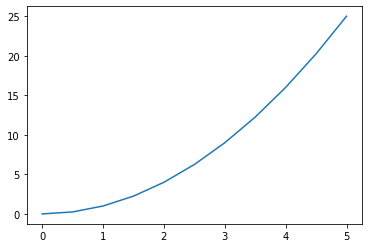
    


```python
# 색깔 넣기
plt.plot(x, y, 'r-')
```


    [<matplotlib.lines.Line2D at 0x2e2f94b4b20>]


    
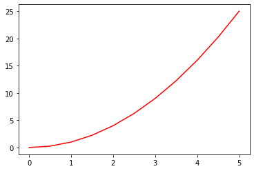
    


```python
plt.xlabel('X Label')
plt.ylabel('Y Label')
plt.title('Title')
```


    Text(0.5, 1.0, 'Title')


    
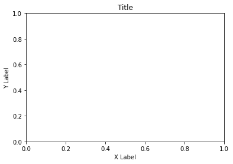
    


```python
plt.subplot(1, 2, 1)
plt.plot(x, y, 'r')

plt.subplot(1, 2, 2)
plt.plot(y, x, 'b')
```


    [<matplotlib.lines.Line2D at 0x2e2f9723be0>]


    
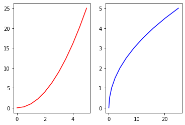
    


```python
# OBJECT ORIENTED
fig = plt.figure()
# left axis, bottom of the axis, width, height
axes = fig.add_axes([0.1, 0.1, 0.8, 0.8])

axes.plot(x, y)
axes.set_xlabel('X Label')
axes.set_ylabel('Y Label')
axes.set_title('Title')
```


    Text(0.5, 1.0, 'Title')


    
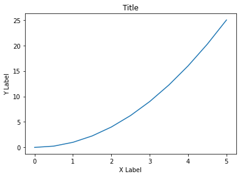
    


```python
fig = plt.figure()

axes1 = fig.add_axes([0.1, 0.1, 0.8, 0.8])
axes2 = fig.add_axes([0.2, 0.5, 0.4, 0.3])

axes1.plot(x, y)
axes1.set_title('LARGER PLOT')

axes2.plot(y, x)
axes2.set_title('SMALLER PLOT')
```


    Text(0.5, 1.0, 'SMALLER PLOT')


    
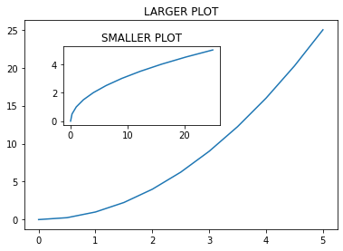
    


```python
# diff between plot and subplot
'''
plot: single plot
subplots: mulitple plots by rows and columes
'''
```


```python
fig, axes = plt.subplots(nrows=1, ncols=2)

# axes.plot(x, y)
# plt.tight_layout()

'''
for current_ax in axes:
    current_ax.plot(x, y)
'''

axes[0].plot(x, y)
axes[0].set_title('First Plot')

axes[1].plot(y, x)
axes[1].set_title('Second Plot')

plt.tight_layout()
```


    
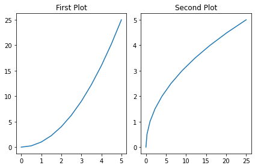
    


```python
axes
```


    array([<AxesSubplot:>, <AxesSubplot:>], dtype=object)


```python
# fig = plt.figure(figsize=(3, 2), dpi=100)
# dpi: dops per inch

fig = plt.figure(figsize=(8, 2))

ax = fig.add_axes([0, 0, 1, 1])
ax.plot(x, y)
```


    [<matplotlib.lines.Line2D at 0x2e2fa952a00>]


    
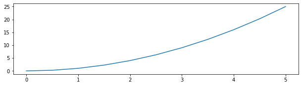
    


```python
fig, axes = plt.subplots(nrows=2, ncols=1, figsize=(8, 2))

axes[0].plot(x, y)
axes[1].plot(x, y)
plt.tight_layout()
```


    
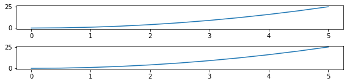
    


```python
fig.savefig('my_picture.png', dpi=200)
```


```python
fig = plt.figure()

ax = fig.add_axes([0, 0, 1, 1])
ax.plot(x, y)
ax.set_title('Title')
ax.set_ylabel('Y')
ax.set_xlabel('X')
```


    Text(0.5, 0, 'X')


    
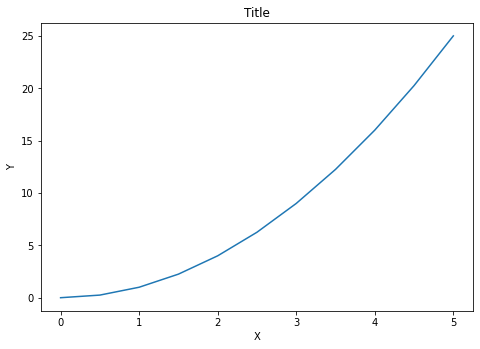
    


```python
fig.savefig('my_picture2', dpi=200)
```


```python
fig = plt.figure()

ax = fig.add_axes([0, 0, 1, 1])
ax.plot(x, x**2, label='X Squared')
ax.plot(x, x**3, label='X Cubed')

ax.legend(loc=0)
```


    <matplotlib.legend.Legend at 0x2e2fc93cd00>


    
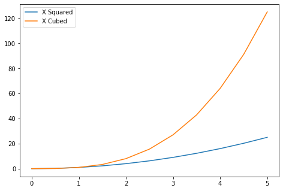
    


```python
'''
The location of the legend. Possible codes are:

Location String	Location Code
‘best’	0
‘upper right’	1
‘upper left’	2
‘lower left’	3
‘lower right’	4
‘right’	5
‘center left’	6
‘center right’	7
‘lower center’	8
‘upper center’	9
‘center’	10

'''
```


    '\nThe location of the legend. Possible codes are:\n\nLocation String\tLocation Code\n‘best’\t0\n‘upper right’\t1\n‘upper left’\t2\n‘lower left’\t3\n‘lower right’\t4\n‘right’\t5\n‘center left’\t6\n‘center right’\t7\n‘lower center’\t8\n‘upper center’\t9\n‘center’\t10\n\n'


```python
fig = plt.figure()

ax = fig.add_axes([0, 0, 1, 1])
ax.plot(x, x**2, label='X Squared')
ax.plot(x, x**3, label='X Cubed')

ax.legend(loc=(0.1, 0.1))
```


    <matplotlib.legend.Legend at 0x2e2fc9ce340>


    
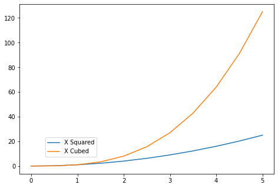
    


```python
fig = plt.figure()

ax = fig.add_axes([0, 0, 1, 1])
ax.plot(x, y, color='#FF8CFF', linewidth=5)
```


    [<matplotlib.lines.Line2D at 0x2e2fcbbc4f0>]


    
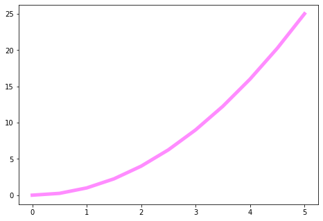
    


```python
fig = plt.figure()

ax = fig.add_axes([0, 0, 1, 1])
ax.plot(x, y, color='#FF8CFF', linewidth=3, alpha=0.5)
```


    [<matplotlib.lines.Line2D at 0x2e2fcc7ec40>]


    
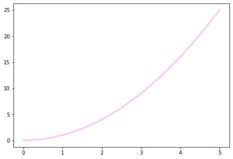
    


```python
fig = plt.figure()

ax = fig.add_axes([0, 0, 1, 1])
ax.plot(x, y, color='#FF8CFF', lw=3, linestyle='-.')
```


    [<matplotlib.lines.Line2D at 0x2e2fcce1f10>]


    

    


```python
fig = plt.figure()

ax = fig.add_axes([0, 0, 1, 1])
ax.plot(x, y, color='#FF8CFF', lw=3, linestyle=':')
```


    [<matplotlib.lines.Line2D at 0x2e2fcd51280>]


    
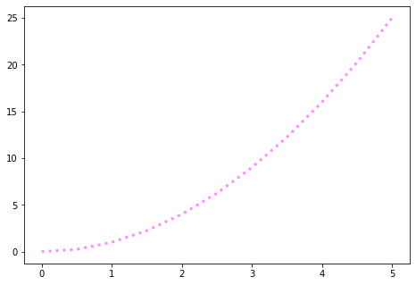
    


```python
fig = plt.figure()

ax = fig.add_axes([0, 0, 1, 1])
ax.plot(x, y, color='#FF8CFF', lw=3, ls='--')
```


    [<matplotlib.lines.Line2D at 0x2e2fcf44340>]


    
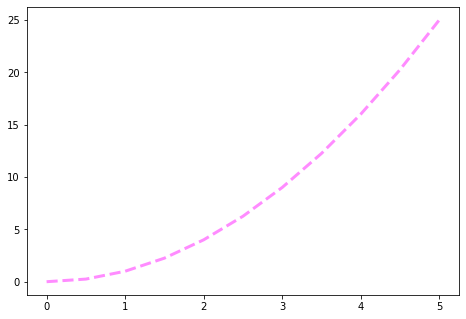
    


```python
x
```


    array([0. , 0.5, 1. , 1.5, 2. , 2.5, 3. , 3.5, 4. , 4.5, 5. ])


```python
len(x)
```


    11


```python
fig = plt.figure()

ax = fig.add_axes([0, 0, 1, 1])
ax.plot(x, y, color='#FF8CFF', lw=3, ls='-', marker='o')
```


    [<matplotlib.lines.Line2D at 0x2e2fcfa4730>]


    
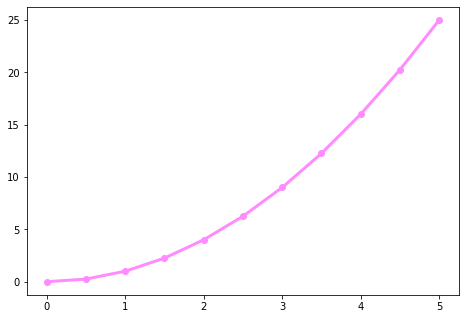
    


```python
fig = plt.figure()

ax = fig.add_axes([0, 0, 1, 1])
ax.plot(x, y, color='#FF8CFF', lw=3, ls='-', marker='+')
```


    [<matplotlib.lines.Line2D at 0x2e2fdfd6a90>]


    

    


```python
fig = plt.figure()

ax = fig.add_axes([0, 0, 1, 1])
ax.plot(x, y, color='#FF8CFF', lw=1, ls='-', marker='*', markersize=10)
```


    [<matplotlib.lines.Line2D at 0x2e2fe0ab220>]


    

    


```python
fig = plt.figure()

ax = fig.add_axes([0, 0, 1, 1])
ax.plot(x, y, color='#FF8CFF', lw=1, ls='-', marker='o', markersize=20, 
        markerfacecolor='yellow')
```


    [<matplotlib.lines.Line2D at 0x2e2fe28d190>]


    
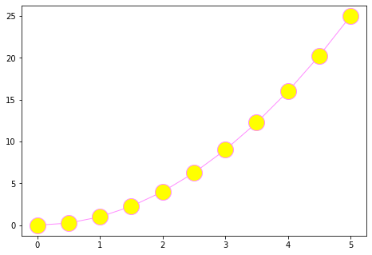
    


```python
fig = plt.figure()

ax = fig.add_axes([0, 0, 1, 1])
ax.plot(x, y, color='#FF8CFF', lw=1, ls='-', marker='o', markersize=20, 
        markerfacecolor='yellow', markeredgewidth=3)
```


    [<matplotlib.lines.Line2D at 0x2e2fe34d880>]


    
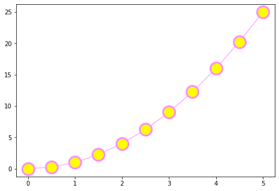
    


```python
fig = plt.figure()

ax = fig.add_axes([0, 0, 1, 1])
ax.plot(x, y, color='#FF8CFF', lw=1, ls='-', marker='o', markersize=20, 
        markerfacecolor='yellow', markeredgewidth=3, markeredgecolor='green')
```


    [<matplotlib.lines.Line2D at 0x2e2fe3b0be0>]


    
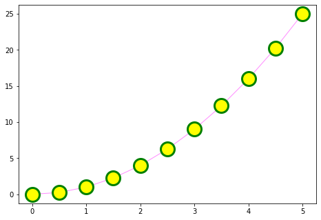
    


```python
fig = plt.figure()

ax = fig.add_axes([0, 0, 1, 1])
ax.plot(x, y, color='#FF8CFF', lw=2, ls='--')

# 해당 부분을 줌으로 당겨서 보여줌
ax.set_xlim([0, 1])
ax.set_ylim([0, 2])
```


    (0.0, 2.0)


    
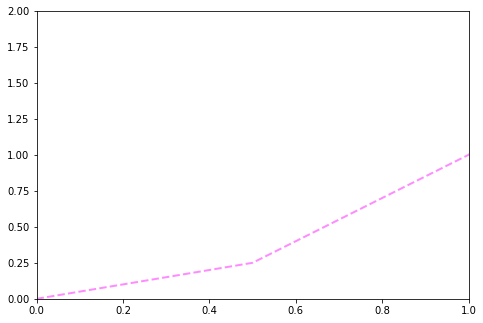
    


```python

```
