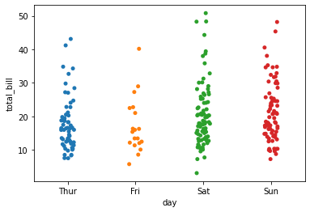

```python
import seaborn as sns
%matplotlib inline
tips = sns.load_dataset('tips')
tips.head()
```


<div>
<style scoped>
    .dataframe tbody tr th:only-of-type {
        vertical-align: middle;
    }

    .dataframe tbody tr th {
        vertical-align: top;
    }

    .dataframe thead th {
        text-align: right;
    }
</style>
<table border="1" class="dataframe">
  <thead>
    <tr style="text-align: right;">
      <th></th>
      <th>total_bill</th>
      <th>tip</th>
      <th>sex</th>
      <th>smoker</th>
      <th>day</th>
      <th>time</th>
      <th>size</th>
    </tr>
  </thead>
  <tbody>
    <tr>
      <th>0</th>
      <td>16.99</td>
      <td>1.01</td>
      <td>Female</td>
      <td>No</td>
      <td>Sun</td>
      <td>Dinner</td>
      <td>2</td>
    </tr>
    <tr>
      <th>1</th>
      <td>10.34</td>
      <td>1.66</td>
      <td>Male</td>
      <td>No</td>
      <td>Sun</td>
      <td>Dinner</td>
      <td>3</td>
    </tr>
    <tr>
      <th>2</th>
      <td>21.01</td>
      <td>3.50</td>
      <td>Male</td>
      <td>No</td>
      <td>Sun</td>
      <td>Dinner</td>
      <td>3</td>
    </tr>
    <tr>
      <th>3</th>
      <td>23.68</td>
      <td>3.31</td>
      <td>Male</td>
      <td>No</td>
      <td>Sun</td>
      <td>Dinner</td>
      <td>2</td>
    </tr>
    <tr>
      <th>4</th>
      <td>24.59</td>
      <td>3.61</td>
      <td>Female</td>
      <td>No</td>
      <td>Sun</td>
      <td>Dinner</td>
      <td>4</td>
    </tr>
  </tbody>
</table>
</div>


```python
sns.barplot(x='sex', y='total_bill', data=tips) # barplot: average nemerical data for category, x: categorical data, y: numerical data
```


    <AxesSubplot:xlabel='sex', ylabel='total_bill'>


    

    


```python
import numpy as np
```


```python

```


```python
sns.barplot(x='sex', y='total_bill', data=tips, estimator=np.std) # estimator: aggregation functions
```


    <AxesSubplot:xlabel='sex', ylabel='total_bill'>


    

    


```python
sns.countplot(x='sex', data=tips)
```


    <AxesSubplot:xlabel='sex', ylabel='count'>


    

    


```python
sns.boxplot(x='day', y='total_bill', data=tips) # x: categorical data, y: numerical data
```


    <AxesSubplot:xlabel='day', ylabel='total_bill'>


    

    


```python
sns.boxplot(x='day', y='total_bill', data=tips, hue='smoker')
```


    <AxesSubplot:xlabel='day', ylabel='total_bill'>


    

    


```python
sns.violinplot(x='day', y='total_bill', data=tips)
```


    <AxesSubplot:xlabel='day', ylabel='total_bill'>


    

    


```python
sns.violinplot(x='day', y='total_bill', data=tips, hue='sex')
```


    <AxesSubplot:xlabel='day', ylabel='total_bill'>


    

    


```python
sns.violinplot(x='day', y='total_bill', data=tips, hue='sex', split=True)
```


    <AxesSubplot:xlabel='day', ylabel='total_bill'>


    

    


```python
sns.stripplot(x='day', y='total_bill', data=tips, jitter=True)
```


    <AxesSubplot:xlabel='day', ylabel='total_bill'>


    

    


```python
sns.stripplot(x='day', y='total_bill', data=tips, jitter=False)
```


    <AxesSubplot:xlabel='day', ylabel='total_bill'>


    

    


```python
sns.stripplot(x='day', y='total_bill', data=tips, jitter=True, hue='sex')
```


    <AxesSubplot:xlabel='day', ylabel='total_bill'>


    

    


```python
sns.stripplot(x='day', y='total_bill', data=tips, jitter=True, hue='sex', split=True)
```

    C:\ProgramData\Anaconda3\lib\site-packages\seaborn\categorical.py:2805: UserWarning: The `split` parameter has been renamed to `dodge`.
      warnings.warn(msg, UserWarning)
    


    <AxesSubplot:xlabel='day', ylabel='total_bill'>


    

    


```python
sns.swarmplot(x='day', y='total_bill', data=tips)
```


    <AxesSubplot:xlabel='day', ylabel='total_bill'>


    

    


```python
sns.violinplot(x='day', y='total_bill', data=tips)
sns.swarmplot(x='day', y='total_bill', data=tips, color='black')
```


    <AxesSubplot:xlabel='day', ylabel='total_bill'>


    

    


```python
sns.factorplot(x='day', y='total_bill', data=tips, kind='bar')
```

    C:\ProgramData\Anaconda3\lib\site-packages\seaborn\categorical.py:3717: UserWarning: The `factorplot` function has been renamed to `catplot`. The original name will be removed in a future release. Please update your code. Note that the default `kind` in `factorplot` (`'point'`) has changed `'strip'` in `catplot`.
      warnings.warn(msg)
    


    <seaborn.axisgrid.FacetGrid at 0x26bb8e11b50>


    

    


```python
sns.factorplot(x='day', y='total_bill', data=tips, kind='violin')
```

    C:\ProgramData\Anaconda3\lib\site-packages\seaborn\categorical.py:3717: UserWarning: The `factorplot` function has been renamed to `catplot`. The original name will be removed in a future release. Please update your code. Note that the default `kind` in `factorplot` (`'point'`) has changed `'strip'` in `catplot`.
      warnings.warn(msg)
    


    <seaborn.axisgrid.FacetGrid at 0x26bb8e22970>


    

    


```python

```
