```python
import seaborn as sns
%matplotlib inline
tips = sns.load_dataset('tips')
flights = sns.load_dataset('flights')
tips.head()
```


<div>
<style scoped>
    .dataframe tbody tr th:only-of-type {
        vertical-align: middle;
    }

    .dataframe tbody tr th {
        vertical-align: top;
    }

    .dataframe thead th {
        text-align: right;
    }
</style>
<table border="1" class="dataframe">
  <thead>
    <tr style="text-align: right;">
      <th></th>
      <th>total_bill</th>
      <th>tip</th>
      <th>sex</th>
      <th>smoker</th>
      <th>day</th>
      <th>time</th>
      <th>size</th>
    </tr>
  </thead>
  <tbody>
    <tr>
      <th>0</th>
      <td>16.99</td>
      <td>1.01</td>
      <td>Female</td>
      <td>No</td>
      <td>Sun</td>
      <td>Dinner</td>
      <td>2</td>
    </tr>
    <tr>
      <th>1</th>
      <td>10.34</td>
      <td>1.66</td>
      <td>Male</td>
      <td>No</td>
      <td>Sun</td>
      <td>Dinner</td>
      <td>3</td>
    </tr>
    <tr>
      <th>2</th>
      <td>21.01</td>
      <td>3.50</td>
      <td>Male</td>
      <td>No</td>
      <td>Sun</td>
      <td>Dinner</td>
      <td>3</td>
    </tr>
    <tr>
      <th>3</th>
      <td>23.68</td>
      <td>3.31</td>
      <td>Male</td>
      <td>No</td>
      <td>Sun</td>
      <td>Dinner</td>
      <td>2</td>
    </tr>
    <tr>
      <th>4</th>
      <td>24.59</td>
      <td>3.61</td>
      <td>Female</td>
      <td>No</td>
      <td>Sun</td>
      <td>Dinner</td>
      <td>4</td>
    </tr>
  </tbody>
</table>
</div>


```python
flights.head()
```


<div>
<style scoped>
    .dataframe tbody tr th:only-of-type {
        vertical-align: middle;
    }

    .dataframe tbody tr th {
        vertical-align: top;
    }

    .dataframe thead th {
        text-align: right;
    }
</style>
<table border="1" class="dataframe">
  <thead>
    <tr style="text-align: right;">
      <th></th>
      <th>year</th>
      <th>month</th>
      <th>passengers</th>
    </tr>
  </thead>
  <tbody>
    <tr>
      <th>0</th>
      <td>1949</td>
      <td>Jan</td>
      <td>112</td>
    </tr>
    <tr>
      <th>1</th>
      <td>1949</td>
      <td>Feb</td>
      <td>118</td>
    </tr>
    <tr>
      <th>2</th>
      <td>1949</td>
      <td>Mar</td>
      <td>132</td>
    </tr>
    <tr>
      <th>3</th>
      <td>1949</td>
      <td>Apr</td>
      <td>129</td>
    </tr>
    <tr>
      <th>4</th>
      <td>1949</td>
      <td>May</td>
      <td>121</td>
    </tr>
  </tbody>
</table>
</div>


```python
tc =tips.corr()
```


```python
sns.heatmap(tc)
```


    <AxesSubplot:>


    
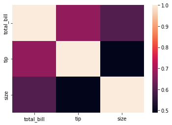
    


```python
sns.heatmap(tc, annot=True)
```


    <AxesSubplot:>


    
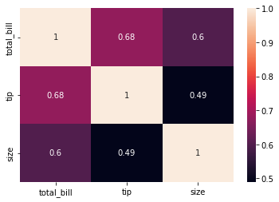
    


```python
sns.heatmap(tc, annot=True, cmap='coolwarm') # color map
```


    <AxesSubplot:>


    
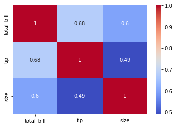
    


```python
flights
```


<div>
<style scoped>
    .dataframe tbody tr th:only-of-type {
        vertical-align: middle;
    }

    .dataframe tbody tr th {
        vertical-align: top;
    }

    .dataframe thead th {
        text-align: right;
    }
</style>
<table border="1" class="dataframe">
  <thead>
    <tr style="text-align: right;">
      <th></th>
      <th>year</th>
      <th>month</th>
      <th>passengers</th>
    </tr>
  </thead>
  <tbody>
    <tr>
      <th>0</th>
      <td>1949</td>
      <td>Jan</td>
      <td>112</td>
    </tr>
    <tr>
      <th>1</th>
      <td>1949</td>
      <td>Feb</td>
      <td>118</td>
    </tr>
    <tr>
      <th>2</th>
      <td>1949</td>
      <td>Mar</td>
      <td>132</td>
    </tr>
    <tr>
      <th>3</th>
      <td>1949</td>
      <td>Apr</td>
      <td>129</td>
    </tr>
    <tr>
      <th>4</th>
      <td>1949</td>
      <td>May</td>
      <td>121</td>
    </tr>
    <tr>
      <th>...</th>
      <td>...</td>
      <td>...</td>
      <td>...</td>
    </tr>
    <tr>
      <th>139</th>
      <td>1960</td>
      <td>Aug</td>
      <td>606</td>
    </tr>
    <tr>
      <th>140</th>
      <td>1960</td>
      <td>Sep</td>
      <td>508</td>
    </tr>
    <tr>
      <th>141</th>
      <td>1960</td>
      <td>Oct</td>
      <td>461</td>
    </tr>
    <tr>
      <th>142</th>
      <td>1960</td>
      <td>Nov</td>
      <td>390</td>
    </tr>
    <tr>
      <th>143</th>
      <td>1960</td>
      <td>Dec</td>
      <td>432</td>
    </tr>
  </tbody>
</table>
<p>144 rows × 3 columns</p>
</div>


```python
flights.pivot_table(index='month')
```


<div>
<style scoped>
    .dataframe tbody tr th:only-of-type {
        vertical-align: middle;
    }

    .dataframe tbody tr th {
        vertical-align: top;
    }

    .dataframe thead th {
        text-align: right;
    }
</style>
<table border="1" class="dataframe">
  <thead>
    <tr style="text-align: right;">
      <th></th>
      <th>passengers</th>
      <th>year</th>
    </tr>
    <tr>
      <th>month</th>
      <th></th>
      <th></th>
    </tr>
  </thead>
  <tbody>
    <tr>
      <th>Jan</th>
      <td>241.750000</td>
      <td>1954.5</td>
    </tr>
    <tr>
      <th>Feb</th>
      <td>235.000000</td>
      <td>1954.5</td>
    </tr>
    <tr>
      <th>Mar</th>
      <td>270.166667</td>
      <td>1954.5</td>
    </tr>
    <tr>
      <th>Apr</th>
      <td>267.083333</td>
      <td>1954.5</td>
    </tr>
    <tr>
      <th>May</th>
      <td>271.833333</td>
      <td>1954.5</td>
    </tr>
    <tr>
      <th>Jun</th>
      <td>311.666667</td>
      <td>1954.5</td>
    </tr>
    <tr>
      <th>Jul</th>
      <td>351.333333</td>
      <td>1954.5</td>
    </tr>
    <tr>
      <th>Aug</th>
      <td>351.083333</td>
      <td>1954.5</td>
    </tr>
    <tr>
      <th>Sep</th>
      <td>302.416667</td>
      <td>1954.5</td>
    </tr>
    <tr>
      <th>Oct</th>
      <td>266.583333</td>
      <td>1954.5</td>
    </tr>
    <tr>
      <th>Nov</th>
      <td>232.833333</td>
      <td>1954.5</td>
    </tr>
    <tr>
      <th>Dec</th>
      <td>261.833333</td>
      <td>1954.5</td>
    </tr>
  </tbody>
</table>
</div>


```python
flights.pivot_table(index='month', columns='year', values='passengers')
```


<div>
<style scoped>
    .dataframe tbody tr th:only-of-type {
        vertical-align: middle;
    }

    .dataframe tbody tr th {
        vertical-align: top;
    }

    .dataframe thead th {
        text-align: right;
    }
</style>
<table border="1" class="dataframe">
  <thead>
    <tr style="text-align: right;">
      <th>year</th>
      <th>1949</th>
      <th>1950</th>
      <th>1951</th>
      <th>1952</th>
      <th>1953</th>
      <th>1954</th>
      <th>1955</th>
      <th>1956</th>
      <th>1957</th>
      <th>1958</th>
      <th>1959</th>
      <th>1960</th>
    </tr>
    <tr>
      <th>month</th>
      <th></th>
      <th></th>
      <th></th>
      <th></th>
      <th></th>
      <th></th>
      <th></th>
      <th></th>
      <th></th>
      <th></th>
      <th></th>
      <th></th>
    </tr>
  </thead>
  <tbody>
    <tr>
      <th>Jan</th>
      <td>112</td>
      <td>115</td>
      <td>145</td>
      <td>171</td>
      <td>196</td>
      <td>204</td>
      <td>242</td>
      <td>284</td>
      <td>315</td>
      <td>340</td>
      <td>360</td>
      <td>417</td>
    </tr>
    <tr>
      <th>Feb</th>
      <td>118</td>
      <td>126</td>
      <td>150</td>
      <td>180</td>
      <td>196</td>
      <td>188</td>
      <td>233</td>
      <td>277</td>
      <td>301</td>
      <td>318</td>
      <td>342</td>
      <td>391</td>
    </tr>
    <tr>
      <th>Mar</th>
      <td>132</td>
      <td>141</td>
      <td>178</td>
      <td>193</td>
      <td>236</td>
      <td>235</td>
      <td>267</td>
      <td>317</td>
      <td>356</td>
      <td>362</td>
      <td>406</td>
      <td>419</td>
    </tr>
    <tr>
      <th>Apr</th>
      <td>129</td>
      <td>135</td>
      <td>163</td>
      <td>181</td>
      <td>235</td>
      <td>227</td>
      <td>269</td>
      <td>313</td>
      <td>348</td>
      <td>348</td>
      <td>396</td>
      <td>461</td>
    </tr>
    <tr>
      <th>May</th>
      <td>121</td>
      <td>125</td>
      <td>172</td>
      <td>183</td>
      <td>229</td>
      <td>234</td>
      <td>270</td>
      <td>318</td>
      <td>355</td>
      <td>363</td>
      <td>420</td>
      <td>472</td>
    </tr>
    <tr>
      <th>Jun</th>
      <td>135</td>
      <td>149</td>
      <td>178</td>
      <td>218</td>
      <td>243</td>
      <td>264</td>
      <td>315</td>
      <td>374</td>
      <td>422</td>
      <td>435</td>
      <td>472</td>
      <td>535</td>
    </tr>
    <tr>
      <th>Jul</th>
      <td>148</td>
      <td>170</td>
      <td>199</td>
      <td>230</td>
      <td>264</td>
      <td>302</td>
      <td>364</td>
      <td>413</td>
      <td>465</td>
      <td>491</td>
      <td>548</td>
      <td>622</td>
    </tr>
    <tr>
      <th>Aug</th>
      <td>148</td>
      <td>170</td>
      <td>199</td>
      <td>242</td>
      <td>272</td>
      <td>293</td>
      <td>347</td>
      <td>405</td>
      <td>467</td>
      <td>505</td>
      <td>559</td>
      <td>606</td>
    </tr>
    <tr>
      <th>Sep</th>
      <td>136</td>
      <td>158</td>
      <td>184</td>
      <td>209</td>
      <td>237</td>
      <td>259</td>
      <td>312</td>
      <td>355</td>
      <td>404</td>
      <td>404</td>
      <td>463</td>
      <td>508</td>
    </tr>
    <tr>
      <th>Oct</th>
      <td>119</td>
      <td>133</td>
      <td>162</td>
      <td>191</td>
      <td>211</td>
      <td>229</td>
      <td>274</td>
      <td>306</td>
      <td>347</td>
      <td>359</td>
      <td>407</td>
      <td>461</td>
    </tr>
    <tr>
      <th>Nov</th>
      <td>104</td>
      <td>114</td>
      <td>146</td>
      <td>172</td>
      <td>180</td>
      <td>203</td>
      <td>237</td>
      <td>271</td>
      <td>305</td>
      <td>310</td>
      <td>362</td>
      <td>390</td>
    </tr>
    <tr>
      <th>Dec</th>
      <td>118</td>
      <td>140</td>
      <td>166</td>
      <td>194</td>
      <td>201</td>
      <td>229</td>
      <td>278</td>
      <td>306</td>
      <td>336</td>
      <td>337</td>
      <td>405</td>
      <td>432</td>
    </tr>
  </tbody>
</table>
</div>


```python
fp = flights.pivot_table(index='month', columns='year', values='passengers')
```


```python
sns.heatmap(fp)
```


    <AxesSubplot:xlabel='year', ylabel='month'>


    
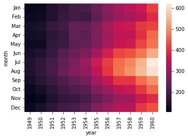
    


```python
sns.heatmap(fp, cmap='magma')
```


    <AxesSubplot:xlabel='year', ylabel='month'>


    
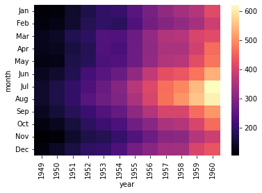
    


```python
sns.heatmap(fp, cmap='magma', linecolor='white', linewidth=1)
```


    <AxesSubplot:xlabel='year', ylabel='month'>


    
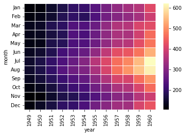
    


```python
sns.heatmap(fp, cmap='magma', linecolor='white', linewidth=3)
```


    <AxesSubplot:xlabel='year', ylabel='month'>


    
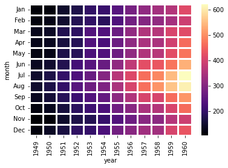
    


```python
sns.heatmap(fp, cmap='coolwarm', linecolor='white', linewidth=1)
```


    <AxesSubplot:xlabel='year', ylabel='month'>


    
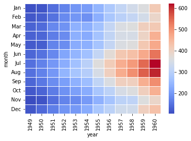
    


```python
sns.clustermap(fp)
```


    <seaborn.matrix.ClusterGrid at 0x1febebca640>


    
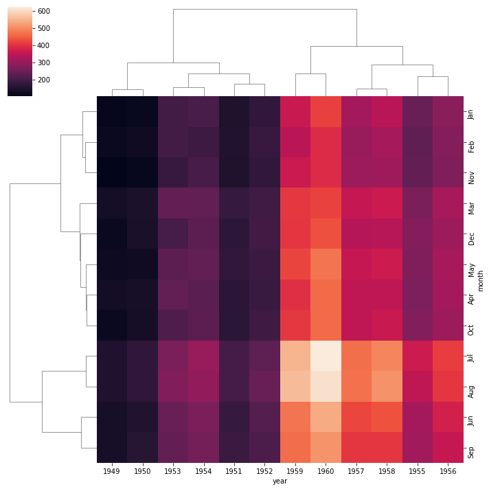
    


```python
sns.clustermap(fp, cmap='coolwarm')
```


    <seaborn.matrix.ClusterGrid at 0x1febefcf100>


    
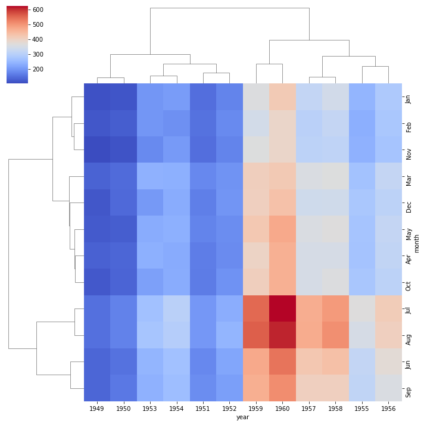
    


```python
sns.clustermap(fp, cmap='coolwarm', standard_scale=1)
```


    <seaborn.matrix.ClusterGrid at 0x1febeb78040>


    
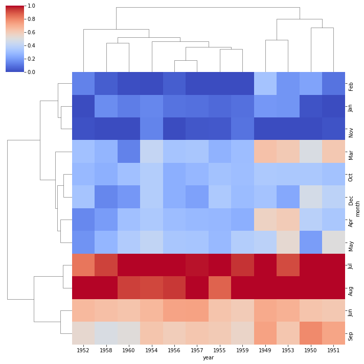
    


```python

```
