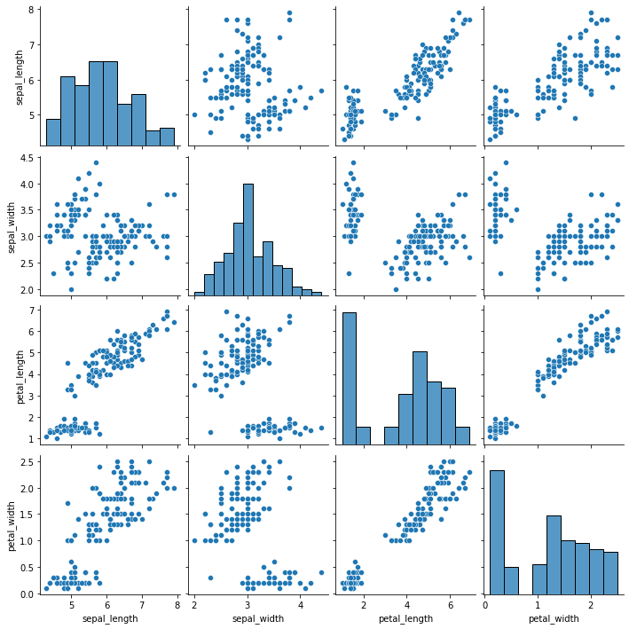
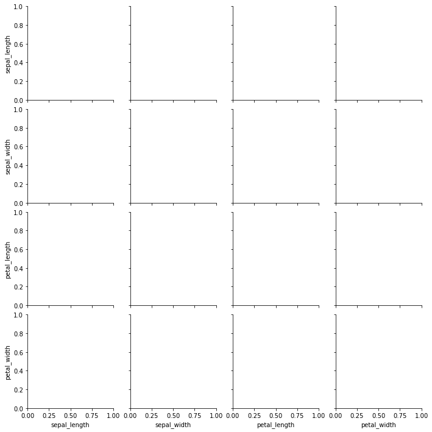
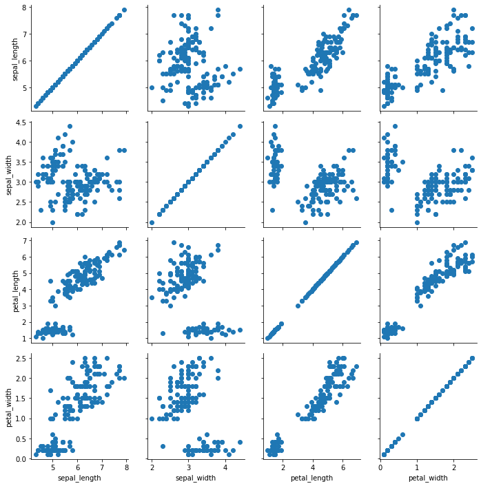
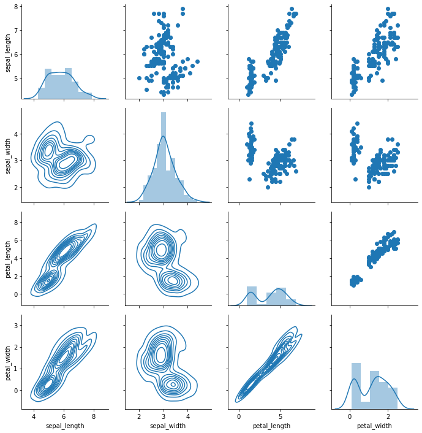
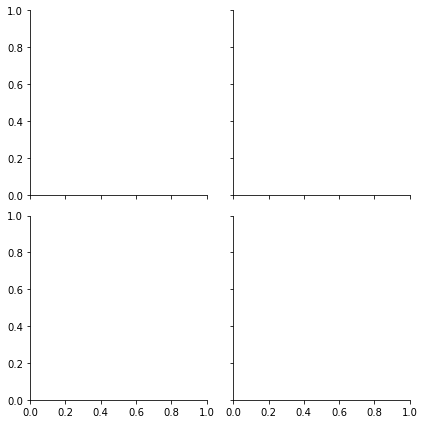
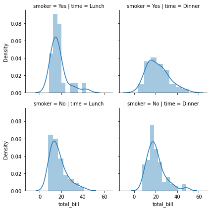
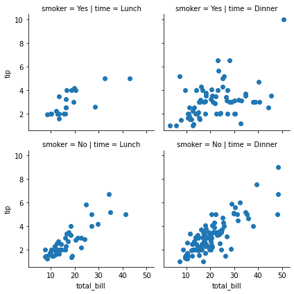

```python
import seaborn as sns
import matplotlib.pyplot as plt
%matplotlib inline
iris = sns.load_dataset('iris')
iris.head()
```


<div>
<style scoped>
    .dataframe tbody tr th:only-of-type {
        vertical-align: middle;
    }

    .dataframe tbody tr th {
        vertical-align: top;
    }

    .dataframe thead th {
        text-align: right;
    }
</style>
<table border="1" class="dataframe">
  <thead>
    <tr style="text-align: right;">
      <th></th>
      <th>sepal_length</th>
      <th>sepal_width</th>
      <th>petal_length</th>
      <th>petal_width</th>
      <th>species</th>
    </tr>
  </thead>
  <tbody>
    <tr>
      <th>0</th>
      <td>5.1</td>
      <td>3.5</td>
      <td>1.4</td>
      <td>0.2</td>
      <td>setosa</td>
    </tr>
    <tr>
      <th>1</th>
      <td>4.9</td>
      <td>3.0</td>
      <td>1.4</td>
      <td>0.2</td>
      <td>setosa</td>
    </tr>
    <tr>
      <th>2</th>
      <td>4.7</td>
      <td>3.2</td>
      <td>1.3</td>
      <td>0.2</td>
      <td>setosa</td>
    </tr>
    <tr>
      <th>3</th>
      <td>4.6</td>
      <td>3.1</td>
      <td>1.5</td>
      <td>0.2</td>
      <td>setosa</td>
    </tr>
    <tr>
      <th>4</th>
      <td>5.0</td>
      <td>3.6</td>
      <td>1.4</td>
      <td>0.2</td>
      <td>setosa</td>
    </tr>
  </tbody>
</table>
</div>


```python
iris['species'].unique()
```


    array(['setosa', 'versicolor', 'virginica'], dtype=object)


```python
sns.pairplot(iris)
```


    <seaborn.axisgrid.PairGrid at 0x20d0ded65e0>


    

    


```python
sns.PairGrid(iris)
```


    <seaborn.axisgrid.PairGrid at 0x20d0f9bfb20>


    

    


```python
g = sns.PairGrid(iris)
g.map(plt.scatter)
```


    <seaborn.axisgrid.PairGrid at 0x20d10280d60>


    

    


```python
g = sns.PairGrid(iris)
g.map_diag(sns.distplot)
g.map_upper(plt.scatter)
g.map_lower(sns.kdeplot)
```

    C:\Work\Utils\Anaconda3\lib\site-packages\seaborn\distributions.py:2619: FutureWarning: `distplot` is a deprecated function and will be removed in a future version. Please adapt your code to use either `displot` (a figure-level function with similar flexibility) or `histplot` (an axes-level function for histograms).
      warnings.warn(msg, FutureWarning)
    C:\Work\Utils\Anaconda3\lib\site-packages\seaborn\distributions.py:2619: FutureWarning: `distplot` is a deprecated function and will be removed in a future version. Please adapt your code to use either `displot` (a figure-level function with similar flexibility) or `histplot` (an axes-level function for histograms).
      warnings.warn(msg, FutureWarning)
    C:\Work\Utils\Anaconda3\lib\site-packages\seaborn\distributions.py:2619: FutureWarning: `distplot` is a deprecated function and will be removed in a future version. Please adapt your code to use either `displot` (a figure-level function with similar flexibility) or `histplot` (an axes-level function for histograms).
      warnings.warn(msg, FutureWarning)
    C:\Work\Utils\Anaconda3\lib\site-packages\seaborn\distributions.py:2619: FutureWarning: `distplot` is a deprecated function and will be removed in a future version. Please adapt your code to use either `displot` (a figure-level function with similar flexibility) or `histplot` (an axes-level function for histograms).
      warnings.warn(msg, FutureWarning)
    


    <seaborn.axisgrid.PairGrid at 0x20d132e6d30>


    

    


```python
tips = sns.load_dataset('tips')
```


```python
tips.head()
```


<div>
<style scoped>
    .dataframe tbody tr th:only-of-type {
        vertical-align: middle;
    }

    .dataframe tbody tr th {
        vertical-align: top;
    }

    .dataframe thead th {
        text-align: right;
    }
</style>
<table border="1" class="dataframe">
  <thead>
    <tr style="text-align: right;">
      <th></th>
      <th>total_bill</th>
      <th>tip</th>
      <th>sex</th>
      <th>smoker</th>
      <th>day</th>
      <th>time</th>
      <th>size</th>
    </tr>
  </thead>
  <tbody>
    <tr>
      <th>0</th>
      <td>16.99</td>
      <td>1.01</td>
      <td>Female</td>
      <td>No</td>
      <td>Sun</td>
      <td>Dinner</td>
      <td>2</td>
    </tr>
    <tr>
      <th>1</th>
      <td>10.34</td>
      <td>1.66</td>
      <td>Male</td>
      <td>No</td>
      <td>Sun</td>
      <td>Dinner</td>
      <td>3</td>
    </tr>
    <tr>
      <th>2</th>
      <td>21.01</td>
      <td>3.50</td>
      <td>Male</td>
      <td>No</td>
      <td>Sun</td>
      <td>Dinner</td>
      <td>3</td>
    </tr>
    <tr>
      <th>3</th>
      <td>23.68</td>
      <td>3.31</td>
      <td>Male</td>
      <td>No</td>
      <td>Sun</td>
      <td>Dinner</td>
      <td>2</td>
    </tr>
    <tr>
      <th>4</th>
      <td>24.59</td>
      <td>3.61</td>
      <td>Female</td>
      <td>No</td>
      <td>Sun</td>
      <td>Dinner</td>
      <td>4</td>
    </tr>
  </tbody>
</table>
</div>


```python
g = sns.FacetGrid(data=tips, col='time', row='smoker')
```


    

    


```python
g = sns.FacetGrid(data=tips, col='time', row='smoker')
g.map(sns.distplot, 'total_bill')
```

    C:\Work\Utils\Anaconda3\lib\site-packages\seaborn\distributions.py:2619: FutureWarning: `distplot` is a deprecated function and will be removed in a future version. Please adapt your code to use either `displot` (a figure-level function with similar flexibility) or `histplot` (an axes-level function for histograms).
      warnings.warn(msg, FutureWarning)
    C:\Work\Utils\Anaconda3\lib\site-packages\seaborn\distributions.py:2619: FutureWarning: `distplot` is a deprecated function and will be removed in a future version. Please adapt your code to use either `displot` (a figure-level function with similar flexibility) or `histplot` (an axes-level function for histograms).
      warnings.warn(msg, FutureWarning)
    C:\Work\Utils\Anaconda3\lib\site-packages\seaborn\distributions.py:2619: FutureWarning: `distplot` is a deprecated function and will be removed in a future version. Please adapt your code to use either `displot` (a figure-level function with similar flexibility) or `histplot` (an axes-level function for histograms).
      warnings.warn(msg, FutureWarning)
    C:\Work\Utils\Anaconda3\lib\site-packages\seaborn\distributions.py:2619: FutureWarning: `distplot` is a deprecated function and will be removed in a future version. Please adapt your code to use either `displot` (a figure-level function with similar flexibility) or `histplot` (an axes-level function for histograms).
      warnings.warn(msg, FutureWarning)
    


    <seaborn.axisgrid.FacetGrid at 0x20d15699910>


    

    


```python
g = sns.FacetGrid(data=tips, col='time', row='smoker')
g.map(plt.scatter, 'total_bill', 'tip')
```


    <seaborn.axisgrid.FacetGrid at 0x20d15699dc0>


    

    


```python

```
