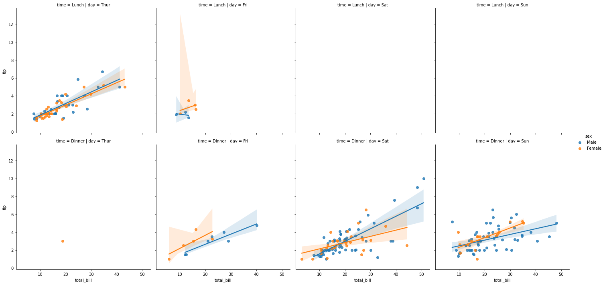

```python
import seaborn as sns
%matplotlib inline
tips = sns.load_dataset('tips')
tips.head()
```


<div>
<style scoped>
    .dataframe tbody tr th:only-of-type {
        vertical-align: middle;
    }

    .dataframe tbody tr th {
        vertical-align: top;
    }

    .dataframe thead th {
        text-align: right;
    }
</style>
<table border="1" class="dataframe">
  <thead>
    <tr style="text-align: right;">
      <th></th>
      <th>total_bill</th>
      <th>tip</th>
      <th>sex</th>
      <th>smoker</th>
      <th>day</th>
      <th>time</th>
      <th>size</th>
    </tr>
  </thead>
  <tbody>
    <tr>
      <th>0</th>
      <td>16.99</td>
      <td>1.01</td>
      <td>Female</td>
      <td>No</td>
      <td>Sun</td>
      <td>Dinner</td>
      <td>2</td>
    </tr>
    <tr>
      <th>1</th>
      <td>10.34</td>
      <td>1.66</td>
      <td>Male</td>
      <td>No</td>
      <td>Sun</td>
      <td>Dinner</td>
      <td>3</td>
    </tr>
    <tr>
      <th>2</th>
      <td>21.01</td>
      <td>3.50</td>
      <td>Male</td>
      <td>No</td>
      <td>Sun</td>
      <td>Dinner</td>
      <td>3</td>
    </tr>
    <tr>
      <th>3</th>
      <td>23.68</td>
      <td>3.31</td>
      <td>Male</td>
      <td>No</td>
      <td>Sun</td>
      <td>Dinner</td>
      <td>2</td>
    </tr>
    <tr>
      <th>4</th>
      <td>24.59</td>
      <td>3.61</td>
      <td>Female</td>
      <td>No</td>
      <td>Sun</td>
      <td>Dinner</td>
      <td>4</td>
    </tr>
  </tbody>
</table>
</div>


```python
sns.lmplot(x='total_bill', y='tip', data=tips)
```


    <seaborn.axisgrid.FacetGrid at 0x20e760a0430>


    

    


```python
sns.lmplot(x='total_bill', y='tip', data=tips, hue='sex')
```


    <seaborn.axisgrid.FacetGrid at 0x20e7b2d4e80>


    

    


```python
sns.lmplot(x='total_bill', y='tip', data=tips, hue='sex', markers=['o', 'v'])
```


    <seaborn.axisgrid.FacetGrid at 0x20e760a0730>


    

    


```python
sns.lmplot(x='total_bill', y='tip', data=tips, hue='sex', markers=['o', 'v'], scatter_kws={'s': 100})
```


    <seaborn.axisgrid.FacetGrid at 0x20e7ba7de80>


    

    


```python
sns.lmplot(x='total_bill', y='tip', data=tips, col='sex')
```


    <seaborn.axisgrid.FacetGrid at 0x20e7bb8b850>


    

    


```python
sns.lmplot(x='total_bill', y='tip', data=tips, col='sex', row='time')
```


    <seaborn.axisgrid.FacetGrid at 0x20e7bc95a90>


    

    


```python
sns.lmplot(x='total_bill', y='tip', data=tips, col='day', row='time', hue='sex')
```


    <seaborn.axisgrid.FacetGrid at 0x20e7bb5b490>


    

    


```python
sns.lmplot(x='total_bill', y='tip', data=tips, col='day', hue='sex')
```


    <seaborn.axisgrid.FacetGrid at 0x20e7dd99190>


    

    


```python
sns.lmplot(x='total_bill', y='tip', data=tips, col='day', hue='sex', aspect=0.6, height=8)
```


    <seaborn.axisgrid.FacetGrid at 0x20e7ea18160>


    

    


```python

```
