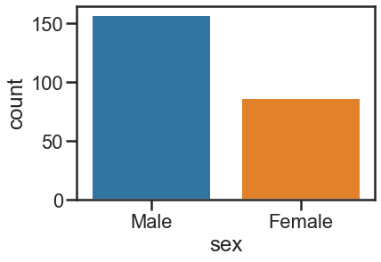

```python
import seaborn as sns
import matplotlib.pyplot as plt
%matplotlib inline
tips = sns.load_dataset('tips')
tips.head()
```


<div>
<style scoped>
    .dataframe tbody tr th:only-of-type {
        vertical-align: middle;
    }

    .dataframe tbody tr th {
        vertical-align: top;
    }

    .dataframe thead th {
        text-align: right;
    }
</style>
<table border="1" class="dataframe">
  <thead>
    <tr style="text-align: right;">
      <th></th>
      <th>total_bill</th>
      <th>tip</th>
      <th>sex</th>
      <th>smoker</th>
      <th>day</th>
      <th>time</th>
      <th>size</th>
    </tr>
  </thead>
  <tbody>
    <tr>
      <th>0</th>
      <td>16.99</td>
      <td>1.01</td>
      <td>Female</td>
      <td>No</td>
      <td>Sun</td>
      <td>Dinner</td>
      <td>2</td>
    </tr>
    <tr>
      <th>1</th>
      <td>10.34</td>
      <td>1.66</td>
      <td>Male</td>
      <td>No</td>
      <td>Sun</td>
      <td>Dinner</td>
      <td>3</td>
    </tr>
    <tr>
      <th>2</th>
      <td>21.01</td>
      <td>3.50</td>
      <td>Male</td>
      <td>No</td>
      <td>Sun</td>
      <td>Dinner</td>
      <td>3</td>
    </tr>
    <tr>
      <th>3</th>
      <td>23.68</td>
      <td>3.31</td>
      <td>Male</td>
      <td>No</td>
      <td>Sun</td>
      <td>Dinner</td>
      <td>2</td>
    </tr>
    <tr>
      <th>4</th>
      <td>24.59</td>
      <td>3.61</td>
      <td>Female</td>
      <td>No</td>
      <td>Sun</td>
      <td>Dinner</td>
      <td>4</td>
    </tr>
  </tbody>
</table>
</div>


```python
sns.countplot(x='sex', data=tips)
```


    <AxesSubplot:xlabel='sex', ylabel='count'>


    

    


```python
sns.set_style('white') # white background
sns.countplot(x='sex', data=tips)
```


    <AxesSubplot:xlabel='sex', ylabel='count'>


    

    


```python
sns.set_style('ticks')
sns.countplot(x='sex', data=tips)
```


    <AxesSubplot:xlabel='sex', ylabel='count'>


    

    


```python
sns.set_style('darkgrid')
sns.countplot(x='sex', data=tips)
```


    <AxesSubplot:xlabel='sex', ylabel='count'>


    

    


```python
sns.set_style('whitegrid')
sns.countplot(x='sex', data=tips)
```


    <AxesSubplot:xlabel='sex', ylabel='count'>


    

    


```python
sns.set_style('ticks')
sns.countplot(x='sex', data=tips)
sns.despine()
```


    

    


```python
sns.set_style('ticks')
sns.countplot(x='sex', data=tips)
sns.despine(left=True, bottom=True)
```


    

    


```python
sns.countplot(x='sex', data=tips)
```


    <AxesSubplot:xlabel='sex', ylabel='count'>


    

    


```python
plt.figure(figsize=(12, 3))
sns.countplot(x='sex', data=tips)
```


    <AxesSubplot:xlabel='sex', ylabel='count'>


    

    


```python
sns.set_context('poster')
sns.countplot(x='sex', data=tips)
```


    <AxesSubplot:xlabel='sex', ylabel='count'>


    

    


```python
sns.set_context('poster', font_scale=3)
sns.countplot(x='sex', data=tips)
```


    <AxesSubplot:xlabel='sex', ylabel='count'>


    

    


```python
sns.set_context('notebook')
sns.countplot(x='sex', data=tips)
```


    <AxesSubplot:xlabel='sex', ylabel='count'>


    

    


```python
sns.lmplot(x='total_bill', y='tip', data=tips)
```


    <seaborn.axisgrid.FacetGrid at 0x1daef07e250>


    

    


```python
sns.lmplot(x='total_bill', y='tip', data=tips, hue='sex')
```


    <seaborn.axisgrid.FacetGrid at 0x1daef0ead00>


    

    


```python
sns.lmplot(x='total_bill', y='tip', data=tips, hue='sex', palette='coolwarm')
```


    <seaborn.axisgrid.FacetGrid at 0x1daeed2b490>


    

    


```python
'''
# ColorMap
https://matplotlib.org/stable/tutorials/colors/colormaps.html
'''

sns.lmplot(x='total_bill', y='tip', data=tips, hue='sex', palette='gist_ncar')
```


    <seaborn.axisgrid.FacetGrid at 0x1daf016da60>


    

    


```python
sns.lmplot(x='total_bill', y='tip', data=tips, hue='sex', palette='seismic')
```


    <seaborn.axisgrid.FacetGrid at 0x1daf02424f0>


    

    


```python

```
