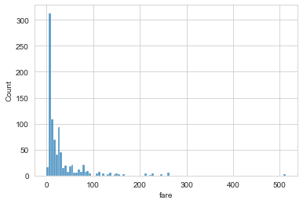

___

<a href='http://www.pieriandata.com'> </a>
___
# Seaborn Exercises

Time to practice your new seaborn skills! Try to recreate the plots below (don't worry about color schemes, just the plot itself.

## The Data

We will be working with a famous titanic data set for these exercises. Later on in the Machine Learning section of the course, we will revisit this data, and use it to predict survival rates of passengers. For now, we'll just focus on the visualization of the data with seaborn:


```python
import seaborn as sns
import matplotlib.pyplot as plt
%matplotlib inline
```


```python
sns.set_style('whitegrid')
```


```python
titanic = sns.load_dataset('titanic')
```


```python
titanic.head()
```


<div>
<style scoped>
    .dataframe tbody tr th:only-of-type {
        vertical-align: middle;
    }

    .dataframe tbody tr th {
        vertical-align: top;
    }

    .dataframe thead th {
        text-align: right;
    }
</style>
<table border="1" class="dataframe">
  <thead>
    <tr style="text-align: right;">
      <th></th>
      <th>survived</th>
      <th>pclass</th>
      <th>sex</th>
      <th>age</th>
      <th>sibsp</th>
      <th>parch</th>
      <th>fare</th>
      <th>embarked</th>
      <th>class</th>
      <th>who</th>
      <th>adult_male</th>
      <th>deck</th>
      <th>embark_town</th>
      <th>alive</th>
      <th>alone</th>
    </tr>
  </thead>
  <tbody>
    <tr>
      <th>0</th>
      <td>0</td>
      <td>3</td>
      <td>male</td>
      <td>22.0</td>
      <td>1</td>
      <td>0</td>
      <td>7.2500</td>
      <td>S</td>
      <td>Third</td>
      <td>man</td>
      <td>True</td>
      <td>NaN</td>
      <td>Southampton</td>
      <td>no</td>
      <td>False</td>
    </tr>
    <tr>
      <th>1</th>
      <td>1</td>
      <td>1</td>
      <td>female</td>
      <td>38.0</td>
      <td>1</td>
      <td>0</td>
      <td>71.2833</td>
      <td>C</td>
      <td>First</td>
      <td>woman</td>
      <td>False</td>
      <td>C</td>
      <td>Cherbourg</td>
      <td>yes</td>
      <td>False</td>
    </tr>
    <tr>
      <th>2</th>
      <td>1</td>
      <td>3</td>
      <td>female</td>
      <td>26.0</td>
      <td>0</td>
      <td>0</td>
      <td>7.9250</td>
      <td>S</td>
      <td>Third</td>
      <td>woman</td>
      <td>False</td>
      <td>NaN</td>
      <td>Southampton</td>
      <td>yes</td>
      <td>True</td>
    </tr>
    <tr>
      <th>3</th>
      <td>1</td>
      <td>1</td>
      <td>female</td>
      <td>35.0</td>
      <td>1</td>
      <td>0</td>
      <td>53.1000</td>
      <td>S</td>
      <td>First</td>
      <td>woman</td>
      <td>False</td>
      <td>C</td>
      <td>Southampton</td>
      <td>yes</td>
      <td>False</td>
    </tr>
    <tr>
      <th>4</th>
      <td>0</td>
      <td>3</td>
      <td>male</td>
      <td>35.0</td>
      <td>0</td>
      <td>0</td>
      <td>8.0500</td>
      <td>S</td>
      <td>Third</td>
      <td>man</td>
      <td>True</td>
      <td>NaN</td>
      <td>Southampton</td>
      <td>no</td>
      <td>True</td>
    </tr>
  </tbody>
</table>
</div>


# Exercises

** Recreate the plots below using the titanic dataframe. There are very few hints since most of the plots can be done with just one or two lines of code and a hint would basically give away the solution. Keep careful attention to the x and y labels for hints.**

** *Note! In order to not lose the plot image, make sure you don't code in the cell that is directly above the plot, there is an extra cell above that one which won't overwrite that plot!* **


```python
# CODE HERE
# REPLICATE EXERCISE PLOT IMAGE BELOW
# BE CAREFUL NOT TO OVERWRITE CELL BELOW
# THAT WOULD REMOVE THE EXERCISE PLOT IMAGE!

```


```python
sns.jointplot(x='fare', y='age', data=titanic)
```


    <seaborn.axisgrid.JointGrid at 0x1e6a49b0b20>


    

    


```python
# CODE HERE
# REPLICATE EXERCISE PLOT IMAGE BELOW
# BE CAREFUL NOT TO OVERWRITE CELL BELOW
# THAT WOULD REMOVE THE EXERCISE PLOT IMAGE!

sns.histplot(titanic['fare'])

```


    <AxesSubplot:xlabel='fare', ylabel='Count'>


    

    


```python
sns.distplot(titanic['fare'], kde=False, color='red', bins=30)
```


    <AxesSubplot:xlabel='fare'>


    

    


```python

```


    <matplotlib.axes._subplots.AxesSubplot at 0x11fc5ca90>


    

    


```python
# CODE HERE
# REPLICATE EXERCISE PLOT IMAGE BELOW
# BE CAREFUL NOT TO OVERWRITE CELL BELOW
# THAT WOULD REMOVE THE EXERCISE PLOT IMAGE!
sns.boxplot(x='class', y='age', data=titanic, palette='rainbow')
```


    <AxesSubplot:xlabel='class', ylabel='age'>


    

    


```python

```


    <matplotlib.axes._subplots.AxesSubplot at 0x11f23da90>


    

    


```python
# CODE HERE
# REPLICATE EXERCISE PLOT IMAGE BELOW
# BE CAREFUL NOT TO OVERWRITE CELL BELOW
# THAT WOULD REMOVE THE EXERCISE PLOT IMAGE!
sns.swarmplot(x='class', y='age', data=titanic, palette='Set2')
```

    C:\Work\Utils\Anaconda3\lib\site-packages\seaborn\categorical.py:1296: UserWarning: 15.9% of the points cannot be placed; you may want to decrease the size of the markers or use stripplot.
      warnings.warn(msg, UserWarning)
    


    <AxesSubplot:xlabel='class', ylabel='age'>


    

    


```python

```


    <matplotlib.axes._subplots.AxesSubplot at 0x11f215320>


    

    


```python
# CODE HERE
# REPLICATE EXERCISE PLOT IMAGE BELOW
# BE CAREFUL NOT TO OVERWRITE CELL BELOW
# THAT WOULD REMOVE THE EXERCISE PLOT IMAGE!
sns.histplot(titanic['sex'])
```


    <AxesSubplot:xlabel='sex', ylabel='Count'>


    

    


```python
sns.countplot(x='sex', data=titanic)
```


    <AxesSubplot:xlabel='sex', ylabel='count'>


    

    


```python

```


    <matplotlib.axes._subplots.AxesSubplot at 0x11f207ef0>


    

    


```python
# CODE HERE
# REPLICATE EXERCISE PLOT IMAGE BELOW
# BE CAREFUL NOT TO OVERWRITE CELL BELOW
# THAT WOULD REMOVE THE EXERCISE PLOT IMAGE!
tc = titanic.corr()
sns.heatmap(tc, cmap='coolwarm')
```


    <AxesSubplot:>


    

    


```python
sns.heatmap(titanic.corr(), cmap='coolwarm')
plt.title('titanic.corr()')
```


    Text(0.5, 1.0, 'titanic.corr()')


    

    


```python

```


    <matplotlib.text.Text at 0x11d72da58>


    

    


```python
# CODE HERE
# REPLICATE EXERCISE PLOT IMAGE BELOW
# BE CAREFUL NOT TO OVERWRITE CELL BELOW
# THAT WOULD REMOVE THE EXERCISE PLOT IMAGE!
g = sns.FacetGrid(data=titanic, col='sex')
g.map(plt.hist, 'age')
```


    <seaborn.axisgrid.FacetGrid at 0x1e62af941c0>


    

    


```python
g = sns.FacetGrid(data=titanic, col='sex')
g.map(sns.histplot, 'age', bins=10)
```


    <seaborn.axisgrid.FacetGrid at 0x1e62c8cedf0>


    

    


```python

```


    <seaborn.axisgrid.FacetGrid at 0x11d81c240>


    

    


# Great Job!

### That is it for now! We'll see a lot more of seaborn practice problems in the machine learning section!
